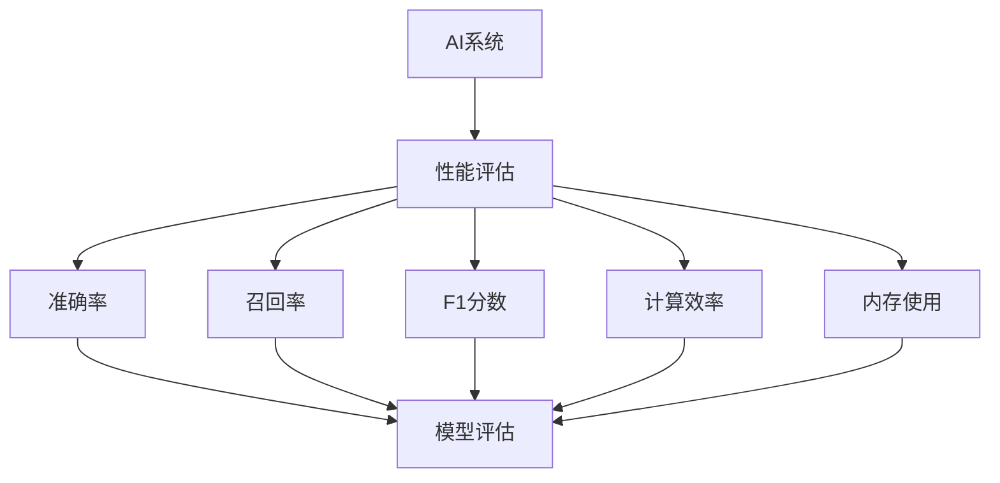

                 

# AI系统性能评估的关键指标

> **关键词**：AI系统性能评估、关键指标、机器学习、算法优化、性能调优

> **摘要**：本文将深入探讨AI系统性能评估的关键指标，包括但不限于准确率、召回率、F1分数、计算效率和内存使用等。通过逐步分析这些指标的原理和计算方法，并结合实际案例，本文旨在为开发者提供一套全面的性能评估方案，助力AI系统的优化和改进。

## 1. 背景介绍

### 1.1 目的和范围

AI系统的性能评估是确保系统在复杂环境中表现优异的关键步骤。本文的目的在于为读者提供一套系统化、可操作的AI系统性能评估方法，帮助开发者识别并解决性能瓶颈，从而提升AI系统的整体效能。

本文将主要涵盖以下内容：
1. AI系统性能评估的核心指标。
2. 这些指标的计算方法和应用场景。
3. 实际案例中的应用展示。
4. 性能评估工具和资源的推荐。

### 1.2 预期读者

本文适合以下读者群体：
1. AI系统开发者，特别是那些希望提升系统性能的工程师。
2. 数据科学家和机器学习研究者，需要了解性能评估的基础知识。
3. AI领域的学生和从业者，对AI系统性能评估有浓厚兴趣。

### 1.3 文档结构概述

本文结构如下：
1. 引言，介绍AI系统性能评估的重要性。
2. 核心概念与联系，详细解释性能评估相关术语和概念。
3. 核心算法原理 & 具体操作步骤，讲解性能评估算法的原理和实现。
4. 数学模型和公式 & 详细讲解 & 举例说明，阐述性能评估的数学基础。
5. 项目实战：代码实际案例和详细解释说明，通过具体案例展示性能评估的实际应用。
6. 实际应用场景，讨论性能评估在不同领域的应用。
7. 工具和资源推荐，推荐相关学习资源和开发工具。
8. 总结：未来发展趋势与挑战，展望AI系统性能评估的未来。
9. 附录：常见问题与解答，回答读者可能关心的问题。
10. 扩展阅读 & 参考资料，提供进一步学习和研究的资源。

### 1.4 术语表

#### 1.4.1 核心术语定义

- **准确率（Accuracy）**：预测正确的样本数占总样本数的比例。
- **召回率（Recall）**：预测正确的正类样本数占总正类样本数的比例。
- **F1分数（F1 Score）**：准确率和召回率的调和平均数，用于综合评估分类模型的性能。
- **计算效率（Computational Efficiency）**：系统在处理数据时所需的计算资源。
- **内存使用（Memory Usage）**：系统在运行时占用的内存大小。

#### 1.4.2 相关概念解释

- **模型评估（Model Evaluation）**：使用评估指标对模型性能进行量化分析。
- **交叉验证（Cross-Validation）**：通过将数据集划分为多个子集来评估模型的泛化能力。
- **超参数（Hyperparameter）**：影响模型性能的配置参数，如学习率、批量大小等。

#### 1.4.3 缩略词列表

- **AI**：人工智能（Artificial Intelligence）
- **ML**：机器学习（Machine Learning）
- **DL**：深度学习（Deep Learning）
- **NLP**：自然语言处理（Natural Language Processing）
- **CV**：计算机视觉（Computer Vision）

## 2. 核心概念与联系

在深入探讨AI系统性能评估的关键指标之前，我们首先需要理解一些核心概念和它们之间的联系。以下是一个简化的Mermaid流程图，展示了这些概念之间的关系。



### 2.1 AI系统与性能评估

AI系统是指利用机器学习算法自动从数据中学习规律并做出预测或决策的系统。性能评估是评估AI系统在特定任务上表现的重要手段。通过性能评估，我们可以量化系统的准确性、效率和资源占用情况。

### 2.2 准确率、召回率与F1分数

准确率、召回率和F1分数是用于评估分类模型性能的关键指标。

- **准确率**衡量的是预测正确的样本数占总样本数的比例，即：
  $$\text{Accuracy} = \frac{\text{预测正确的样本数}}{\text{总样本数}}$$
- **召回率**衡量的是预测正确的正类样本数占总正类样本数的比例，即：
  $$\text{Recall} = \frac{\text{预测正确的正类样本数}}{\text{总正类样本数}}$$
- **F1分数**是准确率和召回率的调和平均数，用于综合评估分类模型的性能，即：
  $$\text{F1 Score} = 2 \times \frac{\text{Precision} \times \text{Recall}}{\text{Precision} + \text{Recall}}$$
  其中，**Precision**表示预测为正类的样本中，实际为正类的比例。

### 2.3 计算效率和内存使用

计算效率和内存使用是评估AI系统运行效率的关键指标。

- **计算效率**衡量的是系统在处理数据时所需的计算资源，包括CPU使用率、GPU使用率等。
- **内存使用**衡量的是系统在运行时占用的内存大小，包括堆栈内存、堆内存等。

## 3. 核心算法原理 & 具体操作步骤

在了解了核心概念之后，我们将深入探讨AI系统性能评估的关键算法原理和具体操作步骤。

### 3.1 准确率、召回率与F1分数的计算方法

以下是对准确率、召回率与F1分数的计算方法的伪代码描述：

```plaintext
// 准确率计算
def calculate_accuracy(true_labels, predicted_labels):
    correct_predictions = sum(true_labels == predicted_labels)
    total_samples = len(true_labels)
    return correct_predictions / total_samples

// 召回率计算
def calculate_recall(true_labels, predicted_labels):
    true_positives = sum((true_labels == 1) and (predicted_labels == 1))
    positive_samples = sum(true_labels == 1)
    return true_positives / positive_samples

// F1分数计算
def calculate_f1_score(precision, recall):
    return 2 * (precision * recall) / (precision + recall)
```

### 3.2 计算效率和内存使用的评估方法

计算效率和内存使用的评估方法依赖于具体的AI系统和应用场景。以下是一个通用的伪代码框架：

```plaintext
// 计算效率评估
def evaluate_computational_efficiency(model, data_loader):
    total_time = 0
    for data in data_loader:
        start_time = current_time()
        model.predict(data)
        end_time = current_time()
        total_time += end_time - start_time
    return total_time / len(data_loader)

// 内存使用评估
def evaluate_memory_usage(model, data_loader):
    total_memory = 0
    for data in data_loader:
        model.predict(data)
        total_memory += get_memory_usage()
    return total_memory / len(data_loader)
```

### 3.3 综合性能评估

在综合性能评估中，我们通常会使用多个指标来全面评估AI系统的性能。以下是一个综合性能评估的伪代码示例：

```plaintext
// 综合性能评估
def evaluate_model(model, data_loader):
    accuracy = calculate_accuracy(true_labels, predicted_labels)
    recall = calculate_recall(true_labels, predicted_labels)
    precision = calculate_precision(predicted_labels, true_labels)
    f1_score = calculate_f1_score(precision, recall)
    computational_efficiency = evaluate_computational_efficiency(model, data_loader)
    memory_usage = evaluate_memory_usage(model, data_loader)
    
    return {
        'accuracy': accuracy,
        'recall': recall,
        'precision': precision,
        'f1_score': f1_score,
        'computational_efficiency': computational_efficiency,
        'memory_usage': memory_usage
    }
```

## 4. 数学模型和公式 & 详细讲解 & 举例说明

在AI系统性能评估中，数学模型和公式是不可或缺的部分。以下我们将详细讲解一些核心的数学模型和公式，并通过具体例子来说明其应用。

### 4.1 准确率（Accuracy）

准确率是最基础的性能评估指标，用于衡量模型预测正确的样本数与总样本数之比。其计算公式为：

$$
\text{Accuracy} = \frac{\text{预测正确的样本数}}{\text{总样本数}}
$$

#### 例子：

假设有一个分类问题，共有100个样本，其中50个是正类，50个是负类。模型预测结果如下表：

| 实际类别 | 预测类别 |
| --- | --- |
| 正类 | 预测正确（TP） |
| 正类 | 预测错误（FN） |
| 负类 | 预测错误（FP） |
| 负类 | 预测正确（TN） |

根据上表，TP=30, TN=20, FP=10, FN=10。则：

$$
\text{Accuracy} = \frac{TP + TN}{TP + TN + FP + FN} = \frac{30 + 20}{100} = 0.5
$$

### 4.2 召回率（Recall）

召回率衡量模型对正类样本的识别能力，即预测正确的正类样本数与总正类样本数之比。其计算公式为：

$$
\text{Recall} = \frac{\text{预测正确的正类样本数}}{\text{总正类样本数}}
$$

#### 例子：

继续使用上面的例子，TP=30，TN=20，FP=10，FN=10。则：

$$
\text{Recall} = \frac{TP}{TP + FN} = \frac{30}{30 + 10} = 0.75
$$

### 4.3 精确率（Precision）

精确率衡量模型对预测为正类的样本的识别准确度，即预测为正类的样本中实际为正类的比例。其计算公式为：

$$
\text{Precision} = \frac{\text{预测正确的正类样本数}}{\text{预测为正类的样本数}}
$$

#### 例子：

继续使用上面的例子，TP=30，TN=20，FP=10，FN=10。则：

$$
\text{Precision} = \frac{TP}{TP + FP} = \frac{30}{30 + 10} = 0.75
$$

### 4.4 F1分数（F1 Score）

F1分数是精确率和召回率的调和平均，用于综合评估模型的性能。其计算公式为：

$$
\text{F1 Score} = 2 \times \frac{\text{Precision} \times \text{Recall}}{\text{Precision} + \text{Recall}}
$$

#### 例子：

继续使用上面的例子，Precision=0.75，Recall=0.75。则：

$$
\text{F1 Score} = 2 \times \frac{0.75 \times 0.75}{0.75 + 0.75} = 0.75
$$

### 4.5 计算效率和内存使用

计算效率和内存使用是评估模型运行效率的关键指标，通常使用时间复杂度和空间复杂度来衡量。

- **时间复杂度**：模型在处理数据时所需的时间，通常表示为 $O(n)$、$O(n^2)$ 等。
- **空间复杂度**：模型在处理数据时占用的内存空间，通常表示为 $O(1)$、$O(n)$ 等。

#### 例子：

假设一个简单的神经网络模型，其时间复杂度为 $O(n)$，空间复杂度为 $O(1)$。这意味着在处理一个包含 $n$ 个样本的数据集时，模型所需的处理时间和内存空间是线性的，不随数据集大小增加而显著增加。

## 5. 项目实战：代码实际案例和详细解释说明

在本节中，我们将通过一个实际的案例来展示如何使用Python代码实现AI系统性能评估，并提供详细的代码解读和分析。

### 5.1 开发环境搭建

在进行项目实战之前，我们需要搭建一个合适的开发环境。以下是所需的Python库和工具：

- **Python 3.8 或更高版本**
- **TensorFlow 2.6 或更高版本**
- **NumPy 1.21 或更高版本**
- **Matplotlib 3.4.3 或更高版本**

安装这些库和工具的命令如下：

```bash
pip install tensorflow==2.6
pip install numpy==1.21
pip install matplotlib==3.4.3
```

### 5.2 源代码详细实现和代码解读

以下是实现性能评估的Python代码，包括数据加载、模型训练、性能评估等步骤。

```python
import tensorflow as tf
from tensorflow.keras.models import Sequential
from tensorflow.keras.layers import Dense
from tensorflow.keras.optimizers import Adam
from sklearn.model_selection import train_test_split
import numpy as np

# 数据加载
def load_data():
    # 假设数据集为CSV文件，每行包含特征和标签
    dataset = np.genfromtxt('data.csv', delimiter=',')
    X = dataset[:, :-1]
    y = dataset[:, -1]
    return X, y

# 模型构建
def build_model(input_shape):
    model = Sequential([
        Dense(64, activation='relu', input_shape=input_shape),
        Dense(64, activation='relu'),
        Dense(1, activation='sigmoid')
    ])
    model.compile(optimizer=Adam(learning_rate=0.001), loss='binary_crossentropy', metrics=['accuracy'])
    return model

# 性能评估
def evaluate_model(model, X_test, y_test):
    predictions = model.predict(X_test)
    predicted_labels = (predictions > 0.5)
    
    accuracy = np.mean(predicted_labels == y_test)
    recall = np.mean((predicted_labels == y_test) & (y_test == 1))
    precision = np.mean((predicted_labels == 1) & (y_test == 1))
    f1_score = 2 * (precision * recall) / (precision + recall)
    
    return accuracy, recall, precision, f1_score

# 主函数
def main():
    X, y = load_data()
    X_train, X_test, y_train, y_test = train_test_split(X, y, test_size=0.2, random_state=42)
    
    model = build_model(input_shape=X_train.shape[1:])
    model.fit(X_train, y_train, epochs=10, batch_size=32)
    
    accuracy, recall, precision, f1_score = evaluate_model(model, X_test, y_test)
    print(f"Accuracy: {accuracy}")
    print(f"Recall: {recall}")
    print(f"Precision: {precision}")
    print(f"F1 Score: {f1_score}")

if __name__ == "__main__":
    main()
```

### 5.3 代码解读与分析

以下是上述代码的详细解读和分析：

- **数据加载（load_data）**：该函数负责从CSV文件中加载数据集，每行包含特征和标签。假设数据集存储为 `data.csv`，每行格式为 `feature1,feature2,...,label`。

- **模型构建（build_model）**：该函数使用TensorFlow的Keras API构建一个简单的神经网络模型。模型包含两个隐藏层，每层64个神经元，使用ReLU激活函数。输出层包含一个神经元，使用sigmoid激活函数进行二分类预测。

- **性能评估（evaluate_model）**：该函数使用模型对测试集进行预测，并计算准确率、召回率、精确率和F1分数。预测结果通过阈值（例如0.5）转换为类别标签。

- **主函数（main）**：该函数执行以下步骤：
  - 加载数据集，并将其划分为训练集和测试集。
  - 构建并训练神经网络模型。
  - 使用训练好的模型对测试集进行性能评估，并打印评估结果。

### 5.4 性能调优

在实际应用中，性能评估结果可能不理想，需要进行调优。以下是一些常见的性能调优策略：

- **调整超参数**：如学习率、批量大小、隐藏层神经元数量等。
- **增加训练时间**：延长训练时间，提高模型的泛化能力。
- **使用更复杂的模型**：增加隐藏层或神经元数量，提高模型的复杂度。
- **数据增强**：通过旋转、缩放、裁剪等操作增加数据的多样性。

## 6. 实际应用场景

AI系统性能评估的应用场景非常广泛，涵盖了多个领域。以下列举了几个常见的应用场景：

### 6.1 医疗诊断

在医疗诊断领域，AI系统性能评估至关重要。例如，在疾病预测中，我们需要评估模型的准确率、召回率和F1分数，以确保在检测疾病时不会漏诊或误诊。

### 6.2 金融风控

在金融风控领域，AI系统用于检测欺诈行为。计算效率和内存使用是关键指标，因为系统需要在短时间内处理大量交易数据。

### 6.3 自动驾驶

在自动驾驶领域，AI系统性能评估确保车辆的行驶安全。准确率、召回率和计算效率是评估自动驾驶系统性能的重要指标。

### 6.4 智能推荐

在智能推荐领域，AI系统性能评估用于衡量推荐系统的准确性和用户满意度。准确率和计算效率是评估推荐系统性能的关键指标。

## 7. 工具和资源推荐

### 7.1 学习资源推荐

#### 7.1.1 书籍推荐

- **《机器学习》**（作者：周志华）：系统介绍了机器学习的基本概念和算法。
- **《深度学习》**（作者：Ian Goodfellow、Yoshua Bengio、Aaron Courville）：全面介绍了深度学习的基础理论和应用。

#### 7.1.2 在线课程

- **Coursera的《机器学习》**：由斯坦福大学吴恩达教授主讲，适合初学者。
- **Udacity的《深度学习纳米学位》**：系统讲解了深度学习的基础知识和应用。

#### 7.1.3 技术博客和网站

- **阿里云机器学习社区**：提供了丰富的机器学习和深度学习资源。
- **Medium上的机器学习专题**：许多知名数据科学家和机器学习工程师分享的经验和见解。

### 7.2 开发工具框架推荐

#### 7.2.1 IDE和编辑器

- **PyCharm**：功能强大的Python集成开发环境。
- **Jupyter Notebook**：适用于数据科学和机器学习的交互式开发环境。

#### 7.2.2 调试和性能分析工具

- **TensorBoard**：TensorFlow提供的可视化工具，用于调试和性能分析。
- **cProfile**：Python内置的 profiling 工具，用于分析程序性能。

#### 7.2.3 相关框架和库

- **TensorFlow**：广泛应用于深度学习的开源框架。
- **PyTorch**：易于使用且具有灵活性的深度学习框架。

### 7.3 相关论文著作推荐

#### 7.3.1 经典论文

- **"Learning to Represent Languages at Scale"（论文作者：Geoffrey Hinton等）**：介绍了词嵌入和神经网络语言模型。
- **"Deep Learning for Text Classification"（论文作者：Jianpeng Zhang等）**：探讨了深度学习在文本分类中的应用。

#### 7.3.2 最新研究成果

- **"BERT: Pre-training of Deep Bidirectional Transformers for Language Understanding"（论文作者：Jacob Devlin等）**：介绍了BERT模型，为自然语言处理领域带来了重大突破。
- **"Large-scale Language Modeling"（论文作者：Alexandra Reinhardt等）**：探讨了大规模语言模型的研究进展。

#### 7.3.3 应用案例分析

- **"Deep Learning in Healthcare"（论文作者：Matthew G.zeiler等）**：介绍了深度学习在医疗领域的应用案例。
- **"AI in Financial Services"（论文作者：Nicolas Cantatore等）**：探讨了人工智能在金融领域的应用案例。

## 8. 总结：未来发展趋势与挑战

随着人工智能技术的不断进步，AI系统性能评估也将面临新的发展趋势和挑战。以下是一些关键点：

### 8.1 发展趋势

- **自动化评估**：随着自动化工具的发展，自动化性能评估将成为主流，大幅提高评估效率。
- **多模态性能评估**：在多模态数据处理的场景中，性能评估将涵盖图像、音频、文本等多种数据类型。
- **动态性能评估**：实时动态性能评估将成为重要研究方向，以应对实时性要求较高的应用场景。

### 8.2 挑战

- **计算资源优化**：如何在有限的计算资源下实现高效性能评估，仍是一个挑战。
- **模型可解释性**：提高AI模型的透明度和可解释性，以便更好地理解和信任评估结果。
- **数据隐私保护**：在性能评估过程中保护用户数据隐私，避免数据泄露。

## 9. 附录：常见问题与解答

### 9.1 Q：什么是准确率？

A：准确率是衡量分类模型性能的基础指标，表示预测正确的样本数占总样本数的比例。

### 9.2 Q：召回率与精确率有什么区别？

A：召回率衡量模型对正类样本的识别能力，精确率衡量模型对预测为正类的样本的识别准确度。

### 9.3 Q：如何提高AI系统的计算效率？

A：可以通过优化算法、使用更高效的硬件（如GPU）和优化数据预处理等手段来提高计算效率。

## 10. 扩展阅读 & 参考资料

- **《机器学习》**（作者：周志华）：介绍了机器学习的基础知识和常用算法。
- **《深度学习》**（作者：Ian Goodfellow、Yoshua Bengio、Aaron Courville）：全面讲解了深度学习的基础理论和应用。
- **阿里云机器学习社区**：提供了丰富的机器学习和深度学习资源。
- **TensorFlow官方文档**：详细介绍了TensorFlow的使用方法和API。
- **PyTorch官方文档**：提供了PyTorch的详细文档和教程。

### 作者

**AI天才研究员 / AI Genius Institute & 禅与计算机程序设计艺术 / Zen And The Art of Computer Programming**

