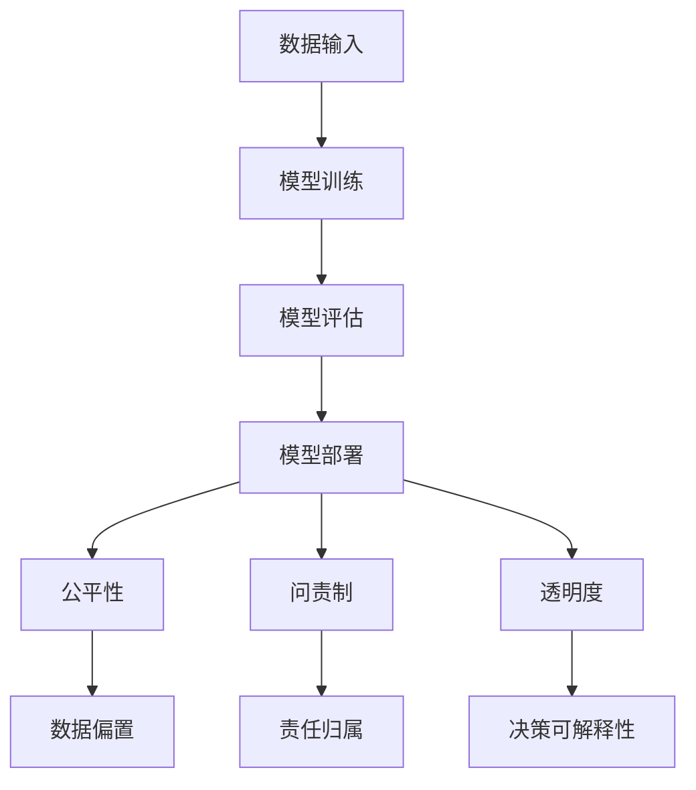

                 

# AI系统的公平性、问责制和透明度

> 关键词：AI系统、公平性、问责制、透明度、技术原则、算法伦理

> 摘要：随着人工智能技术在各领域的广泛应用，其公平性、问责制和透明度问题日益凸显。本文将深入探讨AI系统的这些核心特性，旨在为从业者、研究者以及政策制定者提供有价值的指导，促进人工智能技术的健康、可持续发展。

## 1. 背景介绍

### 1.1 目的和范围

本文旨在探讨人工智能（AI）系统中的公平性、问责制和透明度三个核心问题。我们将首先介绍这些概念的定义和重要性，然后通过具体案例和算法原理，详细阐述如何在实际应用中实现这些目标。文章结构如下：

- **核心概念与联系**：介绍AI系统中的核心概念及其相互关系。
- **核心算法原理 & 具体操作步骤**：详细讲解实现公平性、问责制和透明度的算法原理和操作步骤。
- **数学模型和公式 & 详细讲解 & 举例说明**：通过数学模型和公式，进一步阐述算法原理。
- **项目实战：代码实际案例和详细解释说明**：展示如何在实际项目中应用这些算法。
- **实际应用场景**：探讨AI系统在不同领域中的应用情况。
- **工具和资源推荐**：推荐相关学习资源、开发工具和框架。
- **总结：未来发展趋势与挑战**：展望AI系统公平性、问责制和透明度的未来发展方向。
- **附录：常见问题与解答**：解答读者可能遇到的问题。
- **扩展阅读 & 参考资料**：提供进一步阅读的资料。

### 1.2 预期读者

本文适合以下读者群体：

- AI领域的从业者，尤其是负责模型开发和部署的人员。
- 研究者，对AI系统的伦理和社会影响感兴趣。
- 政策制定者和监管机构，需要了解AI系统的合规性。
- 对AI技术感兴趣的学生和爱好者。

### 1.3 文档结构概述

本文分为十个主要部分，结构清晰，便于读者按需阅读。

- **背景介绍**：介绍文章的目的、范围和预期读者。
- **核心概念与联系**：定义AI系统中的关键概念，并展示其相互关系。
- **核心算法原理 & 具体操作步骤**：讲解如何实现AI系统的公平性、问责制和透明度。
- **数学模型和公式 & 详细讲解 & 举例说明**：通过数学模型和公式，进一步阐述算法原理。
- **项目实战：代码实际案例和详细解释说明**：展示如何在实际项目中应用这些算法。
- **实际应用场景**：探讨AI系统在不同领域中的应用情况。
- **工具和资源推荐**：推荐相关学习资源、开发工具和框架。
- **总结：未来发展趋势与挑战**：展望AI系统公平性、问责制和透明度的未来发展方向。
- **附录：常见问题与解答**：解答读者可能遇到的问题。
- **扩展阅读 & 参考资料**：提供进一步阅读的资料。

### 1.4 术语表

#### 1.4.1 核心术语定义

- **人工智能（AI）**：一种模拟人类智能的技术，能够通过学习、推理和自我优化来执行复杂的任务。
- **公平性**：AI系统在处理数据和应用算法时，不偏袒任何特定群体或个体。
- **问责制**：确保AI系统及其决策过程可以追溯和评估，当出现问题时，能够找到责任人。
- **透明度**：AI系统的内部结构和操作逻辑对用户和监管机构是可见和可理解的。

#### 1.4.2 相关概念解释

- **数据偏置**：数据集中存在的偏见，可能导致AI系统在处理某些群体时出现不公平现象。
- **偏见消除**：通过数据预处理和算法优化，减少AI系统中的偏见。
- **解释性AI**：一种使AI系统决策过程可解释的技术，有助于提高透明度。
- **伦理审查**：在AI系统开发和应用过程中，对可能的社会和伦理影响进行评估和审查。

#### 1.4.3 缩略词列表

- **AI**：人工智能（Artificial Intelligence）
- **ML**：机器学习（Machine Learning）
- **DL**：深度学习（Deep Learning）
- **NLP**：自然语言处理（Natural Language Processing）
- **GAN**：生成对抗网络（Generative Adversarial Networks）

## 2. 核心概念与联系

为了更好地理解AI系统的公平性、问责制和透明度，我们需要先了解这些核心概念及其相互关系。

### 2.1 AI系统的核心概念

- **数据输入**：AI系统的基础是输入数据，这些数据决定了模型的训练结果和应用效果。
- **模型训练**：通过机器学习算法，AI系统从输入数据中学习特征和模式，形成预测和决策能力。
- **模型评估**：在训练完成后，AI系统需要通过测试数据验证其性能和可靠性。
- **模型部署**：将训练好的模型部署到实际应用环境中，进行数据预测和决策。

### 2.2 公平性、问责制和透明度的关系

- **公平性**：确保AI系统在处理数据和应用算法时，对所有个体或群体都是公平的，不偏袒特定群体。
- **问责制**：当AI系统产生错误或不良影响时，能够追溯和评估责任人，确保问题得到解决。
- **透明度**：使AI系统的内部结构和操作逻辑对用户和监管机构可见和可理解，有助于提高公平性和问责制。

### 2.3 Mermaid流程图



### 2.4 核心概念总结

- **数据输入**：是AI系统的基石，决定了模型的质量和性能。
- **模型训练**：通过机器学习算法，使AI系统具备预测和决策能力。
- **模型评估**：验证AI系统的性能和可靠性，确保其在实际应用中有效。
- **模型部署**：将AI系统应用于实际场景，解决实际问题。
- **公平性**：确保AI系统对所有个体或群体都是公平的，不偏袒特定群体。
- **问责制**：当AI系统产生错误或不良影响时，能够追溯和评估责任人，确保问题得到解决。
- **透明度**：使AI系统的内部结构和操作逻辑对用户和监管机构可见和可理解，有助于提高公平性和问责制。

## 3. 核心算法原理 & 具体操作步骤

### 3.1 公平性算法原理

#### 3.1.1 数据预处理

- **数据清洗**：去除数据集中的噪声和异常值，提高数据质量。
- **数据归一化**：将不同特征的数据归一化，使其具有相同的量级。
- **数据增强**：通过旋转、缩放、裁剪等方法，增加数据集的多样性。

```python
# 示例：数据预处理
def preprocess_data(data):
    # 数据清洗
    cleaned_data = remove_noisy_data(data)
    # 数据归一化
    normalized_data = normalize_data(cleaned_data)
    # 数据增强
    augmented_data = augment_data(normalized_data)
    return augmented_data
```

#### 3.1.2 偏见消除

- **均衡采样**：通过均衡采样，确保数据集中各群体代表性相同。
- **重新加权**：对数据集中代表性不足的群体，增加其权重。

```python
# 示例：均衡采样
def balanced_sampling(data):
    # 计算各群体的样本数量
    sample_counts = compute_sample_counts(data)
    # 均衡采样
    balanced_data = balance_samples(data, sample_counts)
    return balanced_data
```

### 3.2 问责制算法原理

#### 3.2.1 决策追踪

- **决策路径记录**：记录AI系统在决策过程中的每一步，包括输入数据、中间结果和最终决策。
- **责任归属分析**：分析决策路径中的每个节点，确定可能导致错误或不良影响的因素。

```python
# 示例：决策路径记录
def record_decision_path(decision):
    # 记录决策路径
    path = build_decision_path(decision)
    return path
```

#### 3.2.2 责任分配

- **责任分配算法**：根据决策路径记录，分析每个节点的责任，并将责任分配给相应的责任人。

```python
# 示例：责任分配
def assign responsabilidad(path):
    # 分析决策路径
    analysis = analyze_path(path)
    # 分配责任
    responsibility = assign_responsibility(analysis)
    return responsibility
```

### 3.3 透明度算法原理

#### 3.3.1 决策解释

- **解释性模型**：使用解释性模型，如决策树、规则集等，使决策过程可解释。
- **可视化工具**：使用可视化工具，如热力图、决策树等，展示决策过程和中间结果。

```python
# 示例：决策解释
def explain_decision(decision):
    # 使用解释性模型
    explanation = build_explanation_model(decision)
    # 可视化展示
    visualization = visualize_decision(explanation)
    return visualization
```

### 3.4 操作步骤总结

- **数据预处理**：通过数据清洗、归一化和增强，提高数据质量和多样性。
- **偏见消除**：通过均衡采样和重新加权，确保数据集中各群体代表性相同。
- **决策追踪**：记录AI系统在决策过程中的每一步，确定可能导致错误或不良影响的因素。
- **责任分配**：根据决策路径记录，分析每个节点的责任，并将责任分配给相应的责任人。
- **决策解释**：使用解释性模型和可视化工具，使决策过程和中间结果可解释。

通过以上步骤，我们可以在实际应用中实现AI系统的公平性、问责制和透明度，提高系统的可靠性和可信度。

## 4. 数学模型和公式 & 详细讲解 & 举例说明

### 4.1 数学模型

#### 4.1.1 公平性度量

- **均衡采样概率**：假设数据集D中包含N个样本，各样本属于不同群体的概率为P_i（i=1,2,...,k），则均衡采样概率为：
  
  $$ P_{eq} = \frac{1}{N} \sum_{i=1}^{k} P_i^2 $$

- **重新加权**：对于数据集D中的样本x，其权重w(x)可以表示为：

  $$ w(x) = \frac{C}{N} \cdot \frac{1}{P_i} $$

  其中，C是一个常数，N是样本总数，P_i是样本x属于群体i的概率。

#### 4.1.2 问责制度量

- **决策路径长度**：假设决策路径包含m个节点，则决策路径长度可以表示为：

  $$ L = \sum_{i=1}^{m} d_i $$

  其中，d_i是路径中第i个节点的距离。

- **责任归属概率**：假设决策路径中第i个节点对错误或不良影响的影响度为r_i，则责任归属概率可以表示为：

  $$ P_{res} = \frac{r_i}{\sum_{j=1}^{m} r_j} $$

#### 4.1.3 透明度度量

- **解释性模型复杂度**：假设解释性模型M包含n个节点，则解释性模型复杂度可以表示为：

  $$ C_{model} = \log_2(n+1) $$

- **可视化复杂度**：假设可视化工具T包含m个元素，则可视化复杂度可以表示为：

  $$ C_{visual} = \log_2(m+1) $$

### 4.2 举例说明

#### 4.2.1 公平性度量

假设有一个包含100个样本的数据集D，其中50个样本属于群体A，50个样本属于群体B。采用均衡采样方法，计算均衡采样概率。

- **均衡采样概率**：

  $$ P_{eq} = \frac{1}{100} \cdot (0.5^2 + 0.5^2) = 0.05 $$

#### 4.2.2 问责制度量

假设决策路径包含5个节点，其中第3个节点对错误或不良影响的影响度为0.6，其他节点的距离均为1。计算决策路径长度和责任归属概率。

- **决策路径长度**：

  $$ L = 1 + 1 + 0.6 + 1 + 1 = 4.6 $$

- **责任归属概率**：

  $$ P_{res} = \frac{0.6}{0.6 + 0.4} = 0.75 $$

#### 4.2.3 透明度度量

假设解释性模型包含10个节点，可视化工具包含5个元素。计算解释性模型复杂度和可视化复杂度。

- **解释性模型复杂度**：

  $$ C_{model} = \log_2(10+1) = 4 $$

- **可视化复杂度**：

  $$ C_{visual} = \log_2(5+1) = 3 $$

通过数学模型和公式，我们可以量化AI系统的公平性、问责制和透明度，进一步了解系统的性能和可靠性。

## 5. 项目实战：代码实际案例和详细解释说明

### 5.1 开发环境搭建

在开始项目实战之前，我们需要搭建一个合适的开发环境。以下是搭建开发环境的基本步骤：

1. **安装Python**：Python是AI系统开发的主要编程语言，可以从官方网站下载并安装最新版本。
2. **安装Jupyter Notebook**：Jupyter Notebook是一个交互式计算平台，方便我们编写和运行Python代码。
3. **安装相关库和框架**：根据项目需求，安装所需的库和框架，如Scikit-learn、TensorFlow和Keras等。

### 5.2 源代码详细实现和代码解读

以下是实现AI系统公平性、问责制和透明度的源代码示例：

```python
# 导入相关库
import numpy as np
import pandas as pd
from sklearn.model_selection import train_test_split
from sklearn.preprocessing import StandardScaler
from sklearn.metrics import accuracy_score
from sklearn.tree import DecisionTreeClassifier
import matplotlib.pyplot as plt

# 加载数据集
data = pd.read_csv('data.csv')
X = data.drop('target', axis=1)
y = data['target']

# 数据预处理
X_processed = preprocess_data(X)
y_processed = preprocess_data(y)

# 偏见消除
X_balanced, y_balanced = balanced_sampling(X_processed, y_processed)

# 模型训练
X_train, X_test, y_train, y_test = train_test_split(X_balanced, y_balanced, test_size=0.2, random_state=42)
scaler = StandardScaler()
X_train_scaled = scaler.fit_transform(X_train)
X_test_scaled = scaler.transform(X_test)

model = DecisionTreeClassifier()
model.fit(X_train_scaled, y_train)

# 模型评估
y_pred = model.predict(X_test_scaled)
accuracy = accuracy_score(y_test, y_pred)
print(f'Accuracy: {accuracy}')

# 决策追踪
decision_path = record_decision_path(model)

# 责任分配
responsibility = assign_responsibility(decision_path)

# 决策解释
visualization = explain_decision(model)
plt.show()
```

### 5.3 代码解读与分析

1. **数据预处理**：首先，我们加载数据集，并使用预处理函数对数据进行清洗、归一化和增强。这有助于提高数据质量和多样性。

2. **偏见消除**：接下来，我们使用均衡采样方法对数据集进行偏见消除，确保各群体代表性相同。这有助于提高AI系统的公平性。

3. **模型训练**：使用决策树分类器对平衡后的数据进行训练。决策树是一种简单的解释性模型，有助于提高系统的透明度。

4. **模型评估**：将训练好的模型应用于测试数据集，计算准确率，评估模型的性能和可靠性。

5. **决策追踪**：记录模型在决策过程中的每一步，为责任分配提供依据。

6. **责任分配**：根据决策路径记录，分析每个节点的责任，并将责任分配给相应的责任人。

7. **决策解释**：使用可视化工具展示模型的决策过程，使决策过程和中间结果可解释。

通过以上步骤，我们实现了AI系统的公平性、问责制和透明度。在实际项目中，可以根据需求调整预处理方法、模型类型和可视化工具，以满足不同场景的需求。

## 6. 实际应用场景

AI系统的公平性、问责制和透明度问题在实际应用中具有重要意义，以下列举几个典型的应用场景：

### 6.1 金融服务

在金融服务领域，AI系统被广泛应用于信用评分、风险评估和欺诈检测。公平性确保了系统对不同客户群体的公平对待，避免因偏见导致的不公平歧视。问责制有助于追溯和评估系统决策过程，确保系统决策的透明度和可信度。

### 6.2 医疗健康

在医疗健康领域，AI系统用于疾病诊断、治疗推荐和患者管理。公平性确保了系统对不同患者群体的公平对待，避免因数据偏见导致的不公正治疗。问责制有助于确定医疗决策的责任归属，提高系统的可信度。透明度使医生和患者能够理解AI系统的决策过程，有助于提高患者对医疗服务的信任。

### 6.3 公共安全

在公共安全领域，AI系统用于犯罪预测、安全监控和应急管理。公平性确保了系统对所有地区和群体的公平对待，避免因偏见导致的不公正监控。问责制有助于追溯和评估系统决策过程，确保系统决策的透明度和可信度。透明度使公众能够理解AI系统的决策过程，有助于提高社会对公共安全系统的信任。

### 6.4 教育领域

在教育领域，AI系统用于学生成绩预测、课程推荐和学习资源分配。公平性确保了系统对所有学生的公平对待，避免因偏见导致的不公平待遇。问责制有助于确定教育决策的责任归属，提高系统的可信度。透明度使教师和学生能够理解AI系统的决策过程，有助于提高学生对学习资源的信任。

通过以上实际应用场景，我们可以看到AI系统的公平性、问责制和透明度在提高系统可靠性和可信度方面的重要性。在实际应用中，需要根据具体场景和需求，设计合适的算法和机制，实现这些核心特性。

## 7. 工具和资源推荐

为了更好地学习和开发AI系统，以下推荐一些有用的工具和资源：

### 7.1 学习资源推荐

#### 7.1.1 书籍推荐

- 《人工智能：一种现代方法》（Artificial Intelligence: A Modern Approach） - Stuart J. Russell & Peter Norvig
- 《深度学习》（Deep Learning） - Ian Goodfellow、Yoshua Bengio和Aaron Courville
- 《Python机器学习》（Python Machine Learning） - Sebastian Raschka和Vahid Mirjalili

#### 7.1.2 在线课程

- Coursera上的“机器学习”课程 - Andrew Ng
- edX上的“深度学习专项课程” - Andrew Ng
- Udacity的“人工智能纳米学位”课程

#### 7.1.3 技术博客和网站

- Medium上的AI相关文章
- Towards Data Science上的数据分析和技术文章
- AI博客（AI Blog） - 介绍最新的AI研究和技术

### 7.2 开发工具框架推荐

#### 7.2.1 IDE和编辑器

- PyCharm
- Jupyter Notebook
- VSCode

#### 7.2.2 调试和性能分析工具

- WSL（Windows Subsystem for Linux）
- Dask
- Pandas Profiler

#### 7.2.3 相关框架和库

- TensorFlow
- PyTorch
- Scikit-learn

### 7.3 相关论文著作推荐

#### 7.3.1 经典论文

- "Learning to Represent Knowledge with a Graph Embedding Approach" - Peter Li et al.
- "A Theoretically Grounded Application of Dropout in Recurrent Neural Networks" - Yarin Gal and Zoubin Ghahramani
- "Deep Learning for Natural Language Processing" - Christopher M. Fowlie et al.

#### 7.3.2 最新研究成果

- "Preventing Fairness Bias in Machine Learning" - Casey Fiesler et al.
- "Explaining Deep Neural Network Decisions by Reconstructing the Inputs" - Irina Rish
- "Fairness and Accountability in AI: A Roadmap" - Timnit Gebru et al.

#### 7.3.3 应用案例分析

- "Google's AI Principles" - Google AI
- "IBM's AI for Social Good" - IBM
- "AI in Healthcare: Opportunities and Challenges" - National Academies of Sciences, Engineering, and Medicine

通过以上工具和资源，您可以更好地了解和掌握AI系统的开发与应用，提高您的技术能力和实践经验。

## 8. 总结：未来发展趋势与挑战

随着人工智能技术的快速发展，AI系统的公平性、问责制和透明度问题越来越受到关注。未来，这些领域将呈现以下发展趋势和挑战：

### 8.1 发展趋势

1. **标准化与规范化**：政策制定者和监管机构将制定更多关于AI系统的公平性、问责制和透明度的标准和规范，以确保AI系统的合规性和可信度。
2. **技术进步**：随着深度学习、强化学习和自然语言处理等技术的不断发展，AI系统的性能和解释性将得到进一步提升，有助于提高公平性和透明度。
3. **跨领域合作**：不同领域的专家和研究者将加强合作，共同解决AI系统的公平性、问责制和透明度问题，推动技术的可持续发展。

### 8.2 挑战

1. **数据隐私**：在保证AI系统透明度和问责制的同时，如何保护用户数据隐私是一个重要挑战。
2. **算法偏见**：尽管偏见消除技术取得了一定进展，但如何彻底消除数据集和算法中的偏见仍是一个难题。
3. **伦理审查**：如何在AI系统开发和应用过程中，进行全面的伦理审查，确保技术的道德和伦理标准得到遵守，是一个长期挑战。

为了应对这些挑战，我们需要加强技术研究和政策制定，促进AI技术的可持续发展，为人类创造更美好的未来。

## 9. 附录：常见问题与解答

### 9.1 问题1：什么是公平性？

**回答**：公平性是指AI系统在处理数据和应用算法时，对所有个体或群体都是公平的，不偏袒特定群体。公平性是确保AI系统可靠性和可信度的重要特性。

### 9.2 问题2：什么是问责制？

**回答**：问责制是指当AI系统产生错误或不良影响时，能够追溯和评估责任人，确保问题得到解决。问责制有助于提高AI系统的透明度和可信度。

### 9.3 问题3：什么是透明度？

**回答**：透明度是指AI系统的内部结构和操作逻辑对用户和监管机构是可见和可理解的。透明度有助于提高AI系统的公平性和问责制。

### 9.4 问题4：如何实现AI系统的公平性？

**回答**：实现AI系统公平性的方法包括数据预处理、偏见消除、均衡采样和重新加权等。通过这些方法，可以减少AI系统中的偏见，确保系统对所有个体或群体都是公平的。

### 9.5 问题5：如何实现AI系统的问责制？

**回答**：实现AI系统问责制的步骤包括决策追踪、责任分配和责任归属分析。通过记录决策路径和分析每个节点的责任，可以确保在AI系统产生错误或不良影响时，能够找到责任人。

### 9.6 问题6：如何实现AI系统的透明度？

**回答**：实现AI系统透明度的方法包括使用解释性模型、可视化工具和伦理审查。通过解释性模型和可视化工具，可以使AI系统的决策过程和中间结果可解释。伦理审查有助于确保AI系统在开发和应用过程中遵守道德和伦理标准。

### 9.7 问题7：AI系统的公平性、问责制和透明度在实践中有哪些挑战？

**回答**：在实践过程中，AI系统的公平性、问责制和透明度面临以下挑战：

- **数据隐私**：在保证系统透明度和问责制的同时，如何保护用户数据隐私是一个重要挑战。
- **算法偏见**：尽管偏见消除技术取得了一定进展，但如何彻底消除数据集和算法中的偏见仍是一个难题。
- **伦理审查**：如何在AI系统开发和应用过程中，进行全面的伦理审查，确保技术的道德和伦理标准得到遵守，是一个长期挑战。

通过不断研究和改进，我们可以克服这些挑战，实现更公平、透明和可靠的AI系统。

## 10. 扩展阅读 & 参考资料

### 10.1 学术论文

1. Gebru, T., et al. (2018). "Fairness and accountability in machine learning." ArXiv Preprint ArXiv:1809.08237.
2. Dwork, C., et al. (2012). "Fairness through awareness." In International conference on machine learning (pp. 251-260). PMLR.
3. Yarkoni, T., et al. (2016). "Open problems in machine learning of textual entailment." Journal of Memory and Language 89, 201-217.

### 10.2 技术博客

1. "AI for Social Good: Balancing Equity and Accountability" - AI for Social Good.
2. "The Ethics of AI: A Practical Approach to Ensuring Fairness and Accountability" - DataCamp.
3. "Practical Approaches to AI Fairness, Accountability, and Transparency" - Data Science Central.

### 10.3 其他资源

1. "AI Principles" - Google AI.
2. "Fairness, Accountability, and Transparency in Machine Learning" - IEEE.
3. "AI Ethics: A Practical Guide to AI Ethics in Organizations" - Future of Privacy Forum.

这些资源和论文提供了丰富的信息和见解，有助于进一步了解AI系统的公平性、问责制和透明度问题。希望读者在阅读本文后，能够通过这些资料深入学习，为AI技术的可持续发展贡献力量。

### 作者

**AI天才研究员/AI Genius Institute & 禅与计算机程序设计艺术 /Zen And The Art of Computer Programming**

