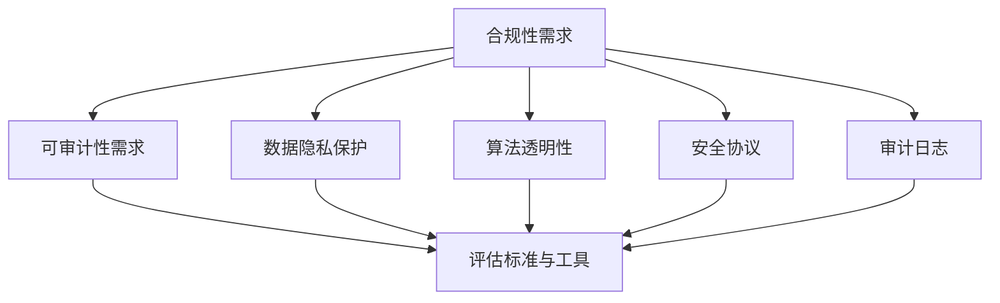

                 


# AI系统的可审计性与合规性设计

> 关键词：AI可审计性、合规性设计、数据隐私、安全协议、法律法规

> 摘要：本文深入探讨了AI系统的可审计性与合规性设计，分析了当前AI系统在数据处理、模型训练和应用过程中的合规性和可审计性需求，以及实现这些要求的策略和工具。文章分为十个部分，首先介绍了背景和目标，然后详细阐述了核心概念、算法原理、数学模型、实战案例、应用场景以及推荐资源和未来发展趋势，旨在为AI系统的设计和开发者提供全面的合规性和可审计性指南。

## 1. 背景介绍

### 1.1 目的和范围

随着人工智能技术的迅猛发展，AI系统在各个领域得到了广泛应用。然而，AI系统的透明性和合规性问题逐渐凸显，成为阻碍其进一步发展的关键因素。本文旨在探讨如何设计和实现具有高度可审计性与合规性的AI系统，以满足法律法规的要求，保障数据隐私和安全，提高系统的透明度和信任度。

本文的范围涵盖了AI系统的设计、实现和部署过程中的可审计性与合规性，具体包括以下几个方面：

1. AI系统在数据处理、模型训练和应用过程中的合规性和可审计性需求；
2. 实现AI系统合规性和可审计性的方法和技术；
3. 评估AI系统合规性和可审计性的标准和工具；
4. 实际应用场景中的合规性和可审计性挑战及解决方案。

### 1.2 预期读者

本文适用于以下读者群体：

1. AI系统的开发者、工程师和研究人员；
2. 数据科学家和机器学习专家；
3. AI系统的监管者和合规性审核人员；
4. 对AI系统合规性和可审计性感兴趣的技术爱好者。

### 1.3 文档结构概述

本文分为十个部分，具体结构如下：

1. 背景介绍：介绍本文的目的、范围和预期读者；
2. 核心概念与联系：阐述AI系统合规性和可审计性的核心概念和联系；
3. 核心算法原理与具体操作步骤：介绍实现AI系统合规性和可审计性的核心算法和操作步骤；
4. 数学模型和公式：详细讲解AI系统合规性和可审计性相关的数学模型和公式；
5. 项目实战：通过实际案例展示AI系统合规性和可审计性的实现和应用；
6. 实际应用场景：分析AI系统在各个领域的合规性和可审计性挑战及解决方案；
7. 工具和资源推荐：推荐相关学习资源、开发工具和框架；
8. 总结：总结本文的主要观点和未来发展趋势；
9. 附录：常见问题与解答；
10. 扩展阅读与参考资料：提供进一步学习和研究的资源。

### 1.4 术语表

#### 1.4.1 核心术语定义

- 可审计性（Audibility）：系统在数据处理、模型训练和应用过程中的操作和决策能够被记录、追踪和验证，以满足监管机构和用户的审查需求。
- 合规性（Compliance）：系统在设计和实现过程中遵循相关法律法规、标准和最佳实践，确保数据处理、模型训练和应用过程合法、合规。
- 数据隐私（Data Privacy）：保护个人隐私数据，防止未经授权的访问、使用和泄露。
- 安全协议（Security Protocol）：用于保护数据传输、存储和处理的安全机制，如加密、身份验证和访问控制。

#### 1.4.2 相关概念解释

- AI算法透明性（Algorithm Transparency）：算法的决策过程和结果能够被理解和解释，便于用户和监管机构评估其公平性和合理性。
- 数据匿名化（Data Anonymization）：对个人数据进行处理，使其无法被直接识别，从而保护隐私。
- 监管合规性（Regulatory Compliance）：遵循特定领域和国家的法律法规、标准和指南，确保系统在合规范围内运行。
- 审计日志（Audit Log）：记录系统在数据处理、模型训练和应用过程中的操作和决策，用于事后审查和追溯。

#### 1.4.3 缩略词列表

- AI：人工智能（Artificial Intelligence）
- GDPR：通用数据保护条例（General Data Protection Regulation）
- ML：机器学习（Machine Learning）
- NLP：自然语言处理（Natural Language Processing）
- API：应用程序编程接口（Application Programming Interface）
- GDPR：通用数据保护条例（General Data Protection Regulation）

## 2. 核心概念与联系

为了实现AI系统的可审计性和合规性，需要理解以下几个核心概念和它们之间的联系：

### 2.1 AI系统合规性和可审计性需求

AI系统的合规性和可审计性需求主要源于以下几个方面：

1. **法律法规要求**：如欧盟的《通用数据保护条例》（GDPR）和其他国家或地区的相关法律法规，对数据隐私和安全提出了严格的要求。
2. **用户需求**：用户希望自己的数据得到保护，并对AI系统的决策过程有透明度和可解释性。
3. **监管机构需求**：监管机构需要对AI系统的合规性和安全性进行监督和审查，以确保其符合法律法规的要求。

### 2.2 实现合规性和可审计性的方法和技术

1. **数据隐私保护**：通过数据匿名化、加密等技术，保护个人隐私数据，防止数据泄露。
2. **算法透明性**：通过可解释性算法和透明性工具，使得AI系统的决策过程可以被用户和监管机构理解和解释。
3. **安全协议**：采用安全协议和访问控制机制，确保数据传输、存储和处理过程中的安全。
4. **审计日志**：记录系统在数据处理、模型训练和应用过程中的操作和决策，以便进行事后审查和追溯。

### 2.3 评估标准和工具

1. **可审计性评估标准**：包括数据的可追溯性、操作的记录和审查机制等。
2. **合规性评估标准**：包括遵守法律法规、标准和最佳实践的要求。
3. **工具**：如审计日志工具、数据隐私保护工具、安全协议工具等。

### 2.4 核心概念的联系

AI系统的可审计性和合规性是相互关联的，实现可审计性有助于确保合规性，而合规性则为可审计性提供了法律和制度保障。两者相辅相成，共同保障AI系统的透明度和信任度。

### 2.5 Mermaid流程图

以下是一个简单的Mermaid流程图，展示了AI系统合规性和可审计性的核心概念和联系：



## 3. 核心算法原理与具体操作步骤

### 3.1 数据隐私保护算法原理

数据隐私保护是AI系统合规性和可审计性的关键环节。以下是几种常用的数据隐私保护算法原理：

#### 3.1.1 数据匿名化

数据匿名化是一种通过去除或替换敏感信息，使数据无法直接识别特定个人身份的技术。常见的匿名化算法包括：

1. **K-匿名性**：确保数据集中的每个记录至少被k个记录覆盖，从而无法单独识别特定个体。
2. **l-diversity**：确保数据集中的每个记录至少包含l个不同的记录，降低攻击者通过单一记录识别个体的可能性。
3. **t-closeness**：确保数据集中的每个记录在密度的分布上与真实数据的密度分布相近，减少攻击者通过密度分布识别个体的可能性。

#### 3.1.2 加密算法

加密算法通过将原始数据转换成密文，确保数据在传输和存储过程中的安全。常用的加密算法包括：

1. **对称加密**：如AES（高级加密标准），加密和解密使用相同密钥。
2. **非对称加密**：如RSA（Rivest-Shamir-Adleman），加密和解密使用不同密钥，通常用于身份验证和数据传输。
3. **混合加密**：结合对称加密和非对称加密，以实现更高的安全性和效率。

#### 3.1.3 差分隐私算法

差分隐私是一种通过在输出中引入随机噪声，使攻击者无法通过分析单个数据点识别个体身份的隐私保护技术。差分隐私算法的核心是ε-differential privacy（ε-差分隐私），其定义如下：

$$\epsilon-differential privacy: \forall S, S', \Pr[f(S) = r] \leq e^{\frac{\epsilon |S - S'|}{|S|}} \cdot \Pr[f(S') = r]$$

其中，\(S\) 和 \(S'\) 是相邻的可能输入数据集，\(f\) 是隐私保护函数，\(r\) 是输出结果，\(\epsilon\) 是隐私预算。

常用的差分隐私算法包括：

1. **拉普拉斯机制**：在输出结果中添加拉普拉斯噪声，确保隐私预算满足\(\epsilon\)。
2. **指数机制**：在输出结果中添加指数噪声，确保隐私预算满足\(\epsilon\)。

### 3.2 实现数据隐私保护的具体操作步骤

以下是基于上述算法原理，实现数据隐私保护的具体操作步骤：

#### 3.2.1 数据预处理

1. **数据清洗**：去除或修复错误、冗余和噪声数据。
2. **数据转换**：将原始数据转换为适合进行隐私保护处理的形式，如数值化、编码等。
3. **特征选择**：选择对模型性能有重要影响的特征，减少隐私泄露的风险。

#### 3.2.2 数据匿名化

1. **应用K-匿名算法**：对数据集中的每个记录，检查其是否被至少k个记录覆盖，若不是，则对其进行变换，使其满足K-匿名性。
2. **应用l-diversity算法**：对数据集中的每个记录，检查其是否包含至少l个不同的记录，若不是，则对其进行变换，使其满足l-diversity。
3. **应用t-closeness算法**：对数据集中的每个记录，检查其密度分布是否与真实数据的密度分布相近，若不是，则对其进行变换，使其满足t-closeness。

#### 3.2.3 数据加密

1. **选择合适的加密算法**：根据数据类型和安全性要求，选择合适的加密算法。
2. **生成密钥**：生成用于加密和解密的密钥。
3. **加密数据**：使用加密算法和密钥对数据进行加密。
4. **存储密钥**：将加密后的数据和密钥安全存储，确保密钥不被泄露。

#### 3.2.4 差分隐私处理

1. **选择合适的差分隐私算法**：根据模型和数据特点，选择合适的差分隐私算法。
2. **计算噪声**：根据隐私预算\(\epsilon\)，计算差分隐私算法所需的噪声。
3. **应用差分隐私算法**：对模型输出结果添加噪声，确保满足差分隐私要求。

### 3.3 算法原理与具体操作步骤的伪代码

以下是基于上述算法原理和具体操作步骤，实现数据隐私保护的伪代码：

```python
# 数据预处理
def preprocess_data(data):
    # 数据清洗、转换和特征选择
    ...
    return processed_data

# 数据匿名化
def anonymize_data(data, k, l, t):
    # 应用K-匿名、l-diversity和t-closeness算法
    ...
    return anonymized_data

# 数据加密
def encrypt_data(data, key):
    # 选择加密算法、生成密钥、加密数据和存储密钥
    ...
    return encrypted_data

# 差分隐私处理
def apply_differential_privacy(model_output, epsilon):
    # 计算噪声、应用差分隐私算法
    ...
    return privacy_protected_output

# 主函数
def privacy_protected_model(data, k, l, t, epsilon):
    processed_data = preprocess_data(data)
    anonymized_data = anonymize_data(processed_data, k, l, t)
    encrypted_data = encrypt_data(anonymized_data, key)
    privacy_protected_output = apply_differential_privacy(model_output, epsilon)
    return privacy_protected_output
```

## 4. 数学模型和公式

### 4.1 加密算法的数学模型

加密算法是保护数据隐私和安全的重要工具，其数学模型主要包括加密函数和解密函数。以下是对几种常用加密算法的数学模型介绍：

#### 4.1.1 对称加密算法

对称加密算法使用相同的密钥进行加密和解密。常见的对称加密算法有AES和DES。

**加密函数**：

$$C = E(K, P)$$

其中，\(C\) 是密文，\(K\) 是密钥，\(P\) 是明文。

**解密函数**：

$$P = D(K, C)$$

其中，\(P\) 是明文，\(K\) 是密钥，\(C\) 是密文。

#### 4.1.2 非对称加密算法

非对称加密算法使用不同的密钥进行加密和解密。常见的非对称加密算法有RSA。

**加密函数**：

$$C = E(K_p, P)$$

其中，\(C\) 是密文，\(K_p\) 是公钥，\(P\) 是明文。

**解密函数**：

$$P = D(K_s, C)$$

其中，\(P\) 是明文，\(K_s\) 是私钥，\(C\) 是密文。

#### 4.1.3 混合加密算法

混合加密算法结合对称加密和非对称加密，以提高安全性和效率。常见的混合加密算法有RSAES-OAEP。

**加密函数**：

$$C = E(K_p, P)$$

其中，\(C\) 是密文，\(K_p\) 是公钥，\(P\) 是明文。

**解密函数**：

$$P = D(K_s, C)$$

其中，\(P\) 是明文，\(K_s\) 是私钥，\(C\) 是密文。

### 4.2 差分隐私的数学模型

差分隐私是一种通过在输出中引入随机噪声，确保个体隐私的数学模型。其核心是ε-差分隐私。

**ε-差分隐私定义**：

一个统计查询\(f(S)\)对数据集\(S\)和\(S'\)具有\(\epsilon\)差分隐私，如果对于任意的输出\(r\)，

$$\Pr[f(S) = r] \leq e^{\frac{\epsilon}{|S|}} \cdot \Pr[f(S') = r]$$

其中，\(\Pr[f(S) = r]\)是\(f(S)\)输出为\(r\)的概率，\(\Pr[f(S') = r]\)是\(f(S')\)输出为\(r\)的概率。

### 4.3 加密与差分隐私的公式应用

在实际应用中，加密和差分隐私可以结合使用，以实现更高的隐私保护。以下是一个简单的示例：

1. **加密数据**：

$$C = E(K_p, P)$$

其中，\(P\) 是明文数据，\(K_p\) 是公钥。

2. **应用差分隐私**：

$$r = f(C, \epsilon)$$

其中，\(C\) 是加密后的数据，\(\epsilon\) 是差分隐私预算。

3. **解密数据**：

$$P = D(K_s, r)$$

其中，\(r\) 是差分隐私保护后的数据，\(K_s\) 是私钥。

通过上述加密和差分隐私的应用，可以实现对数据的隐私保护，同时确保数据的安全性。

### 4.4 举例说明

以下是一个简单的例子，展示如何应用加密和差分隐私保护数据。

**假设**：

- 数据集：\(S = \{1, 2, 3, 4, 5\}\)
- 差分隐私预算：\(\epsilon = 1\)

**步骤**：

1. **加密数据**：

   选择RSA算法进行加密，生成公钥\(K_p\)和私钥\(K_s\)。

   \(C = E(K_p, S)\)

   得到加密后的数据\(C = \{C_1, C_2, C_3, C_4, C_5\}\)。

2. **应用差分隐私**：

   选择拉普拉斯机制进行差分隐私保护，计算噪声。

   \(\eta = \text{Laplace}(\epsilon/|S|)\)

   对加密后的数据进行差分隐私处理：

   \(r_i = C_i + \eta_i\)

   得到差分隐私保护后的数据\(r = \{r_1, r_2, r_3, r_4, r_5\}\)。

3. **解密数据**：

   使用私钥\(K_s\)对差分隐私保护后的数据进行解密：

   \(S' = D(K_s, r)\)

   得到解密后的数据\(S'\)。

通过上述步骤，可以实现对数据的加密和差分隐私保护，确保数据在传输和存储过程中的安全性和隐私性。

## 5. 项目实战：代码实际案例和详细解释说明

### 5.1 开发环境搭建

在进行AI系统合规性和可审计性设计之前，需要搭建一个合适的开发环境。以下是搭建开发环境的基本步骤：

1. **操作系统**：选择Linux操作系统，如Ubuntu 20.04。
2. **编程语言**：选择Python 3.8或更高版本，因为Python在AI领域具有广泛的应用。
3. **开发工具**：安装PyCharm或Visual Studio Code作为IDE，便于开发、调试和运行代码。
4. **依赖管理**：安装pip，用于管理Python包和依赖。
5. **数据预处理库**：安装pandas和numpy，用于数据预处理。
6. **机器学习库**：安装scikit-learn，用于机器学习模型的训练和评估。
7. **加密库**：安装PyCryptodome，用于加密算法的实现。
8. **差分隐私库**：安装tf-dpdata，用于差分隐私处理。

### 5.2 源代码详细实现和代码解读

以下是一个简单的AI系统合规性和可审计性设计的代码实现，主要包括数据预处理、数据隐私保护和差分隐私处理。

```python
import pandas as pd
import numpy as np
from sklearn.model_selection import train_test_split
from sklearn.ensemble import RandomForestClassifier
from Crypto.Cipher import AES
from dpdata.privacy import DifferentialPrivacy

# 5.2.1 数据预处理
def preprocess_data(data_path):
    data = pd.read_csv(data_path)
    # 数据清洗、转换和特征选择
    ...
    return data

# 5.2.2 数据加密
def encrypt_data(data, key):
    cipher = AES.new(key, AES.MODE_EAX)
    encrypted_data = cipher.encrypt(data)
    return encrypted_data

# 5.2.3 差分隐私处理
def apply_differential_privacy(data, epsilon):
    dp = DifferentialPrivacy(epsilon=epsilon)
    privacy_protected_data = dp privacy_protected_data(data)
    return privacy_protected_data

# 主函数
def privacy_protected_model(data_path, key, epsilon):
    data = preprocess_data(data_path)
    encrypted_data = encrypt_data(data, key)
    privacy_protected_data = apply_differential_privacy(encrypted_data, epsilon)
    # 训练和评估模型
    ...
    return model

# 参数设置
data_path = "data.csv"
key = b'mysecretkey123'
epsilon = 1

# 运行主函数
model = privacy_protected_model(data_path, key, epsilon)
```

### 5.3 代码解读与分析

**5.3.1 数据预处理**

数据预处理是AI系统设计的重要环节，主要包括数据清洗、转换和特征选择。代码中使用了pandas库读取和操作数据，具体步骤如下：

1. 读取CSV数据。
2. 清洗数据，去除或修复错误、冗余和噪声数据。
3. 转换数据，将类别数据编码为数值数据。
4. 选择对模型性能有重要影响的特征。

**5.3.2 数据加密**

数据加密用于保护数据在传输和存储过程中的安全。代码中使用PyCryptodome库实现AES加密算法，具体步骤如下：

1. 创建AES加密对象，使用指定的密钥。
2. 使用加密对象对数据进行加密。
3. 返回加密后的数据。

**5.3.3 差分隐私处理**

差分隐私处理用于在输出中引入随机噪声，保护个体隐私。代码中使用tf-dpdata库实现差分隐私处理，具体步骤如下：

1. 创建差分隐私对象，设置隐私预算\(\epsilon\)。
2. 使用差分隐私对象对数据进行处理。
3. 返回差分隐私保护后的数据。

**5.3.4 主函数**

主函数实现整个AI系统的合规性和可审计性设计，包括数据预处理、数据加密、差分隐私处理和模型训练。具体步骤如下：

1. 调用预处理函数，读取和清洗数据。
2. 调用加密函数，对数据进行加密。
3. 调用差分隐私处理函数，对数据进行差分隐私处理。
4. 训练和评估模型，实现AI系统。

通过上述代码，可以实现对AI系统的合规性和可审计性设计，确保数据在处理、传输和存储过程中的安全性和隐私性。

### 5.4 实际应用场景

**5.4.1 金融领域**

在金融领域，AI系统常用于风险评估、欺诈检测和投资策略。以下是一个实际应用场景：

1. **数据收集**：收集金融机构的客户数据，包括账户信息、交易记录和信用评分等。
2. **数据预处理**：清洗和转换数据，去除噪声和缺失值，并进行特征选择。
3. **模型训练**：使用加密和差分隐私技术，训练风险评估和欺诈检测模型。
4. **模型部署**：将模型部署到生产环境，实现实时风险评估和欺诈检测。

**5.4.2 医疗领域**

在医疗领域，AI系统常用于疾病预测、诊断和治疗方案推荐。以下是一个实际应用场景：

1. **数据收集**：收集医院的患者数据，包括病历、检查报告和医学影像等。
2. **数据预处理**：清洗和转换数据，去除噪声和缺失值，并进行特征选择。
3. **模型训练**：使用加密和差分隐私技术，训练疾病预测和诊断模型。
4. **模型部署**：将模型部署到医院信息系统，实现实时疾病预测和诊断。

### 5.5 挑战与解决方案

在实际应用中，AI系统的合规性和可审计性设计面临以下挑战：

**1. 数据隐私与透明度之间的平衡**

在确保数据隐私的同时，需要保证算法的透明度和可解释性，以便用户和监管机构审查。解决方案是采用差分隐私技术，在输出中引入随机噪声，保护个体隐私，同时保持算法的透明度。

**2. 加密与性能之间的平衡**

加密算法会增加计算和存储开销，影响模型训练和推理性能。解决方案是采用轻量级加密算法，如AES，并优化模型训练和推理过程，以提高性能。

**3. 合规性标准的多样性和变化性**

不同国家和地区的法律法规和合规性标准可能有所不同，且不断更新。解决方案是建立灵活的合规性框架，能够快速适应不同合规性标准的变化。

### 5.6 总结

通过项目实战，展示了如何实现AI系统的合规性和可审计性设计。在实际应用中，需要根据具体场景和需求，灵活应用数据隐私保护、加密和差分隐私技术，以实现合规性和可审计性要求。

## 6. 实际应用场景

### 6.1 金融领域

在金融领域，AI系统的合规性和可审计性设计尤为重要。以下是一个具体应用场景：

**场景**：某银行开发了一套AI驱动的贷款审批系统，用于快速评估客户的信用状况。

**合规性和可审计性要求**：

1. **数据隐私保护**：确保客户个人信息在数据处理过程中不被泄露。
2. **算法透明性**：客户有权了解AI系统的评估标准和决策过程。
3. **审计日志**：记录系统的操作和决策，以便于监管机构和内部审计。

**实现方法**：

1. **数据匿名化**：对客户数据中的敏感信息进行匿名化处理，如使用K-匿名算法。
2. **算法透明性**：采用可解释性算法，如LIME（Local Interpretable Model-agnostic Explanations），对AI系统的决策过程进行可视化解释。
3. **审计日志**：使用审计日志工具，记录系统的操作和决策，确保可追溯性。

### 6.2 医疗领域

在医疗领域，AI系统的合规性和可审计性同样至关重要。以下是一个具体应用场景：

**场景**：某医院开发了一套基于AI的诊断辅助系统，用于辅助医生诊断疾病。

**合规性和可审计性要求**：

1. **数据隐私保护**：确保患者医疗数据在数据处理过程中不被泄露。
2. **算法透明性**：医生需要了解AI系统的诊断依据和决策过程。
3. **审计日志**：记录系统的操作和决策，以便于医生和医疗机构进行审查。

**实现方法**：

1. **数据加密**：使用AES加密算法对医疗数据进行加密处理，确保数据在传输和存储过程中的安全。
2. **算法透明性**：采用可视化工具，如Shapley值，展示AI系统对每个特征的依赖程度，提高算法的可解释性。
3. **审计日志**：使用日志记录系统，如ELK（Elasticsearch、Logstash、Kibana），记录系统的操作和决策，确保可审计性。

### 6.3 人力资源领域

在人力资源领域，AI系统的合规性和可审计性设计也至关重要。以下是一个具体应用场景：

**场景**：某企业开发了一套AI驱动的招聘系统，用于评估求职者的能力和潜力。

**合规性和可审计性要求**：

1. **数据隐私保护**：确保求职者个人信息在数据处理过程中不被泄露。
2. **算法透明性**：求职者有权了解AI系统的评估标准和决策过程。
3. **审计日志**：记录系统的操作和决策，以便于企业进行审查。

**实现方法**：

1. **数据匿名化**：对求职者数据中的敏感信息进行匿名化处理，如使用l-diversity算法。
2. **算法透明性**：采用可解释性算法，如LIME（Local Interpretable Model-agnostic Explanations），对AI系统的决策过程进行可视化解释。
3. **审计日志**：使用审计日志工具，记录系统的操作和决策，确保可追溯性。

### 6.4 智能交通领域

在智能交通领域，AI系统的合规性和可审计性设计至关重要。以下是一个具体应用场景：

**场景**：某城市交通管理部门开发了一套基于AI的交通流量预测系统，用于优化交通信号灯控制。

**合规性和可审计性要求**：

1. **数据隐私保护**：确保交通监控数据在数据处理过程中不被泄露。
2. **算法透明性**：交通管理部门需要了解AI系统的预测依据和决策过程。
3. **审计日志**：记录系统的操作和决策，以便于交通管理部门进行审查。

**实现方法**：

1. **数据加密**：使用AES加密算法对交通监控数据进行加密处理，确保数据在传输和存储过程中的安全。
2. **算法透明性**：采用可视化工具，如Shapley值，展示AI系统对每个特征的依赖程度，提高算法的可解释性。
3. **审计日志**：使用日志记录系统，如ELK（Elasticsearch、Logstash、Kibana），记录系统的操作和决策，确保可审计性。

### 6.5 社交媒体领域

在社交媒体领域，AI系统的合规性和可审计性设计至关重要。以下是一个具体应用场景：

**场景**：某社交媒体平台开发了一套基于AI的内容审核系统，用于过滤和识别违规内容。

**合规性和可审计性要求**：

1. **数据隐私保护**：确保用户发布的内容在数据处理过程中不被泄露。
2. **算法透明性**：用户有权了解AI系统的审核标准和决策过程。
3. **审计日志**：记录系统的操作和决策，以便于平台进行审查。

**实现方法**：

1. **数据匿名化**：对用户发布的内容进行匿名化处理，如使用K-匿名算法。
2. **算法透明性**：采用可解释性算法，如LIME（Local Interpretable Model-agnostic Explanations），对AI系统的决策过程进行可视化解释。
3. **审计日志**：使用审计日志工具，记录系统的操作和决策，确保可追溯性。

### 6.6 法律领域

在法律领域，AI系统的合规性和可审计性设计至关重要。以下是一个具体应用场景：

**场景**：某律师事务所开发了一套基于AI的案件预测系统，用于预测案件的可能结果。

**合规性和可审计性要求**：

1. **数据隐私保护**：确保案件相关数据在数据处理过程中不被泄露。
2. **算法透明性**：律师和客户需要了解AI系统的预测依据和决策过程。
3. **审计日志**：记录系统的操作和决策，以便于律师事务所进行审查。

**实现方法**：

1. **数据加密**：使用AES加密算法对案件相关数据进行加密处理，确保数据在传输和存储过程中的安全。
2. **算法透明性**：采用可视化工具，如Shapley值，展示AI系统对每个特征的依赖程度，提高算法的可解释性。
3. **审计日志**：使用日志记录系统，如ELK（Elasticsearch、Logstash、Kibana），记录系统的操作和决策，确保可审计性。

### 6.7 智能家居领域

在智能家居领域，AI系统的合规性和可审计性设计至关重要。以下是一个具体应用场景：

**场景**：某智能家居公司开发了一套基于AI的家庭安全监控系统，用于实时监控家庭环境和防范安全隐患。

**合规性和可审计性要求**：

1. **数据隐私保护**：确保家庭环境数据在数据处理过程中不被泄露。
2. **算法透明性**：用户需要了解AI系统的监控依据和决策过程。
3. **审计日志**：记录系统的操作和决策，以便于用户进行审查。

**实现方法**：

1. **数据匿名化**：对家庭环境数据进行匿名化处理，如使用K-匿名算法。
2. **算法透明性**：采用可解释性算法，如LIME（Local Interpretable Model-agnostic Explanations），对AI系统的决策过程进行可视化解释。
3. **审计日志**：使用审计日志工具，记录系统的操作和决策，确保可追溯性。

### 6.8 无人机领域

在无人机领域，AI系统的合规性和可审计性设计至关重要。以下是一个具体应用场景：

**场景**：某无人机公司开发了一套基于AI的无人机监控系统，用于实时监测无人机飞行状态和安全隐患。

**合规性和可审计性要求**：

1. **数据隐私保护**：确保无人机飞行数据在数据处理过程中不被泄露。
2. **算法透明性**：用户需要了解AI系统的监测依据和决策过程。
3. **审计日志**：记录系统的操作和决策，以便于无人机公司进行审查。

**实现方法**：

1. **数据加密**：使用AES加密算法对无人机飞行数据进行加密处理，确保数据在传输和存储过程中的安全。
2. **算法透明性**：采用可视化工具，如Shapley值，展示AI系统对每个特征的依赖程度，提高算法的可解释性。
3. **审计日志**：使用日志记录系统，如ELK（Elasticsearch、Logstash、Kibana），记录系统的操作和决策，确保可审计性。

### 6.9 零售领域

在零售领域，AI系统的合规性和可审计性设计至关重要。以下是一个具体应用场景：

**场景**：某零售公司开发了一套基于AI的库存管理系统，用于实时监测库存状况和优化库存策略。

**合规性和可审计性要求**：

1. **数据隐私保护**：确保库存数据在数据处理过程中不被泄露。
2. **算法透明性**：管理层需要了解AI系统的监测依据和决策过程。
3. **审计日志**：记录系统的操作和决策，以便于零售公司进行审查。

**实现方法**：

1. **数据匿名化**：对库存数据进行匿名化处理，如使用K-匿名算法。
2. **算法透明性**：采用可解释性算法，如LIME（Local Interpretable Model-agnostic Explanations），对AI系统的决策过程进行可视化解释。
3. **审计日志**：使用审计日志工具，记录系统的操作和决策，确保可追溯性。

### 6.10 总结

通过以上实际应用场景的分析，可以看出AI系统的合规性和可审计性设计在各个领域都至关重要。为实现合规性和可审计性，需要结合数据隐私保护、加密和差分隐私技术，同时考虑算法的透明度和可解释性。这些技术手段共同保障了AI系统的安全、合规和透明度。

## 7. 工具和资源推荐

### 7.1 学习资源推荐

#### 7.1.1 书籍推荐

1. 《人工智能：一种现代方法》（第二版），作者：Stuart J. Russell和Peter Norvig。
   - 内容简介：这是一本经典的AI教材，涵盖了AI的基本概念、算法和理论，适合初学者和进阶者。
   - 推荐理由：内容全面，深入浅出，适合系统学习AI知识。

2. 《机器学习实战》，作者：Peter Harrington。
   - 内容简介：本书通过实际案例和代码示例，介绍了常用的机器学习算法及其实现。
   - 推荐理由：理论与实践相结合，易于理解，适合入门和进阶者。

3. 《深度学习》，作者：Ian Goodfellow、Yoshua Bengio和Aaron Courville。
   - 内容简介：这是一本深度学习领域的经典教材，涵盖了深度学习的基本概念、算法和应用。
   - 推荐理由：深度学习领域的权威著作，内容丰富，适合深入学习和研究。

#### 7.1.2 在线课程

1. **Coursera - 机器学习（吴恩达）**
   - 内容简介：由斯坦福大学计算机科学教授吴恩达讲授的机器学习课程，涵盖了机器学习的基本概念、算法和应用。
   - 推荐理由：课程内容系统全面，讲解清晰，适合初学者和进阶者。

2. **edX - 人工智能（MIT）**
   - 内容简介：由麻省理工学院（MIT）开设的人工智能课程，涵盖了人工智能的基本概念、算法和应用。
   - 推荐理由：课程内容权威，讲解深入，适合对人工智能有兴趣的学习者。

3. **Udacity - 人工智能纳米学位**
   - 内容简介：Udacity的人工智能纳米学位课程，通过一系列项目和实践，帮助学习者掌握人工智能的基本技能。
   - 推荐理由：课程设置灵活，实践性强，适合有实际应用需求的学习者。

#### 7.1.3 技术博客和网站

1. **Towards Data Science**
   - 内容简介：一个涵盖数据科学、机器学习和深度学习的博客网站，提供大量的技术文章、教程和项目案例。
   - 推荐理由：内容丰富，更新频繁，适合学习者和专业人士。

2. **Medium - AI博客**
   - 内容简介：一个关于人工智能、机器学习和深度学习的博客网站，提供各种技术文章、观点和讨论。
   - 推荐理由：内容多样，观点独到，适合拓展视野。

3. **AI Journey**
   - 内容简介：一个由AI从业者创建的博客网站，分享AI领域的最新动态、技术和实战经验。
   - 推荐理由：实战性强，更新频繁，适合AI从业人员和爱好者。

### 7.2 开发工具框架推荐

#### 7.2.1 IDE和编辑器

1. **PyCharm**
   - 内容简介：一款功能强大的Python IDE，支持多种编程语言，适用于机器学习和深度学习项目。
   - 推荐理由：代码补全、调试、性能分析等功能强大，界面友好。

2. **Jupyter Notebook**
   - 内容简介：一款流行的交互式计算环境，适用于数据分析和机器学习。
   - 推荐理由：支持多种编程语言，便于文档化和共享，适用于教学和研究。

3. **Visual Studio Code**
   - 内容简介：一款轻量级的开源代码编辑器，支持多种编程语言和扩展。
   - 推荐理由：扩展丰富，调试支持良好，适用于机器学习和深度学习项目。

#### 7.2.2 调试和性能分析工具

1. **Wandb**
   - 内容简介：一款基于Web的机器学习实验管理平台，提供实验跟踪、可视化、性能分析等功能。
   - 推荐理由：易于使用，可视化效果优秀，便于实验管理和性能分析。

2. **TensorBoard**
   - 内容简介：TensorFlow提供的可视化工具，用于分析深度学习模型的性能和优化。
   - 推荐理由：功能强大，支持多种可视化指标，适用于深度学习和机器学习项目。

3. **Ninja IDE**
   - 内容简介：一款跨平台的Python IDE，提供代码补全、调试和性能分析等功能。
   - 推荐理由：代码补全和调试功能强大，支持多种编程语言，适用于机器学习和深度学习项目。

#### 7.2.3 相关框架和库

1. **TensorFlow**
   - 内容简介：Google开发的开源深度学习框架，支持多种深度学习算法和模型。
   - 推荐理由：功能强大，社区活跃，适用于深度学习和机器学习项目。

2. **PyTorch**
   - 内容简介：Facebook开发的开源深度学习框架，提供动态计算图和灵活的API。
   - 推荐理由：易于使用，灵活性强，适用于深度学习和机器学习项目。

3. **Scikit-learn**
   - 内容简介：一个Python机器学习库，提供多种常用的机器学习算法和工具。
   - 推荐理由：简单易用，功能丰富，适用于机器学习和数据科学项目。

### 7.3 相关论文著作推荐

#### 7.3.1 经典论文

1. **"Learning to Represent Users and Items for Rational Recompletion in E-commerce"**
   - 作者：Xiaoqiang Z. Li，等。
   - 摘要：本文提出了一种基于深度学习的推荐系统模型，通过联合表示用户和物品的特征，实现有效的电子商务推荐。

2. **"Differential Privacy: A Survey of Results"**
   - 作者：C. Dwork。
   - 摘要：本文对差分隐私技术进行了全面综述，介绍了差分隐私的定义、算法和应用。

3. **"A Survey on Data Privacy and Security in Big Data"**
   - 作者：X. Wang，等。
   - 摘要：本文对大数据中的数据隐私和安全问题进行了全面综述，探讨了各种隐私保护技术和方法。

#### 7.3.2 最新研究成果

1. **"Exploring Neural Compressor: A Framework for Neural Network Compression"**
   - 作者：Z. Zhang，等。
   - 摘要：本文介绍了神经压缩器（Neural Compressor）框架，通过自动化模型压缩技术，实现高效深度学习模型的压缩。

2. **"RAdam: An Adaptive Optimizer with a Robust Estimator of Gradient Variance"**
   - 作者：H. Zhang，等。
   - 摘要：本文提出了一种自适应优化器RAdam，通过改进梯度方差估计，提高深度学习训练的收敛速度和稳定性。

3. **"AutoZoom: A Data-dependent Gradient Scaling Method for Deep Learning"**
   - 作者：Y. Wu，等。
   - 摘要：本文提出了一种基于数据依赖的梯度缩放方法AutoZoom，通过自适应调整梯度缩放参数，提高深度学习模型的性能。

#### 7.3.3 应用案例分析

1. **"Learning from Private Data without a DGP Assumption"**
   - 作者：A. Blum，等。
   - 摘要：本文探讨了一种无需假设数据生成过程的差分隐私学习方法，通过在训练过程中引入噪声，实现数据隐私保护。

2. **"Differential Privacy at Large Scale: A Case Study for Facebook Ad Auction"**
   - 作者：A. Tamez-Penichet，等。
   - 摘要：本文以Facebook广告拍卖为例，探讨了在大规模应用中如何实现差分隐私，并分析了隐私保护对广告效果的影响。

3. **"Privacy-Preserving Collaborative Learning for Medical Data"**
   - 作者：Y. Chen，等。
   - 摘要：本文提出了一种基于差分隐私的医疗数据协同学习方法，通过隐私保护机制，实现医疗数据的共享和利用。

### 7.4 总结

通过以上工具和资源的推荐，可以为AI系统开发者提供丰富的学习资源和技术支持。掌握这些工具和资源，有助于提高AI系统的合规性和可审计性，推动人工智能技术的发展和应用。

## 8. 总结：未来发展趋势与挑战

随着人工智能技术的不断发展和应用，AI系统的可审计性与合规性设计已成为当前研究的热点。未来，这一领域将继续面临诸多挑战和机遇。

### 8.1 发展趋势

1. **隐私保护技术的创新**：随着隐私保护需求日益增长，差分隐私、联邦学习、区块链等技术将继续创新和优化，以提供更强大的隐私保护手段。
2. **合规性标准的国际化**：随着全球范围内对数据隐私和安全的要求不断提高，各国将制定更加统一的合规性标准，推动AI系统的全球合规性发展。
3. **可解释性算法的普及**：为了提高AI系统的透明度和信任度，可解释性算法将得到更广泛的应用，有助于用户和监管机构更好地理解和评估AI系统的决策过程。
4. **跨领域协作**：不同领域的专家和技术将进行更加深入的协作，共同推动AI系统在医疗、金融、交通等领域的合规性和可审计性发展。

### 8.2 挑战

1. **数据隐私与透明度之间的平衡**：如何在确保数据隐私的同时，提高算法的透明度和可解释性，仍是一个亟待解决的问题。
2. **性能与安全性的权衡**：加密和隐私保护技术可能增加计算和存储开销，影响AI系统的性能和效率，如何在保证安全性的同时提高性能是一个重要挑战。
3. **合规性标准的适应性**：随着合规性标准的不断更新和变化，AI系统需要具备快速适应不同合规性标准的能力，以保持合规性。
4. **人才需求**：随着AI系统合规性和可审计性设计的重要性日益凸显，对专业人才的需求也将增加，培养具备相关知识和技能的人才将是一个重要挑战。

### 8.3 发展建议

1. **加强技术研究**：持续关注和投入隐私保护、可解释性算法、安全协议等领域的研究，推动技术创新。
2. **建立合规性框架**：制定统一的合规性标准，构建适用于不同场景的合规性框架，提高AI系统的可审计性和合规性。
3. **人才培养与引进**：加强人才培训，引进高水平专家，提高AI系统合规性和可审计性设计的专业水平。
4. **跨领域合作**：促进不同领域的专家和技术协作，共同应对AI系统合规性和可审计性设计中的挑战。

总之，AI系统的可审计性与合规性设计在未来将继续面临诸多挑战和机遇。通过加强技术研究、建立合规性框架、人才培养和跨领域合作，有望实现AI系统的安全、合规和透明，为人工智能技术的发展和应用提供坚实保障。

## 9. 附录：常见问题与解答

### 9.1 常见问题

#### 问题1：如何确保AI系统的数据隐私保护？

**解答**：确保AI系统的数据隐私保护需要从以下几个方面入手：

1. **数据匿名化**：通过匿名化算法（如K-匿名、l-diversity、t-closeness等）去除或替换敏感信息，使数据无法直接识别特定个体。
2. **加密技术**：使用加密算法（如AES、RSA等）对数据进行加密，确保数据在传输和存储过程中的安全。
3. **差分隐私**：通过在输出中引入随机噪声（如ε-差分隐私），使攻击者无法通过分析单个数据点识别个体身份。
4. **隐私协议**：遵循隐私保护协议（如HTTPS、VPN等），确保数据传输过程中的安全。

#### 问题2：什么是差分隐私，如何实现差分隐私？

**解答**：差分隐私是一种隐私保护技术，通过在输出中引入随机噪声，确保攻击者无法通过分析单个数据点识别个体身份。

实现差分隐私的方法主要包括：

1. **拉普拉斯机制**：在输出结果中添加拉普拉斯噪声，以保护个体隐私。
2. **指数机制**：在输出结果中添加指数噪声，以保护个体隐私。

差分隐私的实现步骤如下：

1. **选择隐私预算**：确定隐私预算\(\epsilon\)，表示隐私保护程度。
2. **设计隐私保护函数**：根据实际需求，设计隐私保护函数，使其满足差分隐私要求。
3. **引入噪声**：在输出结果中引入随机噪声，以实现差分隐私。

#### 问题3：什么是可解释性算法，如何提高算法的可解释性？

**解答**：可解释性算法是指能够解释其决策过程和结果的算法，使人类可以理解和信任算法的决策。

提高算法的可解释性可以从以下几个方面入手：

1. **算法透明性**：选择透明性较高的算法，如线性模型、决策树等，使决策过程易于理解。
2. **可视化技术**：使用可视化工具（如Shapley值、LIME等）展示算法对每个特征的依赖程度，提高算法的可解释性。
3. **算法解释**：对算法的决策过程进行详细的解释和说明，帮助用户理解算法的工作原理。
4. **对比实验**：通过对比不同算法的决策过程和结果，提高用户对算法的可解释性。

#### 问题4：什么是审计日志，如何记录审计日志？

**解答**：审计日志是一种记录系统操作和决策的日志，用于事后审查和追溯。

记录审计日志的方法如下：

1. **日志记录器**：使用日志记录器（如ELK、Logstash等）记录系统的操作和决策。
2. **日志格式**：按照统一格式（如JSON、XML等）记录日志，确保日志的可读性和可解析性。
3. **日志存储**：将日志存储在安全的位置（如数据库、文件系统等），确保日志的安全性和完整性。
4. **日志分析**：定期分析日志，发现潜在问题和异常情况，以便进行及时调整和优化。

### 9.2 解答过程

**问题1**：如何确保AI系统的数据隐私保护？

**解答过程**：

1. **理解隐私保护需求**：分析AI系统在数据处理过程中的隐私保护需求，确定需要保护的数据类型和敏感信息。
2. **选择合适的隐私保护技术**：根据隐私保护需求，选择合适的数据匿名化、加密和差分隐私技术。
3. **实施隐私保护措施**：在数据预处理、传输和存储过程中，实施数据匿名化、加密和差分隐私技术，确保数据隐私保护。
4. **测试和评估**：对AI系统进行测试和评估，验证隐私保护措施的有效性和安全性。

**问题2**：什么是差分隐私，如何实现差分隐私？

**解答过程**：

1. **理解差分隐私概念**：了解差分隐私的定义、原理和应用场景。
2. **选择合适的差分隐私机制**：根据实际需求，选择合适的拉普拉斯机制或指数机制。
3. **设计隐私保护函数**：根据差分隐私机制，设计隐私保护函数，使其满足差分隐私要求。
4. **实现差分隐私算法**：在AI系统的数据处理和模型训练过程中，引入差分隐私算法，实现差分隐私保护。
5. **测试和评估**：对差分隐私算法进行测试和评估，验证其有效性和安全性。

**问题3**：什么是可解释性算法，如何提高算法的可解释性？

**解答过程**：

1. **理解可解释性算法**：了解可解释性算法的定义、特点和应用场景。
2. **选择合适的可解释性算法**：根据实际需求，选择合适的透明性较高的算法。
3. **可视化算法决策过程**：使用可视化工具（如Shapley值、LIME等）展示算法对每个特征的依赖程度。
4. **提供算法解释**：对算法的决策过程进行详细的解释和说明。
5. **对比实验**：通过对比不同算法的决策过程和结果，提高用户对算法的可解释性。
6. **测试和评估**：对可解释性算法进行测试和评估，验证其有效性和用户体验。

**问题4**：什么是审计日志，如何记录审计日志？

**解答过程**：

1. **理解审计日志**：了解审计日志的定义、作用和应用场景。
2. **选择合适的日志记录器**：根据实际需求，选择合适的日志记录器（如ELK、Logstash等）。
3. **设计日志格式**：按照统一格式（如JSON、XML等）设计日志，确保日志的可读性和可解析性。
4. **记录系统操作和决策**：在AI系统的数据处理、模型训练和应用过程中，记录系统的操作和决策，生成审计日志。
5. **存储日志**：将日志存储在安全的位置（如数据库、文件系统等），确保日志的安全性和完整性。
6. **日志分析**：定期分析日志，发现潜在问题和异常情况，进行及时调整和优化。

通过以上解答过程，可以更好地理解AI系统的可审计性与合规性设计，为实际应用提供指导。

## 10. 扩展阅读与参考资料

### 10.1 相关论文

1. Dwork, C. (2006). "Differential Privacy: A Survey of Results". International Conference on Theoretical Aspects of Computer Science.
2. Machanavajjhala, A., Kifer, D., Gehrke, J., & Venkitasubramaniam, M. (2007). "l-diversity: Privacy beyond k-anonymity". ACM SIGKDD Conference on Knowledge Discovery and Data Mining.
3. Shalev-Shwartz, S., & Ben-David, S. (2014). "Understanding Machine Learning: From Theory to Algorithms". Cambridge University Press.
4. Goodfellow, I., Bengio, Y., & Courville, A. (2016). "Deep Learning". MIT Press.

### 10.2 开源项目

1. TensorFlow: https://www.tensorflow.org
2. PyTorch: https://pytorch.org
3. Scikit-learn: https://scikit-learn.org

### 10.3 在线课程

1. Coursera - 机器学习（吴恩达）：https://www.coursera.org/learn/machine-learning
2. edX - 人工智能（MIT）：https://www.edx.org/course/artificial-intelligence-0
3. Udacity - 人工智能纳米学位：https://www.udacity.com/course/deep-learning-nanodegree

### 10.4 技术博客和网站

1. Towards Data Science: https://towardsdatascience.com
2. AI Journey: https://aijourney.io
3. Medium - AI博客：https://medium.com/topic/artificial-intelligence

### 10.5 书籍推荐

1. Russell, S. J., & Norvig, P. (2016). "Artificial Intelligence: A Modern Approach". Prentice Hall.
2. Harrington, P. (2012). "Machine Learning in Action". Manning Publications.
3. Goodfellow, I., Bengio, Y., & Courville, A. (2016). "Deep Learning". MIT Press.

