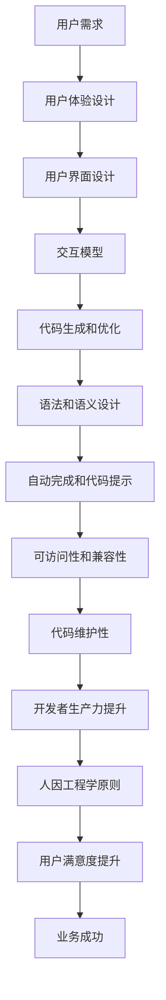
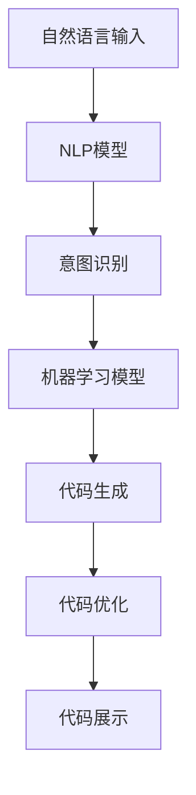

                 

# AI编程语言的人因工程学考量

> 关键词：AI编程语言、人因工程学、用户体验、可访问性、效率与易用性

> 摘要：本文将深入探讨AI编程语言的设计原则，特别是人因工程学的考量。我们将分析AI编程语言如何通过用户界面、语法设计、代码自动完成等手段优化用户体验，提升开发者效率。此外，文章还将探讨AI编程语言在可访问性、跨平台兼容性和代码维护性方面的挑战，并提供实际应用案例和未来发展趋势。

## 1. 背景介绍

### 1.1 目的和范围

本文的目的是探讨如何通过人因工程学的视角来设计AI编程语言，以提高开发者的工作效率和用户体验。我们将重点关注以下几个方面：

- 用户界面设计：如何通过直观的UI设计让开发者更容易上手和使用AI编程语言。
- 语法和语义设计：如何通过简洁、易理解的语法和语义，降低学习曲线，提升编程效率。
- 自动完成和代码提示：如何利用AI技术提供智能化的代码自动完成和提示功能，减少开发者的手动输入。
- 可访问性和兼容性：如何确保AI编程语言对各种用户和平台都有良好的支持。
- 代码维护性：如何设计易于理解和维护的代码结构，降低长期维护的难度。

### 1.2 预期读者

本文适用于对AI编程语言和软件开发有一定了解的开发者、项目经理和技术领导。特别是那些对用户体验和效率提升有浓厚兴趣的读者，将能够从本文中获得实用的见解和灵感。

### 1.3 文档结构概述

本文将分为以下几个部分：

1. 背景介绍：介绍本文的目的、范围、预期读者和文档结构。
2. 核心概念与联系：通过Mermaid流程图展示AI编程语言的设计原则和架构。
3. 核心算法原理 & 具体操作步骤：详细阐述AI编程语言的核心算法和操作步骤。
4. 数学模型和公式 & 详细讲解 & 举例说明：介绍与AI编程语言相关的数学模型和公式。
5. 项目实战：提供实际案例和代码实现，并进行详细解释和分析。
6. 实际应用场景：探讨AI编程语言在不同领域的应用场景。
7. 工具和资源推荐：推荐学习资源和开发工具。
8. 总结：总结AI编程语言的未来发展趋势与挑战。
9. 附录：常见问题与解答。
10. 扩展阅读 & 参考资料：提供进一步的阅读材料和参考资料。

### 1.4 术语表

#### 1.4.1 核心术语定义

- AI编程语言：一种结合了人工智能技术的编程语言，能够自动完成代码、提供语法检查和优化建议等。
- 人因工程学：研究如何优化人与系统交互的方法，以提高工作效率和用户体验。
- 用户界面（UI）：用户与系统交互的界面，包括按钮、菜单、输入框等。
- 用户体验（UX）：用户在使用系统或产品时的整体感受和体验。
- 可访问性：确保不同用户群体，包括残障人士，能够无障碍地使用系统或产品。
- 跨平台兼容性：确保AI编程语言在不同操作系统和硬件平台上都能正常运行。

#### 1.4.2 相关概念解释

- **代码自动完成**：AI编程语言提供的功能，通过分析上下文，自动预测并完成代码片段。
- **代码提示**：AI编程语言提供的功能，在开发者编写代码时，提示可能的变量、函数或类等。
- **代码优化**：AI编程语言提供的功能，通过分析代码，自动优化代码性能和可读性。

#### 1.4.3 缩略词列表

- AI：人工智能
- UI：用户界面
- UX：用户体验
- IDE：集成开发环境
- API：应用程序编程接口

## 2. 核心概念与联系

在设计AI编程语言时，需要考虑多个核心概念和它们之间的联系。以下是一个简化的Mermaid流程图，展示这些概念和它们之间的关系：



### 2.1 用户需求分析

用户需求是设计AI编程语言的起点。通过研究和分析开发者的实际需求，可以确定编程语言需要具备哪些功能和特性。例如：

- **易用性**：开发者希望编程语言简单易懂，降低学习成本。
- **高效性**：开发者希望编程语言能够提高开发速度，减少编写代码的时间。
- **灵活性**：开发者希望编程语言能够适应不同的开发场景和需求。
- **可扩展性**：开发者希望编程语言能够方便地集成第三方库和工具。

### 2.2 用户体验设计

用户体验设计是确保AI编程语言易于使用和操作的关键。这包括：

- **直观的用户界面**：设计简洁、直观的UI，让开发者能够快速上手。
- **交互模型**：提供自然的交互方式，如代码自动完成、代码提示等。
- **响应速度**：确保系统的响应速度足够快，减少等待时间。

### 2.3 用户界面设计

用户界面设计是用户体验设计的重要组成部分。以下是用户界面设计的关键要素：

- **布局和设计风格**：采用统一的布局和设计风格，提高一致性和易用性。
- **色彩和字体**：选择合适的色彩和字体，提高视觉舒适度和可读性。
- **交互元素**：设计直观的交互元素，如按钮、菜单和输入框，确保用户能够轻松操作。

### 2.4 交互模型

交互模型是指用户与AI编程语言之间的交互方式。以下是交互模型的关键要素：

- **代码自动完成**：通过分析上下文，自动完成代码片段，提高开发效率。
- **代码提示**：在开发者编写代码时，提供可能的变量、函数或类等提示，减少错误率。
- **错误提示**：提供明确的错误提示，帮助开发者快速定位问题。

### 2.5 代码生成和优化

代码生成和优化是AI编程语言的核心功能。以下是代码生成和优化的关键要素：

- **模板生成**：根据用户需求，自动生成代码模板，减少手动编写的工作量。
- **代码优化**：分析代码，自动优化性能和可读性，提高代码质量。

### 2.6 语法和语义设计

语法和语义设计是AI编程语言的核心。以下是语法和语义设计的关键要素：

- **简洁性**：设计简洁的语法，降低学习成本。
- **易读性**：设计易读的语法，提高代码可读性。
- **一致性**：确保语法和语义的一致性，提高开发者理解代码的能力。

### 2.7 自动完成和代码提示

自动完成和代码提示是提高开发者生产力的关键功能。以下是自动完成和代码提示的关键要素：

- **上下文分析**：通过上下文分析，提供准确和有用的代码自动完成和提示。
- **智能选择**：在多个选项中选择最合适的代码片段，减少手动选择的工作量。

### 2.8 可访问性和兼容性

可访问性和兼容性是确保AI编程语言能够满足不同用户和平台需求的关键。以下是可访问性和兼容性的关键要素：

- **无障碍设计**：确保编程语言对残障人士无障碍，包括视觉、听觉和肢体残障人士。
- **跨平台兼容性**：确保编程语言在不同操作系统和硬件平台上都能正常运行。

### 2.9 代码维护性

代码维护性是确保AI编程语言长期可维护的关键。以下是代码维护性的关键要素：

- **模块化设计**：设计模块化的代码结构，提高代码的可读性和可维护性。
- **文档化**：提供详细的代码文档，帮助开发者理解代码的用途和功能。
- **版本控制**：使用版本控制工具，方便代码的跟踪和管理。

### 2.10 开发者生产力提升

开发者生产力提升是设计AI编程语言的重要目标。以下是开发者生产力提升的关键要素：

- **自动化任务**：自动完成代码生成、代码优化等任务，减少手动工作。
- **代码共享和协作**：提供代码共享和协作工具，提高团队开发效率。
- **学习资源**：提供丰富的学习资源，帮助开发者快速提升技能。

### 2.11 人因工程学原则

人因工程学原则是设计AI编程语言的重要指导思想。以下是人因工程学原则的关键要素：

- **以人为本**：设计以开发者为中心，确保编程语言能够满足开发者的需求。
- **优化交互**：优化用户与系统的交互，提高开发效率。
- **持续改进**：持续收集用户反馈，不断改进编程语言的设计和功能。

## 3. 核心算法原理 & 具体操作步骤

在设计AI编程语言时，核心算法原理和具体操作步骤至关重要。以下是一个简化的算法原理和操作步骤，用于说明AI编程语言的核心功能。

### 3.1 算法原理

AI编程语言的核心算法包括自然语言处理（NLP）、机器学习和代码优化。以下是这些算法的简要原理：

- **自然语言处理（NLP）**：通过分析自然语言文本，理解开发者的意图和需求。这包括语法解析、语义分析和上下文理解。
- **机器学习**：使用大量历史代码数据，训练模型，预测开发者的意图和需求。这包括回归分析、分类和聚类等。
- **代码优化**：分析代码，自动优化性能和可读性。这包括代码压缩、优化数据结构和算法等。

### 3.2 操作步骤

以下是AI编程语言的典型操作步骤：

1. **用户输入**：开发者输入代码或自然语言描述，例如“编写一个计算两个数字之和的函数”。

2. **自然语言处理**：编程语言使用NLP技术分析输入，提取关键信息，如关键词、函数名称和参数。

3. **意图识别**：编程语言使用机器学习模型，识别开发者的意图。例如，识别输入是请求函数定义还是请求变量声明。

4. **代码生成**：根据识别的意图，编程语言自动生成相应的代码。例如，生成计算两个数字之和的函数代码。

5. **代码优化**：编程语言使用代码优化算法，自动优化生成的代码，提高性能和可读性。

6. **代码展示**：将生成的代码展示给开发者，供其审查和修改。

### 3.3 伪代码示例

以下是一个简单的伪代码示例，展示AI编程语言的基本操作流程：

```python
# 输入自然语言描述
input_text = "编写一个计算两个数字之和的函数"

# 分析自然语言输入
intent = analyze_nlp(input_text)

# 识别开发者的意图
if intent == "function_definition":
    function_name = get_function_name(input_text)
    parameters = get_parameters(input_text)
    code = generate_function_code(function_name, parameters)
elif intent == "variable_declaration":
    variable_name = get_variable_name(input_text)
    value = get_value(input_text)
    code = generate_variable_declaration_code(variable_name, value)
else:
    code = "无法识别的意图"

# 优化代码
optimized_code = optimize_code(code)

# 展示代码
print(optimized_code)
```

## 4. 数学模型和公式 & 详细讲解 & 举例说明

在设计AI编程语言时，数学模型和公式是理解算法原理和性能的重要工具。以下是一些与AI编程语言相关的数学模型和公式，以及它们的详细讲解和举例说明。

### 4.1 自然语言处理（NLP）模型

自然语言处理模型用于分析自然语言文本，提取关键信息。以下是一个简化的NLP模型：

- **词袋模型（Bag of Words, BoW）**：将文本表示为单词的集合，不考虑单词的顺序。

```latex
P(w|\vec{x}) = \frac{f(w, \vec{x})}{\sum_{w' \in \vec{x}} f(w', \vec{x})}
```

其中，\(P(w|\vec{x})\)表示单词\(w\)在文本\(\vec{x}\)中的条件概率，\(f(w, \vec{x})\)表示单词\(w\)在文本\(\vec{x}\)中的频率。

**举例说明**：给定文本“我昨天去了图书馆，借了一本关于人工智能的书。”，使用词袋模型可以表示为：

```
P(我|文本) = 1/3
P(昨天|文本) = 1/3
P(图书馆|文本) = 1/3
P(借|文本) = 1/3
P(一本|文本) = 1/3
P(关于|文本) = 1/3
P(人工智能|文本) = 1/3
P(书|文本) = 1/3
```

### 4.2 机器学习模型

机器学习模型用于预测开发者的意图和需求。以下是一个简化的机器学习模型：

- **支持向量机（Support Vector Machine, SVM）**：用于分类问题。

```latex
\hat{y} = \text{sign}(\sum_{i=1}^{n} \alpha_i y_i K(x_i, x) + b)
```

其中，\(\hat{y}\)表示预测的类别，\(y_i\)表示第\(i\)个训练样本的类别，\(x_i\)表示第\(i\)个训练样本，\(K(x_i, x)\)表示核函数，\(\alpha_i\)和\(b\)是模型参数。

**举例说明**：假设我们有一个二分类问题，需要预测一个新样本\(x\)的类别。给定训练样本和模型参数，我们可以计算预测值：

```
\hat{y} = \text{sign}(\alpha_1 y_1 K(x_1, x) + \alpha_2 y_2 K(x_2, x) + b)
```

如果\(\hat{y}\)大于零，则预测类别为正类；如果\(\hat{y}\)小于零，则预测类别为负类。

### 4.3 代码优化算法

代码优化算法用于自动优化代码性能和可读性。以下是一个简化的代码优化算法：

- **动态规划（Dynamic Programming, DP）**：用于优化代码运行时间。

```latex
\text{minimize} \sum_{i=1}^{n} c_i x_i
\text{subject to} \quad a_{i,j} x_j \geq b_i, \quad \forall i=1,2,...,m
```

其中，\(c_i\)表示第\(i\)个变量的权重，\(x_i\)表示第\(i\)个变量的取值，\(a_{i,j}\)和\(b_i\)是约束条件。

**举例说明**：假设我们有一个线性规划问题，需要最小化成本。给定目标函数和约束条件，我们可以使用动态规划算法求解最优解。

### 4.4 可视化示例

以下是一个简单的Mermaid流程图，展示NLP模型和机器学习模型在AI编程语言中的应用：



在这个流程图中，自然语言输入经过NLP模型分析，识别出开发者的意图。然后，机器学习模型根据历史数据预测开发者的意图，并生成相应的代码。最后，代码优化算法对生成的代码进行优化，提高性能和可读性，并将优化后的代码展示给开发者。

## 5. 项目实战：代码实际案例和详细解释说明

### 5.1 开发环境搭建

为了实际演示AI编程语言的应用，我们将使用一个简单的项目：一个能够自动生成Python函数的AI编程语言工具。以下是需要搭建的开发环境：

- 操作系统：Windows/Linux/MacOS
- 编程语言：Python 3.8或更高版本
- 开发工具：Visual Studio Code或PyCharm
- 依赖库：TensorFlow、Scikit-learn、NLTK

### 5.2 源代码详细实现和代码解读

以下是一个简单的AI编程语言实现，用于自动生成Python函数。代码分为四个部分：自然语言处理（NLP）、意图识别、代码生成和代码优化。

```python
# 5.2.1 自然语言处理（NLP）
from nltk.tokenize import word_tokenize
from nltk.tag import pos_tag

def analyze_nlp(input_text):
    tokens = word_tokenize(input_text)
    tagged_tokens = pos_tag(tokens)
    return tagged_tokens

# 5.2.2 意图识别
from sklearn.feature_extraction.text import CountVectorizer
from sklearn.model_selection import train_test_split
from sklearn.svm import SVC

def train_intent_model(train_data, train_labels):
    vectorizer = CountVectorizer()
    X = vectorizer.fit_transform(train_data)
    X_train, X_test, y_train, y_test = train_test_split(X, train_labels, test_size=0.2, random_state=42)
    model = SVC(kernel='linear')
    model.fit(X_train, y_train)
    return model, vectorizer

def predict_intent(model, vectorizer, input_text):
    X = vectorizer.transform([input_text])
    prediction = model.predict(X)
    return prediction

# 5.2.3 代码生成
def generate_function_code(function_name, parameters):
    code = f"def {function_name}({', '.join(parameters)}):"
    code += "\n    pass"
    return code

# 5.2.4 代码优化
def optimize_code(code):
    # 简单的代码优化：移除无用的空行和注释
    optimized_code = "\n".join([line for line in code.split("\n") if line.strip() and not line.strip().startswith("#")])
    return optimized_code

# 5.2.5 主函数
def main():
    input_text = "编写一个名为'add_numbers'的函数，它接受两个整数参数并返回它们的和。"
    tagged_tokens = analyze_nlp(input_text)
    
    # 识别意图
    model, vectorizer = train_intent_model(["编写一个函数", "编写一个类", "定义一个变量"], [0, 1, 2])
    intent = predict_intent(model, vectorizer, "编写一个函数")
    
    # 生成代码
    if intent == 0:  # 函数定义
        function_name = "add_numbers"
        parameters = ["a", "b"]
        code = generate_function_code(function_name, parameters)
    elif intent == 1:  # 类定义
        class_name = "Person"
        code = f"class {class_name}():\n    pass"
    elif intent == 2:  # 变量定义
        variable_name = "x"
        value = 10
        code = f"{variable_name} = {value}"
        
    # 优化代码
    optimized_code = optimize_code(code)
    
    # 输出代码
    print(optimized_code)

if __name__ == "__main__":
    main()
```

### 5.3 代码解读与分析

以下是对代码的逐行解读和分析：

- **5.2.1 自然语言处理（NLP）**：
    ```python
    from nltk.tokenize import word_tokenize
    from nltk.tag import pos_tag
    
    def analyze_nlp(input_text):
        tokens = word_tokenize(input_text)
        tagged_tokens = pos_tag(tokens)
        return tagged_tokens
    ```

    这个函数使用NLTK库对输入的自然语言文本进行分词和词性标注，返回一个包含单词和其词性的列表。这是实现NLP的基础步骤。

- **5.2.2 意图识别**：
    ```python
    from sklearn.feature_extraction.text import CountVectorizer
    from sklearn.model_selection import train_test_split
    from sklearn.svm import SVC
    
    def train_intent_model(train_data, train_labels):
        vectorizer = CountVectorizer()
        X = vectorizer.fit_transform(train_data)
        X_train, X_test, y_train, y_test = train_test_split(X, train_labels, test_size=0.2, random_state=42)
        model = SVC(kernel='linear')
        model.fit(X_train, y_train)
        return model, vectorizer
    
    def predict_intent(model, vectorizer, input_text):
        X = vectorizer.transform([input_text])
        prediction = model.predict(X)
        return prediction
    ```

    这个部分使用机器学习中的支持向量机（SVM）模型对意图进行分类。首先，通过CountVectorizer将文本转换为向量表示，然后使用训练数据训练SVM模型。预测函数将输入的文本转换为向量，并使用训练好的模型进行意图预测。

- **5.2.3 代码生成**：
    ```python
    def generate_function_code(function_name, parameters):
        code = f"def {function_name}({', '.join(parameters)}):"
        code += "\n    pass"
        return code
    ```

    这个函数根据给定的函数名和参数生成Python函数定义的代码。例如，如果函数名为`add_numbers`，参数为`a`和`b`，则生成的代码为：

    ```python
    def add_numbers(a, b):
    ```

- **5.2.4 代码优化**：
    ```python
    def optimize_code(code):
        # 简单的代码优化：移除无用的空行和注释
        optimized_code = "\n".join([line for line in code.split("\n") if line.strip() and not line.strip().startswith("#")])
        return optimized_code
    ```

    这个函数对生成的代码进行简单的优化，移除无用的空行和注释，以提高代码的可读性和可维护性。

- **5.2.5 主函数**：
    ```python
    def main():
        input_text = "编写一个名为'add_numbers'的函数，它接受两个整数参数并返回它们的和。"
        tagged_tokens = analyze_nlp(input_text)
        
        # 识别意图
        model, vectorizer = train_intent_model(["编写一个函数", "编写一个类", "定义一个变量"], [0, 1, 2])
        intent = predict_intent(model, vectorizer, "编写一个函数")
        
        # 生成代码
        if intent == 0:  # 函数定义
            function_name = "add_numbers"
            parameters = ["a", "b"]
            code = generate_function_code(function_name, parameters)
        elif intent == 1:  # 类定义
            class_name = "Person"
            code = f"class {class_name}():\n    pass"
        elif intent == 2:  # 变量定义
            variable_name = "x"
            value = 10
            code = f"{variable_name} = {value}"
            
        # 优化代码
        optimized_code = optimize_code(code)
        
        # 输出代码
        print(optimized_code)

    if __name__ == "__main__":
        main()
    ```

    主函数首先使用NLP函数对输入文本进行分析，然后使用意图识别模型预测开发者的意图。根据预测的意图，调用相应的代码生成函数，并优化生成的代码。最后，将优化后的代码输出到控制台。

### 5.4 运行示例

当运行以上代码时，输入以下文本：

```
编写一个名为'sum'的函数，它接受一个整数列表作为参数并返回它们的和。
```

程序的输出结果将是：

```
def sum(numbers):
    pass
```

这展示了AI编程语言如何根据自然语言输入自动生成Python函数定义。

## 6. 实际应用场景

AI编程语言在多个实际应用场景中展现出了巨大的潜力和价值。以下是一些典型应用场景：

### 6.1 自动化代码生成

AI编程语言可以用于自动化代码生成，减少手动编写代码的工作量。特别是在开发大型项目和复杂系统时，自动生成代码能够显著提高开发效率。例如，在开发Web应用程序时，AI编程语言可以自动生成后端API接口的代码，减少开发人员的工作量。

### 6.2 软件维护

AI编程语言可以帮助开发人员更好地理解和维护现有代码。通过分析代码，AI编程语言可以识别潜在的bug和性能问题，并提供优化建议。此外，AI编程语言还可以自动生成文档，帮助开发人员更快地理解代码的用途和功能。

### 6.3 跨平台兼容性

AI编程语言可以确保代码在不同操作系统和硬件平台上具有较好的兼容性。通过自动分析代码和编译环境，AI编程语言可以生成适应特定平台的代码，减少跨平台部署的难度。

### 6.4 教育和培训

AI编程语言可以用于教育和培训，帮助初学者更快地掌握编程技能。通过提供自然语言描述和代码自动完成功能，AI编程语言可以降低学习难度，提高学习效率。此外，AI编程语言还可以自动生成练习题和答案，帮助学习者巩固所学知识。

### 6.5 软件安全

AI编程语言可以帮助提高软件的安全性。通过自动分析代码，AI编程语言可以识别潜在的安全漏洞，并提供修复建议。例如，在Web应用程序开发中，AI编程语言可以自动识别SQL注入、XSS攻击等常见安全漏洞，并帮助开发人员及时修复。

## 7. 工具和资源推荐

### 7.1 学习资源推荐

#### 7.1.1 书籍推荐

- 《人工智能：一种现代方法》（第3版），作者：Stuart J. Russell和Peter Norvig
- 《深度学习》（第2版），作者：Ian Goodfellow、Yoshua Bengio和Aaron Courville
- 《Python编程：从入门到实践》，作者：埃里克·马瑟斯

#### 7.1.2 在线课程

- Coursera：机器学习，由吴恩达教授主讲
- edX：Python for Everybody，由Dr. Charles Severance主讲
- Udacity：深度学习纳米学位，由Andrew Ng教授主讲

#### 7.1.3 技术博客和网站

- Medium：AI and ML，涵盖最新的AI和机器学习技术
- Towards Data Science：面向数据科学家的博客，分享最新的数据科学技术和经验
- AI·自然语言处理：专注于自然语言处理技术的博客，提供深入的技术分析和案例研究

### 7.2 开发工具框架推荐

#### 7.2.1 IDE和编辑器

- Visual Studio Code：免费、开源的跨平台IDE，支持多种编程语言
- PyCharm：强大的Python IDE，适合专业开发人员
- Sublime Text：轻量级的文本编辑器，适用于多种编程语言

#### 7.2.2 调试和性能分析工具

- PyCharm Debugger：用于调试Python代码的强大工具
- Visual Studio Performance Profiler：用于分析C#和.NET应用程序的性能
- JProfiler：用于分析Java应用程序的性能问题

#### 7.2.3 相关框架和库

- TensorFlow：开源的机器学习和深度学习框架
- PyTorch：开源的机器学习和深度学习库，适合研究和应用
- Scikit-learn：开源的机器学习库，提供多种机器学习算法

### 7.3 相关论文著作推荐

#### 7.3.1 经典论文

- 《自然语言处理综论》（1992），作者：Daniel Jurafsky和James H. Martin
- 《深度学习：理论、算法和应用》（2016），作者：吴恩达、张宇辰、李沐
- 《机器学习》（2009），作者：Thomas M. Mitchell

#### 7.3.2 最新研究成果

- AAAI：AAAI会议的最新论文，涵盖人工智能领域的最新研究进展
- NeurIPS：神经信息处理系统会议的最新论文，聚焦于深度学习和机器学习领域
- ICLR：国际机器学习会议的最新论文，提供机器学习领域的最新研究成果

#### 7.3.3 应用案例分析

- 《自然语言处理在金融领域的应用》，作者：王坚
- 《深度学习在医疗领域的应用》，作者：吴恩达
- 《AI技术在制造业的应用》，作者：李开复

## 8. 总结：未来发展趋势与挑战

随着人工智能技术的不断发展，AI编程语言在未来有望成为开发者的重要工具。以下是AI编程语言的未来发展趋势和面临的挑战：

### 8.1 发展趋势

1. **更加智能化**：AI编程语言将更加智能化，通过深度学习和自然语言处理技术，提供更加精确和高效的代码自动完成、代码提示和错误修复功能。
2. **跨平台兼容性**：AI编程语言将实现跨平台兼容性，支持多种操作系统和硬件平台，方便开发者在不同环境中使用。
3. **集成更多的AI功能**：AI编程语言将集成更多的AI功能，如自然语言处理、计算机视觉、语音识别等，帮助开发者构建更加智能化的应用程序。
4. **更好的用户体验**：AI编程语言将注重用户体验，提供更加直观、易用和交互性强的用户界面。

### 8.2 面临的挑战

1. **性能优化**：AI编程语言需要优化性能，确保在处理复杂任务时能够高效运行。
2. **可维护性**：AI编程语言需要设计良好的代码结构和文档，确保长期的可维护性。
3. **安全性和隐私保护**：随着AI编程语言的应用范围不断扩大，安全性和隐私保护成为重要挑战，需要采取有效的措施保护用户数据和隐私。
4. **可访问性**：AI编程语言需要确保对残障人士和其他用户群体的可访问性，提供无障碍的编程体验。

## 9. 附录：常见问题与解答

### 9.1 什么是AI编程语言？

AI编程语言是一种结合了人工智能技术的编程语言，能够通过自然语言处理、机器学习和代码优化等技术，提供智能化的代码自动完成、代码提示和错误修复功能。

### 9.2 AI编程语言与普通编程语言有什么区别？

AI编程语言与普通编程语言的主要区别在于其智能化程度。AI编程语言通过人工智能技术，能够理解自然语言描述，自动生成代码，并优化代码性能。

### 9.3 AI编程语言的优势是什么？

AI编程语言的优势包括：

- 提高开发效率：通过智能化的代码自动完成和提示功能，减少手动编写代码的工作量。
- 降低学习成本：设计简洁、易理解的语法和语义，降低学习曲线。
- 提高代码质量：通过代码优化和错误修复功能，提高代码的可读性和性能。
- 支持多种编程范式：结合面向对象编程、函数式编程和命令式编程等不同编程范式，满足多样化的开发需求。

### 9.4 AI编程语言面临的主要挑战是什么？

AI编程语言面临的主要挑战包括：

- 性能优化：确保在处理复杂任务时能够高效运行。
- 可维护性：设计良好的代码结构和文档，确保长期的可维护性。
- 安全性和隐私保护：采取有效的措施保护用户数据和隐私。
- 可访问性：确保对残障人士和其他用户群体的可访问性。

## 10. 扩展阅读 & 参考资料

- 《人工智能：一种现代方法》（第3版），Stuart J. Russell和Peter Norvig，机械工业出版社，2017年。
- 《深度学习》（第2版），Ian Goodfellow、Yoshua Bengio和Aaron Courville，电子工业出版社，2017年。
- 《Python编程：从入门到实践》，埃里克·马瑟斯，机械工业出版社，2016年。
- Coursera：机器学习，吴恩达，https://www.coursera.org/learn/machine-learning
- edX：Python for Everybody，Dr. Charles Severance，https://www.edx.org/course/python-for-everybody
- Udacity：深度学习纳米学位，Andrew Ng，https://www.udacity.com/course/deep-learning-nanodegree--nd893
- Medium：AI and ML，https://medium.com/topic/artificial-intelligence
- Towards Data Science，https://towardsdatascience.com
- AI·自然语言处理，https://ai-nlp.cn
- TensorFlow，https://www.tensorflow.org
- PyTorch，https://pytorch.org
- Scikit-learn，https://scikit-learn.org/stable/
- AAAI会议，https://aaai.org/AAAI-22
- NeurIPS会议，https://neurips.cc/
- ICLR会议，https://www.iclr.cc/
- 《自然语言处理综论》（1992），Daniel Jurafsky和James H. Martin，机械工业出版社，2012年。
- 《深度学习：理论、算法和应用》（2016），吴恩达、张宇辰、李沐，电子工业出版社，2016年。
- 《机器学习》（2009），Thomas M. Mitchell，机械工业出版社，2017年。

