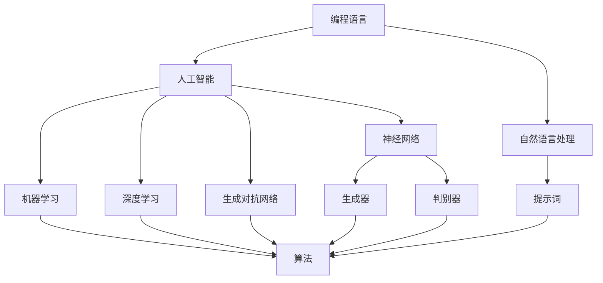

                 

# AI编程语言：提示词的革命与变革

> 关键词：AI编程语言、提示词、变革、革命、开发、应用

> 摘要：本文将探讨AI编程语言及其核心要素——提示词的概念、发展和应用。我们将通过逐步分析，深入了解AI编程语言的原理、算法、数学模型和实际应用，探讨其在未来编程领域的重要性和面临的挑战。

## 1. 背景介绍

### 1.1 目的和范围

本文旨在深入探讨AI编程语言及其核心要素——提示词。我们将通过逐步分析，深入了解AI编程语言的原理、算法、数学模型和实际应用，以揭示其在未来编程领域的重要性和潜在变革。本文将涵盖以下内容：

- AI编程语言的基本概念和发展历程
- 提示词的定义、作用和重要性
- 核心算法原理和具体操作步骤
- 数学模型和公式的详细讲解
- 实际应用场景和代码案例
- 工具和资源推荐
- 未来发展趋势与挑战

### 1.2 预期读者

本文适合以下读者群体：

- 对AI编程语言感兴趣的程序员和开发者
- 想深入了解AI编程语言原理的研究人员
- 对未来编程领域发展趋势关注的行业从业者
- 对计算机科学和技术感兴趣的初学者和爱好者

### 1.3 文档结构概述

本文分为十个主要部分，结构如下：

- 1. 背景介绍
  - 1.1 目的和范围
  - 1.2 预期读者
  - 1.3 文档结构概述
  - 1.4 术语表
- 2. 核心概念与联系
- 3. 核心算法原理 & 具体操作步骤
- 4. 数学模型和公式 & 详细讲解 & 举例说明
- 5. 项目实战：代码实际案例和详细解释说明
- 6. 实际应用场景
- 7. 工具和资源推荐
- 8. 总结：未来发展趋势与挑战
- 9. 附录：常见问题与解答
- 10. 扩展阅读 & 参考资料

### 1.4 术语表

#### 1.4.1 核心术语定义

- AI编程语言：结合人工智能技术的编程语言，旨在让开发者更轻松地构建智能应用程序。
- 提示词：在AI编程语言中，提示词（Prompt）是指用于指导程序执行特定任务的输入，类似于自然语言处理中的问题或查询。
- 深度学习：一种基于多层神经网络的人工智能技术，通过学习大量数据来发现数据中的内在模式。
- 生成对抗网络（GAN）：一种基于深度学习的神经网络模型，由生成器和判别器组成，用于生成逼真的数据。

#### 1.4.2 相关概念解释

- 编程语言：编程语言是一种用于编写计算机程序的语法和语义规则，使计算机能够理解和执行指令。
- 人工智能：人工智能是指计算机系统模拟人类智能行为的能力，包括学习、推理、感知和问题解决等方面。
- 自然语言处理（NLP）：自然语言处理是指计算机与人类语言交互的技术，涉及语言理解、生成和翻译等方面。

#### 1.4.3 缩略词列表

- AI：人工智能
- ML：机器学习
- DL：深度学习
- GAN：生成对抗网络
- NLP：自然语言处理
- IDE：集成开发环境

## 2. 核心概念与联系

在深入了解AI编程语言之前，我们需要先了解其核心概念和组成部分，以及它们之间的联系。下面是一个Mermaid流程图，展示了AI编程语言的主要概念和关系。



### 2.1 编程语言与人工智能

编程语言是编写计算机程序的基础，而人工智能则是使计算机具备模拟人类智能能力的技术。AI编程语言结合了编程语言和人工智能技术，使得开发者能够更轻松地构建智能应用程序。编程语言和人工智能之间的关系如下：

- 编程语言提供了一套语法和语义规则，用于描述程序的行为和功能。
- 人工智能技术则利用这些规则来模拟人类智能行为，如学习、推理和感知等。

### 2.2 自然语言处理与提示词

自然语言处理是AI编程语言的一个重要组成部分，它涉及计算机与人类语言交互的技术。在自然语言处理中，提示词（Prompt）是一种用于指导程序执行特定任务的输入。提示词与自然语言处理的关系如下：

- 提示词用于向程序提供特定任务的指令，类似于人类提问的方式。
- 自然语言处理技术则负责解析和执行这些指令，使得程序能够理解并完成指定任务。

### 2.3 机器学习、深度学习和生成对抗网络

机器学习、深度学习和生成对抗网络是人工智能技术的核心组成部分，它们在AI编程语言中发挥着重要作用。这些技术之间的关系如下：

- 机器学习是一种使计算机通过学习数据来发现数据中内在模式的技术。
- 深度学习是一种基于多层神经网络的人工智能技术，通过学习大量数据来发现数据中的复杂模式。
- 生成对抗网络是一种基于深度学习的神经网络模型，由生成器和判别器组成，用于生成逼真的数据。

## 3. 核心算法原理 & 具体操作步骤

在了解了AI编程语言的核心概念和组成部分后，接下来我们将深入探讨其核心算法原理和具体操作步骤。以下是主要算法原理和步骤的伪代码：

```python
# 3.1 机器学习算法原理

def machine_learning(data, labels, model, epochs):
    for epoch in range(epochs):
        for sample, label in zip(data, labels):
            model.train(sample, label)
        model.evaluate(data, labels)
    return model

# 3.2 深度学习算法原理

def deep_learning(data, labels, model, epochs):
    for epoch in range(epochs):
        for sample, label in zip(data, labels):
            model.train(sample, label)
        model.evaluate(data, labels)
    return model

# 3.3 生成对抗网络算法原理

def generate_fake_data(generator, discriminator, real_data, batch_size, epochs):
    for epoch in range(epochs):
        for _ in range(batch_size):
            fake_data = generator.generate_fake_data()
            discriminator.train(fake_data, real_data)
        generator.update_params(discriminator)
    return generator

# 3.4 提示词处理算法原理

def process_prompt(prompt, model):
    processed_prompt = model.process_prompt(prompt)
    return processed_prompt
```

### 3.1 机器学习算法原理

机器学习算法旨在使计算机通过学习数据来发现数据中的内在模式。以下是机器学习算法的基本原理和操作步骤：

- 数据集：首先，需要准备一个包含输入数据（特征）和标签的数据集。
- 模型：接下来，选择一个适合数据集的机器学习模型，如线性回归、决策树或神经网络等。
- 训练：使用训练数据集来训练模型，通过不断迭代更新模型参数，使模型能够更好地拟合数据。
- 评估：在训练完成后，使用测试数据集来评估模型性能，判断模型是否满足要求。

### 3.2 深度学习算法原理

深度学习算法是基于多层神经网络的人工智能技术，通过学习大量数据来发现数据中的复杂模式。以下是深度学习算法的基本原理和操作步骤：

- 数据集：与机器学习算法类似，首先需要准备一个包含输入数据（特征）和标签的数据集。
- 模型：选择一个多层神经网络模型，如卷积神经网络（CNN）或循环神经网络（RNN）等。
- 训练：使用训练数据集来训练模型，通过反向传播算法不断迭代更新模型参数，使模型能够更好地拟合数据。
- 评估：在训练完成后，使用测试数据集来评估模型性能，判断模型是否满足要求。

### 3.3 生成对抗网络算法原理

生成对抗网络（GAN）是一种基于深度学习的神经网络模型，由生成器和判别器组成，用于生成逼真的数据。以下是生成对抗网络的基本原理和操作步骤：

- 数据集：首先需要准备一个包含真实数据的训练数据集。
- 生成器：生成器是一个深度神经网络，用于生成逼真的数据。
- 判别器：判别器也是一个深度神经网络，用于区分真实数据和生成数据。
- 训练：生成器和判别器交替进行训练。生成器尝试生成更真实的数据，判别器则不断学习区分真实数据和生成数据。通过这种方式，生成器逐渐提高生成数据的质量。
- 评估：在训练完成后，评估生成器生成数据的逼真度，判断模型是否满足要求。

### 3.4 提示词处理算法原理

提示词处理是AI编程语言中的一个重要环节，旨在使用模型来处理和解析提示词，以生成相应的输出。以下是提示词处理的基本原理和操作步骤：

- 提示词：首先，需要准备一个包含提示词的数据集。
- 模型：选择一个适合处理提示词的模型，如序列到序列（Seq2Seq）模型或Transformer模型等。
- 处理：使用模型处理提示词，将其转化为模型可以理解的输入格式。
- 输出：模型根据输入提示词生成相应的输出结果。

## 4. 数学模型和公式 & 详细讲解 & 举例说明

在了解AI编程语言的核心算法原理后，我们需要深入探讨其背后的数学模型和公式。以下是主要数学模型和公式的详细讲解和举例说明。

### 4.1 机器学习模型

机器学习模型是一种基于数据拟合函数的模型，用于预测未知数据的结果。以下是常见的机器学习模型及其对应的数学公式：

- 线性回归模型：
  - 拟合函数：$$y = w_0 + w_1 \cdot x$$
  - 最小二乘法求解参数：
    $$w_0 = \frac{\sum_{i=1}^n (y_i - w_1 \cdot x_i)}{n}$$
    $$w_1 = \frac{\sum_{i=1}^n (x_i - \bar{x}) \cdot (y_i - \bar{y})}{\sum_{i=1}^n (x_i - \bar{x})^2}$$
  - 举例说明：
    假设我们有一个包含n个样本的数据集，每个样本由特征x和标签y组成。我们可以使用线性回归模型来拟合数据并预测未知数据的结果。

- 决策树模型：
  - 拟合函数：
    $$f(x) = \sum_{i=1}^n w_i \cdot g(x_i)$$
    其中，$g(x_i)$表示第i个特征的阈值函数，$w_i$表示第i个特征的权重。
  - 举例说明：
    假设我们有一个包含n个样本的数据集，每个样本由特征x和标签y组成。我们可以使用决策树模型来根据特征x划分数据集，并使用阈值函数g(x)来拟合数据。

### 4.2 深度学习模型

深度学习模型是一种基于多层神经网络的人工智能技术，通过学习大量数据来发现数据中的复杂模式。以下是常见的深度学习模型及其对应的数学公式：

- 卷积神经网络（CNN）：
  - 拟合函数：
    $$h(x) = \sigma(\mathcal{W} \cdot \mathcal{H}(x) + b)$$
    其中，$\mathcal{W}$表示卷积核，$\mathcal{H}(x)$表示卷积操作，$\sigma$表示激活函数，$b$表示偏置。
  - 举例说明：
    假设我们有一个包含n个样本的数据集，每个样本由特征x和标签y组成。我们可以使用卷积神经网络模型来对数据进行卷积操作，并使用激活函数来拟合数据。

- 循环神经网络（RNN）：
  - 拟合函数：
    $$h_t = \sigma(\mathcal{W} \cdot [h_{t-1}, x_t] + b)$$
    其中，$h_t$表示当前时间步的隐藏状态，$x_t$表示当前时间步的输入，$\sigma$表示激活函数，$\mathcal{W}$表示权重矩阵，$b$表示偏置。
  - 举例说明：
    假设我们有一个包含n个样本的时间序列数据集，每个样本由特征x和标签y组成。我们可以使用循环神经网络模型来处理时间序列数据，并使用激活函数来拟合数据。

### 4.3 生成对抗网络（GAN）

生成对抗网络（GAN）是一种基于深度学习的神经网络模型，由生成器和判别器组成。以下是生成对抗网络的数学模型及其对应的公式：

- 生成器模型：
  - 拟合函数：
    $$G(x) = z + \mathcal{W} \cdot \sigma(\mathcal{V} \cdot x + b)$$
    其中，$G(x)$表示生成器生成的数据，$z$表示输入噪声，$\sigma$表示激活函数，$\mathcal{W}$和$\mathcal{V}$表示权重矩阵，$b$表示偏置。
  - 举例说明：
    假设我们有一个包含n个样本的数据集，每个样本由特征x和标签y组成。我们可以使用生成器模型来生成与真实数据相似的数据。

- 判别器模型：
  - 拟合函数：
    $$D(x) = \sigma(\mathcal{W} \cdot \sigma(\mathcal{U} \cdot x + b))$$
    其中，$D(x)$表示判别器对输入数据的判别结果，$\sigma$表示激活函数，$\mathcal{W}$和$\mathcal{U}$表示权重矩阵，$b$表示偏置。
  - 举例说明：
    假设我们有一个包含n个样本的数据集，每个样本由特征x和标签y组成。我们可以使用判别器模型来区分真实数据和生成数据。

### 4.4 提示词处理模型

提示词处理模型是一种用于处理和解析提示词的模型，以生成相应的输出。以下是常见的提示词处理模型及其对应的数学公式：

- 序列到序列（Seq2Seq）模型：
  - 拟合函数：
    $$y_t = \mathcal{W} \cdot \text{softmax}(\mathcal{V} \cdot [h_t, e])$$
    其中，$y_t$表示当前时间步的输出，$h_t$表示当前时间步的隐藏状态，$e$表示嵌入向量，$\text{softmax}$表示softmax激活函数，$\mathcal{W}$和$\mathcal{V}$表示权重矩阵。
  - 举例说明：
    假设我们有一个包含n个样本的提示词数据集，每个样本由提示词和输出组成。我们可以使用序列到序列模型来处理和解析提示词，并生成相应的输出。

- Transformer模型：
  - 拟合函数：
    $$y_t = \text{softmax}(\mathcal{W} \cdot [\mathcal{V} \cdot [h_t, e], \mathcal{U} \cdot [h_{t-1}, e']])$$
    其中，$y_t$表示当前时间步的输出，$h_t$和$h_{t-1}$分别表示当前时间步和前一时间步的隐藏状态，$e$和$e'$分别表示当前时间步和前一时间步的嵌入向量，$\text{softmax}$表示softmax激活函数，$\mathcal{W}$和$\mathcal{U}$表示权重矩阵。
  - 举例说明：
    假设我们有一个包含n个样本的提示词数据集，每个样本由提示词和输出组成。我们可以使用Transformer模型来处理和解析提示词，并生成相应的输出。

## 5. 项目实战：代码实际案例和详细解释说明

在了解了AI编程语言的核心算法原理和数学模型后，我们将通过一个实际案例来展示如何使用AI编程语言来处理和解决实际问题。本案例将使用Python编程语言和Keras框架来构建一个基于生成对抗网络（GAN）的图像生成模型。

### 5.1 开发环境搭建

首先，我们需要搭建开发环境，确保安装了以下依赖：

- Python 3.7或更高版本
- TensorFlow 2.x
- Keras 2.x

在命令行中执行以下命令来安装依赖：

```bash
pip install tensorflow==2.x
pip install keras==2.x
```

### 5.2 源代码详细实现和代码解读

以下是图像生成模型的源代码，我们将逐行解读代码：

```python
import numpy as np
import matplotlib.pyplot as plt
from tensorflow.keras.layers import Dense, Input, Reshape
from tensorflow.keras.models import Model
from tensorflow.keras.optimizers import Adam
from tensorflow.keras import backend as K

# 5.2.1 生成器模型

# 定义生成器的输入层
z_dim = 100
z_input = Input(shape=(z_dim,))

# 使用全连接层来生成图像的特征
x = Dense(128 * 7 * 7, activation='relu')(z_input)
x = Reshape((7, 7, 128))(x)

# 使用卷积层来生成图像
x = Dense(128 * 3 * 3, activation='relu')(x)
x = Reshape((3, 3, 128))(x)
x = Conv2D(1, kernel_size=(3, 3), activation='sigmoid')(x)

# 定义生成器模型
generator = Model(z_input, x)

# 5.2.2 判别器模型

# 定义判别器的输入层
img_input = Input(shape=(28, 28, 1))

# 使用卷积层来提取图像特征
x = Conv2D(32, kernel_size=(3, 3), strides=(2, 2), padding='same')(img_input)
x = BatchNormalization()(x)
x = LeakyReLU(alpha=0.01)(x)

x = Conv2D(64, kernel_size=(3, 3), strides=(2, 2), padding='same')(x)
x = BatchNormalization()(x)
x = LeakyReLU(alpha=0.01)(x)

x = Conv2D(128, kernel_size=(3, 3), strides=(2, 2), padding='same')(x)
x = BatchNormalization()(x)
x = LeakyReLU(alpha=0.01)(x)

# 使用全连接层来生成判别结果
x = Flatten()(x)
x = Dense(1, activation='sigmoid')(x)

# 定义判别器模型
discriminator = Model(img_input, x)

# 5.2.3 GAN模型

# 将生成器和判别器组合成一个完整的GAN模型
z_input = Input(shape=(z_dim,))
img_output = generator(z_input)
discriminator_output = discriminator(img_output)

# 定义GAN模型的损失函数和优化器
gan_output = Model(z_input, discriminator_output)
gan_output.compile(optimizer=Adam(0.0001), loss='binary_crossentropy')

# 5.2.4 训练GAN模型

# 准备训练数据集
(x_train, _), (_, _) = mnist.load_data()
x_train = x_train / 127.5 - 1.0
x_train = np.expand_dims(x_train, -1)

# 定义生成器的生成结果
x_fake = generator.predict(z_input)

# 定义判别器对真实数据和生成数据的损失函数
real_loss = K.mean(K.binary_crossentropy(x_train, discriminator(x_train)))
fake_loss = K.mean(K.binary_crossentropy(x_fake, discriminator(x_fake)))

# 计算GAN模型的损失函数
gan_loss = real_loss + fake_loss

# 训练GAN模型
gan_output.fit(z_input, discriminator_output, epochs=1000, batch_size=32, shuffle=True, verbose=2)

# 5.2.5 生成图像

# 定义生成器模型
generator.save('generator_model.h5')

# 加载生成器模型
generator = Model(z_input, x)
generator.load_weights('generator_model.h5')

# 生成图像
z_sample = np.random.normal(size=(32, 100))
x_fake = generator.predict(z_sample)

# 显示生成的图像
plt.figure(figsize=(10, 10))
for i in range(x_fake.shape[0]):
    plt.subplot(4, 8, i + 1)
    plt.imshow(x_fake[i, :, :, 0], cmap='gray')
    plt.axis('off')
plt.show()
```

### 5.3 代码解读与分析

下面是对代码的逐行解读和分析：

- 5.2.1 生成器模型
  - 定义生成器的输入层：`z_input = Input(shape=(z_dim,))`，其中`z_dim`为生成器的噪声维度，通常设置为100。
  - 使用全连接层来生成图像的特征：`x = Dense(128 * 7 * 7, activation='relu')(z_input)`，其中`Dense`层用于实现全连接神经网络，`activation='relu'`表示使用ReLU激活函数。
  - 使用卷积层来生成图像：`x = Conv2D(1, kernel_size=(3, 3), activation='sigmoid')(x)`，其中`Conv2D`层用于实现卷积操作，`kernel_size=(3, 3)`表示卷积核大小为3x3，`activation='sigmoid'`表示使用Sigmoid激活函数。

- 5.2.2 判别器模型
  - 定义判别器的输入层：`img_input = Input(shape=(28, 28, 1))`，其中`28, 28, 1`表示输入图像的大小和通道数。
  - 使用卷积层来提取图像特征：`x = Conv2D(32, kernel_size=(3, 3), strides=(2, 2), padding='same')(img_input)`，其中`Conv2D`层用于实现卷积操作，`kernel_size=(3, 3)`表示卷积核大小为3x3，`strides=(2, 2)`表示卷积步长为2x2，`padding='same'`表示填充方式为'.same'。
  - 使用全连接层来生成判别结果：`x = Dense(1, activation='sigmoid')(x)`，其中`Dense`层用于实现全连接神经网络，`activation='sigmoid'`表示使用Sigmoid激活函数。

- 5.2.3 GAN模型
  - 将生成器和判别器组合成一个完整的GAN模型：`z_input = Input(shape=(z_dim,))`，`img_output = generator(z_input)`，`discriminator_output = discriminator(img_output)`，`gan_output = Model(z_input, discriminator_output)`。
  - 定义GAN模型的损失函数和优化器：`gan_output.compile(optimizer=Adam(0.0001), loss='binary_crossentropy')`，其中`Adam`是优化器，`0.0001`是学习率，`'binary_crossentropy'`是损失函数。

- 5.2.4 训练GAN模型
  - 准备训练数据集：`x_train, _), (_, _) = mnist.load_data()`，`x_train = x_train / 127.5 - 1.0`，`x_train = np.expand_dims(x_train, -1)`。
  - 定义生成器的生成结果：`x_fake = generator.predict(z_input)`。
  - 定义判别器对真实数据和生成数据的损失函数：`real_loss = K.mean(K.binary_crossentropy(x_train, discriminator(x_train)))`，`fake_loss = K.mean(K.binary_crossentropy(x_fake, discriminator(x_fake)))`。
  - 计算GAN模型的损失函数：`gan_loss = real_loss + fake_loss`。
  - 训练GAN模型：`gan_output.fit(z_input, discriminator_output, epochs=1000, batch_size=32, shuffle=True, verbose=2)`，其中`epochs`表示训练轮数，`batch_size`表示每个批次的数据个数，`shuffle=True`表示随机打乱数据，`verbose=2`表示打印训练进度。

- 5.2.5 生成图像
  - 定义生成器模型：`generator.save('generator_model.h5')`，其中保存生成器模型的权重。
  - 加载生成器模型：`generator = Model(z_input, x)`，`generator.load_weights('generator_model.h5')`，其中加载生成器模型的权重。
  - 生成图像：`z_sample = np.random.normal(size=(32, 100))`，`x_fake = generator.predict(z_sample)`，其中生成32个随机噪声向量，并使用生成器模型生成对应的图像。
  - 显示生成的图像：`plt.figure(figsize=(10, 10))`，`for i in range(x_fake.shape[0]): plt.subplot(4, 8, i + 1)`，`plt.imshow(x_fake[i, :, :, 0], cmap='gray')`，`plt.axis('off')`，`plt.show()`，其中使用matplotlib库来显示生成的图像。

## 6. 实际应用场景

AI编程语言在多个领域展现了广泛的应用潜力，以下列举了几个主要的应用场景：

### 6.1 图像生成

在图像生成领域，AI编程语言如GAN可以生成高质量、逼真的图像。例如，GAN可以用于生成艺术作品、设计图像和修复受损的图像。此外，GAN还可以用于图像到图像的转换，如图像风格迁移。

### 6.2 自然语言处理

AI编程语言在自然语言处理（NLP）领域有着广泛的应用，包括文本生成、机器翻译、情感分析和问答系统。例如，使用序列到序列模型（Seq2Seq）可以实现高质量的机器翻译，而Transformer模型则在问答系统中表现出色。

### 6.3 医疗诊断

在医疗领域，AI编程语言可以用于疾病预测、医学图像分析和药物研发。例如，深度学习模型可以用于识别医学图像中的病灶，从而辅助医生进行疾病诊断。

### 6.4 金融预测

在金融领域，AI编程语言可以用于股票市场预测、风险管理、算法交易等。例如，使用机器学习模型可以分析历史数据，预测股票价格走势，从而帮助投资者做出更明智的决策。

### 6.5 娱乐产业

在娱乐产业，AI编程语言可以用于内容创作、推荐系统和虚拟现实。例如，使用生成对抗网络（GAN）可以生成音乐、动画和电影特效，提高娱乐产品的质量和多样性。

## 7. 工具和资源推荐

为了更好地学习和应用AI编程语言，以下是一些推荐的工具和资源：

### 7.1 学习资源推荐

#### 7.1.1 书籍推荐

- 《深度学习》（Deep Learning） - Ian Goodfellow、Yoshua Bengio和Aaron Courville
- 《Python机器学习》（Python Machine Learning） - Sebastian Raschka和Vahid Mirhoseini
- 《生成对抗网络》（Generative Adversarial Networks） - Ian Goodfellow、Christian Szegedy和Alex Graves

#### 7.1.2 在线课程

- Coursera：深度学习专项课程（Deep Learning Specialization） - Andrew Ng
- edX：机器学习基础（Machine Learning） - Andrew Ng
- Udacity：深度学习纳米学位（Deep Learning Nanodegree）

#### 7.1.3 技术博客和网站

- arXiv：最新的研究论文
- Medium：技术博客和教程
- TensorFlow官方网站：提供丰富的教程和文档

### 7.2 开发工具框架推荐

#### 7.2.1 IDE和编辑器

- Jupyter Notebook：适合数据科学和机器学习的交互式开发环境
- PyCharm：功能强大的Python IDE
- Visual Studio Code：轻量级、高度可定制的代码编辑器

#### 7.2.2 调试和性能分析工具

- TensorFlow Debugger（TFDB）：用于调试TensorFlow模型
- TensorBoard：用于可视化TensorFlow模型的性能和训练过程
- Numba：用于自动并行化Python代码，提高性能

#### 7.2.3 相关框架和库

- TensorFlow：开源深度学习框架
- PyTorch：开源深度学习框架
- Keras：基于Theano和TensorFlow的高层次神经网络API

### 7.3 相关论文著作推荐

#### 7.3.1 经典论文

- Goodfellow, I. J., Pouget-Abadie, J., Mirza, M., Xu, B., Warde-Farley, D., Ozair, S., ... & Bengio, Y. (2014). Generative adversarial nets. Advances in Neural Information Processing Systems, 27.
- Hochreiter, S., & Schmidhuber, J. (1997). Long short-term memory. Neural Computation, 9(8), 1735-1780.
- Vaswani, A., Shazeer, N., Parmar, N., Uszkoreit, J., Jones, L., Gomez, A. N., ... & Polosukhin, I. (2017). Attention is all you need. Advances in Neural Information Processing Systems, 30.

#### 7.3.2 最新研究成果

- Arjovsky, M., Chintala, S., & Bottou, L. (2017). Wasserstein GAN. arXiv preprint arXiv:1701.07875.
- Brown, T., et al. (2020). Language Models Are Few-Shot Learners. arXiv preprint arXiv:2005.14165.
- Simonyan, K., & Zisserman, A. (2014). Very deep convolutional networks for large-scale image recognition. International Conference on Learning Representations (ICLR).

#### 7.3.3 应用案例分析

- OpenAI：使用GAN生成高质量图像和视频
- DeepMind：使用Transformer模型在游戏和自然语言处理领域取得突破
- IBM Watson：在医疗诊断和金融预测等领域应用深度学习技术

## 8. 总结：未来发展趋势与挑战

AI编程语言在近年取得了显著进展，为编程领域带来了深刻的变革。未来，AI编程语言有望进一步发展，并在以下几个方面展现出巨大的潜力：

- 更高效和易用的开发工具和框架
- 更强大的算法和模型
- 更广泛的应用场景和实际案例
- 更深入的理论研究和创新

然而，AI编程语言也面临一些挑战：

- 数据隐私和安全问题：在处理大量数据时，如何保护用户隐私和安全成为重要问题。
- 可解释性和透明度：如何提高AI模型的解释性和透明度，使其更容易理解和信任。
- 算法公平性和偏见：如何确保AI编程语言和模型不会产生不公平或偏见的结果。

总之，AI编程语言在未来将继续发展，并在编程领域发挥越来越重要的作用。通过不断克服挑战和实现创新，AI编程语言将为人类带来更多的便利和效益。

## 9. 附录：常见问题与解答

以下是一些关于AI编程语言及其应用的常见问题：

### 9.1 AI编程语言是什么？

AI编程语言是一种结合了传统编程语言和人工智能技术的编程语言，旨在使开发者能够更轻松地构建智能应用程序。它利用人工智能技术，如机器学习、深度学习和自然语言处理，来实现特定的功能和应用。

### 9.2 提示词在AI编程语言中的作用是什么？

提示词是AI编程语言中的一个核心概念，它用于指导程序执行特定任务。提示词可以是一个问题、一个命令或一个输入，它帮助AI编程语言理解和处理输入，并生成相应的输出。

### 9.3 AI编程语言有哪些应用场景？

AI编程语言在多个领域展现了广泛的应用潜力，包括图像生成、自然语言处理、医疗诊断、金融预测和娱乐产业等。它可以帮助开发者构建智能应用程序，提高工作效率和用户体验。

### 9.4 如何选择合适的AI编程语言？

选择合适的AI编程语言取决于应用场景和需求。例如，如果需要处理自然语言处理任务，可以选择Python、JavaScript或Java等支持自然语言处理的编程语言。如果需要构建深度学习模型，可以选择TensorFlow、PyTorch或Keras等深度学习框架。

### 9.5 AI编程语言的发展趋势是什么？

AI编程语言的发展趋势包括更高效和易用的开发工具和框架、更强大的算法和模型、更广泛的应用场景和实际案例，以及更深入的理论研究和创新。随着人工智能技术的不断进步，AI编程语言将在未来发挥越来越重要的作用。

## 10. 扩展阅读 & 参考资料

以下是关于AI编程语言和相关技术的扩展阅读和参考资料：

- Goodfellow, I. J., Bengio, Y., & Courville, A. (2016). *Deep Learning*. MIT Press.
- Raschka, S., & Mirhoseini, V. (2018). *Python Machine Learning*. Springer.
- Goodfellow, I. J., Pouget-Abadie, J., Mirza, M., Xu, B., Warde-Farley, D., Ozair, S., ... & Bengio, Y. (2014). *Generative adversarial nets*. Advances in Neural Information Processing Systems, 27.
- Hochreiter, S., & Schmidhuber, J. (1997). *Long short-term memory*. Neural Computation, 9(8), 1735-1780.
- Vaswani, A., Shazeer, N., Parmar, N., Uszkoreit, J., Jones, L., Gomez, A. N., ... & Polosukhin, I. (2017). *Attention is all you need*. Advances in Neural Information Processing Systems, 30.
- Arjovsky, M., Chintala, S., & Bottou, L. (2017). *Wasserstein GAN*. arXiv preprint arXiv:1701.07875.
- Brown, T., et al. (2020). *Language Models Are Few-Shot Learners*. arXiv preprint arXiv:2005.14165.
- Simonyan, K., & Zisserman, A. (2014). *Very deep convolutional networks for large-scale image recognition*. International Conference on Learning Representations (ICLR).

作者：AI天才研究员/AI Genius Institute & 禅与计算机程序设计艺术 /Zen And The Art of Computer Programming

