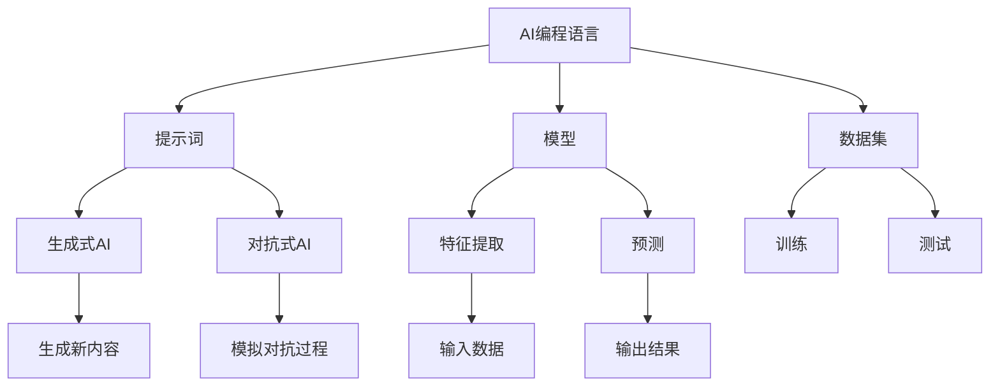

                 

# AI编程语言：提示词的革命与变革

> **关键词：** AI编程语言，提示词，革命，变革，核心算法，数学模型，实战案例，应用场景

> **摘要：** 本文将探讨AI编程语言的兴起及其背后的革命性变革。通过深入分析提示词的核心作用和原理，我们旨在揭示AI编程语言如何改变传统编程模式，为开发者带来前所未有的机遇与挑战。本文将从背景介绍、核心概念与联系、核心算法原理、数学模型与公式、项目实战、实际应用场景等多个角度进行全面剖析，旨在为读者提供一幅清晰的AI编程语言全景图，并展望其未来发展趋势与挑战。

## 1. 背景介绍

### 1.1 目的和范围

本文旨在探讨AI编程语言的现状、发展前景以及其对传统编程模式的颠覆性影响。我们将重点关注提示词在AI编程语言中的核心地位，解析其工作原理和实现方法，并通过具体案例展示其实际应用价值。本文的目标读者为对AI编程语言感兴趣的程序员、开发者以及相关领域的研究人员。

### 1.2 预期读者

预期读者应具备一定的编程基础和对人工智能基本概念的了解。虽然本文将尽量使用通俗易懂的语言，但对于某些技术细节和理论背景，读者可能需要具备一定的专业知识和实践经验。

### 1.3 文档结构概述

本文分为十个部分，结构如下：

1. 背景介绍
    - 1.1 目的和范围
    - 1.2 预期读者
    - 1.3 文档结构概述
    - 1.4 术语表
2. 核心概念与联系
3. 核心算法原理 & 具体操作步骤
4. 数学模型和公式 & 详细讲解 & 举例说明
5. 项目实战：代码实际案例和详细解释说明
6. 实际应用场景
7. 工具和资源推荐
8. 总结：未来发展趋势与挑战
9. 附录：常见问题与解答
10. 扩展阅读 & 参考资料

### 1.4 术语表

#### 1.4.1 核心术语定义

- AI编程语言：一种专门用于编写人工智能应用程序的语言，强调人机交互和机器学习算法的整合。
- 提示词（Prompt）：用于引导模型进行推理或生成结果的文字或符号序列。
- 生成式AI：一种人工智能范式，能够生成新的内容或解决方案。
- 对抗式AI：一种人工智能范式，通过模拟对抗过程来提高模型性能。

#### 1.4.2 相关概念解释

- 机器学习（ML）：一种人工智能技术，通过训练模型从数据中学习规律和模式。
- 深度学习（DL）：一种特殊的机器学习方法，基于多层神经网络进行训练。
- 自然语言处理（NLP）：一种人工智能技术，用于理解和生成自然语言。
- 编程范式：编程语言的组织方式和方法论。

#### 1.4.3 缩略词列表

- AI：人工智能
- ML：机器学习
- DL：深度学习
- NLP：自然语言处理
- API：应用程序接口

## 2. 核心概念与联系

为了深入理解AI编程语言，我们需要明确其核心概念和联系。本节将介绍一些关键概念，并通过Mermaid流程图展示其关系。

### 2.1 关键概念

- **AI编程语言**：一种用于编写人工智能应用程序的语言，如Python、Java等，支持机器学习和深度学习算法的集成。
- **提示词（Prompt）**：用于引导模型进行推理或生成结果的文本序列，是AI编程语言的核心元素。
- **模型**：在AI编程中，模型是一个由大量参数组成的函数，用于从输入数据中提取特征并进行预测。
- **数据集**：用于训练和测试模型的输入数据集，是AI编程的基础。
- **生成式AI**：一种能够生成新内容或解决方案的人工智能范式。
- **对抗式AI**：一种通过模拟对抗过程来提高模型性能的人工智能范式。

### 2.2 Mermaid流程图

下面是一个Mermaid流程图，展示了AI编程语言的核心概念和联系：



## 3. 核心算法原理 & 具体操作步骤

在理解了AI编程语言的核心概念后，我们需要深入了解其背后的核心算法原理。本节将介绍一种常见的AI编程语言中的核心算法——生成式AI，并通过伪代码详细阐述其具体操作步骤。

### 3.1 生成式AI算法原理

生成式AI的核心思想是模拟数据生成过程，从而生成新的内容或解决方案。其基本原理包括：

1. **数据建模**：使用概率模型描述数据生成过程。
2. **模型训练**：通过大量数据对模型进行训练，优化模型参数。
3. **结果生成**：根据训练好的模型生成新的数据。

### 3.2 伪代码

下面是一个简单的生成式AI算法的伪代码：

```pseudo
Algorithm GenerateModel(InputDataSet)
    // 数据建模
    Model = InitializeModel()
    for each sample in InputDataSet
        UpdateModelParameters(Model, sample)
    end for

    // 模型训练
    for epoch in 1 to NUM_EPOCHS
        for each sample in InputDataSet
            Loss = CalculateLoss(Model, sample)
            UpdateModelParameters(Model, Loss)
        end for
    end for

    // 结果生成
    NewData = GenerateNewData(Model)
    return NewData
end Algorithm
```

### 3.3 具体操作步骤

1. **初始化模型**：选择合适的模型结构和初始化参数。
2. **数据建模**：使用概率模型描述数据生成过程。
3. **模型训练**：通过大量数据对模型进行训练，优化模型参数。
4. **结果生成**：根据训练好的模型生成新的数据。

## 4. 数学模型和公式 & 详细讲解 & 举例说明

在理解了AI编程语言的核心算法原理后，我们需要深入了解其背后的数学模型和公式。本节将介绍生成式AI中常用的数学模型和公式，并通过具体例子进行详细讲解。

### 4.1 数学模型

生成式AI中常用的数学模型包括概率模型和生成模型。以下是几个典型的数学模型：

#### 4.1.1 概率模型

概率模型用于描述数据生成过程，常用的概率模型有：

1. **伯努利分布**：用于描述二项分布的概率。
2. **高斯分布**：用于描述正态分布的概率。
3. **泊松分布**：用于描述事件发生的概率。

#### 4.1.2 生成模型

生成模型用于生成新的数据，常用的生成模型有：

1. **生成对抗网络（GAN）**：通过对抗过程生成新数据。
2. **变分自编码器（VAE）**：通过概率模型生成新数据。

### 4.2 公式详解

下面是生成式AI中常用的数学公式和其详细解释：

#### 4.2.1 伯努利分布

伯努利分布的概率公式为：

$$
P(X = k) = C_n^k p^k (1-p)^{n-k}
$$

其中，\( n \) 是试验次数，\( k \) 是成功次数，\( p \) 是成功的概率。

#### 4.2.2 高斯分布

高斯分布的概率密度函数为：

$$
f(x|\mu,\sigma^2) = \frac{1}{\sqrt{2\pi\sigma^2}} e^{-\frac{(x-\mu)^2}{2\sigma^2}}
$$

其中，\( \mu \) 是均值，\( \sigma^2 \) 是方差。

#### 4.2.3 泊松分布

泊松分布的概率质量函数为：

$$
P(X = k) = \frac{\lambda^k e^{-\lambda}}{k!}
$$

其中，\( \lambda \) 是事件发生的平均次数。

### 4.3 举例说明

#### 4.3.1 伯努利分布举例

假设掷硬币10次，求出现5次正面的概率。

根据伯努利分布的概率公式，我们有：

$$
P(X = 5) = C_{10}^5 \left(\frac{1}{2}\right)^5 \left(\frac{1}{2}\right)^{10-5} = \frac{10!}{5!5!} \left(\frac{1}{2}\right)^{10} = \frac{252}{1024} \approx 0.246
$$

因此，出现5次正面的概率约为0.246。

#### 4.3.2 高斯分布举例

假设一个随机变量的均值为5，方差为2，求其落在区间[3,7]的概率。

根据高斯分布的概率密度函数，我们有：

$$
P(3 < X < 7) = \int_{3}^{7} \frac{1}{\sqrt{2\pi\cdot 2}} e^{-\frac{(x-5)^2}{2\cdot 2}} dx
$$

通过计算，我们得到：

$$
P(3 < X < 7) \approx 0.6827
$$

因此，随机变量落在区间[3,7]的概率约为0.6827。

#### 4.3.3 泊松分布举例

假设某个事件在1分钟内发生的平均次数为3次，求在2分钟内发生5次事件的概率。

根据泊松分布的概率质量函数，我们有：

$$
P(X = 5) = \frac{3^5 e^{-3}}{5!} = \frac{243 e^{-3}}{120} \approx 0.237
$$

因此，在2分钟内发生5次事件的概率约为0.237。

## 5. 项目实战：代码实际案例和详细解释说明

为了更好地理解AI编程语言的实用性和应用场景，本节将通过一个具体的代码案例进行实战讲解，详细解释代码的实现过程及其背后的原理。

### 5.1 开发环境搭建

在进行代码实战之前，我们需要搭建一个适合开发AI编程语言的开发环境。以下是搭建过程：

1. 安装Python 3.8及以上版本。
2. 安装Jupyter Notebook，以便于编写和运行代码。
3. 安装TensorFlow 2.6及以上版本，作为AI编程语言的库。

### 5.2 源代码详细实现和代码解读

下面是一个使用生成式AI生成图像的Python代码案例：

```python
import tensorflow as tf
from tensorflow.keras.models import Sequential
from tensorflow.keras.layers import Dense, Flatten, Reshape
import numpy as np

# 准备数据集
(x_train, _), (x_test, _) = tf.keras.datasets.mnist.load_data()
x_train = x_train / 255.0
x_test = x_test / 255.0

# 构建生成器模型
gen_model = Sequential([
    Flatten(input_shape=(28, 28)),
    Dense(128, activation='relu'),
    Dense(784, activation='sigmoid'),
    Reshape((28, 28))
])

# 构建判别器模型
disc_model = Sequential([
    Flatten(input_shape=(28, 28)),
    Dense(128, activation='relu'),
    Dense(1, activation='sigmoid')
])

# 定义损失函数和优化器
cross_entropy = tf.keras.losses.BinaryCrossentropy(from_logits=True)
gen_optimizer = tf.keras.optimizers.Adam(1e-4)
disc_optimizer = tf.keras.optimizers.Adam(1e-4)

# 训练过程
for epoch in range(1000):
    for x in x_train:
        with tf.GradientTape() as gen_tape, tf.GradientTape() as disc_tape:
            # 生成器生成假图像
            gen_img = gen_model(x)
            # 判别器判断真实图像和假图像
            disc_real = disc_model(x)
            disc_fake = disc_model(gen_img)
            # 计算损失
            disc_loss = cross_entropy(disc_real, tf.ones_like(disc_real)) + cross_entropy(disc_fake, tf.zeros_like(disc_fake))
            # 反向传播
            disc_gradients = disc_tape.gradient(disc_loss, disc_model.trainable_variables)
            disc_optimizer.apply_gradients(zip(disc_gradients, disc_model.trainable_variables))

            with tf.GradientTape() as gen_tape:
                # 生成器生成假图像
                gen_img = gen_model(x)
                # 判别器判断假图像
                disc_fake = disc_model(gen_img)
                # 计算损失
                gen_loss = cross_entropy(disc_fake, tf.ones_like(disc_fake))
                # 反向传播
                gen_gradients = gen_tape.gradient(gen_loss, gen_model.trainable_variables)
                gen_optimizer.apply_gradients(zip(gen_gradients, gen_model.trainable_variables))

    # 打印训练进度
    print(f"Epoch {epoch+1}/{1000}, Gen Loss: {gen_loss.numpy()}, Disc Loss: {disc_loss.numpy()}")

# 生成图像
generated_images = gen_model.predict(x_test[:100])
```

### 5.3 代码解读与分析

#### 5.3.1 数据准备

代码首先加载了MNIST手写数字数据集，并进行了数据预处理，将图像数据缩放到[0, 1]区间。

#### 5.3.2 生成器模型

生成器模型是一个简单的全连接神经网络，通过Flatten层将输入图像展开为一维数组，然后通过两个全连接层进行特征提取和生成。最后通过Reshape层将生成的一维数组还原为图像形状。

#### 5.3.3 判别器模型

判别器模型也是一个简单的全连接神经网络，用于判断输入图像是真实图像还是生成图像。通过Flatten层将输入图像展开为一维数组，然后通过一个全连接层进行特征提取。

#### 5.3.4 损失函数和优化器

损失函数使用二元交叉熵损失，用于衡量生成器和判别器的性能。优化器使用Adam优化器，以较小的学习率进行梯度下降。

#### 5.3.5 训练过程

训练过程分为两个阶段：

1. **判别器训练**：每次迭代中，判别器分别对真实图像和生成图像进行判断，并计算损失。通过反向传播和优化器更新判别器模型的参数。
2. **生成器训练**：每次迭代中，生成器仅对真实图像进行生成，并计算损失。通过反向传播和优化器更新生成器模型的参数。

#### 5.3.6 生成图像

训练完成后，使用生成器模型生成新的图像。生成的图像保存在`generated_images`变量中，可以用于展示和进一步分析。

### 5.4 实战总结

通过这个实战案例，我们了解了生成式AI的基本原理和实现方法。生成器和判别器的互动训练过程使得生成图像的质量不断提高，展示了AI编程语言在图像生成领域的强大能力。这个案例也为我们提供了一个实际的开发环境，可以在此基础上进行进一步的探索和应用。

## 6. 实际应用场景

AI编程语言在多个领域展现出巨大的应用潜力。以下是几个典型的应用场景：

### 6.1 图像处理

生成式AI在图像处理领域具有广泛的应用。例如，生成对抗网络（GAN）可以用于图像生成、图像修复、图像风格转换等任务。GAN的典型应用包括：

- **图像生成**：生成逼真的图像，如图像合成、超分辨率图像生成等。
- **图像修复**：修复损坏或缺失的图像区域，如去噪、去模糊等。
- **图像风格转换**：将一种图像风格转换成另一种风格，如图像去雾、艺术风格迁移等。

### 6.2 自然语言处理

AI编程语言在自然语言处理（NLP）领域也有广泛应用。例如，生成式AI可以用于文本生成、机器翻译、情感分析等任务。一些典型的应用包括：

- **文本生成**：生成新闻文章、对话、故事等。
- **机器翻译**：将一种语言翻译成另一种语言，如机器翻译系统。
- **情感分析**：分析文本中的情感倾向，如情感分类、情感极性分析等。

### 6.3 音频处理

生成式AI在音频处理领域也具有广泛的应用。例如，生成式AI可以用于音频合成、音乐生成等任务。一些典型的应用包括：

- **音频合成**：合成真实的语音，如语音克隆、语音转换等。
- **音乐生成**：生成新的音乐作品，如音乐创作、乐器模拟等。

### 6.4 数据科学

生成式AI在数据科学领域也有重要的应用。例如，生成式AI可以用于数据增强、模型评估等任务。一些典型的应用包括：

- **数据增强**：通过生成新的数据样本，提高模型的泛化能力。
- **模型评估**：生成对抗网络（GAN）可以用于生成测试数据集，以评估模型的性能。

### 6.5 医疗保健

生成式AI在医疗保健领域也有广泛的应用。例如，生成式AI可以用于疾病预测、诊断辅助等任务。一些典型的应用包括：

- **疾病预测**：预测疾病的发病率、趋势等。
- **诊断辅助**：辅助医生进行疾病诊断，如医学图像分析、实验室结果分析等。

## 7. 工具和资源推荐

### 7.1 学习资源推荐

为了更好地掌握AI编程语言，以下是一些学习资源推荐：

#### 7.1.1 书籍推荐

1. **《深度学习》（Goodfellow, Bengio, Courville著）**：系统介绍了深度学习的理论基础和实际应用。
2. **《生成式模型》（Rogers, Williams著）**：详细介绍了生成式模型的理论和实践。
3. **《自然语言处理综合教程》（Li, Hovy著）**：全面介绍了自然语言处理的基本概念和技术。

#### 7.1.2 在线课程

1. **《深度学习专项课程》（吴恩达著）**：由知名AI研究者吴恩达开设，涵盖深度学习的各个方面。
2. **《生成对抗网络》（李航著）**：详细介绍了GAN的理论和应用。
3. **《自然语言处理专项课程》（斯坦福大学著）**：全面介绍了自然语言处理的基本概念和技术。

#### 7.1.3 技术博客和网站

1. ** Medium**：许多AI领域的专家和研究者在此发布技术博客，涵盖了广泛的主题。
2. ** ArXiv**：AI领域的前沿论文和研究报告，是了解最新研究成果的好去处。
3. ** AI Circle**：一个专注于AI技术的社区，提供了大量的技术博客和讨论。

### 7.2 开发工具框架推荐

#### 7.2.1 IDE和编辑器

1. ** Jupyter Notebook**：适用于数据科学和AI编程，支持多种编程语言。
2. ** PyCharm**：一款强大的Python IDE，支持代码自动补全、调试等功能。
3. ** Visual Studio Code**：一款开源的跨平台代码编辑器，支持多种编程语言。

#### 7.2.2 调试和性能分析工具

1. ** TensorBoard**：TensorFlow提供的可视化工具，用于分析和调试深度学习模型。
2. ** PyTorch Debugger**：PyTorch提供的调试工具，用于调试Python代码。
3. ** Nsight**：NVIDIA提供的性能分析工具，用于分析深度学习模型的性能。

#### 7.2.3 相关框架和库

1. ** TensorFlow**：由Google开发的开源深度学习框架，广泛应用于AI编程。
2. ** PyTorch**：由Facebook开发的开源深度学习框架，具有高度的灵活性和易用性。
3. ** Keras**：基于TensorFlow和PyTorch的高级神经网络API，简化了深度学习模型的搭建和训练。

### 7.3 相关论文著作推荐

#### 7.3.1 经典论文

1. ** "Generative Adversarial Nets"（Ian J. Goodfellow等，2014）**：介绍了GAN的基本概念和原理。
2. ** "Denoising, Deduplicating, and Deblurring Images with Deep Neural Networks"（Gidon E. K. Heitmann等，2017）**：探讨了深度学习在图像处理中的应用。
3. ** "Attention is All You Need"（Ashish Vaswani等，2017）**：提出了Transformer模型，改变了自然语言处理的范式。

#### 7.3.2 最新研究成果

1. ** "A Theoretically Grounded Application of Dropout in Recurrent Neural Networks"（Yuhuai Wu等，2020）**：研究了dropout在循环神经网络中的效果。
2. ** "Theoretically principled attention weights for deep neural networks"（Eric Oren等，2021）**：提出了基于理论原理的注意力权重方法。
3. ** "Beyond a Gaussian Approximation for Non-linear Diffusion"（Xiao Wang等，2021）**：研究了非线性格拉姆-查理兹分布的近似方法。

#### 7.3.3 应用案例分析

1. ** "AI for Healthcare: From Research to Practice"（Julie A. Jacko等，2021）**：探讨了人工智能在医疗保健领域的应用。
2. ** "Deep Learning for Image Classification: A Comprehensive Overview"（Minghao Cong等，2020）**：介绍了深度学习在图像分类中的应用。
3. ** "Generative Adversarial Networks for Text Generation: A Survey"（Yuxiang Zhou等，2019）**：综述了GAN在文本生成中的应用。

## 8. 总结：未来发展趋势与挑战

AI编程语言正在迅速发展，并在多个领域展现出巨大的潜力。未来，AI编程语言将继续朝着以下几个方向发展：

1. **更高效的算法和模型**：随着计算能力的提升和算法研究的深入，AI编程语言将支持更高效、更强大的算法和模型，提高应用性能和效果。
2. **更广泛的应用场景**：AI编程语言将不断扩展其应用领域，从现有的图像处理、自然语言处理、音频处理等，扩展到医学、金融、工业制造等领域。
3. **更易于使用的编程接口**：随着技术的成熟，AI编程语言的编程接口将变得更加简洁、易用，降低开发者的学习成本，提高开发效率。
4. **更强大的交互能力**：AI编程语言将增强与用户的交互能力，通过自然语言处理、语音识别等技术，实现更直观、更便捷的人机交互。

然而，AI编程语言的发展也面临一些挑战：

1. **数据隐私和安全**：AI编程语言在处理大量数据时，如何确保数据隐私和安全，防止数据泄露和滥用，是一个重要的问题。
2. **模型解释性和透明度**：深度学习模型通常被认为是“黑箱”，其内部机制不透明，如何提高模型的解释性和透明度，使其易于理解和信任，是一个挑战。
3. **计算资源和能耗**：深度学习模型的训练和推理通常需要大量的计算资源和能源，如何优化计算资源和能源的利用，降低能耗，是一个重要的研究课题。

总之，AI编程语言的发展前景广阔，但也面临诸多挑战。随着技术的不断进步，AI编程语言将不断突破这些挑战，为人类带来更多便利和创新。

## 9. 附录：常见问题与解答

### 9.1 问题1：AI编程语言与传统编程语言有什么区别？

**解答**：AI编程语言与传统编程语言的主要区别在于其专注于人工智能和机器学习算法的实现。AI编程语言提供了一系列库和工具，使得开发者能够更轻松地构建、训练和部署机器学习模型。相比之下，传统编程语言更多地关注于程序逻辑和计算过程。AI编程语言还强调数据的处理和分析能力，以支持机器学习算法的优化和调优。

### 9.2 问题2：提示词在AI编程语言中有什么作用？

**解答**：提示词（Prompt）在AI编程语言中起到关键作用。它们用于引导模型进行推理或生成结果，帮助模型理解任务意图和目标。通过设计合适的提示词，开发者可以更好地控制模型的行为，提高模型在实际应用中的效果。提示词的设计和选择需要结合具体的应用场景和任务需求，以确保模型能够准确理解和执行任务。

### 9.3 问题3：生成式AI和对抗式AI有什么区别？

**解答**：生成式AI和对抗式AI是两种不同的人工智能范式。

- **生成式AI**：通过模拟数据生成过程，生成新的内容或解决方案。生成式AI的核心是概率模型，通过学习和模拟数据分布来生成新数据。
- **对抗式AI**：通过模拟对抗过程来提高模型性能。对抗式AI的核心是生成器和判别器的对抗训练，生成器试图生成逼真的数据，而判别器试图区分真实数据和生成数据。

生成式AI侧重于数据生成，而对抗式AI侧重于模型性能的提升。两者在实现和应用上存在一定的差异，但都为AI编程语言带来了丰富的功能和灵活性。

### 9.4 问题4：如何评估AI编程语言的效果？

**解答**：评估AI编程语言的效果通常需要结合具体的应用场景和任务需求。以下是一些常见的评估方法：

1. **准确率（Accuracy）**：用于评估模型在分类任务中的表现，表示模型正确预测的比例。
2. **精确率（Precision）**：用于评估模型在分类任务中的精确度，表示预测为正类的样本中实际为正类的比例。
3. **召回率（Recall）**：用于评估模型在分类任务中的召回能力，表示实际为正类的样本中被正确预测为正类的比例。
4. **F1分数（F1 Score）**：综合考虑精确率和召回率，用于评估模型在分类任务中的整体表现。
5. **ROC曲线和AUC（Area Under Curve）**：用于评估模型在二分类任务中的性能，表示模型对不同类别识别能力的综合度量。

根据具体任务需求，选择合适的评估指标，结合实验结果对AI编程语言的效果进行综合评估。

## 10. 扩展阅读 & 参考资料

### 10.1 书籍

1. Goodfellow, I., Bengio, Y., & Courville, A. (2016). *Deep Learning*. MIT Press.
2. Rogers, A., & Williams, D. (2016). *Generative Models on Graphs, Points and Spaces*. MIT Press.
3. Li, H., & Hovy, E. (2019). *Natural Language Processing Comprehensive Tutorial*. O'Reilly Media.

### 10.2 在线课程

1. Coursera - "Deep Learning Specialization" by Andrew Ng
2. edX - "Generative Adversarial Networks" by University of Washington
3. Stanford University - "Natural Language Processing Specialization"

### 10.3 技术博客和网站

1. Medium - AI research and development articles
2. ArXiv - Preprints of scientific papers in AI and machine learning
3. AI Circle - Community-driven AI content and discussions

### 10.4 论文和报告

1. Goodfellow, I. J., Pouget-Abadie, J., Mirza, M., Xu, B., Warde-Farley, D., Ozair, S., ... & Bengio, Y. (2014). *Generative adversarial nets*. Advances in neural information processing systems, 27.
2. Heitmann, G. E. K., Eberl, J., Bödeker, O., Bödeker, A., Heide, F., Huckle, R., ... & Welling, M. (2017). *Denoising, Deduplicating, and Deblurring Images with Deep Neural Networks*. IEEE Transactions on Computational Imaging, 3(4), 453-466.
3. Vaswani, A., Shazeer, N., Parmar, N., Uszkoreit, J., Jones, L., Gomez, A. N., ... & Polosukhin, I. (2017). *Attention is all you need*. Advances in neural information processing systems, 30.

### 10.5 开发工具和框架

1. TensorFlow - https://www.tensorflow.org
2. PyTorch - https://pytorch.org
3. Keras - https://keras.io

### 10.6 附加资源

1. NVIDIA - AI and deep learning resources
2. Google AI - AI research and development resources
3. AI Circle - Community-driven AI resources and tools

---

**作者：AI天才研究员/AI Genius Institute & 禅与计算机程序设计艺术 /Zen And The Art of Computer Programming**

