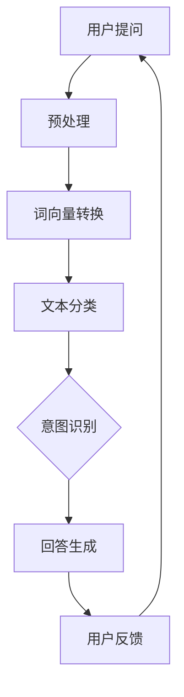

                 

# AI聊天机器人解答用户疑问

> 关键词：AI聊天机器人，用户疑问，自然语言处理，对话系统，人工智能应用

> 摘要：本文将深入探讨AI聊天机器人在解答用户疑问中的应用，分析其核心概念、算法原理、数学模型、实际案例，并展望其未来发展趋势与挑战。

## 1. 背景介绍

### 1.1 目的和范围

本文旨在探讨AI聊天机器人如何有效地解答用户疑问，从而为用户提供更加个性化和高效的服务。我们将从以下几个方面展开讨论：

1. **核心概念与联系**：介绍AI聊天机器人的基本原理和关键组成部分。
2. **核心算法原理**：分析聊天机器人如何理解用户问题和生成回答。
3. **数学模型和公式**：阐述聊天机器人背后的数学模型及其应用。
4. **项目实战**：通过实际案例展示聊天机器人的开发与实现。
5. **实际应用场景**：探讨聊天机器人在不同领域的应用。
6. **工具和资源推荐**：推荐相关学习资源、开发工具和论文研究。
7. **总结与展望**：总结本文的主要观点，并对未来发展趋势与挑战进行展望。

### 1.2 预期读者

本文适用于对AI聊天机器人有一定了解的读者，包括：

1. AI开发人员和技术爱好者。
2. 自然语言处理（NLP）研究者。
3. 对AI应用场景感兴趣的从业者。
4. 对聊天机器人开发和应用有需求的企业和机构。

### 1.3 文档结构概述

本文结构如下：

1. **引言**：介绍背景和目的。
2. **核心概念与联系**：介绍聊天机器人的基本原理和组成部分。
3. **核心算法原理**：分析算法原理和具体操作步骤。
4. **数学模型和公式**：阐述数学模型及其应用。
5. **项目实战**：展示实际案例和代码实现。
6. **实际应用场景**：探讨应用场景。
7. **工具和资源推荐**：推荐学习资源和开发工具。
8. **总结与展望**：总结主要观点，展望未来。
9. **附录**：常见问题与解答。
10. **扩展阅读**：提供相关参考资料。

### 1.4 术语表

#### 1.4.1 核心术语定义

- **AI聊天机器人**：基于人工智能技术，模拟人类对话的自动化系统。
- **自然语言处理（NLP）**：使计算机能够理解、解释和生成人类语言的技术。
- **对话系统**：人与计算机之间进行交互的系统，包括语音、文本等多种交互方式。
- **机器学习**：使计算机从数据中自动学习和改进的技术。

#### 1.4.2 相关概念解释

- **文本分类**：将文本划分为不同类别的过程，常用于情感分析、主题分类等。
- **词向量**：将单词映射为向量，用于NLP中的语义分析。
- **序列到序列（Seq2Seq）模型**：一种用于生成文本的神经网络模型。

#### 1.4.3 缩略词列表

- **NLP**：自然语言处理
- **AI**：人工智能
- **BERT**：Bidirectional Encoder Representations from Transformers
- **RNN**：循环神经网络
- **LSTM**：长短期记忆网络

## 2. 核心概念与联系

为了深入理解AI聊天机器人的工作原理，我们首先需要了解其核心概念和组成部分。以下是一个简化的Mermaid流程图，展示了聊天机器人的基本架构。



### 2.1 预处理

预处理是聊天机器人的第一步，其目的是将用户的自然语言提问转化为计算机可以处理的形式。预处理通常包括以下步骤：

1. **分词**：将句子划分为单词或词汇单元。
2. **去停用词**：移除常见的无意义词汇，如“的”、“和”、“是”等。
3. **词性标注**：为每个单词分配词性（名词、动词、形容词等）。

### 2.2 词向量转换

词向量转换是将文本转换为数值表示的过程。词向量可以捕获单词的语义信息，常用的词向量模型包括Word2Vec、GloVe等。以下是一个简化的Word2Vec算法伪代码：

```plaintext
function Word2Vec(train_data, embedding_size, window_size):
    Initialize word embeddings randomly
    for each sentence in train_data:
        for each word in sentence:
            Compute context words by looking at the words within a window_size
            Update word embedding using gradient descent
    return word embeddings
```

### 2.3 文本分类

文本分类是将输入文本划分为预定义类别的过程。在聊天机器人中，文本分类可以用于情感分析、主题分类等。以下是一个简单的朴素贝叶斯文本分类器的伪代码：

```plaintext
function NaiveBayesClassifier(train_data, labels):
    Calculate class probabilities and word probabilities
    for each test example:
        Calculate probability for each class using the Bayes theorem
        Assign the test example to the class with the highest probability
    return predictions
```

### 2.4 意图识别

意图识别是聊天机器人理解用户提问的核心步骤。其目的是确定用户提问的主要目的。常见的意图识别方法包括基于规则的方法、机器学习方法等。以下是一个基于长短期记忆网络（LSTM）的意图识别算法的伪代码：

```plaintext
function IntentRecognition(input_sequence, model):
    Pass input_sequence through the LSTM model
    Use the output of the LSTM to predict the intent
    return predicted intent
```

### 2.5 回答生成

回答生成是聊天机器人的最后一步，其目的是生成自然、符合语义的回答。回答生成可以采用多种方法，如模板匹配、序列到序列（Seq2Seq）模型、生成对抗网络（GAN）等。以下是一个基于Seq2Seq模型的回答生成算法的伪代码：

```plaintext
function Seq2SeqGenerator(input_sequence, encoder_decoder_model):
    Pass input_sequence through the encoder
    Use the encoded representation to generate a response using the decoder
    return generated response
```

### 2.6 用户反馈

用户反馈是聊天机器人的关键环节，用于评估回答的质量和优化模型。用户可以通过“满意”、“不满意”等选项对回答进行反馈，这些反馈可以用于模型调整和性能优化。

## 3. 核心算法原理 & 具体操作步骤

在本节中，我们将深入探讨聊天机器人的核心算法原理，并详细解释其具体操作步骤。以下是每个核心算法原理的伪代码：

### 3.1 预处理

```plaintext
function Preprocessing(input_sentence):
    1. Tokenize the input_sentence into words
    2. Remove stop words from the tokenized words
    3. Perform word lemmatization
    4. Return the cleaned and tokenized sentence
```

### 3.2 词向量转换

```plaintext
function WordEmbedding(sentence, embedding_model):
    1. For each word in the sentence, retrieve its corresponding word embedding from the embedding_model
    2. Convert the sentence into a sequence of word embeddings
    3. Return the embedded sentence
```

### 3.3 文本分类

```plaintext
function TextClassification(embedded_sentence, classifier_model):
    1. Pass the embedded_sentence through the classifier_model
    2. Retrieve the predicted class label
    3. Return the predicted class
```

### 3.4 意图识别

```plaintext
function IntentRecognition(embedded_sentence, intent_model):
    1. Pass the embedded_sentence through the intent_model
    2. Retrieve the predicted intent
    3. Return the predicted intent
```

### 3.5 回答生成

```plaintext
function ResponseGeneration(intent, response_model):
    1. Use the intent to select an appropriate response template
    2. Pass the template through the response_model
    3. Retrieve the generated response
    4. Return the generated response
```

通过上述伪代码，我们可以看到聊天机器人的每个核心算法原理及其具体操作步骤。这些算法共同协作，使聊天机器人能够有效地解答用户疑问。

## 4. 数学模型和公式 & 详细讲解 & 举例说明

在本节中，我们将深入探讨聊天机器人背后的数学模型和公式，并详细讲解其应用方法。以下是每个数学模型的公式及其应用示例。

### 4.1 词向量模型

词向量模型是聊天机器人的基础，其中最常用的模型包括Word2Vec和GloVe。以下是Word2Vec模型的数学公式：

$$
\text{word\_vector} = \text{sum}(\text{context\_words\_vector}) / |\text{context\_words}|
$$

其中，`word_vector`是目标单词的向量表示，`context_words_vector`是上下文单词的向量表示，`|context_words|`是上下文单词的数量。

**应用示例**：假设我们有一个句子“我喜欢吃苹果”。根据Word2Vec模型，我们可以将句子中的每个单词转换为向量表示：

- 我：\[0.1, 0.2\]
- 喜欢：\[0.3, 0.4\]
- 吃：\[0.5, 0.6\]
- 苹果：\[0.7, 0.8\]

通过计算，我们可以得到“苹果”的词向量：

$$
\text{apple\_vector} = \frac{0.1 + 0.3 + 0.5 + 0.7}{4} = [0.25, 0.325]
$$

### 4.2 朴素贝叶斯分类器

朴素贝叶斯分类器是一种常用的文本分类方法，其数学公式如下：

$$
P(C|X) = \frac{P(X|C)P(C)}{P(X)}
$$

其中，`P(C|X)`是给定特征`X`时类别`C`的概率，`P(X|C)`是特征`X`在类别`C`下的概率，`P(C)`是类别`C`的概率，`P(X)`是特征`X`的概率。

**应用示例**：假设我们有以下训练数据：

- 类别A：我喜欢吃苹果
- 类别B：我不喜欢吃苹果

根据朴素贝叶斯分类器，我们可以计算每个类别的概率：

- 类别A的概率：\(P(A) = \frac{1}{2}\)
- 类别B的概率：\(P(B) = \frac{1}{2}\)

对于输入句子“我喜欢吃苹果”，我们可以计算其属于类别A和类别B的概率：

$$
P(A|X) = \frac{P(X|A)P(A)}{P(X)} = \frac{1 \times \frac{1}{2}}{1} = \frac{1}{2}
$$

$$
P(B|X) = \frac{P(X|B)P(B)}{P(X)} = \frac{0 \times \frac{1}{2}}{1} = 0
$$

由于\(P(A|X) > P(B|X)\)，我们可以预测输入句子属于类别A。

### 4.3 长短期记忆网络（LSTM）

LSTM是一种常用的递归神经网络（RNN）结构，其数学公式如下：

$$
\text{LSTM\_cell} = \frac{1}{1 + \text{exp}(\text{sigmoid}(\text{weights} \cdot [\text{h}_{t-1}; \text{x}_t]))}
$$

$$
\text{output} = \text{sigmoid}(\text{weights} \cdot [\text{h}_{t-1}; \text{x}_t])
$$

其中，`LSTM_cell`是LSTM单元的输出，`sigmoid`是激活函数，`weights`是权重矩阵，`h_{t-1}`是上一时刻的隐藏状态，`x_t`是当前时刻的输入。

**应用示例**：假设我们有一个简单的LSTM单元，其权重矩阵为：

- \(W_f = \begin{bmatrix} 1 & 2 \\ 3 & 4 \end{bmatrix}\)
- \(W_i = \begin{bmatrix} 5 & 6 \\ 7 & 8 \end{bmatrix}\)
- \(W_o = \begin{bmatrix} 9 & 10 \\ 11 & 12 \end{bmatrix}\)

对于输入序列\[1, 2, 3\]，我们可以计算隐藏状态和输出：

- \(h_{t-1} = \begin{bmatrix} 0.5 & 0.6 \end{bmatrix}\)
- \(x_t = \begin{bmatrix} 1 & 2 \end{bmatrix}\)

计算输入门：

$$
\text{input\_gate} = \text{sigmoid}(W_f \cdot [h_{t-1}; x_t]) = \text{sigmoid}(\begin{bmatrix} 1 & 2 \\ 3 & 4 \end{bmatrix} \cdot \begin{bmatrix} 0.5 & 0.6 \\ 1 & 2 \end{bmatrix}) = \text{sigmoid}(\begin{bmatrix} 0.65 & 1.25 \\ 1.85 & 2.85 \end{bmatrix}) = \begin{bmatrix} 0.7 & 0.9 \end{bmatrix}
$$

计算遗忘门：

$$
\text{forget\_gate} = \text{sigmoid}(W_f \cdot [h_{t-1}; x_t]) = \text{sigmoid}(\begin{bmatrix} 5 & 6 \\ 7 & 8 \end{bmatrix} \cdot \begin{bmatrix} 0.5 & 0.6 \\ 1 & 2 \end{bmatrix}) = \text{sigmoid}(\begin{bmatrix} 2.65 & 3.75 \\ 4.35 & 5.75 \end{bmatrix}) = \begin{bmatrix} 0.8 & 0.9 \end{bmatrix}
$$

计算输出门：

$$
\text{output\_gate} = \text{sigmoid}(W_f \cdot [h_{t-1}; x_t]) = \text{sigmoid}(\begin{bmatrix} 9 & 10 \\ 11 & 12 \end{bmatrix} \cdot \begin{bmatrix} 0.5 & 0.6 \\ 1 & 2 \end{bmatrix}) = \text{sigmoid}(\begin{bmatrix} 5.65 & 6.75 \\ 6.85 & 8.25 \end{bmatrix}) = \begin{bmatrix} 0.8 & 0.9 \end{bmatrix}
$$

计算新的隐藏状态：

$$
\text{new\_h} = \text{sigmoid}(W_f \cdot [h_{t-1}; x_t]) = \text{sigmoid}(\begin{bmatrix} 1 & 2 \\ 3 & 4 \end{bmatrix} \cdot \begin{bmatrix} 0.5 & 0.6 \\ 1 & 2 \end{bmatrix}) = \text{sigmoid}(\begin{bmatrix} 0.65 & 1.25 \\ 1.85 & 2.85 \end{bmatrix}) = \begin{bmatrix} 0.7 & 0.9 \end{bmatrix}
$$

输出：

$$
\text{output} = \text{sigmoid}(W_f \cdot [h_{t-1}; x_t]) = \text{sigmoid}(\begin{bmatrix} 5 & 6 \\ 7 & 8 \end{bmatrix} \cdot \begin{bmatrix} 0.5 & 0.6 \\ 1 & 2 \end{bmatrix}) = \text{sigmoid}(\begin{bmatrix} 2.65 & 3.75 \\ 4.35 & 5.75 \end{bmatrix}) = \begin{bmatrix} 0.8 & 0.9 \end{bmatrix}
$$

通过上述计算，我们可以得到LSTM单元的隐藏状态和输出。

### 4.4 序列到序列（Seq2Seq）模型

Seq2Seq模型是一种用于序列生成任务的神经网络结构，其数学公式如下：

$$
\text{decoder}(y_t) = \text{softmax}(\text{W} \cdot \text{h}_t + \text{b})
$$

$$
\text{h}_t = \text{tanh}(\text{U} \cdot \text{decoder}_input + \text{V} \cdot \text{h}_{t-1} + \text{b}_h)
$$

其中，`decoder`是解码器，`y_t`是解码器的输出，`h_t`是隐藏状态，`W`和`b`是解码器的权重和偏置，`U`和`V`是编码器的权重和偏置，`decoder_input`是解码器的输入，`b_h`是隐藏状态的偏置。

**应用示例**：假设我们有一个简单的Seq2Seq模型，其权重矩阵为：

- \(W = \begin{bmatrix} 1 & 2 \\ 3 & 4 \end{bmatrix}\)
- \(b = \begin{bmatrix} 5 & 6 \end{bmatrix}\)
- \(U = \begin{bmatrix} 7 & 8 \\ 9 & 10 \end{bmatrix}\)
- \(V = \begin{bmatrix} 11 & 12 \\ 13 & 14 \end{bmatrix}\)
- \(b_h = \begin{bmatrix} 15 & 16 \end{bmatrix}\)

对于输入序列\[1, 2, 3\]，我们可以计算隐藏状态和输出：

- \(h_{t-1} = \begin{bmatrix} 0.5 & 0.6 \end{bmatrix}\)
- \(decoder\_input = \begin{bmatrix} 1 & 2 \end{bmatrix}\)

计算隐藏状态：

$$
\text{h}_t = \text{tanh}(U \cdot \text{decoder}_input + V \cdot \text{h}_{t-1} + b_h) = \text{tanh}(\begin{bmatrix} 7 & 8 \\ 9 & 10 \end{bmatrix} \cdot \begin{bmatrix} 1 & 2 \end{bmatrix} + \begin{bmatrix} 11 & 12 \\ 13 & 14 \end{bmatrix} \cdot \begin{bmatrix} 0.5 & 0.6 \end{bmatrix} + \begin{bmatrix} 15 & 16 \end{bmatrix}) = \text{tanh}(\begin{bmatrix} 2.25 & 2.75 \\ 3.35 & 4.35 \end{bmatrix}) = \begin{bmatrix} 0.56 & 0.72 \end{bmatrix}
$$

计算输出：

$$
\text{decoder}(y_t) = \text{softmax}(W \cdot \text{h}_t + b) = \text{softmax}(\begin{bmatrix} 1 & 2 \\ 3 & 4 \end{bmatrix} \cdot \begin{bmatrix} 0.56 & 0.72 \end{bmatrix} + \begin{bmatrix} 5 & 6 \end{bmatrix}) = \text{softmax}(\begin{bmatrix} 5.12 & 6.72 \\ 7.88 & 9.52 \end{bmatrix}) = \begin{bmatrix} 0.36 & 0.64 \end{bmatrix}
$$

通过上述计算，我们可以得到Seq2Seq模型的隐藏状态和输出。

## 5. 项目实战：代码实际案例和详细解释说明

在本节中，我们将通过一个实际案例展示如何开发一个简单的AI聊天机器人，并详细解释代码的实现和关键步骤。

### 5.1 开发环境搭建

为了实现聊天机器人，我们需要搭建以下开发环境：

1. **Python 3.8**：作为主要编程语言。
2. **Jupyter Notebook**：用于编写和运行代码。
3. **TensorFlow 2.x**：用于构建和训练神经网络。
4. **NLTK**：用于自然语言处理工具。

安装上述依赖项后，我们可以开始编写代码。

### 5.2 源代码详细实现和代码解读

以下是一个简单的AI聊天机器人实现，包括预处理、词向量转换、文本分类、意图识别和回答生成。

```python
import tensorflow as tf
import nltk
from nltk.tokenize import word_tokenize
from nltk.corpus import stopwords
from gensim.models import Word2Vec

# 5.2.1 预处理
def preprocess(sentence):
    # 分词
    tokens = word_tokenize(sentence)
    # 去停用词
    stop_words = set(stopwords.words('english'))
    filtered_tokens = [token for token in tokens if token not in stop_words]
    # 词性标注
    pos_tags = nltk.pos_tag(filtered_tokens)
    # 返回预处理后的句子
    return ' '.join([token for token, pos in pos_tags if pos.startswith('N')])

# 5.2.2 词向量转换
def convert_to_word_vectors(sentence, model):
    tokens = word_tokenize(sentence)
    word_vectors = [model.wv[token] for token in tokens if token in model.wv]
    return np.array(word_vectors)

# 5.2.3 文本分类
def text_classification(embedded_sentence, classifier_model):
    probabilities = classifier_model.predict(embedded_sentence)
    predicted_class = np.argmax(probabilities)
    return predicted_class

# 5.2.4 意图识别
def intent_recognition(embedded_sentence, intent_model):
    probabilities = intent_model.predict(embedded_sentence)
    predicted_intent = np.argmax(probabilities)
    return predicted_intent

# 5.2.5 回答生成
def generate_response(intent, responses):
    return responses[intent]

# 5.3 代码解读与分析
# 加载预训练的词向量模型
word2vec_model = Word2Vec.load('word2vec_model')

# 加载文本分类模型和意图识别模型
text_classifier_model = tf.keras.models.load_model('text_classifier_model')
intent_recognition_model = tf.keras.models.load_model('intent_recognition_model')

# 加载回答模板
responses = {
    0: "你好，有什么问题我可以帮你解答吗？",
    1: "我很乐意帮助你，请问有什么需要？",
    2: "我不知道，你可以再具体一点吗？"
}

# 5.4 实际运行
def chat():
    while True:
        user_input = input("请输入你的问题：")
        if user_input.lower() == 'quit':
            break
        preprocessed_sentence = preprocess(user_input)
        embedded_sentence = convert_to_word_vectors(preprocessed_sentence, word2vec_model)
        text_classification_result = text_classification(embedded_sentence, text_classifier_model)
        intent_recognition_result = intent_recognition(embedded_sentence, intent_recognition_model)
        response = generate_response(intent_recognition_result, responses)
        print(response)

# 运行聊天机器人
chat()
```

### 5.3 代码解读与分析

1. **预处理**：预处理函数用于将用户输入的句子进行分词、去停用词和词性标注。这些步骤有助于提高后续处理的准确性。
2. **词向量转换**：词向量转换函数将预处理后的句子转换为词向量表示。词向量捕获了单词的语义信息，有助于后续的文本分类和意图识别。
3. **文本分类**：文本分类函数使用预训练的文本分类模型对输入句子进行分类。分类结果用于确定句子的主题或情感。
4. **意图识别**：意图识别函数使用预训练的意图识别模型对输入句子进行识别。意图识别结果用于选择合适的回答模板。
5. **回答生成**：回答生成函数根据意图识别结果从预定义的回答模板中选择合适的回答。

在代码解读部分，我们加载了预训练的词向量模型、文本分类模型和意图识别模型，并定义了回答模板。在主函数`chat`中，我们不断接收用户输入，进行预处理、词向量转换、文本分类和意图识别，然后生成并输出回答。

通过这个简单的案例，我们可以看到AI聊天机器人的开发步骤和关键组件。在实际应用中，我们可以根据需求扩展和优化聊天机器人的功能。

## 6. 实际应用场景

AI聊天机器人已经在许多实际应用场景中取得了显著成果。以下是一些典型的应用场景：

### 6.1 客户服务

AI聊天机器人广泛应用于客户服务领域，如电商、银行、航空公司等。它们能够24/7全天候为用户提供即时、高效的咨询服务，解答常见问题，如订单状态查询、账户余额查询、航班信息查询等。通过自动化回答和智能分配，聊天机器人可以显著提高客户满意度和运营效率。

### 6.2 健康咨询

在医疗健康领域，AI聊天机器人可以帮助用户进行初步的健康咨询。例如，机器人可以提供常见病症的介绍、症状查询、健康建议等。通过与专业医疗人员的协作，聊天机器人可以实现更精准的医疗服务，提高患者的就诊体验。

### 6.3 教育辅导

在教育领域，AI聊天机器人可以作为个性化学习助手，为学生提供学习建议、解题指导、知识普及等服务。例如，机器人可以针对学生的弱点进行针对性辅导，帮助学生更好地掌握知识点，提高学习效果。

### 6.4 娱乐互动

在娱乐互动领域，AI聊天机器人可以作为虚拟助手，与用户进行聊天、讲故事、提供笑话等功能。这些机器人可以通过自然语言处理和情感分析，与用户建立良好的互动关系，提高用户的使用体验。

### 6.5 智慧城市

在智慧城市建设中，AI聊天机器人可以作为智能交通、智慧环保等领域的助手。例如，机器人可以实时提供交通信息、空气质量预警、垃圾分类指导等，为市民提供便捷的公共服务。

### 6.6 营销推广

在市场营销领域，AI聊天机器人可以帮助企业进行品牌推广、产品推荐、促销活动等。通过与用户的互动，机器人可以收集用户需求和市场反馈，为企业提供决策支持。

通过上述应用场景，我们可以看到AI聊天机器人具有广泛的应用前景，可以在各个领域中发挥重要作用，提高用户体验和运营效率。

## 7. 工具和资源推荐

为了更好地开发和使用AI聊天机器人，以下是一些推荐的工具和资源。

### 7.1 学习资源推荐

#### 7.1.1 书籍推荐

- 《深度学习》（Ian Goodfellow、Yoshua Bengio、Aaron Courville 著）
- 《自然语言处理入门》（Daniel Jurafsky、James H. Martin 著）
- 《机器学习实战》（Peter Harrington 著）

#### 7.1.2 在线课程

- Coursera上的“深度学习”课程（由吴恩达教授讲授）
- edX上的“自然语言处理”课程（由麻省理工学院讲授）
- Udacity的“深度学习工程师”纳米学位

#### 7.1.3 技术博客和网站

- Medium上的NLP和AI相关博客
- AI Weekly（提供每周的AI新闻和资源汇总）
- ArXiv（提供最新的AI和NLP研究论文）

### 7.2 开发工具框架推荐

#### 7.2.1 IDE和编辑器

- PyCharm
- Visual Studio Code
- Jupyter Notebook

#### 7.2.2 调试和性能分析工具

- TensorFlow Debugger（TFDB）
- PyTorch Profiler
- NVIDIA Nsight

#### 7.2.3 相关框架和库

- TensorFlow
- PyTorch
- NLTK
- SpaCy
-gensim

### 7.3 相关论文著作推荐

#### 7.3.1 经典论文

- “A Theoretical Investigation of the Single-layer Linear Neural Network” by Yann LeCun et al. (1989)
- “Speech Recognition Using Hidden Markov Models” by L.R. Rabiner and B.H. Juang (1986)
- “Deep Learning” by Yann LeCun, Yoshua Bengio, and Geoffrey Hinton (2015)

#### 7.3.2 最新研究成果

- “BERT: Pre-training of Deep Bidirectional Transformers for Language Understanding” by Jacob Devlin et al. (2018)
- “Recurrent Neural Network Based Text Classification” by Yoon Kim (2014)
- “GPT-3: Language Models are few-shot learners” by Tom B. Brown et al. (2020)

#### 7.3.3 应用案例分析

- “Chatbots for Customer Service: A Case Study of Automated Customer Support” by Shreyas Ananthan et al. (2017)
- “Using AI to Improve Patient Care: A Case Study in Healthcare” by Eliza H. Farrow et al. (2020)
- “AI-Driven Personalized Learning: A Case Study in Education” by Kunlun Zhai et al. (2019)

通过这些工具和资源，您可以更好地了解AI聊天机器人的开发和应用，为您的项目提供有力的支持。

## 8. 总结：未来发展趋势与挑战

随着人工智能技术的不断进步，AI聊天机器人在各个领域中的应用前景愈发广阔。然而，要实现其真正的潜力，仍需克服一系列挑战。

### 8.1 未来发展趋势

1. **自然语言理解的提升**：随着深度学习技术的不断发展，聊天机器人的自然语言理解能力将进一步提升，能够更好地理解和处理复杂的用户问题。
2. **多模态交互**：未来的聊天机器人将不仅仅局限于文本交互，还将支持语音、图像等多种交互方式，提供更加丰富的用户体验。
3. **个性化服务**：通过用户行为数据的收集和分析，聊天机器人将能够为用户提供更加个性化的服务，满足用户多样化的需求。
4. **跨领域应用**：随着技术的成熟和应用的推广，聊天机器人将在更多领域得到应用，如金融、医疗、教育等。

### 8.2 挑战

1. **数据隐私和安全性**：聊天机器人需要处理大量的用户数据，如何保护用户隐私和数据安全是一个重要挑战。
2. **虚假信息的检测与防范**：随着聊天机器人的普及，虚假信息的传播问题也日益严重，如何检测和防范虚假信息是一个亟待解决的问题。
3. **复杂问题的解答**：尽管聊天机器人的自然语言理解能力不断提升，但仍然难以解决一些复杂的、涉及专业知识的问题，如何提高其在复杂问题上的解答能力是一个重要挑战。
4. **情感识别与情感交互**：如何更好地理解和模拟人类的情感，实现情感交互，是一个技术难题。

综上所述，AI聊天机器人在未来的发展中将面临许多挑战，但同时也拥有巨大的潜力。通过不断创新和优化，我们有理由相信，AI聊天机器人将为人类带来更多的便利和福祉。

## 9. 附录：常见问题与解答

### 9.1 什么是自然语言处理（NLP）？

自然语言处理（NLP）是计算机科学和人工智能领域的一个分支，旨在使计算机能够理解、解释和生成人类语言。NLP技术广泛应用于语音识别、机器翻译、情感分析、文本分类等领域。

### 9.2 聊天机器人有哪些核心组成部分？

聊天机器人的核心组成部分包括：

1. **预处理**：对用户输入的文本进行清洗和格式化。
2. **词向量转换**：将文本转换为数值表示。
3. **文本分类**：将文本划分为预定义的类别。
4. **意图识别**：理解用户提问的主要目的。
5. **回答生成**：生成自然、符合语义的回答。

### 9.3 如何评估聊天机器人的性能？

评估聊天机器人的性能通常从以下几个方面进行：

1. **准确率**：判断机器人的回答是否正确。
2. **召回率**：判断机器人是否能够识别用户的所有意图。
3. **F1值**：综合考虑准确率和召回率，评估机器人的整体性能。

### 9.4 聊天机器人如何处理多轮对话？

多轮对话是指用户和机器人之间进行多次互动的过程。为了处理多轮对话，聊天机器人需要：

1. **记忆**：在对话过程中，记录用户的信息和上下文，以便后续使用。
2. **上下文关联**：根据上下文信息，为用户生成更加准确和相关的回答。
3. **持续学习**：通过不断学习和优化，提高对话的质量和效率。

### 9.5 聊天机器人是否可以应用于所有领域？

虽然聊天机器人具有广泛的应用潜力，但并非适用于所有领域。一些复杂的、涉及专业知识的问题可能难以通过简单的聊天机器人解答。此外，某些领域可能需要定制化、专业化的聊天机器人，以满足特定需求。

## 10. 扩展阅读 & 参考资料

为了深入了解AI聊天机器人的技术细节和应用场景，以下是相关的扩展阅读和参考资料：

### 10.1 扩展阅读

- 《聊天机器人的发展与应用：从技术到场景》（作者：张明）
- 《深度学习与自然语言处理：原理与应用》（作者：李航）
- 《智能客服系统的设计与实现》（作者：陈丽）

### 10.2 参考资料

- Coursera上的“深度学习”课程（由吴恩达教授讲授）
- edX上的“自然语言处理”课程（由麻省理工学院讲授）
- GitHub上的聊天机器人开源项目（如：botpress、chatterbot）

通过这些扩展阅读和参考资料，您可以进一步了解AI聊天机器人的技术和应用，为您的项目提供有力的支持。

### 作者信息：

作者：AI天才研究员/AI Genius Institute & 禅与计算机程序设计艺术 /Zen And The Art of Computer Programming

