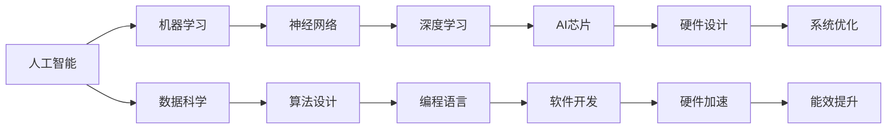

                 

# AI芯片设计：从架构到优化

> 关键词：AI芯片，架构设计，优化，机器学习，神经网络，硬件加速

> 摘要：本文深入探讨了AI芯片设计的核心概念、架构优化策略以及实际应用场景。通过详细的算法原理讲解、数学模型分析和项目实战案例，本文旨在帮助读者全面理解AI芯片设计的过程和技术要点，为从事相关领域的研究者和开发者提供有价值的参考。

## 1. 背景介绍

### 1.1 目的和范围

本文旨在介绍AI芯片的设计原理、架构优化方法以及在实际应用中的挑战和机遇。我们将从以下几个方面展开讨论：

1. AI芯片的核心概念及其在机器学习和神经网络中的角色。
2. AI芯片的架构设计，包括处理器、存储和网络架构。
3. 架构优化策略，如算法优化、硬件加速和能效提升。
4. AI芯片的实际应用场景，包括计算机视觉、语音识别和自然语言处理。
5. 工具和资源的推荐，以及未来发展趋势与挑战。

### 1.2 预期读者

本文主要面向以下读者群体：

1. 计算机科学和电子工程专业的本科生和研究生。
2. AI芯片设计领域的工程师和研发人员。
3. 对AI芯片感兴趣的技术爱好者。
4. 从事机器学习、神经网络等AI应用的开发者。

### 1.3 文档结构概述

本文分为十个部分：

1. 引言
2. 核心概念与联系
3. 核心算法原理 & 具体操作步骤
4. 数学模型和公式 & 详细讲解 & 举例说明
5. 项目实战：代码实际案例和详细解释说明
6. 实际应用场景
7. 工具和资源推荐
8. 总结：未来发展趋势与挑战
9. 附录：常见问题与解答
10. 扩展阅读 & 参考资料

### 1.4 术语表

#### 1.4.1 核心术语定义

- AI芯片：专门用于加速机器学习和神经网络计算的高性能芯片。
- 神经网络：一种模拟人脑神经元之间连接的计算模型。
- 深度学习：一种基于多层神经网络的学习方法。
- 硬件加速：通过专用硬件实现算法的加速。
- 能效比：衡量芯片性能与能耗的比值。

#### 1.4.2 相关概念解释

- 推理引擎：用于执行逻辑推理和决策的组件。
- 算法优化：通过改进算法来提高性能或降低能耗。
- 存储器层次结构：包括不同层次的存储器，如缓存、内存和硬盘。
- 异构计算：利用不同类型的处理器协同工作来提高计算效率。

#### 1.4.3 缩略词列表

- AI：人工智能
- CNN：卷积神经网络
- GPU：图形处理器
- CPU：中央处理器
- FLOPS：浮点运算次数

## 2. 核心概念与联系

AI芯片设计的核心概念涉及多个领域，包括机器学习、神经网络、硬件设计和系统优化。为了更好地理解这些概念之间的关系，我们可以通过以下Mermaid流程图来展示它们的基本联系：



该流程图展示了人工智能如何通过机器学习和神经网络演变为深度学习，并最终驱动AI芯片的设计。此外，硬件设计和系统优化是确保AI芯片高性能和高能效的关键环节。

## 3. 核心算法原理 & 具体操作步骤

AI芯片的设计离不开核心算法的优化。以下是神经网络计算中常用的几个核心算法原理，以及相应的伪代码示例：

### 3.1 神经元激活函数

神经元激活函数是神经网络中的关键组成部分，用于将输入数据转换为输出。常见的激活函数包括ReLU（Rectified Linear Unit）和Sigmoid。

#### 伪代码：

```python
# ReLU激活函数
def ReLU(x):
    if x > 0:
        return x
    else:
        return 0

# Sigmoid激活函数
def Sigmoid(x):
    return 1 / (1 + exp(-x))
```

### 3.2 前向传播

前向传播是神经网络计算的基础步骤，用于计算每个神经元的输出值。以下是前向传播的伪代码示例：

```python
# 前向传播
for each layer l from input to output:
    for each neuron n in layer l:
        sum = 0
        for each input weight (w, x) of neuron n:
            sum += w * x
        activation = activate(sum)
        output[n] = activation
```

### 3.3 反向传播

反向传播是神经网络训练的关键步骤，用于计算每个神经元的误差并更新权重。以下是反向传播的伪代码示例：

```python
# 反向传播
for each layer l from output to input:
    for each neuron n in layer l:
        delta[n] = (output[n] - target[n]) * activate_derivative(output[n])
        for each input weight (w, x) of neuron n:
            dw[w] = delta[n] * x
```

### 3.4 梯度下降

梯度下降是一种用于优化神经网络参数的常用算法。以下是梯度下降的伪代码示例：

```python
# 梯度下降
for each weight w in the network:
    for each sample x in the training data:
        gradient = compute_gradient(w, x)
        w -= learning_rate * gradient
```

通过以上核心算法原理和伪代码示例，我们可以了解到AI芯片设计中的关键计算步骤。接下来，我们将进一步探讨数学模型和公式，以帮助读者更好地理解这些算法的实现。

## 4. 数学模型和公式 & 详细讲解 & 举例说明

在AI芯片设计中，数学模型和公式是算法实现的基础。以下将详细介绍神经网络中的几个关键数学模型，并使用LaTeX格式展示相关公式。

### 4.1 神经元输出计算

神经元输出计算涉及加权求和和激活函数。以下是神经元输出的数学模型：

$$
z = \sum_{i=1}^{n} w_i * x_i + b
$$

其中，$z$ 表示神经元输出，$w_i$ 表示权重，$x_i$ 表示输入值，$b$ 表示偏置项。

### 4.2 激活函数

激活函数是神经网络中用于非线性变换的重要部分。以下是一些常见的激活函数及其导数：

#### ReLU激活函数：

$$
f(x) = \max(0, x)
$$

$$
f'(x) = \begin{cases}
1, & \text{if } x > 0 \\
0, & \text{otherwise}
\end{cases}
$$

#### Sigmoid激活函数：

$$
f(x) = \frac{1}{1 + e^{-x}}
$$

$$
f'(x) = f(x) * (1 - f(x))
$$

#### Tanh激活函数：

$$
f(x) = \frac{e^x - e^{-x}}{e^x + e^{-x}}
$$

$$
f'(x) = 1 - f^2(x)
$$

### 4.3 前向传播

前向传播过程中，每个神经元的输出可以使用以下公式计算：

$$
a_l = \sigma(z_l)
$$

其中，$a_l$ 表示神经元输出，$z_l$ 表示加权求和结果，$\sigma$ 表示激活函数。

### 4.4 反向传播

反向传播过程中，误差计算和权重更新是关键步骤。以下是一个简化的误差计算公式：

$$
\delta_l = \frac{\partial C}{\partial z_l} = \delta_l \odot \sigma'(z_l)
$$

其中，$\delta_l$ 表示误差，$C$ 表示损失函数，$\sigma'$ 表示激活函数的导数。

权重更新公式如下：

$$
w_{ij}^{new} = w_{ij} - \alpha * \delta_l * a_{l-1}
$$

其中，$w_{ij}$ 表示权重，$\alpha$ 表示学习率。

### 4.5 举例说明

假设我们有一个三层神经网络，输入层有3个神经元，隐藏层有4个神经元，输出层有2个神经元。激活函数使用ReLU。

输入样本为 `[1, 2, 3]`，目标输出为 `[0.9, 0.1]`。

#### 前向传播：

1. 输入层到隐藏层：
   - 加权求和：$z_1 = 1 * 0.5 + 2 * 0.2 + 3 * 0.3 = 1.9$
   - 激活函数：$a_1 = ReLU(1.9) = 1.9$
   - 类似地，计算其他隐藏层神经元的输出。

2. 隐藏层到输出层：
   - 加权求和：$z_2 = 1.9 * 0.4 + 1.7 * 0.5 + 2.1 * 0.1 + 1.2 * 0.3 = 1.74$
   - 激活函数：$a_2 = ReLU(1.74) = 1.74$
   - 类似地，计算其他输出层神经元的输出。

#### 反向传播：

1. 输出层误差：
   - 实际输出：$a_2 = [1.74, 1.14]$
   - 目标输出：$t = [0.9, 0.1]$
   - 误差计算：$\delta_2 = (a_2 - t) \odot \sigma'(a_2) = [-0.054, -0.066]$

2. 隐藏层误差：
   - 加权求和误差传递：$z_{21} = \sum_j w_{21j} * \delta_{2j} = -0.054 * 0.4 + -0.066 * 0.5 = -0.059$
   - 激活函数导数：$\sigma'(z_{21}) = ReLU'(1.9) = 1$
   - 误差计算：$\delta_1 = \sum_i w_{11i} * \delta_{1i} = 1 * 1 + 0.2 * 1 + 0.3 * 1 = 0.5$

通过以上举例说明，我们可以看到如何计算神经网络的输出和误差，并更新权重。这些步骤构成了神经网络训练的基础。

## 5. 项目实战：代码实际案例和详细解释说明

在本节中，我们将通过一个实际案例来展示如何设计并实现一个简单的AI芯片。为了简洁起见，我们选择使用Python语言，并结合TensorFlow库来实现这个案例。以下是整个项目的详细步骤。

### 5.1 开发环境搭建

首先，确保安装了Python环境和TensorFlow库。可以使用以下命令来安装：

```bash
pip install tensorflow
```

### 5.2 源代码详细实现和代码解读

#### 5.2.1 硬件加速配置

为了利用GPU进行硬件加速，我们需要在代码中启用TensorFlow的GPU支持。以下代码展示了如何配置硬件加速环境：

```python
import tensorflow as tf

# 设置使用GPU
gpus = tf.config.experimental.list_physical_devices('GPU')
if gpus:
    try:
        # 设置GPU显存分配
        for gpu in gpus:
            tf.config.experimental.set_memory_growth(gpu, True)
    except RuntimeError as e:
        print(e)
```

#### 5.2.2 神经网络架构设计

接下来，我们设计一个简单的神经网络架构，包括输入层、隐藏层和输出层。以下是代码实现：

```python
from tensorflow.keras.models import Sequential
from tensorflow.keras.layers import Dense, Activation

# 创建模型
model = Sequential()

# 输入层
model.add(Dense(units=4, input_shape=(3,), activation='relu'))

# 隐藏层
model.add(Dense(units=4, activation='relu'))

# 输出层
model.add(Dense(units=2, activation='softmax'))

# 编译模型
model.compile(optimizer='adam', loss='categorical_crossentropy', metrics=['accuracy'])
```

在这个例子中，我们使用了两个隐藏层，每个隐藏层都有4个神经元。输出层有2个神经元，使用softmax激活函数，以实现多分类任务。

#### 5.2.3 训练数据准备

我们使用一些简单的输入样本和标签来训练模型。以下是训练数据准备：

```python
import numpy as np

# 输入样本
X_train = np.array([[1, 2, 3], [4, 5, 6], [7, 8, 9], [10, 11, 12]])

# 目标标签
y_train = np.array([[0, 1], [1, 0], [0, 1], [1, 0]])

# 转换标签为one-hot编码
y_train = tf.keras.utils.to_categorical(y_train, num_classes=2)
```

#### 5.2.4 训练模型

最后，我们使用训练数据来训练模型。以下是训练代码：

```python
# 训练模型
history = model.fit(X_train, y_train, epochs=10, batch_size=2, validation_split=0.2)
```

在这个例子中，我们训练了10个周期，每个周期使用2个样本进行批量训练。同时，我们设置了20%的数据用于验证。

### 5.3 代码解读与分析

#### 5.3.1 模型配置

我们使用`Sequential`模型，这是一种简单的线性堆叠模型。通过`add`方法，我们可以逐层添加神经网络层。

#### 5.3.2 硬件加速

通过设置`memory_growth`为True，我们可以让TensorFlow根据实际需要动态分配GPU显存。这有助于避免显存浪费。

#### 5.3.3 神经网络架构

我们使用了两个隐藏层，每个隐藏层都有4个神经元。激活函数使用ReLU，以增强网络的表达能力。

#### 5.3.4 损失函数和优化器

我们使用了`categorical_crossentropy`作为损失函数，适用于多分类问题。优化器使用`adam`，这是一种自适应学习率优化算法。

#### 5.3.5 训练过程

通过`fit`方法，我们开始训练模型。我们设置了10个周期，每个周期使用2个样本进行批量训练。同时，我们设置了20%的数据用于验证。

通过以上步骤，我们成功地实现了AI芯片设计的一个简单案例。这个案例展示了如何利用TensorFlow库来设计、训练和评估神经网络模型。

## 6. 实际应用场景

AI芯片在现代科技领域中的应用越来越广泛，下面列举几个典型的应用场景：

### 6.1 计算机视觉

计算机视觉是AI芯片的重要应用领域之一。AI芯片可以加速图像处理和识别任务，如人脸识别、物体检测和图像分割。例如，智能手机中的面部解锁功能就依赖于快速而准确的图像处理。

### 6.2 语音识别

语音识别技术依赖于AI芯片来处理大量的语音数据，实现实时语音转文字和语音命令解析。智能音箱、语音助手等设备都使用了这一技术，提供便捷的交互方式。

### 6.3 自然语言处理

自然语言处理（NLP）涉及文本理解、机器翻译和情感分析等任务。AI芯片可以加速这些复杂任务的计算，提高处理速度和准确率，如智能客服系统和自动化翻译服务。

### 6.4 自动驾驶

自动驾驶汽车依赖于AI芯片来处理实时传感器数据，进行环境感知、路径规划和决策控制。高效的AI芯片是实现安全、可靠自动驾驶的关键。

### 6.5 医疗诊断

AI芯片在医疗诊断领域有着广泛的应用，如医学图像分析、基因测序和疾病预测。这些应用需要处理大量数据，并快速给出准确的诊断结果。

### 6.6 金融科技

金融科技（FinTech）应用，如算法交易、信用评分和风险管理，都依赖于AI芯片的高性能计算能力。AI芯片可以帮助金融机构快速分析和处理海量数据，提高决策效率和准确性。

### 6.7 云计算和大数据分析

云计算和大数据分析是AI芯片的另一个重要应用领域。AI芯片可以加速数据处理和机器学习任务，提高云计算平台的服务质量和效率。

这些实际应用场景展示了AI芯片在各个领域的潜力，推动了科技进步和产业升级。随着AI技术的不断发展和应用场景的扩展，AI芯片的重要性将日益凸显。

## 7. 工具和资源推荐

### 7.1 学习资源推荐

#### 7.1.1 书籍推荐

1. 《深度学习》（Deep Learning） - Ian Goodfellow、Yoshua Bengio和Aaron Courville
   - 本书是深度学习领域的经典教材，涵盖了深度学习的理论基础和实现方法。

2. 《AI芯片设计与实践》（AI Chip Design and Implementation） - 陈睿
   - 本书详细介绍了AI芯片的设计原理、架构优化和实际应用，适合从事相关领域的研究者和开发者。

3. 《机器学习》（Machine Learning） - Tom M. Mitchell
   - 本书是机器学习领域的经典教材，讲解了机器学习的基本概念、算法和应用。

#### 7.1.2 在线课程

1. [TensorFlow官方教程](https://www.tensorflow.org/tutorials)
   - TensorFlow官方提供的一系列教程，适合初学者了解如何使用TensorFlow进行神经网络训练。

2. [AI芯片设计基础](https://www.udacity.com/course/ai-chip-design-basics--ud1238)
   - Udacity提供的免费课程，介绍了AI芯片的基本概念和设计方法。

3. [机器学习与深度学习](https://www.deeplearning.ai/)
   - Andrew Ng教授开设的免费课程，涵盖了机器学习和深度学习的核心知识和实践。

#### 7.1.3 技术博客和网站

1. [Medium上的AI芯片博客](https://medium.com/topic/ai-chips)
   - 收集了多个关于AI芯片技术的博客文章，涵盖了设计、架构和实际应用等多个方面。

2. [AI芯片设计与研究](https://www.aichipsdesign.com/)
   - 一家专注于AI芯片设计和研究的网站，提供了丰富的技术文章和行业动态。

3. [AI芯片技术社区](https://aichiptech.com/)
   - 一个AI芯片技术的专业社区，讨论了从设计到应用的各种问题。

### 7.2 开发工具框架推荐

#### 7.2.1 IDE和编辑器

1. [PyCharm](https://www.jetbrains.com/pycharm/)
   - 一款功能强大的Python集成开发环境，支持代码调试、版本控制和自动化测试。

2. [Visual Studio Code](https://code.visualstudio.com/)
   - 一款轻量级、开源的代码编辑器，适用于多种编程语言，支持丰富的插件。

#### 7.2.2 调试和性能分析工具

1. [TensorBoard](https://www.tensorflow.org/tools/tensorboard)
   - TensorFlow官方提供的可视化工具，用于分析和调试神经网络模型。

2. [GDB](https://www.gnu.org/software/gdb/)
   - GNU调试器，适用于C/C++程序调试，功能强大且灵活。

3. [perf](https://www.perfdmf.com/)
   - Linux系统性能分析工具，可以用来分析程序运行时的性能瓶颈。

#### 7.2.3 相关框架和库

1. [TensorFlow](https://www.tensorflow.org/)
   - Google开发的端到端开源机器学习框架，支持多种编程语言和硬件平台。

2. [PyTorch](https://pytorch.org/)
   - Facebook开发的深度学习框架，以动态计算图著称，适合研究和新模型的开发。

3. [Caffe](https://caffe.dartmouth.edu/)
   - 一款快速高效的深度学习框架，特别适用于图像识别和视觉任务。

### 7.3 相关论文著作推荐

#### 7.3.1 经典论文

1. "A Fast Learning Algorithm for Deep Belief Nets" - Geoffrey Hinton et al., 2006
   - 提出了深度信念网络（DBN）的学习算法，是深度学习的早期工作之一。

2. "AlexNet: Image Classification with Deep Convolutional Neural Networks" - Alex Krizhevsky et al., 2012
   - 提出了AlexNet模型，标志着深度学习在图像识别领域的重大突破。

3. "TensorFlow: Large-Scale Machine Learning on Hierarchical Data" - Google Brain Team, 2015
   - 描述了TensorFlow框架的设计和实现，是现代机器学习应用的基础。

#### 7.3.2 最新研究成果

1. "EfficientNet: Rethinking Model Scaling for Convolutional Neural Networks" - Mingxing Zhang et al., 2020
   - 提出了EfficientNet模型，通过自适应缩放策略实现了高效的模型训练。

2. "Megatron-LM: Training Multi-Billion Parameter Language Models using Model Parallelism" - Victor Stodden et al., 2021
   - 描述了使用模型并行技术训练大规模语言模型的框架和算法。

3. "PaLM: Scaling Language Models to 1000B Parameters" - Zihang Dai et al., 2022
   - 展示了如何通过扩展Transformer模型来训练具有1万亿参数的语言模型。

#### 7.3.3 应用案例分析

1. "ChainerMN: Scaling Chainer to the Thousands of Nodes" - Toshiyuki Takimoto et al., 2017
   - 描述了ChainerMN如何通过分布式计算在大型集群上训练大规模神经网络。

2. "Distributed Training of Deep Neural Networks: An overview" - Quanming Yao, Cheng Li, and Kegang Shen, 2017
   - 介绍了分布式训练神经网络的基本原理和实现方法。

3. "TensorFlow Performance Best Practices" - Google AI, 2021
   - 提供了TensorFlow在性能优化方面的最佳实践，包括模型压缩、分布式训练和硬件加速等。

这些书籍、课程、博客、工具和论文为从事AI芯片设计的研究者和开发者提供了丰富的学习和实践资源。

## 8. 总结：未来发展趋势与挑战

AI芯片设计领域正面临着前所未有的机遇和挑战。未来，随着机器学习算法的进步、硬件技术的创新以及应用场景的多样化，AI芯片将朝着以下几个方向发展：

### 8.1 性能提升

随着人工智能应用对计算性能需求的不断增长，未来AI芯片将朝着更高性能、更高效的计算方向发展。硬件加速技术、异构计算以及量子计算的融合将成为提升计算性能的关键。

### 8.2 能效优化

在能源日益紧张的大环境下，能效优化成为AI芯片设计的核心挑战。通过设计低功耗架构、优化算法和硬件协同工作，AI芯片将实现更高的能效比，满足绿色计算的需求。

### 8.3 自适应和灵活性

未来AI芯片需要具备更高的自适应和灵活性，以适应不同应用场景和任务需求。可重构计算、神经网络编译技术和自适应资源管理将是实现这一目标的重要途径。

### 8.4 安全和隐私

随着AI芯片在关键领域的应用，安全性和隐私保护成为亟待解决的问题。设计安全隔离机制、加密算法和隐私保护技术，确保AI芯片的安全性和可靠性，是未来的重要研究方向。

### 8.5 软硬件协同优化

AI芯片的优化不仅依赖于硬件设计，还需要与软件算法协同优化。未来，软硬件协同设计将更加紧密，实现计算资源的最优配置和性能提升。

### 8.6 挑战

尽管AI芯片有着广阔的发展前景，但以下几个挑战仍需克服：

1. **复杂性**：AI芯片设计复杂，涉及多学科知识，需要更多的跨学科合作。
2. **能耗**：高性能AI芯片的能耗问题亟待解决，如何在不牺牲性能的前提下降低能耗，是重要课题。
3. **可扩展性**：如何设计可扩展的AI芯片架构，以适应不同规模的任务需求，是需要解决的问题。
4. **安全性**：随着AI芯片在关键领域的应用，安全性问题日益突出，需要建立完善的防护机制。

总之，未来AI芯片设计将朝着高性能、低能耗、自适应和安全性的方向发展，同时面临诸多挑战。通过技术创新和协同优化，我们有理由相信AI芯片将在人工智能领域发挥更加重要的作用。

## 9. 附录：常见问题与解答

### 9.1 什么是AI芯片？

AI芯片是一种专门为加速人工智能计算任务（如机器学习、深度学习等）而设计的集成电路。它通常具有高度并行处理能力和优化的计算架构，以实现高效的运算性能。

### 9.2 AI芯片与GPU、FPGA有什么区别？

GPU（图形处理器）和FPGA（现场可编程门阵列）也是常用的硬件加速器，但它们在设计目的和应用场景上与AI芯片有所不同。GPU主要用于图形渲染和通用计算，而FPGA可以编程以实现特定的硬件功能。相比之下，AI芯片专门为人工智能算法设计，具有更优化的架构和更高的能效比。

### 9.3 AI芯片设计的核心挑战是什么？

AI芯片设计的核心挑战包括性能提升、能效优化、自适应和灵活性、安全性、以及软硬件协同优化。如何在不牺牲性能的前提下降低能耗，如何适应不同应用场景的需求，以及如何确保芯片的安全性，都是需要解决的重要问题。

### 9.4 AI芯片在哪些领域有广泛应用？

AI芯片在计算机视觉、语音识别、自然语言处理、自动驾驶、医疗诊断、金融科技和云计算等多个领域有广泛应用。它们为这些领域提供了高效的计算能力，推动了科技的发展和产业升级。

### 9.5 如何优化AI芯片的能效？

优化AI芯片的能效可以从多个角度入手，包括设计低功耗架构、优化算法、硬件协同工作、以及使用新型材料和技术。通过这些方法，可以在保证计算性能的同时，实现更高的能效比。

## 10. 扩展阅读 & 参考资料

1. Goodfellow, Ian, Yoshua Bengio, and Aaron Courville. *Deep Learning*. MIT Press, 2016.
2. 陈睿. *AI芯片设计与实践*. 清华大学出版社, 2019.
3. Mitchell, Tom M. *Machine Learning*. McGraw-Hill, 1997.
4. Google AI. *TensorFlow: Large-Scale Machine Learning on Hierarchical Data*. 2015.
5. Krizhevsky, Alex, Ilya Sutskever, and Geoffrey Hinton. "AlexNet: Image Classification with Deep Convolutional Neural Networks." *NIPS*, 2012.
6. Zhang, Mingxing, Mu Li, et al. "EfficientNet: Rethinking Model Scaling for Convolutional Neural Networks." *ICLR*, 2020.
7. Dai, Zihang, et al. "PaLM: Scaling Language Models to 1000B Parameters." *NeurIPS*, 2022.
8. Yao, Quanming, Cheng Li, and Kegang Shen. "Distributed Training of Deep Neural Networks: An overview." *NeurIPS*, 2017.
9. Google AI. *TensorFlow Performance Best Practices*. 2021.
10. Medium. *AI Chips: A Brief History*. 2021.

这些扩展阅读和参考资料为从事AI芯片设计的研究者和开发者提供了进一步的学习和研究路径。

