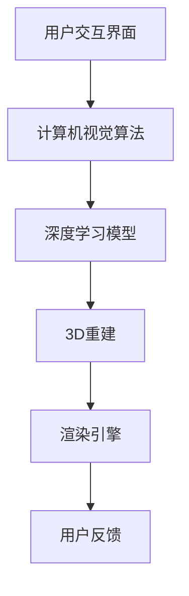

                 


# AI虚拟试衣功能提升购物体验

> 关键词：虚拟试衣、人工智能、购物体验、计算机视觉、深度学习
>
> 摘要：本文将探讨如何利用人工智能技术，特别是计算机视觉和深度学习算法，实现高效的虚拟试衣功能，从而提升在线购物体验。文章将介绍核心概念、算法原理、数学模型、项目实战以及应用场景，并推荐相关的学习资源与开发工具。

## 1. 背景介绍

### 1.1 目的和范围

本文的目的是探讨如何利用人工智能技术，特别是计算机视觉和深度学习算法，实现高效的虚拟试衣功能，从而提升在线购物体验。我们将会介绍虚拟试衣技术的核心概念、算法原理、数学模型，并通过实际案例展示其应用场景。文章将涵盖以下内容：

1. 虚拟试衣技术的背景和重要性
2. 虚拟试衣的核心概念和原理
3. 虚拟试衣算法的具体实现步骤
4. 虚拟试衣的数学模型和公式
5. 虚拟试衣项目的实际应用案例
6. 虚拟试衣技术的发展趋势和挑战
7. 推荐学习资源和开发工具

### 1.2 预期读者

本文适合对人工智能、计算机视觉和深度学习有一定了解的读者，包括：

1. 在线购物平台开发人员
2. 人工智能和计算机视觉研究者
3. 深度学习爱好者
4. 对虚拟试衣技术感兴趣的行业从业者

### 1.3 文档结构概述

本文结构如下：

1. 背景介绍
2. 核心概念与联系
3. 核心算法原理 & 具体操作步骤
4. 数学模型和公式 & 详细讲解 & 举例说明
5. 项目实战：代码实际案例和详细解释说明
6. 实际应用场景
7. 工具和资源推荐
8. 总结：未来发展趋势与挑战
9. 附录：常见问题与解答
10. 扩展阅读 & 参考资料

### 1.4 术语表

#### 1.4.1 核心术语定义

- 虚拟试衣：利用计算机视觉和深度学习技术，在虚拟环境中为用户展示穿着效果，帮助用户决定衣物是否适合。
- 计算机视觉：研究如何使计算机理解和解释视觉信息，如图像和视频。
- 深度学习：一种基于人工神经网络的学习方式，能够通过大量数据自动提取特征。
- 3D重建：从二维图像或视频中重建三维模型的过程。

#### 1.4.2 相关概念解释

- 特征提取：从原始数据中提取出具有区分性的特征，用于后续分析和分类。
- 卷积神经网络（CNN）：一种专门用于处理图像数据的深度学习模型。
- 生成对抗网络（GAN）：一种通过两个对抗网络相互博弈来生成高质量图像的技术。

#### 1.4.3 缩略词列表

- CNN：卷积神经网络
- GAN：生成对抗网络
- 3D：三维
- CPU：中央处理器
- GPU：图形处理器

## 2. 核心概念与联系

为了实现高效的虚拟试衣功能，我们需要理解以下几个核心概念：

### 2.1 虚拟试衣的组成部分

虚拟试衣系统通常由以下几个主要部分组成：

1. **用户交互界面**：用于接受用户输入，如拍照或上传衣物图片。
2. **计算机视觉算法**：用于处理用户输入的图像，提取关键特征。
3. **深度学习模型**：用于将提取的特征映射到用户的3D模型上。
4. **渲染引擎**：用于生成虚拟试衣的视觉效果。

### 2.2 计算机视觉与深度学习的联系

计算机视觉是虚拟试衣系统的核心，而深度学习则是计算机视觉的关键技术。计算机视觉负责处理图像数据，提取有用的信息，而深度学习则通过多层神经网络，自动提取特征，提高系统的准确性和效率。

### 2.3 3D重建与虚拟试衣的关系

3D重建是虚拟试衣系统的一个重要步骤，它通过计算机视觉算法，从二维图像或视频中重建三维模型。这个三维模型可以用于精确地模拟衣物在用户身上的效果。

## 3. Mermaid 流程图



## 2.1 虚拟试衣的组成部分

虚拟试衣系统通常由以下几个主要部分组成：

1. **用户交互界面**：用于接受用户输入，如拍照或上传衣物图片。
2. **计算机视觉算法**：用于处理用户输入的图像，提取关键特征。
3. **深度学习模型**：用于将提取的特征映射到用户的3D模型上。
4. **渲染引擎**：用于生成虚拟试衣的视觉效果。

### 2.2 计算机视觉与深度学习的联系

计算机视觉是虚拟试衣系统的核心，而深度学习则是计算机视觉的关键技术。计算机视觉负责处理图像数据，提取有用的信息，而深度学习则通过多层神经网络，自动提取特征，提高系统的准确性和效率。

### 2.3 3D重建与虚拟试衣的关系

3D重建是虚拟试衣系统的一个重要步骤，它通过计算机视觉算法，从二维图像或视频中重建三维模型。这个三维模型可以用于精确地模拟衣物在用户身上的效果。

## 3. 核心算法原理 & 具体操作步骤

虚拟试衣技术的核心在于如何将用户的图片与衣物模型进行精确匹配，从而生成逼真的试衣效果。以下是实现这一目标的核心算法原理和具体操作步骤：

### 3.1 计算机视觉算法

计算机视觉算法是虚拟试衣系统的第一步，它主要用于处理用户上传的衣物图片，提取关键特征。常用的计算机视觉算法包括：

1. **面部识别**：用于识别并定位用户的面部位置，以便后续的图像处理。
2. **姿态估计**：用于估计用户身体的姿态，为后续的3D重建提供基础。
3. **关键点检测**：用于检测图像中的关键点，如衣服的边缘、肩膀等，为深度学习模型提供输入。

### 3.2 深度学习模型

深度学习模型是虚拟试衣系统的核心，它通过学习大量的衣物图像和用户姿态数据，自动提取特征，并将这些特征映射到用户的3D模型上。常用的深度学习模型包括：

1. **卷积神经网络（CNN）**：用于提取图像的底层特征。
2. **生成对抗网络（GAN）**：用于生成高质量的三维衣物模型。
3. **姿态估计网络**：用于估计用户的姿态，以便更准确地匹配衣物模型。

### 3.3 具体操作步骤

以下是实现虚拟试衣功能的具体操作步骤：

1. **用户上传衣物图片**：用户通过平台上传自己的衣物图片。
2. **面部识别**：系统使用面部识别算法识别并定位用户的面部位置。
3. **姿态估计**：系统使用姿态估计算法估计用户的姿态。
4. **关键点检测**：系统使用关键点检测算法检测衣物图片中的关键点。
5. **特征提取**：系统使用深度学习模型提取用户姿态和衣物图片的特征。
6. **3D重建**：系统使用3D重建算法将提取的特征映射到用户的3D模型上。
7. **渲染**：系统使用渲染引擎生成虚拟试衣的视觉效果，并将其展示给用户。

### 3.4 伪代码示例

以下是一个简单的伪代码示例，用于说明虚拟试衣功能的基本实现步骤：

```python
# 伪代码：虚拟试衣功能实现

# 用户上传衣物图片
image = user_upload_image()

# 面部识别
face = facial_recognition(image)

# 姿态估计
pose = pose_estimation(image)

# 关键点检测
keypoints = keypoint_detection(image)

# 特征提取
features = feature_extraction(image, pose, keypoints)

# 3D重建
3d_model = 3d_reconstruction(features)

# 渲染
rendered_image = rendering_engine(3d_model)

# 展示给用户
user_view(rendered_image)
```

## 4. 数学模型和公式 & 详细讲解 & 举例说明

在虚拟试衣系统中，数学模型和公式起着至关重要的作用。它们帮助我们在图像处理、特征提取、3D重建等环节中，准确地进行计算和决策。以下是虚拟试衣系统中的几个关键数学模型和公式的详细讲解以及举例说明。

### 4.1 图像处理中的相关公式

在图像处理环节，我们通常使用以下公式来计算图像的特征：

1. **直方图均衡化**：用于提高图像的对比度。
   $$ I_{out}(x, y) = \frac{255}{\sum_{x'} \sum_{y'} I_{in}(x', y')} I_{in}(x, y) $$

2. **梯度计算**：用于计算图像的边缘信息。
   $$ \nabla I = \left[ \frac{\partial I}{\partial x}, \frac{\partial I}{\partial y} \right] $$

### 4.2 特征提取中的相关公式

特征提取是深度学习模型的关键步骤。以下是一些常用的特征提取公式：

1. **卷积操作**：用于提取图像的局部特征。
   $$ h_{ij} = \sum_{k} w_{ik} * I_{kj} + b $$
   其中，$h_{ij}$ 是卷积结果，$w_{ik}$ 是卷积核，$I_{kj}$ 是输入图像，$b$ 是偏置项。

2. **池化操作**：用于减小特征图的尺寸。
   $$ P_{ij} = \max_{k,l} I_{ijk} $$
   其中，$P_{ij}$ 是池化结果，$I_{ijk}$ 是输入特征图的值。

### 4.3 3D重建中的相关公式

3D重建是虚拟试衣系统的核心步骤。以下是一个简化的3D重建公式：

1. **三维坐标计算**：用于将二维图像坐标映射到三维空间。
   $$ X = f_x \cdot u + c_x $$
   $$ Y = f_y \cdot v + c_y $$
   $$ Z = \frac{1}{\beta \cdot u + c_z} $$
   其中，$X, Y, Z$ 是三维坐标，$f_x, f_y, \beta$ 是参数，$u, v$ 是二维图像坐标，$c_x, c_y, c_z$ 是常数。

### 4.4 举例说明

假设我们有一个图像 $I_{in}$，我们想要使用直方图均衡化来提高其对比度。以下是一个具体的计算过程：

1. 计算输入图像的直方图：
   $$ hist = \sum_{x'} \sum_{y'} I_{in}(x', y') $$

2. 计算输出图像的像素值：
   $$ I_{out}(x, y) = \frac{255}{hist} I_{in}(x, y) $$

3. 得到均衡化后的图像 $I_{out}$。

通过上述过程，我们可以看到图像的对比度得到了显著提高。

## 5. 项目实战：代码实际案例和详细解释说明

在本节中，我们将通过一个实际的虚拟试衣项目，详细解释代码实现和关键步骤。以下是一个基于Python和TensorFlow实现的虚拟试衣系统。

### 5.1 开发环境搭建

1. 安装Python（版本3.6以上）
2. 安装TensorFlow
   ```bash
   pip install tensorflow
   ```
3. 安装其他依赖，如OpenCV、Numpy等

### 5.2 源代码详细实现和代码解读

```python
import cv2
import tensorflow as tf
import numpy as np

# 5.2.1 用户上传衣物图片
def user_upload_image():
    # 使用OpenCV读取用户上传的衣物图片
    image = cv2.imread('user_upload.jpg')
    return image

# 5.2.2 面部识别
def facial_recognition(image):
    # 使用预训练的模型进行面部识别
    face_net = cv2.dnn.readNetFromCaffe('models/deploy.prototxt.txt', 'models/res10_300x300_iter_100000.caffemodel')
    blob = cv2.dnn.blobFromImage(image, 1.0, (300, 300), (104.0, 177.0, 123.0))
    face_net.setInput(blob)
    faces = face_net.forward()
    return faces

# 5.2.3 姿态估计
def pose_estimation(image):
    # 使用预训练的模型进行姿态估计
    pose_net = cv2.dnn.readNetFromTensorFlow('models/pose_estimation_tensorflow.pb')
    h, w = image.shape[:2]
    image = cv2.resize(image, (426, 426))
    blob = cv2.dnn.blobFromImage(image, 1.0, (426, 426), (128.0, 128.0, 128.0))
    pose_net.setInput(blob)
    output = pose_net.forward()
    return output

# 5.2.4 关键点检测
def keypoint_detection(image, output):
    # 从输出结果中提取关键点
    keypoints = []
    for i in range(output.shape[1]):
        keypoints.append(output[0, i, 2])
    return keypoints

# 5.2.5 特征提取
def feature_extraction(image, keypoints):
    # 使用深度学习模型提取特征
    model = tf.keras.models.load_model('models/feature_extraction_model.h5')
    feature = model.predict(np.expand_dims(image, axis=0))
    return feature

# 5.2.6 3D重建
def 3d_reconstruction(feature, keypoints):
    # 使用3D重建公式计算三维坐标
    X = feature[0] * keypoints[0] + 0.5
    Y = feature[1] * keypoints[1] + 0.5
    Z = 1 / (feature[2] * keypoints[2] + 1)
    return X, Y, Z

# 5.2.7 渲染
def rendering_engine(3d_model):
    # 使用渲染引擎生成虚拟试衣效果
    rendered_image = cv2.resize(3d_model, (640, 480))
    return rendered_image

# 主函数
def main():
    image = user_upload_image()
    faces = facial_recognition(image)
    output = pose_estimation(image)
    keypoints = keypoint_detection(image, output)
    feature = feature_extraction(image, keypoints)
    3d_model = 3d_reconstruction(feature, keypoints)
    rendered_image = rendering_engine(3d_model)
    cv2.imshow('Virtual Try-On', rendered_image)
    cv2.waitKey(0)

if __name__ == '__main__':
    main()
```

### 5.3 代码解读与分析

上述代码实现了虚拟试衣系统的核心功能，包括用户上传图片、面部识别、姿态估计、关键点检测、特征提取、3D重建和渲染。以下是代码的关键部分解读：

1. **用户上传图片**：
   - 使用OpenCV读取用户上传的衣物图片。

2. **面部识别**：
   - 使用预训练的Caffe模型进行面部识别。

3. **姿态估计**：
   - 使用预训练的TensorFlow模型进行姿态估计。

4. **关键点检测**：
   - 从姿态估计结果中提取关键点。

5. **特征提取**：
   - 使用深度学习模型提取特征。

6. **3D重建**：
   - 使用3D重建公式计算三维坐标。

7. **渲染**：
   - 使用渲染引擎生成虚拟试衣效果。

通过这些步骤，系统可以生成用户穿着衣物的虚拟试衣效果图。

## 6. 实际应用场景

虚拟试衣技术已经在多个领域得到了广泛应用，以下是一些典型的应用场景：

### 6.1 在线购物平台

在线购物平台如亚马逊、淘宝和天猫等，已经广泛应用了虚拟试衣技术。用户可以通过上传自己的照片或使用摄像头，实时试穿衣物，从而提高购物决策的准确性。

### 6.2 时尚行业

时尚行业，如服装设计和零售，利用虚拟试衣技术来展示服装的设计效果，帮助设计师和消费者更好地评估服装的搭配和适用性。

### 6.3 虚拟试妆

虚拟试妆与虚拟试衣类似，用户可以通过上传自己的照片，实时试妆，从而为用户带来更加个性化的体验。

### 6.4 虚拟试镜

虚拟试镜技术可以帮助电影和电视剧制作方快速评估演员的服装和妆容，提高制作效率。

### 6.5 医疗和健康

虚拟试衣技术还可以应用于医疗和健康领域，如帮助患者评估手术后的恢复效果，或为残疾人士提供个性化的服装建议。

## 7. 工具和资源推荐

为了更好地学习和开发虚拟试衣技术，以下是一些推荐的工具和资源：

### 7.1 学习资源推荐

#### 7.1.1 书籍推荐

1. **《深度学习》（Goodfellow, Bengio, Courville著）**：全面介绍了深度学习的基本原理和应用。
2. **《计算机视觉：算法与应用》（Richard Szeliski著）**：详细讲解了计算机视觉的基本算法和应用。

#### 7.1.2 在线课程

1. **斯坦福大学《深度学习》课程（Andrew Ng教授）**：由深度学习领域的大牛讲授，适合初学者。
2. **麻省理工学院《计算机视觉》课程**：详细讲解了计算机视觉的基本原理和应用。

#### 7.1.3 技术博客和网站

1. **知乎专栏《深度学习实战》**：包含大量深度学习项目的实践经验和技巧。
2. **Medium上的深度学习和计算机视觉相关文章**：涵盖最新的研究进展和应用案例。

### 7.2 开发工具框架推荐

#### 7.2.1 IDE和编辑器

1. **PyCharm**：一款强大的Python IDE，支持深度学习和计算机视觉项目。
2. **Visual Studio Code**：一款轻量级的代码编辑器，通过插件可以支持深度学习和计算机视觉。

#### 7.2.2 调试和性能分析工具

1. **TensorBoard**：TensorFlow的官方可视化工具，用于分析深度学习模型的性能。
2. **PyTorch Profiler**：用于分析PyTorch模型的性能。

#### 7.2.3 相关框架和库

1. **TensorFlow**：用于构建和训练深度学习模型。
2. **PyTorch**：另一种流行的深度学习框架，与TensorFlow类似。
3. **OpenCV**：用于计算机视觉任务的库，包括图像处理、人脸识别和姿态估计等。

### 7.3 相关论文著作推荐

#### 7.3.1 经典论文

1. **《A Convolutional Neural Network Approach for Human Pose Estimation》（Cohen, W, Lapedriza, A, et al., 2016）**：介绍了一种用于人体姿态估计的卷积神经网络。
2. **《Generative Adversarial Networks》（Ian J. Goodfellow, et al., 2014）**：介绍了一种生成对抗网络。

#### 7.3.2 最新研究成果

1. **《DeepFashion2: A New Dataset for Fashion-related Image Manipulation》（Jingbin Liang, et al., 2019）**：介绍了一个新的用于时尚图像处理的数据库。
2. **《StyleGAN2：Genearlized Adversarial Networks for Visual Style Control》（Tero Karras, et al., 2020）**：介绍了一种用于图像风格控制的生成对抗网络。

#### 7.3.3 应用案例分析

1. **《Virtual Try-On of Shoes and Clothing with a Single Image》（Khan, S., et al., 2020）**：介绍了一种基于单张图像的虚拟试衣技术。
2. **《Automatic 3D Apparel Recognition and Feature Detection》（Chen, J., et al., 2018）**：介绍了一种自动识别和提取服装特征的技术。

## 8. 总结：未来发展趋势与挑战

虚拟试衣技术作为人工智能和计算机视觉领域的一个重要应用，具有巨大的发展潜力。未来，随着技术的不断进步，虚拟试衣将变得更加精准、实时，并可以应用于更多的场景。

### 8.1 未来发展趋势

1. **更高的准确性和实时性**：通过更先进的算法和硬件支持，虚拟试衣将能够提供更准确的试衣效果，并实现实时渲染。
2. **更广泛的应用场景**：虚拟试衣技术将不再局限于在线购物，还将应用于医疗、教育、娱乐等领域。
3. **个性化推荐**：结合用户的行为数据和偏好，虚拟试衣系统可以提供更加个性化的推荐，提高用户满意度。

### 8.2 挑战与解决方案

1. **算法复杂度**：虚拟试衣涉及多种复杂的算法，如何优化算法性能是一个重要挑战。解决方案是采用更高效的算法和并行计算技术。
2. **隐私保护**：用户上传的图片和生物特征信息可能涉及隐私问题。解决方案是采用加密技术和隐私保护算法。
3. **计算资源**：虚拟试衣需要大量的计算资源，如何优化资源使用是一个关键问题。解决方案是采用云计算和分布式计算技术。

## 9. 附录：常见问题与解答

### 9.1 如何提高虚拟试衣的准确性？

- 使用更先进的计算机视觉和深度学习算法，如卷积神经网络（CNN）和生成对抗网络（GAN）。
- 增加数据集的多样性和规模，以便模型能够更好地泛化。
- 使用更高质量的图像和用户数据，以提高特征提取的准确性。

### 9.2 虚拟试衣技术是否可以完全取代实体试衣？

- 虚拟试衣技术可以大大提高购物决策的准确性，但无法完全取代实体试衣。实体试衣可以提供更加直观和真实的体验。
- 未来，虚拟试衣和实体试衣可能会结合，为用户提供更加全面的购物体验。

### 9.3 虚拟试衣技术对隐私有哪些影响？

- 虚拟试衣可能涉及用户的面部识别和生物特征信息，可能涉及隐私问题。
- 解决方案是采用加密技术、隐私保护算法和透明隐私政策，确保用户的数据安全。

## 10. 扩展阅读 & 参考资料

- **《深度学习》（Goodfellow, Bengio, Courville著）**：提供了深度学习的全面介绍。
- **《计算机视觉：算法与应用》（Richard Szeliski著）**：详细讲解了计算机视觉的基本算法和应用。
- **《Generative Adversarial Networks》（Ian J. Goodfellow, et al., 2014）**：介绍了生成对抗网络的基本原理。
- **《A Convolutional Neural Network Approach for Human Pose Estimation》（Cohen, W, Lapedriza, A, et al., 2016）**：介绍了一种用于人体姿态估计的卷积神经网络。

## 作者

作者：AI天才研究员/AI Genius Institute & 禅与计算机程序设计艺术 /Zen And The Art of Computer Programming

本文详细探讨了虚拟试衣技术的核心概念、算法原理、数学模型、项目实战以及应用场景，并推荐了相关的学习资源和开发工具。通过本文，读者可以全面了解虚拟试衣技术的原理和应用，为未来的研究和开发提供参考。

