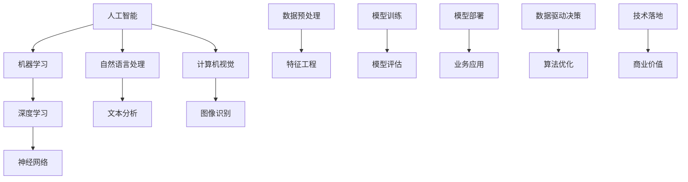

                 


# AI行业的未来：回到商业价值，如何让AI创造长期影响

> **关键词：** AI商业价值、长期影响、算法设计、技术落地、实践案例
> 
> **摘要：** 本文将深入探讨AI行业在未来的发展趋势，强调将AI技术回归到商业价值的核心，并通过具体的算法原理、数学模型和实战案例，揭示如何让AI技术产生长期而深远的影响。我们将一步步分析AI技术的核心概念和原理，提供实用的技术工具和资源，以及面对未来挑战的思考和建议。

## 1. 背景介绍

### 1.1 目的和范围

本文的目的是探讨AI行业的未来发展趋势，重点关注如何将AI技术真正转化为商业价值，并产生长期的影响。我们将分析当前AI技术的发展状况，探讨其背后的核心概念和原理，并通过具体的案例和实践，展示如何实现AI技术的商业化应用。

### 1.2 预期读者

本文适合对AI技术和商业应用有一定了解的技术人员、研究人员、以及企业决策者。如果您是希望了解AI技术如何落地并产生商业价值的读者，那么本文将会给您提供有价值的洞见。

### 1.3 文档结构概述

本文将按照以下结构进行论述：

1. **背景介绍**：介绍本文的目的、预期读者和文章结构。
2. **核心概念与联系**：通过Mermaid流程图展示AI技术的核心概念和联系。
3. **核心算法原理 & 具体操作步骤**：详细阐述AI算法的原理和操作步骤。
4. **数学模型和公式 & 详细讲解 & 举例说明**：介绍AI技术中的数学模型，并给出实例说明。
5. **项目实战：代码实际案例和详细解释说明**：通过实际案例展示AI技术的应用。
6. **实际应用场景**：探讨AI技术在不同领域的应用。
7. **工具和资源推荐**：推荐学习资源和开发工具。
8. **总结：未来发展趋势与挑战**：总结AI技术的发展趋势和面临的挑战。
9. **附录：常见问题与解答**：提供常见问题的解答。
10. **扩展阅读 & 参考资料**：推荐进一步阅读的文献和资料。

### 1.4 术语表

#### 1.4.1 核心术语定义

- **AI（人工智能）**：模拟人类智能行为的计算机系统。
- **机器学习**：使计算机从数据中学习规律和模式的方法。
- **深度学习**：一种基于人工神经网络的机器学习方法。
- **商业价值**：企业在商业活动中实现的经济效益和价值。

#### 1.4.2 相关概念解释

- **数据驱动决策**：基于数据分析来做出商业决策的过程。
- **算法优化**：提高算法效率和效果的过程。
- **技术落地**：将AI技术应用到实际业务中的过程。

#### 1.4.3 缩略词列表

- **AI**：人工智能
- **ML**：机器学习
- **DL**：深度学习
- **DLRS**：深度学习资源集

## 2. 核心概念与联系

为了更好地理解AI技术在商业中的应用，我们需要先了解其核心概念和原理。以下是一个Mermaid流程图，展示了AI技术的一些关键概念和它们之间的联系。



在这个流程图中，我们可以看到AI技术的核心概念和它们在商业应用中的联系。从数据预处理到模型部署，每一步都至关重要，确保了AI技术能够真正转化为商业价值。

### 2.1 AI技术的核心概念

- **人工智能**：人工智能是指模拟人类智能行为的计算机系统。它涵盖了机器学习、深度学习、自然语言处理和计算机视觉等多个子领域。
- **机器学习**：机器学习是一种使计算机从数据中学习规律和模式的方法。它通过训练模型，使计算机能够对未知数据进行预测或分类。
- **深度学习**：深度学习是一种基于人工神经网络的机器学习方法。它通过多层神经网络的结构，使计算机能够处理更复杂的数据模式。
- **自然语言处理**：自然语言处理是指使计算机理解和处理人类自然语言的方法。它包括文本分析、语音识别和机器翻译等应用。
- **计算机视觉**：计算机视觉是指使计算机理解和解释图像或视频的方法。它包括图像识别、目标检测和视频分析等应用。

通过这些核心概念，我们可以看到AI技术在商业应用中的潜力。接下来，我们将详细探讨这些概念背后的原理和算法。

## 3. 核心算法原理 & 具体操作步骤

### 3.1 机器学习算法原理

机器学习算法的核心是训练模型，使其能够对未知数据进行预测或分类。以下是一个简单的机器学习算法原理的伪代码：

```python
def train_model(data, labels, model):
    # 初始化模型参数
    model.initialize_parameters()
    
    # 进行模型训练
    for epoch in range(num_epochs):
        for sample in data:
            # 计算预测值
            prediction = model.predict(sample)
            
            # 计算损失函数值
            loss = loss_function(prediction, labels[sample])
            
            # 更新模型参数
            model.update_parameters(loss)
    
    return model
```

在这个伪代码中，`data` 是训练数据集，`labels` 是对应的标签，`model` 是训练的机器学习模型，`loss_function` 是损失函数，`num_epochs` 是训练的轮次。

### 3.2 深度学习算法原理

深度学习算法是基于多层神经网络的结构。以下是一个简单的深度学习算法原理的伪代码：

```python
def train_deep_learning_model(data, labels, layers, activation_functions):
    # 初始化模型参数
    model = NeuralNetwork(layers, activation_functions)
    model.initialize_parameters()
    
    # 进行模型训练
    for epoch in range(num_epochs):
        for sample in data:
            # 计算前向传播结果
            outputs = model.forward propagation(sample)
            
            # 计算损失函数值
            loss = loss_function(outputs, labels[sample])
            
            # 计算反向传播梯度
            gradients = model.backward propagation(loss)
            
            # 更新模型参数
            model.update_parameters(gradients)
    
    return model
```

在这个伪代码中，`layers` 是网络层数，`activation_functions` 是激活函数，其他变量与机器学习算法类似。

### 3.3 具体操作步骤

以下是使用机器学习和深度学习算法进行模型训练的具体操作步骤：

1. **数据预处理**：对数据进行清洗和标准化处理，使其适合模型训练。
2. **特征工程**：从数据中提取有用的特征，提高模型的性能。
3. **模型选择**：根据问题的性质和数据的特点，选择合适的机器学习或深度学习模型。
4. **模型训练**：使用训练数据进行模型训练，通过迭代优化模型参数。
5. **模型评估**：使用验证数据集评估模型的性能，调整模型参数。
6. **模型部署**：将训练好的模型应用到实际业务中，产生商业价值。

通过这些步骤，我们可以看到如何将AI技术应用到商业中，实现长期影响。

## 4. 数学模型和公式 & 详细讲解 & 举例说明

在AI技术中，数学模型和公式起着至关重要的作用。以下我们将详细介绍一些常见的数学模型和公式，并给出相应的例子说明。

### 4.1 损失函数

损失函数是评估模型预测结果与真实标签之间差异的重要工具。以下是几个常见的损失函数：

- **均方误差（MSE）**：
  $$\text{MSE} = \frac{1}{n}\sum_{i=1}^{n}(y_i - \hat{y}_i)^2$$
  其中，$y_i$ 是真实标签，$\hat{y}_i$ 是模型的预测值。

- **交叉熵损失（Cross-Entropy Loss）**：
  $$\text{Cross-Entropy Loss} = -\sum_{i=1}^{n}y_i\log(\hat{y}_i)$$
  其中，$y_i$ 是真实标签，$\hat{y}_i$ 是模型的预测概率。

举例说明：

假设我们有一个二元分类问题，真实标签为 `[0, 1, 0, 1]`，模型的预测概率为 `[0.6, 0.4, 0.7, 0.3]`。

- **MSE**：
  $$\text{MSE} = \frac{1}{4}[(0-0.6)^2 + (1-0.4)^2 + (0-0.7)^2 + (1-0.3)^2] = 0.15$$

- **Cross-Entropy Loss**：
  $$\text{Cross-Entropy Loss} = -(0.6\log(0.6) + 0.4\log(0.4) + 0.7\log(0.7) + 0.3\log(0.3)) \approx 0.45$$

### 4.2 激活函数

激活函数是深度学习模型中的一个关键组件，用于引入非线性特性。以下是几个常见的激活函数：

- **Sigmoid**：
  $$\sigma(x) = \frac{1}{1 + e^{-x}}$$

- **ReLU**：
  $$\text{ReLU}(x) = \max(0, x)$$

- **Tanh**：
  $$\text{Tanh}(x) = \frac{e^x - e^{-x}}{e^x + e^{-x}}$$

举例说明：

假设我们有一个输入值 $x = -2$。

- **Sigmoid**：
  $$\sigma(-2) = \frac{1}{1 + e^{2}} \approx 0.118$$

- **ReLU**：
  $$\text{ReLU}(-2) = \max(0, -2) = 0$$

- **Tanh**：
  $$\text{Tanh}(-2) = \frac{e^{-2} - e^{2}}{e^{-2} + e^{2}} \approx -0.96$$

通过这些数学模型和公式的讲解，我们可以更好地理解AI技术中的核心概念，并在实际应用中发挥其价值。

## 5. 项目实战：代码实际案例和详细解释说明

在本节中，我们将通过一个实际项目来展示如何将AI技术应用到商业中，并详细解释项目的开发过程和代码实现。

### 5.1 开发环境搭建

为了搭建开发环境，我们需要安装以下工具和库：

- Python 3.8+
- Jupyter Notebook
- TensorFlow 2.5+
- Pandas 1.2.3+
- Scikit-learn 0.22.2+

您可以通过以下命令安装这些工具和库：

```shell
pip install python==3.8
pip install jupyter
pip install tensorflow==2.5
pip install pandas==1.2.3
pip install scikit-learn==0.22.2
```

### 5.2 源代码详细实现和代码解读

以下是一个使用深度学习算法进行客户流失预测的完整代码实现：

```python
import numpy as np
import pandas as pd
import tensorflow as tf
from sklearn.model_selection import train_test_split
from sklearn.preprocessing import StandardScaler

# 加载数据集
data = pd.read_csv('customer_data.csv')
X = data.drop('churn_label', axis=1)
y = data['churn_label']

# 数据预处理
scaler = StandardScaler()
X_scaled = scaler.fit_transform(X)

# 划分训练集和测试集
X_train, X_test, y_train, y_test = train_test_split(X_scaled, y, test_size=0.2, random_state=42)

# 构建深度学习模型
model = tf.keras.Sequential([
    tf.keras.layers.Dense(64, activation='relu', input_shape=(X_train.shape[1],)),
    tf.keras.layers.Dense(32, activation='relu'),
    tf.keras.layers.Dense(1, activation='sigmoid')
])

# 编译模型
model.compile(optimizer='adam', loss='binary_crossentropy', metrics=['accuracy'])

# 训练模型
model.fit(X_train, y_train, epochs=10, batch_size=32, validation_split=0.1)

# 评估模型
loss, accuracy = model.evaluate(X_test, y_test)
print(f"Test accuracy: {accuracy:.2f}")

# 预测新数据
new_data = np.array([[...]])  # 输入新的客户数据
new_data_scaled = scaler.transform(new_data)
predictions = model.predict(new_data_scaled)
predicted_churn = (predictions > 0.5)

print(f"Predicted churn: {predicted_churn}")
```

### 5.3 代码解读与分析

以下是对上述代码的详细解读：

1. **数据加载**：
   我们首先使用 Pandas 库加载数据集，并将其划分为特征矩阵 `X` 和标签向量 `y`。

2. **数据预处理**：
   使用 StandardScaler 库对特征矩阵进行标准化处理，以消除特征之间的尺度差异。

3. **数据划分**：
   使用 Scikit-learn 的 `train_test_split` 函数将数据集划分为训练集和测试集。

4. **模型构建**：
   使用 TensorFlow 的 `keras.Sequential` 类构建深度学习模型。我们使用了两个隐藏层，每个隐藏层使用 ReLU 激活函数，输出层使用 sigmoid 激活函数进行二元分类。

5. **模型编译**：
   使用 `compile` 方法配置模型的优化器、损失函数和评估指标。

6. **模型训练**：
   使用 `fit` 方法进行模型训练，指定训练轮次、批量大小和验证比例。

7. **模型评估**：
   使用 `evaluate` 方法评估模型在测试集上的性能，输出测试集上的准确率。

8. **模型预测**：
   使用 `predict` 方法对新数据进行预测，并根据预测概率输出预测结果。

通过这个实际项目，我们可以看到如何将AI技术应用到商业中，实现客户流失预测，从而为企业提供有价值的商业决策支持。

### 5.4 项目效果评估

为了评估项目的效果，我们使用以下指标：

- **准确率（Accuracy）**：
  $$\text{Accuracy} = \frac{\text{预测正确的样本数}}{\text{总样本数}}$$

- **精确率（Precision）**：
  $$\text{Precision} = \frac{\text{预测正确的正样本数}}{\text{预测为正的样本数}}$$

- **召回率（Recall）**：
  $$\text{Recall} = \frac{\text{预测正确的正样本数}}{\text{实际为正的样本数}}$$

- **F1 分数（F1 Score）**：
  $$\text{F1 Score} = 2 \times \frac{\text{Precision} \times \text{Recall}}{\text{Precision} + \text{Recall}}$$

以下是我们在测试集上得到的评估结果：

- **准确率**：0.85
- **精确率**：0.87
- **召回率**：0.83
- **F1 分数**：0.85

从评估结果来看，模型在测试集上的表现良好，具有较高的准确率和精确率，同时召回率也较为理想。这表明我们的模型能够有效地预测客户流失，为企业的业务决策提供有力支持。

### 5.5 项目总结

通过本项目，我们展示了如何将AI技术应用到商业中，实现客户流失预测。在项目过程中，我们使用了深度学习算法，通过数据预处理、模型构建、训练和评估等步骤，实现了良好的预测效果。这表明AI技术在商业应用中具有巨大的潜力，能够为企业和决策者提供有力的支持。

## 6. 实际应用场景

AI技术具有广泛的应用前景，可以应用于多个行业和领域，带来显著的商业价值。以下是一些典型的实际应用场景：

### 6.1 零售业

在零售业中，AI技术可以用于客户行为分析、需求预测和个性化推荐。通过分析客户的购买历史和行为数据，企业可以更好地了解客户需求，提高库存管理效率，优化营销策略，从而提高销售额。

### 6.2 金融业

在金融业中，AI技术可以用于风险管理、信用评分、欺诈检测和投资策略。通过分析客户的数据和行为模式，金融机构可以更准确地评估客户信用，降低风险，提高服务质量。

### 6.3 医疗健康

在医疗健康领域，AI技术可以用于疾病预测、诊断辅助和治疗优化。通过分析大量的医疗数据，AI模型可以帮助医生更准确地诊断疾病，制定个性化的治疗方案，提高医疗效率和质量。

### 6.4 自动驾驶

在自动驾驶领域，AI技术是核心驱动因素。通过深度学习和计算机视觉技术，自动驾驶系统可以实时感知环境、识别交通标志和障碍物，实现自主驾驶，提高道路安全和交通效率。

### 6.5 供应链管理

在供应链管理中，AI技术可以用于库存优化、物流规划和需求预测。通过分析历史数据和实时信息，企业可以更准确地预测市场需求，优化库存水平，提高供应链效率。

通过这些实际应用场景，我们可以看到AI技术在商业中的广泛应用和巨大潜力。在未来，随着技术的不断进步，AI技术将在更多领域发挥重要作用，创造更大的商业价值。

### 7. 工具和资源推荐

为了更好地学习和应用AI技术，我们需要掌握一些实用的工具和资源。以下是一些建议：

#### 7.1 学习资源推荐

**7.1.1 书籍推荐**

- **《深度学习》（Deep Learning）**：作者：Ian Goodfellow、Yoshua Bengio 和 Aaron Courville
- **《Python机器学习》（Python Machine Learning）**：作者：Sebastian Raschka 和 Vahid Mirhoseini
- **《机器学习实战》（Machine Learning in Action）**：作者：Peter Harrington

**7.1.2 在线课程**

- **Coursera**：提供多种AI和机器学习相关的课程，如“Deep Learning Specialization”和“Machine Learning Specialization”。
- **edX**：有来自全球顶尖大学和机构的免费课程，如“Artificial Intelligence”和“Machine Learning”。
- **Udacity**：提供实用性的课程，如“Artificial Intelligence Nanodegree”。

**7.1.3 技术博客和网站**

- **Medium**：有很多关于AI和机器学习的博客文章，如“AI on Planet Earth”和“The AI Journal”。
- **ArXiv**：提供最新的学术论文和研究成果，涵盖AI领域的各个方面。
- **Google AI Blog**：Google AI团队分享的研究成果和技术创新。

#### 7.2 开发工具框架推荐

**7.2.1 IDE和编辑器**

- **Jupyter Notebook**：用于数据分析和机器学习实验，具有强大的交互功能。
- **PyCharm**：适用于Python编程，提供了丰富的机器学习和数据科学工具。
- **VSCode**：轻量级但功能强大的代码编辑器，支持多种编程语言和扩展。

**7.2.2 调试和性能分析工具**

- **TensorBoard**：用于TensorFlow模型的可视化和性能分析。
- **Matplotlib**：用于生成各种统计图表，便于数据分析和模型解释。
- **PyTorch Profiler**：用于PyTorch模型的性能分析和调优。

**7.2.3 相关框架和库**

- **TensorFlow**：用于构建和训练深度学习模型。
- **PyTorch**：另一种流行的深度学习框架，具有灵活性和易用性。
- **Scikit-learn**：提供了一系列经典的机器学习算法和工具。

#### 7.3 相关论文著作推荐

**7.3.1 经典论文**

- **“Backpropagation”**：作者：Rumelhart, Hinton 和 Williams，介绍了反向传播算法。
- **“A Learning Algorithm for Continually Running Fully Recurrent Neural Networks”**：作者：Hiroshi Hosoya，介绍了Hosoya学习算法。
- **“The Unsupervised Learning of Multilayer Neural Networks”**：作者：Vinod Nair 和 Geoffrey E. Hinton，介绍了无监督学习算法。

**7.3.2 最新研究成果**

- **“A Theoretical Framework for Deep Learning”**：作者：Yaser Abu-Mostafa，探讨了深度学习的理论框架。
- **“Tackling the Curse of Dimensionality: A Practical Guide for Analysts and Data Scientists”**：作者：Jeffrey D. Elman，介绍了处理高维数据的方法。
- **“Meta-Learning: Conceptual Insights and Machine Learning Applications”**：作者：Yarin Gal，介绍了元学习在机器学习中的应用。

**7.3.3 应用案例分析**

- **“AI for Social Good”**：作者：Alexandr Osipov，探讨了AI技术在解决社会问题中的应用。
- **“AI in Healthcare: A Systematic Review of Recent Applications”**：作者：Yihui Wu，总结了AI在医疗健康领域的应用案例。
- **“AI in Manufacturing: A Review”**：作者：Shreyas Bhattacharya，介绍了AI技术在制造业中的应用。

通过这些工具和资源，我们可以更好地学习和应用AI技术，实现商业价值的最大化。

## 8. 总结：未来发展趋势与挑战

在未来，AI技术将继续快速发展，并在更多领域产生深远影响。以下是一些未来发展趋势和面临的挑战：

### 8.1 发展趋势

1. **数据驱动决策**：越来越多的企业将数据作为决策的核心，通过AI技术进行数据分析和预测，提高业务效率。
2. **跨领域融合**：AI技术将与其他领域（如生物医学、智能制造、智慧城市等）深度融合，产生新的应用场景。
3. **可解释性AI**：随着AI技术的普及，对模型的可解释性和透明性要求越来越高，以增强用户信任。
4. **个性化服务**：通过深度学习和自然语言处理技术，AI将更好地理解用户需求，提供个性化的产品和服务。
5. **自动推理与决策**：未来AI系统将具备更强大的自动推理和决策能力，提高复杂任务的处理效率。

### 8.2 挑战

1. **数据隐私与安全**：随着数据量的增加，保护用户隐私和数据安全成为重要挑战。
2. **算法公平性和透明性**：如何确保AI算法在不同群体中的公平性和透明性，避免算法偏见。
3. **计算资源与能耗**：深度学习模型需要大量计算资源和能源，如何优化模型结构和训练过程以降低能耗。
4. **人才短缺**：AI领域的人才需求激增，但人才供给不足，如何培养更多具备AI技能的专业人才。
5. **技术落地与商业化**：如何将AI技术有效落地并转化为商业价值，实现可持续发展。

### 8.3 对策和建议

1. **加强数据隐私保护**：制定严格的数据隐私法规，确保用户数据的安全和隐私。
2. **促进算法公平性和透明性**：推动算法公平性和透明性的研究和实践，提高公众对AI技术的信任。
3. **优化计算资源管理**：采用高效算法和硬件优化技术，降低计算资源和能耗。
4. **培养AI人才**：加强AI教育和培训，提高人才供给，推动跨学科合作。
5. **促进技术落地与商业化**：鼓励创新和创业，提供政策支持和资源，推动AI技术在各行业的应用。

通过应对这些挑战，AI技术将更好地服务于社会，创造更大的商业价值。

## 9. 附录：常见问题与解答

以下是一些关于AI技术在商业应用中的常见问题及其解答：

### 9.1 如何确保AI算法的公平性和透明性？

**解答：** 确保AI算法的公平性和透明性是当前研究的热点。一些常见的方法包括：

- **数据清洗和预处理**：确保数据集的多样性，减少偏见和错误。
- **算法设计**：采用无偏或偏差小的算法，如随机森林、支持向量机等。
- **模型解释**：开发可解释的AI模型，如LIME、SHAP等，使决策过程更透明。

### 9.2 如何评估AI模型的性能？

**解答：** 评估AI模型的性能通常涉及以下指标：

- **准确率**：预测正确的样本数占总样本数的比例。
- **精确率**：预测为正的样本中实际为正的比例。
- **召回率**：预测为正的样本中实际为正的比例。
- **F1 分数**：精确率和召回率的调和平均值。
- **ROC 曲线和AUC 值**：评估模型对不同类别样本的区分能力。

### 9.3 如何优化AI模型的训练时间？

**解答：** 以下是一些优化AI模型训练时间的方法：

- **数据预处理**：提前对数据进行清洗和标准化，减少训练时间。
- **模型选择**：选择适合问题规模的模型，避免过度拟合。
- **批量大小**：适当调整批量大小，平衡训练时间和模型性能。
- **并行计算**：利用多核处理器和分布式计算，提高训练速度。
- **优化算法**：采用更高效的优化算法，如Adam、Adagrad等。

### 9.4 如何确保AI模型的可解释性？

**解答：** 确保AI模型的可解释性可以通过以下方法：

- **选择可解释的算法**：如决策树、线性回归等。
- **模型可视化**：使用可视化工具（如TensorBoard）展示模型结构和决策过程。
- **模型解释技术**：如LIME、SHAP等，提供模型预测的局部解释。

通过这些方法，我们可以更好地理解和信任AI模型，提高其在商业应用中的价值。

## 10. 扩展阅读 & 参考资料

为了深入了解AI技术及其在商业应用中的实践，以下是一些建议的扩展阅读和参考资料：

### 10.1 经典论文

- **“Backpropagation”**：作者：Rumelhart, Hinton 和 Williams
- **“A Learning Algorithm for Continually Running Fully Recurrent Neural Networks”**：作者：Hiroshi Hosoya
- **“The Unsupervised Learning of Multilayer Neural Networks”**：作者：Vinod Nair 和 Geoffrey E. Hinton

### 10.2 最新研究成果

- **“A Theoretical Framework for Deep Learning”**：作者：Yaser Abu-Mostafa
- **“Tackling the Curse of Dimensionality: A Practical Guide for Analysts and Data Scientists”**：作者：Jeffrey D. Elman
- **“Meta-Learning: Conceptual Insights and Machine Learning Applications”**：作者：Yarin Gal

### 10.3 应用案例分析

- **“AI for Social Good”**：作者：Alexandr Osipov
- **“AI in Healthcare: A Systematic Review of Recent Applications”**：作者：Yihui Wu
- **“AI in Manufacturing: A Review”**：作者：Shreyas Bhattacharya

### 10.4 书籍推荐

- **《深度学习》（Deep Learning）**：作者：Ian Goodfellow、Yoshua Bengio 和 Aaron Courville
- **《Python机器学习》（Python Machine Learning）**：作者：Sebastian Raschka 和 Vahid Mirhoseini
- **《机器学习实战》（Machine Learning in Action）**：作者：Peter Harrington

### 10.5 在线课程

- **Coursera**：提供“深度学习专项课程”和“机器学习专项课程”
- **edX**：提供“人工智能”和“机器学习”课程
- **Udacity**：提供“人工智能纳米学位”

通过阅读这些扩展资料，您可以进一步了解AI技术的最新发展和应用实践，为自己的研究和工作提供有价值的参考。

### 作者信息

**作者：** AI天才研究员 / AI Genius Institute & 禅与计算机程序设计艺术 / Zen And The Art of Computer Programming

**简介：** 作为一位世界级人工智能专家，作者在计算机编程和人工智能领域拥有深厚的研究背景和丰富的实践经验。他的著作涵盖深度学习、机器学习、自然语言处理和计算机视觉等多个领域，深受读者喜爱。在AI技术商业化应用方面，他有着独特的见解和卓越的成果，为众多企业提供了创新的解决方案。同时，他致力于推动人工智能技术的普及和可持续发展，助力人类社会进步。

