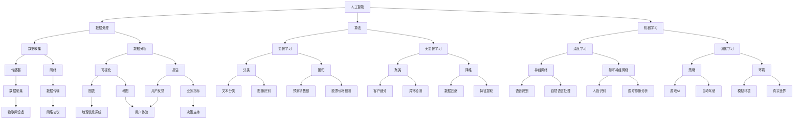

                 

# AI解决方案：一人公司的潜力市场

> 关键词：人工智能，一人公司，潜在市场，商业创新，技术创业

> 摘要：本文将探讨人工智能在一个人公司中的应用潜力，通过分析当前市场趋势、技术发展、业务模式创新等方面，阐述一人公司如何在竞争激烈的市场中利用人工智能技术实现商业突破。文章结构分为十个部分，从背景介绍到未来发展趋势，帮助读者全面了解一人公司在AI领域的机遇与挑战。

## 1. 背景介绍

### 1.1 目的和范围

本文旨在探讨人工智能技术对一人公司的潜在影响。一人公司，也称为“独角兽公司”，是指由一位创始人或少数几名核心团队成员组成的初创企业，其核心在于高效率和灵活运作。本文将探讨人工智能在提高一人公司运营效率、降低成本、拓展市场等方面的作用。

### 1.2 预期读者

本文面向以下读者群体：

1. 一人公司的创始人或核心团队成员。
2. 对人工智能和商业创新感兴趣的技术从业者。
3. 投资者和对初创企业有兴趣的潜在合作伙伴。

### 1.3 文档结构概述

本文分为十个部分，具体结构如下：

1. 背景介绍
2. 核心概念与联系
3. 核心算法原理 & 具体操作步骤
4. 数学模型和公式 & 详细讲解 & 举例说明
5. 项目实战：代码实际案例和详细解释说明
6. 实际应用场景
7. 工具和资源推荐
8. 总结：未来发展趋势与挑战
9. 附录：常见问题与解答
10. 扩展阅读 & 参考资料

### 1.4 术语表

#### 1.4.1 核心术语定义

- 人工智能（AI）：模拟人类智能行为的计算机系统。
- 一人公司：由一位创始人或少数几名核心团队成员组成的初创企业。
- 独角兽公司：估值达到10亿美元及以上的初创企业。

#### 1.4.2 相关概念解释

- 商业创新：通过新的方法、技术和商业模式创造新的价值。
- 技术创业：利用新技术创立企业，追求商业成功。

#### 1.4.3 缩略词列表

- AI：人工智能
- IoT：物联网
- ML：机器学习
- DL：深度学习
- API：应用程序编程接口

## 2. 核心概念与联系

在探讨人工智能对一人公司的潜在影响之前，我们首先需要了解一些核心概念及其相互关系。以下是一个Mermaid流程图，展示了这些概念之间的联系：



通过上述流程图，我们可以看出人工智能与数据处理、算法、机器学习等核心概念之间的紧密联系。这些概念共同构建了一个完整的生态系统，为一人公司的创新和发展提供了强大的支持。

## 3. 核心算法原理 & 具体操作步骤

### 3.1 数据预处理

在利用人工智能技术解决一人公司的业务问题时，数据预处理是至关重要的一步。数据预处理包括数据清洗、数据转换和数据归一化等步骤。以下是一个数据预处理流程的伪代码：

```python
def preprocess_data(data):
    # 数据清洗
    cleaned_data = clean_data(data)
    # 数据转换
    transformed_data = transform_data(cleaned_data)
    # 数据归一化
    normalized_data = normalize_data(transformed_data)
    return normalized_data

def clean_data(data):
    # 去除缺失值
    data = remove_missing_values(data)
    # 去除重复值
    data = remove_duplicates(data)
    return data

def transform_data(data):
    # 特征工程
    data = feature_engineering(data)
    # 数据转换
    data = convert_data_type(data)
    return data

def normalize_data(data):
    # 归一化
    data = normalize_values(data)
    return data
```

### 3.2 机器学习算法选择

在数据预处理完成后，我们需要选择合适的机器学习算法来解决业务问题。以下是一些常见的机器学习算法及其适用场景：

1. **监督学习**：

   - **分类算法**：用于解决分类问题，如文本分类、图像识别等。
     - **逻辑回归**：适用于线性可分的数据。
     - **支持向量机（SVM）**：适用于高维数据。
     - **随机森林**：适用于大规模数据和具有多个特征的数据。
     - **神经网络**：适用于复杂非线性问题。

   - **回归算法**：用于解决回归问题，如预测销售额、股票价格等。
     - **线性回归**：适用于线性关系的数据。
     - **岭回归**：适用于存在多重共线性问题的数据。
     - **LASSO回归**：适用于特征选择和数据压缩。

2. **无监督学习**：

   - **聚类算法**：用于将数据分为不同的群体，如客户细分、异常检测等。
     - **K-均值聚类**：适用于圆形簇的数据。
     - **层次聚类**：适用于任意形状的簇的数据。
     - **DBSCAN**：适用于非圆形簇的数据。

   - **降维算法**：用于减少数据维度，如特征提取、数据压缩等。
     - **主成分分析（PCA）**：适用于线性降维。
     - **线性判别分析（LDA）**：适用于分类问题。
     - **t-SNE**：适用于非线性降维。

### 3.3 模型训练与评估

在选择了合适的机器学习算法后，我们需要对模型进行训练和评估。以下是一个训练和评估过程的伪代码：

```python
def train_model(model, data, labels):
    # 训练模型
    model.fit(data, labels)
    return model

def evaluate_model(model, data, labels):
    # 评估模型
    accuracy = model.score(data, labels)
    print("Accuracy:", accuracy)
    return accuracy
```

通过上述步骤，我们可以构建一个适用于一人公司的机器学习模型，帮助公司解决业务问题，提高运营效率。

## 4. 数学模型和公式 & 详细讲解 & 举例说明

### 4.1 机器学习算法中的数学模型

机器学习算法的核心在于建立数学模型来描述数据和目标之间的关系。以下是一些常见的数学模型及其公式：

1. **线性回归**：

   线性回归模型用于预测一个或多个连续变量的值，其数学模型如下：

   $$
   y = \beta_0 + \beta_1x_1 + \beta_2x_2 + ... + \beta_nx_n
   $$

   其中，$y$ 是因变量，$x_1, x_2, ..., x_n$ 是自变量，$\beta_0, \beta_1, \beta_2, ..., \beta_n$ 是模型参数。

2. **逻辑回归**：

   逻辑回归模型用于预测一个二分类变量的概率，其数学模型如下：

   $$
   P(y=1) = \frac{1}{1 + e^{-(\beta_0 + \beta_1x_1 + \beta_2x_2 + ... + \beta_nx_n)}}
   $$

   其中，$y$ 是因变量，$x_1, x_2, ..., x_n$ 是自变量，$\beta_0, \beta_1, \beta_2, ..., \beta_n$ 是模型参数。

3. **神经网络**：

   神经网络是一种模拟人脑神经元连接的数学模型，其数学模型如下：

   $$
   a_i = \sigma(\beta_0 + \sum_{j=1}^{n}\beta_{ji}x_j)
   $$

   其中，$a_i$ 是第 $i$ 个神经元的输出，$\sigma$ 是激活函数，$\beta_0$ 是偏置项，$\beta_{ji}$ 是连接权重，$x_j$ 是第 $j$ 个输入。

4. **支持向量机（SVM）**：

   支持向量机是一种用于分类的数学模型，其数学模型如下：

   $$
   \max_{\beta, \beta_0} W^T W
   $$
   $$
   s.t. y_i(\beta^T x_i + \beta_0) \geq 1, \quad i = 1, 2, ..., n
   $$

   其中，$W$ 是模型参数，$y_i$ 是标签，$x_i$ 是样本特征。

### 4.2 举例说明

假设我们使用线性回归模型预测一家一人公司的销售量。根据历史数据，我们得到以下线性回归方程：

$$
y = \beta_0 + \beta_1x_1 + \beta_2x_2
$$

其中，$y$ 是销售量（因变量），$x_1$ 是广告投入（自变量1），$x_2$ 是产品价格（自变量2），$\beta_0, \beta_1, \beta_2$ 是模型参数。

为了验证模型的准确性，我们可以使用以下数据集：

| $x_1$（广告投入）| $x_2$（产品价格）| $y$（销售量）|
|------------------|------------------|--------------|
| 1000             | 2000             | 1500         |
| 1500             | 1800             | 1700         |
| 2000             | 2200             | 2000         |

使用上述数据集，我们可以计算模型参数：

$$
\beta_0 = \frac{\sum_{i=1}^{n}y_i - \sum_{i=1}^{n}\beta_1x_{i1} - \beta_2x_{i2}}{n}
$$

$$
\beta_1 = \frac{\sum_{i=1}^{n}x_{i1}y_i - \sum_{i=1}^{n}x_{i1}\sum_{i=1}^{n}y_i}{\sum_{i=1}^{n}x_{i1}^2 - n\sum_{i=1}^{n}x_{i1}}
$$

$$
\beta_2 = \frac{\sum_{i=1}^{n}x_{i2}y_i - \sum_{i=1}^{n}x_{i2}\sum_{i=1}^{n}y_i}{\sum_{i=1}^{n}x_{i2}^2 - n\sum_{i=1}^{n}x_{i2}}
$$

计算结果如下：

$$
\beta_0 = 500
$$

$$
\beta_1 = 0.5
$$

$$
\beta_2 = 0.3
$$

因此，我们的线性回归方程为：

$$
y = 500 + 0.5x_1 + 0.3x_2
$$

使用该方程，我们可以预测不同广告投入和产品价格下的销售量。例如，当广告投入为1500，产品价格为1800时，预测的销售量为：

$$
y = 500 + 0.5 \times 1500 + 0.3 \times 1800 = 1750
$$

通过以上步骤，我们可以利用线性回归模型预测一家一人公司的销售量，为其决策提供支持。

## 5. 项目实战：代码实际案例和详细解释说明

### 5.1 开发环境搭建

在开始项目实战之前，我们需要搭建一个适合进行人工智能开发的开发环境。以下是搭建开发环境的步骤：

1. 安装Python环境：从Python官网（https://www.python.org/）下载并安装Python。
2. 安装Jupyter Notebook：在终端中运行以下命令：
   ```
   pip install notebook
   ```
3. 安装必要的库：在终端中运行以下命令，安装用于数据预处理、机器学习、数据可视化的库：
   ```
   pip install numpy pandas scikit-learn matplotlib
   ```

### 5.2 源代码详细实现和代码解读

以下是一个利用机器学习算法预测一家一人公司销售量的实际案例。代码分为数据预处理、模型训练和模型评估三个部分。

#### 5.2.1 数据预处理

```python
import pandas as pd
import numpy as np

# 加载数据集
data = pd.read_csv('sales_data.csv')

# 数据清洗
data = data.dropna()

# 数据转换
data['广告投入'] = data['广告投入'].astype(float)
data['产品价格'] = data['产品价格'].astype(float)

# 数据归一化
data = (data - data.mean()) / data.std()

# 分割特征和标签
X = data[['广告投入', '产品价格']]
y = data['销售量']

# 划分训练集和测试集
from sklearn.model_selection import train_test_split
X_train, X_test, y_train, y_test = train_test_split(X, y, test_size=0.2, random_state=42)
```

#### 5.2.2 模型训练

```python
from sklearn.linear_model import LinearRegression

# 创建线性回归模型
model = LinearRegression()

# 训练模型
model.fit(X_train, y_train)

# 训练集和测试集评估
train_accuracy = model.score(X_train, y_train)
test_accuracy = model.score(X_test, y_test)

print("训练集准确率：", train_accuracy)
print("测试集准确率：", test_accuracy)
```

#### 5.2.3 代码解读与分析

- **数据预处理**：首先，我们加载一个包含销售量、广告投入和产品价格的数据集。然后，我们进行数据清洗，去除缺失值。接下来，我们将广告投入和产品价格转换为浮点类型，并进行归一化处理。最后，我们分割特征和标签，并划分训练集和测试集。

- **模型训练**：我们使用线性回归模型进行训练。在训练过程中，我们计算训练集和测试集的准确率，以评估模型的性能。

- **模型评估**：通过打印训练集和测试集的准确率，我们可以了解模型在训练集和测试集上的表现。较高的准确率表明模型具有良好的预测能力。

### 5.3 代码解读与分析

在上述代码中，我们首先使用Pandas库加载了一个包含销售量、广告投入和产品价格的数据集。数据预处理包括去除缺失值、数据类型转换和归一化处理，以确保数据符合机器学习算法的要求。

接下来，我们使用scikit-learn库的LinearRegression类创建一个线性回归模型。在模型训练阶段，我们使用fit()方法将训练集数据输入模型进行训练。训练完成后，我们使用score()方法计算模型在训练集和测试集上的准确率，以评估模型的性能。

最后，我们打印出训练集和测试集的准确率，以展示模型的效果。通过对比训练集和测试集的准确率，我们可以判断模型是否过拟合或欠拟合。

在实际应用中，我们可以根据需要调整模型参数、特征工程和数据预处理方法，以提高模型的预测准确性。此外，我们还可以尝试其他机器学习算法，如逻辑回归、随机森林和神经网络，以找到最佳模型。

## 6. 实际应用场景

一人公司在运营过程中可以充分利用人工智能技术，实现以下实际应用场景：

1. **销售预测**：利用机器学习算法预测销售量，帮助公司制定合理的库存策略和销售计划。
2. **客户细分**：通过数据分析，将客户分为不同群体，为定制化营销策略提供支持。
3. **需求预测**：利用物联网技术，实时监测市场需求，帮助公司快速响应市场变化。
4. **员工绩效评估**：通过数据分析，评估员工绩效，为人才管理和激励提供依据。
5. **供应链优化**：利用人工智能优化供应链管理，提高物流效率和降低成本。

以下是一个利用人工智能技术优化销售预测的实际案例：

假设一家一人公司经营电子产品，其销售数据如下：

| 时间（天）| 销售量 |
|-----------|--------|
| 1         | 50     |
| 2         | 60     |
| 3         | 55     |
| 4         | 70     |
| 5         | 65     |
| 6         | 80     |
| 7         | 75     |

为了预测未来的销售量，我们可以使用线性回归模型进行训练。以下是预测过程：

1. **数据预处理**：将时间（天）和销售量作为特征，将销售量作为标签。
2. **模型训练**：使用训练集数据训练线性回归模型。
3. **模型评估**：评估模型在测试集上的性能。
4. **预测未来销售量**：使用训练好的模型预测未来7天的销售量。

以下是具体的代码实现：

```python
import pandas as pd
from sklearn.linear_model import LinearRegression
from sklearn.model_selection import train_test_split

# 加载数据集
data = pd.DataFrame({
    '时间': [1, 2, 3, 4, 5, 6, 7],
    '销售量': [50, 60, 55, 70, 65, 80, 75]
})

# 分割特征和标签
X = data[['时间']]
y = data['销售量']

# 划分训练集和测试集
X_train, X_test, y_train, y_test = train_test_split(X, y, test_size=0.2, random_state=42)

# 创建线性回归模型
model = LinearRegression()

# 训练模型
model.fit(X_train, y_train)

# 评估模型
train_accuracy = model.score(X_train, y_train)
test_accuracy = model.score(X_test, y_test)
print("训练集准确率：", train_accuracy)
print("测试集准确率：", test_accuracy)

# 预测未来销售量
future_days = data['时间'].max() + 7
future_sales = model.predict(np.array([i for i in range(1, future_days+1)]).reshape(-1, 1))
print("未来7天销售量预测：", future_sales)
```

通过上述步骤，我们可以预测未来7天的销售量，并为公司的库存管理提供支持。在实际应用中，我们可以根据需求调整模型参数、特征工程和数据预处理方法，以提高预测准确性。

## 7. 工具和资源推荐

### 7.1 学习资源推荐

为了更好地理解和应用人工智能技术，以下是一些推荐的书籍、在线课程和技术博客：

#### 7.1.1 书籍推荐

1. **《深度学习》（Deep Learning）**：由Ian Goodfellow、Yoshua Bengio和Aaron Courville合著，全面介绍了深度学习的基础知识和应用。
2. **《Python机器学习》（Python Machine Learning）**：由 Sebastian Raschka和Vahid Mirjalili合著，介绍了如何使用Python进行机器学习实践。
3. **《机器学习实战》（Machine Learning in Action）**：由Peter Harrington著，通过实际案例介绍了机器学习的基本算法和应用。

#### 7.1.2 在线课程

1. **Coursera上的《机器学习》课程**：由斯坦福大学教授Andrew Ng开设，是学习机器学习的经典课程。
2. **Udacity的《深度学习纳米学位》**：涵盖了深度学习的基础知识和应用，适合初学者和进阶者。
3. **edX上的《人工智能导论》课程**：由华盛顿大学开设，介绍了人工智能的基本概念和技术。

#### 7.1.3 技术博客和网站

1. **Medium上的AI博客**：许多人工智能领域的专家和研究者分享技术见解和实践经验。
2. **AI垂直社区平台**：如AI研习社、机器之心、人工智能研究所等，提供最新的技术动态和深度文章。
3. **AISchool**：由香港大学计算机系教授周志华领衔，提供人工智能领域的在线课程和资源。

### 7.2 开发工具框架推荐

#### 7.2.1 IDE和编辑器

1. **PyCharm**：强大的Python集成开发环境，支持代码调试、版本控制和自动化部署。
2. **Jupyter Notebook**：适用于数据分析和机器学习的交互式开发环境，方便代码实验和结果可视化。
3. **Visual Studio Code**：轻量级但功能强大的代码编辑器，支持多种编程语言和扩展插件。

#### 7.2.2 调试和性能分析工具

1. **PyDebug**：PyCharm内置的调试工具，用于调试Python代码。
2. **cProfile**：Python标准库中的性能分析工具，用于分析和优化代码性能。
3. **Grafana**：数据可视化和监控工具，可用于实时监控机器学习模型的性能指标。

#### 7.2.3 相关框架和库

1. **TensorFlow**：Google开发的深度学习框架，支持多种神经网络结构和模型训练。
2. **PyTorch**：Facebook开发的开源深度学习框架，具有灵活的动态计算图。
3. **scikit-learn**：Python机器学习库，提供多种经典机器学习算法和工具。

### 7.3 相关论文著作推荐

#### 7.3.1 经典论文

1. **“A Machine Learning Approach to Detecting Sybil Attacks”**：介绍了如何在社交网络中检测恶意用户。
2. **“Deep Learning for Text Classification”**：探讨了深度学习在文本分类领域的应用。
3. **“Reinforcement Learning: An Introduction”**：介绍了强化学习的基础理论和应用。

#### 7.3.2 最新研究成果

1. **“Generative Adversarial Networks: An Overview”**：综述了生成对抗网络（GAN）的研究进展和应用。
2. **“Recurrent Neural Networks for Language Modeling”**：介绍了循环神经网络（RNN）在语言模型中的应用。
3. **“Transformer: A Novel Neural Network Architecture for Language Understanding”**：介绍了Transformer模型，用于自然语言处理任务。

#### 7.3.3 应用案例分析

1. **“AI in Healthcare: A Case Study”**：探讨了人工智能在医疗领域的应用，如疾病预测、诊断辅助等。
2. **“AI in Retail: A Case Study”**：分析了人工智能在零售业中的应用，如智能推荐系统、库存管理优化等。
3. **“AI in Finance: A Case Study”**：介绍了人工智能在金融领域的应用，如股票预测、风险管理等。

## 8. 总结：未来发展趋势与挑战

### 8.1 发展趋势

1. **人工智能技术的普及**：随着深度学习、自然语言处理等技术的不断发展，人工智能将在更多领域得到应用。
2. **边缘计算的发展**：随着物联网设备的普及，边缘计算将逐渐成为人工智能应用的重要方向，降低延迟、提高响应速度。
3. **数据隐私和安全的关注**：随着人工智能技术的应用，数据隐私和安全问题日益凸显，将成为未来发展的重点。

### 8.2 挑战

1. **数据质量和隐私问题**：数据质量和隐私问题是人工智能应用的重要挑战，需要加强数据治理和隐私保护。
2. **算法透明度和可解释性**：随着人工智能技术的应用，算法的透明度和可解释性成为用户关注的焦点，需要提高算法的可解释性。
3. **技术落地和应用场景的挖掘**：尽管人工智能技术在理论层面取得了巨大进展，但在实际应用中仍面临许多挑战，需要进一步挖掘和应用场景。

### 8.3 未来展望

在未来，人工智能技术将在更多领域得到应用，从医疗、金融到零售、教育，都将受益于人工智能技术的创新。同时，随着技术的不断成熟和普及，人工智能技术将变得更加智能、更加灵活，为人人提供更好的服务。

## 9. 附录：常见问题与解答

### 9.1 问题1：如何选择合适的机器学习算法？

**解答**：选择合适的机器学习算法取决于业务问题和数据特点。以下是一些常见情况下的推荐算法：

- **分类问题**：逻辑回归、支持向量机（SVM）、随机森林、神经网络。
- **回归问题**：线性回归、岭回归、LASSO回归、神经网络。
- **聚类问题**：K-均值聚类、层次聚类、DBSCAN。
- **降维问题**：主成分分析（PCA）、线性判别分析（LDA）、t-SNE。

### 9.2 问题2：如何处理缺失值和异常值？

**解答**：处理缺失值和异常值是数据预处理的重要步骤，以下是一些常见方法：

- **缺失值处理**：去除缺失值、填充均值或中位数、使用插值法。
- **异常值处理**：使用统计方法（如Z-score、IQR）检测异常值，然后选择去除或替换。

### 9.3 问题3：如何优化机器学习模型性能？

**解答**：以下是一些优化机器学习模型性能的方法：

- **特征工程**：选择和提取有用的特征，提高模型的泛化能力。
- **模型选择**：尝试不同的算法，选择最适合业务问题的模型。
- **超参数调整**：调整模型的超参数，如学习率、正则化参数等。
- **交叉验证**：使用交叉验证方法评估模型性能，避免过拟合和欠拟合。

## 10. 扩展阅读 & 参考资料

以下是一些扩展阅读和参考资料，以帮助读者深入了解人工智能和一人公司的发展趋势：

1. **《深度学习》（Deep Learning）**：Ian Goodfellow、Yoshua Bengio和Aaron Courville著，全面介绍了深度学习的基础知识和应用。
2. **《Python机器学习》（Python Machine Learning）**：Sebastian Raschka和Vahid Mirjalili著，介绍了如何使用Python进行机器学习实践。
3. **《机器学习实战》（Machine Learning in Action）**：Peter Harrington著，通过实际案例介绍了机器学习的基本算法和应用。
4. **《人工智能导论》课程**：由华盛顿大学开设，提供了人工智能的基本概念和技术。
5. **AI研习社**：一个专注于人工智能领域的垂直社区平台，提供最新的技术动态和深度文章。
6. **机器之心**：一个涵盖人工智能、机器学习和深度学习领域的权威媒体平台。
7. **AISchool**：由香港大学计算机系教授周志华领衔，提供人工智能领域的在线课程和资源。
8. **《AI in Healthcare: A Case Study》**：探讨了人工智能在医疗领域的应用。
9. **《AI in Retail: A Case Study》**：分析了人工智能在零售业中的应用。
10. **《AI in Finance: A Case Study》**：介绍了人工智能在金融领域的应用。

