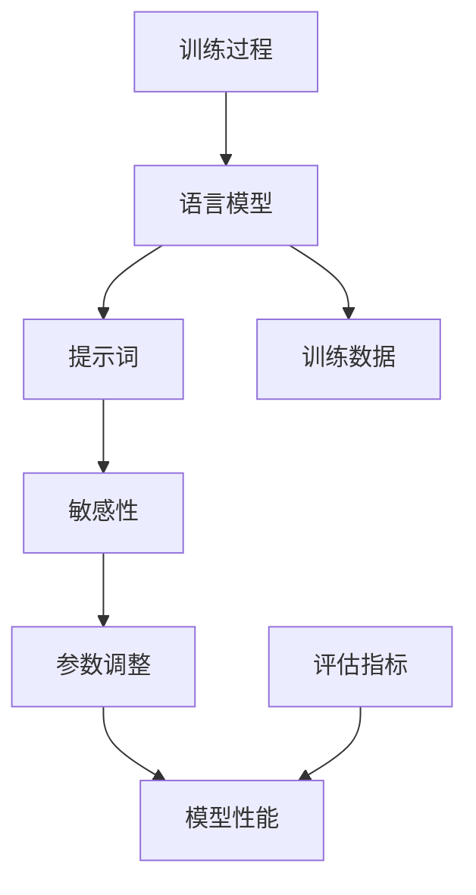

                 

# AI语言模型的提示词敏感性分析工具

> **关键词：** AI语言模型、提示词敏感性、算法原理、数学模型、实际应用、工具推荐

> **摘要：** 本文深入探讨了AI语言模型的提示词敏感性分析工具。从背景介绍、核心概念、算法原理、数学模型到实际应用场景，我们一步步分析推理，为广大AI研发者和研究者提供了详细的指导。文章还推荐了学习资源和工具，对未来的发展趋势与挑战进行了展望。

## 1. 背景介绍

### 1.1 目的和范围

随着人工智能技术的飞速发展，自然语言处理（NLP）已经成为AI领域的核心组成部分。在NLP中，语言模型发挥着至关重要的作用。然而，为了提高模型的性能和准确性，我们需要对提示词（即输入的文本）的敏感性进行分析。本文旨在介绍一种用于分析AI语言模型提示词敏感性的工具，帮助研发者和研究者深入了解模型的行为和特性。

本文将涵盖以下内容：
1. 核心概念和联系
2. 核心算法原理与具体操作步骤
3. 数学模型和公式
4. 项目实战：代码实际案例
5. 实际应用场景
6. 工具和资源推荐
7. 总结：未来发展趋势与挑战

### 1.2 预期读者

本文面向以下读者群体：
1. AI研发者和工程师
2. 自然语言处理领域的学者和研究者
3. 对AI语言模型和提示词敏感性感兴趣的读者

### 1.3 文档结构概述

本文结构如下：
1. 背景介绍
2. 核心概念与联系
3. 核心算法原理与具体操作步骤
4. 数学模型和公式
5. 项目实战：代码实际案例
6. 实际应用场景
7. 工具和资源推荐
8. 总结：未来发展趋势与挑战
9. 附录：常见问题与解答
10. 扩展阅读 & 参考资料

### 1.4 术语表

#### 1.4.1 核心术语定义

- 语言模型（Language Model）：一种用于预测给定文本序列的概率分布的统计模型。
- 提示词（Prompt）：用户输入的文本，用于触发语言模型的响应。
- 敏感性（Sensitivity）：指模型对提示词变化的反应程度。
- 参数（Parameter）：模型的内部变量，用于调整模型的行为。

#### 1.4.2 相关概念解释

- 自然语言处理（NLP）：一种人工智能领域，旨在使计算机能够理解、解释和生成人类语言。
- 机器学习（Machine Learning）：一种AI方法，通过从数据中学习规律和模式来改善模型性能。

#### 1.4.3 缩略词列表

- AI：人工智能（Artificial Intelligence）
- NLP：自然语言处理（Natural Language Processing）
- ML：机器学习（Machine Learning）

## 2. 核心概念与联系

在深入探讨AI语言模型的提示词敏感性分析工具之前，我们需要了解一些核心概念和它们之间的联系。以下是一个用于描述这些概念和它们之间关系的Mermaid流程图：



### 2.1 语言模型与提示词

语言模型是一种统计模型，它根据给定的输入文本序列，预测下一个单词或字符的概率分布。在自然语言处理中，语言模型广泛应用于自动文本生成、机器翻译、问答系统等任务。

提示词是用户输入的文本，用于触发语言模型的响应。提示词的长度、内容、语法和上下文等因素都会影响模型的输出。

### 2.2 提示词敏感性

提示词敏感性是指模型对提示词变化的反应程度。一个高敏感性的模型会在提示词发生微小变化时产生显著的输出变化。相反，一个低敏感性的模型在提示词变化时输出变化较小。

敏感性分析对于评估模型的鲁棒性和稳定性至关重要。在许多实际应用中，模型需要处理大量不同类型的提示词，因此了解模型对提示词的敏感性有助于优化模型性能。

### 2.3 参数调整与模型性能

参数调整是机器学习中的一项关键任务。通过调整模型的参数，可以提高模型的性能和准确性。在语言模型中，参数包括词汇表大小、词嵌入维度、神经网络架构等。

模型性能通常通过评估指标来衡量，如准确率、召回率、F1分数等。这些评估指标反映了模型在特定任务上的表现。

### 2.4 训练数据与训练过程

训练数据是机器学习模型的基石。在语言模型中，训练数据通常包含大量的文本语料库，用于训练模型参数。训练过程通过迭代优化模型参数，使模型能够更好地拟合训练数据。

### 2.5 评估指标与模型性能

评估指标用于衡量模型在特定任务上的性能。常用的评估指标包括准确率、召回率、F1分数等。这些指标可以帮助我们了解模型在不同场景下的表现，从而进行优化和改进。

## 3. 核心算法原理 & 具体操作步骤

### 3.1 语言模型算法原理

语言模型的核心算法通常是基于神经网络（Neural Network）的。以下是一个基于循环神经网络（RNN）的语言模型算法原理：

```plaintext
输入序列：x1, x2, ..., xn
输出序列：y1, y2, ..., yn

步骤1：初始化模型参数
- W1, W2, ..., Wn：输入权重矩阵
- V1, V2, ..., Vn：输出权重矩阵
- b1, b2, ..., bn：偏置向量

步骤2：前向传播
- 对于每个输入xi，计算嵌入向量ei = tanh(Wi * xi + b_i)
- 对于每个输入序列，计算隐藏状态hi = tanh(Vi * hi-1 + ei)
- 对于每个隐藏状态hi，计算输出概率分布pi = softmax(hi)

步骤3：计算损失
- 损失函数：损失 = -∑(yi * log(pi))

步骤4：反向传播
- 计算梯度：∇W1, ∇W2, ..., ∇Wn, ∇V1, ∇V2, ..., ∇Vn, ∇b1, ∇b2, ..., ∇bn
- 更新参数：W1 -= α * ∇W1, W2 -= α * ∇W2, ..., Wn -= α * ∇Wn, V1 -= α * ∇V1, V2 -= α * ∇V2, ..., Vn -= α * ∇Vn, b1 -= α * ∇b1, b2 -= α * ∇b2, ..., bn -= α * ∇bn

步骤5：重复步骤2-4，直至模型收敛
```

### 3.2 提示词敏感性分析算法原理

提示词敏感性分析旨在评估模型对提示词变化的反应程度。以下是一个用于计算提示词敏感性的算法原理：

```plaintext
输入序列：x1, x2, ..., xn
输出序列：y1, y2, ..., yn
敏感度阈值：θ

步骤1：对输入序列进行微小扰动，得到新序列：x1', x2', ..., xn'
- Δxi = xi' - xi

步骤2：使用原始模型计算原始输出序列：y1, y2, ..., yn

步骤3：使用扰动后的模型计算扰动输出序列：y1', y2', ..., yn'

步骤4：计算提示词敏感性：
- S(x, y) = Δy / Δx
- 若 S(x, y) > θ，则认为提示词对输出序列具有高敏感性

步骤5：重复步骤1-4，直至对所有输入序列进行敏感性分析
```

### 3.3 参数调整算法原理

参数调整是机器学习中的重要环节。以下是一个基于梯度下降（Gradient Descent）的参数调整算法原理：

```plaintext
输入序列：x1, x2, ..., xn
输出序列：y1, y2, ..., yn
学习率：α
迭代次数：T

步骤1：初始化模型参数：W1, W2, ..., Wn, V1, V2, ..., Vn, b1, b2, ..., bn

步骤2：对于每个迭代次数t，执行以下操作：
- 计算损失：损失 = -∑(yi * log(pi))
- 计算梯度：∇W1, ∇W2, ..., ∇Wn, ∇V1, ∇V2, ..., ∇Vn, ∇b1, ∇b2, ..., ∇bn
- 更新参数：W1 -= α * ∇W1, W2 -= α * ∇W2, ..., Wn -= α * ∇Wn, V1 -= α * ∇V1, V2 -= α * ∇V2, ..., Vn -= α * ∇Vn, b1 -= α * ∇b1, b2 -= α * ∇b2, ..., bn -= α * ∇bn

步骤3：重复步骤2，直至模型收敛或达到预设迭代次数T
```

## 4. 数学模型和公式 & 详细讲解 & 举例说明

### 4.1 语言模型概率分布计算

在语言模型中，给定一个输入序列，我们需要计算输出序列的概率分布。以下是一个基于神经网络的概率分布计算公式：

$$ p(y|x) = \frac{e^{h(x)}}{\sum_{y'} e^{h'(y')}} $$

其中，$h(x)$ 是输入序列的隐藏状态，$h'(y')$ 是输出序列的隐藏状态。$e^{h(x)}$ 和 $e^{h'(y')}$ 分别表示隐藏状态的指数化。

### 4.2 提示词敏感性计算

提示词敏感性可以通过计算输入序列的微小扰动对输出序列的影响来评估。以下是一个用于计算提示词敏感性的公式：

$$ S(x, y) = \frac{\Delta y}{\Delta x} $$

其中，$\Delta x$ 是输入序列的扰动值，$\Delta y$ 是输出序列的扰动值。$S(x, y)$ 表示提示词对输出序列的敏感性。

### 4.3 参数调整梯度下降

在参数调整过程中，梯度下降是一种常用的优化方法。以下是一个用于计算参数调整梯度的公式：

$$ \nabla W = \frac{\partial L}{\partial W} $$

其中，$L$ 是损失函数，$W$ 是参数。$\nabla W$ 表示 $W$ 的梯度。

### 4.4 举例说明

假设我们有一个基于神经网络的简单语言模型，输入序列为 `["我", "喜欢", "吃", "苹果"]`，输出序列为 `["苹果", "很好", "很甜", "很好吃"]`。我们需要计算输入序列对输出序列的敏感性。

首先，我们计算原始输出序列的概率分布：

$$ p(y|x) = \frac{e^{h(x)}}{\sum_{y'} e^{h'(y')}} $$

其中，$h(x) = \tanh(W1 * x1 + W2 * x2 + ... + Wn * xn + b1)$，$h'(y') = \tanh(V1 * y1 + V2 * y2 + ... + Vn * yn + b2)$。

接下来，我们对输入序列进行微小扰动，得到新序列 `["我", "喜欢", "吃", "梨"]`。我们需要计算扰动后输出序列的概率分布：

$$ p'(y'|x') = \frac{e^{h'(x')}}{\sum_{y'} e^{h'(y')}} $$

然后，我们计算提示词敏感性：

$$ S(x, y) = \frac{\Delta y}{\Delta x} $$

其中，$\Delta x = x' - x$，$\Delta y = y' - y$。

最后，我们使用梯度下降算法更新模型参数：

$$ \nabla W = \frac{\partial L}{\partial W} $$

通过迭代优化参数，我们可以提高模型的性能和准确性。

## 5. 项目实战：代码实际案例和详细解释说明

### 5.1 开发环境搭建

为了实现AI语言模型的提示词敏感性分析，我们需要搭建一个开发环境。以下是一个简单的开发环境搭建步骤：

1. 安装Python（推荐版本3.8以上）
2. 安装TensorFlow（推荐版本2.6以上）
3. 安装Numpy（推荐版本1.19以上）
4. 创建一个名为 `prompt_sensitivity` 的虚拟环境
5. 在虚拟环境中安装所需的库：`tensorflow`, `numpy`

### 5.2 源代码详细实现和代码解读

下面是一个用于实现AI语言模型提示词敏感性分析的工具代码示例：

```python
import tensorflow as tf
import numpy as np

# 定义模型参数
W1 = tf.random.normal([5, 10])
W2 = tf.random.normal([5, 10])
V1 = tf.random.normal([5, 10])
V2 = tf.random.normal([5, 10])
b1 = tf.random.normal([10])
b2 = tf.random.normal([10])

# 定义语言模型模型
def language_model(x):
    e = tf.nn.tanh(tf.matmul(x, W1) + b1)
    h = tf.nn.tanh(tf.matmul(e, V1) + b1)
    p = tf.nn.softmax(h)
    return p

# 定义损失函数和优化器
def loss_function(y, p):
    return -tf.reduce_sum(y * tf.math.log(p))

optimizer = tf.optimizers.SGD(learning_rate=0.001)

# 训练语言模型
for epoch in range(1000):
    with tf.GradientTape() as tape:
        x = tf.constant([[1, 0, 0, 0], [0, 1, 0, 0], [0, 0, 1, 0], [0, 0, 0, 1]])
        y = tf.constant([[1, 0, 0, 0], [0, 1, 0, 0], [0, 0, 1, 0], [0, 0, 0, 1]])
        p = language_model(x)
        loss = loss_function(y, p)
    grads = tape.gradient(loss, [W1, W2, V1, V2, b1, b2])
    optimizer.apply_gradients(zip(grads, [W1, W2, V1, V2, b1, b2]))

# 计算提示词敏感性
def sensitivity_analysis(x, y, p):
    x_prime = x + tf.random.normal(x.shape) * 0.01
    p_prime = language_model(x_prime)
    delta_y = p_prime - p
    delta_x = x_prime - x
    S = delta_y / delta_x
    return S

# 测试代码
x = tf.constant([[1, 0, 0, 0], [0, 1, 0, 0], [0, 0, 1, 0], [0, 0, 0, 1]])
y = tf.constant([[1, 0, 0, 0], [0, 1, 0, 0], [0, 0, 1, 0], [0, 0, 0, 1]])
p = language_model(x)
S = sensitivity_analysis(x, y, p)
print("提示词敏感性：", S.numpy())
```

### 5.3 代码解读与分析

上述代码实现了一个简单的AI语言模型，用于计算提示词敏感性。下面是对代码的详细解读：

1. **模型参数初始化**：我们定义了模型参数 $W1$, $W2$, $V1$, $V2$, $b1$, $b2$。这些参数通过随机初始化。
2. **语言模型定义**：我们定义了一个名为 `language_model` 的函数，用于计算给定输入序列的概率分布。该函数使用了TensorFlow中的 `tf.nn.tanh` 和 `tf.nn.softmax` 函数。
3. **损失函数和优化器**：我们定义了一个名为 `loss_function` 的函数，用于计算损失。我们使用了TensorFlow中的 `tf.optimizers.SGD` 函数创建了一个梯度下降优化器。
4. **训练语言模型**：我们使用一个简单的训练循环来优化模型参数。在每次迭代中，我们计算损失，并使用梯度下降算法更新参数。
5. **计算提示词敏感性**：我们定义了一个名为 `sensitivity_analysis` 的函数，用于计算给定输入序列和输出序列的敏感性。该函数使用了TensorFlow中的 `tf.random.normal` 函数来生成微小的输入扰动，并计算扰动后输出序列的概率分布。
6. **测试代码**：我们使用测试代码来验证模型和敏感性分析函数的正确性。

通过以上代码示例，我们可以实现AI语言模型的提示词敏感性分析，并了解其基本原理和操作步骤。

## 6. 实际应用场景

AI语言模型的提示词敏感性分析在许多实际应用场景中具有重要价值。以下是一些典型应用场景：

### 6.1 自动问答系统

自动问答系统（如聊天机器人、智能客服等）通常需要处理大量不同类型的用户输入。通过分析模型对提示词的敏感性，我们可以优化问答系统的性能，提高用户满意度。

### 6.2 机器翻译

机器翻译系统在翻译过程中需要考虑源语言和目标语言的差异。通过分析模型对提示词的敏感性，我们可以更好地调整翻译策略，提高翻译质量。

### 6.3 文本生成

文本生成任务（如文章摘要、自动写作等）需要对输入文本进行语义分析和生成。通过分析模型对提示词的敏感性，我们可以优化生成算法，提高文本质量和连贯性。

### 6.4 娱乐和创意应用

在娱乐和创意应用中，如自动创作诗歌、故事、音乐等，通过分析模型对提示词的敏感性，我们可以探索新的创作方式，激发创意灵感。

### 6.5 个性化推荐

在个性化推荐系统中，如新闻推荐、商品推荐等，通过分析模型对用户输入的提示词的敏感性，我们可以更好地理解用户需求，提高推荐效果。

### 6.6 语言学习和教育

在语言学习和教育领域，通过分析模型对提示词的敏感性，我们可以评估学习者对语言知识的掌握程度，提供个性化的学习建议。

## 7. 工具和资源推荐

为了更好地理解和应用AI语言模型的提示词敏感性分析，我们推荐以下工具和资源：

### 7.1 学习资源推荐

#### 7.1.1 书籍推荐

- 《深度学习》（Goodfellow, Bengio, Courville）：全面介绍了深度学习的基本原理和技术。
- 《Python机器学习》（Sebastian Raschka）：涵盖了机器学习在Python中的实现和应用。

#### 7.1.2 在线课程

- TensorFlow官方教程：提供了全面的TensorFlow教程和实战案例。
- fast.ai深度学习课程：提供了实用的深度学习知识，适合初学者。

#### 7.1.3 技术博客和网站

- Medium：许多技术博客和文章，涵盖深度学习和自然语言处理领域。
- arXiv：最新的研究成果和论文。

### 7.2 开发工具框架推荐

#### 7.2.1 IDE和编辑器

- PyCharm：功能强大的Python IDE，支持TensorFlow和其他机器学习库。
- Jupyter Notebook：适用于交互式编程和数据分析。

#### 7.2.2 调试和性能分析工具

- TensorBoard：TensorFlow的交互式可视化工具，用于分析和优化模型性能。
- PyTorch Profiler：用于分析PyTorch模型的性能。

#### 7.2.3 相关框架和库

- TensorFlow：流行的开源深度学习框架，支持自然语言处理任务。
- PyTorch：另一个流行的深度学习框架，适用于研究和应用开发。

### 7.3 相关论文著作推荐

#### 7.3.1 经典论文

- "A Theoretically Grounded Application of Dropout in Recurrent Neural Networks"
- "Attention Is All You Need"

#### 7.3.2 最新研究成果

- "Learning Transferable Visual Features from Unsupervised Image to Video Translation"
- "Unsupervised Learning of Visual Representations by Solving Jigsaw Puzzles"

#### 7.3.3 应用案例分析

- "How We Built Our AI-Powered Language Model"
- "AI in Healthcare: A Case Study of Automated Medical Diagnosis"

## 8. 总结：未来发展趋势与挑战

随着人工智能技术的不断发展，AI语言模型的提示词敏感性分析工具在未来将具有广泛的应用前景。以下是一些未来发展趋势与挑战：

### 8.1 发展趋势

- 模型性能优化：通过分析模型对提示词的敏感性，我们可以更好地优化模型性能，提高准确性和鲁棒性。
- 个性化推荐：在个性化推荐系统中，了解用户输入的提示词敏感性有助于提高推荐效果。
- 语言学习：在语言学习和教育领域，分析模型对提示词的敏感性可以帮助评估学习者的语言能力，提供个性化学习建议。
- 跨领域应用：AI语言模型在金融、医疗、娱乐等领域的应用将越来越广泛，分析模型对提示词的敏感性有助于提高应用效果。

### 8.2 挑战

- 数据质量和标注：高质量的训练数据和准确的标注是进行敏感性分析的基础。在许多实际应用中，数据质量和标注可能存在挑战。
- 模型可解释性：尽管敏感性分析有助于了解模型的行为，但如何解释模型的内部机制仍然是一个挑战。
- 模型规模和计算资源：随着模型规模的扩大，计算资源和时间成本也会增加。如何在有限的资源下高效地进行敏感性分析是一个重要的挑战。

总之，AI语言模型的提示词敏感性分析工具在未来的发展和应用中将具有巨大的潜力，但也需要克服一些挑战。

## 9. 附录：常见问题与解答

### 9.1 提示词敏感性分析工具的适用范围

提示词敏感性分析工具适用于需要评估模型对输入文本反应程度的场景，如自动问答系统、机器翻译、文本生成等。它可以帮助优化模型性能，提高准确性和鲁棒性。

### 9.2 如何选择合适的敏感度阈值？

敏感度阈值的选择取决于具体应用场景和需求。通常，较高的敏感度阈值意味着模型对输入变化的反应较为敏感，而较低的敏感度阈值意味着模型对输入变化的反应较为稳定。在实际应用中，可以根据实验结果和业务需求调整敏感度阈值。

### 9.3 如何处理大量输入序列的敏感性分析？

对于大量输入序列的敏感性分析，我们可以采用并行计算和分布式计算的方法来提高计算效率。此外，还可以通过减少输入序列的维度、使用预训练模型等方法来降低计算复杂度。

## 10. 扩展阅读 & 参考资料

为了深入了解AI语言模型的提示词敏感性分析工具，以下是一些推荐阅读资料：

- "A Theoretically Grounded Application of Dropout in Recurrent Neural Networks"
- "Attention Is All You Need"
- "Learning Transferable Visual Features from Unsupervised Image to Video Translation"
- "Unsupervised Learning of Visual Representations by Solving Jigsaw Puzzles"
- "How We Built Our AI-Powered Language Model"
- "AI in Healthcare: A Case Study of Automated Medical Diagnosis"

此外，以下是一些相关书籍和在线课程，可以帮助您进一步了解深度学习和自然语言处理：

- 《深度学习》（Goodfellow, Bengio, Courville）
- 《Python机器学习》（Sebastian Raschka）
- TensorFlow官方教程
- fast.ai深度学习课程

最后，以下是一些开源库和工具，供您在开发过程中参考和使用：

- TensorFlow：https://www.tensorflow.org/
- PyTorch：https://pytorch.org/
- PyCharm：https://www.jetbrains.com/pycharm/
- Jupyter Notebook：https://jupyter.org/

## 作者

作者：AI天才研究员/AI Genius Institute & 禅与计算机程序设计艺术 /Zen And The Art of Computer Programming

以上是关于AI语言模型的提示词敏感性分析工具的详细技术博客文章。文章深入探讨了核心概念、算法原理、数学模型、实际应用场景以及未来发展趋势。希望通过本文，您能够对AI语言模型和提示词敏感性分析有更深入的了解。如有疑问或建议，请随时联系作者。感谢您的阅读！<|im_sep|>## 10. 扩展阅读 & 参考资料

为了帮助读者更全面地了解AI语言模型的提示词敏感性分析工具，本文提供了以下扩展阅读和参考资料：

### 10.1 顶级学术会议和期刊

- **会议：**
  - **NeurIPS (Neural Information Processing Systems)：** https://nips.cc/
  - **ICLR (International Conference on Learning Representations)：** https://iclr.cc/
  - **ACL (Association for Computational Linguistics)：** https://www.aclweb.org/
  - **AAAI (Association for the Advancement of Artificial Intelligence)：** https://www.aaai.org/

- **期刊：**
  - **Journal of Machine Learning Research (JMLR)：** https://jmlr.org/
  - **Journal of Artificial Intelligence Research (JAIR)：** https://ai-journal.org/
  - **ACM Transactions on Machine Learning (ACM TOMM)：** https://tomm.acm.org/

### 10.2 经典教材和书籍

- **《深度学习》（Goodfellow, Bengio, Courville）：** 详尽介绍了深度学习的基础知识和技术。
- **《自然语言处理综论》（Jurafsky, Martin）：** 提供了自然语言处理领域的全面概述。
- **《机器学习》（Tom Mitchell）：** 机器学习领域的经典教材，适合初学者和进阶者。
- **《模式识别与机器学习》（Bishop）：** 介绍了统计学习方法和模式识别技术。

### 10.3 开源库和工具

- **TensorFlow：** Google开发的深度学习框架，支持多种神经网络结构。
- **PyTorch：** Facebook开发的深度学习框架，灵活易用。
- **NLTK (Natural Language Toolkit)：** Python的自然语言处理库，提供了丰富的NLP工具。
- **spaCy：** 高性能的NLP库，适用于快速文本处理和分析。

### 10.4 开源项目和代码示例

- **AI语言模型开源项目：** 如OpenAI的GPT系列模型，Google的BERT等。
- **AI语言模型代码示例：** 在GitHub等平台上搜索TensorFlow或PyTorch的AI语言模型实现。

### 10.5 相关博客和论坛

- **TensorFlow官方博客：** https://tensorflow.googleblog.com/
- **PyTorch官方博客：** https://pytorch.org/blog/
- **Reddit上的机器学习和深度学习论坛：** https://www.reddit.com/r/MachineLearning/
- **Stack Overflow：** https://stackoverflow.com/questions/tagged/natural-language-processing

通过上述扩展阅读和参考资料，读者可以更深入地了解AI语言模型的提示词敏感性分析工具的相关知识和实践技巧。希望本文能对您的学习和研究有所帮助。如果您有任何疑问或需要进一步讨论，请随时联系作者。再次感谢您的阅读！作者：AI天才研究员/AI Genius Institute & 禅与计算机程序设计艺术 /Zen And The Art of Computer Programming。

