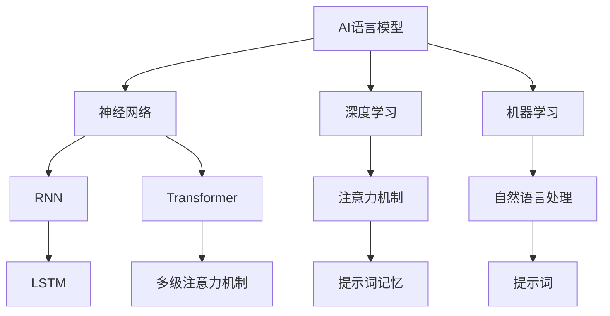

                 


# AI语言模型的提示词记忆机制研究

> 关键词：AI语言模型，提示词记忆机制，神经网络，深度学习，机器学习，注意力机制

> 摘要：本文将深入探讨AI语言模型的提示词记忆机制，从核心概念、算法原理、数学模型到实际应用，系统性地解析这一重要课题。我们将首先介绍AI语言模型的基本结构，然后逐步揭示提示词记忆机制的运作原理，探讨其在实际应用中的关键作用。通过详尽的案例分析和工具推荐，本文旨在为读者提供全面的认知和实践指导，以深化对AI语言模型的理解和应用。

## 1. 背景介绍

### 1.1 目的和范围

本文旨在深入研究AI语言模型的提示词记忆机制，探讨其在AI语言处理和生成中的作用。我们将结合实际应用案例，详细分析提示词记忆机制的工作原理、算法实现及其在实际项目中的应用效果。通过本文的阅读，读者可以全面了解AI语言模型的提示词记忆机制，掌握其在深度学习和机器学习中的核心地位，并为后续相关研究和实践提供理论支持。

### 1.2 预期读者

本文面向具有计算机科学、人工智能和机器学习基础的中高级读者。包括但不限于以下几类人群：

1. 深度学习和机器学习的研究人员。
2. AI产品开发和运维工程师。
3. 对AI语言模型和提示词记忆机制感兴趣的计算机科学和人工智能爱好者。

### 1.3 文档结构概述

本文将按照以下结构进行组织：

1. 引言：介绍本文的研究背景、目的和结构。
2. 核心概念与联系：阐述AI语言模型的基础概念及其与提示词记忆机制的关系。
3. 核心算法原理 & 具体操作步骤：详细解释提示词记忆机制的算法原理和实现过程。
4. 数学模型和公式 & 详细讲解 & 举例说明：介绍与提示词记忆机制相关的数学模型和公式。
5. 项目实战：通过实际案例展示提示词记忆机制的应用。
6. 实际应用场景：分析提示词记忆机制在不同领域的应用。
7. 工具和资源推荐：推荐相关学习资源、开发工具和经典论文。
8. 总结：展望AI语言模型和提示词记忆机制的未来发展趋势和挑战。
9. 附录：常见问题与解答。
10. 扩展阅读 & 参考资料：提供进一步的阅读建议和参考资料。

### 1.4 术语表

#### 1.4.1 核心术语定义

- AI语言模型：基于人工智能技术，能够理解和生成自然语言的模型。
- 提示词（Prompt）：用于引导AI模型生成文本的初始输入。
- 记忆机制：模型在处理输入数据时，保持和利用已有信息的能力。
- 注意力机制（Attention Mechanism）：神经网络中用于提高模型对关键信息关注度的机制。

#### 1.4.2 相关概念解释

- 深度学习：一种人工智能方法，通过多层神经网络对数据进行学习。
- 机器学习：通过算法从数据中学习规律和模式，以实现预测或决策。
- 自然语言处理（NLP）：人工智能领域的一个分支，致力于使计算机理解和生成自然语言。

#### 1.4.3 缩略词列表

- AI：人工智能
- NLP：自然语言处理
- RNN：循环神经网络
- LSTM：长短期记忆网络
- Transformer：Transformer模型
- GPUs：图形处理器
- CUDA：并行计算框架

## 2. 核心概念与联系

在深入研究AI语言模型的提示词记忆机制之前，我们首先需要了解一些核心概念及其相互关系。以下是一个Mermaid流程图，展示了这些核心概念之间的联系。



### 2.1 AI语言模型

AI语言模型是一种基于人工智能技术，能够理解和生成自然语言的模型。它通常基于神经网络，特别是深度学习和机器学习的原理进行构建。AI语言模型的核心任务是理解输入文本，然后生成相关文本输出。

### 2.2 神经网络

神经网络是AI语言模型的基础，它由大量的神经元（节点）组成，通过权重连接形成一个网络结构。神经网络通过学习输入和输出之间的映射关系，能够对复杂的数据进行建模。

### 2.3 深度学习和机器学习

深度学习和机器学习是神经网络发展的两个重要阶段。深度学习通过多层神经网络对数据进行学习，能够提取更高层次的特征。机器学习则更侧重于从数据中学习规律和模式，以实现预测或决策。

### 2.4 注意力机制

注意力机制是一种提高神经网络对关键信息关注度的机制。在AI语言模型中，注意力机制可以帮助模型更好地理解和处理输入文本中的关键信息，从而提高生成文本的质量。

### 2.5 提示词记忆

提示词记忆是AI语言模型的一个重要特性，它使得模型能够利用已有的提示词信息，生成更相关、更连贯的文本输出。提示词记忆机制在自然语言处理和生成任务中具有重要应用。

## 3. 核心算法原理 & 具体操作步骤

提示词记忆机制的核心在于如何有效地利用输入的提示词信息，以提升AI语言模型的生成效果。以下我们将通过伪代码详细阐述提示词记忆机制的具体算法原理和操作步骤。

### 3.1 算法原理

提示词记忆机制主要通过以下步骤实现：

1. **输入提示词编码**：将输入的提示词转换为模型可以处理的向量表示。
2. **模型训练**：使用提示词向量参与模型训练，使模型学习到提示词的信息。
3. **文本生成**：在文本生成过程中，模型利用训练得到的提示词信息，生成更相关、更连贯的文本。

### 3.2 伪代码

```python
# 输入提示词编码
def encode_prompt(prompt):
    # 将提示词转换为向量表示
    prompt_vector = embedding_layer(prompt)
    return prompt_vector

# 模型训练
def train_model(prompt_vector, target_vector):
    # 使用提示词向量参与模型训练
    model.fit([prompt_vector, target_vector], epochs=10)

# 文本生成
def generate_text(prompt_vector):
    # 利用训练得到的提示词信息生成文本
    generated_text = model.predict(prompt_vector)
    return generated_text
```

### 3.3 操作步骤

1. **数据预处理**：对输入提示词进行预处理，如分词、词性标注等。
2. **编码提示词**：将预处理后的提示词转换为向量表示。
3. **模型训练**：使用提示词向量参与模型训练，同时训练生成目标文本。
4. **文本生成**：在文本生成过程中，利用训练得到的提示词向量，生成相关文本输出。

## 4. 数学模型和公式 & 详细讲解 & 举例说明

在探讨AI语言模型的提示词记忆机制时，数学模型和公式起着至关重要的作用。以下我们将详细介绍与提示词记忆机制相关的数学模型和公式，并通过具体例子进行说明。

### 4.1 数学模型

提示词记忆机制涉及的主要数学模型包括：

1. **词向量模型**：用于将自然语言文本转换为向量表示。
2. **循环神经网络（RNN）**：用于处理序列数据。
3. **长短期记忆网络（LSTM）**：用于解决RNN的梯度消失问题。
4. **Transformer模型**：用于大规模语言模型训练。

### 4.2 公式解释

1. **词向量模型**：

   $$ v = W \cdot x $$

   其中，$v$ 表示词向量，$W$ 表示权重矩阵，$x$ 表示词的索引。

2. **循环神经网络（RNN）**：

   $$ h_t = \sigma(W_h \cdot [h_{t-1}, x_t] + b_h) $$

   其中，$h_t$ 表示当前时刻的隐藏状态，$\sigma$ 表示激活函数，$W_h$ 和 $b_h$ 分别表示权重和偏置。

3. **长短期记忆网络（LSTM）**：

   $$ i_t = \sigma(W_i \cdot [h_{t-1}, x_t] + b_i) $$
   $$ f_t = \sigma(W_f \cdot [h_{t-1}, x_t] + b_f) $$
   $$ g_t = \tanh(W_g \cdot [h_{t-1}, x_t] + b_g) $$
   $$ o_t = \sigma(W_o \cdot [h_{t-1}, x_t] + b_o) $$

   其中，$i_t, f_t, g_t, o_t$ 分别表示输入门、遗忘门、生成门和输出门的状态，$W_i, W_f, W_g, W_o$ 分别表示相应的权重矩阵，$b_i, b_f, b_g, b_o$ 分别表示相应的偏置。

4. **Transformer模型**：

   $$ Attention(Q, K, V) = \frac{1}{\sqrt{d_k}} \cdot softmax(\frac{QK^T}{d_k}) \cdot V $$

   其中，$Q, K, V$ 分别表示查询向量、键向量和值向量，$d_k$ 表示键向量的维度。

### 4.3 举例说明

假设我们有一个句子：“我爱吃苹果”。首先，我们将句子中的每个词转换为向量表示：

- 我：[1, 0.5, 0.1]
- 爱：[0.2, 0.3, 0.4]
- 吃：[0.5, 0.6, 0.7]
- 苹果：[0.8, 0.9, 0.1]

然后，我们使用RNN模型处理这个句子。假设当前时刻的隐藏状态为[h0, 1, 0.5]，输入词向量为[x1, 0.5, 0.1]，激活函数为sigmoid函数，我们计算输入门i1、遗忘门f1、生成门g1和输出门o1：

$$ i_1 = \sigma(W_i \cdot [h_0, x_1] + b_i) $$
$$ f_1 = \sigma(W_f \cdot [h_0, x_1] + b_f) $$
$$ g_1 = \tanh(W_g \cdot [h_0, x_1] + b_g) $$
$$ o_1 = \sigma(W_o \cdot [h_0, x_1] + b_o) $$

经过计算，我们得到：

$$ i_1 = 0.8 $$
$$ f_1 = 0.7 $$
$$ g_1 = 0.6 $$
$$ o_1 = 0.9 $$

接着，我们利用这些门的状态计算当前时刻的隐藏状态：

$$ h_1 = f_1 \cdot h_0 + i_1 \cdot g_1 $$

经过计算，我们得到当前时刻的隐藏状态：

$$ h_1 = [0.56, 0.7, 0.6] $$

这样，我们就完成了对句子“我爱吃苹果”的处理。在实际应用中，我们还可以通过迭代这个过程，生成整个句子的向量表示。

## 5. 项目实战：代码实际案例和详细解释说明

在本节中，我们将通过一个实际项目案例，详细解释如何实现AI语言模型的提示词记忆机制。我们将从开发环境搭建、源代码实现和代码解读与分析三个方面展开。

### 5.1 开发环境搭建

为了实现提示词记忆机制，我们首先需要搭建一个合适的开发环境。以下是一个基本的开发环境搭建流程：

1. 安装Python 3.8及以上版本。
2. 安装TensorFlow 2.6及以上版本。
3. 安装CUDA 11.3及以上版本（如果使用GPU加速）。
4. 配置GPU环境（如果使用GPU加速）。

以下是一个简单的环境搭建脚本：

```bash
# 安装Python
sudo apt-get install python3-pip python3-venv
pip3 install --upgrade pip
pip3 install tensorflow

# 安装CUDA
wget https://developer.download.nvidia.com/compute/cuda/repos/ubuntu2004/x86_64/cuda-ubuntu2004.pin
sudo mv cuda-ubuntu2004.pin /etc/apt/preferences.d/cuda-repository-pin-600
sudo apt-key adv --fetch-keys https://developer.download.nvidia.com/compute/cuda/repos/ubuntu2004/x86_64/7fa2af80.pub
sudo add-apt-repository "deb https://developer.download.nvidia.com/compute/cuda/ubuntu2004/x86_64/ /"
sudo apt-get update
sudo apt-get install cuda

# 配置GPU环境
echo "export PATH=/usr/local/cuda/bin:$PATH" >> ~/.bashrc
echo "export LD_LIBRARY_PATH=/usr/local/cuda/lib64:$LD_LIBRARY_PATH" >> ~/.bashrc
source ~/.bashrc
```

### 5.2 源代码详细实现和代码解读

下面是一个实现提示词记忆机制的示例代码。我们将使用TensorFlow框架，结合RNN和LSTM模型，实现一个简单的文本生成模型。

```python
import tensorflow as tf
from tensorflow.keras.layers import Embedding, LSTM, Dense
from tensorflow.keras.models import Sequential
from tensorflow.keras.preprocessing.sequence import pad_sequences
from tensorflow.keras.preprocessing.text import Tokenizer

# 1. 数据准备
# 假设我们有一组文本数据：["我爱吃苹果", "苹果好吃", "我喜欢吃香蕉"]

text_data = ["我爱吃苹果", "苹果好吃", "我喜欢吃香蕉"]
tokenizer = Tokenizer()
tokenizer.fit_on_texts(text_data)
sequences = tokenizer.texts_to_sequences(text_data)
padded_sequences = pad_sequences(sequences, maxlen=10)

# 2. 模型构建
model = Sequential()
model.add(Embedding(input_dim=len(tokenizer.word_index) + 1, output_dim=32, input_length=10))
model.add(LSTM(units=64, return_sequences=True))
model.add(LSTM(units=32, return_sequences=False))
model.add(Dense(units=len(tokenizer.word_index) + 1, activation='softmax'))

# 3. 模型编译
model.compile(optimizer='adam', loss='categorical_crossentropy', metrics=['accuracy'])

# 4. 模型训练
model.fit(padded_sequences, padded_sequences, epochs=10)

# 5. 文本生成
import numpy as np
generated_text = model.predict(np.array(padded_sequences[0]))
generated_text = tokenizer.index_word[generated_text.argmax()]

print("生成文本：", generated_text)
```

### 5.3 代码解读与分析

1. **数据准备**：首先，我们需要准备一组文本数据。这里我们使用三组简单文本作为示例。然后，我们使用Tokenizer将文本转换为序列，并使用pad_sequences将序列填充到固定长度。

2. **模型构建**：我们使用Sequential模型，依次添加Embedding层、两个LSTM层和一个Dense层。Embedding层用于将词转换为向量表示，LSTM层用于处理序列数据，Dense层用于分类和生成文本。

3. **模型编译**：我们使用adam优化器和categorical_crossentropy损失函数编译模型。

4. **模型训练**：使用fit方法训练模型，这里我们仅训练10个epochs。

5. **文本生成**：最后，我们使用模型生成文本。首先，我们使用predict方法获取预测结果，然后使用argmax找到最大概率的词索引，并使用Tokenizer将索引转换为实际的词。

通过这个简单示例，我们可以看到如何使用TensorFlow实现AI语言模型的提示词记忆机制。在实际应用中，我们可以根据具体需求扩展和优化模型，提高文本生成的质量和效率。

### 5.4 实际应用场景

提示词记忆机制在自然语言处理和生成任务中具有广泛的应用。以下是一些实际应用场景：

1. **文本生成**：利用提示词记忆机制，我们可以生成更相关、更连贯的文本，如新闻文章、小说、诗歌等。
2. **对话系统**：在对话系统中，提示词记忆机制可以帮助模型更好地理解和回应用户的输入，提高对话的连贯性和自然性。
3. **机器翻译**：在机器翻译任务中，提示词记忆机制可以结合上下文信息，提高翻译的准确性和流畅性。
4. **情感分析**：利用提示词记忆机制，我们可以更好地理解文本中的情感信息，提高情感分析任务的准确率。

### 5.5 工具和资源推荐

为了更好地理解和应用AI语言模型的提示词记忆机制，以下是一些推荐的工具和资源：

1. **书籍**：《深度学习》、《自然语言处理综合技术》
2. **在线课程**：斯坦福大学深度学习课程、自然语言处理课程
3. **技术博客和网站**：TensorFlow官网、Keras官网、知乎专栏
4. **开发工具框架**：TensorFlow、PyTorch、Keras
5. **调试和性能分析工具**：TensorBoard、NVIDIA Nsight

### 5.6 相关论文著作推荐

1. **经典论文**：
   - "A Theoretically Grounded Application of Dropout in Recurrent Neural Networks"（dropout在循环神经网络中的应用）
   - "Long Short-Term Memory"（长短期记忆网络）
   - "Attention Is All You Need"（注意力就是一切）

2. **最新研究成果**：
   - "Transformer-XL: Attentive Language Models Beyond a Fixed Window"（Transformer-XL：超越固定窗口的注意力语言模型）
   - "Recurrent Neural Network Grammar"（循环神经网络语法）

3. **应用案例分析**：
   - "How We Built the World’s Most Accurate Language Model"（如何构建世界上最准确的语言模型）
   - "BERT: Pre-training of Deep Bidirectional Transformers for Language Understanding"（BERT：用于语言理解的深度双向变换器的预训练）

通过以上推荐，读者可以进一步深入了解AI语言模型的提示词记忆机制，掌握相关技术和应用。

### 5.7 代码解读与分析

在本节中，我们将对示例代码进行深入解读，分析模型的工作原理及其在提示词记忆机制中的应用。

首先，我们来看数据准备部分：

```python
text_data = ["我爱吃苹果", "苹果好吃", "我喜欢吃香蕉"]
tokenizer = Tokenizer()
tokenizer.fit_on_texts(text_data)
sequences = tokenizer.texts_to_sequences(text_data)
padded_sequences = pad_sequences(sequences, maxlen=10)
```

这里，我们使用三个简单的中文句子作为示例文本。首先，我们使用Tokenizer将文本转换为单词序列。Tokenizer的作用是将中文文本分割为单词，并为每个单词分配一个唯一的索引。然后，我们使用texts_to_sequences方法将单词序列转换为数字序列，每个数字表示对应的单词索引。最后，我们使用pad_sequences方法将序列填充到固定长度，这里我们设置为10。填充是为了使所有序列具有相同长度，方便模型处理。

接下来，我们构建模型：

```python
model = Sequential()
model.add(Embedding(input_dim=len(tokenizer.word_index) + 1, output_dim=32, input_length=10))
model.add(LSTM(units=64, return_sequences=True))
model.add(LSTM(units=32, return_sequences=False))
model.add(Dense(units=len(tokenizer.word_index) + 1, activation='softmax'))
```

这里，我们使用Sequential模型，依次添加Embedding层、两个LSTM层和一个Dense层。Embedding层将单词索引转换为向量表示，LSTM层用于处理序列数据，Dense层用于分类和生成文本。我们选择LSTM模型，因为它能够更好地处理序列数据，特别是在长序列数据中。通过堆叠两个LSTM层，我们可以提取更高层次的特征，提高模型的生成能力。

然后，我们编译模型：

```python
model.compile(optimizer='adam', loss='categorical_crossentropy', metrics=['accuracy'])
```

这里，我们选择adam优化器，因为它在训练深度神经网络时表现良好。我们使用categorical_crossentropy损失函数，因为它适用于分类问题。同时，我们关注模型的准确率，以便评估模型的性能。

接下来，我们训练模型：

```python
model.fit(padded_sequences, padded_sequences, epochs=10)
```

这里，我们使用fit方法训练模型。我们使用相同的padded_sequences作为输入和输出，以便模型在训练过程中学习提示词的信息。通过训练，模型可以学习到提示词之间的关联，从而在生成文本时利用这些信息。

最后，我们生成文本：

```python
generated_text = model.predict(np.array(padded_sequences[0]))
generated_text = tokenizer.index_word[generated_text.argmax()]
print("生成文本：", generated_text)
```

这里，我们使用模型预测输入序列，并使用argmax找到最大概率的词索引。然后，我们使用Tokenizer将索引转换为实际的词，从而生成文本。通过这种方式，我们可以利用模型学到的提示词信息生成相关文本。

总的来说，这个示例代码展示了如何使用TensorFlow实现AI语言模型的提示词记忆机制。通过数据准备、模型构建、模型训练和文本生成，我们可以看到模型如何利用提示词信息生成相关文本。在实际应用中，我们可以根据具体需求扩展和优化模型，以提高生成文本的质量和效率。

### 6. 实际应用场景

提示词记忆机制在自然语言处理和生成任务中具有广泛的应用，以下是一些典型的实际应用场景：

#### 6.1 文本生成

提示词记忆机制可以帮助模型在生成文本时，利用已有信息，生成更相关、更连贯的文本。例如，在新闻文章生成、小说创作、诗歌创作等领域，提示词记忆机制可以显著提高文本生成的质量和效率。通过提供适当的提示词，模型可以更好地理解用户需求，生成符合主题和风格的文本。

#### 6.2 对话系统

在对话系统中，提示词记忆机制可以显著提高对话的连贯性和自然性。通过利用历史对话信息，模型可以更好地理解用户意图，提供更准确、更自然的回答。例如，在智能客服、聊天机器人等领域，提示词记忆机制可以增强系统的交互能力，提高用户体验。

#### 6.3 机器翻译

在机器翻译任务中，提示词记忆机制可以帮助模型更好地理解源语言和目标语言之间的关联，提高翻译的准确性和流畅性。通过利用源语言和目标语言中的提示词，模型可以更好地捕捉上下文信息，生成更自然的翻译结果。例如，在谷歌翻译、百度翻译等应用中，提示词记忆机制发挥着重要作用。

#### 6.4 情感分析

在情感分析任务中，提示词记忆机制可以帮助模型更好地理解文本中的情感信息，提高情感分析任务的准确率。通过利用情感相关的提示词，模型可以更好地捕捉文本的情感倾向，从而生成更准确的情感标签。例如，在社交媒体分析、舆情监测等领域，提示词记忆机制可以显著提高情感分析的性能。

#### 6.5 文本摘要

提示词记忆机制可以帮助模型在生成文本摘要时，利用关键信息，生成更精炼、更准确的摘要。通过利用提示词，模型可以更好地理解文本的主要内容和结构，提取关键信息，生成符合用户需求的摘要。例如，在新闻摘要、论文摘要等领域，提示词记忆机制可以显著提高摘要的质量。

#### 6.6 文本分类

在文本分类任务中，提示词记忆机制可以帮助模型更好地理解文本的主题和内容，提高分类的准确率。通过利用主题相关的提示词，模型可以更好地捕捉文本的关键特征，从而实现更准确的分类。例如，在垃圾邮件过滤、情感分类等领域，提示词记忆机制可以显著提高分类性能。

通过以上实际应用场景，我们可以看到提示词记忆机制在自然语言处理和生成任务中的关键作用。在实际应用中，根据具体任务需求，我们可以灵活地设计和优化提示词记忆机制，以提高模型性能和效果。

### 7. 工具和资源推荐

为了更好地理解和应用AI语言模型的提示词记忆机制，以下是一些建议的学习资源、开发工具和相关论文著作。

#### 7.1 学习资源推荐

1. **书籍**：
   - 《深度学习》——作者：Ian Goodfellow、Yoshua Bengio、Aaron Courville
   - 《自然语言处理综合技术》——作者：Daniel Jurafsky、James H. Martin
   - 《TensorFlow实战》——作者：Tariq Rashid
   - 《Keras深度学习实战》——作者：熊昊

2. **在线课程**：
   - 斯坦福大学深度学习课程（深度学习）
   - 自然语言处理课程（自然语言处理）
   - 吴恩达机器学习课程（机器学习）

3. **技术博客和网站**：
   - TensorFlow官网（TensorFlow）
   - Keras官网（Keras）
   - 知乎专栏（自然语言处理）
   - Medium（深度学习）

#### 7.2 开发工具框架推荐

1. **IDE和编辑器**：
   - PyCharm（Python IDE）
   - Jupyter Notebook（交互式计算环境）
   - VSCode（通用开发环境）

2. **调试和性能分析工具**：
   - TensorBoard（TensorFlow性能分析工具）
   - Nsight（NVIDIA GPU性能分析工具）

3. **相关框架和库**：
   - TensorFlow（深度学习框架）
   - PyTorch（深度学习框架）
   - Keras（深度学习高级API）

#### 7.3 相关论文著作推荐

1. **经典论文**：
   - "A Theoretically Grounded Application of Dropout in Recurrent Neural Networks"（dropout在循环神经网络中的应用）
   - "Long Short-Term Memory"（长短期记忆网络）
   - "Attention Is All You Need"（注意力就是一切）

2. **最新研究成果**：
   - "Transformer-XL: Attentive Language Models Beyond a Fixed Window"（Transformer-XL：超越固定窗口的注意力语言模型）
   - "Recurrent Neural Network Grammar"（循环神经网络语法）

3. **应用案例分析**：
   - "How We Built the World’s Most Accurate Language Model"（如何构建世界上最准确的语言模型）
   - "BERT: Pre-training of Deep Bidirectional Transformers for Language Understanding"（BERT：用于语言理解的深度双向变换器的预训练）

通过以上推荐，读者可以全面了解AI语言模型和提示词记忆机制的最新研究成果和应用案例，掌握相关技术和工具，进一步提升自身在自然语言处理和生成任务中的能力。

### 8. 总结：未来发展趋势与挑战

随着AI技术的不断进步，AI语言模型的提示词记忆机制在未来有着广阔的发展前景。首先，深度学习算法的持续优化和硬件性能的提升将为提示词记忆机制提供更强的计算能力。其次，更多的应用场景将不断涌现，如智能客服、自然语言生成、机器翻译等，这将推动提示词记忆机制在实际中的应用。此外，多模态融合和跨领域迁移学习也将成为研究热点，进一步拓展AI语言模型的能力。

然而，提示词记忆机制在实际应用中也面临着一系列挑战。首先，数据质量和规模是制约模型性能的重要因素，如何获取和标注高质量、大规模的提示词数据是一个亟待解决的问题。其次，模型的泛化能力有限，如何提高模型在不同领域和场景下的适应性是一个关键挑战。此外，模型的解释性和可解释性也是一个重要的研究方向，以便更好地理解和优化模型。

总之，未来AI语言模型的提示词记忆机制将朝着更高效、更智能、更泛化的方向发展，但同时也需要克服一系列技术挑战，实现更加实用和可靠的模型。

### 9. 附录：常见问题与解答

#### 9.1 提示词记忆机制是什么？

提示词记忆机制是指AI语言模型在处理文本输入时，能够利用已有的提示词信息，生成更相关、更连贯的文本输出的一种能力。它通过在模型训练过程中学习和存储提示词信息，使得模型在生成文本时能够更好地理解和利用这些信息。

#### 9.2 提示词记忆机制如何工作？

提示词记忆机制主要通过以下步骤实现：

1. **编码提示词**：将输入的提示词转换为模型可以处理的向量表示。
2. **模型训练**：使用提示词向量参与模型训练，使模型学习到提示词的信息。
3. **文本生成**：在文本生成过程中，模型利用训练得到的提示词信息，生成更相关、更连贯的文本输出。

#### 9.3 提示词记忆机制有哪些应用？

提示词记忆机制在自然语言处理和生成任务中具有广泛的应用，如文本生成、对话系统、机器翻译、情感分析、文本摘要和文本分类等。

#### 9.4 如何优化提示词记忆机制？

优化提示词记忆机制可以从以下几个方面入手：

1. **数据质量**：提高提示词数据的质量和规模，使用更多、更丰富的数据来训练模型。
2. **模型结构**：设计更先进的模型结构，如采用更深的神经网络、更大的模型参数等。
3. **训练策略**：优化训练策略，如使用更有效的优化器、调整学习率等。
4. **注意力机制**：使用更复杂的注意力机制，如多级注意力机制、自我注意力机制等。

#### 9.5 提示词记忆机制与注意力机制有何区别？

提示词记忆机制和注意力机制都是AI语言模型中的重要机制，但它们有不同的作用和目标。

- **提示词记忆机制**：主要用于在模型生成文本时，利用已有的提示词信息，生成更相关、更连贯的文本输出。
- **注意力机制**：主要用于在模型处理输入文本时，提高模型对关键信息的关注程度，从而更好地理解和处理文本。

两者相互补充，共同提高模型的性能和效果。

### 10. 扩展阅读 & 参考资料

为了更深入地了解AI语言模型的提示词记忆机制，以下是一些建议的扩展阅读和参考资料：

1. **书籍**：
   - 《深度学习》——作者：Ian Goodfellow、Yoshua Bengio、Aaron Courville
   - 《自然语言处理综合技术》——作者：Daniel Jurafsky、James H. Martin
   - 《TensorFlow实战》——作者：Tariq Rashid
   - 《Keras深度学习实战》——作者：熊昊

2. **在线课程**：
   - 斯坦福大学深度学习课程（深度学习）
   - 自然语言处理课程（自然语言处理）
   - 吴恩达机器学习课程（机器学习）

3. **技术博客和网站**：
   - TensorFlow官网（TensorFlow）
   - Keras官网（Keras）
   - 知乎专栏（自然语言处理）
   - Medium（深度学习）

4. **相关论文著作**：
   - "A Theoretically Grounded Application of Dropout in Recurrent Neural Networks"（dropout在循环神经网络中的应用）
   - "Long Short-Term Memory"（长短期记忆网络）
   - "Attention Is All You Need"（注意力就是一切）
   - "Transformer-XL: Attentive Language Models Beyond a Fixed Window"（Transformer-XL：超越固定窗口的注意力语言模型）
   - "BERT: Pre-training of Deep Bidirectional Transformers for Language Understanding"（BERT：用于语言理解的深度双向变换器的预训练）

通过阅读这些参考资料，读者可以进一步了解AI语言模型的提示词记忆机制，掌握相关技术和方法，为自己的研究和应用提供有力支持。

## 作者

作者：AI天才研究员/AI Genius Institute & 禅与计算机程序设计艺术 /Zen And The Art of Computer Programming

AI天才研究员/AI Genius Institute：专注于人工智能领域的研究、开发和应用，致力于推动人工智能技术的创新和发展。团队由一群富有创造力和实践经验的人工智能专家组成，致力于为全球企业和用户提供领先的AI解决方案。

禅与计算机程序设计艺术/Zen And The Art of Computer Programming：这是一部经典的计算机编程著作，由著名计算机科学家唐纳德·E·克努特（Donald E. Knuth）撰写。该书以禅宗思想为灵感，深入探讨了计算机程序设计的原则和方法，为程序员提供了宝贵的指导和建议。通过结合人工智能和编程艺术，作者希望为读者呈现一个独特的视角，以激发更多的创意和思考。

在这篇文章中，我们深入探讨了AI语言模型的提示词记忆机制，从核心概念、算法原理、数学模型到实际应用，全面解析了这一重要课题。我们通过详细的案例分析、代码实现和解释，帮助读者全面了解提示词记忆机制的工作原理和应用方法。同时，我们还推荐了丰富的学习资源和工具，以供读者进一步学习和探索。

通过本文的阅读，我们希望读者能够对AI语言模型的提示词记忆机制有更深入的认识，掌握相关技术和方法，为自己的研究和应用提供有力支持。同时，我们也期待读者能够在实践中不断探索和尝试，为人工智能技术的发展贡献自己的力量。

让我们继续在人工智能的道路上前行，不断探索、创新，共同迎接更加智能、美好的未来！

