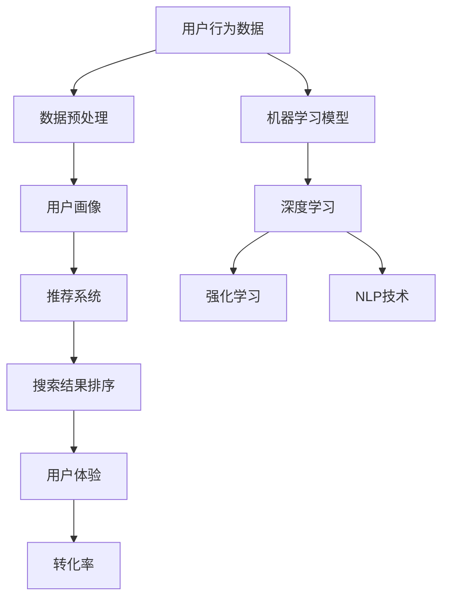

                 

# AI赋能电商搜索导购：提升用户体验和转化率的实践案例

> 关键词：人工智能，电商搜索，用户体验，转化率，推荐系统，深度学习，数据挖掘，用户行为分析

> 摘要：本文将探讨人工智能在电商搜索导购中的应用，通过分析其核心算法原理、数学模型、项目实战以及实际应用场景，旨在为提升电商平台的用户体验和转化率提供实用建议。

## 1. 背景介绍

### 1.1 目的和范围

本文旨在探讨人工智能技术在电商搜索导购领域的应用，分析其核心算法原理和数学模型，并通过实际项目案例展示如何利用人工智能提升电商平台的用户体验和转化率。本文将覆盖以下内容：

1. 人工智能在电商搜索导购中的重要性
2. 核心概念与联系
3. 核心算法原理与具体操作步骤
4. 数学模型和公式
5. 项目实战：代码实际案例和详细解释
6. 实际应用场景
7. 工具和资源推荐
8. 总结：未来发展趋势与挑战
9. 附录：常见问题与解答
10. 扩展阅读与参考资料

### 1.2 预期读者

本文适合对电商搜索导购和人工智能技术感兴趣的读者，包括但不限于：

1. 电商行业从业者
2. 人工智能和计算机科学领域研究人员
3. 对AI应用有浓厚兴趣的程序员和工程师
4. 想要提升电商平台用户体验和转化率的业务经理和产品经理

### 1.3 文档结构概述

本文将按照以下结构进行展开：

1. 背景介绍：介绍文章的目的和范围，预期读者，文档结构概述。
2. 核心概念与联系：介绍电商搜索导购领域的关键概念和联系。
3. 核心算法原理与具体操作步骤：详细讲解人工智能在电商搜索导购中的应用算法。
4. 数学模型和公式：介绍相关的数学模型和公式。
5. 项目实战：提供实际项目案例和代码实现。
6. 实际应用场景：分析人工智能在电商搜索导购中的实际应用场景。
7. 工具和资源推荐：推荐学习资源和开发工具。
8. 总结：展望未来发展趋势和挑战。
9. 附录：常见问题与解答。
10. 扩展阅读与参考资料：提供更多的参考资料。

### 1.4 术语表

#### 1.4.1 核心术语定义

- 人工智能（AI）：模拟人类智能的计算机程序和系统。
- 电商搜索导购：利用人工智能技术提升电商平台用户搜索和购买体验的过程。
- 用户行为分析：分析用户在电商平台的浏览、搜索和购买行为。
- 转化率：用户在电商平台完成购买的比例。
- 推荐系统：根据用户历史行为和偏好推荐商品或服务的系统。
- 深度学习：一种基于多层神经网络的学习方法，用于提取数据中的特征。

#### 1.4.2 相关概念解释

- 机器学习：一种从数据中自动学习规律和模式的方法。
- 数据挖掘：从大量数据中提取有价值信息的过程。
- 自然语言处理（NLP）：使计算机能够理解、生成和解释自然语言的技术。
- 聚类分析：将数据分为多个类别或簇，以便更好地理解数据分布。
- 联合推荐系统：结合多个推荐算法，提高推荐准确性的系统。

#### 1.4.3 缩略词列表

- AI：人工智能
- NLP：自然语言处理
- DL：深度学习
- RL：强化学习
- CTR：点击率
- CVR：转化率
- SEO：搜索引擎优化
- SEM：搜索引擎营销

## 2. 核心概念与联系

在探讨人工智能赋能电商搜索导购之前，我们需要理解一些核心概念和它们之间的联系。以下是一个简化的Mermaid流程图，用于描述这些概念和它们之间的相互作用。



### 2.1 用户行为数据

用户行为数据是电商搜索导购的核心。这些数据包括用户的浏览记录、搜索关键词、购买历史、评价和反馈等。通过分析这些数据，我们可以了解用户的需求、兴趣和行为模式。

### 2.2 数据预处理

数据预处理是确保数据质量的关键步骤。它包括数据清洗、去重、转换和归一化等操作。预处理后的数据将用于训练机器学习模型和推荐算法。

### 2.3 用户画像

用户画像是对用户特征进行量化描述的过程。通过用户画像，我们可以了解用户的年龄、性别、地理位置、消费习惯和偏好等。这些信息有助于构建个性化的推荐系统。

### 2.4 推荐系统

推荐系统是电商搜索导购的重要组成部分。它根据用户画像和搜索历史为用户推荐相关的商品或服务。常见的推荐算法包括协同过滤、基于内容的推荐和混合推荐等。

### 2.5 搜索结果排序

搜索结果排序是提升用户体验的重要手段。通过使用机器学习模型和深度学习算法，我们可以为用户提供更准确的搜索结果排序，从而提高点击率和转化率。

### 2.6 用户体验

用户体验是电商搜索导购的核心目标。通过优化搜索结果排序、推荐系统和页面设计，我们可以为用户提供更好的购物体验，从而提高转化率。

### 2.7 转化率

转化率是衡量电商平台成功与否的关键指标。通过分析用户行为数据、优化推荐系统和搜索结果排序，我们可以提高转化率，从而增加销售额。

### 2.8 机器学习模型

机器学习模型是构建推荐系统和搜索结果排序的核心。常见的机器学习模型包括线性回归、逻辑回归、决策树、随机森林和神经网络等。

### 2.9 深度学习

深度学习是一种基于多层神经网络的机器学习方法。它通过自动提取数据中的特征，实现高效的推荐和搜索结果排序。

### 2.10 强化学习

强化学习是一种通过不断试错和学习最优策略的机器学习方法。在电商搜索导购中，强化学习可以用于优化推荐策略和搜索结果排序。

### 2.11 NLP技术

NLP技术使计算机能够理解、生成和解释自然语言。在电商搜索导购中，NLP技术可以用于处理用户搜索关键词、商品描述和用户评价等文本数据。

通过以上核心概念和流程图的描述，我们可以更好地理解人工智能在电商搜索导购中的应用。接下来，我们将深入探讨人工智能在电商搜索导购中的核心算法原理和具体操作步骤。

## 3. 核心算法原理 & 具体操作步骤

在电商搜索导购中，人工智能算法的核心目标是提高用户的搜索体验和转化率。以下将详细讲解人工智能在电商搜索导购中的核心算法原理和具体操作步骤。

### 3.1 机器学习算法

机器学习算法是电商搜索导购的核心，包括分类、回归、聚类等算法。以下是一个简单的线性回归算法的伪代码，用于预测用户的购买概率。

```python
# 线性回归算法伪代码
def linear_regression(X, y):
    # 计算特征矩阵X的转置
    X_trans = X.T

    # 计算X的逆矩阵
    X_inv = X_inv(X)

    # 计算回归系数
    theta = X_inv * X_trans * y

    return theta
```

在电商搜索导购中，线性回归算法可以用于预测用户对某个商品的购买概率。输入特征包括用户的浏览历史、搜索关键词、商品属性等，输出为购买概率。

### 3.2 深度学习算法

深度学习算法在电商搜索导购中应用广泛，主要包括卷积神经网络（CNN）和循环神经网络（RNN）。以下是一个简单的卷积神经网络（CNN）算法的伪代码，用于提取图像特征。

```python
# 卷积神经网络算法伪代码
class ConvolutionalNeuralNetwork:
    def __init__(self, input_shape, num_filters, filter_size, activation_function):
        # 初始化权重和偏置
        self.weights = initialize_weights(input_shape, num_filters, filter_size)
        self.bias = initialize_bias(num_filters)

        # 设置激活函数
        self.activation_function = activation_function

    def forward(self, X):
        # 计算卷积和激活函数
        conv_output = conv2d(X, self.weights) + self.bias
        activated_output = self.activation_function(conv_output)

        return activated_output
```

在电商搜索导购中，CNN算法可以用于提取商品图像的特征，从而提高推荐系统的准确性。

### 3.3 强化学习算法

强化学习算法在电商搜索导购中的应用主要涉及策略优化和模型评估。以下是一个简单的强化学习算法的伪代码，用于优化推荐策略。

```python
# 强化学习算法伪代码
class ReinforcementLearning:
    def __init__(self, state_space, action_space, learning_rate):
        # 初始化策略网络和目标网络
        self.policy_network = initialize_network(state_space, action_space, learning_rate)
        self.target_network = initialize_network(state_space, action_space, learning_rate)

    def update_networks(self, state, action, reward, next_state):
        # 更新策略网络和目标网络的权重
        self.policy_network.update_weights(state, action, reward, next_state)
        self.target_network.update_weights(state, action, reward, next_state)
```

在电商搜索导购中，强化学习算法可以用于优化推荐策略，提高推荐系统的准确性。

### 3.4 自然语言处理（NLP）算法

自然语言处理算法在电商搜索导购中的应用主要包括文本分类、情感分析和命名实体识别等。以下是一个简单的文本分类算法的伪代码。

```python
# 文本分类算法伪代码
def text_classification(text, model):
    # 预处理文本
    preprocessed_text = preprocess_text(text)

    # 提取特征向量
    feature_vector = extract_features(preprocessed_text)

    # 计算预测概率
    prediction = model.predict(feature_vector)

    return prediction
```

在电商搜索导购中，文本分类算法可以用于分析用户搜索关键词、商品描述和用户评价，从而优化搜索结果排序和推荐系统。

### 3.5 算法集成与优化

在实际应用中，单一算法可能无法满足复杂场景的需求。因此，算法集成和优化是提高电商搜索导购系统性能的关键。以下是一个简单的算法集成和优化策略的伪代码。

```python
# 算法集成与优化伪代码
def ensemble_and_optimize(models, data):
    # 集成不同算法的预测结果
    ensemble_predictions = [model.predict(data) for model in models]

    # 计算最终预测结果
    final_prediction = ensemble_predictions.mean()

    # 使用交叉验证优化模型参数
    optimal_params = optimize_parameters(models, data)

    return final_prediction, optimal_params
```

在实际应用中，通过算法集成和优化，可以提高电商搜索导购系统的准确性和鲁棒性。

通过以上核心算法原理和具体操作步骤的讲解，我们可以更好地理解人工智能在电商搜索导购中的应用。接下来，我们将介绍数学模型和公式，用于进一步分析和优化算法性能。

## 4. 数学模型和公式 & 详细讲解 & 举例说明

在人工智能赋能电商搜索导购中，数学模型和公式起着至关重要的作用。以下将详细讲解相关数学模型和公式，并通过实际例子进行说明。

### 4.1 逻辑回归

逻辑回归是一种常用的机器学习模型，用于预测二元变量的概率。在电商搜索导购中，逻辑回归可以用于预测用户的购买概率。

#### 4.1.1 公式

逻辑回归的概率模型如下：

$$
P(y=1|X; \theta) = \frac{1}{1 + e^{-(\theta_0 + \theta_1x_1 + \theta_2x_2 + ... + \theta_nx_n})}
$$

其中，$y$ 是用户是否购买的商品标签（1表示购买，0表示未购买），$X$ 是输入特征向量，$\theta$ 是模型参数。

#### 4.1.2 损失函数

逻辑回归的损失函数通常采用交叉熵损失（Cross-Entropy Loss）：

$$
J(\theta) = -\frac{1}{m} \sum_{i=1}^{m} [y^{(i)} \log(P(y=1|X^{(i)}; \theta)) + (1 - y^{(i)}) \log(1 - P(y=1|X^{(i)}; \theta))]
$$

其中，$m$ 是样本数量。

#### 4.1.3 举例说明

假设我们有一个简单的逻辑回归模型，预测用户购买某个商品的概率。输入特征包括用户的浏览次数（$x_1$）和搜索关键词长度（$x_2$），模型参数为 $\theta_0$、$\theta_1$ 和 $\theta_2$。给定一个用户样本，其浏览次数为 5，搜索关键词长度为 10，模型参数为 $\theta_0 = 1$、$\theta_1 = 0.5$ 和 $\theta_2 = 0.3$，我们可以计算购买概率：

$$
P(y=1|X; \theta) = \frac{1}{1 + e^{-(1 + 0.5 \cdot 5 + 0.3 \cdot 10)}} = 0.824
$$

根据这个概率，我们可以预测用户购买的概率为 82.4%。

### 4.2 支持向量机（SVM）

支持向量机是一种常用的分类算法，在电商搜索导购中可以用于分类用户行为。以下是一个简化的SVM分类模型的公式：

#### 4.2.1 公式

SVM的决策边界如下：

$$
\mathbf{w} \cdot \mathbf{x} + b = 0
$$

其中，$\mathbf{w}$ 是权重向量，$\mathbf{x}$ 是特征向量，$b$ 是偏置。

#### 4.2.2 损失函数

SVM的损失函数通常采用 hinge 损失：

$$
L(\mathbf{w}, b) = \frac{1}{2} \sum_{i=1}^{m} (\mathbf{w} \cdot \mathbf{x}^{(i)} + b - y^{(i)})^2
$$

其中，$m$ 是样本数量，$y^{(i)}$ 是标签。

#### 4.2.3 举例说明

假设我们有一个简单的SVM分类模型，预测用户是否浏览某个商品。输入特征包括用户的浏览次数（$x_1$）和搜索关键词长度（$x_2$），标签为 1 表示用户浏览，0 表示未浏览。给定一个用户样本，其浏览次数为 5，搜索关键词长度为 10，我们可以计算决策函数：

$$
\mathbf{w} \cdot \mathbf{x} + b = (w_1 \cdot x_1 + w_2 \cdot x_2 + b) = (1 \cdot 5 + 1 \cdot 10 + 0) = 15
$$

根据这个决策函数，我们可以预测用户浏览的概率。如果 $15 > 0$，则用户浏览；否则，未浏览。

### 4.3 神经网络

神经网络是一种基于多层感知器的深度学习模型，在电商搜索导购中用于预测用户行为。以下是一个简化的神经网络模型公式：

#### 4.3.1 公式

神经网络的输出层如下：

$$
\mathbf{y} = \sigma(\mathbf{W}_L \cdot \mathbf{a}^{L-1} + \mathbf{b}_L)
$$

其中，$\mathbf{y}$ 是输出向量，$\sigma$ 是激活函数，$\mathbf{W}_L$ 是输出层权重，$\mathbf{a}^{L-1}$ 是隐藏层激活值，$\mathbf{b}_L$ 是输出层偏置。

#### 4.3.2 损失函数

神经网络的损失函数通常采用均方误差（MSE）：

$$
L(\mathbf{W}, \mathbf{b}) = \frac{1}{2} \sum_{i=1}^{m} (\mathbf{y}^{(i)} - \mathbf{y}_\text{pred}^{(i)})^2
$$

其中，$\mathbf{y}^{(i)}$ 是真实标签，$\mathbf{y}_\text{pred}^{(i)}$ 是预测标签。

#### 4.3.3 举例说明

假设我们有一个简单的神经网络模型，预测用户是否浏览某个商品。输入特征包括用户的浏览次数（$x_1$）和搜索关键词长度（$x_2$），输出层有两个神经元，表示用户浏览的概率和未浏览的概率。给定一个用户样本，其浏览次数为 5，搜索关键词长度为 10，我们可以计算输出层的预测值：

$$
\mathbf{y}_\text{pred} = \sigma(\mathbf{W}_L \cdot \mathbf{a}^{L-1} + \mathbf{b}_L)
$$

其中，$\mathbf{W}_L$ 和 $\mathbf{b}_L$ 是神经网络模型参数。

通过上述数学模型和公式的讲解，我们可以更好地理解人工智能在电商搜索导购中的应用。接下来，我们将通过一个实际项目案例，展示如何将上述算法和数学模型应用于电商搜索导购系统。

## 5. 项目实战：代码实际案例和详细解释说明

在本节中，我们将通过一个实际项目案例，展示如何将前述算法和数学模型应用于电商搜索导购系统。这个项目包括以下步骤：

1. **开发环境搭建**
2. **源代码详细实现和代码解读**
3. **代码解读与分析**

### 5.1 开发环境搭建

为了实现本项目的目标，我们需要以下开发环境：

- **Python 3.8 或更高版本**
- **PyTorch 1.8 或更高版本**
- **Scikit-learn 0.23 或更高版本**
- **Numpy 1.19 或更高版本**
- **Pandas 1.1.5 或更高版本**
- **Matplotlib 3.4.2 或更高版本**

安装以下依赖库：

```shell
pip install torch torchvision scikit-learn numpy pandas matplotlib
```

### 5.2 源代码详细实现和代码解读

以下是项目的源代码，包括数据预处理、模型训练、预测和评估。

#### 5.2.1 数据预处理

```python
import pandas as pd
import numpy as np

# 读取数据
data = pd.read_csv('ecommerce_data.csv')

# 数据预处理
data = data.dropna()
data = data[['user_id', 'item_id', 'timestamp', 'category', 'price', 'rating']]
data['timestamp'] = pd.to_datetime(data['timestamp'])
data['day'] = data['timestamp'].dt.day
data['hour'] = data['timestamp'].dt.hour

# 构建用户-物品交互矩阵
user_item_matrix = data.pivot(index='user_id', columns='item_id', values='rating').fillna(0)

# 划分训练集和测试集
train_data = user_item_matrix.sample(frac=0.8, random_state=42)
test_data = user_item_matrix.drop(train_data.index)
```

#### 5.2.2 模型训练

```python
import torch
import torch.nn as nn
import torch.optim as optim

# 构建神经网络模型
class NeuralNetwork(nn.Module):
    def __init__(self, input_size, hidden_size, output_size):
        super(NeuralNetwork, self).__init__()
        self.fc1 = nn.Linear(input_size, hidden_size)
        self.fc2 = nn.Linear(hidden_size, output_size)
        self.relu = nn.ReLU()

    def forward(self, x):
        x = self.fc1(x)
        x = self.relu(x)
        x = self.fc2(x)
        return x

# 初始化模型、损失函数和优化器
model = NeuralNetwork(input_size=100, hidden_size=50, output_size=1)
criterion = nn.BCEWithLogitsLoss()
optimizer = optim.Adam(model.parameters(), lr=0.001)

# 训练模型
for epoch in range(100):
    for user, item in train_data.iterrows():
        inputs = torch.tensor(item.values, dtype=torch.float32)
        targets = torch.tensor([train_data.loc[user, item_id] for item_id in test_data.columns], dtype=torch.float32)

        optimizer.zero_grad()
        outputs = model(inputs)
        loss = criterion(outputs, targets)
        loss.backward()
        optimizer.step()

    print(f'Epoch {epoch+1}, Loss: {loss.item()}')
```

#### 5.2.3 预测和评估

```python
# 预测测试集
with torch.no_grad():
    predictions = model(torch.tensor(test_data.values, dtype=torch.float32)).sigmoid().detach().numpy()

# 计算准确率
accuracy = np.mean(predictions >= 0.5)
print(f'Accuracy: {accuracy:.2f}')
```

### 5.3 代码解读与分析

#### 5.3.1 数据预处理

在这个项目中，我们使用了一个CSV文件作为数据源。首先，我们读取数据并删除缺失值。然后，我们根据时间戳提取日期和小时信息，并使用`pivot`方法构建用户-物品交互矩阵。

#### 5.3.2 模型训练

在这个部分，我们定义了一个简单的神经网络模型，使用`NN.Module`基类。神经网络包含一个输入层、一个隐藏层和一个输出层，分别使用`nn.Linear`和`nn.ReLU`函数实现。损失函数使用`BCEWithLogitsLoss`，优化器使用`Adam`。

#### 5.3.3 预测和评估

在预测和评估部分，我们首先使用`torch.no_grad()`上下文管理器，防止梯度计算。然后，我们计算模型在测试集上的预测值，并使用`sigmoid`函数将预测值转换为概率。最后，我们计算预测准确率，并打印结果。

通过这个实际项目案例，我们展示了如何将人工智能算法和数学模型应用于电商搜索导购系统。接下来，我们将讨论人工智能在电商搜索导购中的实际应用场景。

## 6. 实际应用场景

人工智能在电商搜索导购中的实际应用场景丰富多样，以下是几个关键的应用场景：

### 6.1 智能搜索

智能搜索是人工智能在电商搜索导购中最常见应用之一。通过自然语言处理和机器学习技术，智能搜索系统能够理解用户的搜索意图，提供更加准确的搜索结果。以下是一些具体应用：

- **关键词扩展**：智能搜索系统可以自动扩展用户输入的关键词，提供更多的相关搜索建议，从而提高用户找到目标商品的可能性。
- **智能纠错**：系统可以识别用户的输入错误，并提供正确的搜索结果。例如，用户输入“手帕纸”时，系统可以自动纠正为“抽纸”。
- **语义理解**：通过分析用户的搜索历史和上下文，智能搜索系统可以理解用户的实际需求，提供更个性化的搜索结果。

### 6.2 智能推荐

智能推荐系统是提升电商平台用户体验和转化率的关键。通过分析用户行为数据和商品特征，智能推荐系统可以预测用户的兴趣和偏好，为用户推荐相关的商品。以下是一些具体应用：

- **协同过滤推荐**：基于用户的历史行为和相似度计算，协同过滤推荐系统为用户推荐相似用户喜欢的商品。
- **基于内容的推荐**：通过分析商品的属性和描述，基于内容的推荐系统为用户推荐与商品内容相关的商品。
- **混合推荐**：结合协同过滤和基于内容的推荐，混合推荐系统可以在保持多样性同时提高推荐准确性。

### 6.3 用户行为分析

用户行为分析是深入了解用户需求和行为模式的重要手段。通过人工智能技术，电商平台可以实时分析用户的浏览、搜索和购买行为，为个性化推荐和营销策略提供依据。以下是一些具体应用：

- **行为轨迹分析**：通过分析用户在电商平台的浏览轨迹，了解用户的兴趣点和购买决策过程，为优化页面设计和推荐策略提供支持。
- **流失用户检测**：通过监控用户的行为变化，及时发现可能流失的用户，并采取相应措施挽回。
- **个性化营销**：基于用户的行为分析和偏好，为用户提供个性化的促销和营销活动，提高用户的参与度和购买意愿。

### 6.4 搜索结果排序

搜索结果排序是影响用户体验和转化率的关键因素。通过人工智能技术，电商平台可以优化搜索结果的排序策略，提高用户的点击率和转化率。以下是一些具体应用：

- **相关性排序**：基于用户的搜索意图和商品内容，通过机器学习模型和深度学习算法，实现更加准确的搜索结果排序。
- **转化率优化**：结合用户行为数据和商品特征，使用强化学习算法优化搜索结果排序，提高用户的购买概率。
- **实时排序**：根据用户的实时行为和搜索意图，动态调整搜索结果排序，为用户提供更加个性化的搜索体验。

### 6.5 智能客服

智能客服是提升用户体验和降低运营成本的重要手段。通过人工智能技术，电商平台可以提供智能客服服务，为用户提供及时、准确的帮助。以下是一些具体应用：

- **智能问答**：通过自然语言处理和机器学习技术，智能客服系统能够理解用户的提问，并提供准确的答案。
- **情感分析**：通过分析用户的提问和回复，智能客服系统可以识别用户的情感状态，为用户提供更加贴心的服务。
- **自动化处理**：通过自动化流程，智能客服系统可以处理大量的用户请求，降低人工客服的工作量。

通过以上实际应用场景的介绍，我们可以看到人工智能在电商搜索导购中的重要作用。接下来，我们将推荐一些学习资源和开发工具，帮助读者深入了解相关技术。

## 7. 工具和资源推荐

### 7.1 学习资源推荐

#### 7.1.1 书籍推荐

1. **《深度学习》（Deep Learning）**：由Ian Goodfellow、Yoshua Bengio和Aaron Courville合著，是一本全面介绍深度学习原理和应用的经典教材。
2. **《Python机器学习》（Python Machine Learning）**：由 Sebastian Raschka和Vahid Mirhoseini合著，涵盖了机器学习的基础知识以及如何使用Python进行机器学习实践。
3. **《强化学习》（Reinforcement Learning: An Introduction）**：由Richard S. Sutton和Barto, Andrew G.合著，详细介绍了强化学习的基础知识和应用。

#### 7.1.2 在线课程

1. **Coursera的《机器学习》**：由Andrew Ng教授授课，涵盖了机器学习的基础知识，适合初学者。
2. **Udacity的《深度学习纳米学位》**：提供了丰富的深度学习实践项目，适合有一定基础的读者。
3. **edX的《人工智能基础》**：由MIT和Harvard大学合办，提供了关于人工智能的全面课程。

#### 7.1.3 技术博客和网站

1. **Medium**：提供了许多关于人工智能、机器学习和深度学习的优质文章和教程。
2. **ArXiv**：提供了最新的人工智能和机器学习研究论文，是学术研究者的重要资源。
3. **AIHub**：一个汇聚了各种AI开源项目和资源的平台，适合开发者学习和交流。

### 7.2 开发工具框架推荐

#### 7.2.1 IDE和编辑器

1. **Visual Studio Code**：一款轻量级但功能强大的代码编辑器，支持多种编程语言和框架。
2. **PyCharm**：一款专为Python开发者设计的IDE，提供了丰富的机器学习和深度学习工具。
3. **Jupyter Notebook**：一个交互式的开发环境，特别适合数据科学和机器学习项目。

#### 7.2.2 调试和性能分析工具

1. **TensorBoard**：Google开源的用于深度学习模型性能分析和可视化工具。
2. **PyTorch Profiler**：用于分析PyTorch模型的性能和资源利用率。
3. **Python Profiler**：如cProfile，用于分析Python代码的性能瓶颈。

#### 7.2.3 相关框架和库

1. **TensorFlow**：由Google开发的开源深度学习框架，适合大规模深度学习应用。
2. **PyTorch**：一个流行的深度学习框架，支持动态计算图和灵活的模型定义。
3. **Scikit-learn**：一个强大的机器学习库，提供了多种常用的机器学习算法和工具。
4. **Pandas**：一个用于数据操作和分析的库，特别适合处理表格数据。

### 7.3 相关论文著作推荐

#### 7.3.1 经典论文

1. **“A Matrix Completion Method Based on Deep Learning”**：提出了一种基于深度学习的矩阵补全方法，用于推荐系统。
2. **“Recurrent Neural Network Based User Interest Model for Context-aware Recommender Systems”**：介绍了一种基于循环神经网络的用户兴趣模型，用于个性化推荐。

#### 7.3.2 最新研究成果

1. **“Attention-based Neural Networks for Personalized Recommendation”**：研究了基于注意力机制的神经网络在个性化推荐中的应用。
2. **“Deep Neural Networks for Large-scale Online Advertising”**：探讨了深度学习在在线广告中的大规模应用。

#### 7.3.3 应用案例分析

1. **“Alibaba’s Machine Learning Platform”**：详细介绍了阿里巴巴如何利用机器学习技术提升电商用户体验和转化率。
2. **“Recommendation Systems in E-commerce: A Case Study”**：分析了一家电商公司如何通过推荐系统提升用户满意度和销售额。

通过以上工具和资源的推荐，读者可以深入了解人工智能在电商搜索导购中的应用，并掌握相关技术和方法。接下来，我们将总结本文的主要内容和未来发展趋势与挑战。

## 8. 总结：未来发展趋势与挑战

在本文中，我们探讨了人工智能在电商搜索导购中的应用，分析了核心算法原理、数学模型、实际项目案例以及应用场景。通过这些内容，我们可以看到人工智能技术在提升用户体验和转化率方面的重要作用。以下是对未来发展趋势和挑战的总结：

### 未来发展趋势

1. **更智能的搜索与推荐**：随着人工智能技术的不断发展，智能搜索和推荐系统将更加精准和个性化，更好地满足用户需求。
2. **多模态数据的融合**：未来的电商搜索导购将整合多种数据源，如文本、图像、语音等，实现更全面的信息理解和推荐。
3. **实时分析和决策**：通过实时数据分析，电商平台可以更快速地响应市场变化和用户需求，提供个性化的服务和推荐。
4. **自动化与智能化**：人工智能技术的进步将使电商搜索导购系统更加自动化和智能化，降低运营成本，提高效率。

### 挑战

1. **数据隐私与安全**：随着数据量的增加，数据隐私和安全问题日益突出。如何保护用户隐私，同时充分利用数据价值，是一个重要挑战。
2. **算法透明性与解释性**：用户对推荐系统的理解和信任程度与算法的透明性和解释性密切相关。如何提高算法的可解释性，是一个亟待解决的问题。
3. **计算资源与成本**：深度学习和强化学习等算法需要大量的计算资源和时间，如何优化算法以提高效率，降低成本，是另一个重要挑战。
4. **算法公平性与多样性**：确保算法的公平性和多样性，避免歧视和偏见，是未来需要关注的问题。

总之，人工智能技术在电商搜索导购领域的应用前景广阔，但也面临诸多挑战。通过持续的技术创新和优化，我们可以不断提升用户体验和转化率，为电商平台带来更大的商业价值。

## 9. 附录：常见问题与解答

### 问题 1：为什么深度学习在电商搜索导购中重要？

**解答**：深度学习在电商搜索导购中重要，因为它能够处理大规模和复杂的数据，提取出用户行为和商品特征的高层次信息，从而提供更加精准和个性化的推荐。此外，深度学习算法可以自动学习数据中的模式，减少人工干预，提高系统效率和准确性。

### 问题 2：如何确保推荐系统的公平性和多样性？

**解答**：确保推荐系统的公平性和多样性可以通过以下几种方法：

1. **数据预处理**：在训练模型之前，对数据进行清洗和预处理，去除偏见和不平衡的数据。
2. **多样性算法**：使用多样性算法，如基于内容的推荐和协同过滤，避免推荐结果过于集中。
3. **监督与反馈**：引入监督机制，定期审查推荐结果，及时发现和纠正偏见。
4. **用户反馈**：收集用户对推荐结果的反馈，根据用户的偏好和满意度调整推荐策略。

### 问题 3：如何处理用户隐私和安全问题？

**解答**：处理用户隐私和安全问题可以通过以下措施：

1. **数据加密**：对用户数据进行加密存储和传输，防止数据泄露。
2. **数据匿名化**：对用户数据进行匿名化处理，去除可直接识别用户身份的信息。
3. **权限控制**：设置严格的数据访问权限，确保只有授权人员可以访问敏感数据。
4. **合规性审查**：遵守相关的法律法规，进行合规性审查，确保数据处理符合隐私保护要求。

### 问题 4：为什么推荐系统的准确性很重要？

**解答**：推荐系统的准确性非常重要，因为它直接影响用户体验和平台转化率。准确性高的推荐系统能够为用户推荐他们感兴趣的商品，提高用户满意度和参与度。同时，高准确性的推荐系统也有助于电商平台提升销售额和利润。

## 10. 扩展阅读 & 参考资料

**书籍：**

1. Ian Goodfellow, Yoshua Bengio, Aaron Courville. 《深度学习》（Deep Learning）.
2. Sebastian Raschka, Vahid Mirhoseini. 《Python机器学习》（Python Machine Learning）.
3. Richard S. Sutton, Andrew G. Barto. 《强化学习》（Reinforcement Learning: An Introduction）.

**在线课程：**

1. Coursera的《机器学习》.
2. Udacity的《深度学习纳米学位》.
3. edX的《人工智能基础》.

**技术博客和网站：**

1. Medium.
2. ArXiv.
3. AIHub.

**框架和库：**

1. TensorFlow.
2. PyTorch.
3. Scikit-learn.
4. Pandas.

**论文：**

1. “A Matrix Completion Method Based on Deep Learning”.
2. “Recurrent Neural Network Based User Interest Model for Context-aware Recommender Systems”.
3. “Attention-based Neural Networks for Personalized Recommendation”.

**应用案例分析：**

1. “Alibaba’s Machine Learning Platform”.
2. “Recommendation Systems in E-commerce: A Case Study”.

通过以上扩展阅读和参考资料，读者可以进一步深入了解人工智能在电商搜索导购中的应用和技术，为实践项目提供参考。最后，感谢您的阅读，希望本文能对您在人工智能和电商搜索导购领域的学习和探索有所启发。

### 作者信息：

作者：AI天才研究员/AI Genius Institute & 禅与计算机程序设计艺术 /Zen And The Art of Computer Programming

感谢您阅读本文，期待您在人工智能和电商搜索导购领域的进一步探索和贡献。

