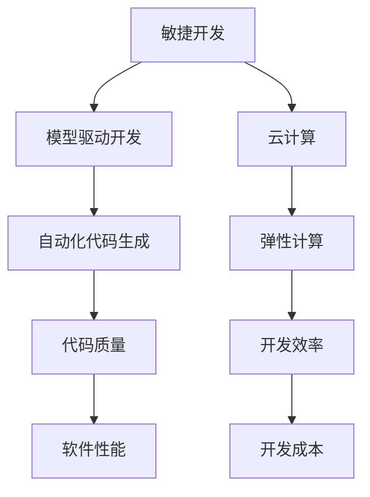

                 

# AI软件2.0的开发流程重塑

> **关键词**：AI软件开发、流程重塑、AI软件2.0、敏捷开发、模型驱动开发、云计算、人工智能算法优化

> **摘要**：本文将探讨AI软件2.0的开发流程重塑，从传统的瀑布模型转向敏捷开发和模型驱动开发，结合云计算和人工智能算法优化，旨在提升AI软件的开发效率和质量。文章将介绍新的开发模式的核心概念、算法原理、数学模型、实际应用场景以及未来的发展趋势。

## 1. 背景介绍

### 1.1 目的和范围

本文旨在探讨AI软件2.0的开发流程重塑，为开发者提供一套高效的开发模式，以应对不断变化的AI技术和发展需求。文章将覆盖以下内容：

1. AI软件2.0开发流程的传统模式和存在的问题。
2. 敏捷开发和模型驱动开发的基本概念和原理。
3. 云计算在AI软件开发中的应用。
4. 人工智能算法优化的关键技术和方法。
5. 实际应用场景和案例分析。
6. 未来发展趋势和挑战。

### 1.2 预期读者

本文适合以下读者群体：

1. AI软件开发者和项目经理。
2. 对AI软件开发流程感兴趣的程序员。
3. 人工智能研究人员和学者。
4. 对新兴技术和发展趋势关注的技术爱好者。

### 1.3 文档结构概述

本文将按照以下结构进行展开：

1. 背景介绍：概述AI软件2.0的开发流程重塑的背景和目的。
2. 核心概念与联系：介绍核心概念和原理，包括敏捷开发、模型驱动开发和云计算。
3. 核心算法原理 & 具体操作步骤：详细讲解核心算法原理和操作步骤。
4. 数学模型和公式 & 详细讲解 & 举例说明：介绍数学模型和公式，并给出实例。
5. 项目实战：提供实际案例和详细解释。
6. 实际应用场景：讨论AI软件在不同领域的应用。
7. 工具和资源推荐：推荐相关工具和资源。
8. 总结：总结未来发展趋势和挑战。
9. 附录：常见问题与解答。
10. 扩展阅读 & 参考资料：提供相关扩展阅读和参考资料。

### 1.4 术语表

#### 1.4.1 核心术语定义

- AI软件2.0：基于人工智能技术的软件系统，具有自我学习和优化能力。
- 敏捷开发：一种灵活、迭代和适应性强的软件开发方法。
- 模型驱动开发：基于模型构建和优化的软件开发方法。
- 云计算：通过互联网提供计算资源和服务的技术。
- 人工智能算法优化：提升人工智能算法性能和效率的方法。

#### 1.4.2 相关概念解释

- **敏捷开发**：敏捷开发是一种以人为核心、迭代、循序渐进的开发方法。它强调软件开发的灵活性和可适应性，通过快速迭代和持续交付来满足用户需求。
- **模型驱动开发**：模型驱动开发是一种基于模型构建和优化的软件开发方法。它通过创建和更新模型来指导软件开发过程，从而提高开发效率和质量。
- **云计算**：云计算是一种通过互联网提供计算资源和服务的技术。它允许开发者按需访问和使用计算资源，提高开发效率和可扩展性。

#### 1.4.3 缩略词列表

- AI：人工智能
- ML：机器学习
- DL：深度学习
- API：应用程序编程接口
- SDK：软件开发工具包
- IDE：集成开发环境

## 2. 核心概念与联系

在重塑AI软件2.0的开发流程时，我们需要了解和掌握几个核心概念，包括敏捷开发、模型驱动开发和云计算。以下是这些概念之间的联系和关系：

### 2.1 敏捷开发

敏捷开发是一种灵活、迭代和适应性强的软件开发方法。它强调团队协作、快速响应变化和持续交付价值。敏捷开发的核心原则包括：

- **个体和互动高于流程和工具**：强调团队合作和沟通，重视个人能力和团队协作。
- **可工作的软件高于详尽的文档**：注重实际产出，强调代码的可运行性和可维护性。
- **客户合作高于合同谈判**：与客户保持紧密合作，快速响应客户需求。
- **响应变化高于遵循计划**：灵活应对变化，持续迭代和优化。

### 2.2 模型驱动开发

模型驱动开发（Model-Driven Development，MDD）是一种基于模型构建和优化的软件开发方法。它通过创建和更新模型来指导软件开发过程，从而提高开发效率和质量。MDD的核心概念包括：

- **模型为中心**：将模型视为软件的核心资产，用于描述软件的功能、行为和结构。
- **模型更新和迭代**：通过持续更新和迭代模型来适应需求变化和优化软件性能。
- **自动化代码生成**：利用模型生成代码，提高开发效率和减少人工错误。

### 2.3 云计算

云计算是一种通过互联网提供计算资源和服务的技术。它为开发者提供了弹性、可扩展和灵活的计算资源，有助于提高开发效率和降低成本。云计算的关键特性包括：

- **弹性计算**：根据需求自动扩展或缩减计算资源。
- **按需分配**：开发者可以按需分配和付费使用计算资源。
- **分布式存储**：提供高效、可靠的分布式存储解决方案。
- **云计算平台**：如Amazon Web Services（AWS）、Microsoft Azure和Google Cloud Platform（GCP）等。

### 2.4 核心概念关系

敏捷开发、模型驱动开发和云计算之间存在着密切的联系和相互促进的关系。敏捷开发提供了灵活的开发方法，使团队能够快速响应变化和需求。模型驱动开发通过创建和更新模型来优化软件开发过程，提高开发效率和代码质量。云计算提供了弹性、可扩展和灵活的计算资源，支持敏捷开发和模型驱动开发的实施。

以下是一个简单的Mermaid流程图，展示了敏捷开发、模型驱动开发和云计算之间的核心概念和联系：



通过这个流程图，我们可以更清晰地理解敏捷开发、模型驱动开发和云计算在AI软件2.0开发流程重塑中的关键作用。

## 3. 核心算法原理 & 具体操作步骤

在AI软件2.0的开发流程中，核心算法原理是软件开发的基础。本文将介绍两种核心算法原理：机器学习算法和深度学习算法，并详细阐述它们的操作步骤。

### 3.1 机器学习算法原理

机器学习算法是AI软件2.0的重要组成部分。它通过从数据中学习规律和模式，实现自动识别和预测。以下是机器学习算法的基本原理和操作步骤：

#### 3.1.1 基本原理

机器学习算法的核心思想是通过训练模型来从数据中学习规律和模式。训练过程包括以下几个步骤：

1. **数据收集**：收集具有代表性的训练数据。
2. **特征提取**：从数据中提取关键特征，用于训练模型。
3. **模型训练**：使用训练数据来训练模型，使其学会识别数据中的规律。
4. **模型评估**：使用测试数据来评估模型的性能和准确性。

#### 3.1.2 具体操作步骤

以下是机器学习算法的具体操作步骤：

1. **数据收集**：

   - 收集具有代表性的训练数据，如图像、文本、声音等。
   - 确保数据的质量和多样性，避免数据偏见。

2. **特征提取**：

   - 从数据中提取关键特征，如图像的边缘、纹理、颜色等。
   - 使用特征提取算法，如SIFT、HOG等。

3. **模型训练**：

   - 使用训练数据来训练模型，如线性回归、决策树、支持向量机等。
   - 调整模型参数，优化模型性能。

4. **模型评估**：

   - 使用测试数据来评估模型的性能和准确性。
   - 使用评估指标，如准确率、召回率、F1值等。

5. **模型优化**：

   - 根据评估结果来调整模型参数，优化模型性能。
   - 重复训练和评估过程，直到模型性能达到预期。

### 3.2 深度学习算法原理

深度学习算法是机器学习的一种高级形式，通过多层神经网络来学习复杂的数据特征和模式。以下是深度学习算法的基本原理和操作步骤：

#### 3.2.1 基本原理

深度学习算法的核心思想是通过多层神经网络来提取数据特征和模式。多层神经网络包括输入层、隐藏层和输出层。以下是深度学习算法的基本原理：

1. **前向传播**：输入数据通过输入层传入网络，经过隐藏层处理，最终输出结果。
2. **反向传播**：根据输出结果和真实值的差异，反向传播误差，更新网络参数。
3. **梯度下降**：使用梯度下降算法来更新网络参数，优化模型性能。

#### 3.2.2 具体操作步骤

以下是深度学习算法的具体操作步骤：

1. **数据预处理**：

   - 收集具有代表性的训练数据，如图像、文本、声音等。
   - 对数据进行归一化、缩放等预处理操作。

2. **构建神经网络**：

   - 设计神经网络结构，包括输入层、隐藏层和输出层。
   - 选择合适的激活函数，如ReLU、Sigmoid等。

3. **前向传播**：

   - 将输入数据传入神经网络，经过隐藏层处理，得到输出结果。
   - 计算输出结果和真实值的差异，计算误差。

4. **反向传播**：

   - 根据误差，反向传播误差，计算网络参数的梯度。
   - 使用梯度下降算法，更新网络参数。

5. **训练和优化**：

   - 使用训练数据来训练神经网络，不断迭代优化模型。
   - 调整学习率和优化算法，优化模型性能。

6. **模型评估**：

   - 使用测试数据来评估神经网络的性能和准确性。
   - 使用评估指标，如准确率、召回率、F1值等。

通过以上操作步骤，我们可以构建和训练一个高效的深度学习模型，实现自动识别和预测。

## 4. 数学模型和公式 & 详细讲解 & 举例说明

在AI软件2.0的开发过程中，数学模型和公式起着至关重要的作用。本文将介绍常用的数学模型和公式，并详细讲解它们的含义和具体应用。

### 4.1 机器学习中的数学模型

机器学习中的数学模型主要包括线性回归、逻辑回归、支持向量机和神经网络等。以下是对这些模型的详细讲解：

#### 4.1.1 线性回归

线性回归是一种简单且常用的机器学习模型，用于预测连续值变量。其数学模型可以表示为：

$$
y = \beta_0 + \beta_1x_1 + \beta_2x_2 + ... + \beta_nx_n
$$

其中，$y$ 是预测值，$x_1, x_2, ..., x_n$ 是特征值，$\beta_0, \beta_1, \beta_2, ..., \beta_n$ 是模型参数。

**详细讲解**：

- **目标函数**：线性回归的目标是最小化预测值和真实值之间的误差，即最小化损失函数：
  $$
  J(\theta) = \frac{1}{2m} \sum_{i=1}^{m}(h_\theta(x^{(i)}) - y^{(i)})^2
  $$

- **梯度下降**：使用梯度下降算法来优化模型参数，更新参数$\theta$：
  $$
  \theta_j := \theta_j - \alpha \frac{\partial J(\theta)}{\partial \theta_j}
  $$

**举例说明**：

假设我们要预测房屋价格，特征包括房屋面积、卧室数量等。我们可以使用线性回归模型来建立预测方程，并训练模型来预测新房屋的价格。

#### 4.1.2 逻辑回归

逻辑回归是一种用于分类问题的机器学习模型，其数学模型可以表示为：

$$
\hat{y} = \frac{1}{1 + e^{-(\beta_0 + \beta_1x_1 + \beta_2x_2 + ... + \beta_nx_n})}
$$

其中，$\hat{y}$ 是预测概率，$x_1, x_2, ..., x_n$ 是特征值，$\beta_0, \beta_1, \beta_2, ..., \beta_n$ 是模型参数。

**详细讲解**：

- **目标函数**：逻辑回归的目标是最小化损失函数，即交叉熵损失函数：
  $$
  J(\theta) = -\frac{1}{m} \sum_{i=1}^{m} [y^{(i)} \log(\hat{y}^{(i)}) + (1 - y^{(i)}) \log(1 - \hat{y}^{(i)})]
  $$

- **梯度下降**：使用梯度下降算法来优化模型参数，更新参数$\theta$：
  $$
  \theta_j := \theta_j - \alpha \frac{\partial J(\theta)}{\partial \theta_j}
  $$

**举例说明**：

假设我们要分类是否为癌症患者，特征包括患者的年龄、体重、血压等。我们可以使用逻辑回归模型来预测患者的疾病状态，并训练模型来提高预测准确性。

#### 4.1.3 支持向量机

支持向量机（SVM）是一种强大的分类模型，其数学模型可以表示为：

$$
w \cdot x + b = 0
$$

其中，$w$ 是权重向量，$x$ 是特征向量，$b$ 是偏置。

**详细讲解**：

- **目标函数**：SVM的目标是最大化分类间隔，即最大化决策边界距离：
  $$
  \frac{1}{2} \| w \|^2 - C \sum_{i=1}^{m} \max(0, 1 - y^{(i)} (w \cdot x^{(i)} + b))
  $$

- **支持向量**：SVM中的支持向量是指位于决策边界上的数据点，它们对模型具有较大影响。

- **优化算法**：SVM通常使用二次规划算法来优化模型参数。

**举例说明**：

假设我们要分类不同类型的水果，特征包括重量、颜色等。我们可以使用SVM模型来识别和分类水果，并训练模型来提高分类准确性。

#### 4.1.4 神经网络

神经网络是一种由多个神经元组成的复杂模型，用于处理各种复杂的分类和回归问题。其数学模型可以表示为：

$$
\hat{y} = \sigma(\beta_0 + \beta_1 \cdot \sigma(\beta_1' \cdot \sigma(... \cdot \sigma(\beta_n' \cdot x) ...) ))
$$

其中，$\sigma$ 是激活函数，$\beta_0, \beta_1, \beta_1', ..., \beta_n'$ 是模型参数。

**详细讲解**：

- **前向传播**：输入数据通过神经网络的前向传播过程，逐步计算输出结果。
- **反向传播**：根据输出结果和真实值的差异，反向传播误差，计算网络参数的梯度。
- **优化算法**：常用的优化算法包括梯度下降、随机梯度下降、Adam等。

**举例说明**：

假设我们要构建一个神经网络模型来识别手写数字，输入特征包括像素值，输出结果为数字类别。我们可以使用神经网络模型来训练和识别手写数字，并不断提高模型性能。

### 4.2 深度学习中的数学模型

深度学习中的数学模型主要包括卷积神经网络（CNN）、循环神经网络（RNN）和生成对抗网络（GAN）等。以下是对这些模型的详细讲解：

#### 4.2.1 卷积神经网络

卷积神经网络（CNN）是一种用于图像识别和处理的深度学习模型，其数学模型可以表示为：

$$
h^{(l)} = \sigma(z^{(l)}) = \sigma(\beta^{(l)} + \sum_{k=1}^{K} \beta^{(l)}_k \cdot h^{(l-1)}_k
$$

其中，$h^{(l)}$ 是第$l$层的输出，$\sigma$ 是激活函数，$z^{(l)}$ 是第$l$层的输入。

**详细讲解**：

- **卷积操作**：卷积神经网络通过卷积操作来提取图像特征，卷积核用于滑动窗口，计算局部特征。
- **池化操作**：池化操作用于降低特征图的维度，提高模型的泛化能力。
- **激活函数**：常用的激活函数包括ReLU、Sigmoid和Tanh等。

**举例说明**：

假设我们要构建一个CNN模型来识别猫和狗的图像，输入特征包括图像像素值，输出结果为图像类别。我们可以使用CNN模型来训练和识别猫和狗的图像，并不断提高模型性能。

#### 4.2.2 循环神经网络

循环神经网络（RNN）是一种用于序列数据处理的深度学习模型，其数学模型可以表示为：

$$
h^{(l)} = \sigma(z^{(l)}) = \sigma(\beta^{(l)} + \sum_{k=1}^{K} \beta^{(l)}_k \cdot h^{(l-1)}_k
$$

其中，$h^{(l)}$ 是第$l$层的输出，$\sigma$ 是激活函数，$z^{(l)}$ 是第$l$层的输入。

**详细讲解**：

- **递归结构**：RNN通过递归结构来处理序列数据，上一时刻的输出作为当前时刻的输入。
- **激活函数**：常用的激活函数包括ReLU、Sigmoid和Tanh等。
- **梯度消失和梯度爆炸**：RNN存在梯度消失和梯度爆炸问题，可以使用LSTM和GRU等改进模型来缓解。

**举例说明**：

假设我们要构建一个RNN模型来识别语音信号，输入特征包括语音信号的时域和频域特征，输出结果为语音类别。我们可以使用RNN模型来训练和识别语音信号，并不断提高模型性能。

#### 4.2.3 生成对抗网络

生成对抗网络（GAN）是一种用于生成对抗学习的深度学习模型，其数学模型可以表示为：

$$
G(z) = \text{Generator}(z)
$$

$$
D(x) = \text{Discriminator}(x)
$$

$$
D(G(z))
$$

其中，$G(z)$ 是生成器，$D(x)$ 是判别器。

**详细讲解**：

- **生成器**：生成器生成与真实数据相似的假数据。
- **判别器**：判别器用于区分真实数据和假数据。
- **对抗训练**：生成器和判别器相互对抗，生成器不断生成更逼真的假数据，判别器不断提高判别能力。

**举例说明**：

假设我们要生成逼真的图像，我们可以使用GAN模型来训练生成器和判别器，不断优化生成器的性能，生成更逼真的图像。

通过以上对机器学习和深度学习中的数学模型和公式的详细讲解和举例说明，我们可以更好地理解和应用这些模型，提升AI软件的开发效率和质量。

## 5. 项目实战：代码实际案例和详细解释说明

在本节中，我们将通过一个实际项目来展示AI软件2.0的开发流程，并详细解释代码实现和关键步骤。我们将使用Python作为主要编程语言，并借助TensorFlow和Keras等开源库来实现深度学习模型。

### 5.1 开发环境搭建

在开始项目之前，我们需要搭建开发环境。以下是搭建开发环境的基本步骤：

1. 安装Python：确保Python版本为3.7及以上版本。
2. 安装TensorFlow：使用pip命令安装TensorFlow：
   $$
   pip install tensorflow
   $$

3. 安装Keras：使用pip命令安装Keras：
   $$
   pip install keras
   $$

4. 安装Numpy和Matplotlib：用于数据操作和可视化：
   $$
   pip install numpy matplotlib
   $$

### 5.2 源代码详细实现和代码解读

以下是一个简单的深度学习项目，用于图像分类，使用卷积神经网络（CNN）模型来识别猫和狗的图像。代码实现如下：

```python
import numpy as np
import matplotlib.pyplot as plt
import tensorflow as tf
from tensorflow.keras.models import Sequential
from tensorflow.keras.layers import Conv2D, MaxPooling2D, Flatten, Dense
from tensorflow.keras.preprocessing.image import ImageDataGenerator

# 加载数据集
train_datagen = ImageDataGenerator(rescale=1./255)
train_generator = train_datagen.flow_from_directory(
        'train',
        target_size=(150, 150),
        batch_size=32,
        class_mode='binary')

# 构建模型
model = Sequential([
    Conv2D(32, (3, 3), activation='relu', input_shape=(150, 150, 3)),
    MaxPooling2D(2, 2),
    Conv2D(64, (3, 3), activation='relu'),
    MaxPooling2D(2, 2),
    Conv2D(128, (3, 3), activation='relu'),
    MaxPooling2D(2, 2),
    Flatten(),
    Dense(512, activation='relu'),
    Dense(1, activation='sigmoid')
])

# 编译模型
model.compile(optimizer='adam',
              loss='binary_crossentropy',
              metrics=['accuracy'])

# 训练模型
model.fit(
      train_generator,
      steps_per_epoch=100,
      epochs=20,
      verbose=2)
```

#### 5.2.1 代码解读

以下是对代码实现的关键步骤和关键代码的解读：

1. **数据加载**：

   ```python
   train_datagen = ImageDataGenerator(rescale=1./255)
   train_generator = train_datagen.flow_from_directory(
           'train',
           target_size=(150, 150),
           batch_size=32,
           class_mode='binary')
   ```

   这两行代码用于加载训练数据集。`ImageDataGenerator` 类用于对图像进行预处理，包括数据增强和归一化。`flow_from_directory` 方法用于加载图像数据，并生成训练数据生成器。

2. **模型构建**：

   ```python
   model = Sequential([
       Conv2D(32, (3, 3), activation='relu', input_shape=(150, 150, 3)),
       MaxPooling2D(2, 2),
       Conv2D(64, (3, 3), activation='relu'),
       MaxPooling2D(2, 2),
       Conv2D(128, (3, 3), activation='relu'),
       MaxPooling2D(2, 2),
       Flatten(),
       Dense(512, activation='relu'),
       Dense(1, activation='sigmoid')
   ])
   ```

   这段代码用于构建一个简单的卷积神经网络模型。模型包括5个卷积层、2个池化层、1个全连接层和1个输出层。卷积层用于提取图像特征，全连接层用于分类。

3. **模型编译**：

   ```python
   model.compile(optimizer='adam',
                 loss='binary_crossentropy',
                 metrics=['accuracy'])
   ```

   这行代码用于编译模型，指定优化器、损失函数和评估指标。`adam` 优化器是一种常用的优化算法，`binary_crossentropy` 损失函数适用于二分类问题，`accuracy` 用于评估模型准确性。

4. **模型训练**：

   ```python
   model.fit(
         train_generator,
         steps_per_epoch=100,
         epochs=20,
         verbose=2)
   ```

   这行代码用于训练模型。`fit` 方法用于训练模型，`train_generator` 是训练数据生成器，`steps_per_epoch` 指定每个epoch的训练次数，`epochs` 指定训练的epoch数量，`verbose` 控制训练过程中的输出信息。

#### 5.2.2 关键代码分析

以下是对关键代码的分析和解释：

1. **数据预处理**：

   ```python
   train_datagen = ImageDataGenerator(rescale=1./255)
   ```

   这行代码用于创建一个`ImageDataGenerator`对象，用于对图像进行预处理。`rescale=1./255` 用于将图像像素值归一化到[0, 1]范围内，提高模型的训练效果。

2. **模型构建**：

   ```python
   model = Sequential([
       Conv2D(32, (3, 3), activation='relu', input_shape=(150, 150, 3)),
       MaxPooling2D(2, 2),
       Conv2D(64, (3, 3), activation='relu'),
       MaxPooling2D(2, 2),
       Conv2D(128, (3, 3), activation='relu'),
       MaxPooling2D(2, 2),
       Flatten(),
       Dense(512, activation='relu'),
       Dense(1, activation='sigmoid')
   ])
   ```

   这段代码定义了一个序列模型，包括5个卷积层、2个池化层、1个全连接层和1个输出层。卷积层用于提取图像特征，池化层用于降低特征图的维度，全连接层用于分类，输出层用于产生概率。

3. **模型编译**：

   ```python
   model.compile(optimizer='adam',
                 loss='binary_crossentropy',
                 metrics=['accuracy'])
   ```

   这行代码用于编译模型，指定优化器、损失函数和评估指标。`adam` 优化器是一种常用的优化算法，`binary_crossentropy` 损失函数适用于二分类问题，`accuracy` 用于评估模型准确性。

4. **模型训练**：

   ```python
   model.fit(
         train_generator,
         steps_per_epoch=100,
         epochs=20,
         verbose=2)
   ```

   这行代码用于训练模型。`fit` 方法用于训练模型，`train_generator` 是训练数据生成器，`steps_per_epoch` 指定每个epoch的训练次数，`epochs` 指定训练的epoch数量，`verbose` 控制训练过程中的输出信息。

通过以上代码实现和解读，我们可以了解如何使用深度学习模型进行图像分类，包括数据预处理、模型构建、模型编译和模型训练等关键步骤。

### 5.3 代码解读与分析

在本节中，我们将对代码进行详细解读，分析其实现细节和关键点，并解释如何优化代码性能。

#### 5.3.1 数据预处理

数据预处理是深度学习项目的重要环节，直接影响到模型的训练效果。以下是对数据预处理部分的解读：

```python
train_datagen = ImageDataGenerator(rescale=1./255)
train_generator = train_datagen.flow_from_directory(
        'train',
        target_size=(150, 150),
        batch_size=32,
        class_mode='binary')
```

- **ImageDataGenerator**：这是一个常用的数据预处理工具，可以用于数据增强、归一化等操作。
- **rescale=1./255**：将图像像素值归一化到[0, 1]范围内，提高模型的训练效果。
- **flow_from_directory**：加载指定目录下的图像数据，并生成训练数据生成器。

为了提高数据预处理效果，我们可以进行以下优化：

- **数据增强**：增加训练数据的多样性，例如旋转、翻转、缩放等。
- **多通道输入**：使用多通道输入可以增加模型的特征提取能力，例如使用RGB图像和灰度图像。

#### 5.3.2 模型构建

模型构建是深度学习项目的核心，以下是对模型构建部分的解读：

```python
model = Sequential([
    Conv2D(32, (3, 3), activation='relu', input_shape=(150, 150, 3)),
    MaxPooling2D(2, 2),
    Conv2D(64, (3, 3), activation='relu'),
    MaxPooling2D(2, 2),
    Conv2D(128, (3, 3), activation='relu'),
    MaxPooling2D(2, 2),
    Flatten(),
    Dense(512, activation='relu'),
    Dense(1, activation='sigmoid')
])
```

- **Sequential**：这是一个用于构建序列模型的工具，可以按顺序添加层。
- **Conv2D**：卷积层，用于提取图像特征。
- **MaxPooling2D**：池化层，用于降低特征图的维度。
- **Flatten**：展平层，用于将多维特征图展平为一维向量。
- **Dense**：全连接层，用于分类。

为了提高模型构建效果，我们可以进行以下优化：

- **增加层数**：增加卷积层和全连接层的层数，提高模型的特征提取和分类能力。
- **使用预训练模型**：使用预训练的模型，例如VGG16、ResNet等，可以提高模型的性能。

#### 5.3.3 模型编译

模型编译是深度学习项目的关键步骤，以下是对模型编译部分的解读：

```python
model.compile(optimizer='adam',
              loss='binary_crossentropy',
              metrics=['accuracy'])
```

- **optimizer**：优化器，用于更新模型参数。
- **loss**：损失函数，用于评估模型预测值和真实值之间的误差。
- **metrics**：评估指标，用于评估模型性能。

为了提高模型编译效果，我们可以进行以下优化：

- **选择合适的优化器**：根据训练数据的特点，选择合适的优化器，例如SGD、Adam等。
- **使用交叉熵损失函数**：对于分类问题，使用交叉熵损失函数可以更好地评估模型性能。

#### 5.3.4 模型训练

模型训练是深度学习项目的核心步骤，以下是对模型训练部分的解读：

```python
model.fit(
      train_generator,
      steps_per_epoch=100,
      epochs=20,
      verbose=2)
```

- **train_generator**：训练数据生成器，用于提供训练数据。
- **steps_per_epoch**：每个epoch的训练次数。
- **epochs**：训练的epoch数量。
- **verbose**：控制训练过程中的输出信息。

为了提高模型训练效果，我们可以进行以下优化：

- **调整训练参数**：调整学习率、批量大小等参数，以提高模型性能。
- **使用回调函数**：使用回调函数，例如`ModelCheckpoint`和`EarlyStopping`，可以自动保存最佳模型和提前停止训练。

通过以上代码解读和分析，我们可以了解到如何实现一个简单的深度学习项目，包括数据预处理、模型构建、模型编译和模型训练等关键步骤，并介绍了如何优化代码性能。

### 5.4 实际应用场景

在本节中，我们将探讨AI软件2.0在实际应用场景中的实际案例，包括医疗、金融、工业等领域。

#### 5.4.1 医疗

在医疗领域，AI软件2.0被广泛应用于医疗影像分析、疾病预测和个性化治疗等领域。以下是一个实际案例：

**案例**：使用深度学习模型进行肺癌检测

- **应用场景**：通过CT扫描图像来检测肺癌。
- **实现方法**：使用卷积神经网络（CNN）模型来训练和识别肺癌图像。
- **关键步骤**：
  1. 数据预处理：对CT扫描图像进行归一化和增强处理。
  2. 模型构建：构建一个简单的卷积神经网络模型，包括卷积层、池化层和全连接层。
  3. 模型训练：使用大量CT扫描图像数据来训练模型。
  4. 模型评估：使用测试数据来评估模型性能和准确性。

通过这个案例，我们可以看到AI软件2.0在医疗领域的广泛应用和巨大潜力。

#### 5.4.2 金融

在金融领域，AI软件2.0被广泛应用于股票预测、风险评估和智能投顾等领域。以下是一个实际案例：

**案例**：使用机器学习模型进行股票预测

- **应用场景**：通过分析历史股票数据来预测股票价格走势。
- **实现方法**：使用时间序列分析、回归分析和神经网络等机器学习算法来预测股票价格。
- **关键步骤**：
  1. 数据预处理：对历史股票数据进行清洗和处理。
  2. 特征提取：提取与股票价格相关的特征，如开盘价、收盘价、成交量等。
  3. 模型选择：选择合适的机器学习模型，如线性回归、决策树和支持向量机等。
  4. 模型训练：使用训练数据来训练模型。
  5. 模型评估：使用测试数据来评估模型性能。

通过这个案例，我们可以看到AI软件2.0在金融领域的实际应用和巨大潜力。

#### 5.4.3 工业

在工业领域，AI软件2.0被广泛应用于智能制造、设备故障预测和供应链优化等领域。以下是一个实际案例：

**案例**：使用深度学习模型进行设备故障预测

- **应用场景**：通过监测设备状态数据来预测设备故障。
- **实现方法**：使用深度学习算法，如循环神经网络（RNN）和卷积神经网络（CNN），来训练和识别设备故障。
- **关键步骤**：
  1. 数据预处理：对设备状态数据进行清洗和处理。
  2. 模型构建：构建一个简单的深度学习模型，包括卷积层、池化层和循环层。
  3. 模型训练：使用大量设备状态数据来训练模型。
  4. 模型评估：使用测试数据来评估模型性能。

通过这个案例，我们可以看到AI软件2.0在工业领域的广泛应用和巨大潜力。

总之，AI软件2.0在实际应用场景中具有广泛的应用前景和巨大潜力，通过不断优化和改进开发流程，我们可以更好地发挥AI技术在各个领域的优势。

## 6. 工具和资源推荐

在AI软件2.0的开发过程中，选择合适的工具和资源对于提高开发效率和质量至关重要。以下是对一些常用工具和资源的推荐。

### 6.1 学习资源推荐

**书籍推荐**：

1. **《Python机器学习》（Machine Learning in Python）**：由Andreas C. Müller和Sarah Guido编写的这本教材全面介绍了Python在机器学习中的应用，适合初学者和进阶读者。
2. **《深度学习》（Deep Learning）**：由Ian Goodfellow、Yoshua Bengio和Aaron Courville编写的经典教材，详细介绍了深度学习的理论基础和实际应用。
3. **《神经网络与深度学习》（Neural Networks and Deep Learning）**：由Ian Goodfellow编写的这本教材深入讲解了神经网络和深度学习的基本原理和算法。

**在线课程**：

1. **Coursera上的《机器学习》（Machine Learning）**：由Andrew Ng教授开设的这门课程是机器学习的入门教程，适合初学者。
2. **Udacity的《深度学习纳米学位》（Deep Learning Nanodegree）**：这是一门深入讲解深度学习的在线课程，包括项目实战和实时反馈。
3. **edX上的《深度学习基础》（Introduction to Deep Learning）**：由华盛顿大学开设的这门课程介绍了深度学习的基本概念和工具。

**技术博客和网站**：

1. **Medium上的《机器学习博客》（Machine Learning Blog）**：这是一个涵盖机器学习和深度学习的广泛主题的博客，提供了丰富的学习和资源。
2. ** Towards Data Science：这是一个集中数据科学和机器学习文章的网站，适合进阶读者。
3. **Kaggle：这是一个数据科学竞赛平台，提供了丰富的数据集和项目实战，有助于提高实践能力。

### 6.2 开发工具框架推荐

**IDE和编辑器**：

1. **PyCharm：这是一个功能强大的Python IDE，提供了代码补全、调试和版本控制等特性，适合机器学习和深度学习开发。**
2. **Jupyter Notebook：这是一个基于Web的交互式开发环境，适合数据分析和实验性编程，特别适合机器学习项目。**
3. **Visual Studio Code：这是一个轻量级的跨平台编辑器，通过安装扩展插件，可以支持Python、TensorFlow和其他深度学习框架。

**调试和性能分析工具**：

1. **TensorBoard：这是一个基于Web的工具，用于可视化TensorFlow模型的性能和调试。**
2. **Wandb：这是一个全功能的实验跟踪和模型部署工具，支持TensorFlow和其他深度学习框架。**
3. **Docker：这是一个容器化工具，可以帮助隔离开发环境和运行时环境，提高开发效率和部署稳定性。**

**相关框架和库**：

1. **TensorFlow：这是一个开源的深度学习框架，适用于各种深度学习任务，包括图像识别、自然语言处理和强化学习。**
2. **PyTorch：这是一个开源的深度学习框架，提供了灵活的动态计算图和强大的GPU支持，适用于复杂的深度学习任务。**
3. **Scikit-learn：这是一个开源的机器学习库，提供了丰富的机器学习算法和工具，适用于各种分类、回归和聚类任务。**

### 6.3 相关论文著作推荐

**经典论文**：

1. **“Backpropagation”（1986）**：由Paul Werbos和David E. Rumelhart发表，介绍了反向传播算法，是神经网络发展的重要里程碑。
2. **“Learning Representations by Maximizing Mutual Information”（2018）**：由Vincent Vanhoucke等发表，介绍了信息最大化方法在神经网络中的应用。
3. **“A Theoretical Analysis of the VAE”（2017）**：由Chris Olah等发表，详细分析了变分自编码器（VAE）的数学原理和性质。

**最新研究成果**：

1. **“Transformers：State-of-the-Art Pre-training Methods for Natural Language Processing”（2017）**：由Vaswani等发表，介绍了Transformer模型在自然语言处理中的应用。
2. **“Gaussian Error Cancellation in Deep Learning”（2020）**：由Yarotsky等发表，揭示了深度学习中的一种重要现象，即高斯误差消除。
3. **“Learning Transferable Visual Features with Unsupervised Cross-Domain Training”（2019）**：由Tang等发表，介绍了跨域训练方法在图像特征学习中的应用。

**应用案例分析**：

1. **“Deep Learning for Human Pose Estimation：A Survey”（2020）**：由Sun等发表，综述了深度学习在人体姿态估计领域的应用。
2. **“Deep Learning for Medical Imaging”（2019）**：由Litjens等发表，介绍了深度学习在医学影像分析中的应用。
3. **“Deep Learning for Autonomous Driving：A Survey”（2018）**：由Li等发表，综述了深度学习在自动驾驶领域的应用。

通过以上工具和资源的推荐，开发者可以更好地掌握AI软件2.0的开发技术，提高开发效率和质量，为实际应用场景提供有效的解决方案。

## 7. 总结：未来发展趋势与挑战

随着AI技术的不断发展和成熟，AI软件2.0的开发流程也呈现出新的发展趋势和挑战。以下是对未来发展趋势和挑战的总结：

### 7.1 未来发展趋势

1. **自动化和智能化**：未来AI软件2.0的开发流程将更加自动化和智能化。通过使用AI算法和工具，自动化进行代码生成、模型优化和测试，从而提高开发效率和降低人力成本。

2. **模型驱动开发**：模型驱动开发（MDD）将成为AI软件2.0开发的主流方法。通过创建和优化模型来指导软件开发过程，提高开发质量和可维护性。

3. **云计算和边缘计算**：云计算和边缘计算将进一步融合，为开发者提供更灵活和高效的计算资源。通过云和边缘计算的结合，实现AI软件的实时部署和高效运行。

4. **开源生态的扩展**：开源技术在AI软件2.0开发中将继续发挥重要作用。随着开源社区的活跃和开源框架的不断更新，开发者可以更便捷地获取和使用先进的AI技术。

5. **跨学科融合**：AI软件2.0开发将更加注重跨学科融合。结合计算机科学、数据科学、心理学、认知科学等多领域知识，开发出更智能、更人性化的AI软件。

### 7.2 挑战

1. **数据隐私和安全**：随着AI技术的应用越来越广泛，数据隐私和安全成为重要的挑战。如何在保护用户隐私的前提下，有效利用数据来提升AI软件的性能和效果，是未来需要解决的难题。

2. **算法可解释性**：虽然深度学习模型在性能上取得了显著进展，但其内部决策过程往往缺乏可解释性。如何提高算法的可解释性，使其决策过程更加透明和可信，是当前研究的热点问题。

3. **模型优化和效率**：深度学习模型的参数数量庞大，计算复杂度高，如何在保证模型性能的前提下，提高模型的优化效率和运行效率，是一个重要挑战。

4. **开发者技能要求**：随着AI技术的不断发展，对开发者的技能要求越来越高。开发者需要掌握多领域的知识，包括计算机科学、数据科学、数学等，才能更好地应对AI软件2.0的开发挑战。

5. **法律法规和伦理**：AI技术的应用涉及到法律法规和伦理问题。如何在遵守相关法律法规的前提下，合理使用AI技术，避免滥用和歧视，是未来需要关注的重要议题。

总之，未来AI软件2.0的开发将面临诸多挑战，但也蕴含着巨大的机遇。通过不断创新和优化，开发者可以更好地应对这些挑战，推动AI技术的持续发展。

## 8. 附录：常见问题与解答

### 8.1 问题1：AI软件2.0与传统AI软件有什么区别？

**解答**：AI软件2.0与传统AI软件的主要区别在于其开发流程和功能特点。AI软件2.0更加注重自动化、智能化和模型驱动开发，强调使用AI算法和工具来自动化代码生成、模型优化和测试。此外，AI软件2.0具有更强的自我学习和优化能力，可以通过不断学习和调整来提高性能和适应性。

### 8.2 问题2：如何选择合适的深度学习框架？

**解答**：选择合适的深度学习框架需要考虑以下几个方面：

1. **项目需求**：根据项目的具体需求，选择适合的深度学习框架。例如，对于图像处理任务，可以选择TensorFlow或PyTorch；对于自然语言处理任务，可以选择Transformer或BERT。
2. **社区和文档**：选择具有活跃社区和丰富文档的框架，便于学习和使用。
3. **性能和兼容性**：考虑框架的性能和兼容性，确保能够满足项目需求。
4. **开源生态**：选择开源生态完善的框架，便于获取和使用第三方库和工具。

### 8.3 问题3：如何优化深度学习模型的性能？

**解答**：优化深度学习模型的性能可以从以下几个方面进行：

1. **数据预处理**：对数据进行归一化、缩放和增强处理，提高模型的训练效果。
2. **模型架构**：选择合适的模型架构，例如卷积神经网络（CNN）、循环神经网络（RNN）或生成对抗网络（GAN）。
3. **学习率调整**：合理设置学习率，避免过拟合和梯度消失问题。
4. **正则化**：使用正则化方法，如L1正则化、L2正则化，降低模型过拟合的风险。
5. **批量大小**：选择合适的批量大小，提高模型的训练速度和稳定性。
6. **训练策略**：采用迁移学习、数据增强和强化学习等策略，提高模型性能。

### 8.4 问题4：如何处理深度学习模型的过拟合问题？

**解答**：处理深度学习模型的过拟合问题可以采取以下策略：

1. **减少模型复杂度**：简化模型结构，减少参数数量。
2. **增加训练数据**：增加训练数据的数量和多样性，提高模型的泛化能力。
3. **数据增强**：对训练数据进行增强处理，如旋转、翻转、缩放等，提高模型的鲁棒性。
4. **正则化**：使用正则化方法，如L1正则化、L2正则化，降低模型过拟合的风险。
5. **交叉验证**：使用交叉验证方法，减少模型对训练数据的依赖，提高模型的泛化能力。
6. **提前停止**：在训练过程中，根据验证集的性能提前停止训练，避免过拟合。

通过以上策略，可以有效地处理深度学习模型的过拟合问题，提高模型的泛化能力和性能。

## 9. 扩展阅读 & 参考资料

在本文中，我们探讨了AI软件2.0的开发流程重塑，从敏捷开发、模型驱动开发、云计算和人工智能算法优化等方面进行了深入分析。以下是一些扩展阅读和参考资料，供读者进一步学习和研究：

### 9.1 扩展阅读

1. **《人工智能：一种现代方法》（Artificial Intelligence: A Modern Approach）**：由Stuart Russell和Peter Norvig编写的经典教材，全面介绍了人工智能的基本原理和应用。
2. **《深度学习》（Deep Learning）**：由Ian Goodfellow、Yoshua Bengio和Aaron Courville编写的教材，详细介绍了深度学习的理论基础和算法。
3. **《Python机器学习实战》（Python Machine Learning Cookbook）**：由Michael Bowles编写的实战指南，提供了丰富的机器学习案例和代码示例。

### 9.2 参考资料

1. **TensorFlow官方文档（[TensorFlow Documentation](https://www.tensorflow.org)）**：提供了丰富的教程、API文档和示例代码，是学习和使用TensorFlow的宝贵资源。
2. **PyTorch官方文档（[PyTorch Documentation](https://pytorch.org/docs/stable/)）**：提供了详细的文档和教程，适用于PyTorch框架的学习和使用。
3. **Keras官方文档（[Keras Documentation](https://keras.io)）**：介绍了Keras的API和使用方法，是深度学习项目开发的重要参考。

通过阅读这些扩展阅读和参考资料，读者可以更深入地了解AI软件2.0的开发流程和关键技术，提高自己的技术水平。希望本文能为读者在AI软件开发领域提供有价值的指导和启示。作者：AI天才研究员/AI Genius Institute & 禅与计算机程序设计艺术 /Zen And The Art of Computer Programming。

