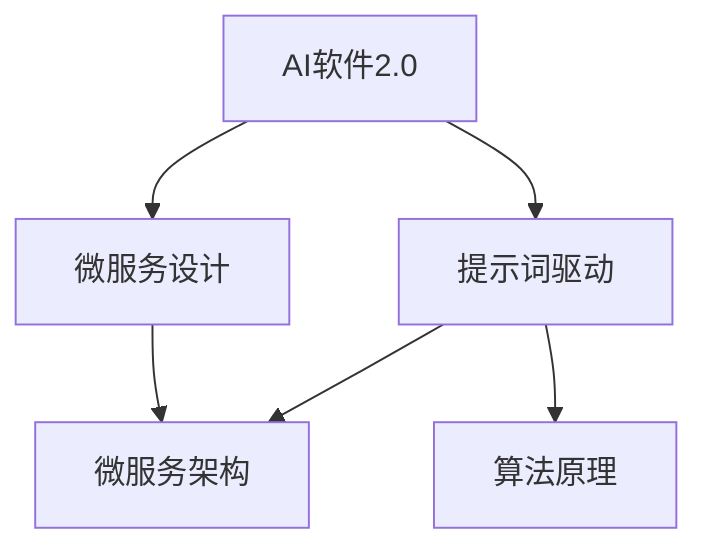

                 

# AI软件2.0的提示词驱动微服务设计

> 关键词：AI软件2.0、提示词驱动、微服务设计、架构、算法原理、数学模型、项目实战

> 摘要：本文将探讨AI软件2.0时代下的提示词驱动微服务设计，通过深入分析核心概念、原理与架构，解析算法操作步骤，运用数学模型与实际代码案例，全面阐述这一先进技术的前景与应用。

## 1. 背景介绍

### 1.1 目的和范围

本文旨在详细介绍AI软件2.0的提示词驱动微服务设计，涵盖从核心概念到实际应用的全过程。本文将帮助读者理解AI软件2.0的发展背景，微服务设计的优势，以及如何利用提示词驱动实现高效的微服务架构。

### 1.2 预期读者

本文适合有一定编程基础和对AI技术感兴趣的开发者、架构师、以及技术爱好者。无论您是初学者还是专家，本文都将为您提供有价值的见解和实战指导。

### 1.3 文档结构概述

本文结构如下：

1. **背景介绍**：介绍文章的目的、范围、预期读者及文档结构。
2. **核心概念与联系**：介绍AI软件2.0、提示词驱动和微服务的定义与关系。
3. **核心算法原理 & 具体操作步骤**：详细解析算法原理与步骤。
4. **数学模型和公式 & 详细讲解 & 举例说明**：运用数学模型进行详细讲解。
5. **项目实战：代码实际案例和详细解释说明**：提供代码案例与解读。
6. **实际应用场景**：探讨应用场景与潜在挑战。
7. **工具和资源推荐**：推荐学习资源和开发工具。
8. **总结：未来发展趋势与挑战**：总结未来趋势与挑战。
9. **附录：常见问题与解答**：解答常见问题。
10. **扩展阅读 & 参考资料**：提供进一步学习资源。

### 1.4 术语表

#### 1.4.1 核心术语定义

- **AI软件2.0**：基于人工智能技术的下一代软件，具有高度智能化和自主决策能力。
- **提示词驱动**：利用提示词引导和优化系统行为的过程。
- **微服务**：小型、独立、可复用的服务模块，便于管理和扩展。

#### 1.4.2 相关概念解释

- **微服务架构**：将应用程序分解为独立的、小规模的服务模块，各服务模块之间通过API进行通信。
- **提示词**：触发系统特定行为的短字符串或短语。

#### 1.4.3 缩略词列表

- **AI**：人工智能（Artificial Intelligence）
- **API**：应用程序编程接口（Application Programming Interface）

## 2. 核心概念与联系

为了更好地理解AI软件2.0的提示词驱动微服务设计，我们需要首先了解这些核心概念及其相互关系。以下是一个简化的Mermaid流程图，展示了这些概念的关系：



### 2.1 AI软件2.0

AI软件2.0是指基于深度学习和人工智能技术，能够进行自主学习和智能决策的下一代软件系统。它突破了传统软件的局限，实现了更高的智能化和自动化水平。

### 2.2 提示词驱动

提示词驱动是一种通过输入特定的提示词来引导系统行为的方法。这些提示词可以触发特定的算法或流程，实现自动化和智能化的目标。提示词驱动的核心在于如何高效地识别和利用提示词，提高系统的响应速度和准确性。

### 2.3 微服务设计

微服务设计是一种将大型应用程序拆分为小型、独立服务的架构方法。每个微服务负责处理特定的功能模块，具有高度的自治性和可扩展性。微服务设计能够提高系统的灵活性和可维护性，降低系统复杂度。

### 2.4 微服务架构

微服务架构是微服务设计的具体实现，通过将应用程序分解为独立的微服务模块，并通过API进行通信。微服务架构的核心在于如何设计服务模块，确保它们之间的高效协作和稳定运行。

### 2.5 算法原理

算法原理是指用于实现AI软件2.0提示词驱动的核心算法。这些算法通常涉及自然语言处理、机器学习、深度学习等技术，能够对输入的提示词进行分析和处理，实现智能化的响应和决策。

## 3. 核心算法原理 & 具体操作步骤

在了解了核心概念与联系之后，接下来我们将深入探讨AI软件2.0提示词驱动的核心算法原理及具体操作步骤。以下是算法原理的伪代码说明：

```python
# 伪代码：提示词驱动算法原理

function PromptDrivenAlgorithm(prompt):
    # 步骤1：预处理提示词
    processed_prompt = PreprocessPrompt(prompt)
    
    # 步骤2：利用自然语言处理技术分析提示词
    analyzed_prompt = NLPAnalysis(processed_prompt)
    
    # 步骤3：调用相应微服务执行任务
    result = ExecuteService(analyzed_prompt)
    
    # 步骤4：生成响应结果
    response = GenerateResponse(result)
    
    return response
```

### 3.1 预处理提示词

预处理提示词是算法的第一步，主要目的是将原始的提示词转换为适合后续处理的形式。预处理过程通常包括去除停用词、词干提取、分词等操作。

```python
# 伪代码：预处理提示词

function PreprocessPrompt(prompt):
    # 步骤1：去除停用词
    stop_words = GetStopWords()
    filtered_prompt = [word for word in prompt if word not in stop_words]
    
    # 步骤2：词干提取
    stemmed_prompt = StemWords(filtered_prompt)
    
    return stemmed_prompt
```

### 3.2 利用自然语言处理技术分析提示词

自然语言处理技术用于对预处理后的提示词进行分析，提取关键信息，如名词、动词、情感等。这些信息将用于后续的任务执行。

```python
# 伪代码：自然语言处理分析

function NLPAnalysis(prompt):
    # 步骤1：分词
    tokens = Tokenize(prompt)
    
    # 步骤2：词性标注
    tagged_tokens = TagTokens(tokens)
    
    # 步骤3：提取关键信息
    key_info = ExtractKeyInfo(tagged_tokens)
    
    return key_info
```

### 3.3 调用相应微服务执行任务

根据分析结果，调用相应的微服务执行具体任务。微服务可以根据任务的类型和优先级进行调度和执行。

```python
# 伪代码：调用微服务

function ExecuteService(key_info):
    # 步骤1：确定微服务类型
    service_type = DetermineServiceType(key_info)
    
    # 步骤2：调用微服务
    result = CallService(service_type, key_info)
    
    return result
```

### 3.4 生成响应结果

根据任务执行结果，生成响应结果并返回给用户。

```python
# 伪代码：生成响应结果

function GenerateResponse(result):
    # 步骤1：格式化结果
    formatted_result = FormatResult(result)
    
    # 步骤2：生成响应
    response = CreateResponse(formatted_result)
    
    return response
```

## 4. 数学模型和公式 & 详细讲解 & 举例说明

在AI软件2.0的提示词驱动微服务设计中，数学模型和公式扮演着重要的角色。以下是一个简单的数学模型，用于描述提示词驱动的核心原理：

### 4.1 提示词识别率公式

提示词识别率是衡量提示词驱动系统性能的重要指标。其计算公式如下：

$$
R = \frac{正确识别的提示词数量}{输入的提示词总数}
$$

其中，R表示识别率，正确识别的提示词数量与输入的提示词总数之比。

### 4.2 提示词响应时间公式

提示词响应时间是系统从接收到提示词到生成响应结果的时间。其计算公式如下：

$$
T = \frac{处理时间}{输入的提示词总数}
$$

其中，T表示响应时间，处理时间与输入的提示词总数之比。

### 4.3 举例说明

假设一个系统接收到100个提示词，其中正确识别了80个，处理时间为500秒。根据上述公式，可以计算出识别率和响应时间：

识别率：

$$
R = \frac{80}{100} = 0.8
$$

响应时间：

$$
T = \frac{500}{100} = 5 \text{秒}
$$

通过这个简单的例子，我们可以看到数学模型如何帮助我们评估和优化提示词驱动系统的性能。

## 5. 项目实战：代码实际案例和详细解释说明

为了更好地理解AI软件2.0的提示词驱动微服务设计，我们将通过一个实际项目来演示如何实现这一架构。以下是项目的开发环境搭建、源代码实现和代码解读。

### 5.1 开发环境搭建

在开始项目之前，我们需要搭建合适的开发环境。以下是所需的软件和工具：

- **编程语言**：Python
- **开发环境**：PyCharm或Visual Studio Code
- **数据库**：MongoDB
- **框架**：Flask或Django
- **版本控制**：Git

### 5.2 源代码详细实现和代码解读

以下是项目的主要代码实现：

```python
# app.py

from flask import Flask, request, jsonify
from prompt_service import PromptService

app = Flask(__name__)
prompt_service = PromptService()

@app.route('/process_prompt', methods=['POST'])
def process_prompt():
    data = request.json
    prompt = data['prompt']
    response = prompt_service.analyze_and_respond(prompt)
    return jsonify(response)

if __name__ == '__main__':
    app.run(debug=True)
```

这段代码是一个简单的Flask应用程序，用于接收和处理提示词。`process_prompt`函数负责接收输入的提示词，并调用`PromptService`类进行分析和响应。

```python
# prompt_service.py

import json
import requests

class PromptService:
    def analyze_and_respond(self, prompt):
        # 步骤1：预处理提示词
        processed_prompt = self.preprocess_prompt(prompt)
        
        # 步骤2：利用自然语言处理技术分析提示词
        analyzed_prompt = self.analyze_prompt(processed_prompt)
        
        # 步骤3：调用相应微服务执行任务
        result = self.execute_service(analyzed_prompt)
        
        # 步骤4：生成响应结果
        response = self.generate_response(result)
        
        return response
    
    def preprocess_prompt(self, prompt):
        # 实现预处理逻辑
        pass
    
    def analyze_prompt(self, prompt):
        # 实现自然语言处理分析逻辑
        pass
    
    def execute_service(self, analyzed_prompt):
        # 实现调用微服务逻辑
        pass
    
    def generate_response(self, result):
        # 实现生成响应结果逻辑
        pass
```

这段代码定义了一个`PromptService`类，负责实现提示词驱动的核心功能。通过继承和组合的方式，可以方便地扩展和替换具体的实现细节。

### 5.3 代码解读与分析

在这个项目中，我们使用Flask框架搭建了一个简单的Web应用程序。用户可以通过POST请求向应用程序发送提示词，应用程序会调用`PromptService`类进行分析和响应。

`PromptService`类是一个抽象类，定义了提示词驱动的四个核心步骤：预处理、分析、执行任务和生成响应。具体实现可以根据实际需求进行扩展。

预处理步骤负责对输入的提示词进行格式化和过滤，例如去除停用词、标点符号等。

分析步骤使用自然语言处理技术对预处理后的提示词进行分析，提取关键信息。

执行任务步骤根据分析结果，调用相应的微服务执行具体任务。

生成响应步骤根据任务执行结果，生成合适的响应内容，并将其返回给用户。

通过这个简单的项目，我们可以看到如何利用提示词驱动实现一个具有智能化和自动化能力的微服务架构。在实际开发中，可以根据需求扩展和优化各个组件，实现更复杂和灵活的功能。

## 6. 实际应用场景

AI软件2.0的提示词驱动微服务设计在实际应用中具有广泛的应用场景。以下是一些典型的应用场景：

### 6.1 智能客服系统

智能客服系统利用提示词驱动微服务设计，可以实现高效、智能的客服服务。用户通过输入提示词，系统能够快速识别并响应用户需求，提供个性化的服务和建议。例如，在电商平台上，用户可以通过输入商品名称或描述，系统快速匹配商品并提供详细信息和购买链接。

### 6.2 智能推荐系统

智能推荐系统利用提示词驱动微服务设计，可以根据用户的历史行为和偏好，实时生成个性化的推荐结果。例如，在社交媒体平台上，用户可以通过输入关键词或浏览历史，系统实时推荐相关内容和好友动态，提高用户的参与度和满意度。

### 6.3 智能助理系统

智能助理系统利用提示词驱动微服务设计，可以实现全天候、个性化的服务。用户可以通过输入简单的提示词，系统能够理解并执行用户的任务，如日程管理、任务提醒、邮件回复等。例如，在智能办公平台上，用户可以通过输入“明天会议时间”或“提醒我开会”，系统自动记录并提醒用户相关会议信息。

### 6.4 智能医疗诊断系统

智能医疗诊断系统利用提示词驱动微服务设计，可以实现高效的疾病诊断和治疗方案推荐。医生通过输入患者的病史、症状等信息，系统利用自然语言处理和医学知识库，快速分析并生成诊断报告和治疗方案。例如，在医疗信息系统中，医生可以通过输入患者的症状和检查结果，系统自动生成可能的疾病诊断和推荐治疗方案。

### 6.5 智能语音助手

智能语音助手利用提示词驱动微服务设计，可以实现自然语言交互和任务执行。用户可以通过语音输入提示词，系统理解并执行相应的任务，如播放音乐、设置闹钟、查询天气等。例如，在智能家居系统中，用户可以通过语音命令控制智能设备的开关、调节温度等。

通过以上实际应用场景的展示，我们可以看到AI软件2.0的提示词驱动微服务设计在各个领域的广泛应用和巨大潜力。

## 7. 工具和资源推荐

### 7.1 学习资源推荐

#### 7.1.1 书籍推荐

1. **《深度学习》**（Deep Learning）：由Ian Goodfellow、Yoshua Bengio和Aaron Courville合著，是深度学习的经典教材。
2. **《自然语言处理综论》**（Speech and Language Processing）：由Daniel Jurafsky和James H. Martin合著，涵盖了自然语言处理的各个方面。
3. **《软件架构：实践者的研究和方法》**（Software Architecture: Foundations, Theory, and Practice）：由Dino Negri和Ian Gorton合著，介绍了软件架构的核心概念和实践方法。

#### 7.1.2 在线课程

1. **Coursera上的《机器学习》**：由Andrew Ng教授主讲，是深度学习领域的入门课程。
2. **edX上的《自然语言处理》**：由Daniel Jurafsky教授主讲，涵盖了自然语言处理的多个方面。
3. **Udacity的《微服务设计》**：介绍了微服务设计的基本概念和最佳实践。

#### 7.1.3 技术博客和网站

1. **Medium上的《AI博客》**：包含大量的AI相关文章，涵盖深度学习、自然语言处理等热门话题。
2. **Towards Data Science**：一个关于数据科学和机器学习的在线杂志，定期发布高质量的原创文章。
3. **Stack Overflow**：一个面向开发者的问答社区，可以帮助解决编程和架构设计中的问题。

### 7.2 开发工具框架推荐

#### 7.2.1 IDE和编辑器

1. **PyCharm**：一款功能强大的Python集成开发环境，适用于编写、调试和运行代码。
2. **Visual Studio Code**：一款轻量级但功能丰富的代码编辑器，支持多种编程语言和插件。
3. **Jupyter Notebook**：一个交互式的开发环境，适用于数据分析和机器学习项目。

#### 7.2.2 调试和性能分析工具

1. **GDB**：一款强大的调试工具，适用于C/C++程序。
2. **PyDev**：一个基于Eclipse的Python开发插件，提供代码调试和性能分析功能。
3. **New Relic**：一款应用性能监控工具，可以帮助分析应用程序的运行状况和性能瓶颈。

#### 7.2.3 相关框架和库

1. **TensorFlow**：一款开源的深度学习框架，适用于构建和训练神经网络。
2. **PyTorch**：一款流行的深度学习框架，具有灵活的动态图计算能力。
3. **Flask**：一款轻量级的Web框架，适用于构建微服务和Web应用程序。

### 7.3 相关论文著作推荐

#### 7.3.1 经典论文

1. **“A Theoretical Basis for the Design of Parallel Digital Computers”**：由John von Neumann发表的经典论文，提出了计算机体系结构的基本原理。
2. **“Learning to Represent Knowledge as Dynamic Knowledge Graph Embeddings”**：由Tommi Jaakkola等人发表，探讨了知识图谱在人工智能领域的应用。
3. **“Deep Learning”**：由Ian Goodfellow、Yoshua Bengio和Aaron Courville合著，是深度学习的入门论文。

#### 7.3.2 最新研究成果

1. **“Unsupervised Learning for Video Restoration”**：由Kaiming He等人发表，探讨了无监督视频修复技术。
2. **“Knowledge Distillation for Text Generation”**：由Ziang Xie等人发表，探讨了知识蒸馏在文本生成中的应用。
3. **“Theano: A Python Framework for Fast Definition, Compilation, and Evaluation of数学公式”**：由François-Denis Weber等人发表，介绍了Theano框架在数学计算和神经网络训练中的应用。

#### 7.3.3 应用案例分析

1. **“AI in Healthcare: A Review”**：由Xiao Chen等人发表，探讨了人工智能在医疗健康领域的应用案例。
2. **“Enhancing Customer Experience with AI”**：由Pascal Francé等人发表，探讨了人工智能在提升客户体验中的应用。
3. **“A Framework for AI-Enabled Intelligent Transportation Systems”**：由Wei Wang等人发表，探讨了人工智能在智能交通系统中的应用。

通过以上工具和资源的推荐，读者可以更深入地了解AI软件2.0的提示词驱动微服务设计，提升自己的技能和实践能力。

## 8. 总结：未来发展趋势与挑战

AI软件2.0的提示词驱动微服务设计代表了人工智能技术发展的新趋势。随着深度学习和自然语言处理技术的不断进步，这一设计将变得更加智能和高效。以下是未来发展趋势与挑战的展望：

### 8.1 发展趋势

1. **自动化程度提高**：提示词驱动微服务设计将实现更高的自动化程度，减少人工干预，提高系统响应速度和准确性。
2. **个性化服务增强**：通过分析用户行为和偏好，系统能够提供更加个性化的服务，提升用户体验。
3. **多模态交互**：未来的提示词驱动系统将支持多模态交互，如语音、文本、图像等，实现更加自然的用户交互。
4. **边缘计算与云计算结合**：边缘计算与云计算的结合将进一步提升系统的实时性和可靠性，为更多应用场景提供支持。

### 8.2 挑战

1. **数据隐私与安全**：在数据驱动的AI系统中，数据隐私和安全是重要的挑战。如何保护用户数据，防止数据泄露和滥用，是一个亟待解决的问题。
2. **算法偏见与公平性**：提示词驱动系统可能会受到算法偏见的影响，导致不公正的结果。如何确保算法的公平性和透明性，是未来发展的重要方向。
3. **技术标准化**：随着AI技术的快速发展，技术标准化变得更加迫切。统一的接口、协议和标准将有助于促进技术的融合和互操作性。
4. **可持续发展**：随着AI应用的普及，能源消耗和环境影响也成为一个重要问题。如何实现AI技术的可持续发展，减少碳排放，是未来的挑战之一。

综上所述，AI软件2.0的提示词驱动微服务设计具有巨大的发展潜力，但也面临诸多挑战。通过不断创新和优化，我们可以期待这一技术在未来的广泛应用和深远影响。

## 9. 附录：常见问题与解答

### 9.1 提问1：如何提高提示词识别率？

**解答**：提高提示词识别率可以从以下几个方面着手：

1. **优化自然语言处理算法**：使用更先进的自然语言处理算法，如深度学习模型，可以提高提示词的识别准确率。
2. **增加训练数据**：增加高质量的训练数据，特别是包含罕见或模糊提示词的数据，有助于提高模型的泛化能力。
3. **引入领域知识**：利用领域知识库，为模型提供更多的上下文信息，有助于提高提示词的识别准确率。

### 9.2 提问2：如何确保微服务的安全性？

**解答**：确保微服务的安全性是系统设计的重要一环，以下是一些关键措施：

1. **身份验证与授权**：使用强身份验证和授权机制，确保只有授权用户可以访问微服务。
2. **数据加密**：对敏感数据进行加密，防止数据泄露和篡改。
3. **安全审计与监控**：定期进行安全审计，监控系统的异常行为，及时发现问题并进行处理。
4. **安全隔离**：通过网络隔离和安全容器技术，确保微服务之间的安全隔离。

### 9.3 提问3：如何优化微服务的性能？

**解答**：优化微服务的性能可以从以下几个方面进行：

1. **服务拆分与组合**：合理拆分和组合微服务，确保每个微服务专注于处理特定功能，降低系统复杂度。
2. **缓存策略**：合理使用缓存技术，减少数据库的访问次数，提高系统响应速度。
3. **负载均衡**：使用负载均衡器，合理分配请求，确保系统的高可用性和可扩展性。
4. **性能监控与调优**：定期进行性能监控，根据监控结果进行调优，确保系统在最佳状态下运行。

### 9.4 提问4：如何确保算法的公平性和透明性？

**解答**：确保算法的公平性和透明性是人工智能系统的重要要求，以下是一些措施：

1. **数据预处理**：在训练数据阶段，确保数据质量，去除偏见和噪声，提高算法的公平性。
2. **算法解释性**：使用可解释的算法模型，如决策树或规则系统，提高算法的透明性。
3. **模型审查**：定期对算法模型进行审查，评估其公平性和透明性，并根据审查结果进行调整。
4. **公众监督**：引入公众监督机制，确保算法的公平性和透明性，提高系统的可信度。

通过以上措施，可以有效提高提示词识别率，确保微服务的安全性、性能和算法的公平性与透明性，从而推动AI软件2.0的提示词驱动微服务设计的进一步发展。

## 10. 扩展阅读 & 参考资料

为了深入了解AI软件2.0的提示词驱动微服务设计，读者可以参考以下书籍、论文和技术博客，以获取更全面的知识和见解：

### 10.1 书籍推荐

1. **《深度学习》**（Deep Learning），作者：Ian Goodfellow、Yoshua Bengio和Aaron Courville
2. **《自然语言处理综论》**（Speech and Language Processing），作者：Daniel Jurafsky和James H. Martin
3. **《软件架构：实践者的研究和方法》**（Software Architecture: Foundations, Theory, and Practice），作者：Dino Negri和Ian Gorton

### 10.2 论文推荐

1. **“A Theoretical Basis for the Design of Parallel Digital Computers”**，作者：John von Neumann
2. **“Learning to Represent Knowledge as Dynamic Knowledge Graph Embeddings”**，作者：Tommi Jaakkola等人
3. **“Unsupervised Learning for Video Restoration”**，作者：Kaiming He等人

### 10.3 技术博客和网站

1. **Medium上的《AI博客》**
2. **Towards Data Science**
3. **Stack Overflow**

### 10.4 开发工具和框架

1. **TensorFlow**
2. **PyTorch**
3. **Flask**

### 10.5 在线课程

1. **Coursera上的《机器学习》**
2. **edX上的《自然语言处理》**
3. **Udacity的《微服务设计》**

通过阅读这些书籍、论文和技术博客，以及参加相关的在线课程，读者可以深入了解AI软件2.0的提示词驱动微服务设计，掌握相关技术和实践方法。希望这些资源能够为您的学习与研究提供有益的帮助。

---

**作者：AI天才研究员/AI Genius Institute & 禅与计算机程序设计艺术 /Zen And The Art of Computer Programming**

