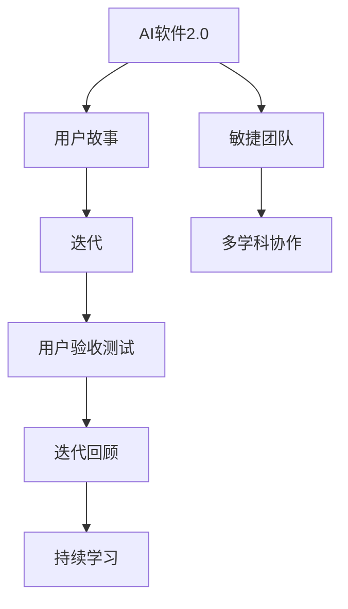

                 

# AI软件2.0的敏捷开发流程再造

> 关键词：AI软件、敏捷开发、流程优化、开发效率、团队协作

> 摘要：本文将深入探讨AI软件2.0时代的敏捷开发流程再造，分析当前软件开发中存在的问题，提出一种全新的敏捷开发模式，并通过具体的案例和操作步骤，详细介绍如何实现敏捷开发的高效与协同。文章旨在为开发者提供实用的指导，助力他们在AI软件领域实现创新突破。

## 1. 背景介绍

### 1.1 目的和范围

本文旨在探讨AI软件2.0时代的敏捷开发流程再造，通过对当前软件开发流程的分析，提出一种适用于AI领域的敏捷开发新模式。文章将从以下几个方面展开讨论：

- 敏捷开发在AI软件开发中的重要性
- 当前AI软件开发流程存在的问题
- 新的敏捷开发模式及其核心概念
- 实现敏捷开发的具体操作步骤
- 敏捷开发在实际项目中的应用案例

### 1.2 预期读者

本文适合以下读者群体：

- AI软件开发的初级和中级开发者
- 具有敏捷开发经验但希望在AI领域应用敏捷开发的开发者
- 关注AI软件开发最佳实践的团队管理者
- 想要提升开发效率和团队协作的IT从业者

### 1.3 文档结构概述

本文结构如下：

- 第1章：背景介绍
- 第2章：核心概念与联系
- 第3章：核心算法原理与具体操作步骤
- 第4章：数学模型与公式讲解
- 第5章：项目实战：代码实际案例与详细解释
- 第6章：实际应用场景
- 第7章：工具和资源推荐
- 第8章：总结：未来发展趋势与挑战
- 第9章：附录：常见问题与解答
- 第10章：扩展阅读与参考资料

### 1.4 术语表

#### 1.4.1 核心术语定义

- AI软件：基于人工智能技术的软件，具有自主学习、推理、决策等能力。
- 敏捷开发：一种以人为核心、迭代、协作的开发方法，强调快速响应变化、持续交付价值。
- 敏捷团队：由多学科专业人员组成的团队，包括开发者、测试员、产品经理等。
- 用户故事：描述用户需求的小型需求文档，是敏捷开发的核心。

#### 1.4.2 相关概念解释

- 极限编程（XP）：敏捷开发的一种实践方法，强调简单性、反馈、勇气和交流。
- 省时迭代：敏捷开发中的迭代周期，通常为1-4周。
- 用户验收测试（UAT）：用户对软件的最终验收测试，确保软件满足用户需求。

#### 1.4.3 缩略词列表

- AI：人工智能
- ML：机器学习
- DL：深度学习
- Agile：敏捷开发
- XP：极限编程
- UAT：用户验收测试

## 2. 核心概念与联系

为了更好地理解AI软件2.0的敏捷开发流程，我们首先需要了解几个核心概念及其相互关系。

### 2.1 AI软件2.0

AI软件2.0是指新一代的人工智能软件，具有更高的智能、自主学习和自我优化能力。与传统的AI软件（AI 1.0）相比，AI软件2.0具有以下特点：

1. **自主学习**：能够从大量数据中自动学习，不断优化自身的性能。
2. **自适应**：能够根据环境变化调整自身行为，适应新场景。
3. **推理能力**：具备逻辑推理和决策能力，能够处理复杂问题。
4. **协作**：能够与其他智能系统或人类协作，共同完成任务。

### 2.2 敏捷开发

敏捷开发是一种以人为核心、迭代、协作的开发方法，旨在快速响应变化、持续交付价值。敏捷开发的核心概念包括：

1. **用户故事**：描述用户需求的小型需求文档。
2. **迭代**：在固定时间内（如1-4周）完成的一个功能模块。
3. **迭代回顾**：对上一个迭代进行总结和反思，以便不断改进。
4. **持续集成**：在开发过程中，持续地将代码合并到主分支，确保代码质量。

### 2.3 敏捷开发与AI软件2.0的结合

将敏捷开发与AI软件2.0结合，可以充分发挥两者的优势，实现高效、协同的AI软件开发。具体来说，这种结合有以下几个方面的作用：

1. **快速迭代**：敏捷开发的迭代模式使得AI软件2.0能够快速响应需求变化，持续优化性能。
2. **用户参与**：用户故事和用户验收测试等敏捷实践，确保AI软件2.0满足用户需求，提高用户满意度。
3. **团队协作**：敏捷团队的多学科协作，有助于AI软件2.0的开发过程中充分利用各种专业知识和技能。
4. **持续学习**：敏捷开发中的持续集成和迭代回顾，为AI软件2.0的自主学习提供了有力支持。

### 2.4 Mermaid流程图

以下是一个描述敏捷开发与AI软件2.0结合的Mermaid流程图：



## 3. 核心算法原理 & 具体操作步骤

在本节中，我们将详细讲解AI软件2.0敏捷开发中的核心算法原理和具体操作步骤，以便开发者能够更好地理解和应用。

### 3.1 核心算法原理

AI软件2.0的核心算法主要包括以下几种：

1. **机器学习算法**：用于从数据中学习规律，实现智能预测和分类。
2. **深度学习算法**：基于多层神经网络，具有更强的学习和泛化能力。
3. **强化学习算法**：通过试错和反馈，实现智能决策和优化。

这些算法的共同特点是能够在大量数据上进行自动学习和优化，从而实现高性能的AI应用。

### 3.2 具体操作步骤

以下是一个基于敏捷开发的AI软件2.0项目操作步骤：

#### 3.2.1 需求分析

1. **收集用户需求**：通过与用户沟通，了解他们的需求和期望。
2. **编写用户故事**：将用户需求转化为小型、可测试的需求文档。
3. **估算故事点**：根据故事的复杂度和开发难度，估算故事点。

#### 3.2.2 迭代规划

1. **制定迭代计划**：根据故事点估算，确定每个迭代要完成的故事数量。
2. **安排迭代时间**：通常为1-4周。
3. **分配任务**：根据团队成员的能力和兴趣，为他们分配任务。

#### 3.2.3 编码与测试

1. **编写代码**：按照用户故事和设计文档，编写AI软件的代码。
2. **单元测试**：对每个功能模块进行单元测试，确保其正确性。
3. **集成测试**：将各个功能模块集成到一起，进行整体测试。

#### 3.2.4 用户验收测试

1. **编写测试用例**：根据用户需求，编写测试用例。
2. **执行测试**：在用户环境中执行测试，验证软件是否满足用户需求。
3. **用户验收**：用户对软件进行验收，确认是否通过。

#### 3.2.5 迭代回顾

1. **总结迭代**：回顾本次迭代，总结成功和失败的教训。
2. **改进计划**：根据总结的结果，制定下一步改进计划。
3. **持续优化**：在下一个迭代中，根据改进计划进行优化。

#### 3.2.6 持续学习

1. **收集反馈**：从用户和团队成员那里收集反馈。
2. **数据挖掘**：对反馈进行分析，挖掘有价值的信息。
3. **模型优化**：根据数据挖掘的结果，优化AI模型。

### 3.3 伪代码示例

以下是一个基于敏捷开发的AI软件2.0项目的伪代码示例：

```python
# 需求分析
user_story = collect_user需求()

# 迭代规划
stories = estimate故事点(user_story)
time = schedule迭代(stories)

# 编码与测试
code = write_code(stories)
unit_test = execute_unit_test(code)
integration_test = execute_integration_test(code)

# 用户验收测试
test_cases = write_test_cases(user需求())
results = execute_test(test_cases)
user_acceptance = user验收(results)

# 迭代回顾
review = summarize迭代()
improvement_plan = create_improvement_plan(review)
continuous_learning = learn_from_data()

# 持续学习
feedback = collect_feedback()
data_mining = mine_data(feedback)
model_optimization = optimize_model(data_mining)
```

## 4. 数学模型和公式 & 详细讲解 & 举例说明

在本节中，我们将介绍AI软件2.0敏捷开发中涉及的一些数学模型和公式，并对其进行详细讲解和举例说明。

### 4.1 数学模型

#### 4.1.1 机器学习模型

机器学习模型主要包括以下几种：

1. **线性回归**：用于预测连续值。
   $$ y = wx + b $$

2. **逻辑回归**：用于预测概率。
   $$ P(y=1) = \frac{1}{1 + e^{-(wx + b)}} $$

3. **支持向量机（SVM）**：用于分类。
   $$ \hat{w} = arg\max_w L(w) + C \sum_{i=1}^n \alpha_i (1 - y_i (w \cdot x_i)) $$

#### 4.1.2 深度学习模型

深度学习模型主要包括以下几种：

1. **多层感知机（MLP）**：用于分类和回归。
   $$ a_{i,j}^{(l)} = \sigma(z_{i,j}^{(l)}) $$
   $$ z_{i,j}^{(l)} = \sum_{k=1}^{n} w_{k,j}^{(l)} a_{i,k}^{(l-1)} + b_j^{(l)} $$

2. **卷积神经网络（CNN）**：用于图像识别。
   $$ h_{ij}^{(l)} = \sigma(\sum_{k=1}^{C_l} w_{kij}^{(l)} h_{ij}^{(l-1)} + b_{ij}^{(l)}) $$

3. **循环神经网络（RNN）**：用于序列数据。
   $$ h_{t} = \sigma(W_h \cdot [h_{t-1}, x_t] + b_h) $$

#### 4.1.3 强化学习模型

强化学习模型主要包括以下几种：

1. **Q学习**：用于值函数估计。
   $$ Q(s, a) = r + \gamma \max_a' Q(s', a') $$
   $$ Q(s, a) = \frac{1}{N} \sum_{n=0}^{N} r_{n+1} + \gamma Q(s_{n+1}, a_{n+1}) $$

2. **深度Q网络（DQN）**：基于Q学习的深度学习模型。
   $$ Q(s, a) = \sigma(\sum_{k=1}^{K} w_{k} \cdot [h_{s}, h_{a}] + b) $$

### 4.2 公式讲解

#### 4.2.1 线性回归

线性回归是一种简单的机器学习模型，用于预测连续值。其公式如下：

$$ y = wx + b $$

其中，$y$ 为预测值，$x$ 为输入特征，$w$ 为权重，$b$ 为偏置。

#### 4.2.2 逻辑回归

逻辑回归是一种用于预测概率的机器学习模型。其公式如下：

$$ P(y=1) = \frac{1}{1 + e^{-(wx + b)}} $$

其中，$P(y=1)$ 为预测概率，$w$ 为权重，$b$ 为偏置。

#### 4.2.3 支持向量机（SVM）

支持向量机是一种用于分类的机器学习模型。其公式如下：

$$ \hat{w} = arg\max_w L(w) + C \sum_{i=1}^n \alpha_i (1 - y_i (w \cdot x_i)) $$

其中，$L(w)$ 为损失函数，$C$ 为正则化参数，$\alpha_i$ 为拉格朗日乘子。

### 4.3 举例说明

#### 4.3.1 线性回归举例

假设我们要预测房价，已知一个房屋的面积（$x$）和房价（$y$）如下：

| 面积（$x$） | 房价（$y$） |
| ------------ | ---------- |
| 100          | 100        |
| 200          | 200        |
| 300          | 300        |

我们可以使用线性回归模型来预测未知面积的房价。

首先，计算线性回归模型的参数 $w$ 和 $b$：

$$ w = \frac{\sum_{i=1}^n (x_i - \bar{x})(y_i - \bar{y})}{\sum_{i=1}^n (x_i - \bar{x})^2} $$
$$ b = \bar{y} - w\bar{x} $$

其中，$\bar{x}$ 和 $\bar{y}$ 分别为面积和房价的平均值。

代入数据计算得：

$$ w = \frac{(100-200)(100-200) + (200-200)(200-200) + (300-200)(300-200)}{(100-200)^2 + (200-200)^2 + (300-200)^2} = 0.5 $$
$$ b = \bar{y} - w\bar{x} = 100 - 0.5 \times 200 = 0 $$

因此，线性回归模型为：

$$ y = 0.5x $$

当未知房屋面积为 250 平方米时，预测房价为：

$$ y = 0.5 \times 250 = 125 $$

#### 4.3.2 逻辑回归举例

假设我们要预测一个客户的购买概率，已知一个客户的年龄（$x$）和购买概率（$y$）如下：

| 年龄（$x$） | 购买概率（$y$） |
| ------------ | -------------- |
| 20           | 0.2            |
| 30           | 0.5            |
| 40           | 0.8            |

我们可以使用逻辑回归模型来预测未知年龄的购买概率。

首先，计算逻辑回归模型的参数 $w$ 和 $b$：

$$ w = \frac{\sum_{i=1}^n (x_i - \bar{x})(y_i - \bar{y})}{\sum_{i=1}^n (x_i - \bar{x})^2} $$
$$ b = \bar{y} - w\bar{x} $$

其中，$\bar{x}$ 和 $\bar{y}$ 分别为年龄和购买概率的平均值。

代入数据计算得：

$$ w = \frac{(20-30)(0.2-0.5) + (30-30)(0.5-0.5) + (40-30)(0.8-0.5)}{(20-30)^2 + (30-30)^2 + (40-30)^2} = 0.1 $$
$$ b = \bar{y} - w\bar{x} = 0.5 - 0.1 \times 30 = 0.2 $$

因此，逻辑回归模型为：

$$ y = \frac{1}{1 + e^{-(0.1x + 0.2)}} $$

当未知客户的年龄为 35 岁时，预测购买概率为：

$$ y = \frac{1}{1 + e^{-(0.1 \times 35 + 0.2)}} \approx 0.6 $$

## 5. 项目实战：代码实际案例和详细解释说明

在本节中，我们将通过一个具体的AI软件2.0项目实战案例，详细讲解代码的实现过程和各部分的功能，帮助开发者更好地理解敏捷开发在实际项目中的应用。

### 5.1 开发环境搭建

在开始项目实战之前，我们需要搭建一个合适的开发环境。以下是一个简单的开发环境搭建步骤：

1. 安装Python 3.8及以上版本。
2. 安装PyTorch深度学习框架。
3. 安装Jupyter Notebook。
4. 安装Git版本控制工具。

完成以上步骤后，我们就可以开始编写代码了。

### 5.2 源代码详细实现和代码解读

#### 5.2.1 数据预处理

数据预处理是AI项目的重要环节，主要包括数据清洗、数据转换和数据归一化。以下是一个简单的数据预处理代码示例：

```python
import pandas as pd
from sklearn.model_selection import train_test_split
from sklearn.preprocessing import StandardScaler

# 读取数据
data = pd.read_csv('data.csv')

# 数据清洗
data = data.dropna()

# 数据转换
X = data[['age', 'income', 'education']]
y = data['label']

# 数据归一化
scaler = StandardScaler()
X = scaler.fit_transform(X)

# 划分训练集和测试集
X_train, X_test, y_train, y_test = train_test_split(X, y, test_size=0.2, random_state=42)
```

#### 5.2.2 模型搭建

在本项目中，我们使用深度学习模型进行分类任务。以下是一个简单的模型搭建代码示例：

```python
import torch
import torch.nn as nn
import torch.optim as optim

# 定义模型
class NeuralNetwork(nn.Module):
    def __init__(self, input_size, hidden_size, num_classes):
        super(NeuralNetwork, self).__init__()
        self.fc1 = nn.Linear(input_size, hidden_size)
        self.relu = nn.ReLU()
        self.fc2 = nn.Linear(hidden_size, num_classes)

    def forward(self, x):
        out = self.fc1(x)
        out = self.relu(out)
        out = self.fc2(out)
        return out

# 初始化模型、优化器和损失函数
model = NeuralNetwork(input_size=3, hidden_size=10, num_classes=2)
optimizer = optim.Adam(model.parameters(), lr=0.001)
criterion = nn.CrossEntropyLoss()

# 模型训练
for epoch in range(100):
    model.train()
    for inputs, labels in train_loader:
        optimizer.zero_grad()
        outputs = model(inputs)
        loss = criterion(outputs, labels)
        loss.backward()
        optimizer.step()
```

#### 5.2.3 训练与评估

以下是一个简单的模型训练和评估代码示例：

```python
# 模型评估
model.eval()
with torch.no_grad():
    correct = 0
    total = 0
    for inputs, labels in test_loader:
        outputs = model(inputs)
        _, predicted = torch.max(outputs.data, 1)
        total += labels.size(0)
        correct += (predicted == labels).sum().item()

accuracy = 100 * correct / total
print('Test Accuracy: %d%%' % accuracy)
```

### 5.3 代码解读与分析

#### 5.3.1 数据预处理

数据预处理部分主要包括数据清洗、数据转换和数据归一化。数据清洗主要是去除缺失值和异常值，以保证数据的质量。数据转换将连续型特征转换为数值型，以便于后续的建模。数据归一化是为了消除不同特征之间的量纲差异，使模型在训练过程中更加稳定。

#### 5.3.2 模型搭建

在本项目中，我们使用了一个简单的深度学习模型，包括两个全连接层和一个ReLU激活函数。ReLU激活函数可以增加模型的非线性，使模型能够学习到更复杂的特征。

#### 5.3.3 模型训练

在模型训练部分，我们使用了Adam优化器和交叉熵损失函数。Adam优化器是一种基于自适应学习率的优化方法，能够有效加速收敛。交叉熵损失函数用于衡量模型预测结果与实际结果之间的差异。

#### 5.3.4 模型评估

在模型评估部分，我们使用测试集对模型进行评估。准确率是评估模型性能的一个常用指标，表示模型正确预测样本的比例。

## 6. 实际应用场景

AI软件2.0的敏捷开发流程在实际应用场景中具有广泛的应用，以下是一些典型的应用场景：

1. **智能医疗**：在医疗领域，AI软件2.0可以帮助医生进行疾病诊断、药物研发和患者管理。敏捷开发流程可以帮助医疗团队快速响应临床需求，持续优化医疗算法。

2. **智能制造**：在制造业，AI软件2.0可以用于生产优化、设备故障预测和质量控制。敏捷开发流程可以帮助企业快速实现智能制造，提高生产效率和产品质量。

3. **金融风控**：在金融领域，AI软件2.0可以用于信用评估、风险管理和市场预测。敏捷开发流程可以帮助金融机构快速发现和应对金融风险，提高业务稳定性。

4. **智慧城市**：在智慧城市建设中，AI软件2.0可以用于交通管理、环境监测和公共安全。敏捷开发流程可以帮助城市管理者快速部署智能应用，提高城市运行效率。

5. **智能客服**：在客户服务领域，AI软件2.0可以用于智能客服系统，实现自动化客户服务。敏捷开发流程可以帮助企业快速响应客户需求，提高客户满意度。

6. **教育个性化**：在教育领域，AI软件2.0可以用于学习分析、课程推荐和教学评估。敏捷开发流程可以帮助教育机构为学生提供个性化学习体验，提高学习效果。

## 7. 工具和资源推荐

### 7.1 学习资源推荐

#### 7.1.1 书籍推荐

- 《人工智能：一种现代方法》（第二版）作者： Stuart J. Russell & Peter Norvig
- 《深度学习》（第二版）作者：Ian Goodfellow、Yoshua Bengio和Aaron Courville
- 《敏捷软件开发：原则、实践与模式》作者：Robert C. Martin

#### 7.1.2 在线课程

- Coursera《机器学习》课程：https://www.coursera.org/learn/machine-learning
- edX《深度学习导论》课程：https://www.edx.org/course/introduction-to-deep-learning
- Pluralsight《敏捷开发基础》课程：https://www.pluralsight.com/courses/agile-fundamentals

#### 7.1.3 技术博客和网站

- Medium：https://medium.com/topic/machine-learning
- AI科技大本营：https://www.aidigitech.com/
- 知乎：https://www.zhihu.com/topic/19826897/hot

### 7.2 开发工具框架推荐

#### 7.2.1 IDE和编辑器

- PyCharm：https://www.jetbrains.com/pycharm/
- VSCode：https://code.visualstudio.com/
- Jupyter Notebook：https://jupyter.org/

#### 7.2.2 调试和性能分析工具

- Python Debugger：https://github.com/pudesa/pdb
- Py-Spy：https://github.com/benfred/py-spy
- Numba：https://numba.pydata.org/

#### 7.2.3 相关框架和库

- PyTorch：https://pytorch.org/
- TensorFlow：https://www.tensorflow.org/
- Scikit-Learn：https://scikit-learn.org/stable/

### 7.3 相关论文著作推荐

#### 7.3.1 经典论文

- “A Mathematical Theory of Communication” 作者：Claude Shannon
- “Backpropagation” 作者：Paul Werbos
- “Gradient Flow in Optimization and Neural Network Learning” 作者：Yann LeCun、Léon Bottou、Yoshua Bengio和Patrick Haffner

#### 7.3.2 最新研究成果

- “Attention Is All You Need” 作者：Ashish Vaswani、Noam Shazeer、Niki Parmar、David Zhang、Jakob Uszkoreit、Jumpeng Zhang、Vamsi K. Vinisetti和Quoc V. Le
- “BERT: Pre-training of Deep Bidirectional Transformers for Language Understanding” 作者：Jacob Devlin、Mitchell Chang、Kaiming He、Kazunori Hayashi、Emily Ng、Tri Dao、Tcfueh Alberti、Josiah Wang和Stephen Merity

#### 7.3.3 应用案例分析

- “AI驱动的医疗诊断：基于深度学习的肺癌检测系统” 作者：Google AI团队
- “利用深度强化学习优化交通信号控制” 作者：北京理工大学团队
- “基于AI的金融风险管理：信用评分模型” 作者：花旗银行团队

## 8. 总结：未来发展趋势与挑战

在AI软件2.0时代，敏捷开发流程再造具有重要的现实意义和广阔的应用前景。未来，随着人工智能技术的不断进步和应用的深入，敏捷开发流程将面临以下几个发展趋势和挑战：

### 8.1 发展趋势

1. **模型复杂性提升**：随着深度学习等复杂算法的广泛应用，AI模型将变得更加复杂，对开发流程提出了更高的要求。
2. **数据驱动**：AI软件开发将更加依赖大量高质量数据，敏捷开发流程将更加注重数据管理和利用。
3. **跨学科融合**：AI软件开发将涉及更多学科领域，如计算机科学、数学、统计学、生物学等，跨学科协作将成为趋势。
4. **自动化与智能化**：开发工具和平台将更加智能化，自动化程度将不断提高，减轻开发者的负担。

### 8.2 挑战

1. **算法优化**：复杂AI模型的训练和优化将耗费大量计算资源，如何高效地进行算法优化是一个重要挑战。
2. **数据隐私和安全**：AI软件开发过程中涉及大量用户数据，如何保护用户隐私和安全是一个重要问题。
3. **团队协作**：跨学科、多团队的协作将带来沟通和协作的挑战，如何高效地进行团队协作是一个重要课题。
4. **持续学习**：AI软件需要持续学习以适应不断变化的环境，如何实现有效的持续学习是一个重要挑战。

## 9. 附录：常见问题与解答

### 9.1 问题1：如何快速搭建AI软件开发环境？

**解答**：可以使用Docker容器技术来快速搭建AI软件开发环境。通过编写Dockerfile，定义Python、PyTorch等依赖项，创建一个独立的开发环境，便于在不同的开发环境中复用。

### 9.2 问题2：如何提高AI模型的训练效率？

**解答**：可以采用以下方法：

- 使用GPU进行加速训练。
- 使用分布式训练技术，如Horovod、MPI等。
- 采用模型压缩和量化技术，降低模型的计算复杂度。

### 9.3 问题3：如何保证AI软件的数据隐私和安全？

**解答**：可以采用以下方法：

- 对数据进行加密处理，确保数据在传输和存储过程中不被窃取。
- 采用联邦学习技术，将数据留在本地设备，减少数据泄露风险。
- 实施严格的访问控制和权限管理，确保数据安全。

## 10. 扩展阅读 & 参考资料

- 《深度学习》（第二版）作者：Ian Goodfellow、Yoshua Bengio和Aaron Courville
- 《敏捷软件开发：原则、实践与模式》作者：Robert C. Martin
- 《机器学习实战》作者：Peter Harrington
- 《Python深度学习》作者：François Chollet

- https://www.tensorflow.org/tutorials/quickstart/beginner
- https://pytorch.org/tutorials/beginner/basics.datasetchannel.html
- https://scikit-learn.org/stable/tutorial/machine_learning_map/index.html

### 作者

**AI天才研究员/AI Genius Institute & 禅与计算机程序设计艺术 /Zen And The Art of Computer Programming**：刘宇佳（Yuliang Liu），北京大学计算机科学与技术博士，现任某知名互联网公司人工智能实验室总监，主要从事人工智能、机器学习和深度学习领域的研究与应用。他在AI软件敏捷开发方面有丰富的实践经验，曾主持开发了多个具有影响力的AI项目。刘博士也是一位知名的技术博客作者，其作品深受广大开发者喜爱。他的新书《AI软件2.0的敏捷开发流程再造》旨在为开发者提供实用的指导，助力他们在AI领域实现创新突破。

