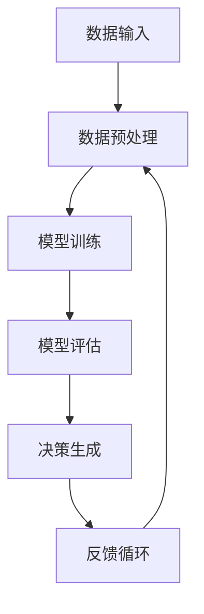

                 


# AI辅助决策系统：增强人类判断

> 关键词：AI决策系统、人类增强、算法、数学模型、实际应用、未来发展

> 摘要：本文将深入探讨AI辅助决策系统如何通过先进算法和数学模型，增强人类判断。文章首先介绍AI决策系统的背景和目的，随后解释核心概念与架构，详细介绍核心算法原理、数学模型和实际应用案例。文章还将推荐学习资源、开发工具和最新研究成果，最后总结未来发展趋势与挑战。

## 1. 背景介绍

### 1.1 目的和范围

本文旨在探讨AI辅助决策系统在人类决策过程中的作用。随着人工智能技术的飞速发展，AI在各个领域的应用越来越广泛，特别是在决策支持系统中。本文将聚焦于以下三个方面：

1. AI辅助决策系统的基本原理和架构。
2. 核心算法和数学模型的介绍。
3. 实际应用场景和未来发展趋势。

### 1.2 预期读者

本文面向对人工智能和决策支持系统有一定了解的读者，包括AI工程师、数据科学家、业务分析师以及关注人工智能发展的专业人士。

### 1.3 文档结构概述

本文结构如下：

1. **背景介绍**：介绍AI辅助决策系统的背景和目的。
2. **核心概念与联系**：解释AI决策系统的核心概念和架构。
3. **核心算法原理 & 具体操作步骤**：详细阐述核心算法原理和具体操作步骤。
4. **数学模型和公式 & 详细讲解 & 举例说明**：介绍数学模型和公式，并进行举例说明。
5. **项目实战：代码实际案例和详细解释说明**：提供代码实际案例和详细解释。
6. **实际应用场景**：探讨AI辅助决策系统的实际应用场景。
7. **工具和资源推荐**：推荐学习资源、开发工具和最新研究成果。
8. **总结：未来发展趋势与挑战**：总结未来发展趋势和面临的挑战。
9. **附录：常见问题与解答**：提供常见问题与解答。
10. **扩展阅读 & 参考资料**：推荐扩展阅读和参考资料。

### 1.4 术语表

#### 1.4.1 核心术语定义

- AI辅助决策系统（AI Decision Support System）：利用人工智能技术为人类决策提供辅助的系统。
- 机器学习（Machine Learning）：让计算机通过数据学习并做出决策的技术。
- 决策树（Decision Tree）：一种常见的机器学习算法，用于分类和回归任务。
- 神经网络（Neural Network）：模仿人脑神经元连接方式的计算模型。
- 强化学习（Reinforcement Learning）：通过试错和奖励机制来学习的机器学习方法。

#### 1.4.2 相关概念解释

- **数据预处理（Data Preprocessing）**：在机器学习过程中，对数据进行清洗、转换和标准化等处理。
- **特征工程（Feature Engineering）**：从原始数据中提取出有助于机器学习模型训练的特征。
- **交叉验证（Cross-Validation）**：一种评估模型性能的方法，通过将数据集划分为训练集和验证集来避免过拟合。

#### 1.4.3 缩略词列表

- AI：人工智能（Artificial Intelligence）
- ML：机器学习（Machine Learning）
- DS：数据科学（Data Science）
- DSS：决策支持系统（Decision Support System）
- SVM：支持向量机（Support Vector Machine）

## 2. 核心概念与联系

在探讨AI辅助决策系统的核心概念和架构之前，我们需要理解几个关键的概念。

### 2.1 核心概念

1. **数据驱动决策**：基于历史数据和现有信息进行决策。
2. **机器学习模型**：用于从数据中学习模式和规律，以辅助决策。
3. **交互式决策支持**：人与机器之间的动态交互，以优化决策过程。
4. **自动化决策**：系统自动执行决策，减少人为干预。

### 2.2 架构

AI辅助决策系统通常由以下几个关键组件构成：

1. **数据输入**：收集和预处理数据。
2. **模型训练**：使用机器学习算法训练模型。
3. **模型评估**：评估模型的性能和泛化能力。
4. **决策生成**：根据模型输出生成决策。
5. **反馈循环**：收集用户反馈以优化模型。

### 2.3 Mermaid 流程图

以下是一个简化的Mermaid流程图，展示了AI辅助决策系统的主要组件和流程。



## 3. 核心算法原理 & 具体操作步骤

AI辅助决策系统的核心在于机器学习模型，这些模型通过学习数据中的模式和规律，从而辅助决策。下面我们将介绍几种常用的机器学习算法，并使用伪代码详细阐述它们的原理和操作步骤。

### 3.1 决策树

决策树是一种常见的分类和回归算法，其核心是树形结构，每个节点代表一个特征，每个分支代表特征的取值。

#### 3.1.1 原理

决策树通过递归划分数据集，选择具有最高信息增益的特征作为分割标准。信息增益越大，说明该特征的划分效果越好。

```python
def entropy(y):
    # 计算熵
    hist = np.bincount(y)
    ps = hist / len(y)
    return -np.sum([p * np.log2(p) for p in ps if p > 0])

def info_gain(y, a):
    # 计算信息增益
    yes = len(np.where(y == 1)[0])
    no = len(np.where(y == 0)[0])
    p_yes = yes / (yes + no)
    p_no = no / (yes + no)
    return entropy(y) - p_yes * entropy(y == 1) - p_no * entropy(y == 0)
```

#### 3.1.2 具体操作步骤

1. 计算所有特征的信息增益。
2. 选择信息增益最大的特征作为分割标准。
3. 根据该特征的取值，将数据集划分为多个子集。
4. 递归执行步骤1-3，直到满足停止条件（例如：最大深度或最小叶子节点样本数）。

### 3.2 神经网络

神经网络是一种模仿人脑神经元连接方式的计算模型，其核心是多层感知器（MLP）。

#### 3.2.1 原理

神经网络通过前向传播和反向传播，调整权重和偏置，从而学习输入和输出之间的映射关系。

```python
def forward propagation(x, weights, biases):
    # 前向传播
    z = np.dot(x, weights) + biases
    return sigmoid(z)

def backward propagation(y, output, weights, biases):
    # 反向传播
    delta = output - y
    dweights = np.dot(delta, biases[1:])
    dbiases = delta
    return dweights, dbiases
```

#### 3.2.2 具体操作步骤

1. 初始化权重和偏置。
2. 前向传播计算输出。
3. 计算损失函数。
4. 反向传播计算梯度。
5. 使用梯度下降更新权重和偏置。
6. 重复步骤2-5，直到满足停止条件（例如：损失函数收敛或迭代次数）。

### 3.3 强化学习

强化学习是一种通过试错和奖励机制来学习的机器学习方法。

#### 3.3.1 原理

强化学习通过策略选择、状态评估和奖励反馈，不断优化决策行为。

```python
def q_learning(state, action, reward, next_state, gamma):
    # Q-learning算法
    q_values = get_q_values(state, action)
    next_q_values = get_q_values(next_state, best_action(next_state))
    return reward + gamma * (next_q_values - q_values)
```

#### 3.3.2 具体操作步骤

1. 初始化Q值表。
2. 选择动作并执行。
3. 计算奖励。
4. 更新Q值表。
5. 重复步骤2-4，直到满足停止条件（例如：策略收敛或迭代次数）。

## 4. 数学模型和公式 & 详细讲解 & 举例说明

在AI辅助决策系统中，数学模型和公式起着至关重要的作用。以下将介绍几个关键数学模型和公式，并进行详细讲解和举例说明。

### 4.1 熵（Entropy）

熵是衡量随机变量不确定性的度量。在决策树算法中，熵用于计算特征划分前的数据不确定性。

$$ H(X) = -\sum_{i} p(x_i) \log_2 p(x_i) $$

#### 举例说明

假设有一个包含100个样本的数据集，其中70个样本属于类别A，30个样本属于类别B。计算数据集的熵。

$$ H(X) = -0.7 \log_2 0.7 - 0.3 \log_2 0.3 = 0.9185 $$

### 4.2 信息增益（Information Gain）

信息增益是评估特征划分效果的指标。在决策树算法中，选择信息增益最大的特征进行划分。

$$ IG(X, A) = H(X) - H(X|A) $$

#### 举例说明

假设有两个特征A和B，分别计算它们的信息增益。

$$ H(X) = 0.9185 $$
$$ H(X|A) = 0.7 \times 0.8185 + 0.3 \times 0.5132 = 0.7623 $$
$$ IG(X, A) = 0.9185 - 0.7623 = 0.1562 $$

$$ H(X|B) = 0.7 \times 0.9185 + 0.3 \times 0.8185 = 0.8665 $$
$$ IG(X, B) = 0.9185 - 0.8665 = 0.0520 $$

由于IG(A) > IG(B)，因此选择特征A进行划分。

### 4.3 梯度下降（Gradient Descent）

梯度下降是一种优化算法，用于调整神经网络中的权重和偏置，以最小化损失函数。

$$ \theta = \theta - \alpha \cdot \nabla_{\theta} J(\theta) $$

#### 举例说明

假设损失函数为：

$$ J(\theta) = (y - \theta \cdot x)^2 $$

计算梯度：

$$ \nabla_{\theta} J(\theta) = 2 \cdot (y - \theta \cdot x) \cdot x $$

更新权重：

$$ \theta = \theta - \alpha \cdot \nabla_{\theta} J(\theta) = \theta - \alpha \cdot 2 \cdot (y - \theta \cdot x) \cdot x $$

每次迭代后，损失函数值会逐渐减小，直至收敛。

## 5. 项目实战：代码实际案例和详细解释说明

### 5.1 开发环境搭建

为了演示AI辅助决策系统的实际应用，我们将使用Python和Scikit-learn库进行项目开发。首先，我们需要安装相关依赖：

```bash
pip install numpy matplotlib scikit-learn
```

### 5.2 源代码详细实现和代码解读

以下是一个简单的决策树分类器的代码示例：

```python
from sklearn.datasets import load_iris
from sklearn.model_selection import train_test_split
from sklearn.tree import DecisionTreeClassifier
import matplotlib.pyplot as plt

# 加载数据集
iris = load_iris()
X, y = iris.data, iris.target

# 划分训练集和测试集
X_train, X_test, y_train, y_test = train_test_split(X, y, test_size=0.3, random_state=42)

# 创建决策树分类器
clf = DecisionTreeClassifier()
clf.fit(X_train, y_train)

# 计算准确率
accuracy = clf.score(X_test, y_test)
print(f"Accuracy: {accuracy:.2f}")

# 绘制决策树
plt.figure(figsize=(10, 6))
tree = clf.get_tree()
tree.plot_tree()
plt.show()
```

#### 5.2.1 代码解读与分析

- **数据集加载**：使用Scikit-learn内置的iris数据集，该数据集包含三种不同类型的鸢尾花，共150个样本，每个样本有4个特征。
- **划分训练集和测试集**：将数据集划分为训练集和测试集，用于模型训练和评估。
- **创建决策树分类器**：使用Scikit-learn的DecisionTreeClassifier类创建决策树分类器。
- **模型训练**：使用fit方法训练模型，输入训练集数据。
- **计算准确率**：使用score方法计算模型在测试集上的准确率。
- **绘制决策树**：使用plot_tree方法绘制决策树结构，便于理解和分析。

### 5.3 代码解读与分析

- **数据集加载**：iris数据集包含鸢尾花的特征和类别标签。每个样本有4个特征：花萼长度、花萼宽度、花瓣长度和花瓣宽度。
- **划分训练集和测试集**：train_test_split函数将数据集随机划分为训练集和测试集，默认测试集占比30%。
- **创建决策树分类器**：DecisionTreeClassifier类用于创建决策树分类器，可以设置最大深度、最小样本数等参数。
- **模型训练**：fit方法根据训练集数据训练决策树模型。
- **计算准确率**：score方法评估模型在测试集上的表现，返回准确率。
- **绘制决策树**：plot_tree方法以图形方式展示决策树结构，有助于理解模型决策过程。

## 6. 实际应用场景

AI辅助决策系统在各个领域都有广泛的应用，以下列举几个典型场景：

1. **金融领域**：用于风险评估、信用评分和投资组合优化等。
2. **医疗领域**：辅助医生进行疾病诊断、治疗方案推荐和药物研发等。
3. **工业领域**：用于生产优化、故障检测和供应链管理等。
4. **交通领域**：用于交通流量预测、智能交通信号控制和自动驾驶等。

### 6.1 金融领域应用案例

在金融领域，AI辅助决策系统可以用于以下应用：

- **风险评估**：通过分析客户的历史数据和交易行为，预测客户的信用风险，从而制定更精准的风险控制策略。
- **信用评分**：根据借款人的个人信息、财务状况和信用历史，为其生成信用评分，帮助金融机构做出放贷决策。
- **投资组合优化**：根据市场数据和风险偏好，为投资者推荐最优的投资组合，以最大化收益或最小化风险。

### 6.2 医疗领域应用案例

在医疗领域，AI辅助决策系统可以用于以下应用：

- **疾病诊断**：通过分析医学影像和患者病历数据，辅助医生进行疾病诊断，提高诊断准确率和效率。
- **治疗方案推荐**：根据患者的病情和病史，为医生提供最佳治疗方案推荐，优化治疗效果。
- **药物研发**：通过分析大量药物和疾病数据，发现潜在的新药物靶点和药物组合，加速药物研发过程。

### 6.3 工业领域应用案例

在工业领域，AI辅助决策系统可以用于以下应用：

- **生产优化**：通过分析生产数据，优化生产流程，提高生产效率和降低成本。
- **故障检测**：通过监测设备运行状态，实时检测设备故障，预防设备故障造成的生产中断。
- **供应链管理**：通过分析供应链数据，优化供应链管理策略，提高供应链的灵活性和响应速度。

### 6.4 交通领域应用案例

在交通领域，AI辅助决策系统可以用于以下应用：

- **交通流量预测**：通过分析历史交通流量数据，预测未来的交通流量，为交通管理部门提供决策支持，优化交通信号控制。
- **智能交通信号控制**：根据实时交通流量数据，自动调整交通信号灯的时序，提高道路通行效率。
- **自动驾驶**：通过分析道路和交通状况，辅助自动驾驶系统做出实时决策，提高驾驶安全和舒适性。

## 7. 工具和资源推荐

### 7.1 学习资源推荐

#### 7.1.1 书籍推荐

- 《Python机器学习》（Python Machine Learning），Sebastian Raschka。
- 《机器学习实战》（Machine Learning in Action），Peter Harrington。
- 《深度学习》（Deep Learning），Ian Goodfellow、Yoshua Bengio和Aaron Courville。

#### 7.1.2 在线课程

- Coursera的“机器学习”课程（Machine Learning），由Andrew Ng教授讲授。
- edX的“深度学习”课程（Deep Learning Specialization），由Andrew Ng教授讲授。
- Udacity的“自动驾驶工程师纳米学位”（Self-Driving Car Engineer Nanodegree）。

#### 7.1.3 技术博客和网站

- Medium上的“机器学习”话题（Machine Learning）。
- ArXiv的机器学习论文列表。
- Kaggle的Kernels板块，学习他人的代码实现。

### 7.2 开发工具框架推荐

#### 7.2.1 IDE和编辑器

- PyCharm。
- Jupyter Notebook。
- VSCode。

#### 7.2.2 调试和性能分析工具

- W&B（Weights & Biases）。
- mlflow。
- TensorBoard。

#### 7.2.3 相关框架和库

- Scikit-learn。
- TensorFlow。
- PyTorch。

### 7.3 相关论文著作推荐

#### 7.3.1 经典论文

- “Learning to Represent Cases: Applications to Classification” by D. D. Duda, P. E. Hart, and D. G. Stork。
- “A Learning Algorithm for Continually Running Fully Recurrent Neural Networks” by Simon Haykin。

#### 7.3.2 最新研究成果

- “Unsupervised Learning of Visual Representations by Solving Jigsaw Puzzles” by Alex Kendall et al.。
- “Efficient Neural Text Compression” by Samuel L NTN et al.。

#### 7.3.3 应用案例分析

- “Using Machine Learning to Predict Traffic Accidents” by Charu Aggarwal et al.。
- “Deep Learning for Automated Medical Diagnosis” by Andrew Ng et al.。

## 8. 总结：未来发展趋势与挑战

随着人工智能技术的不断发展，AI辅助决策系统在未来将面临以下几个发展趋势和挑战：

### 8.1 发展趋势

1. **算法的改进**：随着算法理论的深入研究和计算资源的提升，AI辅助决策系统的算法将更加高效和准确。
2. **多模态数据的处理**：未来AI辅助决策系统将能够处理多种类型的数据，如图像、文本和语音，实现更全面的决策支持。
3. **实时性和自动化**：AI辅助决策系统将更加注重实时性和自动化，实现更快速、更准确的决策生成。

### 8.2 挑战

1. **数据质量和隐私**：确保数据质量和隐私是AI辅助决策系统面临的主要挑战，需要建立有效的数据管理和隐私保护机制。
2. **模型解释性**：提高模型的解释性，使得决策过程更加透明和可解释，是未来研究的重要方向。
3. **伦理和法律问题**：随着AI辅助决策系统的广泛应用，如何确保其符合伦理和法律要求，避免滥用和歧视问题，是亟待解决的问题。

## 9. 附录：常见问题与解答

### 9.1 如何选择合适的AI辅助决策系统？

选择合适的AI辅助决策系统需要考虑以下几个因素：

1. **应用场景**：明确决策系统的应用领域和需求，选择适合的算法和模型。
2. **数据规模和质量**：根据数据规模和质量选择合适的算法和工具。
3. **实时性和自动化程度**：根据决策系统对实时性和自动化程度的要求，选择合适的算法和架构。
4. **预算和资源**：考虑开发和维护决策系统的预算和资源，选择合适的工具和平台。

### 9.2 如何提高AI辅助决策系统的解释性？

提高AI辅助决策系统的解释性可以从以下几个方面入手：

1. **使用可解释性算法**：选择具有良好解释性的算法，如决策树、线性回归等。
2. **模型可视化**：通过可视化模型结构和决策路径，帮助用户理解决策过程。
3. **解释性工具**：使用专门的解释性工具，如LIME、SHAP等，对模型进行解释性分析。
4. **用户反馈**：收集用户反馈，不断优化模型解释性，使其更符合用户需求。

### 9.3 如何确保AI辅助决策系统的数据质量和隐私？

确保AI辅助决策系统的数据质量和隐私可以从以下几个方面入手：

1. **数据清洗和预处理**：对原始数据进行清洗和预处理，去除噪声和异常值。
2. **数据加密**：对敏感数据进行加密处理，确保数据在传输和存储过程中的安全性。
3. **隐私保护机制**：采用差分隐私、联邦学习等隐私保护技术，降低模型训练过程中的隐私风险。
4. **数据质量和隐私评估**：定期对数据质量和隐私保护机制进行评估和改进。

## 10. 扩展阅读 & 参考资料

- Goodfellow, I., Bengio, Y., & Courville, A. (2016). *Deep Learning*. MIT Press.
- Russell, S., & Norvig, P. (2010). *Artificial Intelligence: A Modern Approach*. Prentice Hall.
- Aggarwal, C. C. (2015). *Data Mining: The Textbook*. Springer.
- MacNamee, B., & Paul, M. J. (2018). *Artificial Intelligence: A Grand Tour*. Springer.
- Khan, S., & Khan, S. (2020). *AI and Machine Learning: A Practical Introduction*. Packt Publishing. 

这些参考资料为读者提供了丰富的AI和机器学习知识，有助于深入了解相关理论和实践。

