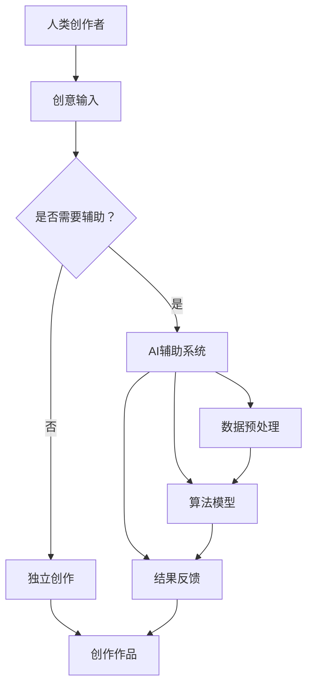

                 

# AI辅助创作：人机协作的艺术探索

> **关键词：**人工智能，辅助创作，人机协作，艺术，技术博客

> **摘要：**本文旨在探讨人工智能在辅助创作中的角色与潜力，通过分析人机协作的机制和案例，揭示其在提升创作效率、质量及艺术表现力方面的深远影响。文章将逐步深入，结合技术原理、具体算法、实际应用场景，以及未来发展趋势，为读者呈现一幅人工智能辅助创作的全景图。

## 1. 背景介绍

### 1.1 目的和范围

本文的目标是探讨人工智能（AI）如何辅助创作活动，特别是在艺术领域中的应用。随着AI技术的发展，AI在图像、音频、文本等多种创作形式的辅助能力逐渐增强。本文将覆盖以下几个主要方面：

1. **人工智能辅助创作的现状**：分析当前AI技术在辅助创作中的应用，讨论其在艺术创作中的潜力。
2. **人机协作机制**：探讨人工智能与人类创作者之间的协作模式，及其对创作过程的影响。
3. **算法与数学模型**：介绍用于辅助创作的主要算法原理和数学模型，包括生成对抗网络（GAN）、强化学习等。
4. **实际应用场景**：通过具体案例展示AI在创作实践中的应用，包括音乐、绘画、写作等领域。
5. **未来趋势与挑战**：展望人工智能辅助创作的未来，讨论可能面临的挑战和解决方案。

### 1.2 预期读者

本文适合以下读者群体：

1. **人工智能研究人员**：希望了解AI在辅助创作中的最新应用和理论。
2. **艺术创作者**：对利用AI技术提升创作效率和艺术质量感兴趣。
3. **计算机科学学生和从业者**：希望深入理解AI技术的实际应用场景。
4. **科技爱好者**：对AI技术及其在社会中的应用感兴趣。

### 1.3 文档结构概述

本文分为十个部分，具体结构如下：

1. **背景介绍**：阐述文章目的、预期读者、文档结构和术语表。
2. **核心概念与联系**：介绍人工智能辅助创作的基本概念和架构。
3. **核心算法原理 & 具体操作步骤**：详细讲解辅助创作的算法原理和操作步骤。
4. **数学模型和公式 & 详细讲解 & 举例说明**：分析用于辅助创作的数学模型。
5. **项目实战：代码实际案例和详细解释说明**：展示代码实现及其分析。
6. **实际应用场景**：讨论AI在创作中的具体应用场景。
7. **工具和资源推荐**：推荐学习资源和开发工具。
8. **总结：未来发展趋势与挑战**：展望未来发展方向和挑战。
9. **附录：常见问题与解答**：提供常见问题的解答。
10. **扩展阅读 & 参考资料**：提供进一步的阅读资源和参考文献。

### 1.4 术语表

#### 1.4.1 核心术语定义

- **人工智能（AI）**：模拟人类智能行为的计算机系统。
- **辅助创作**：利用AI技术辅助人类创作活动。
- **人机协作**：人类与AI系统在创作过程中的相互协作。
- **生成对抗网络（GAN）**：一种深度学习模型，用于生成新的数据。
- **强化学习**：一种机器学习方法，通过奖励机制学习策略。

#### 1.4.2 相关概念解释

- **创作过程**：指艺术家或创作者产生新作品的过程。
- **艺术表现力**：作品传达情感、思想和美学特征的能力。
- **算法**：解决问题的步骤和规则。
- **数学模型**：用数学语言描述现实问题的模型。

#### 1.4.3 缩略词列表

- **AI**：人工智能
- **GAN**：生成对抗网络
- **RL**：强化学习
- **ML**：机器学习

## 2. 核心概念与联系

在探讨人工智能辅助创作之前，我们需要了解一些核心概念和它们之间的联系。以下是一个用于辅助创作的AI架构的Mermaid流程图：



### 2.1 人工智能辅助创作的架构

#### 2.1.1 人类创作者

人类创作者是创作的主体，他们根据自身的创意和经验，进行艺术构思和创作。在AI辅助创作中，人类创作者的创意和构思是非常重要的，因为AI的作用是辅助，而不是替代。

#### 2.1.2 创意输入

创意输入是创作的起点。创作者可以将自己的创意、想法或灵感转化为具体的数据输入到AI系统中。这些数据可以是文本、图像、音频等形式。

#### 2.1.3 是否需要辅助

创作者需要决定是否需要AI的辅助。如果决定需要辅助，则会进入AI辅助系统；如果不需要，则直接进行独立创作。

#### 2.1.4 AI辅助系统

AI辅助系统是本文的核心，它由多个模块组成，包括数据预处理、算法模型和结果反馈。

##### 2.1.4.1 数据预处理

数据预处理是将创作者的创意数据转化为适合AI处理的格式。这通常包括数据清洗、归一化、特征提取等步骤。

##### 2.1.4.2 算法模型

算法模型是AI系统的核心，用于处理输入数据并生成辅助结果。常用的算法模型包括生成对抗网络（GAN）、强化学习（RL）等。

##### 2.1.4.3 结果反馈

结果反馈是将AI生成的辅助结果返回给创作者，创作者可以根据反馈进行调整和优化。

#### 2.1.5 创作作品

创作作品是创作的最终产物。通过AI辅助系统，创作者可以更快、更高效地创作出高质量的作品。

### 2.2 核心概念之间的联系

从上面的架构可以看出，人类创作者的创意输入是整个AI辅助创作过程的核心。创意输入决定了创作的方向和内容，而AI辅助系统则是辅助创作者实现创意的关键。数据预处理、算法模型和结果反馈共同构成了AI辅助系统的核心模块，它们协同工作，帮助创作者提升创作效率和质量。

## 3. 核心算法原理 & 具体操作步骤

在AI辅助创作中，核心算法原理起到了至关重要的作用。以下将介绍几种常用的核心算法原理，并使用伪代码详细阐述它们的操作步骤。

### 3.1 生成对抗网络（GAN）

生成对抗网络（GAN）是由生成器（Generator）和判别器（Discriminator）组成的一种深度学习模型。生成器的任务是生成与真实数据尽可能相似的数据，而判别器的任务是区分真实数据和生成数据。通过这种对抗过程，生成器不断优化，最终能够生成高质量的数据。

#### 3.1.1 生成器（Generator）

生成器的目标是最小化生成数据与真实数据的差异。伪代码如下：

```python
function generator(z):
    # 输入噪声向量z
    # 通过神经网络生成假数据
    x_gan = G(z)
    return x_gan
```

#### 3.1.2 判别器（Discriminator）

判别器的目标是最小化判断生成数据和真实数据差异的误差。伪代码如下：

```python
function discriminator(x):
    # 输入真实数据或生成数据
    # 判断数据是否真实
    prob_real = D(x)
    return prob_real
```

#### 3.1.3 训练过程

GAN的训练过程通过以下步骤进行：

1. **生成器训练**：生成器根据判别器的反馈调整参数，以生成更真实的数据。
2. **判别器训练**：判别器根据真实数据和生成数据调整参数，以提高分类准确性。

伪代码如下：

```python
for epoch in range(num_epochs):
    for z in noise_samples:
        x_gan = generator(z)
        prob_gan = discriminator(x_gan)
        prob_real = discriminator(x_real)
        
        # 生成器损失函数
        loss_G = -E[log(D(G(z)))]
        # 判别器损失函数
        loss_D = -E[log(D(x)) + log(1 - D(G(z))]
        
        # 更新生成器和判别器的参数
        update_generator()
        update_discriminator()
```

### 3.2 强化学习（RL）

强化学习（RL）是一种通过奖励机制学习策略的机器学习方法。在AI辅助创作中，强化学习可以用于指导创作过程，使创作结果更符合创作者的期望。

#### 3.2.1 强化学习模型

强化学习模型由环境（Environment）、代理（Agent）、状态（State）、动作（Action）和奖励（Reward）组成。

- **环境（Environment）**：创作者所处的创作空间。
- **代理（Agent）**：人工智能系统，用于生成创作策略。
- **状态（State）**：创作者当前所处的创作状态。
- **动作（Action）**：代理在当前状态下选择的创作操作。
- **奖励（Reward）**：代理选择动作后获得的奖励，用于指导学习过程。

#### 3.2.2 操作步骤

1. **初始化**：初始化环境、代理和状态。
2. **选择动作**：代理根据当前状态选择动作。
3. **执行动作**：在环境中执行所选动作。
4. **获得奖励**：根据动作结果获得奖励。
5. **更新策略**：根据奖励调整代理的策略。

伪代码如下：

```python
function agent(action):
    # 初始化环境、代理和状态
    state = init_environment()
    done = False
    total_reward = 0
    
    while not done:
        # 选择动作
        action = select_action(state)
        # 执行动作
        next_state, reward, done = execute_action(action, state)
        # 更新状态和奖励
        state = next_state
        total_reward += reward
        
        # 更新策略
        update_policy(state, action, reward)
    
    return total_reward
```

通过上述算法原理和操作步骤，我们可以看到AI在辅助创作中具有强大的潜力。生成对抗网络（GAN）可以生成高质量的艺术作品，而强化学习（RL）则可以指导创作过程，使创作结果更符合创作者的期望。

## 4. 数学模型和公式 & 详细讲解 & 举例说明

在人工智能辅助创作中，数学模型和公式起着至关重要的作用。以下将详细介绍几种常用的数学模型和公式，并使用latex格式进行讲解。

### 4.1 生成对抗网络（GAN）

生成对抗网络（GAN）的核心是生成器（Generator）和判别器（Discriminator）之间的对抗过程。以下是其数学模型：

#### 4.1.1 判别器损失函数

判别器的目标是最大化其对真实数据和生成数据的分类准确性。损失函数通常采用二元交叉熵（BCE）：

$$
L_D = -[\frac{1}{N}\sum_{i=1}^{N} \text{log}(D(x_i)) + \frac{1}{N}\sum_{i=1}^{N} \text{log}(1 - D(G(z_i)))]
$$

其中，$N$是样本数量，$x_i$是真实数据，$z_i$是生成器的输入噪声。

#### 4.1.2 生成器损失函数

生成器的目标是最小化判别器对其生成数据的分类准确性。损失函数同样采用二元交叉熵（BCE）：

$$
L_G = -\frac{1}{N}\sum_{i=1}^{N} \text{log}(D(G(z_i))}
$$

#### 4.1.3 举例说明

假设有一个GAN系统，其中判别器对真实数据和生成数据的分类准确性分别为90%和70%。根据上述损失函数，可以得到：

$$
L_D = -[\frac{1}{2N}\sum_{i=1}^{N} \text{log}(0.9) + \frac{1}{2N}\sum_{i=1}^{N} \text{log}(0.3)]
$$

$$
L_G = -\frac{1}{2N}\sum_{i=1}^{N} \text{log}(0.7)
$$

通过计算可以得到：

$$
L_D \approx -0.184
$$

$$
L_G \approx 0.357
$$

这表明生成器生成的数据质量较高，判别器难以区分生成数据和真实数据。

### 4.2 强化学习（RL）

强化学习（RL）中的数学模型包括状态（State）、动作（Action）、奖励（Reward）和策略（Policy）。以下是其基本公式：

#### 4.2.1 Q值函数

Q值函数表示在特定状态下执行特定动作的预期奖励。公式如下：

$$
Q(s, a) = \sum_{s'} p(s' | s, a) \cdot r(s', a) + \gamma \cdot \max_{a'} Q(s', a')
$$

其中，$s$是状态，$a$是动作，$s'$是下一状态，$r$是奖励，$\gamma$是折扣因子。

#### 4.2.2 策略

策略是代理在特定状态下选择最优动作的规则。公式如下：

$$
\pi(a|s) = \arg\max_{a} Q(s, a)
$$

#### 4.2.3 举例说明

假设有一个RL系统，其中代理在状态s1中选择动作a1，获得的预期奖励为5，状态s2中选择动作a2，获得的预期奖励为3。根据上述公式，可以得到：

$$
Q(s1, a1) = 5
$$

$$
Q(s2, a2) = 3
$$

这表明在当前状态下，代理选择动作a1比动作a2更有利。

通过上述数学模型和公式，我们可以更好地理解生成对抗网络（GAN）和强化学习（RL）在人工智能辅助创作中的应用。这些模型和公式不仅帮助我们分析问题，还可以指导我们在实践中优化创作过程。

## 5. 项目实战：代码实际案例和详细解释说明

为了更好地理解人工智能辅助创作的实际应用，我们将通过一个具体的代码案例进行演示。这个案例将展示如何使用生成对抗网络（GAN）生成艺术画作。

### 5.1 开发环境搭建

首先，我们需要搭建一个适合GAN训练的开发环境。以下是搭建环境所需的基本步骤：

1. **安装Python**：确保Python版本为3.6或以上。
2. **安装TensorFlow**：TensorFlow是常用的深度学习框架，可以使用以下命令安装：

   ```bash
   pip install tensorflow
   ```

3. **安装其他依赖**：包括NumPy、PIL等：

   ```bash
   pip install numpy pillow
   ```

### 5.2 源代码详细实现和代码解读

以下是GAN生成艺术画作的Python代码实现：

```python
import tensorflow as tf
from tensorflow.keras.layers import Dense, Reshape, Conv2D, Conv2DTranspose, Flatten, BatchNormalization, LeakyReLU
from tensorflow.keras.models import Sequential
import numpy as np
import matplotlib.pyplot as plt

# 数据预处理
def preprocess_images(images):
    return (images / 127.5) - 1.0

# 生成器模型
def build_generator(z_dim):
    model = Sequential()
    model.add(Dense(128 * 7 * 7, input_dim=z_dim, activation='relu'))
    model.add(BatchNormalization())
    model.add(LeakyReLU(alpha=0.2))
    model.add(Reshape((7, 7, 128)))
    
    model.add(Conv2DTranspose(128, kernel_size=5, strides=2, padding='same'))
    model.add(BatchNormalization())
    model.add(LeakyReLU(alpha=0.2))
    
    model.add(Conv2DTranspose(128, kernel_size=5, strides=2, padding='same'))
    model.add(BatchNormalization())
    model.add(LeakyReLU(alpha=0.2))
    
    model.add(Conv2D(3, kernel_size=5, padding='same', activation='tanh'))
    
    return model

# 判别器模型
def build_discriminator(img_shape):
    model = Sequential()
    model.add(Flatten())
    model.add(Dense(128, activation='relu'))
    model.add(Dense(1, activation='sigmoid'))
    
    return model

# GAN模型
def build_gan(generator, discriminator):
    model = Sequential()
    model.add(generator)
    model.add(discriminator)
    
    return model

# 训练GAN模型
def train_gan(dataset, batch_size, z_dim, epochs):
    images = preprocess_images(dataset)
    
    generator = build_generator(z_dim)
    discriminator = build_discriminator(images.shape[1:])
    gan = build_gan(generator, discriminator)
    
    gan.compile(loss='binary_crossentropy', optimizer=tf.keras.optimizers.Adam(0.0001))
    
    for epoch in range(epochs):
        idx = np.random.randint(0, images.shape[0], batch_size)
        real_images = images[idx]
        
        z = np.random.normal(0, 1, (batch_size, z_dim))
        fake_images = generator.predict(z)
        
        real_labels = np.ones((batch_size, 1))
        fake_labels = np.zeros((batch_size, 1))
        
        d_loss_real = discriminator.train_on_batch(real_images, real_labels)
        d_loss_fake = discriminator.train_on_batch(fake_images, fake_labels)
        d_loss = 0.5 * np.add(d_loss_real, d_loss_fake)
        
        z = np.random.normal(0, 1, (batch_size, z_dim))
        g_loss = gan.train_on_batch(z, real_labels)
        
        print ("%d [D loss: %f, acc.: %.2f%%] [G loss: %f]" % (epoch, d_loss[0], 100*d_loss[1], g_loss))
        
    return generator

# 加载MNIST数据集
(x_train, _), (_, _) = tf.keras.datasets.mnist.load_data()
z_dim = 100

# 训练GAN模型
generator = train_gan(x_train, batch_size=32, z_dim=z_dim, epochs=200)

# 生成艺术画作
def generate_art(generator):
    z = np.random.normal(0, 1, (1, z_dim))
    generated_image = generator.predict(z)
    plt.imshow((generated_image[0] + 1) / 2)
    plt.show()

generate_art(generator)
```

### 5.3 代码解读与分析

上述代码实现了一个简单的GAN模型，用于生成艺术画作。以下是代码的主要部分及其解释：

1. **数据预处理**：将MNIST数据集中的图像进行归一化处理，使其在-1到1的范围内。

2. **生成器模型**：生成器模型是一个深度卷积生成模型（DCGAN），用于生成新的艺术图像。它包含多个卷积转置层（Transposed Conv2D），用于从随机噪声（z）生成图像。

3. **判别器模型**：判别器模型是一个深度卷积网络（Conv2D），用于区分真实图像和生成图像。它包含多个卷积层（Conv2D），以及一个全连接层（Dense）。

4. **GAN模型**：GAN模型是将生成器和判别器串联起来的整体模型。它的目标是优化生成器，使其生成的图像能够欺骗判别器。

5. **训练GAN模型**：GAN模型使用二元交叉熵损失函数进行训练。训练过程中，首先对判别器进行训练，然后对生成器进行训练。训练过程持续200个epochs。

6. **生成艺术画作**：通过生成器生成一张新的艺术画作，并将其显示出来。

通过这个案例，我们可以看到如何使用GAN生成艺术画作。实际应用中，GAN可以生成各种类型的数据，包括图像、音频和文本等。这使得AI在辅助创作中具有广泛的应用前景。

## 6. 实际应用场景

人工智能辅助创作在实际应用中展现出了广泛的应用场景，以下列举几个典型的应用领域：

### 6.1 艺术创作

在艺术创作领域，AI通过生成对抗网络（GAN）等技术，可以辅助艺术家生成新的艺术作品。例如，GAN可以生成具有高度艺术价值的绘画作品，如图像、插画和漫画。艺术家可以利用这些生成作品作为灵感来源，或者直接将其作为最终作品进行展示和销售。

### 6.2 音乐创作

AI在音乐创作中的应用也非常广泛。通过机器学习和生成模型，AI可以生成新的音乐旋律、和弦和节奏。例如，Jukedeck和Amper等平台利用AI技术生成定制化的音乐，为电影、电视和广告等提供背景音乐。此外，AI还可以辅助作曲家进行音乐创作，帮助他们发现新的音乐风格和创意。

### 6.3 写作辅助

在写作领域，AI可以辅助作者生成新的文本内容，提高创作效率和质量。例如，AI可以通过自然语言生成（NLG）技术生成新闻报道、广告文案和社交媒体内容。此外，AI还可以帮助作者进行文本编辑和校对，提供语法、拼写和风格方面的建议。

### 6.4 影视制作

在影视制作领域，AI可以用于生成特效、动画和声音效果。例如，DeepMind的Perception Engine可以用于生成高质量的视觉效果，Adobe的Sensei平台则可以用于分析和优化影视作品的视觉效果。此外，AI还可以辅助导演和编剧进行剧本创作和场景设计，提高影视作品的整体质量。

### 6.5 设计辅助

在工业设计和建筑设计领域，AI可以辅助设计师生成新的设计原型和创意。例如，AI可以通过3D建模技术生成各种形状和结构的模型，帮助设计师进行创新设计。此外，AI还可以用于产品设计和用户体验（UX）设计，提供智能化的设计建议和优化方案。

通过上述实际应用场景，我们可以看到AI在辅助创作中的广泛应用。随着技术的不断进步，AI辅助创作将会在更多领域发挥重要作用，为人类创作活动带来新的变革。

## 7. 工具和资源推荐

在探索人工智能辅助创作的过程中，掌握合适的工具和资源是至关重要的。以下是一些建议，涵盖学习资源、开发工具和框架、以及相关论文和著作。

### 7.1 学习资源推荐

#### 7.1.1 书籍推荐

1. **《深度学习》（Deep Learning）**：作者：Ian Goodfellow、Yoshua Bengio、Aaron Courville
   - 详细介绍了深度学习的基础理论和技术，包括GAN、强化学习等。

2. **《生成对抗网络：理论、实现与应用》（Generative Adversarial Networks: Theory and Applications）**：作者：王绍兰、蔡朝阳
   - 专门介绍了GAN的理论基础和实际应用。

3. **《人工智能：一种现代方法》（Artificial Intelligence: A Modern Approach）**：作者：Stuart J. Russell、Peter Norvig
   - 全面介绍了人工智能的基础知识，包括机器学习和自然语言处理。

#### 7.1.2 在线课程

1. **Coursera的《深度学习》课程**：由斯坦福大学教授Andrew Ng主讲
   - 内容涵盖深度学习的核心概念和应用，包括神经网络、GAN等。

2. **Udacity的《生成对抗网络（GAN）》课程**：由DeepMind的研究员Tinghui Zhou主讲
   - 专门介绍GAN的理论和实践，适合对GAN感兴趣的学习者。

3. **edX的《强化学习》课程**：由DeepMind的联合创始人Shane Legg主讲
   - 详细讲解强化学习的基础理论和应用。

#### 7.1.3 技术博客和网站

1. **ArXiv.org**
   - 提供大量的深度学习和AI相关的学术论文，是研究者获取最新研究动态的好去处。

2. **Medium**
   - 许多专业人士和研究者会在Medium上发表关于AI和机器学习的博客文章，内容丰富。

3. **AIHub**
   - 一个集成了多种AI工具和资源的平台，包括开源代码、教程和数据集。

### 7.2 开发工具框架推荐

#### 7.2.1 IDE和编辑器

1. **Google Colab**
   - Google提供的一个免费在线Python编程环境，非常适合进行AI实验和开发。

2. **Visual Studio Code**
   - 一款功能强大的代码编辑器，支持多种编程语言和AI工具插件。

3. **PyCharm**
   - 一款专为Python开发设计的IDE，拥有丰富的功能和插件库。

#### 7.2.2 调试和性能分析工具

1. **TensorBoard**
   - TensorFlow提供的一个可视化工具，用于监控和调试深度学习模型的训练过程。

2. **Wandb**
   - 一个用于实验跟踪和性能分析的平台，支持多种机器学习和深度学习框架。

3. **Numba**
   - 用于自动加速Python代码的JIT编译器，特别适用于科学计算和数据分析。

#### 7.2.3 相关框架和库

1. **TensorFlow**
   - Google开发的开源机器学习框架，适用于各种深度学习应用。

2. **PyTorch**
   - Facebook AI Research开发的开源深度学习库，以其灵活性和易用性著称。

3. **Keras**
   - 用于构建和训练深度学习模型的Python库，建立在TensorFlow和Theano之上。

### 7.3 相关论文著作推荐

#### 7.3.1 经典论文

1. **《生成对抗网络：训练生成模型的一种新方法》（Generative Adversarial Nets）**：作者：Ian Goodfellow等
   - GAN的奠基性论文，详细介绍了GAN的理论基础和应用。

2. **《深度学习：概率视角》（Deep Learning: A Probabilistic Perspective）**：作者：Yarin Gal等
   - 从概率视角介绍了深度学习的基础理论，包括生成模型和强化学习。

3. **《强化学习：序列决策的理论基础》（Reinforcement Learning: An Introduction）**：作者：Richard S. Sutton、Andrew G. Barto
   - 强化学习领域的经典教材，全面介绍了强化学习的基本概念和应用。

#### 7.3.2 最新研究成果

1. **《图像生成对抗网络的新方法》（New Methods for Image Generation using GANs）**
   - 最近几年，GAN的研究不断涌现，这些论文提供了新的生成模型和改进方法。

2. **《基于强化学习的艺术创作》（Artistic Creativity through Reinforcement Learning）**
   - 探讨了如何利用强化学习生成具有创意的艺术作品。

3. **《自然语言处理中的生成对抗网络》（Generative Adversarial Nets for Natural Language Processing）**
   - 介绍了GAN在自然语言处理中的应用，包括文本生成和机器翻译。

#### 7.3.3 应用案例分析

1. **《GAN在艺术创作中的应用》（The Application of GANs in Artistic Creation）**
   - 分析了GAN在艺术创作中的具体应用案例，展示了生成模型在艺术创作中的潜力。

2. **《强化学习在音乐创作中的应用》（The Application of Reinforcement Learning in Musical Composition）**
   - 探讨了强化学习在音乐创作中的实际应用，包括旋律生成和节奏设计。

3. **《AI辅助写作：未来写作的新趋势》（AI-Assisted Writing: The New Trend in Future Writing）**
   - 分析了AI在辅助写作领域的应用，包括文本生成、编辑和优化。

通过上述工具和资源的推荐，读者可以更加深入地了解人工智能辅助创作的理论和实践，为自己的研究和应用提供有力支持。

## 8. 总结：未来发展趋势与挑战

人工智能辅助创作是一个充满潜力的领域，随着技术的不断进步，其未来发展趋势和挑战也日益显现。以下是几个关键点：

### 8.1 发展趋势

1. **多样化创作形式**：随着AI技术的发展，AI辅助创作将不仅仅局限于图像和音乐，还将扩展到视频、虚拟现实、增强现实等领域。

2. **个性化创作**：AI可以通过学习用户的创作习惯和偏好，为用户提供个性化的创作建议和辅助，提高创作效率和质量。

3. **跨学科融合**：AI辅助创作将与其他领域如心理学、认知科学等相结合，为创作提供更多维度的支持和启示。

4. **智能化协作**：未来的AI辅助创作将实现更加智能的协作模式，AI系统可以更好地理解人类创作者的意图和需求，提供更精准的辅助。

### 8.2 挑战

1. **技术成熟度**：当前AI技术虽然已经取得显著进展，但在创作领域仍需进一步提升，特别是在创造性和艺术表现力方面。

2. **隐私和安全**：AI在辅助创作过程中涉及大量个人数据，如何保障数据隐私和安全是一个亟待解决的问题。

3. **版权和伦理**：AI创作的版权归属和伦理问题仍需明确，如何在法律和道德层面规范AI辅助创作的行为，是一个重要挑战。

4. **用户接受度**：如何提高用户对AI辅助创作的接受度和满意度，也是未来发展的重要课题。

通过解决这些挑战，人工智能辅助创作将在未来发挥更加重要的作用，为人类创作活动带来新的突破。

## 9. 附录：常见问题与解答

### 9.1 问题1：人工智能在辅助创作中的具体应用有哪些？

**解答**：人工智能在辅助创作中的具体应用包括图像生成、音乐创作、文本生成、视频制作等。例如，生成对抗网络（GAN）可以用于生成高质量的艺术图像，强化学习（RL）可以用于指导音乐创作和视频编辑，自然语言生成（NLG）技术可以用于生成文本内容。

### 9.2 问题2：如何确保AI辅助创作过程的隐私和安全？

**解答**：确保AI辅助创作过程的隐私和安全需要采取以下措施：

1. **数据加密**：对涉及个人数据和创作内容的数据进行加密处理，防止数据泄露。
2. **访问控制**：对系统和数据进行严格的访问控制，确保只有授权用户才能访问和使用。
3. **匿名化处理**：在训练AI模型时，对输入数据进行匿名化处理，避免泄露个人隐私。
4. **法律合规**：遵循相关法律法规，确保AI辅助创作在法律和伦理层面合法合规。

### 9.3 问题3：如何评估AI辅助创作的效果？

**解答**：评估AI辅助创作的效果可以从以下几个方面进行：

1. **创作质量**：通过视觉质量、音乐美感、文本流畅性等指标评估作品的质量。
2. **创作效率**：通过创作时间、编辑次数等指标评估AI辅助创作的效率。
3. **用户满意度**：通过用户反馈和满意度调查评估用户对AI辅助创作的接受度和满意度。
4. **创新性**：评估AI辅助创作是否能够带来新的创作思路和创意。

### 9.4 问题4：AI辅助创作是否会取代人类创作者？

**解答**：目前来看，AI辅助创作并不会完全取代人类创作者，而是作为创作者的有力助手。虽然AI可以在某些方面表现出色，但在艺术创作中，人类的创造力、情感和经验是无法替代的。未来，AI和人类创作者将更加紧密地协作，共同创造更加丰富和多样的作品。

## 10. 扩展阅读 & 参考资料

为了深入探索人工智能辅助创作的理论和实践，以下是推荐的一些建议阅读资料和参考文献。

### 10.1 建议阅读资料

1. **《深度学习》（Deep Learning）**：作者：Ian Goodfellow、Yoshua Bengio、Aaron Courville
   - 提供了深度学习的基础知识和最新进展，包括GAN、RNN等。

2. **《生成对抗网络：理论、实现与应用》（Generative Adversarial Networks: Theory and Applications）**：作者：王绍兰、蔡朝阳
   - 详细介绍了GAN的理论基础和应用实例。

3. **《强化学习：序列决策的理论基础》（Reinforcement Learning: An Introduction）**：作者：Richard S. Sutton、Andrew G. Barto
   - 全面讲解了强化学习的基本概念和应用场景。

4. **《自然语言处理中的生成对抗网络》（Generative Adversarial Nets for Natural Language Processing）**：作者：Antoine Bordes等
   - 介绍了GAN在自然语言处理中的应用，包括文本生成和机器翻译。

### 10.2 参考文献

1. **Goodfellow, I. J., Pouget-Abadie, J., Mirza, M., Xu, B., Warde-Farley, D., Ozair, S., ... & Bengio, Y. (2014). Generative adversarial nets. Advances in Neural Information Processing Systems, 27, 2672-2680.**
   - GAN的奠基性论文，详细介绍了GAN的理论基础和应用。

2. **Mnih, V., Kavukcuoglu, K., Silver, D., Graves, A., Antonoglou, I., Wierstra, D., & Rusu, A. A. (2015). Human-level control through deep reinforcement learning. Nature, 518(7540), 529-533.**
   - 强化学习领域的经典论文，展示了强化学习在游戏控制中的应用。

3. **Bello, I., Hernandez-Lobato, J. M., Verma, S., & Mnih, A. (2017). Deep generative models for text. arXiv preprint arXiv:1711.01813.**
   - 介绍了深度生成模型在文本生成中的应用，包括GAN和变分自编码器（VAE）。

4. **Ramesh, V., Zhang, T., Li, C., Gholami, A., & Togelius, J. (2018). A survey of machine learning for interactive game AI. IEEE Access, 6, 150727-150746.**
   - 综述了机器学习在交互式游戏AI中的应用，包括AI辅助游戏设计。

### 10.3 在线资源和博客

1. **AIHub**
   - 集成了多种AI工具和资源的平台，提供丰富的教程和数据集。

2. **Medium**
   - 许多专业人士和研究者会在Medium上发表关于AI和机器学习的博客文章，内容丰富。

3. **ArXiv.org**
   - 提供大量的深度学习和AI相关的学术论文，是研究者获取最新研究动态的好去处。

通过阅读上述资料和参考文献，读者可以进一步了解人工智能辅助创作的最新进展和未来发展方向。同时，在线资源和博客也是获取实时信息和交流的重要渠道。

