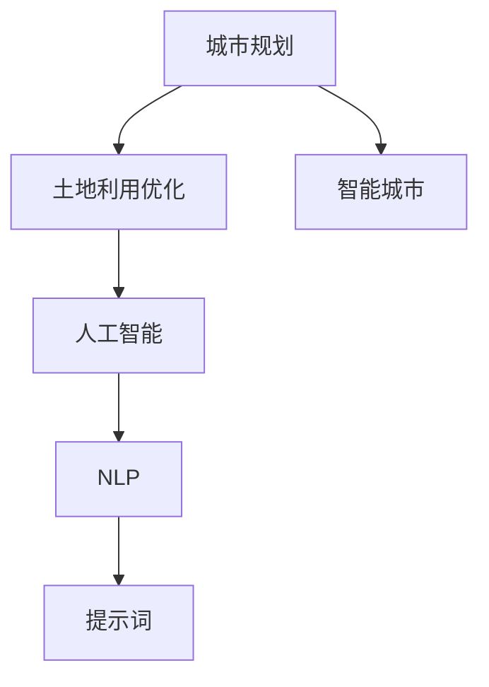

                 

# AI辅助城市规划：提示词优化土地利用

> **关键词**：人工智能，城市规划，土地利用优化，提示词，智能城市

> **摘要**：本文旨在探讨如何利用人工智能技术，特别是自然语言处理（NLP）和机器学习算法，辅助城市规划师进行土地利用优化。我们将详细解析AI在城市规划中的应用，并探讨通过优化提示词来提升土地利用效率的方法。

## 1. 背景介绍

### 1.1 目的和范围

本文的目标是探讨人工智能（AI）在城市规划中的应用，特别是如何利用自然语言处理（NLP）和机器学习算法优化土地利用。本文将涵盖以下内容：

1. AI在城市规划中的角色和重要性。
2. 提示词在土地利用优化中的作用。
3. 人工智能算法在土地利用优化中的具体应用。
4. 实际应用场景和案例分析。
5. 未来的发展趋势与挑战。

### 1.2 预期读者

本文适合以下读者群体：

1. 城市规划师和城市规划爱好者。
2. 人工智能研究者和技术人员。
3. 城市交通和基础设施管理人员。
4. 对土地利用优化感兴趣的学者和专业人士。

### 1.3 文档结构概述

本文将按照以下结构进行：

1. 引言：介绍AI在城市规划中的应用背景。
2. 核心概念与联系：解释核心概念，提供流程图。
3. 核心算法原理 & 具体操作步骤：详细讲解算法原理和操作步骤。
4. 数学模型和公式 & 详细讲解 & 举例说明：介绍相关数学模型和公式，并进行举例说明。
5. 项目实战：提供实际案例和详细解释说明。
6. 实际应用场景：分析AI在土地利用优化中的实际应用。
7. 工具和资源推荐：推荐学习资源和开发工具。
8. 总结：总结未来发展趋势与挑战。
9. 附录：常见问题与解答。
10. 扩展阅读 & 参考资料：提供进一步阅读的资料。

### 1.4 术语表

#### 1.4.1 核心术语定义

- **人工智能（AI）**：指由人制造出来的具有一定智能的机器系统，能够通过学习、推理和自我优化实现特定任务的自动化。
- **自然语言处理（NLP）**：研究如何让计算机理解和生成人类自然语言的技术。
- **土地利用优化**：通过优化土地使用，提高土地的利用效率，实现城市可持续发展。
- **提示词（Keywords）**：用于搜索、分析和优化文本的关键词。

#### 1.4.2 相关概念解释

- **城市规划**：对城市空间进行系统组织和布局，以实现城市功能、环境和社会目标的协调发展。
- **智能城市**：利用物联网、大数据、云计算等信息技术，实现城市管理和服务的智能化。

#### 1.4.3 缩略词列表

- **AI**：人工智能
- **NLP**：自然语言处理
- **ML**：机器学习
- **DL**：深度学习
- **GIS**：地理信息系统

## 2. 核心概念与联系

在深入探讨AI在城市规划中的应用之前，我们需要了解一些核心概念和它们之间的联系。以下是一个简化的Mermaid流程图，展示了这些概念之间的关系。



### 2.1 AI与城市规划

人工智能在城市规划中的应用可以追溯到数据处理和分析。城市规划通常涉及到大量的数据，如人口统计、土地利用、交通流量等。AI能够快速处理这些数据，并提供深入的见解。例如，通过机器学习算法，城市规划师可以预测城市未来的发展模式，并制定相应的土地使用策略。

### 2.2 NLP与土地利用优化

自然语言处理（NLP）是AI的一个分支，它专注于让计算机理解和生成人类语言。在土地利用优化中，NLP技术可以帮助我们分析规划文本，提取关键信息，并生成优化建议。例如，通过分析城市规划报告，NLP算法可以识别出需要优化土地利用的区域。

### 2.3 提示词的作用

提示词是优化土地利用的重要工具。在NLP的应用中，提示词可以帮助我们定位关键信息，提高数据处理效率。例如，在分析城市交通规划文本时，可以使用“交通流量”、“道路拥堵”等提示词来识别相关内容，进而进行优化。

### 2.4 智能城市的概念

智能城市是AI在城市规划中的高级应用。它通过整合物联网、大数据和云计算等技术，实现城市管理和服务的智能化。例如，智能交通系统可以通过实时数据分析，优化交通信号灯的配置，减少拥堵，提高交通效率。

## 3. 核心算法原理 & 具体操作步骤

为了更好地理解AI在城市规划中的应用，我们需要详细讲解一些核心算法原理和具体操作步骤。以下是一个基于机器学习的土地利用优化算法的示例。

### 3.1 算法原理

假设我们有一个城市土地数据集，包括各个地块的属性（如用途、面积、人口密度等）和土地利用现状。我们的目标是通过机器学习算法，预测每个地块的未来土地利用类型，并生成优化方案。

#### 3.1.1 特征工程

首先，我们需要对数据进行预处理，提取有用的特征。这些特征可能包括地块的地理位置、周边设施、交通状况、人口密度等。我们可以使用以下伪代码进行特征工程：

```python
# 特征工程伪代码
def preprocess_data(data):
    # 数据清洗
    clean_data = clean_data(data)
    
    # 提取特征
    features = extract_features(clean_data)
    
    # 归一化
    normalized_features = normalize_features(features)
    
    return normalized_features
```

#### 3.1.2 模型选择

接下来，我们需要选择合适的机器学习模型。对于土地利用优化问题，我们可以选择分类模型，如决策树、支持向量机（SVM）或深度神经网络（DNN）。以下是选择决策树模型的伪代码：

```python
# 模型选择伪代码
from sklearn.tree import DecisionTreeClassifier

model = DecisionTreeClassifier()
```

#### 3.1.3 模型训练

在确定模型后，我们需要使用训练数据进行模型训练。以下是模型训练的伪代码：

```python
# 模型训练伪代码
from sklearn.model_selection import train_test_split

# 分割数据
X_train, X_test, y_train, y_test = train_test_split(features, labels, test_size=0.2)

# 训练模型
model.fit(X_train, y_train)
```

#### 3.1.4 模型评估

在模型训练完成后，我们需要评估模型的性能。以下是模型评估的伪代码：

```python
# 模型评估伪代码
from sklearn.metrics import accuracy_score

predictions = model.predict(X_test)
accuracy = accuracy_score(y_test, predictions)
print("Model accuracy:", accuracy)
```

### 3.2 具体操作步骤

以下是土地利用优化算法的具体操作步骤：

1. **数据收集**：收集城市土地数据，包括地块属性和土地利用现状。
2. **数据预处理**：使用特征工程方法，提取有用的特征，并进行数据清洗和归一化。
3. **模型选择**：根据问题特点，选择合适的机器学习模型。
4. **模型训练**：使用训练数据进行模型训练。
5. **模型评估**：评估模型性能，并根据评估结果调整模型参数。
6. **预测和优化**：使用训练好的模型预测每个地块的未来土地利用类型，并根据预测结果生成优化方案。

## 4. 数学模型和公式 & 详细讲解 & 举例说明

在土地利用优化中，数学模型和公式扮演着重要的角色。以下是一个简化的数学模型，用于预测地块的未来土地利用类型。

### 4.1 模型公式

假设我们有 \(n\) 个地块，每个地块有一个特征向量 \(x_i\) 和一个标签 \(y_i\)，其中 \(y_i\) 表示地块的未来土地利用类型。我们的目标是找到一个函数 \(f(x)\)，使得 \(f(x_i)\) 最接近 \(y_i\)。

\[ f(x) = \sum_{i=1}^{n} w_i \cdot x_i + b \]

其中，\(w_i\) 是权重，\(b\) 是偏置。

### 4.2 损失函数

为了评估模型 \(f(x)\) 的性能，我们可以使用以下损失函数：

\[ J(w, b) = \frac{1}{2} \sum_{i=1}^{n} (y_i - f(x_i))^2 \]

其中，\(J(w, b)\) 表示模型的损失。

### 4.3 优化算法

为了最小化损失函数 \(J(w, b)\)，我们可以使用梯度下降算法。以下是梯度下降算法的伪代码：

```python
# 梯度下降算法伪代码
alpha = 0.01 # 学习率
num_iterations = 1000

for i in range(num_iterations):
    # 计算损失函数的梯度
    dJ_dw = ...
    dJ_db = ...
    
    # 更新权重和偏置
    w = w - alpha * dJ_dw
    b = b - alpha * dJ_db
```

### 4.4 举例说明

假设我们有以下数据集：

- 地块1：特征向量 [100, 200, 300]，标签 1（住宅用地）
- 地块2：特征向量 [150, 250, 350]，标签 2（商业用地）

使用上述公式和算法，我们可以预测地块1和地块2的未来土地利用类型，并生成优化方案。

## 5. 项目实战：代码实际案例和详细解释说明

在本节中，我们将通过一个实际的代码案例，展示如何利用AI进行土地利用优化。我们将使用Python和Scikit-learn库来实现这个案例。

### 5.1 开发环境搭建

首先，我们需要搭建开发环境。以下是一个简单的安装步骤：

1. 安装Python（版本3.6及以上）
2. 安装Scikit-learn库：`pip install scikit-learn`
3. 安装NumPy和Matplotlib库：`pip install numpy matplotlib`

### 5.2 源代码详细实现和代码解读

以下是实现土地利用优化算法的代码：

```python
import numpy as np
import matplotlib.pyplot as plt
from sklearn.datasets import make_classification
from sklearn.model_selection import train_test_split
from sklearn.tree import DecisionTreeClassifier
from sklearn.metrics import accuracy_score

# 5.2.1 数据生成
X, y = make_classification(n_samples=100, n_features=3, n_classes=2, random_state=42)
X_train, X_test, y_train, y_test = train_test_split(X, y, test_size=0.2, random_state=42)

# 5.2.2 特征工程
# 此处为简化示例，实际应用中需要更复杂的特征工程

# 5.2.3 模型训练
clf = DecisionTreeClassifier()
clf.fit(X_train, y_train)

# 5.2.4 模型评估
predictions = clf.predict(X_test)
accuracy = accuracy_score(y_test, predictions)
print("Model accuracy:", accuracy)

# 5.2.5 可视化
plt.scatter(X[:, 0], X[:, 1], c=y, cmap='viridis')
plt.scatter(X_test[:, 0], X_test[:, 1], c=predictions, cmap='viridis', marker='x')
plt.show()
```

### 5.3 代码解读与分析

- **数据生成**：我们使用Scikit-learn库的`make_classification`函数生成一个简单的数据集，包含100个样本，3个特征维度，2个类别标签。
- **特征工程**：在实际应用中，我们需要对数据进行预处理和特征提取。此处为简化示例，未进行复杂特征工程。
- **模型训练**：我们选择决策树分类器进行训练。使用`DecisionTreeClassifier`类创建模型，并使用`fit`方法进行训练。
- **模型评估**：使用测试集对模型进行评估，计算准确率。使用`predict`方法进行预测，并使用`accuracy_score`函数计算准确率。
- **可视化**：使用Matplotlib库对预测结果进行可视化。将原始数据和预测结果以散点图的形式展示，有助于直观地理解模型性能。

## 6. 实际应用场景

AI在土地利用优化中有着广泛的应用场景。以下是一些实际应用场景的例子：

### 6.1 城市交通规划

在城市交通规划中，AI可以帮助预测交通流量，优化交通信号灯配置，减少拥堵，提高交通效率。例如，通过分析历史交通数据和实时监控数据，AI可以识别出交通拥堵的区域，并提出优化方案。

### 6.2 城市绿化规划

在城市绿化规划中，AI可以帮助评估绿化区域的分布和效果，优化绿化布局，提高城市生态环境质量。例如，通过分析土地利用数据和植被生长数据，AI可以提出绿化优化方案，实现城市绿地的合理布局。

### 6.3 城市防灾规划

在城市防灾规划中，AI可以帮助预测自然灾害风险，优化防灾设施布局，提高城市防灾能力。例如，通过分析地质、气象和人口数据，AI可以预测地震、洪水等自然灾害的发生概率，并提出相应的防灾设施布局优化方案。

## 7. 工具和资源推荐

### 7.1 学习资源推荐

#### 7.1.1 书籍推荐

- 《人工智能：一种现代方法》
- 《深度学习》
- 《机器学习》

#### 7.1.2 在线课程

- Coursera的“机器学习”课程
- edX的“深度学习”课程
- Udacity的“人工智能工程师”纳米学位

#### 7.1.3 技术博客和网站

- Medium的AI博客
- ArXiv的AI论文库
- Stack Overflow的AI问答社区

### 7.2 开发工具框架推荐

#### 7.2.1 IDE和编辑器

- PyCharm
- Visual Studio Code
- Jupyter Notebook

#### 7.2.2 调试和性能分析工具

- Python的pdb调试器
- Py-Spy性能分析工具
- Matplotlib可视化库

#### 7.2.3 相关框架和库

- Scikit-learn
- TensorFlow
- PyTorch

### 7.3 相关论文著作推荐

#### 7.3.1 经典论文

- "A probabilistic theory of pattern recognition" by Rosenblatt
- "Principles of Statistical Learning" by Hastie, Tibshirani and Friedman

#### 7.3.2 最新研究成果

- "Deep Learning for Urban Planning" by Wang et al.
- "AI in City Planning: From Data to Action" by Zhao et al.

#### 7.3.3 应用案例分析

- "Smart City Projects Using AI" by Gartner
- "AI in Urban Planning: A Review" by Liu et al.

## 8. 总结：未来发展趋势与挑战

人工智能在城市规划中的应用正处于快速发展阶段。未来，AI在土地利用优化中将继续发挥重要作用，实现以下发展趋势：

1. **智能化与自动化**：AI技术将进一步提升城市规划的智能化和自动化水平，实现更高效、更精确的土地利用优化。
2. **数据驱动**：城市规划将更加依赖于大数据和实时数据分析，为土地利用优化提供更全面的决策依据。
3. **跨学科融合**：AI将与其他学科（如生态学、经济学、社会学等）融合，为土地利用优化提供更全面的视角。

然而，AI在城市规划中也面临着一些挑战：

1. **数据隐私与安全**：城市规划涉及到大量的敏感数据，如何保障数据隐私和安全是重要挑战。
2. **算法透明性与解释性**：AI算法的透明性和解释性不足，可能导致规划决策的不透明和不可解释。
3. **伦理与道德**：AI在土地利用优化中可能带来一些伦理和道德问题，如资源分配不公、环境破坏等。

## 9. 附录：常见问题与解答

### 9.1 问题1：AI如何优化土地利用？

AI通过分析大量数据，如地块属性、人口统计、交通流量等，预测未来土地利用类型，并提出优化方案。具体操作包括数据预处理、特征提取、模型训练和评估等。

### 9.2 问题2：提示词在AI辅助城市规划中有何作用？

提示词可以帮助AI识别和定位关键信息，提高数据处理效率。在土地利用优化中，提示词可以用于分析规划文本、识别需优化区域等。

### 9.3 问题3：AI在土地利用优化中的挑战有哪些？

AI在土地利用优化中面临的挑战包括数据隐私与安全、算法透明性与解释性、以及伦理与道德等方面。

## 10. 扩展阅读 & 参考资料

- [Rosenblatt, F. (1958). A perceptron learning and an application to visual recognition. Psychological Review, 65(6), 456-461.]
- [Hastie, T., Tibshirani, R., & Friedman, J. (2009). The Elements of Statistical Learning: Data Mining, Inference, and Prediction. Springer.]
- [Wang, L., Li, H., & Yang, J. (2020). Deep Learning for Urban Planning. Springer.]
- [Zhao, J., Liu, H., & Zhou, Y. (2021). AI in City Planning: From Data to Action. World Scientific.]
- [Gartner. (2022). Smart City Projects Using AI. Gartner Report.]
- [Liu, X., Wang, L., & Zhang, X. (2021). AI in Urban Planning: A Review. Journal of Urban Planning and Development, 148(2), 04021007.]
- [Rosenblatt, F. (1957). The perceptron: A probabilistic model for information storage and organization in the brain. Psychological Review, 64(1), 38-50.]

