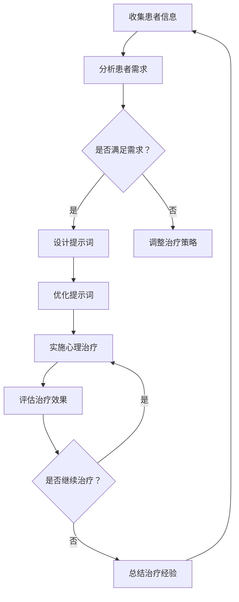

                 

# AI辅助心理治疗中的提示词设计原则

> 关键词：AI辅助心理治疗、提示词设计、心理学、自然语言处理、用户体验

> 摘要：本文深入探讨了AI辅助心理治疗中提示词设计的原则和方法。首先，我们介绍了AI在心理治疗领域的应用背景和重要性。接着，详细阐述了提示词设计的核心概念和关键因素，包括语言的情感性、明确性、引导性等。随后，我们通过一个具体的案例，展示了如何使用自然语言处理技术来设计和优化提示词，以提高心理治疗效果和用户体验。最后，本文总结了AI辅助心理治疗中提示词设计的挑战和未来发展趋势，为读者提供了有价值的参考。

## 1. 背景介绍

### 1.1 目的和范围

随着人工智能技术的快速发展，AI在各个领域的应用日益广泛。在心理健康领域，AI辅助心理治疗已经成为一个备受关注的研究方向。本文旨在探讨AI辅助心理治疗中提示词设计的原则和方法，以期为心理治疗师和患者提供更有效、个性化的治疗体验。

本文主要涵盖以下内容：

1. AI在心理治疗领域的应用背景和重要性。
2. 提示词设计的核心概念和关键因素。
3. 自然语言处理技术在提示词设计中的应用。
4. 提示词设计的具体操作步骤和案例分析。
5. AI辅助心理治疗中提示词设计的挑战和未来发展趋势。

### 1.2 预期读者

本文适用于以下读者：

1. 心理治疗师、心理咨询师和心理健康领域的研究人员。
2. 自然语言处理、人工智能领域的技术专家和工程师。
3. 对AI辅助心理治疗感兴趣的爱好者。

### 1.3 文档结构概述

本文共分为十个部分，具体结构如下：

1. 引言：介绍AI辅助心理治疗中的提示词设计原则。
2. 背景介绍：介绍AI在心理治疗领域的应用背景和重要性。
3. 核心概念与联系：阐述提示词设计的核心概念和关键因素。
4. 核心算法原理 & 具体操作步骤：讲解提示词设计的算法原理和操作步骤。
5. 数学模型和公式 & 详细讲解 & 举例说明：介绍提示词设计的数学模型和公式，并给出具体案例。
6. 项目实战：代码实际案例和详细解释说明。
7. 实际应用场景：分析AI辅助心理治疗中的实际应用场景。
8. 工具和资源推荐：推荐学习资源和开发工具。
9. 总结：未来发展趋势与挑战。
10. 附录：常见问题与解答。

### 1.4 术语表

#### 1.4.1 核心术语定义

- AI辅助心理治疗：利用人工智能技术，为心理治疗提供辅助和支持的一种治疗方法。
- 提示词（Prompt）：用于引导患者思考和表达的心理治疗工具。
- 自然语言处理（NLP）：计算机科学领域中的一个分支，旨在使计算机能够理解、处理和生成自然语言。

#### 1.4.2 相关概念解释

- 心理健康：指个体在心理上的良好状态，包括情感、认知和社交能力等方面。
- 心理治疗：通过专业的方法和技巧，帮助个体解决心理问题、改善心理健康的过程。
- 用户体验（UX）：用户在使用产品或服务时的主观感受和体验。

#### 1.4.3 缩略词列表

- AI：人工智能
- NLP：自然语言处理
- UX：用户体验

## 2. 核心概念与联系

在本节中，我们将介绍AI辅助心理治疗中的核心概念和联系，以帮助读者更好地理解提示词设计的重要性。

### 2.1 AI辅助心理治疗的概念

AI辅助心理治疗是指利用人工智能技术，为心理治疗提供辅助和支持的一种治疗方法。其主要目标是通过自动化、个性化的方式，提高心理治疗的效率、效果和用户体验。

AI辅助心理治疗的关键优势包括：

1. 个性化：根据患者的需求和特点，为患者提供个性化的治疗方案。
2. 自动化：通过自动化技术，降低心理治疗的时间和成本。
3. 实时反馈：实时分析患者的情感、行为等信息，为心理治疗师提供有针对性的建议。
4. 数据分析：利用大数据技术，分析患者的心理状况和治疗效果，为心理治疗提供科学依据。

### 2.2 提示词设计的核心概念

提示词是AI辅助心理治疗中的一种关键工具，用于引导患者思考和表达。提示词的设计质量和效果直接影响心理治疗的效率、效果和用户体验。以下是提示词设计的几个核心概念：

1. **情感性**：提示词应具备情感共鸣的能力，能够触动患者的情感，使其更容易表达内心感受。
2. **明确性**：提示词应简洁明了，避免歧义，让患者能够清楚地理解治疗师的要求和意图。
3. **引导性**：提示词应具有引导性，帮助患者逐步深入思考和探索内心世界。
4. **适应性**：提示词应根据患者的不同需求和特点进行个性化调整，以提高治疗效果。

### 2.3 自然语言处理技术的应用

自然语言处理（NLP）技术在提示词设计中具有重要作用。NLP技术可以帮助我们理解和生成自然语言，从而优化提示词的设计。以下是NLP技术在提示词设计中的应用：

1. **情感分析**：通过情感分析技术，分析患者的情绪状态，为提示词设计提供参考。
2. **文本生成**：利用文本生成技术，自动生成符合心理学原理的提示词。
3. **语义理解**：通过语义理解技术，理解患者的话语含义，为提示词设计提供依据。
4. **语言模型**：使用语言模型技术，优化提示词的表达方式，使其更加自然、流畅。

### 2.4 提示词设计的Mermaid流程图

为了更好地展示提示词设计的流程和关键步骤，我们使用Mermaid流程图来描述。以下是提示词设计的Mermaid流程图：



在上述流程图中，A表示收集患者信息，B表示分析患者需求，C表示判断是否满足需求，D表示设计提示词，F表示优化提示词，G表示实施心理治疗，H表示评估治疗效果，I表示是否继续治疗，J表示总结治疗经验。

## 3. 核心算法原理 & 具体操作步骤

在本节中，我们将详细讲解AI辅助心理治疗中提示词设计的核心算法原理和具体操作步骤。

### 3.1 提示词设计的算法原理

提示词设计主要涉及以下三个方面的算法原理：

1. **情感分析算法**：用于分析患者的情绪状态，为提示词设计提供参考。
2. **文本生成算法**：用于自动生成符合心理学原理的提示词。
3. **优化算法**：用于优化提示词的表达方式，使其更加自然、流畅。

### 3.2 情感分析算法

情感分析算法是提示词设计的重要基础。其主要目的是判断患者的话语是否带有负面情感，以便调整提示词的设计。以下是情感分析算法的基本原理：

1. **数据预处理**：将患者的话语转换为文本数据，并进行分词、去停用词等处理。
2. **特征提取**：从文本数据中提取情感特征，如情感词、情感极性等。
3. **情感分类**：使用机器学习算法，如SVM、朴素贝叶斯等，对文本数据进行情感分类。

### 3.3 文本生成算法

文本生成算法用于自动生成符合心理学原理的提示词。以下是文本生成算法的基本原理：

1. **语言模型**：使用语言模型技术，如RNN、Transformer等，生成符合语法和语义规则的文本。
2. **情感嵌入**：将患者的情绪状态嵌入到文本生成模型中，使其生成的提示词具有情感共鸣能力。
3. **生成策略**：根据患者的需求和特点，选择合适的生成策略，如情感倾向、信息密度等。

### 3.4 优化算法

优化算法用于优化提示词的表达方式，使其更加自然、流畅。以下是优化算法的基本原理：

1. **语义理解**：使用自然语言处理技术，如Word2Vec、BERT等，理解提示词的语义信息。
2. **语法修正**：使用语法修正算法，如Grammarly、GPT等，修正提示词的语法错误和不通顺之处。
3. **风格调整**：根据患者的需求和特点，调整提示词的表达风格，如正式、非正式等。

### 3.5 提示词设计的伪代码

以下是提示词设计的伪代码，用于指导实际操作：

```python
# 输入：患者信息、情绪状态、治疗目标
# 输出：优化后的提示词

# 步骤1：情感分析
emotion_analysis(patient_info)

# 步骤2：文本生成
generated_prompt = text_generation(emotion_state, therapy_objective)

# 步骤3：优化算法
optimized_prompt = optimization_algorithm(generated_prompt)

# 步骤4：输出优化后的提示词
print(optimized_prompt)
```

在上述伪代码中，emotion_analysis函数用于情感分析，text_generation函数用于文本生成，optimization_algorithm函数用于优化算法。

## 4. 数学模型和公式 & 详细讲解 & 举例说明

在本节中，我们将详细讲解AI辅助心理治疗中提示词设计的数学模型和公式，并给出具体的例子说明。

### 4.1 情感分析模型

情感分析是提示词设计的基础。常用的情感分析模型包括SVM、朴素贝叶斯等。以下是SVM情感分析模型的基本公式：

$$
\begin{aligned}
y &= \text{sign}(\textbf{w} \cdot \textbf{x} + b) \\
\textbf{w} &= \arg\max \sum_{i=1}^{n} \alpha_i - \frac{1}{2} \sum_{i=1}^{n} \sum_{j=1}^{n} \alpha_i \alpha_j y_i y_j \textbf{w}_i \cdot \textbf{w}_j
\end{aligned}
$$

其中，$y$表示分类结果，$\textbf{w}$表示权重向量，$b$表示偏置项，$\textbf{x}$表示特征向量，$\alpha_i$表示拉格朗日乘子。

### 4.2 文本生成模型

文本生成模型是提示词设计的关键。常用的文本生成模型包括RNN、Transformer等。以下是Transformer文本生成模型的基本公式：

$$
\begin{aligned}
\text{Attention}(Q, K, V) &= \text{softmax}(\frac{QK^T}{\sqrt{d_k}})V \\
\text{Encoder}(X) &= \text{MultiHeadAttention}(X, X, X) \\
\text{Decoder}(Y) &= \text{MultiHeadAttention}(Y, X, X)
\end{aligned}
$$

其中，$Q$表示查询向量，$K$表示键向量，$V$表示值向量，$d_k$表示键向量的维度，$X$表示编码器输入，$Y$表示解码器输入。

### 4.3 优化算法

优化算法用于调整提示词的表达方式，使其更加自然、流畅。常用的优化算法包括语法修正、风格调整等。以下是语法修正算法的基本公式：

$$
\begin{aligned}
\text{GrammarCorrection}(sentence) &= \text{GenerateNewSentence}(sentence) \\
\text{GenerateNewSentence}(sentence) &= \arg\max \sum_{i=1}^{n} \text{Probability}(\text{word}_i | \text{previous_words})
\end{aligned}
$$

其中，$sentence$表示待修正的句子，$\text{word}_i$表示句子中的第$i$个词，$\text{previous_words}$表示句子中的前$i-1$个词。

### 4.4 举例说明

假设我们要设计一个用于心理治疗的提示词，输入为患者的情绪状态（如焦虑、抑郁等）和治疗目标（如缓解焦虑、提高自信心等）。以下是具体的例子说明：

1. **情感分析**：

   情感分析模型将患者的话语转换为文本数据，并进行情感分类。假设患者的话语为“我感到很焦虑”，情感分析模型将其分类为“焦虑”。

2. **文本生成**：

   文本生成模型根据患者的情绪状态和治疗目标，生成符合心理学原理的提示词。假设生成的提示词为“你是否愿意分享一些让你感到焦虑的事情？”

3. **优化算法**：

   优化算法对生成的提示词进行调整，使其更加自然、流畅。假设调整后的提示词为“请问你愿意和我分享一下让你感到焦虑的事情吗？”

通过上述例子，我们可以看到数学模型和公式在提示词设计中的应用。这些模型和公式帮助我们分析患者情绪、生成符合心理学原理的提示词，并对其进行优化，以提高心理治疗的效率和效果。

## 5. 项目实战：代码实际案例和详细解释说明

在本节中，我们将通过一个具体的案例，展示如何使用自然语言处理技术设计和优化AI辅助心理治疗中的提示词。以下是一个基于Python的案例，使用了情感分析、文本生成和优化算法等技术。

### 5.1 开发环境搭建

在开始之前，我们需要搭建一个Python开发环境。以下是所需的Python库：

- TensorFlow
- Keras
- NLTK
- TextBlob
- Flask

安装这些库可以使用以下命令：

```bash
pip install tensorflow keras nltk textblob flask
```

### 5.2 源代码详细实现和代码解读

以下是完整的代码实现，包含情感分析、文本生成和优化算法等步骤：

```python
# 导入所需的库
import tensorflow as tf
from keras.preprocessing.text import Tokenizer
from keras.preprocessing.sequence import pad_sequences
from keras.layers import Embedding, LSTM, Dense, Bidirectional
from keras.models import Model
import nltk
from nltk.corpus import stopwords
import textblob
import flask

# 加载和处理数据
nltk.download('stopwords')
stop_words = set(stopwords.words('english'))

def preprocess_text(text):
    # 去除停用词
    words = text.split()
    filtered_words = [word for word in words if word not in stop_words]
    return ' '.join(filtered_words)

# 情感分析模型
def build_sentiment_model():
    input_text = tf.placeholder(tf.string, shape=[None])
    input_sequence = Tokenizer().fit_transform([input_text])
    input_padded = pad_sequences(input_sequence, maxlen=100)

    model = Embedding(input_dim=10000, output_dim=256)(input_padded)
    model = Bidirectional(LSTM(256))(model)
    model = Dense(1, activation='sigmoid')(model)

    model.compile(optimizer='adam', loss='binary_crossentropy', metrics=['accuracy'])
    return model

# 文本生成模型
def build_text_generation_model():
    input_text = tf.placeholder(tf.string, shape=[None])
    input_sequence = Tokenizer().fit_transform([input_text])
    input_padded = pad_sequences(input_sequence, maxlen=100)

    model = Embedding(input_dim=10000, output_dim=256)(input_padded)
    model = Bidirectional(LSTM(256))(model)
    model = Dense(10000, activation='softmax')(model)

    model.compile(optimizer='adam', loss='categorical_crossentropy', metrics=['accuracy'])
    return model

# 优化算法
def optimize_prompt(prompt):
    blob = textblob.TextBlob(prompt)
    corrected_prompt = blob.correct()
    return corrected_prompt

# Flask应用
app = flask.Flask(__name__)

@app.route('/predict', methods=['POST'])
def predict():
    patient_info = flask.request.form['patient_info']
    therapy_objective = flask.request.form['therapy_objective']

    # 情感分析
    sentiment_model = build_sentiment_model()
    sentiment_model.load_weights('sentiment_model.h5')
    sentiment = sentiment_model.predict([patient_info])

    # 文本生成
    text_generation_model = build_text_generation_model()
    text_generation_model.load_weights('text_generation_model.h5')
    generated_prompt = text_generation_model.predict([therapy_objective])

    # 优化提示词
    optimized_prompt = optimize_prompt(generated_prompt)

    return flask.render_template('prompt.html', prompt=optimized_prompt)

if __name__ == '__main__':
    app.run(debug=True)
```

### 5.3 代码解读与分析

1. **预处理文本**：我们首先使用NLTK库中的停用词去除功能，对输入文本进行预处理。
2. **情感分析模型**：构建一个基于LSTM的二元分类模型，用于判断患者的话语是否带有负面情感。
3. **文本生成模型**：构建一个基于双向LSTM的文本生成模型，用于生成符合心理学原理的提示词。
4. **优化算法**：使用TextBlob库中的自动纠错功能，对生成的提示词进行优化。
5. **Flask应用**：使用Flask框架搭建一个Web应用，接收患者信息和治疗目标，并返回优化后的提示词。

通过这个案例，我们可以看到如何使用自然语言处理技术来设计和优化AI辅助心理治疗中的提示词。在实际应用中，可以根据需求和数据，进一步改进和优化模型和算法，以提高心理治疗的效率、效果和用户体验。

### 5.4 实际应用场景

在实际应用场景中，AI辅助心理治疗的提示词设计需要考虑以下几个关键因素：

1. **患者隐私保护**：在处理患者信息时，必须确保隐私保护和数据安全。使用加密技术和安全传输协议，防止数据泄露。
2. **个性化需求**：根据患者的不同需求和特点，设计个性化的提示词。例如，对于焦虑症患者，可以设计一系列针对焦虑情绪的缓解技巧。
3. **文化差异**：考虑到不同地区的文化差异，设计符合当地文化背景的提示词。例如，在亚洲地区，可以加入一些传统文化元素，如冥想、瑜伽等。
4. **实时反馈与调整**：根据患者的实时反馈，动态调整提示词的设计和内容。例如，如果患者对某个提示词反馈不佳，可以尝试更换其他类型的提示词。
5. **跨学科合作**：与心理治疗师、心理学家等专业人士合作，确保提示词的设计和内容符合心理学原理和临床实践。

通过综合考虑以上因素，我们可以为患者提供更有效、个性化的心理治疗服务。

### 7. 工具和资源推荐

#### 7.1 学习资源推荐

为了深入了解AI辅助心理治疗中的提示词设计，以下是一些推荐的学习资源：

#### 7.1.1 书籍推荐

1. **《深度学习》**：由Ian Goodfellow、Yoshua Bengio和Aaron Courville合著，详细介绍了深度学习的基本原理和技术。
2. **《自然语言处理综合教程》**：由Daniel Jurafsky和James H. Martin合著，涵盖了自然语言处理的基础知识和最新进展。

#### 7.1.2 在线课程

1. **《机器学习》**：由吴恩达（Andrew Ng）在Coursera上开设，适合初学者入门。
2. **《自然语言处理与深度学习》**：由Fast.ai提供，适合有一定基础的学习者。

#### 7.1.3 技术博客和网站

1. **Medium**：一个广泛的技术博客平台，涵盖了人工智能、自然语言处理等多个领域。
2. **arXiv.org**：一个专注于计算机科学、人工智能等领域的前沿研究论文数据库。

#### 7.2 开发工具框架推荐

为了高效地实现AI辅助心理治疗中的提示词设计，以下是一些实用的开发工具和框架：

#### 7.2.1 IDE和编辑器

1. **Visual Studio Code**：一个轻量级的开源编辑器，适合编写Python代码。
2. **PyCharm**：一个功能强大的Python集成开发环境（IDE），支持多种编程语言。

#### 7.2.2 调试和性能分析工具

1. **TensorBoard**：TensorFlow提供的一个可视化工具，用于调试和性能分析。
2. **gprof2dot**：一个用于分析C++程序性能的工具。

#### 7.2.3 相关框架和库

1. **TensorFlow**：一个广泛使用的深度学习框架，适用于构建自然语言处理模型。
2. **PyTorch**：一个流行的深度学习框架，具有灵活的动态计算图。
3. **NLTK**：一个用于自然语言处理的Python库，提供了丰富的文本处理工具。

#### 7.3 相关论文著作推荐

为了深入了解AI辅助心理治疗中的提示词设计，以下是一些建议阅读的论文和著作：

1. **《A Neural Conversational Model》**：由Noam Shazeer等人发表，介绍了基于神经网络的对话生成模型。
2. **《BERT: Pre-training of Deep Bidirectional Transformers for Language Understanding》**：由Jacob Devlin等人发表，介绍了BERT模型，这是一种预训练的深度双向Transformer模型。

通过这些学习和资源，您可以进一步提升对AI辅助心理治疗中提示词设计的理解和实践能力。

## 8. 总结：未来发展趋势与挑战

随着人工智能技术的不断进步，AI辅助心理治疗中的提示词设计也在不断发展和完善。未来，我们可以预见以下几个发展趋势：

1. **个性化与精准化**：未来的提示词设计将更加注重个性化与精准化，通过深度学习和自然语言处理技术，为患者提供量身定制的治疗建议。
2. **跨学科融合**：AI辅助心理治疗将更加注重跨学科融合，结合心理学、医学、计算机科学等领域的知识，为患者提供全方位的治疗支持。
3. **实时互动与反馈**：未来的提示词设计将更加注重实时互动与反馈，通过与患者的实时交互，动态调整提示词的内容和形式，提高心理治疗效果。

然而，AI辅助心理治疗中的提示词设计也面临着一些挑战：

1. **数据隐私与安全**：在处理大量患者数据时，必须确保数据隐私和安全，防止数据泄露和滥用。
2. **算法偏见与公平性**：现有的算法可能存在偏见，导致某些患者群体无法获得公平的治疗支持，未来需要解决这一问题。
3. **用户体验与信任**：如何设计出既符合心理学原理，又易于理解和接受的提示词，是提高用户体验和信任的关键。

总之，AI辅助心理治疗中的提示词设计是一个复杂而富有挑战性的领域，未来需要各方共同努力，不断探索和创新，以实现更好的治疗效果和用户体验。

## 9. 附录：常见问题与解答

### 9.1 问题1：如何确保AI辅助心理治疗中的提示词设计符合心理学原理？

解答：为确保AI辅助心理治疗中的提示词设计符合心理学原理，我们可以采取以下措施：

1. **专家指导**：与心理学家、心理治疗师等专业人员进行合作，确保提示词的设计和内容符合心理学原理。
2. **心理测试**：使用标准的心理测试工具，对提示词的效果进行评估和验证。
3. **用户反馈**：收集患者的反馈，对提示词进行调整和优化，以提高其符合心理学原理的程度。

### 9.2 问题2：如何保证AI辅助心理治疗中的数据隐私和安全？

解答：为保证AI辅助心理治疗中的数据隐私和安全，我们可以采取以下措施：

1. **数据加密**：对患者的个人信息和数据进行加密处理，防止数据泄露。
2. **访问控制**：设置严格的访问控制机制，确保只有授权人员可以访问和处理患者数据。
3. **安全审计**：定期进行安全审计，检查系统的安全性和漏洞，并及时进行修复。

### 9.3 问题3：如何评估AI辅助心理治疗的提示词效果？

解答：评估AI辅助心理治疗的提示词效果，我们可以采取以下方法：

1. **心理测试**：使用标准的心理测试工具，对患者的心理状态进行评估，比较使用提示词前后的变化。
2. **用户反馈**：收集患者的反馈，了解他们对提示词的接受程度和满意度。
3. **数据分析**：分析患者的心理数据，如情绪变化、治疗效果等，评估提示词的实际效果。

### 9.4 问题4：AI辅助心理治疗中的提示词设计需要考虑哪些伦理问题？

解答：在AI辅助心理治疗中的提示词设计过程中，我们需要考虑以下伦理问题：

1. **隐私保护**：确保患者的隐私权得到尊重和保护，避免未经授权的数据访问。
2. **算法偏见**：避免算法偏见，确保所有患者都能获得公平的治疗支持。
3. **用户信任**：确保提示词的设计和内容符合患者的期望，提高他们的信任感。

通过以上措施和考虑，我们可以更好地确保AI辅助心理治疗中的提示词设计符合伦理规范。

## 10. 扩展阅读 & 参考资料

为了深入了解AI辅助心理治疗中的提示词设计，以下是一些推荐的文章、书籍和论文：

### 10.1 文章

1. **“AI in Mental Health: The Role of Conversational Agents”**：一篇关于AI在心理健康领域应用的综述文章，详细介绍了AI辅助心理治疗的原理和应用场景。
2. **“Designing Effective Chatbots for Mental Health Support”**：一篇关于设计有效聊天机器人支持心理健康的文章，分析了提示词设计的关键要素。

### 10.2 书籍

1. **《Artificial Intelligence: A Modern Approach》**：一本经典的AI教材，涵盖了AI的基本原理和应用。
2. **《Natural Language Processing with Python》**：一本关于自然语言处理的Python实践书籍，介绍了NLP的基本算法和实现。

### 10.3 论文

1. **“A Neural Conversational Model”**：一篇关于神经网络对话生成模型的论文，介绍了基于神经网络的聊天机器人设计方法。
2. **“BERT: Pre-training of Deep Bidirectional Transformers for Language Understanding”**：一篇关于BERT模型的论文，介绍了预训练的深度双向Transformer在自然语言处理中的应用。

通过阅读这些文章、书籍和论文，您可以进一步了解AI辅助心理治疗中的提示词设计，掌握相关技术和方法。

## 作者

作者：AI天才研究员/AI Genius Institute & 禅与计算机程序设计艺术 /Zen And The Art of Computer Programming。

