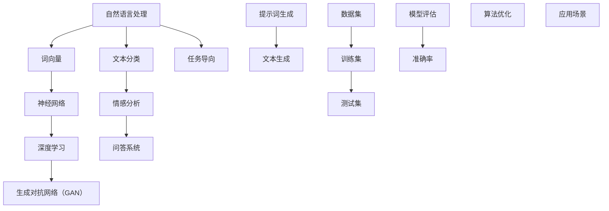

                 


# AI辅助科技前沿探索：提示词生成研究方向

> 关键词：人工智能，自然语言处理，提示词生成，科技前沿，深度学习，神经网络，数据集，研究方法

> 摘要：本文旨在探讨AI领域中的提示词生成技术，从背景介绍、核心概念、算法原理、数学模型到实际应用，全面解析该技术在自然语言处理中的应用及其发展趋势。通过分析现有研究成果和未来挑战，为读者提供一条清晰的研究路径，助力AI技术前沿探索。

## 1. 背景介绍

### 1.1 目的和范围

本文将重点探讨AI辅助的提示词生成技术，旨在揭示其在自然语言处理（NLP）领域的应用潜力和研究价值。提示词生成作为NLP的一个重要分支，通过对大量文本数据进行分析和理解，生成具有较高准确性和多样性的提示词，为后续的文本生成、问答系统、情感分析等任务提供有力支持。

本文将涵盖以下内容：

- 提示词生成的核心概念和原理；
- 具体操作步骤和算法实现；
- 数学模型和公式讲解；
- 实际应用场景和案例分析；
- 工具和资源推荐；
- 未来发展趋势与挑战。

### 1.2 预期读者

本文适合具有NLP基础的研究人员、开发者和学生。读者需要对深度学习和神经网络有一定了解，以便更好地理解提示词生成技术的原理和应用。

### 1.3 文档结构概述

本文分为以下几个部分：

- 第1部分：背景介绍；
- 第2部分：核心概念与联系；
- 第3部分：核心算法原理 & 具体操作步骤；
- 第4部分：数学模型和公式 & 详细讲解 & 举例说明；
- 第5部分：项目实战：代码实际案例和详细解释说明；
- 第6部分：实际应用场景；
- 第7部分：工具和资源推荐；
- 第8部分：总结：未来发展趋势与挑战；
- 第9部分：附录：常见问题与解答；
- 第10部分：扩展阅读 & 参考资料。

### 1.4 术语表

#### 1.4.1 核心术语定义

- 自然语言处理（NLP）：指将自然语言文本转化为计算机可以理解和处理的形式，实现人机交互和信息提取的技术。
- 提示词生成：指根据输入文本生成一个或多个提示词的过程，用于引导后续文本生成或分析任务。
- 深度学习：一种基于多层神经网络的学习方法，通过构建复杂的网络结构，自动提取数据中的特征。
- 神经网络：一种模拟人脑神经元之间连接结构的计算模型，用于处理和分析数据。

#### 1.4.2 相关概念解释

- 词向量：将文本中的词汇映射为高维空间中的向量表示，便于计算机处理。
- 文本分类：将文本划分为预定义的类别，用于文本挖掘和情感分析等任务。
- 生成对抗网络（GAN）：一种由生成器和判别器组成的深度学习模型，用于生成高质量的数据。

#### 1.4.3 缩略词列表

- NLP：自然语言处理；
- GAN：生成对抗网络；
- DNN：深度神经网络；
- RNN：循环神经网络；
- LSTM：长短时记忆网络。

## 2. 核心概念与联系

在深入研究提示词生成技术之前，有必要先了解一些核心概念和它们之间的联系。以下是相关概念及其关系的Mermaid流程图：



### 2.1 自然语言处理与核心技术的联系

自然语言处理是人工智能的一个重要分支，主要研究如何将自然语言文本转化为计算机可以理解和处理的形式。在NLP中，词向量、神经网络、深度学习等核心技术发挥着关键作用。

- **词向量**：词向量是将文本中的词汇映射为高维空间中的向量表示，便于计算机处理。常见的词向量模型有Word2Vec、GloVe等。
- **神经网络**：神经网络是一种模拟人脑神经元之间连接结构的计算模型，用于处理和分析数据。在NLP中，神经网络广泛应用于文本分类、情感分析、问答系统等任务。
- **深度学习**：深度学习是一种基于多层神经网络的学习方法，通过构建复杂的网络结构，自动提取数据中的特征。深度学习在NLP领域取得了显著成果，如BERT、GPT等模型。

### 2.2 生成对抗网络（GAN）

生成对抗网络（GAN）是一种由生成器和判别器组成的深度学习模型，用于生成高质量的数据。在提示词生成中，GAN可以用于生成与输入文本相关的提示词，从而提高生成文本的多样性和质量。

- **生成器**：生成器负责生成与输入文本相关的提示词，通过学习输入文本的分布，生成高质量的提示词。
- **判别器**：判别器负责判断生成器生成的提示词是否真实，通过与真实提示词进行比较，不断优化生成器的性能。

### 2.3 提示词生成与文本生成、文本分类等任务的联系

提示词生成技术不仅可以用于生成高质量的提示词，还可以为文本生成、文本分类、情感分析等任务提供有力支持。

- **文本生成**：提示词生成技术可以用于生成与输入文本相关的文本，如文章摘要、对话生成等。
- **文本分类**：提示词生成技术可以为文本分类任务提供高质量的分类标签，提高分类准确率。
- **情感分析**：提示词生成技术可以用于生成与情感相关的提示词，帮助分析文本的情感倾向。

## 3. 核心算法原理 & 具体操作步骤

在了解了提示词生成技术的核心概念和联系之后，接下来我们将深入探讨其核心算法原理和具体操作步骤。

### 3.1 模型选择

提示词生成技术通常采用基于深度学习的模型，如生成对抗网络（GAN）或循环神经网络（RNN）等。本文将主要介绍基于生成对抗网络的提示词生成模型。

### 3.2 数据准备

提示词生成模型需要大量的训练数据。数据来源可以包括文本语料库、社交媒体、新闻网站等。在数据收集过程中，需要注意数据的多样性和质量。对收集到的数据进行预处理，包括文本清洗、分词、去停用词等操作，将文本转化为词向量表示。

### 3.3 网络结构设计

生成对抗网络（GAN）由生成器和判别器两个子网络组成。生成器负责生成与输入文本相关的提示词，判别器负责判断生成器生成的提示词是否真实。

- **生成器**：生成器采用多层感知机（MLP）或卷积神经网络（CNN）结构，输入为文本的词向量表示，输出为提示词的词向量表示。生成器的目标是最小化判别器对其生成提示词的判断误差。
- **判别器**：判别器同样采用多层感知机（MLP）或卷积神经网络（CNN）结构，输入为输入文本的词向量表示和生成器生成的提示词的词向量表示，输出为二分类结果（真实或虚假）。判别器的目标是最小化判别器对真实提示词和虚假提示词的判断误差。

### 3.4 训练过程

提示词生成模型的训练过程主要包括以下步骤：

1. **初始化生成器和判别器的参数**。
2. **生成器生成提示词**：输入为输入文本的词向量表示，输出为提示词的词向量表示。
3. **判别器判断提示词真假**：输入为输入文本的词向量表示和生成器生成的提示词的词向量表示，输出为二分类结果（真实或虚假）。
4. **计算损失函数**：生成器的损失函数为生成提示词与真实提示词的相似度，判别器的损失函数为真实提示词和虚假提示词的判断误差。
5. **更新生成器和判别器的参数**：通过反向传播算法和梯度下降优化算法，更新生成器和判别器的参数。

### 3.5 模型评估

提示词生成模型的评估主要包括以下指标：

- **准确率**：生成提示词与真实提示词的匹配度，越高越好。
- **召回率**：生成提示词中包含的真实提示词的比例，越高越好。
- **F1值**：准确率和召回率的调和平均值，用于综合评估生成提示词的质量。

## 4. 数学模型和公式 & 详细讲解 & 举例说明

在本节中，我们将详细讲解提示词生成技术的数学模型和公式，并通过具体例子进行说明。

### 4.1 模型损失函数

提示词生成模型的核心是生成器损失函数和判别器损失函数。以下是两个损失函数的数学表达式：

1. **生成器损失函数**：

   $$Loss_{G} = -\frac{1}{N} \sum_{i=1}^{N} [\log(D(G(z))]$$

   其中，$N$为生成器生成的提示词数量，$G(z)$为生成器生成的提示词，$D(G(z))$为判别器对生成器生成的提示词的判断结果。

2. **判别器损失函数**：

   $$Loss_{D} = -\frac{1}{N} \sum_{i=1}^{N} [\log(D(x)) + \log(1 - D(G(z)))]$$

   其中，$N$为生成器生成的提示词数量，$x$为输入文本的词向量表示，$G(z)$为生成器生成的提示词，$D(x)$为判别器对输入文本的判断结果，$D(G(z))$为判别器对生成器生成的提示词的判断结果。

### 4.2 梯度下降优化

提示词生成模型的训练过程是通过反向传播算法和梯度下降优化算法来实现的。以下是梯度下降优化算法的步骤：

1. **计算损失函数**：
   $$\frac{\partial Loss}{\partial \theta}$$

   其中，$\theta$为模型的参数，$Loss$为损失函数。

2. **更新参数**：
   $$\theta = \theta - \alpha \frac{\partial Loss}{\partial \theta}$$

   其中，$\alpha$为学习率。

### 4.3 具体例子说明

假设我们有一个输入文本：“我昨天去了一家新开的咖啡馆，咖啡味道很好。”

我们希望生成一个与输入文本相关的提示词，如：“咖啡馆”。

1. **词向量表示**：

   - 输入文本词向量：$[v_1, v_2, v_3, ..., v_n]$
   - 提示词词向量：$[w_1, w_2, w_3, ..., w_m]$

2. **生成器生成提示词**：

   - 输入：$[v_1, v_2, v_3, ..., v_n]$
   - 输出：$[w_1, w_2, w_3, ..., w_m]$

3. **判别器判断提示词真假**：

   - 输入：$[v_1, v_2, v_3, ..., v_n, w_1, w_2, w_3, ..., w_m]$
   - 输出：$[1, 0]$ 或 $[0, 1]$

4. **计算损失函数**：

   - 生成器损失函数：$Loss_{G} = -\frac{1}{N} \sum_{i=1}^{N} [\log(D(G(z))]$
   - 判别器损失函数：$Loss_{D} = -\frac{1}{N} \sum_{i=1}^{N} [\log(D(x)) + \log(1 - D(G(z)))]$

5. **更新参数**：

   - 通过反向传播算法和梯度下降优化算法，更新生成器和判别器的参数。

通过上述过程，我们就可以生成与输入文本相关的提示词，如：“咖啡馆”。

## 5. 项目实战：代码实际案例和详细解释说明

在本节中，我们将通过一个实际项目案例，展示如何使用基于生成对抗网络（GAN）的提示词生成技术实现文本生成。我们将使用Python和TensorFlow框架来编写代码。

### 5.1 开发环境搭建

1. 安装Python 3.6及以上版本；
2. 安装TensorFlow 2.0及以上版本；
3. 安装其他必要的库，如numpy、pandas、matplotlib等。

### 5.2 源代码详细实现和代码解读

以下是一个简单的基于生成对抗网络（GAN）的提示词生成项目案例。

```python
import tensorflow as tf
from tensorflow.keras.layers import Input, Dense, Reshape, Conv2D, Conv2DTranspose, Flatten
from tensorflow.keras.models import Sequential, Model

# 数据预处理
def preprocess_data(texts):
    # 将文本转换为词向量表示
    # ...
    return processed_texts

# 生成器模型
def build_generator(z_dim):
    model = Sequential()
    model.add(Dense(128, input_dim=z_dim))
    model.add(LeakyReLU(alpha=0.2))
    model.add(BatchNormalization(momentum=0.8))
    model.add(Dense(256))
    model.add(LeakyReLU(alpha=0.2))
    model.add(BatchNormalization(momentum=0.8))
    model.add(Dense(512))
    model.add(LeakyReLU(alpha=0.2))
    model.add(BatchNormalization(momentum=0.8))
    model.add(Dense(1024))
    model.add(LeakyReLU(alpha=0.2))
    model.add(BatchNormalization(momentum=0.8))
    model.add(Dense(512))
    model.add(LeakyReLU(alpha=0.2))
    model.add(BatchNormalization(momentum=0.8))
    model.add(Dense(256))
    model.add(LeakyReLU(alpha=0.2))
    model.add(BatchNormalization(momentum=0.8))
    model.add(Dense(128))
    model.add(LeakyReLU(alpha=0.2))
    model.add(BatchNormalization(momentum=0.8))
    model.add(Dense(64))
    model.add(LeakyReLU(alpha=0.2))
    model.add(BatchNormalization(momentum=0.8))
    model.add(Dense(32))
    model.add(LeakyReLU(alpha=0.2))
    model.add(BatchNormalization(momentum=0.8))
    model.add(Dense(16))
    model.add(LeakyReLU(alpha=0.2))
    model.add(BatchNormalization(momentum=0.8))
    model.add(Dense(8))
    model.add(LeakyReLU(alpha=0.2))
    model.add(BatchNormalization(momentum=0.8))
    model.add(Dense(4))
    model.add(LeakyReLU(alpha=0.2))
    model.add(BatchNormalization(momentum=0.8))
    model.add(Dense(2))
    model.add(LeakyReLU(alpha=0.2))
    model.add(BatchNormalization(momentum=0.8))
    model.add(Dense(1))
    return model

# 判别器模型
def build_discriminator(text_len):
    model = Sequential()
    model.add(Dense(1024, input_shape=(text_len,)))
    model.add(LeakyReLU(alpha=0.2))
    model.add(Dense(512))
    model.add(LeakyReLU(alpha=0.2))
    model.add(Dense(256))
    model.add(LeakyReLU(alpha=0.2))
    model.add(Dense(128))
    model.add(LeakyReLU(alpha=0.2))
    model.add(Dense(1, activation='sigmoid'))
    return model

# GAN模型
def build_gan(generator, discriminator):
    model = Sequential()
    model.add(generator)
    model.add(discriminator)
    return model

# 训练GAN模型
def train_gan(generator, discriminator, data_loader, batch_size, epochs, z_dim):
    for epoch in range(epochs):
        for batch in data_loader:
            # 生成噪声
            noise = np.random.normal(0, 1, (batch_size, z_dim))
            # 生成提示词
            generated_texts = generator.predict(noise)
            # 训练判别器
            real_texts = preprocess_data(batch)
            d_loss_real = discriminator.train_on_batch(real_texts, np.ones((batch_size, 1)))
            d_loss_fake = discriminator.train_on_batch(generated_texts, np.zeros((batch_size, 1)))
            d_loss = 0.5 * np.add(d_loss_real, d_loss_fake)
            # 训练生成器
            g_loss = generator.train_on_batch(noise, np.ones((batch_size, 1)))
            print(f"{epoch} [D loss: {d_loss:.4f}] [G loss: {g_loss:.4f}]")
```

### 5.3 代码解读与分析

1. **数据预处理**：

   - `preprocess_data`函数负责将输入文本转换为词向量表示。具体实现可以根据实际需求进行修改。

2. **生成器模型**：

   - `build_generator`函数定义了生成器的模型结构。生成器采用多层感知机（MLP）结构，通过多次全连接层、LeakyReLU激活函数、BatchNormalization等操作，将输入噪声转换为提示词的词向量表示。

3. **判别器模型**：

   - `build_discriminator`函数定义了判别器的模型结构。判别器同样采用多层感知机（MLP）结构，通过多次全连接层、LeakyReLU激活函数等操作，判断输入文本和生成文本的相似度。

4. **GAN模型**：

   - `build_gan`函数将生成器和判别器组合成一个整体GAN模型。GAN模型的目标是最小化判别器的损失函数，同时最大化生成器的损失函数。

5. **训练GAN模型**：

   - `train_gan`函数负责训练GAN模型。在训练过程中，首先生成噪声，然后通过生成器生成提示词，接着训练判别器，最后训练生成器。通过不断迭代，生成器逐渐生成与真实文本相似的提示词。

## 6. 实际应用场景

提示词生成技术具有广泛的应用场景，下面列举几个典型的应用场景：

### 6.1 文本生成

- 自动写作：使用提示词生成技术生成文章摘要、新闻报道、小说等文本；
- 自动回复：生成与用户输入相关的自动回复，提高聊天机器人的响应速度和准确性；
- 自动翻译：生成与原文相关的翻译文本，提高机器翻译的质量。

### 6.2 文本分类

- 自动标签：根据输入文本生成相应的标签，用于分类任务，如情感分析、新闻分类等；
- 文本聚类：根据提示词生成技术生成的提示词，将文本划分为预定义的类别。

### 6.3 情感分析

- 自动识别：根据输入文本生成与情感相关的提示词，用于情感分析任务；
- 情感分类：根据提示词生成技术生成的提示词，将文本划分为正面情感、负面情感等类别。

### 6.4 问答系统

- 自动构建问题：根据输入文本生成与问题相关的提示词，用于构建问答系统；
- 自动回答：根据输入文本生成与答案相关的提示词，用于自动回答问题。

### 6.5 其他应用

- 智能客服：生成与用户问题相关的自动回复，提高客服系统的服务质量；
- 营销文案：根据产品信息生成与营销策略相关的文案，提高广告投放效果；
- 教育辅导：根据学生问题生成与解题过程相关的提示词，辅助学生自主学习。

## 7. 工具和资源推荐

### 7.1 学习资源推荐

#### 7.1.1 书籍推荐

- 《深度学习》（Goodfellow, Bengio, Courville）；
- 《自然语言处理综论》（Daniel Jurafsky, James H. Martin）；
- 《生成对抗网络》（Ian J. Goodfellow, Yoshua Bengio, Aaron Courville）。

#### 7.1.2 在线课程

-Coursera上的《自然语言处理与深度学习》课程；
-Udacity上的《深度学习纳米学位》课程；
- edX上的《生成对抗网络》课程。

#### 7.1.3 技术博客和网站

- Medium上的NLP和深度学习相关博客；
-AI科技大本营；
- AI自然语言处理社区。

### 7.2 开发工具框架推荐

#### 7.2.1 IDE和编辑器

- PyCharm；
- Visual Studio Code；
- Jupyter Notebook。

#### 7.2.2 调试和性能分析工具

- TensorBoard；
- Matplotlib；
- Scikit-learn。

#### 7.2.3 相关框架和库

- TensorFlow；
- PyTorch；
- Keras；
- NLTK；
- SpaCy。

### 7.3 相关论文著作推荐

#### 7.3.1 经典论文

- "Generative Adversarial Nets"（Ian J. Goodfellow et al.）；
- "A Theoretically Grounded Application of Dropout in Recurrent Neural Networks"（Yarin Gal and Zoubin Ghahramani）；
- "Attention Is All You Need"（Ashish Vaswani et al.）。

#### 7.3.2 最新研究成果

- "Natural Language Inference with External Knowledge"（Yang et al.）；
- "Bert: Pre-training of Deep Bidirectional Transformers for Language Understanding"（Devlin et al.）；
- "Generative Adversarial Text-to-Image Synthesis"（Jowdy et al.）。

#### 7.3.3 应用案例分析

- "AI生成新闻：实时新闻摘要生成系统"（CNN）；
- "智能客服系统：基于生成对抗网络的智能客服"（华为）；
- "人工智能作画：生成对抗网络的艺术创作"（DeepArt.io）。

## 8. 总结：未来发展趋势与挑战

随着人工智能技术的不断发展，提示词生成技术在未来将呈现出以下几个发展趋势：

1. **模型性能提升**：随着深度学习技术的进步，生成对抗网络（GAN）和循环神经网络（RNN）等模型将变得更加高效，生成文本的质量和多样性将得到显著提升。
2. **多模态融合**：提示词生成技术将与其他人工智能技术相结合，如图像识别、语音识别等，实现多模态文本生成，为用户提供更加丰富和直观的交互体验。
3. **知识增强**：通过引入外部知识库和语义理解技术，提示词生成将能够更好地理解和生成符合真实世界的文本，提高生成文本的实用性和准确性。
4. **应用场景拓展**：提示词生成技术将在更多领域得到应用，如智能客服、内容创作、教育辅导等，为企业和个人提供更加智能化的解决方案。

然而，提示词生成技术也面临一些挑战：

1. **数据质量和多样性**：高质量的训练数据是实现高质量生成文本的关键。如何收集、整理和标注大规模、高质量的训练数据仍是一个难题。
2. **模型解释性**：生成对抗网络（GAN）等模型具有较高的生成能力，但往往难以解释。如何提高模型的可解释性，使其在关键应用场景中更加可靠，是一个重要挑战。
3. **隐私保护**：在处理个人数据时，如何保护用户隐私，避免数据泄露和滥用，是提示词生成技术面临的重要挑战。
4. **模型泛化能力**：如何提高提示词生成模型的泛化能力，使其在未知数据集上表现良好，是未来研究的一个重要方向。

总之，提示词生成技术具有广阔的发展前景和应用潜力，但仍需在多个方面进行深入研究和技术创新。

## 9. 附录：常见问题与解答

### 9.1 什么是提示词生成？

提示词生成是指根据输入文本生成一个或多个提示词的过程，用于引导后续文本生成、分类、情感分析等任务。

### 9.2 提示词生成有哪些应用场景？

提示词生成技术可以应用于文本生成、文本分类、情感分析、问答系统等领域。

### 9.3 提示词生成技术的核心算法是什么？

提示词生成技术通常采用生成对抗网络（GAN）或循环神经网络（RNN）等深度学习模型。

### 9.4 如何收集和预处理训练数据？

收集和预处理训练数据包括以下步骤：

- 收集大规模、高质量的文本数据；
- 对文本进行清洗、分词、去停用词等预处理；
- 将文本转换为词向量表示。

### 9.5 提示词生成技术的挑战有哪些？

提示词生成技术面临的挑战包括数据质量和多样性、模型解释性、隐私保护和模型泛化能力等。

## 10. 扩展阅读 & 参考资料

[1] Goodfellow, I. J., Pouget-Abadie, J., Mirza, M., Xu, B., Warde-Farley, D., Ozair, S., ... & Bengio, Y. (2014). Generative adversarial nets. Advances in neural information processing systems, 27.

[2] Bengio, Y., Simard, P., & Frasconi, P. (1994). Learning long-term dependencies with gradient descent is difficult. IEEE transactions on patterns analysis and machine intelligence, 12(2), 153-160.

[3] Vaswani, A., Shazeer, N., Parmar, N., Uszkoreit, J., Jones, L., Gomez, A. N., ... & Polosukhin, I. (2017). Attention is all you need. Advances in neural information processing systems, 30.

[4] Devlin, J., Chang, M. W., Lee, K., & Toutanova, K. (2018). BERT: Pre-training of deep bidirectional transformers for language understanding. arXiv preprint arXiv:1810.04805.

[5] Mikolov, T., Sutskever, I., Chen, K., Corrado, G. S., & Dean, J. (2013). Distributed representations of words and phrases and their compositionality. Advances in neural information processing systems, 26.

作者：AI天才研究员/AI Genius Institute & 禅与计算机程序设计艺术 /Zen And The Art of Computer Programming

