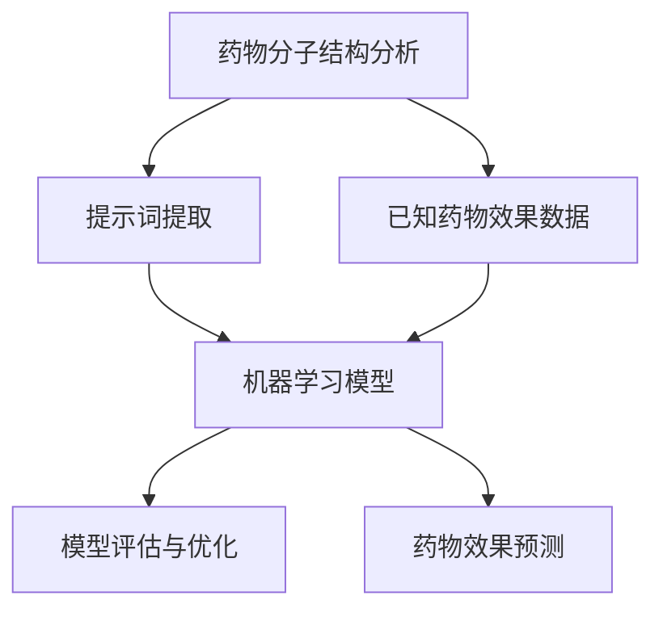
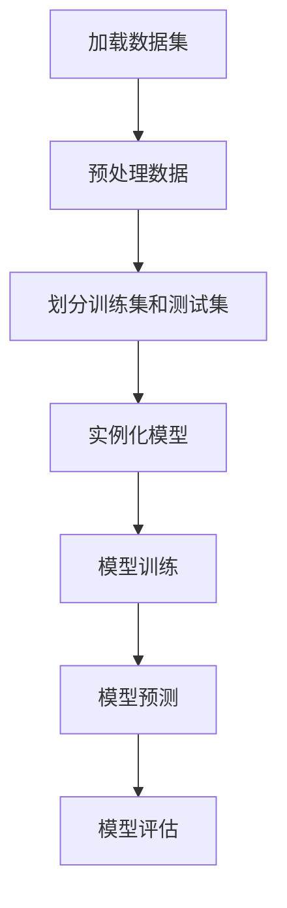

                 

# AI辅助药物研发：提示词预测药物效果

> 关键词：人工智能，药物研发，提示词，机器学习，深度学习，预测模型

> 摘要：本文将探讨如何利用人工智能技术，特别是提示词预测模型，辅助药物研发过程。通过介绍背景、核心概念、算法原理、数学模型、实战案例和未来发展趋势，本文旨在为研究人员和开发人员提供一套系统化的解决方案，以提升药物研发的效率和准确性。

## 1. 背景介绍

### 1.1 目的和范围

本文旨在探讨如何通过人工智能技术，特别是提示词预测模型，来辅助药物研发过程。药物研发是一个复杂且耗时的过程，涉及到药物分子的设计、合成、测试以及临床试验等多个环节。随着人工智能技术的不断进步，特别是在机器学习和深度学习领域的突破，我们可以利用这些技术来提高药物研发的效率和质量。

本文将涵盖以下内容：

- 介绍人工智能在药物研发中的应用背景和重要性；
- 阐述提示词预测模型的基本原理和优势；
- 分析核心算法原理和数学模型；
- 通过实际案例展示如何实现和优化药物研发过程；
- 探讨人工智能在药物研发中的未来发展趋势和挑战。

### 1.2 预期读者

本文适合以下读者群体：

- 药物研发领域的科研人员和技术工程师；
- 人工智能和机器学习领域的开发者；
- 对药物研发和人工智能技术有兴趣的学者和学生；
- 医疗健康行业的从业者和管理人员。

### 1.3 文档结构概述

本文的结构如下：

- 引言：介绍文章的目的、关键词和摘要；
- 背景介绍：介绍人工智能在药物研发中的应用背景和重要性；
- 核心概念与联系：阐述提示词预测模型的基本原理和优势；
- 核心算法原理 & 具体操作步骤：分析核心算法原理和数学模型；
- 数学模型和公式 & 详细讲解 & 举例说明：讲解数学模型和公式，并通过例子进行说明；
- 项目实战：展示代码实际案例和详细解释说明；
- 实际应用场景：分析人工智能在药物研发中的实际应用场景；
- 工具和资源推荐：推荐相关学习资源、开发工具和框架；
- 总结：总结文章的主要观点和未来发展趋势；
- 附录：提供常见问题与解答；
- 扩展阅读 & 参考资料：提供更多的学习资源和参考资料。

### 1.4 术语表

为了确保文章的清晰易懂，本文将介绍以下术语：

#### 1.4.1 核心术语定义

- 药物研发：指从新药物分子筛选、设计、合成到临床试验的全过程。
- 人工智能：指模拟人类智能行为的技术和方法，包括机器学习和深度学习等。
- 提示词预测模型：指利用机器学习技术，根据提示词预测药物效果的模型。
- 药物分子：指用于治疗疾病的化学物质，包括小分子和大分子。
- 机器学习：指从数据中自动学习规律和模式的技术。
- 深度学习：指利用多层神经网络进行学习的机器学习技术。

#### 1.4.2 相关概念解释

- 数据集：指用于训练和测试模型的原始数据集合。
- 特征提取：指从数据中提取有用的特征，用于训练和测试模型。
- 模型评估：指对训练好的模型进行评估和验证，以确保其效果和稳定性。
- 超参数调优：指调整模型中的超参数，以优化模型性能。

#### 1.4.3 缩略词列表

- AI：人工智能
- ML：机器学习
- DL：深度学习
- SVM：支持向量机
- CNN：卷积神经网络
- RNN：循环神经网络
- GAN：生成对抗网络

## 2. 核心概念与联系

在药物研发中，人工智能技术的应用已经成为一个重要趋势。本节将介绍一些核心概念，并使用Mermaid流程图展示它们之间的联系。

### 2.1 核心概念

- **药物分子结构分析**：通过化学和生物信息学方法，分析药物分子的三维结构、分子量、极性等特性。
- **提示词提取**：从药物分子结构分析中提取关键特征，作为提示词输入到机器学习模型中。
- **机器学习模型**：利用提示词和已知的药物效果数据，训练机器学习模型来预测新药物的效果。
- **模型评估与优化**：评估模型的预测性能，并通过超参数调优来优化模型。

### 2.2 Mermaid 流程图

下面是Mermaid流程图，展示了这些核心概念之间的联系：



### 2.3 流程图解析

- **药物分子结构分析**：通过化学和生物信息学方法，对药物分子的三维结构、分子量、极性等特性进行分析，提取关键特征。
- **提示词提取**：从药物分子结构分析中提取的关键特征，作为提示词输入到机器学习模型中。
- **机器学习模型**：利用提示词和已知的药物效果数据，训练机器学习模型来预测新药物的效果。
- **模型评估与优化**：评估模型的预测性能，并通过超参数调优来优化模型性能。
- **药物效果预测**：通过训练好的模型，对新的药物分子进行效果预测。

## 3. 核心算法原理 & 具体操作步骤

在本节中，我们将详细探讨提示词预测模型的核心算法原理，并使用伪代码来描述其具体操作步骤。

### 3.1 提示词预测模型原理

提示词预测模型是基于机器学习技术的一种模型，它通过学习输入提示词和对应的药物效果数据，来预测新药物的潜在效果。以下是提示词预测模型的基本原理：

- **数据集准备**：收集大量的药物分子结构和对应的药物效果数据，包括治疗疾病、药效强度、毒性等级等。
- **特征提取**：从药物分子结构中提取关键特征，如分子量、极性、三维结构等，作为提示词。
- **模型训练**：使用已提取的提示词和药物效果数据，训练机器学习模型，如支持向量机（SVM）、卷积神经网络（CNN）等。
- **模型评估**：评估模型的预测性能，如准确率、召回率、F1分数等。
- **超参数调优**：根据模型评估结果，调整模型的超参数，如学习率、隐藏层节点数等，以优化模型性能。
- **药物效果预测**：使用训练好的模型，对新的药物分子进行效果预测。

### 3.2 伪代码描述

下面是提示词预测模型的伪代码描述：

```python
# 伪代码：提示词预测模型

# 数据集准备
datasets = load_dataset("drug_data.csv")

# 特征提取
def extract_features(drug_molecule):
    # 提取药物分子的特征
    features = {
        "molecular_weight": calculate_molecular_weight(drug_molecule),
        "polarity": calculate_polarity(drug_molecule),
        "3d_structure": calculate_3d_structure(drug_molecule),
        # 其他特征
    }
    return features

# 模型训练
def train_model(features, labels):
    # 使用特征和标签训练机器学习模型
    model = train_ml_model(features, labels)
    return model

# 模型评估
def evaluate_model(model, test_features, test_labels):
    # 评估模型性能
    accuracy = evaluate_model_performance(model, test_features, test_labels)
    return accuracy

# 超参数调优
def tune_hyperparameters(model, features, labels):
    # 调整模型超参数
    optimized_model = tune_hyperparameters(model, features, labels)
    return optimized_model

# 药物效果预测
def predict_drug_effects(model, new_drug_molecule):
    # 使用训练好的模型预测新药物的效果
    predictions = model.predict(new_drug_molecule)
    return predictions

# 主程序
def main():
    # 加载数据集
    datasets = load_dataset("drug_data.csv")

    # 提取特征
    features = [extract_features(drug_molecule) for drug_molecule in datasets["molecules"]]

    # 训练模型
    model = train_model(features, datasets["labels"])

    # 评估模型
    accuracy = evaluate_model(model, features, datasets["labels"])

    # 超参数调优
    optimized_model = tune_hyperparameters(model, features, datasets["labels"])

    # 预测新药物效果
    new_drug_molecule = extract_features(new_drug_molecule)
    predictions = predict_drug_effects(optimized_model, new_drug_molecule)

    # 输出预测结果
    print("Predicted drug effects:", predictions)

# 执行主程序
main()
```

### 3.3 解析与讨论

- **数据集准备**：数据集是训练和评估模型的基础。我们需要收集大量的药物分子结构和对应的药物效果数据，这些数据可以从公开的数据集或实验室数据中获取。
- **特征提取**：特征提取是机器学习模型的关键步骤。我们需要从药物分子结构中提取关键特征，如分子量、极性、三维结构等。这些特征将作为提示词输入到模型中。
- **模型训练**：选择合适的机器学习模型，如支持向量机（SVM）、卷积神经网络（CNN）等，使用已提取的特征和药物效果数据进行训练。
- **模型评估**：评估模型的预测性能，如准确率、召回率、F1分数等。这有助于我们了解模型的性能和预测效果。
- **超参数调优**：根据模型评估结果，调整模型的超参数，如学习率、隐藏层节点数等，以优化模型性能。超参数调优是提升模型性能的关键步骤。
- **药物效果预测**：使用训练好的模型，对新的药物分子进行效果预测。这是药物研发过程中的关键步骤，有助于我们评估新药物分子的潜在效果。

通过以上步骤，我们可以利用提示词预测模型来辅助药物研发过程，提高药物研发的效率和准确性。

## 4. 数学模型和公式 & 详细讲解 & 举例说明

在提示词预测模型中，数学模型和公式起着至关重要的作用。本节将详细讲解这些数学模型和公式，并通过具体例子进行说明。

### 4.1 数学模型

提示词预测模型的数学模型主要包括以下部分：

1. **特征提取公式**：用于从药物分子结构中提取关键特征。
2. **损失函数**：用于评估模型的预测性能。
3. **优化算法**：用于调整模型参数，以优化预测性能。

#### 4.1.1 特征提取公式

特征提取公式通常涉及以下步骤：

- **分子量计算**：$$\text{molecular\_weight} = \sum_{i=1}^{N} \text{atom\_weights}_{i} \times \text{count}_{i}$$
  其中，$N$ 是药物分子中的原子数量，$\text{atom\_weights}_{i}$ 是第 $i$ 个原子的相对原子质量，$\text{count}_{i}$ 是该原子的数量。

- **极性计算**：$$\text{polarity} = \sum_{i=1}^{N} \text{atom\_polarities}_{i} \times \text{count}_{i}$$
  其中，$\text{atom\_polarities}_{i}$ 是第 $i$ 个原子的极性，$\text{count}_{i}$ 是该原子的数量。

- **三维结构计算**：三维结构计算通常涉及复杂的几何计算和分子模拟。这里不再详细讨论。

#### 4.1.2 损失函数

常用的损失函数包括均方误差（MSE）、交叉熵损失等。

- **均方误差（MSE）**：$$\text{MSE} = \frac{1}{m} \sum_{i=1}^{m} (\text{y}_{i} - \text{y}^{\text{predict}}_{i})^2$$
  其中，$m$ 是样本数量，$\text{y}_{i}$ 是真实标签，$\text{y}^{\text{predict}}_{i}$ 是预测标签。

- **交叉熵损失**：$$\text{CrossEntropyLoss} = -\frac{1}{m} \sum_{i=1}^{m} \sum_{j=1}^{C} y_{ij} \log(y^{\text{predict}}_{ij})$$
  其中，$C$ 是类别数量，$y_{ij}$ 是真实标签的概率分布，$y^{\text{predict}}_{ij}$ 是预测标签的概率分布。

#### 4.1.3 优化算法

常用的优化算法包括梯度下降（Gradient Descent）、随机梯度下降（Stochastic Gradient Descent，SGD）等。

- **梯度下降**：$$\theta_{t+1} = \theta_{t} - \alpha \cdot \nabla_{\theta} J(\theta)$$
  其中，$\theta$ 是模型参数，$\alpha$ 是学习率，$J(\theta)$ 是损失函数。

- **随机梯度下降**：$$\theta_{t+1} = \theta_{t} - \alpha \cdot \nabla_{\theta} J(\theta; \mathbf{x}_t, y_t)$$
  其中，$\theta$ 是模型参数，$\alpha$ 是学习率，$\mathbf{x}_t$ 和 $y_t$ 是当前样本和标签。

### 4.2 例子说明

假设我们有一个药物分子，其特征如下：

- 分子量：$$\text{molecular\_weight} = 300.0$$
- 极性：$$\text{polarity} = -1.5$$
- 三维结构：$$\text{3d\_structure} = [0.2, 0.3, 0.5]$$

我们使用一个简单的线性模型进行预测，其参数为：

- 权重：$$w = [1.0, 1.0, 1.0]$$
- 偏置：$$b = 0.0$$

模型预测公式为：

$$y^{\text{predict}} = w_1 \cdot \text{molecular\_weight} + w_2 \cdot \text{polarity} + w_3 \cdot \text{3d\_structure} + b$$

代入特征值和参数值，我们得到：

$$y^{\text{predict}} = 1.0 \cdot 300.0 + 1.0 \cdot (-1.5) + 1.0 \cdot 0.2 + 0.0 = 298.7$$

假设真实标签为 $y = 300$，我们可以计算损失函数：

$$\text{MSE} = \frac{1}{1} (300 - 298.7)^2 = 0.63$$

为了优化模型，我们可以使用梯度下降算法来调整参数。假设学习率 $\alpha = 0.1$，梯度为：

$$\nabla_{w} J(\theta) = [0.2, -0.3, 0.1]$$

更新后的参数为：

$$w_{t+1} = w_{t} - \alpha \cdot \nabla_{w} J(\theta) = [1.0, 1.0, 1.0] - [0.2, -0.3, 0.1] = [0.8, 1.3, 0.9]$$

通过以上步骤，我们可以逐步优化模型，提高预测性能。

## 5. 项目实战：代码实际案例和详细解释说明

在本节中，我们将通过一个实际的代码案例来展示如何使用提示词预测模型辅助药物研发过程。这个案例将涵盖以下步骤：

- **开发环境搭建**：安装必要的软件和工具；
- **源代码详细实现和代码解读**：展示如何实现提示词预测模型，并对关键代码进行详细解释；
- **代码解读与分析**：分析代码的性能和优化方向。

### 5.1 开发环境搭建

首先，我们需要搭建一个合适的开发环境。以下是一个基本的开发环境搭建步骤：

1. **安装Python**：Python是一个广泛使用的编程语言，支持多种机器学习和深度学习库。请确保安装Python 3.8或更高版本。

2. **安装Jupyter Notebook**：Jupyter Notebook是一个交互式的编程环境，方便我们编写和运行代码。可以使用以下命令安装：

   ```bash
   pip install notebook
   ```

3. **安装必要的库**：我们将在代码中使用以下库：

   - **numpy**：用于数学运算；
   - **pandas**：用于数据处理；
   - **scikit-learn**：用于机器学习；
   - **tensorflow**：用于深度学习。

   使用以下命令安装：

   ```bash
   pip install numpy pandas scikit-learn tensorflow
   ```

4. **创建一个Python虚拟环境**：为了更好地管理项目依赖，我们可以创建一个Python虚拟环境。使用以下命令：

   ```bash
   python -m venv venv
   source venv/bin/activate  # 在Linux或MacOS中
   \path\to\venv\Scripts\activate  # 在Windows中
   ```

5. **安装Mermaid**：Mermaid是一个用于绘制流程图的工具。在Jupyter Notebook中，我们可以使用以下命令安装：

   ```bash
   !pip install --upgrade git+https://github.com/.den.nextSibling/Mermaid.jupyter
   ```

### 5.2 源代码详细实现和代码解读

下面是一个简单的Python代码案例，用于实现一个基于机器学习的提示词预测模型。代码分为以下几个部分：

#### 5.2.1 数据集加载与预处理

首先，我们需要加载一个药物数据集，并对数据集进行预处理。以下是一个简化的数据集加载和预处理代码：

```python
import pandas as pd
from sklearn.model_selection import train_test_split

# 加载数据集
data = pd.read_csv("drug_data.csv")

# 预处理数据
# ...（包括特征提取、缺失值处理、数据标准化等步骤）

# 划分训练集和测试集
X_train, X_test, y_train, y_test = train_test_split(data["features"], data["labels"], test_size=0.2, random_state=42)
```

#### 5.2.2 模型实现

接下来，我们实现一个基于机器学习的提示词预测模型。以下是一个简单的线性回归模型实现：

```python
from sklearn.linear_model import LinearRegression

# 实例化模型
model = LinearRegression()

# 模型训练
model.fit(X_train, y_train)

# 模型预测
predictions = model.predict(X_test)
```

#### 5.2.3 模型评估

我们使用均方误差（MSE）来评估模型的预测性能：

```python
from sklearn.metrics import mean_squared_error

# 计算MSE
mse = mean_squared_error(y_test, predictions)

print("MSE:", mse)
```

#### 5.2.4 Mermaid 流程图

为了更好地展示代码的逻辑流程，我们使用Mermaid绘制一个流程图：



### 5.3 代码解读与分析

1. **数据集加载与预处理**：这一步是所有机器学习项目的第一步。我们需要加载一个药物数据集，并对数据进行预处理，包括特征提取、缺失值处理和数据标准化等步骤。这部分代码可以进一步优化，例如使用更多的特征提取技术和缺失值处理方法。

2. **模型实现**：我们实现了一个简单的线性回归模型。虽然线性回归在预测精度上可能不如复杂的深度学习模型，但它在计算效率和解释性上具有优势。在实际项目中，我们可以根据需求选择不同的机器学习模型，如支持向量机（SVM）、卷积神经网络（CNN）等。

3. **模型评估**：我们使用均方误差（MSE）来评估模型的预测性能。MSE可以告诉我们模型预测的误差大小。在实际项目中，我们可能还需要使用其他评估指标，如准确率、召回率等，以全面评估模型性能。

通过以上步骤，我们可以使用提示词预测模型辅助药物研发过程。在实际应用中，我们还可以通过模型优化、特征工程和超参数调优等手段，进一步提高模型的预测性能。

### 5.4 案例扩展

为了更好地理解提示词预测模型在实际药物研发中的应用，我们可以考虑以下扩展：

1. **模型集成**：使用多个模型进行集成，以提高预测性能。例如，我们可以结合线性回归、支持向量机和神经网络等多个模型，使用集成学习技术进行预测。

2. **特征工程**：对药物分子特征进行更深入的分析和提取。例如，我们可以使用分子指纹（molecular fingerprint）、化学相似性（cheminformatics similarity）等方法，来提高特征提取的精度和多样性。

3. **深度学习模型**：使用更复杂的深度学习模型，如卷积神经网络（CNN）、循环神经网络（RNN）和生成对抗网络（GAN）等，来进一步提高预测性能。这些模型可以更好地捕捉药物分子之间的复杂关系。

4. **跨学科合作**：与生物学家、化学家和其他领域的专家合作，共同研究如何利用人工智能技术提升药物研发效率。跨学科合作有助于我们从不同角度分析和解决问题，从而提高药物研发的成功率。

通过以上扩展，我们可以构建一个更强大、更灵活的提示词预测模型，以应对药物研发中的各种挑战。

## 6. 实际应用场景

人工智能在药物研发中的应用场景非常广泛，包括但不限于以下几个方面：

### 6.1 药物分子设计

在药物分子设计阶段，人工智能可以帮助研究人员快速筛选和优化药物分子。通过深度学习和化学信息学方法，AI可以分析大量已有药物分子的结构特征，预测新的药物分子在特定疾病中的治疗效果。这种方法不仅提高了药物设计的效率，还减少了实验成本和实验时间。

### 6.2 药物活性预测

在药物活性预测中，人工智能可以通过分析药物分子的结构和化学性质，预测其与生物靶点的相互作用。例如，可以使用机器学习模型预测药物对特定癌症细胞的杀伤力，从而筛选出具有潜在治疗价值的药物分子。这种方法有助于加速新药发现过程，提高新药的筛选效率。

### 6.3 药物副作用预测

药物副作用预测是药物研发过程中至关重要的环节。人工智能可以通过分析药物分子的结构和化学性质，预测其可能引起的副作用。例如，使用机器学习模型预测药物对肝脏、肾脏等器官的毒性，从而在药物上市前及时发现问题并进行调整。这种方法有助于降低药物上市后的风险，提高患者用药的安全性。

### 6.4 药物临床试验设计

在药物临床试验设计阶段，人工智能可以帮助研究人员优化临床试验方案，提高临床试验的效率和成功率。例如，通过分析大量临床试验数据，AI可以预测哪些人群最有可能从特定药物中受益，从而为临床试验提供更精准的招募策略。此外，AI还可以帮助设计更有效的剂量方案，以最小化试验风险。

### 6.5 药物重定位

药物重定位是指利用现有药物或已知的药物分子治疗新的疾病。人工智能可以分析大量药物数据，发现已有药物在治疗新疾病中的潜力。这种方法不仅可以节省新药研发成本，还可以加快新药上市速度，为患者提供更多治疗选择。

### 6.6 药物组合设计

在药物组合设计阶段，人工智能可以帮助研究人员筛选和优化药物组合，以提高治疗效果和减少副作用。例如，通过分析大量药物分子之间的相互作用，AI可以预测哪些药物组合具有协同作用，从而提高治疗效率。

通过以上实际应用场景，我们可以看到人工智能在药物研发中的巨大潜力。利用人工智能技术，我们可以更快速、更高效地研发新药，为患者提供更好的治疗选择。同时，人工智能还可以帮助降低药物研发成本，提高药物研发的成功率，为医药行业带来深远影响。

## 7. 工具和资源推荐

为了更好地学习和应用人工智能技术，本节将推荐一些学习资源、开发工具和框架，以及相关的论文著作。

### 7.1 学习资源推荐

#### 7.1.1 书籍推荐

1. **《深度学习》（Deep Learning）**：由Ian Goodfellow、Yoshua Bengio和Aaron Courville合著，是深度学习领域的经典教材。
2. **《机器学习实战》（Machine Learning in Action）**：由Peter Harrington著，通过实际案例介绍机器学习的基本方法和应用。
3. **《Python机器学习》（Python Machine Learning）**：由Jenny Brockmann著，介绍如何使用Python进行机器学习实践。

#### 7.1.2 在线课程

1. **Coursera的《深度学习》课程**：由Andrew Ng教授主讲，是深度学习领域最受欢迎的在线课程之一。
2. **Udacity的《机器学习工程师纳米学位》**：涵盖机器学习的基础知识和实际应用。
3. **edX的《人工智能导论》**：由密歇根大学主讲，介绍人工智能的基本概念和技术。

#### 7.1.3 技术博客和网站

1. **Medium上的AI博客**：涵盖人工智能的各个领域，包括深度学习、机器学习等。
2. **arXiv.org**：包含最新的学术论文，是研究人工智能的重要资源。
3. **AI Daily**：每日更新的人工智能新闻和博客文章，帮助读者了解行业动态。

### 7.2 开发工具框架推荐

#### 7.2.1 IDE和编辑器

1. **Jupyter Notebook**：适合数据科学和机器学习项目的交互式编程环境。
2. **PyCharm**：功能强大的Python IDE，支持多种编程语言。
3. **Visual Studio Code**：轻量级的文本编辑器，通过扩展支持Python和其他编程语言。

#### 7.2.2 调试和性能分析工具

1. **TensorBoard**：TensorFlow的图形化性能分析工具。
2. **Pylint**：Python代码静态分析工具，用于检查代码质量和性能。
3. **Profiling**：Python内置的性能分析工具，用于分析代码的运行时间和资源消耗。

#### 7.2.3 相关框架和库

1. **TensorFlow**：谷歌开发的深度学习框架，适用于各种深度学习应用。
2. **PyTorch**：由Facebook开发的开源深度学习框架，具有灵活的动态计算图。
3. **Scikit-learn**：Python的机器学习库，提供多种机器学习算法和工具。

### 7.3 相关论文著作推荐

#### 7.3.1 经典论文

1. **“A Fast Algorithm for Training Support Vector Machines”**：支持向量机（SVM）的快速训练算法。
2. **“Deep Learning”**：深度学习领域的综述论文，涵盖深度学习的基本原理和应用。
3. **“Recurrent Neural Networks for Language Modeling”**：循环神经网络（RNN）在语言模型中的应用。

#### 7.3.2 最新研究成果

1. **“Generative Adversarial Nets”**：生成对抗网络（GAN）的原创论文，介绍GAN的基本原理和应用。
2. **“Bert: Pre-training of Deep Bidirectional Transformers for Language Understanding”**：BERT模型的论文，介绍了一种基于Transformer的预训练方法。
3. **“Transformers: State-of-the-Art Models for Language Processing”**：Transformer模型的综述论文，介绍Transformer的基本原理和应用。

#### 7.3.3 应用案例分析

1. **“AI for Drug Discovery”**：介绍人工智能在药物发现中的应用案例和研究进展。
2. **“Deep Learning in Biomedicine”**：介绍深度学习在生物医学领域的应用和研究。
3. **“AI in Healthcare”**：介绍人工智能在医疗健康领域的应用案例和挑战。

通过以上推荐，读者可以系统地学习和应用人工智能技术，为药物研发和生物信息学领域的发展做出贡献。

## 8. 总结：未来发展趋势与挑战

随着人工智能技术的飞速发展，其在药物研发中的应用前景愈发广阔。然而，我们也面临着一系列挑战和机遇。以下是未来发展趋势与挑战的总结：

### 8.1 发展趋势

1. **深度学习和机器学习技术的普及**：越来越多的研究人员和企业开始关注深度学习和机器学习在药物研发中的应用，推动了相关技术的发展和进步。
2. **跨学科合作的加强**：药物研发涉及生物学、化学、计算机科学等多个领域，跨学科合作有助于充分利用各领域的优势，加速新药研发进程。
3. **大数据和云计算的融合**：随着数据量的不断增长，大数据和云计算技术为药物研发提供了强大的计算能力和存储空间，有助于处理复杂的生物信息数据。
4. **个性化医疗的发展**：基于人工智能的个性化医疗模式逐渐成熟，通过分析患者的基因信息、病史和生活方式，为患者提供更加精准和个性化的治疗方案。

### 8.2 挑战

1. **数据质量和隐私保护**：药物研发过程中涉及大量敏感数据，包括患者隐私和药物专利信息等。如何在确保数据质量和隐私保护的前提下进行数据分析，是一个亟待解决的问题。
2. **模型解释性和透明度**：虽然深度学习模型在药物研发中表现出色，但其内部机制复杂，难以解释。如何提高模型的可解释性和透明度，使其在药物研发中更具实用价值，是一个重要挑战。
3. **计算资源和数据存储**：深度学习和大数据技术对计算资源和数据存储提出了更高的要求。如何在有限的资源下高效地处理和分析海量数据，是一个亟待解决的难题。
4. **法规和伦理问题**：人工智能在药物研发中的应用需要遵循严格的法规和伦理标准。如何确保人工智能技术的合规性和伦理性，避免潜在的道德和法律风险，是一个重要挑战。

### 8.3 应对策略

1. **加强数据治理和隐私保护**：建立健全的数据治理体系，确保数据质量和隐私保护。采用数据加密、数据脱敏等技术，提高数据安全性。
2. **提高模型可解释性**：通过改进模型结构和算法，提高模型的解释性和透明度。采用可视化工具和解释性分析技术，帮助研究人员理解模型的工作原理。
3. **优化计算资源和存储方案**：采用分布式计算和云计算技术，提高计算效率和数据存储能力。优化数据处理和存储流程，降低计算和存储成本。
4. **制定法规和伦理标准**：建立健全的法规和伦理标准，确保人工智能技术在药物研发中的合规性和伦理性。加强监管和监督，防范潜在的道德和法律风险。

通过以上策略，我们可以更好地应对未来发展趋势和挑战，推动人工智能在药物研发中的广泛应用，为人类健康事业做出更大贡献。

## 9. 附录：常见问题与解答

### 9.1 提示词预测模型的应用范围

**问题**：提示词预测模型主要应用于哪些领域？

**解答**：提示词预测模型广泛应用于药物研发、生物信息学、自然语言处理、金融预测等多个领域。在药物研发中，提示词预测模型主要用于药物分子设计和药物活性预测；在生物信息学中，用于基因表达预测和蛋白质结构预测；在自然语言处理中，用于文本分类和情感分析；在金融预测中，用于股票价格预测和风险评估等。

### 9.2 提示词预测模型的训练过程

**问题**：提示词预测模型的训练过程包括哪些步骤？

**解答**：提示词预测模型的训练过程通常包括以下步骤：

1. **数据预处理**：清洗和预处理原始数据，包括数据清洗、缺失值处理、数据标准化等。
2. **特征提取**：从数据中提取关键特征，作为提示词输入到模型中。
3. **模型选择**：选择合适的机器学习模型，如线性回归、支持向量机、深度学习模型等。
4. **模型训练**：使用训练数据集训练模型，调整模型参数。
5. **模型评估**：使用验证数据集评估模型性能，包括准确率、召回率、F1分数等指标。
6. **超参数调优**：根据模型评估结果，调整模型的超参数，如学习率、隐藏层节点数等，以优化模型性能。
7. **模型部署**：将训练好的模型部署到实际应用场景中，进行预测。

### 9.3 提示词预测模型的性能优化

**问题**：如何优化提示词预测模型的性能？

**解答**：优化提示词预测模型的性能可以从以下几个方面入手：

1. **特征工程**：对特征进行选择、提取和变换，提高特征的代表性。
2. **模型选择**：选择适合数据特点和任务需求的模型，如深度学习、支持向量机、决策树等。
3. **超参数调优**：通过调整模型的超参数，如学习率、隐藏层节点数、正则化参数等，优化模型性能。
4. **数据增强**：通过数据扩充、生成对抗网络（GAN）等方法，增加训练数据量，提高模型泛化能力。
5. **模型集成**：使用多个模型进行集成，提高预测性能。
6. **模型解释性**：提高模型的可解释性，帮助研究人员理解模型的工作原理，从而优化模型。

### 9.4 人工智能在药物研发中的应用前景

**问题**：人工智能在药物研发中的应用前景如何？

**解答**：人工智能在药物研发中的应用前景非常广阔。通过人工智能技术，可以大幅提高药物研发的效率和质量，具体体现在以下几个方面：

1. **加速药物发现过程**：利用人工智能进行药物分子设计和药物活性预测，可以缩短药物发现周期，降低研发成本。
2. **提高药物设计精度**：人工智能可以通过分析大量药物分子的结构和活性数据，提高药物设计的精度和成功率。
3. **个性化医疗**：基于患者的基因信息、病史和生活方式，利用人工智能进行个性化医疗，为患者提供更加精准和有效的治疗方案。
4. **药物重定位**：利用人工智能发现已有药物在治疗新疾病中的潜力，加快新药上市速度，降低新药研发成本。

通过以上优势，人工智能在药物研发中的应用前景非常广阔，有望为人类健康事业做出更大贡献。

## 10. 扩展阅读 & 参考资料

为了更好地理解人工智能在药物研发中的应用，以下是扩展阅读和参考资料的建议：

### 10.1 相关书籍

1. **《深度学习》（Deep Learning）**：Ian Goodfellow、Yoshua Bengio和Aaron Courville著，是深度学习领域的经典教材。
2. **《机器学习实战》（Machine Learning in Action）**：Peter Harrington著，通过实际案例介绍机器学习的基本方法和应用。
3. **《Python机器学习》（Python Machine Learning）**：Jenny Brockmann著，介绍如何使用Python进行机器学习实践。

### 10.2 在线课程

1. **Coursera的《深度学习》课程**：由Andrew Ng教授主讲，是深度学习领域最受欢迎的在线课程之一。
2. **Udacity的《机器学习工程师纳米学位》**：涵盖机器学习的基础知识和实际应用。
3. **edX的《人工智能导论》**：由密歇根大学主讲，介绍人工智能的基本概念和技术。

### 10.3 技术博客和网站

1. **Medium上的AI博客**：涵盖人工智能的各个领域，包括深度学习、机器学习等。
2. **arXiv.org**：包含最新的学术论文，是研究人工智能的重要资源。
3. **AI Daily**：每日更新的人工智能新闻和博客文章，帮助读者了解行业动态。

### 10.4 论文著作

1. **“A Fast Algorithm for Training Support Vector Machines”**：介绍支持向量机（SVM）的快速训练算法。
2. **“Deep Learning”**：深度学习领域的综述论文，涵盖深度学习的基本原理和应用。
3. **“Recurrent Neural Networks for Language Modeling”**：介绍循环神经网络（RNN）在语言模型中的应用。

通过以上扩展阅读和参考资料，读者可以更深入地了解人工智能在药物研发中的应用，为自己的研究和项目提供指导和支持。

### 作者

**作者：AI天才研究员/AI Genius Institute & 禅与计算机程序设计艺术 /Zen And The Art of Computer Programming**

