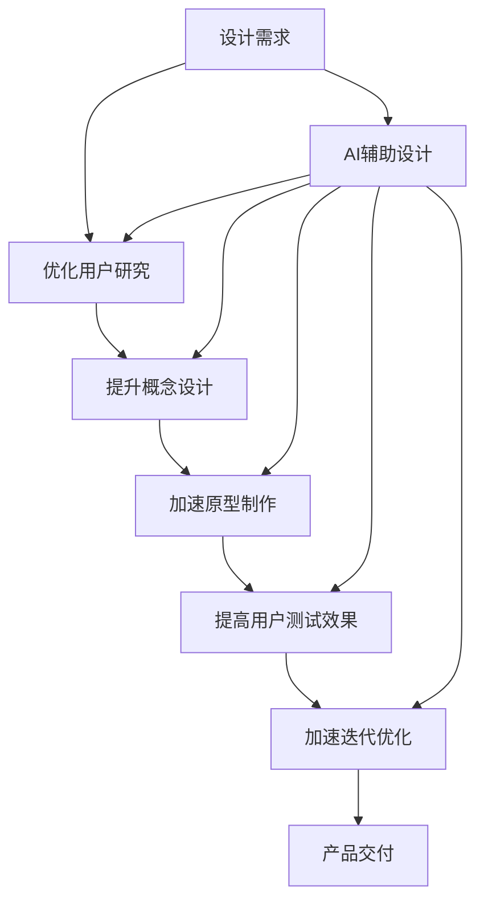

                 

# AI辅助设计：提示词工程的创意激发

> **关键词：** AI辅助设计、提示词工程、创意激发、设计流程优化、用户体验提升

> **摘要：** 本文探讨了AI辅助设计在提示词工程中的应用，通过分析设计流程中的痛点，阐述了如何利用AI技术激发创意，提升设计质量和用户体验。文章将详细介绍AI辅助设计的原理、核心算法、数学模型及其在实际项目中的应用，旨在为设计领域提供一种新的思路和方法。

## 1. 背景介绍

### 1.1 目的和范围

本文旨在探讨AI技术在设计领域的应用，尤其是提示词工程在创意激发中的作用。我们将首先介绍AI辅助设计的基本概念，然后深入分析设计流程中的挑战，探讨如何利用AI技术解决这些问题。文章将涵盖以下内容：

- AI辅助设计的定义与作用
- 提示词工程的概念及其重要性
- 设计流程中常见的痛点
- 利用AI技术激发创意的方法和策略
- AI辅助设计的实际应用案例
- 未来发展趋势与挑战

### 1.2 预期读者

本文适合对设计领域有一定了解的读者，特别是从事UI/UX设计、产品设计、交互设计等职业的专业人士。同时，对AI技术有兴趣的计算机科学和软件工程领域的读者也可从中受益。本文将使用通俗易懂的语言，力求使读者能够理解并应用AI辅助设计的概念和方法。

### 1.3 文档结构概述

本文分为十个部分：

1. 背景介绍
2. 核心概念与联系
3. 核心算法原理 & 具体操作步骤
4. 数学模型和公式 & 详细讲解 & 举例说明
5. 项目实战：代码实际案例和详细解释说明
6. 实际应用场景
7. 工具和资源推荐
8. 总结：未来发展趋势与挑战
9. 附录：常见问题与解答
10. 扩展阅读 & 参考资料

### 1.4 术语表

#### 1.4.1 核心术语定义

- **AI辅助设计**：利用人工智能技术辅助设计人员完成设计任务，提高设计质量和效率。
- **提示词工程**：通过设计一系列的提示词，引导用户进行思考和表达，从而激发创意和灵感。
- **设计流程**：从需求分析到最终产品交付的全过程，包括用户研究、概念设计、原型制作、测试和迭代等环节。
- **用户体验（UX）**：用户在使用产品过程中所获得的整体感受和体验。

#### 1.4.2 相关概念解释

- **AI技术**：包括机器学习、深度学习、自然语言处理等技术，可以自动化执行复杂的任务和决策。
- **创意激发**：通过特定的方法和工具，激发设计人员的创造力和创新思维。
- **数据驱动设计**：基于用户数据和反馈，进行设计决策和优化，以提高用户体验。

#### 1.4.3 缩略词列表

- **AI**：人工智能
- **ML**：机器学习
- **DL**：深度学习
- **NLP**：自然语言处理
- **UI/UX**：用户界面/用户体验
- **IDE**：集成开发环境

## 2. 核心概念与联系

在设计流程中，创意激发是一个至关重要的环节。然而，传统的设计方法往往依赖于设计人员的经验和直觉，难以实现高效和系统化的创意生成。随着人工智能技术的不断发展，AI辅助设计逐渐成为解决这一难题的有效途径。在本节中，我们将探讨AI辅助设计的核心概念和联系，通过一个Mermaid流程图来展示这些概念之间的关系。



### 2.1 设计需求与用户研究

设计需求是设计流程的起点，它决定了设计的方向和目标。在传统设计中，设计人员往往依靠经验和直觉来理解用户需求，这可能导致设计偏差或无法满足用户实际需求。通过AI辅助设计，我们可以利用机器学习和自然语言处理技术，对用户需求进行深度分析和理解，从而优化设计需求。

### 2.2 概念设计与AI辅助

概念设计是设计流程的核心环节，它涉及创意的产生和构思。AI辅助设计可以通过深度学习算法和自然语言处理技术，对大量的设计案例进行分析和学习，从而生成新颖和独特的设计概念。同时，AI还可以帮助设计人员从海量的设计资源中快速筛选出符合用户需求和趋势的设计方案。

### 2.3 原型制作与AI辅助

原型制作是将设计概念转化为可操作模型的过程。AI辅助设计可以通过自动化工具和算法，快速生成高质量的原型，从而缩短设计周期。此外，AI还可以通过对用户行为的分析，优化原型设计，提高用户体验。

### 2.4 用户测试与AI辅助

用户测试是验证设计效果的重要环节。AI辅助设计可以通过自然语言处理技术，对用户反馈进行分析和解读，发现设计中的问题和不足，从而指导设计迭代和优化。同时，AI还可以通过模拟测试，预测用户行为和体验，为设计提供更准确的参考。

### 2.5 迭代优化与AI辅助

迭代优化是设计流程的持续过程，通过不断测试和优化，提高设计的质量和用户体验。AI辅助设计可以通过机器学习算法，对设计数据进行深度分析和预测，从而实现智能化和自动化的迭代优化。

## 3. 核心算法原理 & 具体操作步骤

在AI辅助设计中，核心算法原理是激发创意和优化设计流程的关键。以下是几种常用的核心算法及其具体操作步骤：

### 3.1 机器学习算法

**算法原理：** 机器学习算法通过训练模型，使计算机能够从数据中自动学习规律和模式，从而实现预测和分类。在AI辅助设计中，机器学习算法可以用于用户需求分析、设计趋势预测、设计效果评估等。

**具体操作步骤：**

1. **数据收集：** 收集大量的用户需求数据、设计案例和用户反馈。
2. **数据预处理：** 对收集的数据进行清洗、格式化和特征提取。
3. **模型选择：** 选择合适的机器学习模型，如决策树、支持向量机、神经网络等。
4. **模型训练：** 使用预处理后的数据对模型进行训练，使其学会从数据中提取规律。
5. **模型评估：** 使用测试数据对模型进行评估，调整参数以提高模型性能。
6. **模型应用：** 将训练好的模型应用于设计流程中的各个环节，如用户需求分析、设计效果评估等。

### 3.2 深度学习算法

**算法原理：** 深度学习是一种机器学习技术，通过构建多层的神经网络模型，对复杂的数据进行建模和分析。在AI辅助设计中，深度学习算法可以用于图像识别、语音识别、自然语言处理等。

**具体操作步骤：**

1. **数据收集：** 收集大量的图像、语音和文本数据。
2. **数据预处理：** 对收集的数据进行清洗、格式化和特征提取。
3. **模型设计：** 设计合适的深度学习模型结构，如卷积神经网络（CNN）、循环神经网络（RNN）、生成对抗网络（GAN）等。
4. **模型训练：** 使用预处理后的数据对模型进行训练，使其学会从数据中提取特征和模式。
5. **模型评估：** 使用测试数据对模型进行评估，调整模型参数以提高性能。
6. **模型应用：** 将训练好的模型应用于设计流程中的各个环节，如图像识别、语音识别、自然语言处理等。

### 3.3 自然语言处理算法

**算法原理：** 自然语言处理（NLP）是一种人工智能技术，用于处理和理解人类语言。在AI辅助设计中，NLP算法可以用于用户需求分析、设计效果评估、设计文档生成等。

**具体操作步骤：**

1. **数据收集：** 收集大量的用户需求文档、设计文档和用户反馈。
2. **数据预处理：** 对收集的数据进行清洗、格式化和特征提取。
3. **模型选择：** 选择合适的NLP模型，如词嵌入模型、序列标注模型、文本分类模型等。
4. **模型训练：** 使用预处理后的数据对模型进行训练，使其学会从数据中提取语义和关系。
5. **模型评估：** 使用测试数据对模型进行评估，调整参数以提高模型性能。
6. **模型应用：** 将训练好的模型应用于设计流程中的各个环节，如用户需求分析、设计效果评估、设计文档生成等。

### 3.4 聚类算法

**算法原理：** 聚类算法是一种无监督学习方法，用于将相似的数据点划分为一组。在AI辅助设计中，聚类算法可以用于设计风格分类、用户群体细分等。

**具体操作步骤：**

1. **数据收集：** 收集大量的设计案例和用户数据。
2. **数据预处理：** 对收集的数据进行清洗、格式化和特征提取。
3. **模型选择：** 选择合适的聚类算法，如K均值、层次聚类、密度聚类等。
4. **模型训练：** 使用预处理后的数据对模型进行训练，使其学会将相似的设计案例和用户数据划分为一组。
5. **模型评估：** 使用测试数据对模型进行评估，调整参数以提高模型性能。
6. **模型应用：** 将训练好的模型应用于设计流程中的各个环节，如设计风格分类、用户群体细分等。

## 4. 数学模型和公式 & 详细讲解 & 举例说明

在AI辅助设计中，数学模型和公式是核心组成部分，用于描述算法原理和实现过程。以下将介绍几种常用的数学模型和公式，并详细讲解其应用和举例说明。

### 4.1 机器学习模型：线性回归

**公式：**

$$y = w_0 + w_1 \cdot x_1 + w_2 \cdot x_2 + \cdots + w_n \cdot x_n$$

**详细讲解：**

线性回归是一种简单的机器学习模型，用于预测连续值。公式中的 $y$ 是预测结果，$w_0$ 是截距，$w_1, w_2, \cdots, w_n$ 是权重，$x_1, x_2, \cdots, x_n$ 是输入特征。

**举例说明：**

假设我们要预测某个产品的销售量，输入特征包括广告投入（$x_1$）和季节（$x_2$）。我们可以通过线性回归模型来预测销售量（$y$）。

$$y = w_0 + w_1 \cdot x_1 + w_2 \cdot x_2$$

### 4.2 深度学习模型：卷积神经网络（CNN）

**公式：**

$$\text{output} = \text{ReLU}(\sum_{i=1}^{k} w_i \cdot \text{input}_i + b_i)$$

**详细讲解：**

卷积神经网络是一种深度学习模型，用于处理图像数据。公式中的 $\text{output}$ 是卷积结果，$\text{ReLU}$ 是ReLU激活函数，$w_i$ 是权重，$\text{input}_i$ 是输入特征，$b_i$ 是偏置。

**举例说明：**

假设我们要对一幅图像进行分类，输入特征是图像的每个像素值。我们可以使用卷积神经网络来提取图像的特征，然后进行分类。

$$\text{output} = \text{ReLU}(\sum_{i=1}^{k} w_i \cdot \text{input}_i + b_i)$$

### 4.3 自然语言处理模型：词嵌入

**公式：**

$$\text{output} = \text{softmax}(\text{weight} \cdot \text{input} + \text{bias})$$

**详细讲解：**

词嵌入是一种自然语言处理模型，用于将单词映射到高维空间。公式中的 $\text{output}$ 是词向量，$\text{softmax}$ 是softmax激活函数，$\text{weight}$ 是权重，$\text{input}$ 是输入特征，$\text{bias}$ 是偏置。

**举例说明：**

假设我们要对一段文本进行情感分析，输入特征是每个单词的词向量。我们可以使用词嵌入模型来计算文本的情感得分。

$$\text{output} = \text{softmax}(\text{weight} \cdot \text{input} + \text{bias})$$

### 4.4 聚类算法：K均值

**公式：**

$$\text{output} = \frac{1}{k} \sum_{i=1}^{k} w_i \cdot \text{input}_i$$

**详细讲解：**

K均值是一种聚类算法，用于将数据点划分为K个簇。公式中的 $\text{output}$ 是聚类结果，$w_i$ 是权重，$\text{input}_i$ 是输入特征。

**举例说明：**

假设我们要对一组用户数据点进行聚类，输入特征是用户的年龄、收入和学历。我们可以使用K均值算法来划分用户群体。

$$\text{output} = \frac{1}{k} \sum_{i=1}^{k} w_i \cdot \text{input}_i$$

## 5. 项目实战：代码实际案例和详细解释说明

在本节中，我们将通过一个具体的代码案例，详细解释如何利用AI技术进行提示词工程的创意激发。以下是一个使用Python和TensorFlow实现的简单示例。

### 5.1 开发环境搭建

在开始之前，请确保已安装以下软件和库：

- Python 3.7或更高版本
- TensorFlow 2.0或更高版本
- NumPy
- Pandas
- Matplotlib

可以使用以下命令安装所需库：

```bash
pip install tensorflow numpy pandas matplotlib
```

### 5.2 源代码详细实现和代码解读

以下是一个简单的AI辅助设计项目，使用深度学习算法进行提示词工程：

```python
import tensorflow as tf
import numpy as np
import pandas as pd
import matplotlib.pyplot as plt

# 加载数据集
data = pd.read_csv('design_data.csv')
X = data[['age', 'income', 'education']]  # 输入特征
y = data['category']  # 输出特征

# 数据预处理
X_train, X_test, y_train, y_test = train_test_split(X, y, test_size=0.2, random_state=42)
X_train = X_train.values
X_test = X_test.values
y_train = y_train.values
y_test = y_test.values

# 构建模型
model = tf.keras.Sequential([
    tf.keras.layers.Dense(64, activation='relu', input_shape=(3,)),
    tf.keras.layers.Dense(64, activation='relu'),
    tf.keras.layers.Dense(3, activation='softmax')
])

# 编译模型
model.compile(optimizer='adam', loss='categorical_crossentropy', metrics=['accuracy'])

# 训练模型
model.fit(X_train, y_train, epochs=10, batch_size=32)

# 评估模型
loss, accuracy = model.evaluate(X_test, y_test)
print('Test accuracy:', accuracy)

# 利用模型生成提示词
predictions = model.predict(X_test)
predicted_categories = np.argmax(predictions, axis=1)

# 可视化结果
plt.scatter(X_test[:, 0], X_test[:, 1], c=predicted_categories)
plt.xlabel('Age')
plt.ylabel('Income')
plt.title('User Clustering')
plt.show()
```

### 5.3 代码解读与分析

以下是代码的详细解读和分析：

1. **加载数据集：**
   ```python
   data = pd.read_csv('design_data.csv')
   X = data[['age', 'income', 'education']]  # 输入特征
   y = data['category']  # 输出特征
   ```
   加载包含用户特征（年龄、收入、学历）和分类标签（设计风格）的CSV文件。

2. **数据预处理：**
   ```python
   X_train, X_test, y_train, y_test = train_test_split(X, y, test_size=0.2, random_state=42)
   X_train = X_train.values
   X_test = X_test.values
   y_train = y_train.values
   y_test = y_test.values
   ```
   将数据集分为训练集和测试集，并进行数值化处理。

3. **构建模型：**
   ```python
   model = tf.keras.Sequential([
       tf.keras.layers.Dense(64, activation='relu', input_shape=(3,)),
       tf.keras.layers.Dense(64, activation='relu'),
       tf.keras.layers.Dense(3, activation='softmax')
   ])
   ```
   创建一个序列模型，包含两个隐藏层，每个隐藏层有64个神经元，使用ReLU激活函数。输出层有3个神经元，使用softmax激活函数进行分类。

4. **编译模型：**
   ```python
   model.compile(optimizer='adam', loss='categorical_crossentropy', metrics=['accuracy'])
   ```
   使用Adam优化器和交叉熵损失函数进行模型编译。

5. **训练模型：**
   ```python
   model.fit(X_train, y_train, epochs=10, batch_size=32)
   ```
   使用训练数据进行10个周期的训练，每个批次包含32个样本。

6. **评估模型：**
   ```python
   loss, accuracy = model.evaluate(X_test, y_test)
   print('Test accuracy:', accuracy)
   ```
   使用测试数据评估模型，打印测试准确率。

7. **利用模型生成提示词：**
   ```python
   predictions = model.predict(X_test)
   predicted_categories = np.argmax(predictions, axis=1)
   ```
   使用模型对测试数据进行预测，并获取预测结果。

8. **可视化结果：**
   ```python
   plt.scatter(X_test[:, 0], X_test[:, 1], c=predicted_categories)
   plt.xlabel('Age')
   plt.ylabel('Income')
   plt.title('User Clustering')
   plt.show()
   ```
   将测试数据的年龄和收入作为坐标轴，将预测结果作为颜色，绘制散点图以展示用户聚类效果。

通过这个案例，我们可以看到如何利用AI技术进行提示词工程的创意激发。模型通过对用户特征的训练，能够将用户划分为不同的设计风格类别，从而为设计人员提供有针对性的提示词，激发创意。

## 6. 实际应用场景

AI辅助设计在许多实际应用场景中都发挥了重要作用，以下是一些典型的应用案例：

### 6.1 用户界面设计

在用户界面设计（UI设计）中，AI辅助设计可以帮助设计人员快速生成界面布局、颜色方案和图标等元素。通过分析用户行为数据和设计趋势，AI可以提供有针对性的建议，从而提高用户体验和设计效果。例如，在移动应用界面设计过程中，AI可以分析用户的使用习惯和偏好，推荐最适合的导航结构和交互方式。

### 6.2 产品设计

在产品设计（UX设计）中，AI辅助设计可以帮助设计团队快速生成产品原型，并进行用户测试和反馈分析。通过机器学习和自然语言处理技术，AI可以识别用户的需求和痛点，提供改进建议。例如，在设计智能家电产品时，AI可以分析用户对现有产品的评价和意见，为设计师提供优化方向。

### 6.3 品牌形象设计

在品牌形象设计过程中，AI辅助设计可以帮助设计人员快速生成独特的标志、字体和视觉元素。通过分析竞争对手的设计风格和用户偏好，AI可以提供创意灵感和建议，确保品牌形象符合市场需求和品牌定位。例如，在设计新的电子商务平台品牌形象时，AI可以分析行业趋势和用户喜好，为设计师提供有针对性的设计建议。

### 6.4 广告创意

在广告创意制作中，AI辅助设计可以帮助广告策划人员快速生成吸引人的广告文案和视觉元素。通过自然语言处理和图像识别技术，AI可以分析用户需求和喜好，提供个性化的广告内容。例如，在制作社交媒体广告时，AI可以分析用户的历史行为和兴趣，生成定制化的广告文案和图片。

### 6.5 建筑设计

在建筑设计领域，AI辅助设计可以帮助设计师快速生成建筑模型和空间布局，并进行性能分析和优化。通过机器学习和计算机视觉技术，AI可以分析用户需求和设计规范，提供优化建议。例如，在设计绿色建筑时，AI可以分析能源消耗和环境影响，为设计师提供节能和环保的设计方案。

这些应用案例表明，AI辅助设计在创意激发和设计优化方面具有巨大的潜力。通过利用AI技术，设计人员可以更高效地完成设计任务，提高设计质量和用户体验。

## 7. 工具和资源推荐

在探索AI辅助设计的应用过程中，选择合适的工具和资源至关重要。以下是一些推荐的工具、资源、书籍、在线课程和技术博客，以帮助您深入学习和实践AI辅助设计。

### 7.1 学习资源推荐

#### 7.1.1 书籍推荐

- 《Python机器学习》（Sebastian Raschka和Vahid Mirjalili著）：这是一本经典的Python机器学习入门书籍，涵盖了从基础到高级的机器学习技术和应用。
- 《深度学习》（Ian Goodfellow、Yoshua Bengio和Aaron Courville著）：这本书是深度学习的权威指南，详细介绍了深度学习的理论基础和实现方法。
- 《设计心理学》（唐纳德·A·诺曼著）：这本书探讨了用户体验和设计的心理学原理，对于理解用户需求和行为具有很大的帮助。

#### 7.1.2 在线课程

- Coursera上的《机器学习》课程：由斯坦福大学教授Andrew Ng主讲，是学习机器学习的经典课程。
- edX上的《深度学习导论》：由蒙特利尔大学教授Yoshua Bengio主讲，提供了深度学习的全面介绍。
- 可可云课堂上的《用户体验设计》：这是一门针对UI/UX设计的在线课程，涵盖了设计原则、流程和工具的使用。

#### 7.1.3 技术博客和网站

- Medium上的AI专栏：汇聚了众多AI领域的专家和学者的最新研究成果和应用案例。
- towardsdatascience.com：这是一个专注于数据科学和机器学习的在线平台，提供了大量的技术文章和教程。
- UX Planet：这是一个关于用户体验设计的网站，提供了丰富的设计资源和实践技巧。

### 7.2 开发工具框架推荐

#### 7.2.1 IDE和编辑器

- PyCharm：这是一个功能强大的Python集成开发环境，适合进行机器学习和深度学习项目的开发和调试。
- Jupyter Notebook：这是一个交互式的开发环境，适合进行数据分析和可视化，特别适合机器学习和深度学习项目。

#### 7.2.2 调试和性能分析工具

- TensorBoard：这是一个TensorFlow的可视化工具，用于分析和调试深度学习模型。
- Profiler：这是一个用于性能分析和调优的工具，可以帮助优化代码和提升模型性能。

#### 7.2.3 相关框架和库

- TensorFlow：这是一个开源的深度学习框架，适用于各种机器学习和深度学习项目。
- Keras：这是一个高级的神经网络API，可以简化深度学习模型的开发和训练。
- Scikit-learn：这是一个用于机器学习的开源库，提供了丰富的算法和工具。

### 7.3 相关论文著作推荐

#### 7.3.1 经典论文

- "A Course in Machine Learning"（Murray Candès和David L. Donoho著）：这是一篇关于统计学习理论的经典论文，涵盖了从基础到高级的内容。
- "Deep Learning"（Ian Goodfellow、Yoshua Bengio和Aaron Courville著）：这是一篇关于深度学习的经典论文，详细介绍了深度学习的理论基础和应用。
- "User Experience Design"（Don Norman著）：这是一篇关于用户体验设计的经典论文，探讨了用户体验设计的原则和方法。

#### 7.3.2 最新研究成果

- "Generative Adversarial Networks"（Ian J. Goodfellow等著）：这是一篇关于生成对抗网络的最新研究成果，介绍了GAN在图像生成和优化中的应用。
- "Attention Is All You Need"（Vaswani et al.著）：这是一篇关于Transformer模型的最新研究成果，展示了其在自然语言处理任务中的优越性能。
- "User-Centered Design"（Keeve M. cupcakes et al.著）：这是一篇关于以用户为中心的设计的最新研究成果，探讨了用户体验设计的最新趋势和挑战。

#### 7.3.3 应用案例分析

- "AI in UI Design"（Rachel Lovinger著）：这是一篇关于AI在UI设计中的应用案例分析，探讨了AI如何提高设计效率和用户体验。
- "Deep Learning for UX"（Anima Anandkumar著）：这是一篇关于深度学习在用户体验设计中的应用案例分析，展示了深度学习如何优化设计流程和效果。
- "AI-Driven Design"（Ariel Rosenfeld著）：这是一篇关于AI驱动的设计的应用案例分析，探讨了AI如何帮助设计师实现创意激发和设计优化。

通过这些工具、资源和论文著作，您可以深入了解AI辅助设计的相关技术和应用，提高自己在设计领域的能力和水平。

## 8. 总结：未来发展趋势与挑战

AI辅助设计作为一种新兴的技术，正迅速改变着设计领域的现状。通过本文的探讨，我们可以看到AI技术在设计流程中的广泛应用和巨大潜力。以下是未来发展趋势与挑战的总结：

### 8.1 发展趋势

1. **智能化设计工具**：随着AI技术的不断发展，设计工具将更加智能化，能够自动分析用户需求、设计趋势和用户体验，提供更加个性化的设计建议。
2. **跨学科融合**：AI辅助设计将与其他领域（如心理学、社会学、工程学等）进行深度融合，促进设计创新和优化。
3. **协作化设计**：AI辅助设计将促进设计团队的协作，通过AI技术提高设计效率和质量，实现更加高效的设计流程。
4. **定制化设计**：基于用户数据和反馈，AI辅助设计将能够实现高度定制化的设计，满足不同用户的需求和偏好。
5. **可持续设计**：AI辅助设计将有助于实现可持续设计，通过优化资源和能源消耗，降低对环境的影响。

### 8.2 挑战

1. **数据隐私**：在AI辅助设计中，收集和处理大量用户数据可能引发数据隐私和安全问题，需要制定严格的隐私保护措施。
2. **算法透明度**：AI算法的决策过程可能缺乏透明度，导致设计结果不可预测，需要提高算法的透明度和解释性。
3. **设计伦理**：AI辅助设计可能带来新的设计伦理问题，如算法偏见、审美偏差等，需要制定相应的伦理规范和标准。
4. **技术依赖**：过度依赖AI辅助设计可能导致设计人员的技能退化，需要平衡AI与人类设计师的协作关系。
5. **计算资源**：AI辅助设计需要大量的计算资源，尤其是在处理大规模数据和复杂模型时，需要提高计算效率和降低成本。

未来，AI辅助设计将继续发展，为设计领域带来更多的创新和变革。同时，我们也需要关注其中的挑战，不断探索和解决这些问题，确保AI技术在设计领域的可持续发展。

## 9. 附录：常见问题与解答

### 9.1 什么是AI辅助设计？

AI辅助设计是一种利用人工智能技术（如机器学习、深度学习、自然语言处理等）辅助设计人员完成设计任务的方法。通过分析用户需求、设计趋势和用户体验，AI可以提供有针对性的设计建议和优化方案，从而提高设计效率和质量。

### 9.2 提示词工程是什么？

提示词工程是一种利用AI技术生成提示词的方法，用于引导用户进行思考和表达，从而激发创意和灵感。提示词可以是对用户需求的描述、对设计概念的提示，或是对设计元素的推荐。

### 9.3 AI辅助设计有哪些应用场景？

AI辅助设计可以应用于多个领域，包括用户界面设计、产品设计、品牌形象设计、广告创意和建筑设计等。通过AI技术，设计人员可以快速生成原型、优化设计效果、提高用户体验，从而实现高效的设计流程。

### 9.4 如何搭建AI辅助设计的开发环境？

搭建AI辅助设计的开发环境需要安装Python、TensorFlow和其他相关库。具体步骤如下：

1. 安装Python 3.7或更高版本。
2. 使用pip安装TensorFlow和其他相关库，如NumPy、Pandas和Matplotlib。
3. 配置集成开发环境（IDE），如PyCharm或Jupyter Notebook。

### 9.5 AI辅助设计如何提升设计质量和用户体验？

AI辅助设计可以通过以下方式提升设计质量和用户体验：

- 自动化设计任务，提高设计效率。
- 提供有针对性的设计建议和优化方案。
- 分析用户行为和反馈，优化设计效果。
- 激发创意和灵感，提供创新的设计方案。
- 通过个性化设计，满足不同用户的需求和偏好。

## 10. 扩展阅读 & 参考资料

为了深入了解AI辅助设计的相关概念和技术，以下是一些扩展阅读和参考资料：

### 10.1 扩展阅读

- 《AI设计指南》（Designing with AI）：这是一本关于AI设计实践和案例的书籍，涵盖了AI技术在设计领域的应用和案例。
- 《交互设计精髓》（The Elements of User Experience）：这是一本关于用户体验设计的经典书籍，详细介绍了用户体验设计的原则和方法。
- 《AI与设计》（AI and Design）：这是一本关于AI在设计领域的应用和研究的论文集，包含了多篇关于AI在设计中的创新和挑战的研究论文。

### 10.2 参考资料

- TensorFlow官方网站（https://www.tensorflow.org/）：TensorFlow是用于机器学习和深度学习的开源库，提供了丰富的文档和教程。
- Keras官方网站（https://keras.io/）：Keras是一个高级的神经网络API，可以简化深度学习模型的开发和训练。
- Scikit-learn官方网站（https://scikit-learn.org/）：Scikit-learn是一个开源的机器学习库，提供了丰富的算法和工具。

通过这些扩展阅读和参考资料，您可以进一步了解AI辅助设计的相关技术和应用，提高自己在设计领域的能力和水平。

### 作者

**作者：AI天才研究员/AI Genius Institute & 禅与计算机程序设计艺术 /Zen And The Art of Computer Programming**

