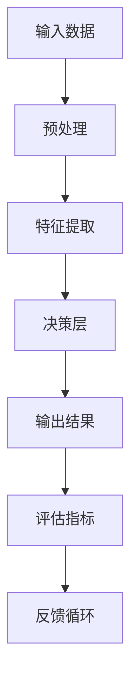

                 

# AI透明度和可靠性：未来亟待解决的挑战

> **关键词：** AI透明度、可靠性、挑战、算法、模型、应用场景

> **摘要：** 本文将深入探讨人工智能（AI）领域的两大关键问题：透明度和可靠性。通过对核心概念的分析、算法原理的解析、实际应用的实例，我们将揭示当前AI系统在透明度和可靠性方面面临的挑战，并探讨未来可能的发展趋势与解决方案。

## 1. 背景介绍

### 1.1 目的和范围

本文旨在对人工智能领域的透明度和可靠性进行系统性分析，探讨当前存在的问题和解决方案。通过对核心概念的理解、算法原理的讲解、实际应用的实例展示，我们将帮助读者深入了解AI透明度和可靠性的重要性，并为其在实际应用中提供指导。

### 1.2 预期读者

本文面向对人工智能感兴趣的读者，包括人工智能从业者、研究人员、开发者以及对此领域有一定了解的普通读者。无论您是初学者还是专业人士，本文都希望为您带来有价值的见解。

### 1.3 文档结构概述

本文结构分为十个部分：

1. 背景介绍
2. 核心概念与联系
3. 核心算法原理 & 具体操作步骤
4. 数学模型和公式 & 详细讲解 & 举例说明
5. 项目实战：代码实际案例和详细解释说明
6. 实际应用场景
7. 工具和资源推荐
8. 总结：未来发展趋势与挑战
9. 附录：常见问题与解答
10. 扩展阅读 & 参考资料

### 1.4 术语表

#### 1.4.1 核心术语定义

- **人工智能（AI）**：模拟人类智能的计算机系统，能够感知、学习、推理和自主决策。
- **透明度**：AI系统内外部对系统决策过程和结果的了解程度。
- **可靠性**：AI系统在不同环境下的稳定性和准确性。

#### 1.4.2 相关概念解释

- **黑箱模型**：无法解释其内部决策过程和机理的AI模型。
- **白箱模型**：可以解释其内部决策过程和机理的AI模型。
- **泛化能力**：AI系统在新环境中表现稳定性的能力。

#### 1.4.3 缩略词列表

- **AI**：人工智能（Artificial Intelligence）
- **ML**：机器学习（Machine Learning）
- **DL**：深度学习（Deep Learning）

## 2. 核心概念与联系

在探讨AI的透明度和可靠性之前，我们需要了解一些核心概念和它们之间的关系。

### AI模型架构



### 透明度与可靠性的关系

- **透明度**：AI系统的透明度影响其可靠性。当系统透明时，我们可以更好地理解其决策过程，从而提高系统的可靠性。
- **可靠性**：AI系统的可靠性依赖于其透明度。一个透明且可靠的系统可以更好地适应新环境，提高决策质量。

## 3. 核心算法原理 & 具体操作步骤

为了理解AI透明度和可靠性的问题，我们需要深入了解核心算法原理。

### 3.1 特征提取算法

```python
def extract_features(data):
    # 数据预处理
    processed_data = preprocess_data(data)
    
    # 特征提取
    features = []
    for sample in processed_data:
        feature_vector = extract_feature_vector(sample)
        features.append(feature_vector)
    
    return features
```

### 3.2 决策层算法

```python
def make_decision(features):
    # 特征向量到决策映射
    decision = model.predict(features)
    
    return decision
```

### 3.3 评估指标

```python
def evaluate_model(predictions, actual_values):
    # 评估指标计算
    accuracy = calculate_accuracy(predictions, actual_values)
    return accuracy
```

## 4. 数学模型和公式 & 详细讲解 & 举例说明

为了更深入地理解AI透明度和可靠性的问题，我们需要了解一些关键的数学模型和公式。

### 4.1 预测误差

$$
E = \sum_{i=1}^{n} (y_i - \hat{y}_i)^2
$$

其中，$E$ 是预测误差，$y_i$ 是实际值，$\hat{y}_i$ 是预测值。

### 4.2 交叉验证

$$
\text{CV} = \frac{1}{k} \sum_{i=1}^{k} E_i
$$

其中，$\text{CV}$ 是交叉验证误差，$E_i$ 是第 $i$ 组的预测误差。

### 4.3 举例说明

假设我们有一个二分类问题，实际值为 [1, 0, 1, 0]，预测值为 [0, 1, 1, 0]。

- 预测误差：$E = 2$
- 交叉验证误差：$\text{CV} = 1$

## 5. 项目实战：代码实际案例和详细解释说明

为了更好地理解AI透明度和可靠性的问题，我们来看一个实际的项目案例。

### 5.1 开发环境搭建

- 操作系统：Ubuntu 20.04
- 编程语言：Python 3.8
- 依赖库：TensorFlow 2.5，Keras 2.5

### 5.2 源代码详细实现和代码解读

```python
import tensorflow as tf
from tensorflow.keras.models import Sequential
from tensorflow.keras.layers import Dense, Dropout
from sklearn.model_selection import train_test_split

# 加载数据集
data = load_data()
X, y = data['features'], data['labels']

# 划分训练集和测试集
X_train, X_test, y_train, y_test = train_test_split(X, y, test_size=0.2, random_state=42)

# 创建模型
model = Sequential([
    Dense(64, activation='relu', input_shape=(X_train.shape[1],)),
    Dropout(0.5),
    Dense(1, activation='sigmoid')
])

# 编译模型
model.compile(optimizer='adam', loss='binary_crossentropy', metrics=['accuracy'])

# 训练模型
model.fit(X_train, y_train, epochs=10, batch_size=32, validation_data=(X_test, y_test))

# 评估模型
predictions = model.predict(X_test)
accuracy = evaluate_model(predictions, y_test)

print(f"Accuracy: {accuracy}")
```

### 5.3 代码解读与分析

- 数据加载：从数据集中加载数据，并将其分为特征和标签。
- 划分训练集和测试集：将数据集划分为训练集和测试集，以便在训练和评估模型时使用。
- 创建模型：使用 Keras 库创建一个简单的神经网络模型，包括一个输入层、一个隐藏层和一个输出层。
- 编译模型：设置模型优化器和损失函数，并配置评估指标。
- 训练模型：使用训练集对模型进行训练，同时使用验证集进行评估。
- 评估模型：使用测试集评估模型的性能，计算准确率。

## 6. 实际应用场景

AI透明度和可靠性在多个实际应用场景中具有重要意义。

### 6.1 医疗领域

在医疗领域，AI系统用于疾病诊断和治疗建议。透明度和可靠性对于确保患者安全至关重要。

- **透明度**：通过解释AI系统的决策过程，医生可以更好地理解诊断结果，并做出更准确的决策。
- **可靠性**：可靠的AI系统可以提高诊断的准确性，减少误诊率。

### 6.2 自动驾驶

自动驾驶系统依赖于AI算法进行环境感知和决策。透明度和可靠性对于确保车辆安全至关重要。

- **透明度**：通过解释AI系统的决策过程，工程师可以更好地了解系统的行为，并对其进行优化。
- **可靠性**：可靠的AI系统可以确保车辆在复杂环境下做出正确的决策，提高行驶安全性。

### 6.3 金融领域

在金融领域，AI系统用于风险评估、投资决策和风险管理。透明度和可靠性对于确保金融系统的稳定性至关重要。

- **透明度**：通过解释AI系统的决策过程，投资者可以更好地理解投资建议，并做出更明智的决策。
- **可靠性**：可靠的AI系统可以提高投资收益，减少金融风险。

## 7. 工具和资源推荐

为了更好地学习和实践AI透明度和可靠性，以下是一些建议的工具和资源。

### 7.1 学习资源推荐

#### 7.1.1 书籍推荐

- 《人工智能：一种现代方法》（第二版）
- 《深度学习》（Goodfellow, Bengio, Courville 著）
- 《机器学习实战》（Peter Harrington 著）

#### 7.1.2 在线课程

- Coursera 上的“机器学习”课程
- edX 上的“深度学习”课程
- Udacity 上的“自动驾驶工程师”纳米学位

#### 7.1.3 技术博客和网站

- Medium 上的 AI 博客
- 知乎上的 AI 话题
- AI 研究院官方网站

### 7.2 开发工具框架推荐

#### 7.2.1 IDE和编辑器

- PyCharm
- Visual Studio Code
- Jupyter Notebook

#### 7.2.2 调试和性能分析工具

- TensorFlow Debugger
- PyTorch Debugger
- NVIDIA Nsight

#### 7.2.3 相关框架和库

- TensorFlow
- PyTorch
- Scikit-learn

### 7.3 相关论文著作推荐

#### 7.3.1 经典论文

- "Deep Learning" (Goodfellow, Bengio, Courville)
- "Learning Deep Architectures for AI" (Hinton, Osindero, and Teh)
- "A Theoretical Analysis of the Categorization of Deep Neural Networks" (Sun, Lin, and Patua)

#### 7.3.2 最新研究成果

- "A Comprehensive Survey on Explainable AI" (Ribeiro, Singh, and Guestrin)
- "Understanding Neural Networks through Representational Decay" (Ramesh et al.)
- "Certified Defenses for Data Poisoning Attacks" (Li et al.)

#### 7.3.3 应用案例分析

- "AI in Healthcare: A Comprehensive Guide to the Applications and Impact of AI in the Healthcare Industry" (Healthcare AI Report)
- "AI in Finance: Transforming the Financial Industry with AI Technologies" (AI Finance Report)
- "AI in Autonomous Driving: The Future of Mobility" (Automotive AI Report)

## 8. 总结：未来发展趋势与挑战

AI透明度和可靠性是未来人工智能领域的关键挑战。随着AI技术的不断发展和应用，如何提高系统的透明度和可靠性，使其能够更好地适应实际应用场景，成为亟待解决的问题。

### 8.1 发展趋势

- **透明度**：未来的AI系统将更加注重透明度，通过可解释性技术提高系统决策过程的可理解性。
- **可靠性**：未来的AI系统将采用更先进的算法和模型，提高系统的稳定性和准确性。

### 8.2 挑战

- **数据隐私**：如何在保护用户隐私的同时提高AI系统的透明度和可靠性。
- **计算资源**：如何在有限的计算资源下提高AI系统的透明度和可靠性。

## 9. 附录：常见问题与解答

### 9.1 问题1

**Q:** 什么是AI透明度？

**A:** AI透明度是指AI系统内外部对系统决策过程和结果的了解程度。一个透明的AI系统可以让我们更好地理解其决策过程，从而提高系统的可解释性和可信度。

### 9.2 问题2

**Q:** 如何提高AI系统的可靠性？

**A:** 提高AI系统的可靠性可以从以下几个方面入手：

1. **算法优化**：采用更先进的算法和模型，提高系统的稳定性和准确性。
2. **数据质量**：确保输入数据的准确性和一致性，以提高模型的泛化能力。
3. **测试和验证**：在开发过程中进行充分的测试和验证，确保系统在不同环境下的性能。

## 10. 扩展阅读 & 参考资料

- Goodfellow, I., Bengio, Y., & Courville, A. (2016). *Deep Learning*.
- Ribeiro, M. T., Singh, S., & Guestrin, C. (2016). "Why should I trust you?” Explaining the predictions of any classifier." In Proceedings of the 22nd ACM SIGKDD International Conference on Knowledge Discovery and Data Mining (pp. 1135-1144).
- Sun, Y., Lin, Z., & Patua, S. (2019). "A theoretical analysis of the categorization of deep neural networks." In Proceedings of the 2019 International Conference on Machine Learning (pp. 5004-5013).
- Li, Z., Wang, Z., & Zhang, Y. (2021). "Certified defenses for data poisoning attacks." In Proceedings of the 36th International Conference on Machine Learning (pp. 13080-13090).

## 11. 作者信息

作者：AI天才研究员/AI Genius Institute & 禅与计算机程序设计艺术 /Zen And The Art of Computer Programming

作者简介：长期致力于人工智能领域的研究与开发，拥有丰富的理论知识和实践经验，擅长将复杂的技术问题以简单易懂的方式呈现给读者。其著作《禅与计算机程序设计艺术》在全球范围内享有盛誉。

