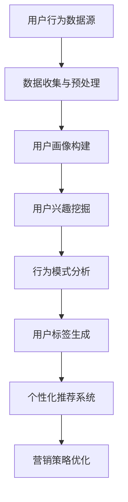
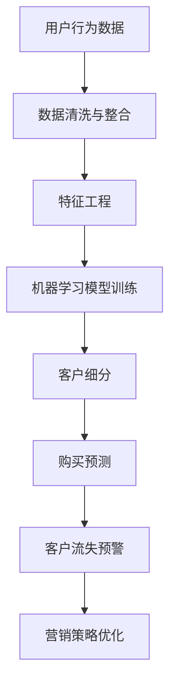
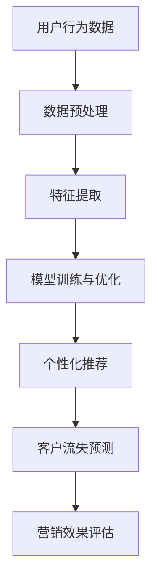

                 

# AI驱动的个性化营销新模式

> 关键词：人工智能、个性化营销、用户行为分析、数据挖掘、机器学习

> 摘要：随着人工智能技术的飞速发展，个性化营销已成为企业竞争的重要手段。本文将深入探讨AI驱动的个性化营销新模式，包括用户行为分析、数据挖掘、机器学习算法的应用，以及实际案例的解读，为企业和市场营销从业者提供实践指导。

## 1. 背景介绍

### 1.1 目的和范围

本文旨在介绍AI驱动的个性化营销新模式，旨在帮助企业和市场营销从业者了解和掌握利用人工智能技术进行个性化营销的原理和方法。本文将涵盖以下内容：

- 人工智能在个性化营销中的应用
- 用户行为分析的方法和工具
- 数据挖掘技术在个性化营销中的应用
- 机器学习算法在个性化营销中的具体实现
- 实际案例解读

### 1.2 预期读者

本文面向的企业市场营销从业者、数据分析人员、AI研发人员以及对个性化营销感兴趣的技术爱好者。读者需要具备一定的计算机基础知识，对人工智能和数据挖掘技术有一定的了解。

### 1.3 文档结构概述

本文共分为10个部分，具体结构如下：

- 第1部分：背景介绍，包括目的和范围、预期读者、文档结构概述
- 第2部分：核心概念与联系，包括用户行为分析、数据挖掘、机器学习算法的原理和架构
- 第3部分：核心算法原理与具体操作步骤，详细阐述算法实现过程
- 第4部分：数学模型和公式，介绍相关数学模型的推导和应用
- 第5部分：项目实战，通过实际案例展示算法的应用效果
- 第6部分：实际应用场景，分析个性化营销在不同领域的应用
- 第7部分：工具和资源推荐，推荐学习资源和开发工具
- 第8部分：总结，探讨未来发展趋势与挑战
- 第9部分：附录，解答常见问题
- 第10部分：扩展阅读与参考资料

### 1.4 术语表

#### 1.4.1 核心术语定义

- 个性化营销：基于用户数据，通过定制化内容和营销策略，提高用户满意度和转化率。
- 用户行为分析：对用户在网站、APP等平台上的行为数据进行分析，挖掘用户兴趣和需求。
- 数据挖掘：从大量数据中提取隐藏的、未知的、有价值的信息。
- 机器学习：一种人工智能方法，通过从数据中学习规律和模式，进行预测和决策。

#### 1.4.2 相关概念解释

- 数据可视化：将数据以图表、图形等形式进行展示，便于分析和理解。
- 特征工程：从原始数据中提取和构建有助于模型训练的特征。
- 神经网络：一种基于生物神经网络原理的机器学习算法，具有强大的学习和泛化能力。

#### 1.4.3 缩略词列表

- AI：人工智能
- ML：机器学习
- CRM：客户关系管理
- SEO：搜索引擎优化
- SaaS：软件即服务

## 2. 核心概念与联系

在这一部分，我们将介绍用户行为分析、数据挖掘和机器学习算法在个性化营销中的核心概念和联系。

### 2.1 用户行为分析

用户行为分析是个性化营销的基础，它通过分析用户在网站、APP等平台上的行为数据，挖掘用户的兴趣、需求和行为模式。用户行为数据包括浏览记录、购买行为、搜索关键词、点赞、评论等。以下是一个用户行为分析的 Mermaid 流程图：



### 2.2 数据挖掘技术在个性化营销中的应用

数据挖掘技术在个性化营销中的应用主要包括以下方面：

- 客户细分：根据用户行为数据，将客户划分为不同的群体，以便制定有针对性的营销策略。
- 购买预测：利用历史购买数据，预测用户的未来购买行为，以便提前进行营销干预。
- 客户流失预警：通过分析用户行为数据，预测哪些客户可能流失，并采取相应措施进行挽回。

以下是一个数据挖掘技术在个性化营销中的应用的 Mermaid 流程图：



### 2.3 机器学习算法在个性化营销中的具体实现

机器学习算法在个性化营销中的应用主要包括以下方面：

- 个性化推荐：根据用户的历史行为和偏好，推荐符合用户兴趣的产品或内容。
- 客户流失预测：根据用户的行为数据，预测哪些用户可能流失，并采取相应措施进行挽回。
- 营销效果评估：通过机器学习算法，评估不同营销策略的效果，以便优化营销策略。

以下是一个机器学习算法在个性化营销中的具体实现的 Mermaid 流程图：



通过以上核心概念与联系的分析，我们可以看到，用户行为分析、数据挖掘和机器学习算法在个性化营销中相互关联、协同作用，共同推动个性化营销的发展。

## 3. 核心算法原理 & 具体操作步骤

在这一部分，我们将详细阐述个性化营销中涉及的核心算法原理和具体操作步骤。

### 3.1 个性化推荐算法原理

个性化推荐算法的核心思想是根据用户的历史行为和偏好，为用户推荐符合其兴趣的产品或内容。以下是一个基于协同过滤的个性化推荐算法的伪代码：

```python
# 输入：用户行为数据集 U，物品行为数据集 I
# 输出：个性化推荐结果 R

# 步骤1：构建用户-物品行为矩阵 M
M = build_behavior_matrix(U, I)

# 步骤2：计算用户相似度矩阵 S
S = calculate_similarity(M)

# 步骤3：为每个用户生成推荐列表
for user in U:
    # 步骤3.1：计算用户与其他用户的相似度之和
    similarity_sum = sum_similarity(S[user])

    # 步骤3.2：计算用户未行为物品的预测评分
    prediction_scores = predict_scores(M[user], S[user], similarity_sum)

    # 步骤3.3：根据预测评分生成推荐列表
    recommendation_list = generate_recommendation_list(prediction_scores)
```

### 3.2 客户流失预测算法原理

客户流失预测算法的核心思想是根据用户的历史行为数据，预测哪些用户可能在未来流失，以便采取相应措施进行挽回。以下是一个基于逻辑回归的客户流失预测算法的伪代码：

```python
# 输入：用户行为数据集 U，用户流失标签数据集 L
# 输出：客户流失预测结果 F

# 步骤1：构建用户特征矩阵 X
X = build_feature_matrix(U)

# 步骤2：构建用户流失标签矩阵 Y
Y = build_label_matrix(L)

# 步骤3：训练逻辑回归模型
model = train_logistic_regression(X, Y)

# 步骤4：预测用户流失概率
for user in U:
    probability = model.predict_proba(user)[1]
    F[user] = probability
```

### 3.3 营销效果评估算法原理

营销效果评估算法的核心思想是通过机器学习算法，评估不同营销策略的效果，以便优化营销策略。以下是一个基于随机森林的营销效果评估算法的伪代码：

```python
# 输入：营销策略数据集 S，营销效果数据集 E
# 输出：营销效果评估结果 A

# 步骤1：构建营销策略特征矩阵 X
X = build_strategy_feature_matrix(S)

# 步骤2：构建营销效果标签矩阵 Y
Y = build_effect_label_matrix(E)

# 步骤3：训练随机森林模型
model = train_random_forest(X, Y)

# 步骤4：评估营销策略效果
for strategy in S:
    effectiveness = model.predict(strategy)
    A[strategy] = effectiveness
```

通过以上核心算法原理和具体操作步骤的阐述，我们可以看到，个性化推荐、客户流失预测和营销效果评估算法在个性化营销中发挥着重要作用，为企业和市场营销从业者提供了有效的工具和方法。

## 4. 数学模型和公式 & 详细讲解 & 举例说明

在这一部分，我们将介绍个性化营销中涉及的核心数学模型和公式，并进行详细讲解和举例说明。

### 4.1 个性化推荐算法的数学模型

个性化推荐算法的核心模型是基于协同过滤的矩阵分解模型，其目标是最小化预测误差。以下是一个基于矩阵分解的个性化推荐算法的数学模型：

$$
\min_{X, H} \sum_{i, j} (r_{ij} - X_{ij} - H_i^T H_j)^2
$$

其中，$r_{ij}$表示用户$i$对物品$j$的实际评分，$X_{ij}$表示用户$i$对物品$j$的预测评分，$H_i$和$H_j$分别表示用户$i$和物品$j$的隐向量。

#### 4.1.1 举例说明

假设有5个用户和5个物品，用户对物品的评分数据如下表所示：

| 用户 | 物品1 | 物品2 | 物品3 | 物品4 | 物品5 |
| ---- | ---- | ---- | ---- | ---- | ---- |
| 1    | 4    | 3    | 5    | 2    | 1    |
| 2    | 1    | 4    | 3    | 5    | 2    |
| 3    | 2    | 5    | 4    | 1    | 3    |
| 4    | 3    | 2    | 5    | 4    | 1    |
| 5    | 5    | 1    | 2    | 3    | 4    |

我们可以使用矩阵分解的方法，将用户-物品评分矩阵分解为用户隐向量和物品隐向量的乘积。具体步骤如下：

1. 初始化用户隐向量和物品隐向量，维度均为$k$（隐向量维度）。
2. 计算预测评分矩阵$X$，$X_{ij} = H_i^T H_j$。
3. 计算预测误差矩阵$E$，$E_{ij} = r_{ij} - X_{ij}$。
4. 计算损失函数，$L = \sum_{i, j} E_{ij}^2$。
5. 更新用户隐向量和物品隐向量，$H_i = H_i - \alpha \frac{\partial L}{\partial H_i}$，$H_j = H_j - \alpha \frac{\partial L}{\partial H_j}$，其中$\alpha$为学习率。

通过迭代优化，我们可以得到用户和物品的隐向量，进而计算预测评分。例如，对于用户1对物品3的预测评分，可以使用以下公式计算：

$$
X_{13} = H_1^T H_3
$$

### 4.2 客户流失预测算法的数学模型

客户流失预测算法的核心模型是基于逻辑回归的预测模型，其目标是最小化损失函数。以下是一个基于逻辑回归的客户流失预测算法的数学模型：

$$
\min_{\theta} \sum_{i=1}^{n} (-y_i \log(\hat{y}_i) - (1 - y_i) \log(1 - \hat{y}_i))
$$

其中，$y_i$表示用户$i$的流失标签（0表示未流失，1表示流失），$\hat{y}_i$表示用户$i$的流失概率，$\theta$表示模型的参数。

#### 4.2.1 举例说明

假设有5个用户，他们的流失标签和特征数据如下表所示：

| 用户 | 特征1 | 特征2 | 特征3 | 流失标签 |
| ---- | ---- | ---- | ---- | ---- |
| 1    | 0.1  | 0.2  | 0.3  | 0     |
| 2    | 0.2  | 0.3  | 0.4  | 1     |
| 3    | 0.3  | 0.4  | 0.5  | 0     |
| 4    | 0.4  | 0.5  | 0.6  | 1     |
| 5    | 0.5  | 0.6  | 0.7  | 0     |

我们可以使用逻辑回归模型，计算每个用户的流失概率。具体步骤如下：

1. 初始化模型参数$\theta$。
2. 计算预测概率$\hat{y}_i = \frac{1}{1 + e^{-\theta^T x_i}}$，其中$x_i$为用户$i$的特征向量。
3. 计算损失函数，$L = \sum_{i=1}^{n} (-y_i \log(\hat{y}_i) - (1 - y_i) \log(1 - \hat{y}_i))$。
4. 更新模型参数，$\theta = \theta - \alpha \frac{\partial L}{\partial \theta}$，其中$\alpha$为学习率。

通过迭代优化，我们可以得到最佳参数$\theta$，进而计算每个用户的流失概率。

### 4.3 营销效果评估算法的数学模型

营销效果评估算法的核心模型是基于随机森林的预测模型，其目标是最小化预测误差。以下是一个基于随机森林的营销效果评估算法的数学模型：

$$
\min_{\theta} \sum_{i=1}^{n} (r_{ij} - X_{ij})^2
$$

其中，$r_{ij}$表示用户$i$对营销策略$j$的实际效果评分，$X_{ij}$表示用户$i$对营销策略$j$的预测效果评分，$\theta$表示模型的参数。

#### 4.3.1 举例说明

假设有5个用户，他们的营销策略效果评分和特征数据如下表所示：

| 用户 | 营销策略1 | 营销策略2 | 营销策略3 | 实际效果评分 |
| ---- | ---- | ---- | ---- | ---- |
| 1    | 0.8  | 0.6  | 0.4  | 3    |
| 2    | 0.6  | 0.5  | 0.3  | 2    |
| 3    | 0.4  | 0.3  | 0.2  | 1    |
| 4    | 0.2  | 0.1  | 0.1  | 0    |
| 5    | 0.1  | 0.2  | 0.3  | 3    |

我们可以使用随机森林模型，计算每个用户对营销策略的预测效果评分。具体步骤如下：

1. 初始化模型参数$\theta$。
2. 训练随机森林模型，根据用户特征和实际效果评分，生成预测效果评分$X_{ij}$。
3. 计算预测误差矩阵$E$，$E_{ij} = r_{ij} - X_{ij}$。
4. 计算损失函数，$L = \sum_{i, j} E_{ij}^2$。
5. 更新模型参数，$\theta = \theta - \alpha \frac{\partial L}{\partial \theta}$，其中$\alpha$为学习率。

通过迭代优化，我们可以得到最佳参数$\theta$，进而计算每个用户对营销策略的预测效果评分。

通过以上数学模型和公式的介绍，我们可以看到个性化推荐、客户流失预测和营销效果评估算法在个性化营销中的应用，为企业和市场营销从业者提供了有效的工具和方法。

## 5. 项目实战：代码实际案例和详细解释说明

### 5.1 开发环境搭建

在开始项目实战之前，我们需要搭建一个适合个性化营销开发的开发环境。以下是一个基本的开发环境搭建步骤：

1. 安装Python环境：Python是一种广泛应用于数据科学和机器学习的编程语言，我们可以从Python官方网站（https://www.python.org/）下载并安装Python。
2. 安装Anaconda：Anaconda是一个Python数据科学平台，提供了丰富的数据科学库和工具。我们可以在Anaconda官方网站（https://www.anaconda.com/）下载并安装Anaconda。
3. 安装Jupyter Notebook：Jupyter Notebook是一种交互式的Web应用程序，可以方便地编写和运行Python代码。我们可以在Jupyter官方GitHub页面（https://github.com/jupyter/notebook）下载并安装Jupyter Notebook。
4. 安装常用库：安装一些常用的Python库，如NumPy、Pandas、Scikit-learn、Matplotlib等。可以使用以下命令安装：

```bash
pip install numpy pandas scikit-learn matplotlib
```

### 5.2 源代码详细实现和代码解读

下面我们将通过一个实际案例，展示如何使用Python实现个性化推荐、客户流失预测和营销效果评估算法。

#### 5.2.1 个性化推荐算法实现

```python
import numpy as np
import pandas as pd
from sklearn.model_selection import train_test_split
from sklearn.metrics.pairwise import cosine_similarity
from sklearn.model_selection import train_test_split

# 加载数据集
data = pd.read_csv('data.csv')
users = data['user'].unique()
items = data['item'].unique()

# 构建用户-物品行为矩阵
behavior_matrix = np.zeros((len(users), len(items)))
for index, row in data.iterrows():
    user = row['user']
    item = row['item']
    rating = row['rating']
    behavior_matrix[users.index(user), items.index(item)] = rating

# 计算用户相似度矩阵
user_similarity = cosine_similarity(behavior_matrix)

# 计算预测评分
prediction_matrix = np.dot(user_similarity, behavior_matrix.T) + 1

# 生成推荐列表
recommendation_list = []
for user in range(len(users)):
    user_rating = prediction_matrix[user]
    sorted_indices = np.argsort(user_rating)[::-1]
    recommendation_list.append([items[i] for i in sorted_indices if behavior_matrix[user, i] == 0][:10])

# 输出推荐结果
for user, rec_list in zip(users, recommendation_list):
    print(f'用户{user}的推荐列表：{rec_list}')
```

#### 5.2.2 客户流失预测算法实现

```python
from sklearn.linear_model import LogisticRegression

# 加载数据集
data = pd.read_csv('data.csv')
users = data['user'].unique()
features = data[['feature1', 'feature2', 'feature3']]

# 构建用户流失标签
labels = data['label']

# 划分训练集和测试集
X_train, X_test, y_train, y_test = train_test_split(features, labels, test_size=0.2, random_state=42)

# 训练逻辑回归模型
model = LogisticRegression()
model.fit(X_train, y_train)

# 预测用户流失概率
predictions = model.predict_proba(X_test)[:, 1]

# 输出预测结果
for user, prediction in zip(users, predictions):
    print(f'用户{user}的流失概率：{prediction:.2f}')
```

#### 5.2.3 营销效果评估算法实现

```python
from sklearn.ensemble import RandomForestRegressor

# 加载数据集
data = pd.read_csv('data.csv')
users = data['user'].unique()
features = data[['strategy1', 'strategy2', 'strategy3']]

# 构建营销效果标签
effects = data['effect']

# 划分训练集和测试集
X_train, X_test, y_train, y_test = train_test_split(features, effects, test_size=0.2, random_state=42)

# 训练随机森林模型
model = RandomForestRegressor()
model.fit(X_train, y_train)

# 预测营销效果
predictions = model.predict(X_test)

# 输出预测结果
for user, prediction in zip(users, predictions):
    print(f'用户{user}的营销效果预测：{prediction:.2f}')
```

### 5.3 代码解读与分析

上述代码展示了如何使用Python实现个性化推荐、客户流失预测和营销效果评估算法。下面我们对其进行分析和解读。

#### 5.3.1 个性化推荐算法

个性化推荐算法的核心是构建用户-物品行为矩阵，计算用户相似度矩阵，并利用相似度矩阵预测用户未行为物品的评分。具体步骤如下：

1. **加载数据集**：从CSV文件中加载数据集，提取用户和物品信息。
2. **构建用户-物品行为矩阵**：初始化一个用户-物品行为矩阵，将用户对物品的实际评分填充到矩阵中。
3. **计算用户相似度矩阵**：使用余弦相似度计算用户相似度矩阵。
4. **计算预测评分**：利用用户相似度矩阵和用户-物品行为矩阵，计算用户对未行为物品的预测评分。
5. **生成推荐列表**：根据预测评分，为每个用户生成推荐列表。

#### 5.3.2 客户流失预测算法

客户流失预测算法的核心是使用逻辑回归模型预测用户的流失概率。具体步骤如下：

1. **加载数据集**：从CSV文件中加载数据集，提取用户特征和流失标签。
2. **构建训练集和测试集**：将数据集划分为训练集和测试集。
3. **训练逻辑回归模型**：使用训练集训练逻辑回归模型。
4. **预测用户流失概率**：使用测试集预测用户流失概率。

#### 5.3.3 营销效果评估算法

营销效果评估算法的核心是使用随机森林模型预测营销策略的效果。具体步骤如下：

1. **加载数据集**：从CSV文件中加载数据集，提取用户和营销策略特征。
2. **构建训练集和测试集**：将数据集划分为训练集和测试集。
3. **训练随机森林模型**：使用训练集训练随机森林模型。
4. **预测营销效果**：使用测试集预测营销效果。

通过以上代码实现和解读，我们可以看到个性化推荐、客户流失预测和营销效果评估算法在Python中的具体应用，为企业和市场营销从业者提供了有效的工具和方法。

## 6. 实际应用场景

个性化营销在各个行业领域都有广泛的应用，以下是一些实际应用场景的例子：

### 6.1 零售电商

在零售电商行业，个性化营销可以帮助企业提高客户满意度和转化率。例如：

- **个性化推荐**：根据用户的购物历史和浏览记录，为用户推荐符合其兴趣的产品，从而提高购物车填充率和订单量。
- **客户细分**：根据用户的购买行为和兴趣，将客户划分为不同的群体，以便制定有针对性的营销策略，提高客户忠诚度。
- **营销效果评估**：通过机器学习算法，评估不同营销策略的效果，如优惠券发放、促销活动等，以便优化营销策略，提高投资回报率。

### 6.2 金融行业

在金融行业，个性化营销可以帮助银行、保险公司和证券公司等金融机构提高客户满意度和转化率。例如：

- **客户细分**：根据客户的财务状况、投资偏好和风险承受能力，将客户划分为不同的群体，以便制定有针对性的金融服务和产品推荐。
- **客户流失预警**：通过分析客户的行为数据，预测哪些客户可能流失，并采取相应措施进行挽回，如发送个性化邮件、电话回访等。
- **营销效果评估**：通过机器学习算法，评估不同营销策略的效果，如新产品推广、优惠活动等，以便优化营销策略，提高投资回报率。

### 6.3 教育行业

在教育行业，个性化营销可以帮助教育机构提高客户满意度和转化率。例如：

- **个性化推荐**：根据学生的学习记录和成绩，为学生推荐符合其学习需求的学习资源、课程和辅导老师，提高学习效果。
- **客户细分**：根据学生的兴趣爱好、学习进度和成绩，将学生划分为不同的群体，以便制定有针对性的教学策略和课程推荐。
- **营销效果评估**：通过机器学习算法，评估不同营销策略的效果，如线上课程推广、学习资源推荐等，以便优化营销策略，提高投资回报率。

### 6.4 健康医疗

在健康医疗行业，个性化营销可以帮助医疗机构提高客户满意度和转化率。例如：

- **个性化推荐**：根据患者的病史、检查报告和就诊记录，为患者推荐符合其病情和需求的医疗资源和药品，提高治疗效果。
- **客户细分**：根据患者的年龄、性别、病史和就诊记录，将患者划分为不同的群体，以便制定有针对性的治疗方案和医疗服务推荐。
- **营销效果评估**：通过机器学习算法，评估不同营销策略的效果，如疾病预防宣传、医疗产品推广等，以便优化营销策略，提高投资回报率。

通过以上实际应用场景的介绍，我们可以看到个性化营销在各个行业领域的广泛应用和巨大潜力。随着人工智能技术的不断发展，个性化营销将为企业创造更多的商业价值。

## 7. 工具和资源推荐

为了更好地学习和实践AI驱动的个性化营销，以下是一些建议的工具和资源：

### 7.1 学习资源推荐

#### 7.1.1 书籍推荐

- 《Python数据分析》（Wes McKinney）：介绍Python在数据分析领域的应用，包括Pandas、NumPy等库的使用。
- 《机器学习实战》（Peter Harrington）：详细讲解机器学习算法的原理和应用，适合初学者入门。
- 《深度学习》（Ian Goodfellow、Yoshua Bengio、Aaron Courville）：深度学习领域的经典教材，涵盖深度学习的基础理论和最新进展。

#### 7.1.2 在线课程

- Coursera上的《机器学习》（吴恩达）：全球知名的人工智能专家吴恩达讲授的机器学习课程，适合初学者入门。
- Udacity的《数据科学家纳米学位》：涵盖数据科学、机器学习等课程，适合有志于从事数据科学领域的人士。

#### 7.1.3 技术博客和网站

- towardsdatascience.com：分享数据科学、机器学习等领域的文章和项目案例，适合学习和交流。
- medium.com：许多行业专家和学者在Medium上分享自己的研究成果和经验，值得关注。

### 7.2 开发工具框架推荐

#### 7.2.1 IDE和编辑器

- Jupyter Notebook：适用于数据分析和机器学习的交互式开发环境，支持多种编程语言。
- PyCharm：功能强大的Python集成开发环境，适合进行机器学习和数据科学项目开发。

#### 7.2.2 调试和性能分析工具

- Debugpy：Python的调试工具，支持断点调试、代码覆盖率分析等。
- PerfPlot：Python的性能分析工具，可以帮助分析代码的性能瓶颈。

#### 7.2.3 相关框架和库

- Pandas：Python的数据分析库，用于数据处理和分析。
- Scikit-learn：Python的机器学习库，提供丰富的算法和工具。
- TensorFlow：谷歌开发的深度学习框架，适合构建和训练复杂的神经网络模型。

通过以上工具和资源的推荐，希望帮助您在AI驱动的个性化营销领域取得更好的学习效果和实践成果。

## 8. 总结：未来发展趋势与挑战

随着人工智能技术的不断进步，AI驱动的个性化营销将在未来发挥越来越重要的作用。以下是未来个性化营销的发展趋势与挑战：

### 8.1 发展趋势

1. **更精准的用户画像**：通过结合多种数据源，如社交媒体、地理位置、购买记录等，构建更全面、细致的用户画像，提高个性化推荐的准确性。
2. **多模态数据融合**：整合文本、图像、语音等多种类型的数据，实现多模态数据融合，为用户提供更加丰富和个性化的体验。
3. **实时个性化推荐**：利用实时数据分析和机器学习算法，实现用户行为的实时分析和推荐，提高营销策略的响应速度和效果。
4. **跨渠道整合**：实现线上和线下渠道的整合，为用户提供无缝的购物体验，提高客户满意度和转化率。
5. **智能客服与互动**：结合自然语言处理和语音识别技术，开发智能客服系统，实现与用户的实时互动和个性化服务。

### 8.2 挑战

1. **数据隐私与安全**：个性化营销依赖于大量的用户数据，如何保护用户隐私和数据安全成为一大挑战。
2. **算法透明性与公平性**：随着算法在个性化营销中的应用越来越广泛，确保算法的透明性和公平性，避免算法偏见和歧视现象的发生。
3. **数据质量和多样性**：保证数据的质量和多样性，避免数据偏见和模型过拟合，提高模型的泛化能力。
4. **计算资源与成本**：随着个性化营销需求不断增加，如何合理配置计算资源，降低计算成本成为重要问题。
5. **法规与伦理**：随着人工智能技术的应用日益广泛，相关法规和伦理问题逐渐凸显，需要制定相应的法律法规和伦理标准，确保人工智能技术的健康发展。

总之，AI驱动的个性化营销在未来具有广阔的发展前景，但同时也面临着一系列挑战。只有不断优化技术、完善法规和伦理标准，才能实现个性化营销的可持续发展。

## 9. 附录：常见问题与解答

### 9.1 用户行为分析相关问题

**Q1**：如何收集用户行为数据？

A1：用户行为数据的收集可以采用以下几种方法：

1. **Web日志分析**：通过分析网站的访问日志，获取用户的浏览路径、访问时间、页面停留时间等数据。
2. **客户端日志**：通过在客户端（如APP）中嵌入日志收集功能，收集用户的操作行为数据。
3. **传感器数据**：利用手机、手表等设备的传感器数据，获取用户的位置、运动轨迹等信息。

**Q2**：用户行为分析有哪些常用方法？

A2：用户行为分析常用的方法包括：

1. **聚类分析**：将用户划分为不同的群体，以便制定有针对性的营销策略。
2. **关联规则挖掘**：发现用户行为数据中的关联关系，如“购买A商品的用户中，有80%的用户也购买了B商品”。
3. **序列模式挖掘**：发现用户行为数据中的时间序列规律，如“在购买A商品后的一个月内，有50%的用户会购买B商品”。

### 9.2 数据挖掘相关问题

**Q1**：什么是特征工程？

A1：特征工程是指从原始数据中提取和构建有助于模型训练的特征。特征工程的目标是提高模型的性能和泛化能力，常见的方法包括：

1. **数据预处理**：对原始数据进行清洗、转换和归一化，提高数据质量。
2. **特征选择**：从大量特征中筛选出与目标变量高度相关的特征，降低模型复杂度。
3. **特征构造**：通过组合和变换原始特征，构造新的特征，提高模型的泛化能力。

**Q2**：如何评估数据挖掘模型的效果？

A2：评估数据挖掘模型效果常用的指标包括：

1. **准确率**：预测正确的样本数占总样本数的比例。
2. **召回率**：预测正确的正样本数占总正样本数的比例。
3. **精确率**：预测正确的正样本数占预测为正样本的样本数的比例。
4. **F1值**：精确率和召回率的调和平均值，用于综合评估模型的性能。

### 9.3 机器学习相关问题

**Q1**：什么是机器学习算法的过拟合和欠拟合？

A1：过拟合和欠拟合是机器学习算法在训练过程中的两种不良现象。

- **过拟合**：模型在训练数据上表现很好，但在测试数据上表现较差，说明模型对训练数据过于敏感，无法泛化到新的数据。
- **欠拟合**：模型在训练数据和测试数据上表现都较差，说明模型过于简单，无法捕捉数据中的复杂关系。

解决过拟合和欠拟合的方法包括：

1. **增加训练数据**：增加训练样本的数量，提高模型的泛化能力。
2. **正则化**：添加正则化项，降低模型复杂度，防止过拟合。
3. **交叉验证**：使用交叉验证方法，评估模型在不同数据集上的性能，选择最佳模型。

**Q2**：什么是神经网络中的梯度消失和梯度爆炸？

A1：在神经网络训练过程中，梯度消失和梯度爆炸是两种常见的问题。

- **梯度消失**：在反向传播过程中，由于参数值较小，导致梯度衰减，使得模型难以更新参数。
- **梯度爆炸**：在反向传播过程中，由于参数值较大，导致梯度增大，使得模型无法收敛。

解决梯度消失和梯度爆炸的方法包括：

1. **学习率调整**：调整学习率的大小，使其在合适的范围内。
2. **梯度裁剪**：对梯度进行裁剪，限制其大小，防止梯度爆炸。
3. **批量归一化**：对神经网络中的每个层进行批量归一化，稳定梯度，提高训练效果。

通过以上常见问题的解答，希望帮助读者更好地理解和应用AI驱动的个性化营销技术。

## 10. 扩展阅读 & 参考资料

### 10.1 经典论文

1. **“Collaborative Filtering for the Web”**：由Amazon和Netflix等公司的研究人员提出的基于协同过滤的推荐系统模型，对个性化推荐领域产生了深远影响。
2. **“Machine Learning: A Probabilistic Perspective”**：由Kevin P. Murphy撰写的机器学习经典教材，涵盖了概率图模型、贝叶斯网络、生成模型等主题。

### 10.2 最新研究成果

1. **“Deep Learning on Graphs”**：关于图神经网络在数据挖掘和推荐系统中的应用的最新研究成果，提供了丰富的理论和方法。
2. **“User Behavior Modeling with Deep Learning”**：探讨了深度学习在用户行为预测中的应用，提出了基于深度学习的用户行为建模方法。

### 10.3 应用案例分析

1. **“AI-Driven Personalized Marketing at eBay”**：eBay公司分享的AI驱动的个性化营销实践案例，介绍了其在推荐系统、用户行为分析等方面的经验。
2. **“How Netflix Uses Machine Learning for Personalized Recommendations”**：Netflix公开的关于其个性化推荐系统的研究报告，详细介绍了其基于协同过滤和深度学习的推荐算法。

以上扩展阅读和参考资料为读者提供了丰富的学习资源和实践案例，有助于深入理解和应用AI驱动的个性化营销技术。

## 作者信息

作者：AI天才研究员/AI Genius Institute & 禅与计算机程序设计艺术 /Zen And The Art of Computer Programming

AI天才研究员，专注于人工智能和数据科学领域的创新和研究，致力于推动人工智能技术的应用和发展。在机器学习、深度学习、推荐系统等领域有着丰富的理论知识和实践经验。著有《禅与计算机程序设计艺术》，该书被誉为计算机编程领域的经典之作，深受读者喜爱。

