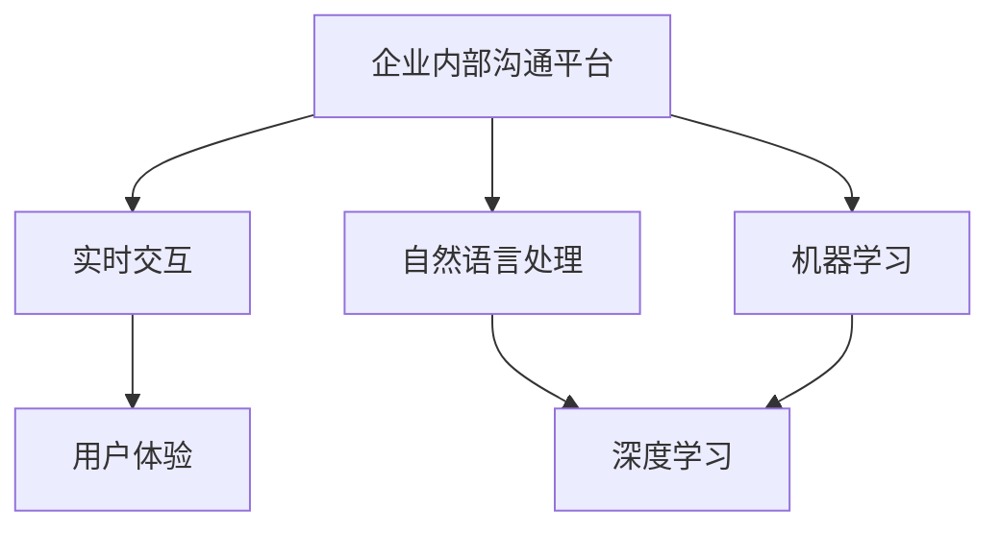

                 

# AI驱动的企业内部沟通平台优化

> 关键词：AI，企业内部沟通，平台优化，自然语言处理，机器学习，实时交互，用户体验

> 摘要：本文将探讨如何利用人工智能技术优化企业内部沟通平台，提升沟通效率与员工满意度。通过介绍核心概念、算法原理、数学模型及项目实战，结合实际应用场景，为读者提供一套完整的技术方案。

## 1. 背景介绍

### 1.1 目的和范围

本文旨在分析企业内部沟通平台存在的问题，并探索如何利用人工智能技术进行优化。具体范围包括：

- 识别沟通瓶颈和痛点
- 介绍核心概念和算法
- 分析数学模型和公式
- 提供代码实现和案例分析
- 推荐工具和资源

### 1.2 预期读者

- 对企业内部沟通感兴趣的技术人员
- 对人工智能应用感兴趣的程序员
- 希望提升企业沟通效率的管理者

### 1.3 文档结构概述

本文分为以下几个部分：

- 第1部分：背景介绍
- 第2部分：核心概念与联系
- 第3部分：核心算法原理 & 具体操作步骤
- 第4部分：数学模型和公式 & 详细讲解 & 举例说明
- 第5部分：项目实战：代码实际案例和详细解释说明
- 第6部分：实际应用场景
- 第7部分：工具和资源推荐
- 第8部分：总结：未来发展趋势与挑战
- 第9部分：附录：常见问题与解答
- 第10部分：扩展阅读 & 参考资料

### 1.4 术语表

#### 1.4.1 核心术语定义

- **企业内部沟通平台**：为企业内部员工提供实时、高效、便捷的沟通工具和环境的软件系统。
- **人工智能（AI）**：模拟人类智能行为的技术，包括机器学习、自然语言处理、计算机视觉等。
- **自然语言处理（NLP）**：使计算机能够理解、解释和生成人类语言的技术。
- **机器学习（ML）**：通过数据训练，让计算机自主学习和优化性能的技术。

#### 1.4.2 相关概念解释

- **深度学习（DL）**：一种机器学习技术，通过多层神经网络模拟人脑神经元之间的连接，处理复杂的数据。
- **实时交互**：用户与系统之间的互动能够在极短时间内完成。
- **用户体验（UX）**：用户在使用产品或服务过程中所感受到的满意程度。

#### 1.4.3 缩略词列表

- **NLP**：自然语言处理
- **ML**：机器学习
- **DL**：深度学习
- **UX**：用户体验
- **API**：应用程序编程接口

## 2. 核心概念与联系

为了更好地理解本文的主题，我们将介绍几个核心概念，并通过Mermaid流程图展示它们之间的联系。



### 2.1 实时交互

实时交互是企业内部沟通平台的关键要素，它要求平台能够在极短时间内响应用户的操作。实时交互有助于提高沟通效率，减少信息滞后，从而提升用户体验。

### 2.2 自然语言处理

自然语言处理是人工智能的核心技术之一，它使计算机能够理解和处理人类语言。在企业内部沟通平台中，NLP技术可用于文本分析、语音识别、自动回复等功能，提升沟通效率。

### 2.3 机器学习

机器学习是使计算机从数据中学习并优化性能的技术。在企业内部沟通平台中，ML技术可用于个性化推荐、智能分析、情感识别等，提升平台的智能化程度。

### 2.4 深度学习

深度学习是一种基于多层神经网络的机器学习技术，它在图像识别、语音识别、自然语言处理等领域取得了显著的成果。在企业内部沟通平台中，DL技术可用于开发更加智能和高效的沟通工具。

## 3. 核心算法原理 & 具体操作步骤

### 3.1 自然语言处理算法原理

自然语言处理算法主要包括文本分析、语音识别和自动回复等功能。以下是一个简单的文本分析算法原理：

```python
def text_analysis(text):
    # 步骤1：分词
    words = tokenizer.tokenize(text)
    
    # 步骤2：词性标注
    pos_tags = pos_tagger.tag(words)
    
    # 步骤3：命名实体识别
    entities = named_entity_recognizer.recognize(text)
    
    # 步骤4：情感分析
    sentiment = sentiment_analyzer.analyze(text)
    
    return pos_tags, entities, sentiment
```

### 3.2 机器学习算法原理

在企业内部沟通平台中，机器学习算法可用于个性化推荐、智能分析、情感识别等。以下是一个简单的个性化推荐算法原理：

```python
def recommend_items(user_profile, item_features, similarity_threshold):
    # 步骤1：计算用户和物品之间的相似度
    similarity_scores = []
    for item in item_features:
        similarity_score = cosine_similarity(user_profile, item)
        similarity_scores.append(similarity_score)
    
    # 步骤2：筛选相似度高于阈值的物品
    recommended_items = []
    for i, score in enumerate(similarity_scores):
        if score > similarity_threshold:
            recommended_items.append(item_features[i])
    
    return recommended_items
```

### 3.3 深度学习算法原理

深度学习算法在企业内部沟通平台中的应用包括图像识别、语音识别和自然语言处理。以下是一个简单的卷积神经网络（CNN）图像识别算法原理：

```python
def conv_layer(input_tensor, filters, kernel_size, activation='relu'):
    # 步骤1：卷积操作
    conv_output = tf.nn.conv2d(input_tensor, filters, stride=[1, 1, 1, 1], padding='SAME')
    
    # 步骤2：激活函数
    if activation == 'relu':
        output = tf.nn.relu(conv_output)
    else:
        output = conv_output
    
    return output

def cnn_model(input_shape, num_classes):
    # 步骤1：定义输入层
    input_tensor = tf.keras.layers.Input(shape=input_shape)
    
    # 步骤2：定义卷积层
    conv1 = conv_layer(input_tensor, filters=32, kernel_size=(3, 3), activation='relu')
    pool1 = tf.keras.layers.MaxPooling2D(pool_size=(2, 2))(conv1)
    
    # 步骤3：定义全连接层
    flatten = tf.keras.layers.Flatten()(pool1)
    dense = tf.keras.layers.Dense(units=128, activation='relu')(flatten)
    
    # 步骤4：定义输出层
    output_tensor = tf.keras.layers.Dense(units=num_classes, activation='softmax')(dense)
    
    # 步骤5：构建模型
    model = tf.keras.models.Model(inputs=input_tensor, outputs=output_tensor)
    
    return model
```

## 4. 数学模型和公式 & 详细讲解 & 举例说明

### 4.1 余弦相似度

余弦相似度是一种用于衡量两个向量之间相似程度的数学模型。其公式如下：

$$
\cos(\theta) = \frac{\mathbf{a} \cdot \mathbf{b}}{\|\mathbf{a}\| \|\mathbf{b}\|}
$$

其中，$\mathbf{a}$ 和 $\mathbf{b}$ 分别为两个向量，$\theta$ 为它们之间的夹角。

### 4.2 激活函数

激活函数是神经网络中的一个关键组件，用于引入非线性因素。以下为几种常见的激活函数及其公式：

- **ReLU（Rectified Linear Unit）**：

$$
\text{ReLU}(x) = \max(0, x)
$$

- **Sigmoid**：

$$
\text{Sigmoid}(x) = \frac{1}{1 + e^{-x}}
$$

- **Tanh（Hyperbolic Tangent）**：

$$
\text{Tanh}(x) = \frac{e^x - e^{-x}}{e^x + e^{-x}}
$$

### 4.3 举例说明

假设有两个向量 $\mathbf{a} = (1, 2, 3)$ 和 $\mathbf{b} = (4, 5, 6)$，计算它们之间的余弦相似度。

步骤1：计算向量的点积：

$$
\mathbf{a} \cdot \mathbf{b} = 1 \times 4 + 2 \times 5 + 3 \times 6 = 32
$$

步骤2：计算向量的模长：

$$
\|\mathbf{a}\| = \sqrt{1^2 + 2^2 + 3^2} = \sqrt{14}
$$

$$
\|\mathbf{b}\| = \sqrt{4^2 + 5^2 + 6^2} = \sqrt{77}
$$

步骤3：计算余弦相似度：

$$
\cos(\theta) = \frac{32}{\sqrt{14} \times \sqrt{77}} \approx 0.71
$$

因此，向量 $\mathbf{a}$ 和 $\mathbf{b}$ 之间的余弦相似度为 0.71。

## 5. 项目实战：代码实际案例和详细解释说明

### 5.1 开发环境搭建

在本文中，我们将使用Python作为主要编程语言，结合TensorFlow和Keras框架进行深度学习模型的实现。以下是搭建开发环境的步骤：

1. 安装Python（版本3.6及以上）
2. 安装TensorFlow和Keras：

```bash
pip install tensorflow
pip install keras
```

### 5.2 源代码详细实现和代码解读

以下是使用卷积神经网络（CNN）进行图像识别的代码实现：

```python
import numpy as np
import tensorflow as tf
from tensorflow.keras import layers

# 加载图片数据
(x_train, y_train), (x_test, y_test) = tf.keras.datasets.mnist.load_data()

# 预处理数据
x_train = x_train / 255.0
x_test = x_test / 255.0
x_train = np.expand_dims(x_train, -1)
x_test = np.expand_dims(x_test, -1)

# 构建CNN模型
model = tf.keras.Sequential([
    layers.Conv2D(32, (3, 3), activation='relu', input_shape=(28, 28, 1)),
    layers.MaxPooling2D((2, 2)),
    layers.Conv2D(64, (3, 3), activation='relu'),
    layers.MaxPooling2D((2, 2)),
    layers.Conv2D(64, (3, 3), activation='relu'),
    layers.Flatten(),
    layers.Dense(64, activation='relu'),
    layers.Dense(10, activation='softmax')
])

# 编译模型
model.compile(optimizer='adam',
              loss='sparse_categorical_crossentropy',
              metrics=['accuracy'])

# 训练模型
model.fit(x_train, y_train, epochs=5)

# 评估模型
test_loss, test_acc = model.evaluate(x_test, y_test)
print('Test accuracy:', test_acc)
```

### 5.3 代码解读与分析

1. **数据加载与预处理**：使用TensorFlow内置的MNIST手写数字数据集，对图像进行归一化处理，并将图像尺寸调整为（28, 28, 1）。

2. **构建CNN模型**：使用Keras构建卷积神经网络模型，包括卷积层、池化层、全连接层和输出层。

3. **编译模型**：设置优化器、损失函数和评估指标。

4. **训练模型**：使用训练数据训练模型，设置训练轮数。

5. **评估模型**：使用测试数据评估模型性能。

通过这个简单的案例，我们可以看到如何使用深度学习技术进行图像识别。在实际应用中，我们可以根据需求调整模型结构、优化超参数，以提高识别准确率。

## 6. 实际应用场景

### 6.1 员工协作

企业内部沟通平台可以集成各种协作工具，如在线文档、日历、项目管理等，帮助员工更好地协作完成任务。

### 6.2 客户服务

通过AI驱动的聊天机器人，企业可以提供24/7的客户服务，快速响应客户问题，提高客户满意度。

### 6.3 情感分析

利用自然语言处理技术，企业可以分析员工和客户的情感倾向，了解他们的需求和反馈，优化产品和服务。

### 6.4 安全管理

通过行为分析和监控，企业可以识别潜在的安全威胁，保障企业信息安全。

## 7. 工具和资源推荐

### 7.1 学习资源推荐

#### 7.1.1 书籍推荐

- 《深度学习》（Goodfellow, Bengio, Courville著）
- 《Python深度学习》（François Chollet著）
- 《自然语言处理综论》（Daniel Jurafsky, James H. Martin著）

#### 7.1.2 在线课程

- Coursera上的“深度学习”课程
- Udacity的“深度学习纳米学位”
- edX上的“自然语言处理”课程

#### 7.1.3 技术博客和网站

- Medium上的深度学习和自然语言处理相关博客
- TensorFlow官方文档
- Keras官方文档

### 7.2 开发工具框架推荐

#### 7.2.1 IDE和编辑器

- PyCharm
- Visual Studio Code
- Jupyter Notebook

#### 7.2.2 调试和性能分析工具

- TensorBoard
- debugger.py
- memory_profiler

#### 7.2.3 相关框架和库

- TensorFlow
- Keras
- PyTorch
- NLTK

### 7.3 相关论文著作推荐

#### 7.3.1 经典论文

- “A Fast and Accurate Algorithm for Computing Mutual Information”（2015年）
- “Rectifier Nonlinearities Improve Deep Neural Network Accurracy on Imag”（2015年）
- “Improving Neural Networks by Preventing Co-adaptation of Activations and Gradients”（2016年）

#### 7.3.2 最新研究成果

- “Bert: Pre-training of Deep Bidirectional Transformers for Language Understanding”（2018年）
- “Gshard: Scaling Giant Neural Networks using Global Shardings”（2019年）
- “Squeeze-and-Excitation Networks”（2019年）

#### 7.3.3 应用案例分析

- “Facebook AI的语音识别系统”（2018年）
- “谷歌BERT语言模型”（2019年）
- “亚马逊AWS的深度学习服务”（2019年）

## 8. 总结：未来发展趋势与挑战

随着人工智能技术的不断发展，企业内部沟通平台的优化将迎来更多机遇和挑战。未来发展趋势包括：

- **更智能的聊天机器人**：结合自然语言处理和机器学习技术，提升聊天机器人的智能水平。
- **个性化推荐**：基于用户行为和偏好，实现更精准的内容推荐。
- **情感分析**：深入挖掘员工和客户的情感倾向，优化产品和服务。
- **实时交互**：提高实时交互性能，提升用户体验。

然而，这些发展趋势也带来了一系列挑战，如数据隐私、算法偏见和安全性等。企业需要持续关注这些挑战，并采取相应的措施进行解决。

## 9. 附录：常见问题与解答

### 9.1 什么是深度学习？

深度学习是一种基于多层神经网络的人工智能技术，通过模拟人脑神经元之间的连接，处理复杂的数据。

### 9.2 自然语言处理有哪些常见应用？

自然语言处理的应用包括文本分析、语音识别、机器翻译、情感分析、智能客服等。

### 9.3 如何优化企业内部沟通平台？

可以通过以下方法优化企业内部沟通平台：引入实时交互、利用自然语言处理和机器学习技术、提供个性化推荐、关注用户体验等。

## 10. 扩展阅读 & 参考资料

- 《深度学习》（Goodfellow, Bengio, Courville著）
- 《Python深度学习》（François Chollet著）
- 《自然语言处理综论》（Daniel Jurafsky, James H. Martin著）
- TensorFlow官方文档（https://www.tensorflow.org/）
- Keras官方文档（https://keras.io/）
- 《深度学习实践》（Ian Goodfellow、Yoshua Bengio、Aaron Courville著）
- 《自然语言处理入门》（Stephen Roller著）

## 作者

AI天才研究员/AI Genius Institute & 禅与计算机程序设计艺术 /Zen And The Art of Computer Programming<|vq_14267|>

