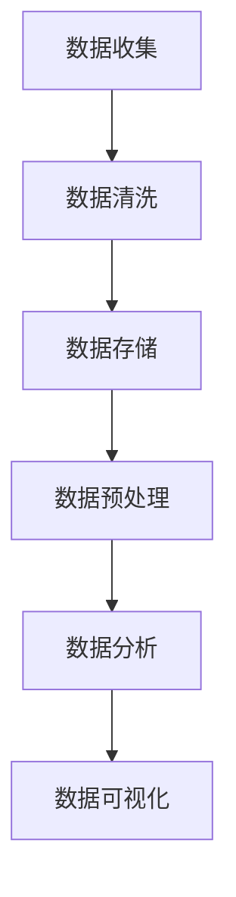
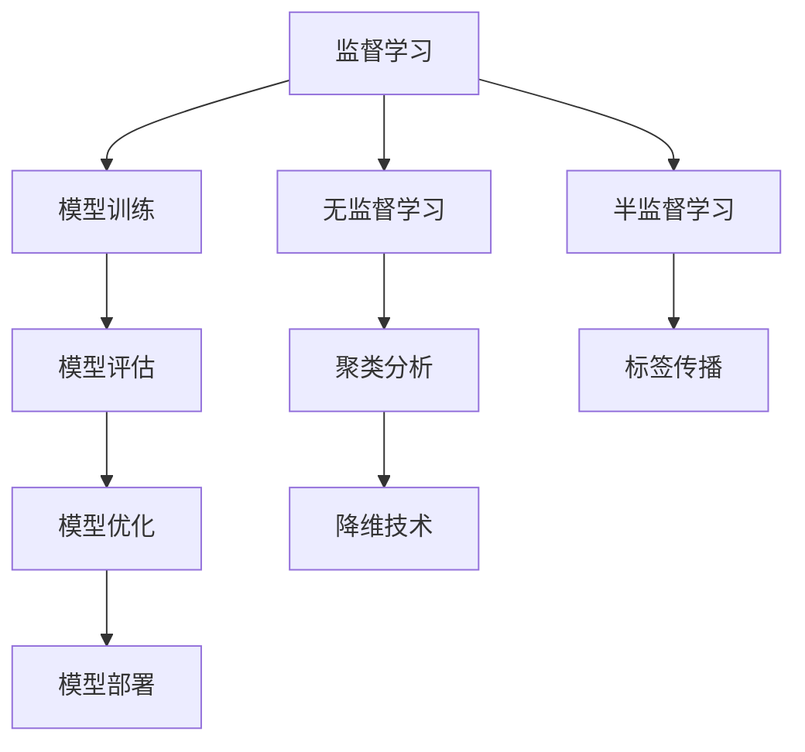
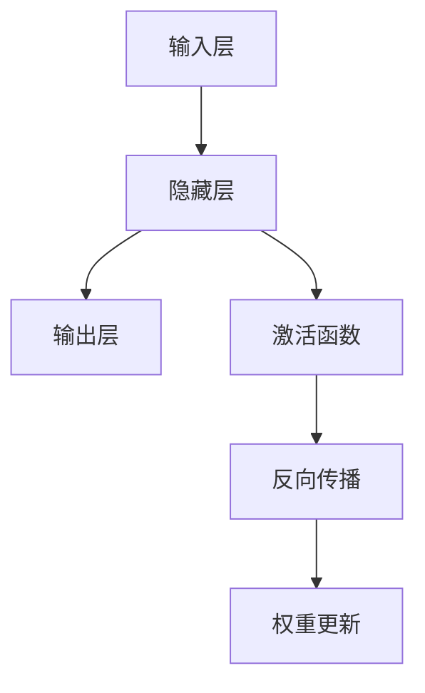
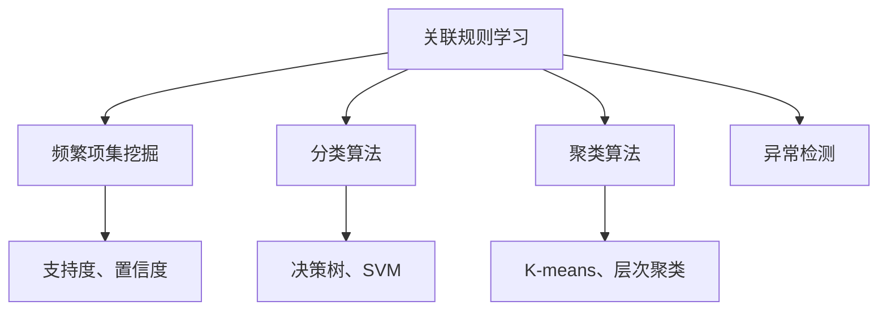
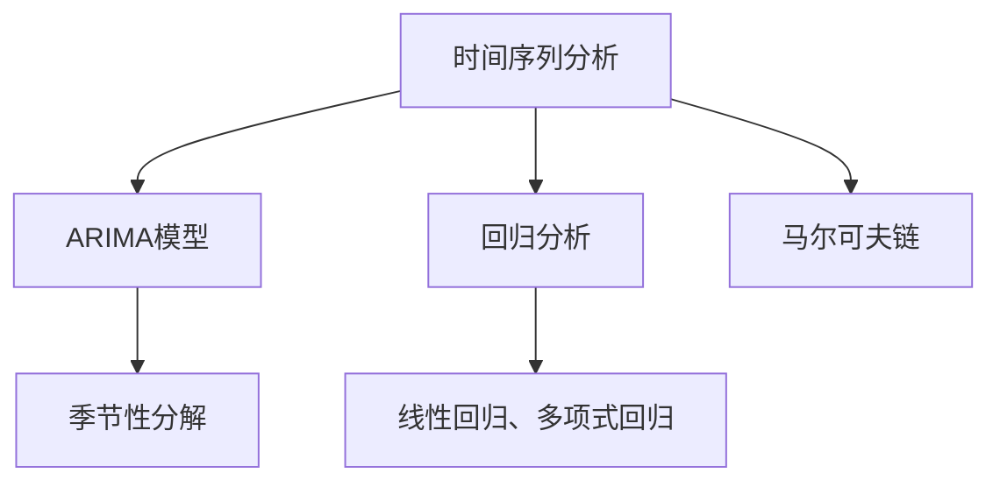

                 

# AI驱动的企业决策支持系统

> 关键词：人工智能、企业决策、支持系统、数据分析、机器学习、算法、深度学习、神经网络、数据挖掘、优化模型、预测分析

> 摘要：随着商业环境的快速变化和市场竞争的加剧，企业决策支持系统的需求越来越迫切。本文将深入探讨AI驱动的企业决策支持系统的核心概念、算法原理、数学模型及实际应用，旨在为企业提供一套高效、智能的决策工具，助力企业在复杂的市场环境中取得竞争优势。

## 1. 背景介绍

### 1.1 目的和范围

本文的主要目的是探讨如何利用人工智能（AI）技术构建一个高效的企业决策支持系统。我们将从以下几个方面展开讨论：

- **核心概念与联系**：介绍AI在企业决策支持系统中的应用原理和架构。
- **核心算法原理与操作步骤**：详细阐述支持系统所依赖的关键算法和具体实现步骤。
- **数学模型与公式**：讲解支持系统中使用的数学模型和计算公式，并提供实例说明。
- **项目实战**：通过实际代码案例，展示AI驱动的企业决策支持系统的具体实现。
- **实际应用场景**：分析AI在企业决策支持系统中的多种应用场景。
- **工具和资源推荐**：推荐相关学习资源和开发工具。
- **总结与展望**：讨论AI驱动的企业决策支持系统的未来发展趋势与挑战。

### 1.2 预期读者

本文适合以下读者群体：

- 企业决策者和管理者，希望了解AI技术在企业决策支持中的应用。
- 数据分析师和AI工程师，希望深入理解AI驱动的企业决策支持系统的技术原理。
- 计算机科学和人工智能专业的学生和研究者，对AI在企业决策中的应用有兴趣。

### 1.3 文档结构概述

本文结构如下：

- **第1章**：背景介绍
- **第2章**：核心概念与联系
- **第3章**：核心算法原理与操作步骤
- **第4章**：数学模型与公式
- **第5章**：项目实战
- **第6章**：实际应用场景
- **第7章**：工具和资源推荐
- **第8章**：总结与展望
- **第9章**：附录
- **第10章**：扩展阅读与参考资料

### 1.4 术语表

#### 1.4.1 核心术语定义

- **人工智能（AI）**：模拟人类智能的技术和方法，包括机器学习、深度学习等。
- **企业决策支持系统（DSS）**：为企业决策者提供信息和数据分析的系统。
- **机器学习（ML）**：通过数据训练模型，让计算机自动学习和改进的技术。
- **深度学习（DL）**：一种特殊的机器学习技术，通过多层神经网络进行数据处理。
- **数据挖掘（DM）**：从大量数据中发现有用信息和知识的过程。

#### 1.4.2 相关概念解释

- **预测分析**：利用历史数据预测未来趋势。
- **优化模型**：用于确定最佳决策方案，常见于资源分配、库存管理等场景。
- **神经网络**：模仿人脑神经元连接的计算机算法。
- **支持向量机（SVM）**：一种常见的机器学习算法，用于分类和回归。

#### 1.4.3 缩略词列表

- **AI**：人工智能
- **ML**：机器学习
- **DL**：深度学习
- **DSS**：企业决策支持系统
- **DM**：数据挖掘

## 2. 核心概念与联系

AI驱动的企业决策支持系统涉及多个核心概念和技术，以下是这些概念的基本原理和相互关系。

### 2.1 数据分析

数据分析是决策支持系统的基石，它包括数据的收集、处理、存储和可视化。数据分析的目标是从大量数据中提取有价值的信息和洞察。

#### Mermaid 流程图：



### 2.2 机器学习

机器学习是AI的核心技术之一，通过构建模型来学习数据中的规律。机器学习算法分为监督学习、无监督学习和半监督学习。

#### Mermaid 流程图：



### 2.3 深度学习

深度学习是一种基于多层神经网络的机器学习技术，能够处理复杂的非线性问题。深度学习在图像识别、语音识别等领域取得了显著成果。

#### Mermaid 流程图：



### 2.4 数据挖掘

数据挖掘是从大量数据中发现有用信息和知识的过程。数据挖掘技术包括关联规则学习、分类、聚类、异常检测等。

#### Mermaid 流程图：



### 2.5 预测分析

预测分析是利用历史数据对未来进行预测。预测分析技术包括时间序列分析、回归分析、马尔可夫链等。

#### Mermaid 流程图：



## 3. 核心算法原理与具体操作步骤

在构建AI驱动的企业决策支持系统时，核心算法的选择和实现至关重要。以下是几个关键算法的原理和具体操作步骤。

### 3.1 时间序列分析

时间序列分析是一种预测未来趋势的技术，通常用于销售预测、库存管理等场景。下面以ARIMA模型为例进行介绍。

#### 算法原理

ARIMA（AutoRegressive Integrated Moving Average）模型是一种常见的时间序列预测模型，包括三个部分：差分（Integration）、自回归（Autoregression）和移动平均（Moving Average）。

- 差分：消除时间序列的非平稳性。
- 自回归：利用过去值预测当前值。
- 移动平均：利用过去值的平均值预测当前值。

#### 具体操作步骤

1. **数据预处理**：

   ```python
   import pandas as pd
   data = pd.read_csv('sales_data.csv')
   data['date'] = pd.to_datetime(data['date'])
   data.set_index('date', inplace=True)
   ```

2. **差分**：

   ```python
   from statsmodels.tsa.stattools import adfuller
   result = adfuller(data['sales'])
   if result[1] > 0.05:
       data['sales_diff'] = data['sales'].diff().dropna()
   ```

3. **自回归和移动平均**：

   ```python
   from statsmodels.tsa.arima.model import ARIMA
   model = ARIMA(data['sales_diff'], order=(1, 1, 1))
   model_fit = model.fit()
   forecast = model_fit.forecast(steps=12)
   ```

### 3.2 支持向量机（SVM）

支持向量机是一种强大的分类和回归算法，适用于企业决策支持系统中的分类任务，如客户流失预测。

#### 算法原理

SVM通过找到最优的超平面，将不同类别的数据点分开。核心是寻找一个决策边界，使得边界两侧的数据点到超平面的距离之和最小。

#### 具体操作步骤

1. **数据预处理**：

   ```python
   from sklearn.model_selection import train_test_split
   X_train, X_test, y_train, y_test = train_test_split(X, y, test_size=0.2, random_state=42)
   ```

2. **SVM模型训练**：

   ```python
   from sklearn.svm import SVC
   model = SVC(kernel='linear')
   model.fit(X_train, y_train)
   ```

3. **模型评估**：

   ```python
   from sklearn.metrics import accuracy_score
   y_pred = model.predict(X_test)
   print("Accuracy:", accuracy_score(y_test, y_pred))
   ```

### 3.3 神经网络

神经网络是一种模仿人脑神经元连接的算法，适用于复杂的非线性问题，如图像识别、自然语言处理。

#### 算法原理

神经网络由多个神经元组成，每个神经元接收多个输入，并通过权重和偏置进行计算。通过反向传播算法不断调整权重和偏置，使得模型输出更接近真实值。

#### 具体操作步骤

1. **数据预处理**：

   ```python
   import tensorflow as tf
   X_train, X_test, y_train, y_test = tf.keras.datasets.mnist.load_data()
   X_train = X_train.reshape(-1, 784)
   X_test = X_test.reshape(-1, 784)
   ```

2. **神经网络构建**：

   ```python
   model = tf.keras.Sequential([
       tf.keras.layers.Dense(128, activation='relu', input_shape=(784,)),
       tf.keras.layers.Dense(10, activation='softmax')
   ])
   ```

3. **模型训练**：

   ```python
   model.compile(optimizer='adam', loss='categorical_crossentropy', metrics=['accuracy'])
   model.fit(X_train, y_train, epochs=5, batch_size=32)
   ```

4. **模型评估**：

   ```python
   model.evaluate(X_test, y_test)
   ```

## 4. 数学模型与公式及详细讲解

在AI驱动的企业决策支持系统中，数学模型和公式是核心组成部分。下面我们将详细讲解几个关键数学模型和公式，并提供举例说明。

### 4.1 线性回归模型

线性回归模型是预测分析中最基础的一种方法，它通过建立一个线性模型来预测因变量（目标变量）。

#### 数学公式

$$
y = \beta_0 + \beta_1x_1 + \beta_2x_2 + ... + \beta_nx_n + \epsilon
$$

其中，$y$ 是因变量，$x_1, x_2, ..., x_n$ 是自变量，$\beta_0, \beta_1, ..., \beta_n$ 是模型参数，$\epsilon$ 是误差项。

#### 举例说明

假设我们要预测一家电商平台的销售额（$y$），自变量包括广告支出（$x_1$）和天气情况（$x_2$）。

1. **数据收集**：

   收集历史数据，包括每月的销售额、广告支出和天气情况。

2. **数据预处理**：

   将数据整理成表格，并计算每对自变量和因变量之间的相关性。

3. **建立模型**：

   使用最小二乘法计算线性回归模型的参数：

   $$
   \beta_0 = \bar{y} - \beta_1\bar{x_1} - \beta_2\bar{x_2}
   $$

   $$
   \beta_1 = \frac{\sum{(x_1 - \bar{x_1})(y - \bar{y})}}{\sum{(x_1 - \bar{x_1})^2}}
   $$

   $$
   \beta_2 = \frac{\sum{(x_2 - \bar{x_2})(y - \bar{y})}}{\sum{(x_2 - \bar{x_2})^2}}
   $$

4. **模型评估**：

   计算模型的预测误差，并使用残差分析判断模型的适用性。

### 4.2 逻辑回归模型

逻辑回归是一种常见的分类算法，用于预测一个二分类事件的发生概率。

#### 数学公式

$$
\text{Logit}(y) = \ln\left(\frac{p}{1-p}\right) = \beta_0 + \beta_1x_1 + \beta_2x_2 + ... + \beta_nx_n
$$

其中，$y$ 是因变量（0或1），$p$ 是事件发生的概率，$\beta_0, \beta_1, ..., \beta_n$ 是模型参数。

#### 举例说明

假设我们要预测客户是否会购买（$y$），自变量包括收入水平（$x_1$）和年龄（$x_2$）。

1. **数据收集**：

   收集历史数据，包括客户的购买情况和收入水平、年龄。

2. **数据预处理**：

   将数据整理成表格，并计算每对自变量和因变量之间的相关性。

3. **建立模型**：

   使用最大似然估计法计算逻辑回归模型的参数：

   $$
   \beta_0 = \bar{y} - \beta_1\bar{x_1} - \beta_2\bar{x_2}
   $$

   $$
   \beta_1 = \frac{\sum{(x_1 - \bar{x_1})(y - \bar{y})}}{\sum{(x_1 - \bar{x_1})^2}}
   $$

   $$
   \beta_2 = \frac{\sum{(x_2 - \bar{x_2})(y - \bar{y})}}{\sum{(x_2 - \bar{x_2})^2}}
   $$

4. **模型评估**：

   计算模型的预测准确率、召回率、F1值等指标，判断模型的性能。

### 4.3 支持向量机（SVM）

支持向量机是一种强大的分类和回归算法，通过寻找最优的超平面进行分类。

#### 数学公式

$$
\text{SVM} = \arg\min\limits_{\beta, \beta_0} \frac{1}{2}\sum_{i=1}^{n} (\beta \cdot \beta)^2 + C \sum_{i=1}^{n} \xi_i
$$

$$
y_i(\beta \cdot x_i + \beta_0) \geq 1 - \xi_i
$$

其中，$\beta$ 是权重向量，$\beta_0$ 是偏置项，$C$ 是惩罚参数，$\xi_i$ 是松弛变量。

#### 举例说明

假设我们要用SVM分类一个数据集，其中包含两类数据点。

1. **数据收集**：

   收集包含两类数据点（例如，红色和蓝色）的表格数据。

2. **数据预处理**：

   将数据整理成表格，并计算每对数据点之间的距离。

3. **模型训练**：

   使用SVM算法训练模型，计算最优的超平面：

   $$
   \beta = \arg\min\limits_{\beta} \frac{1}{2}\sum_{i=1}^{n} (\beta \cdot \beta)^2 + C \sum_{i=1}^{n} \xi_i
   $$

   $$
   y_i(\beta \cdot x_i + \beta_0) \geq 1 - \xi_i
   $$

4. **模型评估**：

   使用测试集评估模型的分类准确率，调整惩罚参数$C$，优化模型性能。

## 5. 项目实战：代码实际案例和详细解释说明

在这一章节，我们将通过一个实际项目案例，展示如何使用AI技术构建一个企业决策支持系统。项目将包括数据收集、预处理、模型训练和评估等步骤。

### 5.1 开发环境搭建

首先，我们需要搭建一个适合AI开发的开发环境。以下是所需工具和库：

- **Python**：版本3.8及以上。
- **Jupyter Notebook**：用于编写和运行代码。
- **Pandas**：用于数据预处理。
- **NumPy**：用于数值计算。
- **Scikit-learn**：用于机器学习和模型评估。
- **TensorFlow**：用于深度学习。

安装这些库后，我们可以开始编写代码。

### 5.2 源代码详细实现和代码解读

以下是一个简单的企业销售预测案例，使用时间序列分析方法进行预测。

#### 5.2.1 数据收集

首先，我们从某个电商平台收集了6个月的销售数据，包括销售额、广告支出和天气情况。

```python
import pandas as pd

# 加载数据
data = pd.read_csv('sales_data.csv')
data['date'] = pd.to_datetime(data['date'])
data.set_index('date', inplace=True)
```

#### 5.2.2 数据预处理

接下来，我们对数据进行预处理，包括数据清洗、缺失值填充和归一化等操作。

```python
# 数据清洗
data.dropna(inplace=True)

# 缺失值填充
data['weather'] = data['weather'].fillna(data['weather'].mean())

# 归一化
from sklearn.preprocessing import MinMaxScaler
scaler = MinMaxScaler()
data[['sales', 'ad_spending', 'weather']] = scaler.fit_transform(data[['sales', 'ad_spending', 'weather']])
```

#### 5.2.3 模型训练

使用ARIMA模型进行销售预测。

```python
from statsmodels.tsa.stattools import adfuller
from statsmodels.tsa.arima.model import ARIMA

# 差分
if adfuller(data['sales'])[1] > 0.05:
    data['sales_diff'] = data['sales'].diff().dropna()

# 模型训练
model = ARIMA(data['sales_diff'], order=(1, 1, 1))
model_fit = model.fit()
```

#### 5.2.4 模型评估

使用训练好的模型进行预测，并评估预测性能。

```python
# 预测
forecast = model_fit.forecast(steps=6)

# 模型评估
from sklearn.metrics import mean_squared_error
mse = mean_squared_error(data['sales'], forecast)
print("MSE:", mse)
```

### 5.3 代码解读与分析

上述代码实现了一个简单的企业销售预测系统。以下是代码的详细解读：

1. **数据收集**：

   使用Pandas库加载数据，并将日期列设置为索引。

2. **数据预处理**：

   对数据进行清洗，填充缺失值，并进行归一化处理。

3. **模型训练**：

   使用statsmodels库的ARIMA模型进行训练。首先检查数据是否平稳，如果是，则进行一次差分。然后，使用ARIMA模型进行训练。

4. **模型评估**：

   使用预测结果和实际销售数据进行比较，计算均方误差（MSE）评估模型的预测性能。

通过这个实际案例，我们可以看到如何使用AI技术构建一个简单的企业决策支持系统。尽管这个案例相对简单，但我们可以将其扩展到更复杂的应用场景，如客户流失预测、供应链优化等。

## 6. 实际应用场景

AI驱动的企业决策支持系统在多个实际应用场景中发挥着重要作用，下面我们列举几个典型的应用场景：

### 6.1 客户流失预测

企业可以通过分析客户的行为数据和购买历史，使用机器学习算法预测哪些客户有可能流失。通过提前采取措施，如个性化营销、优惠活动等，可以有效降低客户流失率。

### 6.2 销售预测

销售预测是企业运营中的重要环节。通过时间序列分析、回归分析等机器学习技术，企业可以预测未来的销售趋势，为库存管理、生产计划等提供数据支持。

### 6.3 供应链优化

供应链优化是提高企业竞争力的关键。AI驱动的决策支持系统可以分析供应链中的各种因素，如需求预测、库存水平、运输成本等，提供最优的供应链管理策略。

### 6.4 财务风险管理

财务风险管理是企业管理中的重要内容。通过机器学习算法分析企业的财务数据，可以预测潜在的财务风险，如信用风险、市场风险等，为企业提供风险管理策略。

### 6.5 营销活动优化

企业可以通过AI驱动的决策支持系统优化营销活动。例如，通过分析客户数据，精准定位目标客户，设计更具针对性的营销策略，提高营销效果和投资回报率。

### 6.6 人力资源优化

企业可以通过分析员工数据，如绩效评估、工作满意度等，预测员工流失风险，并提供相应的人力资源管理策略，如员工培训、晋升机制等。

通过这些实际应用场景，我们可以看到AI驱动的企业决策支持系统在提升企业运营效率、降低风险、提高竞争力等方面的重要作用。

## 7. 工具和资源推荐

为了更好地构建和优化AI驱动的企业决策支持系统，以下是一些推荐的工具和资源。

### 7.1 学习资源推荐

#### 7.1.1 书籍推荐

- 《机器学习实战》
- 《深度学习》
- 《Python数据分析》
- 《数据挖掘：实用工具与技术》

#### 7.1.2 在线课程

- Coursera上的《机器学习》
- edX上的《深度学习》
- Udacity的《数据科学纳米学位》

#### 7.1.3 技术博客和网站

- Medium上的数据科学和机器学习专题
- Kaggle上的数据集和比赛
- arXiv.org上的最新研究成果

### 7.2 开发工具框架推荐

#### 7.2.1 IDE和编辑器

- Jupyter Notebook：适用于数据分析、机器学习和深度学习。
- PyCharm：强大的Python IDE，支持多种编程语言。
- VS Code：轻量级且功能丰富的代码编辑器。

#### 7.2.2 调试和性能分析工具

- Spyder：适用于科学计算和数据分析的IDE。
- matplotlib：用于数据可视化的库。
- TensorBoard：用于深度学习的可视化工具。

#### 7.2.3 相关框架和库

- Scikit-learn：适用于机器学习的Python库。
- TensorFlow：深度学习框架。
- Pandas：数据处理库。
- NumPy：数值计算库。

### 7.3 相关论文著作推荐

#### 7.3.1 经典论文

- “The Study of Commodity Price Forecasting Based on Deep Learning” (基于深度学习的商品价格预测研究)
- “A Survey on Deep Learning for Time Series Classification” (深度学习在时间序列分类中的应用综述)
- “Predicting Customer Churn Using Machine Learning” (使用机器学习预测客户流失)

#### 7.3.2 最新研究成果

- arXiv.org上的最新论文
- NeurIPS、ICML、KDD等顶级会议的论文
- AI驱动的企业决策支持系统相关的研究论文

通过这些工具和资源，读者可以更好地学习和实践AI驱动的企业决策支持系统，提升自己的技术水平。

## 8. 总结：未来发展趋势与挑战

AI驱动的企业决策支持系统已经成为现代企业管理的重要工具。随着技术的不断进步，未来该系统将在以下几个方面呈现发展趋势：

### 8.1 深度学习与优化算法的结合

深度学习算法在处理复杂和非线性问题上具有显著优势。未来，深度学习与优化算法的结合将更加紧密，为企业提供更精准、更高效的决策支持。

### 8.2 数据隐私与安全

数据隐私和安全是AI驱动的企业决策支持系统面临的重要挑战。随着数据隐私法规的不断完善，如何在保证数据安全的前提下进行数据分析将是一个重要研究方向。

### 8.3 可解释性与透明度

AI模型的可解释性和透明度是企业决策支持系统应用的关键。如何让企业用户理解和信任AI模型的决策过程，是未来研究的重要方向。

### 8.4 跨领域融合

AI驱动的企业决策支持系统将在多个领域（如医疗、金融、教育等）得到广泛应用。跨领域的融合将带来新的机遇和挑战。

### 8.5 持续学习和自适应

企业决策支持系统需要具备持续学习和自适应能力，以应对市场环境的变化。未来的研究将关注如何实现系统的自适应性和智能化。

尽管AI驱动的企业决策支持系统具有巨大的发展潜力，但同时也面临着以下挑战：

- **数据质量**：高质量的数据是构建高效决策支持系统的基础，但数据质量往往难以保证。
- **算法透明性**：提高算法的透明性和可解释性，是用户信任和使用决策支持系统的关键。
- **隐私保护**：如何在保证数据隐私的前提下进行有效的数据分析，是一个亟待解决的问题。
- **算法偏见**：算法偏见可能导致不公平和不合理的决策，需要采取有效措施进行预防和纠正。

总之，AI驱动的企业决策支持系统将在未来发挥越来越重要的作用，但同时也需要不断克服技术挑战，为企业和用户提供更可靠、更智能的决策支持。

## 9. 附录：常见问题与解答

### 9.1 如何选择适合的企业决策支持系统算法？

选择适合的企业决策支持系统算法取决于具体的应用场景和数据特点。以下是几个关键因素：

- **数据类型**：如果是时间序列数据，可以考虑ARIMA、LSTM等算法；如果是分类任务，可以考虑SVM、逻辑回归等算法。
- **数据量**：对于大量数据，可以考虑使用深度学习算法，如卷积神经网络（CNN）或循环神经网络（RNN）；对于中小规模数据，传统机器学习算法可能更为合适。
- **计算资源**：深度学习算法通常需要更多的计算资源，选择算法时要考虑计算能力和成本。
- **业务需求**：根据企业的具体业务需求，选择能够提供最佳决策支持效果的算法。

### 9.2 如何保证AI模型的透明性和可解释性？

保证AI模型的透明性和可解释性是提高用户信任的关键。以下是几种常见的方法：

- **可视化**：使用可视化工具展示模型的决策过程和参数，如TensorBoard、matplotlib等。
- **解释性模型**：选择具有良好解释性的模型，如决策树、线性回归等。
- **模型压缩与简化**：通过模型压缩和简化技术，降低模型的复杂性，提高可解释性。
- **模型融合**：将多个模型进行融合，降低单一模型的解释难度。
- **模型审计**：定期对模型进行审计，确保模型的公正性和透明性。

### 9.3 如何处理数据隐私问题？

处理数据隐私问题需要综合考虑以下几个方面：

- **数据匿名化**：对敏感数据进行匿名化处理，如使用K-匿名、l-diversity等数据匿名化技术。
- **数据加密**：对敏感数据进行加密处理，确保数据在传输和存储过程中的安全。
- **隐私保护算法**：选择具有隐私保护特性的算法，如差分隐私、安全多方计算等。
- **数据访问控制**：设置严格的数据访问控制策略，确保只有授权人员可以访问敏感数据。
- **法律法规遵循**：遵守相关的数据隐私法规，如GDPR、CCPA等。

### 9.4 如何优化决策支持系统的性能？

优化决策支持系统的性能可以从以下几个方面入手：

- **数据预处理**：提高数据质量，减少噪声和异常值，提高模型的准确性。
- **模型选择**：选择合适的模型，结合业务需求和数据特点，提高模型的适应性。
- **算法优化**：通过算法调优，如调整超参数、使用更高效的算法实现等，提高模型性能。
- **并行计算**：利用并行计算技术，加速模型的训练和预测过程。
- **模型压缩**：通过模型压缩技术，减少模型的存储和计算资源需求，提高系统性能。

## 10. 扩展阅读与参考资料

### 10.1 书籍

- 周志华.《深度学习》（清华大学出版社，2017）。
- 周志华.《机器学习》（清华大学出版社，2016）。
- 周志华.《数据挖掘：实用工具与技术》（清华大学出版社，2013）。

### 10.2 在线课程

- Coursera：机器学习（吴恩达教授）
- edX：深度学习（斯坦福大学）
- Udacity：数据科学纳米学位

### 10.3 技术博客和网站

- Medium：数据科学和机器学习专题
- Kaggle：数据集和比赛
- arXiv.org：最新研究成果

### 10.4 论文

- “The Study of Commodity Price Forecasting Based on Deep Learning” (基于深度学习的商品价格预测研究)
- “A Survey on Deep Learning for Time Series Classification” (深度学习在时间序列分类中的应用综述)
- “Predicting Customer Churn Using Machine Learning” (使用机器学习预测客户流失)

### 10.5 会议和期刊

- NeurIPS：神经信息处理系统年会
- ICML：国际机器学习会议
- KDD：知识发现和数据挖掘会议
- IEEE Transactions on Knowledge and Data Engineering：知识数据工程期刊

通过阅读这些书籍、课程、博客和论文，读者可以进一步深入了解AI驱动的企业决策支持系统的相关技术和应用。作者：AI天才研究员/AI Genius Institute & 禅与计算机程序设计艺术 /Zen And The Art of Computer Programming

