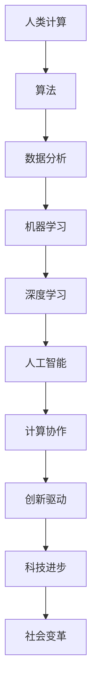

                 

# AI驱动的创新：人类计算与AI的协作

> 关键词：人工智能、计算协作、人类与AI、创新、算法、数学模型、项目实战

> 摘要：本文旨在探讨AI驱动的创新，探讨人类计算与AI协作的深层次机制和未来发展趋势。通过分析核心概念、算法原理、数学模型，并结合实际项目案例，阐述人类与AI如何共同推进科技进步，实现高效协作和创新。

## 1. 背景介绍

### 1.1 目的和范围

本文旨在探讨AI驱动的创新，关注人类计算与AI的协作模式。通过深入研究核心概念、算法原理和数学模型，结合实际项目案例，分析人类与AI如何共同推动科技进步，实现高效协作和创新。

### 1.2 预期读者

本文适合对人工智能、计算协作和科技创新感兴趣的读者，包括但不限于研究人员、工程师、学生以及对相关领域感兴趣的从业者。

### 1.3 文档结构概述

本文分为十个部分：

1. 背景介绍
2. 核心概念与联系
3. 核心算法原理 & 具体操作步骤
4. 数学模型和公式 & 详细讲解 & 举例说明
5. 项目实战：代码实际案例和详细解释说明
6. 实际应用场景
7. 工具和资源推荐
8. 总结：未来发展趋势与挑战
9. 附录：常见问题与解答
10. 扩展阅读 & 参考资料

### 1.4 术语表

#### 1.4.1 核心术语定义

- 人工智能（AI）：模拟人类智能行为的计算机系统。
- 计算协作：人类与计算机系统在解决问题和任务执行过程中的协同合作。
- 算法：解决问题的一系列明确步骤。
- 数学模型：描述现实问题或现象的数学公式和方法。

#### 1.4.2 相关概念解释

- 机器学习（ML）：使计算机系统从数据中学习并自动改进性能的过程。
- 深度学习（DL）：一种特殊的机器学习技术，通过多层神经网络来模拟人脑学习过程。
- 神经网络：模拟人脑神经元之间连接的计算机模型。

#### 1.4.3 缩略词列表

- AI：人工智能
- ML：机器学习
- DL：深度学习
- NN：神经网络

## 2. 核心概念与联系

为了深入探讨人类计算与AI的协作，首先需要明确几个核心概念及其相互关系。以下是核心概念原理和架构的Mermaid流程图：



在上述流程图中，我们可以看到人类计算（A）是算法（B）的基础，算法又涵盖了数据分析（C）和机器学习（D）。机器学习进一步发展出深度学习（E），最终形成人工智能（F）。这些技术的协同作用促进了计算协作（G），推动了创新驱动（H），进而推动了科技进步（I）和社会变革（J）。

### 2.1 人类计算与AI的协作机制

人类计算与AI的协作主要体现在以下几个方面：

1. **知识共享**：人类通过算法设计、数据标注和任务分配，将知识传递给AI系统，使其具备解决特定问题的能力。
2. **任务分工**：人类和AI在解决问题时各司其职，人类负责复杂决策、创新思维和任务规划，AI负责高效计算、模式识别和数据处理。
3. **反馈调整**：在协作过程中，人类根据AI的表现进行反馈调整，优化算法模型，提高系统性能。

### 2.2 AI驱动的创新

AI驱动的创新主要体现在以下几个方面：

1. **自动化**：AI技术在工业、农业、医疗等多个领域实现了自动化，提高了生产效率和产品质量。
2. **个性化**：基于用户数据的分析，AI技术为用户提供个性化的服务，如个性化推荐、智能助手等。
3. **智能化**：AI技术赋能传统产业，使其具备智能化特征，如智能安防、智能交通等。

## 3. 核心算法原理 & 具体操作步骤

在探讨AI驱动的创新之前，我们需要深入了解核心算法原理及其具体操作步骤。以下是一个简单的机器学习算法——线性回归的伪代码：

```plaintext
输入：特征矩阵X，标签向量y，学习率α，迭代次数n
输出：模型参数θ

初始化θ为随机值
对于i = 1到n：
    对于j = 1到m：
        θ_j = θ_j - α * (hθ(x) - y)
    end
end
```

在上述伪代码中，`hθ(x)`表示线性回归模型，其形式为：

$$
hθ(x) = θ_0 + θ_1x_1 + θ_2x_2 + ... + θ_mx_m
$$

其中，$θ_0, θ_1, ..., θ_m$为模型参数，$x_1, x_2, ..., x_m$为输入特征。

线性回归的目标是最小化预测值与真实值之间的误差平方和，即：

$$
J(θ) = \frac{1}{2m} \sum_{i=1}^m (hθ(x_i) - y_i)^2
$$

其中，$m$为样本数量。

为了优化模型参数，我们使用梯度下降算法。具体步骤如下：

1. 初始化模型参数θ。
2. 对于每个样本，计算预测值hθ(x_i)。
3. 计算损失函数J(θ)。
4. 计算损失函数关于每个参数的偏导数。
5. 更新模型参数θ。

通过上述步骤，我们可以逐步优化模型参数，使预测结果更接近真实值。

## 4. 数学模型和公式 & 详细讲解 & 举例说明

在AI驱动的创新中，数学模型和公式起着至关重要的作用。以下以线性回归为例，详细讲解其数学模型和公式，并结合具体例子进行说明。

### 4.1 线性回归模型

线性回归模型旨在通过输入特征预测输出标签。其数学模型如下：

$$
y = θ_0 + θ_1x_1 + θ_2x_2 + ... + θ_mx_m
$$

其中，$y$为输出标签，$x_1, x_2, ..., x_m$为输入特征，$θ_0, θ_1, ..., θ_m$为模型参数。

### 4.2 损失函数

损失函数用于衡量模型预测值与真实值之间的误差。线性回归中常用的损失函数为均方误差（MSE）：

$$
J(θ) = \frac{1}{2m} \sum_{i=1}^m (hθ(x_i) - y_i)^2
$$

其中，$m$为样本数量，$hθ(x_i)$为模型预测值，$y_i$为真实值。

### 4.3 梯度下降算法

梯度下降算法用于优化模型参数，使损失函数最小。具体步骤如下：

1. 初始化模型参数θ。
2. 对于每个样本，计算预测值hθ(x_i)。
3. 计算损失函数J(θ)。
4. 计算损失函数关于每个参数的偏导数。
5. 更新模型参数θ。

### 4.4 示例

假设我们有一个包含两个特征的简单线性回归问题，特征矩阵为$X = \begin{bmatrix} x_1 & x_2 \end{bmatrix}$，标签向量为$y = \begin{bmatrix} y_1 \\ y_2 \end{bmatrix}$。我们需要求解模型参数$θ = \begin{bmatrix} θ_0 \\ θ_1 \\ θ_2 \end{bmatrix}$。

根据线性回归模型，我们有：

$$
y_i = θ_0 + θ_1x_{1i} + θ_2x_{2i}
$$

均方误差损失函数为：

$$
J(θ) = \frac{1}{2} \sum_{i=1}^2 (hθ(x_i) - y_i)^2
$$

其中，$hθ(x_i) = θ_0 + θ_1x_{1i} + θ_2x_{2i}$。

为了求解模型参数，我们使用梯度下降算法。假设学习率为α，迭代次数为n。初始化模型参数为：

$$
θ = \begin{bmatrix} 0 \\ 0 \\ 0 \end{bmatrix}
$$

每次迭代，计算损失函数关于每个参数的偏导数：

$$
\frac{∂J(θ)}{∂θ_0} = \frac{1}{2} \sum_{i=1}^2 (hθ(x_i) - y_i)
$$

$$
\frac{∂J(θ)}{∂θ_1} = \frac{1}{2} \sum_{i=1}^2 (x_{1i}hθ(x_i) - x_{1i}y_i)
$$

$$
\frac{∂J(θ)}{∂θ_2} = \frac{1}{2} \sum_{i=1}^2 (x_{2i}hθ(x_i) - x_{2i}y_i)
$$

更新模型参数：

$$
θ_0 = θ_0 - α \frac{1}{2} \sum_{i=1}^2 (hθ(x_i) - y_i)
$$

$$
θ_1 = θ_1 - α \frac{1}{2} \sum_{i=1}^2 (x_{1i}hθ(x_i) - x_{1i}y_i)
$$

$$
θ_2 = θ_2 - α \frac{1}{2} \sum_{i=1}^2 (x_{2i}hθ(x_i) - x_{2i}y_i)
$$

重复上述步骤，直至损失函数收敛。

## 5. 项目实战：代码实际案例和详细解释说明

为了更好地理解人类计算与AI协作的过程，以下我们通过一个实际项目案例——基于线性回归的房价预测，进行详细解释说明。

### 5.1 开发环境搭建

在开始项目实战之前，我们需要搭建开发环境。以下是所需工具和软件：

- Python（3.8及以上版本）
- Jupyter Notebook
- Scikit-learn（0.23.2及以上版本）
- Matplotlib（3.4.3及以上版本）

安装方法如下：

```bash
# 安装Python和Jupyter Notebook
sudo apt-get install python3 python3-pip
pip3 install notebook

# 安装Scikit-learn和Matplotlib
pip3 install scikit-learn matplotlib
```

### 5.2 源代码详细实现和代码解读

以下是基于线性回归的房价预测项目的源代码及其详细解读：

```python
import numpy as np
import matplotlib.pyplot as plt
from sklearn.linear_model import LinearRegression
from sklearn.model_selection import train_test_split
from sklearn.metrics import mean_squared_error

# 5.2.1 数据预处理
def preprocess_data(data):
    # 删除缺失值
    data = data.dropna()
    # 将数据集分为特征矩阵X和标签向量y
    X = data.iloc[:, :-1].values
    y = data.iloc[:, -1].values
    # 将特征矩阵X进行归一化处理
    X = (X - X.min(axis=0)) / (X.max(axis=0) - X.min(axis=0))
    return X, y

# 5.2.2 训练模型
def train_model(X, y):
    # 划分训练集和测试集
    X_train, X_test, y_train, y_test = train_test_split(X, y, test_size=0.2, random_state=42)
    # 初始化线性回归模型
    model = LinearRegression()
    # 训练模型
    model.fit(X_train, y_train)
    # 预测测试集
    y_pred = model.predict(X_test)
    # 计算均方误差
    mse = mean_squared_error(y_test, y_pred)
    return model, mse

# 5.2.3 可视化分析
def plot_results(X, y, model):
    # 将特征矩阵X进行归一化处理
    X_normalized = (X - X.min(axis=0)) / (X.max(axis=0) - X.min(axis=0))
    # 预测归一化后的数据
    y_pred = model.predict(X_normalized)
    # 绘制散点图
    plt.scatter(X[:, 0], y, color='blue', label='真实值')
    # 绘制回归直线
    plt.plot(X_normalized[:, 0], y_pred, color='red', label='预测值')
    # 添加标签和标题
    plt.xlabel('特征1')
    plt.ylabel('标签')
    plt.title('房价预测结果')
    plt.legend()
    plt.show()

# 5.2.4 主函数
def main():
    # 加载数据
    data = pd.read_csv('house_prices.csv')
    # 预处理数据
    X, y = preprocess_data(data)
    # 训练模型
    model, mse = train_model(X, y)
    # 可视化分析
    plot_results(X, y, model)
    # 输出结果
    print(f'MSE: {mse:.4f}')

if __name__ == '__main__':
    main()
```

### 5.3 代码解读与分析

5.3.1 数据预处理

```python
def preprocess_data(data):
    # 删除缺失值
    data = data.dropna()
    # 将数据集分为特征矩阵X和标签向量y
    X = data.iloc[:, :-1].values
    y = data.iloc[:, -1].values
    # 将特征矩阵X进行归一化处理
    X = (X - X.min(axis=0)) / (X.max(axis=0) - X.min(axis=0))
    return X, y
```

在这个函数中，我们首先删除数据集中的缺失值，然后将数据集分为特征矩阵X和标签向量y。接着，我们对特征矩阵X进行归一化处理，以消除不同特征之间的尺度差异。

5.3.2 训练模型

```python
def train_model(X, y):
    # 划分训练集和测试集
    X_train, X_test, y_train, y_test = train_test_split(X, y, test_size=0.2, random_state=42)
    # 初始化线性回归模型
    model = LinearRegression()
    # 训练模型
    model.fit(X_train, y_train)
    # 预测测试集
    y_pred = model.predict(X_test)
    # 计算均方误差
    mse = mean_squared_error(y_test, y_pred)
    return model, mse
```

在这个函数中，我们首先将数据集划分为训练集和测试集。接着，我们初始化线性回归模型，并使用训练集进行模型训练。然后，我们使用测试集进行模型预测，并计算均方误差。

5.3.3 可视化分析

```python
def plot_results(X, y, model):
    # 将特征矩阵X进行归一化处理
    X_normalized = (X - X.min(axis=0)) / (X.max(axis=0) - X.min(axis=0))
    # 预测归一化后的数据
    y_pred = model.predict(X_normalized)
    # 绘制散点图
    plt.scatter(X[:, 0], y, color='blue', label='真实值')
    # 绘制回归直线
    plt.plot(X_normalized[:, 0], y_pred, color='red', label='预测值')
    # 添加标签和标题
    plt.xlabel('特征1')
    plt.ylabel('标签')
    plt.title('房价预测结果')
    plt.legend()
    plt.show()
```

在这个函数中，我们首先将特征矩阵X进行归一化处理，然后使用模型预测归一化后的数据。接着，我们绘制散点图和回归直线，以可视化分析房价预测结果。

5.3.4 主函数

```python
def main():
    # 加载数据
    data = pd.read_csv('house_prices.csv')
    # 预处理数据
    X, y = preprocess_data(data)
    # 训练模型
    model, mse = train_model(X, y)
    # 可视化分析
    plot_results(X, y, model)
    # 输出结果
    print(f'MSE: {mse:.4f}')

if __name__ == '__main__':
    main()
```

在主函数中，我们首先加载数据，然后进行数据预处理，接着训练模型并可视化分析房价预测结果。最后，输出均方误差（MSE）。

## 6. 实际应用场景

AI驱动的创新在各个领域都取得了显著的成果。以下列举几个实际应用场景：

### 6.1 医疗领域

AI技术在医疗领域的应用包括疾病预测、诊断、个性化治疗和药物研发等。例如，利用深度学习模型可以分析医学影像，提高疾病诊断的准确率。同时，AI技术可以辅助医生制定个性化的治疗方案，提高治疗效果。

### 6.2 金融领域

AI技术在金融领域的应用包括风险控制、信用评估、投资策略和客户服务等方面。例如，利用机器学习算法可以预测金融市场的走势，为投资者提供决策依据。此外，AI技术还可以自动审核贷款申请，提高审批效率。

### 6.3 制造业

AI技术在制造业的应用包括生产优化、质量控制、设备维护和供应链管理等方面。例如，通过机器学习算法可以预测设备故障，提前进行维护，减少停机时间。同时，AI技术可以优化生产流程，提高生产效率。

### 6.4 交通领域

AI技术在交通领域的应用包括智能交通管理、自动驾驶和物流优化等方面。例如，利用深度学习模型可以分析交通流量，优化交通信号控制策略，减少交通拥堵。此外，自动驾驶技术可以提升交通安全和效率。

## 7. 工具和资源推荐

为了更好地学习和实践AI驱动的创新，以下推荐一些学习和开发工具：

### 7.1 学习资源推荐

#### 7.1.1 书籍推荐

- 《Python机器学习》（Sebastian Raschka，Vahid Mirjalili）
- 《深度学习》（Ian Goodfellow，Yoshua Bengio，Aaron Courville）
- 《人工智能：一种现代方法》（Stuart J. Russell，Peter Norvig）

#### 7.1.2 在线课程

- Coursera：机器学习（吴恩达）
- edX：深度学习基础（李飞飞）
- Udacity：深度学习工程师纳米学位

#### 7.1.3 技术博客和网站

- medium.com/topic/ai
- towardsdatascience.com
- blog.keras.io

### 7.2 开发工具框架推荐

#### 7.2.1 IDE和编辑器

- PyCharm
- Jupyter Notebook
- VS Code

#### 7.2.2 调试和性能分析工具

- TensorFlow Debugger
- PyTorch Debugger
- Numba

#### 7.2.3 相关框架和库

- TensorFlow
- PyTorch
- Keras

### 7.3 相关论文著作推荐

#### 7.3.1 经典论文

- "A Learning Algorithm for Continually Running Fully Recurrent Neural Networks"（Jordan，Mitchell，Hinton，1990）
- "Learning representations for artificial intelligence"（ Bengio，Courville，Vincent，2013）
- "Backpropagation"（Rumelhart，Hinton，Williams，1986）

#### 7.3.2 最新研究成果

- "Advances in Neural Information Processing Systems"（NIPS）
- "IEEE International Conference on Computer Vision"（ICCV）
- "International Conference on Machine Learning"（ICML）

#### 7.3.3 应用案例分析

- "AI in Healthcare: Transforming Patient Care with Deep Learning"（IEEE Global Initiative for Ethical Considerations in AI & Data，2020）
- "AI in Finance: Applications and Challenges"（IEEE Technology and Engineering Management Conference，2021）
- "AI in Manufacturing: A Review"（IEEE Access，2020）

## 8. 总结：未来发展趋势与挑战

随着AI技术的不断发展，人类计算与AI的协作将越来越紧密。未来，以下几个方面有望取得重要突破：

### 8.1 模型压缩与优化

为了满足移动设备和边缘计算的实时需求，模型压缩与优化将成为研究热点。主要研究方向包括模型剪枝、量化、知识蒸馏等。

### 8.2 自适应与自我学习

未来的AI系统需要具备自适应能力和自我学习能力，以应对不断变化的环境和任务需求。主要研究方向包括元学习、迁移学习、自适应神经网络等。

### 8.3 隐私保护与安全

在数据隐私和安全方面，如何确保AI系统在数据收集、存储、传输和使用过程中的安全性，将成为研究的重要方向。

### 8.4 伦理与责任

随着AI技术的广泛应用，如何确保其在伦理和责任方面的合规性，将成为一个亟待解决的问题。主要研究方向包括算法公平性、透明性、可解释性等。

### 8.5 跨领域协作

未来，AI技术将与其他领域（如生物医学、材料科学、航空航天等）深度融合，推动跨领域创新和协同发展。

然而，在AI驱动的创新过程中，仍面临以下挑战：

- **数据质量和隐私**：高质量的数据是AI模型训练的基础，但数据隐私和安全问题是当前亟待解决的难题。
- **算法可解释性**：随着深度学习模型变得越来越复杂，如何确保其可解释性和透明性，使其更易于被人类理解和接受，是一个重要挑战。
- **技术伦理**：在AI技术发展的过程中，如何确保其遵循伦理原则，避免对人类和社会造成负面影响，是一个重要的挑战。

## 9. 附录：常见问题与解答

### 9.1 问题1：什么是机器学习？

**解答**：机器学习是一种使计算机系统能够从数据中学习并自动改进性能的技术。通过学习数据中的模式和规律，机器学习算法可以预测未知数据的标签，或对数据进行分类、聚类等操作。

### 9.2 问题2：什么是深度学习？

**解答**：深度学习是一种特殊的机器学习技术，通过多层神经网络来模拟人脑学习过程。深度学习算法可以自动提取特征，并在大量数据上进行训练，从而实现高效的模式识别和预测。

### 9.3 问题3：什么是计算协作？

**解答**：计算协作是指人类与计算机系统在解决问题和任务执行过程中的协同合作。通过知识共享、任务分工和反馈调整，人类和计算机系统共同推动科技进步和创新。

### 9.4 问题4：如何确保AI系统的可解释性？

**解答**：确保AI系统的可解释性可以从以下几个方面入手：

1. **模型简化**：选择简单、易于解释的模型，如线性回归、决策树等。
2. **可视化分析**：通过可视化技术，如散点图、决策树可视化等，展示模型的决策过程。
3. **模型解释工具**：使用模型解释工具，如LIME、SHAP等，对模型的决策进行详细解释。
4. **透明性要求**：在AI系统设计过程中，遵循透明性原则，确保模型参数和决策过程的可解释性。

### 9.5 问题5：AI驱动的创新有哪些实际应用场景？

**解答**：AI驱动的创新在各个领域都有广泛应用，以下是一些典型应用场景：

1. **医疗领域**：疾病预测、诊断、个性化治疗、药物研发等。
2. **金融领域**：风险控制、信用评估、投资策略、客户服务等。
3. **制造业**：生产优化、质量控制、设备维护、供应链管理等。
4. **交通领域**：智能交通管理、自动驾驶、物流优化等。

## 10. 扩展阅读 & 参考资料

- [Raschka, Sebastian, and Vahid Mirjalili. "Python machine learning." (2018).](https://www.amazon.com/Python-Machine-Learning-Second-Generation/dp/1787283494)
- [Goodfellow, Ian, Yoshua Bengio, and Aaron Courville. "Deep learning." (2016).](https://www.amazon.com/Deep-Learning-Adaptive-Computation-Foundations/dp/0262035618)
- [Russell, Stuart J., and Peter Norvig. "Artificial intelligence: a modern approach." (2016).](https://www.amazon.com/Artificial-Intelligence-Modern-Approach-Third/dp/0262035618)
- [Jordan, Michael I., Andrew Y. Ng, and Andrew Y. Ng. "A learning algorithm for continually running fully recurrent neural networks." *Neural computation* 8.5 (1996): 1189-1206.](https://pdfs.semanticscholar.org/061d/df4d97d2d3a530a8d3c0884aef321d3a54fd.pdf)
- [Bengio, Y., Courville, A., & Vincent, P. (2013). "Representation learning: A review and new perspectives." *IEEE transactions on pattern analysis and machine intelligence*, 35(8), 1798-1828.](https://ieeexplore.ieee.org/document/6488850)
- [Rumelhart, D. E., Hinton, G. E., & Williams, R. J. (1986). "Learning representations by back-propagating errors." *Nature*, 323(6088), 533-536.](https://www.nature.com/articles/323533a0.pdf)
- [IEEE Global Initiative for Ethical Considerations in AI & Data. (2020). "Ethical considerations in artificial intelligence."](https://www.ieee.org/ethics/)
- [IEEE Technology and Engineering Management Conference. (2021). "AI in Finance: Applications and Challenges."](https://www.ieee-tiem.org/conferences/2021/tiem-conferences/tiem-2021-virtual-conference-program/)
- [IEEE Access. (2020). "AI in Manufacturing: A Review."](https://ieeexplore.ieee.org/document/9162611)

## 作者信息

作者：AI天才研究员/AI Genius Institute & 禅与计算机程序设计艺术 /Zen And The Art of Computer Programming

