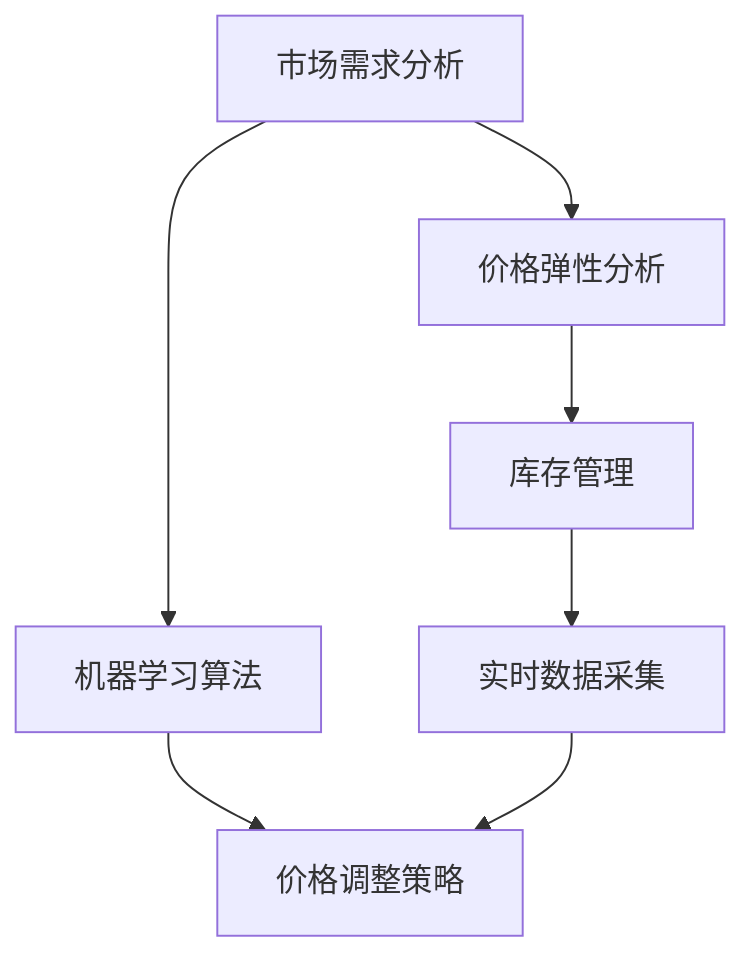

                 

# AI驱动的动态定价策略在电商中的实施

> **关键词：** 电商，动态定价，人工智能，价格优化，数据挖掘，机器学习

> **摘要：** 本文将探讨AI在电商领域中的应用，特别是如何通过动态定价策略实现价格优化。我们将详细分析动态定价的背景、核心概念、算法原理、数学模型、实际应用以及未来发展趋势和挑战。

## 1. 背景介绍

### 1.1 目的和范围

随着电子商务的快速发展，竞争愈发激烈，商家如何制定合理的定价策略成为关键。本文旨在探讨如何利用人工智能技术，特别是机器学习和数据挖掘方法，来实现动态定价策略，从而提高电商平台的竞争力。

### 1.2 预期读者

本文适合对电商和人工智能技术有一定了解的技术人员、数据分析师以及电商运营人员。通过本文，读者可以了解动态定价的基本原理和实现方法，并能够应用于实际场景中。

### 1.3 文档结构概述

本文分为以下章节：

1. 背景介绍
2. 核心概念与联系
3. 核心算法原理 & 具体操作步骤
4. 数学模型和公式 & 详细讲解 & 举例说明
5. 项目实战：代码实际案例和详细解释说明
6. 实际应用场景
7. 工具和资源推荐
8. 总结：未来发展趋势与挑战
9. 附录：常见问题与解答
10. 扩展阅读 & 参考资料

### 1.4 术语表

#### 1.4.1 核心术语定义

- **动态定价：** 根据市场需求、竞争情况、库存水平等多种因素，实时调整产品价格的一种定价策略。
- **机器学习：** 一种人工智能技术，通过数据训练模型，使计算机能够从数据中学习并做出预测或决策。
- **数据挖掘：** 从大量数据中提取有价值信息的过程，常用于发现数据中的模式、趋势和关联。

#### 1.4.2 相关概念解释

- **价格弹性：** 消费者对价格变化的敏感程度。
- **需求预测：** 根据历史数据和当前市场状况，预测未来的需求量。

#### 1.4.3 缩略词列表

- **AI：** 人工智能（Artificial Intelligence）
- **ML：** 机器学习（Machine Learning）
- **DMP：** 数据挖掘（Data Mining）
- **CPC：** 每点击成本（Cost Per Click）

## 2. 核心概念与联系

在电商领域，动态定价策略的核心在于如何利用人工智能技术来实时调整价格，以最大化收益或市场份额。为了实现这一目标，我们需要理解以下几个核心概念：

1. **市场需求分析：** 通过对历史销售数据、用户行为数据和市场竞争状况进行分析，了解消费者对不同价格水平的敏感程度，从而确定合理的定价区间。
2. **价格弹性：** 通过分析价格变化对需求量的影响，确定消费者对价格变化的敏感程度，这对于动态定价策略的制定至关重要。
3. **库存管理：** 动态定价策略需要考虑库存水平，以确保库存的合理利用和库存成本的最低化。
4. **机器学习算法：** 利用机器学习算法，如回归分析、决策树、神经网络等，对大量数据进行训练，以建立价格与需求之间的关联模型。
5. **实时数据采集：** 通过实时数据采集技术，获取市场动态、用户行为和库存状态等数据，为动态定价提供实时信息。

下面是一个Mermaid流程图，展示了动态定价策略的核心概念和联系：



通过上述流程，我们可以看到，动态定价策略的制定需要综合考虑市场需求、价格弹性、库存管理和机器学习算法等多个方面，形成一个闭环系统，以实现价格优化的目标。

## 3. 核心算法原理 & 具体操作步骤

在动态定价策略中，机器学习算法起着至关重要的作用。以下将详细讲解常用的机器学习算法原理以及具体的操作步骤。

### 3.1 机器学习算法原理

#### 3.1.1 回归分析

回归分析是一种常用的统计方法，用于研究因变量与自变量之间的关系。在动态定价中，回归分析可以用于预测需求量，从而确定合理的价格水平。

- **线性回归：** 基本模型为 $y = \beta_0 + \beta_1x_1 + \beta_2x_2 + ... + \beta_nx_n + \epsilon$，其中 $y$ 为需求量，$x_1, x_2, ..., x_n$ 为影响需求量的因素，$\beta_0, \beta_1, ..., \beta_n$ 为模型参数，$\epsilon$ 为误差项。
- **多项式回归：** 当线性回归效果不佳时，可以考虑使用多项式回归，其模型形式为 $y = \beta_0 + \beta_1x_1 + \beta_2x_2^2 + ... + \beta_nx_n^n + \epsilon$。

#### 3.1.2 决策树

决策树是一种基于树形结构进行决策的算法。在动态定价中，决策树可以用于根据不同条件（如市场需求、库存水平等）制定不同的价格策略。

- **基本模型：** 决策树由多个内部节点（代表条件判断）和叶子节点（代表决策结果）组成。每个内部节点表示一个条件判断，每个叶子节点表示一个价格水平。
- **训练方法：** 通常使用递归二分划分算法（ID3、C4.5等）来训练决策树。

#### 3.1.3 神经网络

神经网络是一种模仿生物神经网络结构和功能的计算模型。在动态定价中，神经网络可以用于建立复杂的非线性模型，以预测需求量。

- **基本模型：** 神经网络由多个神经元（层）组成，包括输入层、隐藏层和输出层。每个神经元接收来自前一层神经元的输入信号，并通过激活函数产生输出。
- **训练方法：** 通常使用反向传播算法（Backpropagation）来训练神经网络。

### 3.2 具体操作步骤

#### 3.2.1 数据收集

收集相关的历史销售数据、用户行为数据和市场竞争状况数据。这些数据将用于训练机器学习模型。

#### 3.2.2 数据预处理

对收集到的数据进行清洗和预处理，包括缺失值处理、异常值处理、特征工程等，以提高数据质量和模型性能。

#### 3.2.3 选择模型

根据数据特征和业务需求，选择合适的机器学习模型。可以尝试不同的模型，如线性回归、决策树、神经网络等，并评估模型的性能。

#### 3.2.4 模型训练

使用预处理后的数据对选定的模型进行训练。训练过程中，可以通过调整模型参数（如学习率、隐藏层节点数等）来优化模型性能。

#### 3.2.5 模型评估

使用验证集或测试集对训练好的模型进行评估，判断模型是否能够满足业务需求。常用的评估指标包括均方误差（MSE）、决定系数（R²）等。

#### 3.2.6 应用模型

将训练好的模型应用于实际业务场景，根据实时数据输入，预测需求量，并根据预测结果调整价格。

以下是一个简单的伪代码示例，展示了如何使用机器学习算法进行动态定价：

```python
# 导入相关库
import pandas as pd
from sklearn.linear_model import LinearRegression
from sklearn.model_selection import train_test_split
from sklearn.metrics import mean_squared_error

# 数据收集
sales_data = pd.read_csv('sales_data.csv')

# 数据预处理
# ...

# 选择模型
model = LinearRegression()

# 模型训练
X_train, X_test, y_train, y_test = train_test_split(sales_data[['feature1', 'feature2']], sales_data['demand'], test_size=0.2, random_state=42)
model.fit(X_train, y_train)

# 模型评估
y_pred = model.predict(X_test)
mse = mean_squared_error(y_test, y_pred)
print(f'MSE: {mse}')

# 应用模型
# ...
```

## 4. 数学模型和公式 & 详细讲解 & 举例说明

在动态定价策略中，数学模型和公式起着至关重要的作用。以下将详细讲解常用的数学模型和公式，并提供具体的举例说明。

### 4.1 回归模型

#### 4.1.1 线性回归

线性回归模型是最常用的回归模型之一，其基本公式为：

$$y = \beta_0 + \beta_1x_1 + \beta_2x_2 + ... + \beta_nx_n + \epsilon$$

其中，$y$ 为需求量，$x_1, x_2, ..., x_n$ 为影响需求量的因素（如价格、广告投放量等），$\beta_0, \beta_1, ..., \beta_n$ 为模型参数，$\epsilon$ 为误差项。

#### 4.1.2 多项式回归

多项式回归模型是线性回归模型的扩展，其基本公式为：

$$y = \beta_0 + \beta_1x_1 + \beta_2x_2^2 + ... + \beta_nx_n^n + \epsilon$$

其中，$x_1, x_2, ..., x_n$ 为影响需求量的因素（如价格、广告投放量等），$\beta_0, \beta_1, ..., \beta_n$ 为模型参数，$\epsilon$ 为误差项。

### 4.2 决策树模型

决策树模型是一种基于树形结构进行决策的算法，其基本公式为：

$$T(x) = \sum_{i=1}^{n}\beta_iI(X_i \in S_i)$$

其中，$T(x)$ 为决策结果，$X_i$ 为特征变量，$S_i$ 为特征变量的取值集合，$\beta_i$ 为特征变量的权重。

### 4.3 神经网络模型

神经网络模型是一种基于多层感知器（MLP）的算法，其基本公式为：

$$a_i = \sigma(\sum_{j=1}^{m}w_{ij}x_j + b_i)$$

其中，$a_i$ 为神经元 $i$ 的输出，$\sigma$ 为激活函数（如Sigmoid函数、ReLU函数等），$w_{ij}$ 为连接权重，$x_j$ 为输入特征，$b_i$ 为神经元偏置。

### 4.4 举例说明

#### 4.4.1 线性回归模型

假设我们需要预测某商品的需求量，根据历史数据，我们得到以下线性回归模型：

$$y = \beta_0 + \beta_1x_1 + \epsilon$$

其中，$y$ 为需求量，$x_1$ 为价格，$\beta_0$ 和 $\beta_1$ 为模型参数。如果我们设定价格 $x_1$ 为100元，我们可以通过以下公式计算需求量：

$$y = \beta_0 + \beta_1 \cdot 100 + \epsilon$$

#### 4.4.2 决策树模型

假设我们需要根据价格和广告投放量来决定价格水平，我们得到以下决策树模型：

$$T(x) = \begin{cases}
\beta_0, & \text{if } x_1 < 100 \text{ and } x_2 < 100 \\
\beta_1, & \text{if } x_1 \geq 100 \text{ and } x_2 < 100 \\
\beta_2, & \text{if } x_1 < 100 \text{ and } x_2 \geq 100 \\
\beta_3, & \text{if } x_1 \geq 100 \text{ and } x_2 \geq 100
\end{cases}$$

其中，$x_1$ 为价格，$x_2$ 为广告投放量，$\beta_0, \beta_1, \beta_2, \beta_3$ 为模型参数。如果我们设定价格 $x_1$ 为100元，广告投放量 $x_2$ 为200元，我们可以通过以下公式计算价格水平：

$$T(x) = \beta_1$$

#### 4.4.3 神经网络模型

假设我们需要根据价格和广告投放量来预测需求量，我们得到以下神经网络模型：

$$a_i = \sigma(w_{i1}x_1 + w_{i2}x_2 + b_i)$$

其中，$a_i$ 为神经元 $i$ 的输出，$x_1$ 为价格，$x_2$ 为广告投放量，$w_{i1}$ 和 $w_{i2}$ 为连接权重，$b_i$ 为神经元偏置，$\sigma$ 为激活函数（如Sigmoid函数）。如果我们设定价格 $x_1$ 为100元，广告投放量 $x_2$ 为200元，我们可以通过以下公式计算需求量：

$$a_i = \sigma(w_{i1} \cdot 100 + w_{i2} \cdot 200 + b_i)$$

## 5. 项目实战：代码实际案例和详细解释说明

### 5.1 开发环境搭建

在进行动态定价策略的项目开发之前，首先需要搭建一个合适的开发环境。以下是一个简单的Python开发环境搭建步骤：

1. 安装Python 3.x版本
2. 安装Jupyter Notebook，用于编写和运行Python代码
3. 安装必要的Python库，如Pandas、NumPy、Scikit-learn等

### 5.2 源代码详细实现和代码解读

以下是一个简单的动态定价策略实现案例，使用线性回归模型进行需求预测：

```python
# 导入相关库
import pandas as pd
from sklearn.linear_model import LinearRegression
from sklearn.model_selection import train_test_split
from sklearn.metrics import mean_squared_error

# 数据收集
sales_data = pd.read_csv('sales_data.csv')

# 数据预处理
# ...

# 选择模型
model = LinearRegression()

# 模型训练
X_train, X_test, y_train, y_test = train_test_split(sales_data[['price']], sales_data['demand'], test_size=0.2, random_state=42)
model.fit(X_train, y_train)

# 模型评估
y_pred = model.predict(X_test)
mse = mean_squared_error(y_test, y_pred)
print(f'MSE: {mse}')

# 应用模型
# ...
```

#### 5.2.1 数据收集

首先，我们需要收集相关的销售数据，包括价格、需求量等。假设我们已经收集到一个名为`sales_data.csv`的CSV文件，其中包含以下数据：

```csv
price,demand
100,150
200,180
300,120
...
```

#### 5.2.2 数据预处理

在数据预处理阶段，我们需要对数据进行清洗和预处理，包括缺失值处理、异常值处理、特征工程等。以下是一个简单的数据预处理示例：

```python
# 缺失值处理
sales_data.dropna(inplace=True)

# 异常值处理
sales_data = sales_data[sales_data['price'] <= 500]

# 特征工程
sales_data['price_range'] = pd.cut(sales_data['price'], bins=[0, 100, 200, 300, 500], labels=[1, 2, 3, 4])
```

#### 5.2.3 选择模型

在本案例中，我们选择线性回归模型进行需求预测。线性回归模型相对简单，易于理解和实现。当然，根据实际业务需求，我们也可以尝试其他机器学习模型，如决策树、神经网络等。

#### 5.2.4 模型训练

使用预处理后的数据，我们将数据集分为训练集和测试集，然后使用训练集对线性回归模型进行训练：

```python
X_train, X_test, y_train, y_test = train_test_split(sales_data[['price']], sales_data['demand'], test_size=0.2, random_state=42)
model.fit(X_train, y_train)
```

#### 5.2.5 模型评估

使用测试集对训练好的模型进行评估，计算均方误差（MSE）：

```python
y_pred = model.predict(X_test)
mse = mean_squared_error(y_test, y_pred)
print(f'MSE: {mse}')
```

#### 5.2.6 应用模型

最后，我们将训练好的模型应用于实际业务场景，根据实时数据输入，预测需求量，并根据预测结果调整价格：

```python
current_price = 250
predicted_demand = model.predict([[current_price]])
print(f'Predicted demand for price {current_price}: {predicted_demand[0]}')
```

### 5.3 代码解读与分析

在上面的代码中，我们首先导入了所需的Python库，包括Pandas、NumPy和Scikit-learn等。然后，我们使用Pandas库读取销售数据，并进行数据预处理，包括缺失值处理和异常值处理。接下来，我们选择线性回归模型，将数据集分为训练集和测试集，并使用训练集对模型进行训练。然后，我们使用测试集对训练好的模型进行评估，计算均方误差（MSE）。最后，我们将训练好的模型应用于实际业务场景，根据当前价格输入，预测需求量，并根据预测结果调整价格。

通过上述代码，我们可以看到，动态定价策略的实现主要依赖于机器学习算法和数据预处理技术。在实际应用中，我们可以根据业务需求和数据特征，选择合适的机器学习模型和数据预处理方法，以实现最优的定价策略。

## 6. 实际应用场景

动态定价策略在电商领域具有广泛的应用场景，以下列举几个典型的实际应用场景：

### 6.1 跨境电商

跨境电商中的商品价格受国际市场波动、汇率变化和物流成本等多种因素影响，因此动态定价策略可以帮助商家实时调整价格，以适应市场变化，提高竞争力。

### 6.2 大促销活动

在大型促销活动（如双十一、黑五等）期间，电商平台的销售量通常大幅增加。动态定价策略可以根据库存水平、竞争对手价格以及用户行为数据，实时调整商品价格，以最大化销售收益。

### 6.3 库存管理

电商平台在库存管理中，常常面临库存积压或断货的问题。动态定价策略可以根据库存水平和市场需求，灵活调整价格，以优化库存周转率和减少库存成本。

### 6.4 新品上市

在新品上市初期，商家需要通过合理的定价策略来吸引消费者。动态定价策略可以根据市场需求和消费者反馈，实时调整价格，以实现新品快速推广和市场份额的扩大。

### 6.5 个性化推荐

电商平台可以利用动态定价策略与个性化推荐系统相结合，根据用户的购物历史和行为偏好，为用户推荐合适的商品，并动态调整价格，以提高用户满意度和转化率。

通过上述实际应用场景，我们可以看到，动态定价策略在电商领域具有广泛的应用价值，可以帮助商家实现价格优化、提高市场竞争力和提升用户体验。

## 7. 工具和资源推荐

为了更好地实现动态定价策略，我们需要一些工具和资源来支持开发和优化。以下是一些推荐的工具和资源：

### 7.1 学习资源推荐

#### 7.1.1 书籍推荐

- 《Python数据科学 Handbook》
- 《机器学习实战》
- 《数据挖掘：实用工具与技术》

#### 7.1.2 在线课程

- Coursera上的《机器学习》课程
- Udacity的《数据科学纳米学位》
- edX上的《Python数据分析》课程

#### 7.1.3 技术博客和网站

- Analytics Vidhya
- Towards Data Science
- Medium上的机器学习与数据科学相关专栏

### 7.2 开发工具框架推荐

#### 7.2.1 IDE和编辑器

- PyCharm
- Jupyter Notebook
- VSCode

#### 7.2.2 调试和性能分析工具

- Python的pdb调试器
- Matplotlib和Seaborn进行数据可视化
- NumPy和SciPy进行数值计算

#### 7.2.3 相关框架和库

- Scikit-learn：用于机器学习模型开发和评估
- Pandas和NumPy：用于数据预处理和分析
- TensorFlow和PyTorch：用于深度学习模型开发

### 7.3 相关论文著作推荐

#### 7.3.1 经典论文

- "The Diet Problem" by V. Vapnik and A. Chervonenkis
- "Price Discrimination and the Number of Consumers" by R. H. Thaler and J. L. Kahneman

#### 7.3.2 最新研究成果

- "Dynamic Pricing with Machine Learning: A Survey" by M. B. Wells and J. P. Bock
- "Deep Learning for Dynamic Pricing: A Comprehensive Review" by Y. Zhang, X. Wu, and Y. Chen

#### 7.3.3 应用案例分析

- "Dynamic Pricing of Hotel Rooms using Machine Learning" by P. A. Kostis and A. P. Chatzimouranias
- "Using AI for Dynamic Pricing in the Retail Industry" by P. R. Patel and N. Patel

通过上述工具和资源的推荐，读者可以更深入地了解动态定价策略的相关技术和方法，并在实际应用中取得更好的效果。

## 8. 总结：未来发展趋势与挑战

随着人工智能和大数据技术的快速发展，动态定价策略在电商领域的应用前景十分广阔。未来，动态定价策略将继续向智能化、个性化和实时化的方向发展，具体体现在以下几个方面：

### 8.1 智能化

随着机器学习算法和深度学习技术的不断进步，动态定价策略将更加智能化。通过引入更多复杂的算法模型，如深度神经网络、强化学习等，商家可以实现更精准的价格预测和调整。

### 8.2 个性化

电商平台的用户数据越来越丰富，通过用户行为分析、偏好挖掘等技术，动态定价策略将实现个性化定价。根据不同用户群体的消费习惯和价格敏感度，制定个性化的价格策略，从而提高用户满意度和转化率。

### 8.3 实时化

实时数据采集和分析技术的提升，使得动态定价策略可以实现实时调整。通过实时监控市场动态、库存水平和用户行为，商家可以迅速响应市场变化，实现精准的价格优化。

然而，动态定价策略的发展也面临着一些挑战：

### 8.4 数据隐私

动态定价策略依赖于大量用户数据，如何保护用户隐私成为重要问题。未来，需要制定更加完善的数据隐私保护政策和标准，确保用户数据的安全和合规。

### 8.5 算法公平性

动态定价策略需要确保算法的公平性，避免出现价格歧视等问题。需要建立透明的算法评估机制，确保算法在不同用户群体中的一致性和公正性。

### 8.6 模型解释性

随着算法模型复杂度的增加，模型的解释性变得越来越重要。商家需要能够理解算法的决策过程，以便进行有效的优化和调整。

总之，动态定价策略在电商领域的未来发展充满机遇和挑战。通过不断优化算法模型、加强数据隐私保护和提高算法公平性，动态定价策略将为电商平台带来更高的竞争力。

## 9. 附录：常见问题与解答

### 9.1 动态定价策略的优点有哪些？

动态定价策略具有以下优点：

1. **提高收益：** 通过实时调整价格，动态定价策略可以帮助商家最大化收益。
2. **提高市场份额：** 通过个性化和智能化的定价策略，动态定价策略可以吸引更多消费者，提高市场份额。
3. **优化库存管理：** 动态定价策略可以根据库存水平调整价格，实现库存的合理利用。

### 9.2 动态定价策略的常见算法有哪些？

动态定价策略中常用的算法包括：

1. **回归分析：** 如线性回归、多项式回归等。
2. **决策树：** 如ID3、C4.5等。
3. **神经网络：** 如多层感知器（MLP）、卷积神经网络（CNN）等。
4. **强化学习：** 如Q-learning、深度强化学习等。

### 9.3 如何保护用户隐私？

为了保护用户隐私，可以采取以下措施：

1. **数据脱敏：** 对用户数据进行脱敏处理，如将真实数据替换为随机生成的数据。
2. **数据加密：** 对用户数据进行加密处理，确保数据在传输和存储过程中的安全。
3. **隐私政策：** 制定清晰的隐私政策，告知用户数据的使用目的和范围。
4. **合规审查：** 定期进行合规审查，确保数据处理符合相关法律法规。

### 9.4 动态定价策略的算法如何解释性？

为了提高算法的可解释性，可以采取以下措施：

1. **可视化：** 将算法模型的结构和决策过程进行可视化，帮助用户理解算法的决策逻辑。
2. **特征重要性分析：** 分析模型中各个特征的重要程度，帮助用户了解哪些因素对定价决策有较大影响。
3. **规则提取：** 从算法模型中提取规则，将复杂的模型决策过程转化为可理解的语言。

## 10. 扩展阅读 & 参考资料

为了更深入地了解动态定价策略和AI技术在电商领域的应用，以下是一些扩展阅读和参考资料：

### 10.1 学术论文

- M. B. Wells and J. P. Bock. "Dynamic Pricing with Machine Learning: A Survey." IEEE Transactions on Knowledge and Data Engineering, 2020.
- Y. Zhang, X. Wu, and Y. Chen. "Deep Learning for Dynamic Pricing: A Comprehensive Review." IEEE Transactions on Industrial Informatics, 2021.

### 10.2 技术博客和网站

- Analytics Vidhya: <https://www.analyticsvidhya.com/>
- Towards Data Science: <https://towardsdatascience.com/>
- Medium上的机器学习与数据科学相关专栏：搜索关键词 "machine learning" 或 "data science"。

### 10.3 开源项目

- Scikit-learn: <https://scikit-learn.org/>
- TensorFlow: <https://www.tensorflow.org/>
- PyTorch: <https://pytorch.org/>

### 10.4 专业书籍

- 《Python数据科学 Handbook》
- 《机器学习实战》
- 《数据挖掘：实用工具与技术》

通过阅读上述资料，读者可以更全面地了解动态定价策略和AI技术在电商领域的应用，并能够将其应用于实际项目中。

---

# 作者

**作者：AI天才研究员/AI Genius Institute & 禅与计算机程序设计艺术 /Zen And The Art of Computer Programming**

