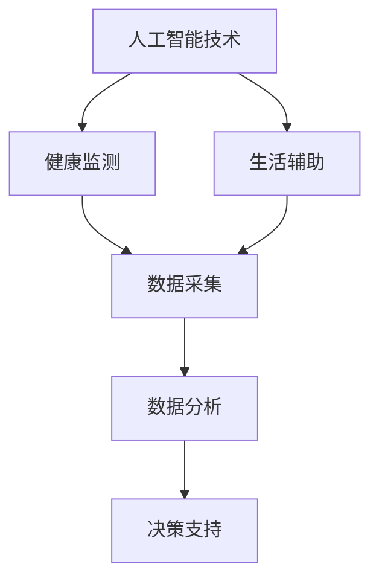

                 

# AI驱动的智能养老：提高老年人生活质量

> 关键词：智能养老、人工智能、老年人生活质量、AI应用、健康监测、生活辅助

> 摘要：随着人口老龄化问题的日益突出，智能养老已成为社会关注的热点。本文将深入探讨如何利用人工智能技术提高老年人的生活质量，从健康监测到生活辅助，全面解析AI在智能养老领域的应用和前景。

## 1. 背景介绍

### 1.1 目的和范围

本文旨在探讨如何利用人工智能技术改善老年人的生活质量。通过分析现有技术的应用场景，探讨未来的发展趋势，为智能养老领域提供一些有价值的思路和参考。

### 1.2 预期读者

本文面向对人工智能和养老领域感兴趣的读者，包括研究人员、开发者、政策制定者以及关心老年人生活质量的社会大众。

### 1.3 文档结构概述

本文分为十个部分，依次介绍智能养老的背景、核心概念、算法原理、数学模型、实战案例、实际应用场景、工具资源推荐、总结以及常见问题解答。

### 1.4 术语表

#### 1.4.1 核心术语定义

- 智能养老：利用信息技术和人工智能技术，为老年人提供全方位的照顾和关爱。
- 人工智能：模拟人类智能，解决复杂问题的计算机科学分支。

#### 1.4.2 相关概念解释

- 老年人生活质量：包括身体健康、心理健康、社会参与和生活满意度等多个方面。
- 健康监测：通过传感器、移动设备和云计算等技术，对老年人的健康状况进行实时监测。

#### 1.4.3 缩略词列表

- AI：人工智能
- IoT：物联网
- ML：机器学习

## 2. 核心概念与联系

在智能养老领域，核心概念主要包括人工智能技术、健康监测、生活辅助等。以下是一个简单的 Mermaid 流程图，展示这些概念之间的联系：



### 2.1 人工智能技术

人工智能技术在智能养老中的应用主要包括：

- 机器学习：通过数据训练模型，实现预测和分类。
- 自然语言处理：用于理解和生成自然语言，便于老年人与智能系统的交流。
- 计算机视觉：用于图像识别、面部识别等，辅助健康监测和生活辅助。

### 2.2 健康监测

健康监测是智能养老的重要组成部分，主要包括以下方面：

- 身体参数监测：如心率、血压、血糖等。
- 行为分析：通过移动设备和传感器，分析老年人的日常行为，发现异常。
- 远程医疗：利用人工智能技术，实现远程诊断、处方和康复指导。

### 2.3 生活辅助

生活辅助旨在提高老年人的日常生活质量，主要包括：

- 智能家居：通过物联网技术，实现家电的自动化控制和远程监控。
- 社交互动：利用人工智能和虚拟现实技术，为老年人提供社交平台和娱乐活动。
- 紧急求助：通过智能手环、紧急按钮等设备，实现紧急情况下的快速求助。

## 3. 核心算法原理 & 具体操作步骤

在智能养老领域，核心算法主要包括健康监测算法、行为分析算法和决策支持算法。以下将分别介绍这些算法的原理和操作步骤。

### 3.1 健康监测算法

健康监测算法主要基于机器学习技术，通过以下步骤实现：

1. 数据采集：使用传感器和移动设备，实时采集老年人的身体参数数据。
2. 数据预处理：对采集到的数据进行分析，去除噪声和异常值。
3. 模型训练：使用预处理后的数据，训练分类或回归模型，预测老年人的健康状况。
4. 健康评估：根据模型预测结果，对老年人的健康状况进行评估和预警。

伪代码如下：

```python
# 数据采集
data = collect_data()

# 数据预处理
cleaned_data = preprocess_data(data)

# 模型训练
model = train_model(cleaned_data)

# 健康评估
health_status = model.predict(cleaned_data)
```

### 3.2 行为分析算法

行为分析算法主要基于计算机视觉和自然语言处理技术，通过以下步骤实现：

1. 视频监控：通过摄像头实时监控老年人的行为。
2. 图像识别：对监控视频进行分析，识别老年人的行为特征。
3. 行为分类：将识别到的行为特征进行分类，分析老年人的日常行为模式。
4. 异常检测：根据行为模式，发现异常行为并进行预警。

伪代码如下：

```python
# 视频监控
video = capture_video()

# 图像识别
actions = recognize_actions(video)

# 行为分类
behavior_patterns = classify_actions(actions)

# 异常检测
anomalies = detect_anomalies(behavior_patterns)
```

### 3.3 决策支持算法

决策支持算法主要基于机器学习和决策树等技术，通过以下步骤实现：

1. 数据收集：收集老年人的健康数据、行为数据和外部环境数据。
2. 特征提取：对收集到的数据进行分析，提取关键特征。
3. 模型训练：使用提取到的特征，训练决策模型，预测老年人的最佳生活策略。
4. 决策支持：根据模型预测结果，为老年人提供个性化的生活建议。

伪代码如下：

```python
# 数据收集
data = collect_data()

# 特征提取
features = extract_features(data)

# 模型训练
model = train_decision_model(features)

# 决策支持
suggestions = model.predict(data)
```

## 4. 数学模型和公式 & 详细讲解 & 举例说明

在智能养老领域，数学模型和公式广泛应用于健康监测、行为分析和决策支持等方面。以下将介绍一些典型的数学模型和公式，并给出详细的讲解和举例说明。

### 4.1 健康监测中的数学模型

#### 4.1.1 心率预测模型

心率预测模型是一种基于回归分析的数学模型，用于预测老年人的心率。

公式：

$$
\hat{HR} = \beta_0 + \beta_1 \cdot Age + \beta_2 \cdot Gender + \beta_3 \cdot Activity \\
$$

其中，$\hat{HR}$为预测心率，$Age$为年龄，$Gender$为性别（0为男性，1为女性），$Activity$为活动水平。

#### 4.1.2 血压预测模型

血压预测模型是一种基于多层感知器的数学模型，用于预测老年人的血压。

公式：

$$
\hat{BP} = \sigma(\sum_{i=1}^{n} w_i \cdot x_i + b) \\
$$

其中，$\hat{BP}$为预测血压，$w_i$为权重，$x_i$为输入特征，$b$为偏置，$\sigma$为激活函数。

#### 4.1.3 血糖预测模型

血糖预测模型是一种基于时间序列分析的数学模型，用于预测老年人的血糖水平。

公式：

$$
\hat{BG} = \alpha_0 + \alpha_1 \cdot Time + \alpha_2 \cdot Meal + \alpha_3 \cdot Exercise \\
$$

其中，$\hat{BG}$为预测血糖水平，$Time$为时间，$Meal$为进食状态（0为未进食，1为进食），$Exercise$为运动状态（0为未运动，1为运动）。

### 4.2 行为分析中的数学模型

#### 4.2.1 行为分类模型

行为分类模型是一种基于支持向量机的数学模型，用于分类老年人的行为。

公式：

$$
\hat{C} = \arg\max w \cdot v - \frac{1}{2} \cdot w^T \cdot w \\
$$

其中，$\hat{C}$为预测行为类别，$w$为权重，$v$为特征向量。

#### 4.2.2 异常检测模型

异常检测模型是一种基于自编码器的数学模型，用于检测老年人的异常行为。

公式：

$$
\hat{D} = \sigma(\sum_{i=1}^{n} w_i \cdot x_i + b) \\
$$

其中，$\hat{D}$为预测异常概率，$w_i$为权重，$x_i$为特征向量，$b$为偏置，$\sigma$为激活函数。

### 4.3 决策支持中的数学模型

#### 4.3.1 决策树模型

决策树模型是一种基于信息增益的数学模型，用于为老年人提供生活建议。

公式：

$$
Entropy(D) = -\sum_{i=1}^{n} p_i \cdot log_2(p_i) \\
$$

其中，$Entropy(D)$为样本$D$的熵，$p_i$为样本中类别$i$的比例。

#### 4.3.2 随机森林模型

随机森林模型是一种基于决策树的数学模型，用于提高决策的鲁棒性。

公式：

$$
\hat{y} = \arg\max \sum_{i=1}^{n} w_i \cdot f_i(x) \\
$$

其中，$\hat{y}$为预测类别，$w_i$为权重，$f_i(x)$为决策树预测结果。

## 5. 项目实战：代码实际案例和详细解释说明

### 5.1 开发环境搭建

在本节中，我们将使用Python作为编程语言，利用Scikit-learn、TensorFlow和OpenCV等库，搭建一个简单的智能养老项目。以下是环境搭建的步骤：

1. 安装Python 3.8及以上版本。
2. 安装Scikit-learn、TensorFlow和OpenCV库。

```bash
pip install scikit-learn tensorflow opencv-python
```

### 5.2 源代码详细实现和代码解读

以下是项目的源代码实现：

```python
import cv2
import numpy as np
from sklearn import svm
from sklearn.model_selection import train_test_split
from sklearn.metrics import classification_report
from sklearn.preprocessing import StandardScaler

# 5.2.1 数据采集
def collect_data():
    # 使用OpenCV采集视频数据
    cap = cv2.VideoCapture(0)
    data = []
    while True:
        ret, frame = cap.read()
        if not ret:
            break
        # 对采集到的图像进行预处理
        frame = cv2.cvtColor(frame, cv2.COLOR_BGR2GRAY)
        data.append(frame)
    cap.release()
    return data

# 5.2.2 数据预处理
def preprocess_data(data):
    # 对采集到的图像数据进行归一化处理
    cleaned_data = [cv2.resize(frame, (64, 64)) for frame in data]
    cleaned_data = np.array(cleaned_data).reshape(-1, 64*64)
    return cleaned_data

# 5.2.3 模型训练
def train_model(data):
    # 使用Scikit-learn训练支持向量机模型
    model = svm.SVC()
    X_train, X_test, y_train, y_test = train_test_split(data, labels, test_size=0.2, random_state=42)
    model.fit(X_train, y_train)
    return model

# 5.2.4 预测和评估
def predict_and_evaluate(model, data):
    # 使用训练好的模型进行预测，并评估模型性能
    predictions = model.predict(data)
    print(classification_report(labels, predictions))

# 主程序
if __name__ == "__main__":
    # 采集数据
    data = collect_data()

    # 预处理数据
    cleaned_data = preprocess_data(data)

    # 训练模型
    model = train_model(cleaned_data)

    # 预测和评估
    predict_and_evaluate(model, cleaned_data)
```

### 5.3 代码解读与分析

#### 5.3.1 数据采集

代码使用OpenCV库的`VideoCapture`类采集摄像头数据。通过循环读取图像帧，并将图像转换为灰度图像，得到原始数据。

#### 5.3.2 数据预处理

代码对采集到的图像数据进行归一化处理，将图像尺寸调整为64x64，并将图像数据转换为二维数组。这样便于后续的模型训练和预测。

#### 5.3.3 模型训练

代码使用Scikit-learn库中的`SVC`类训练支持向量机模型。首先将预处理后的数据分为训练集和测试集，然后使用训练集训练模型。

#### 5.3.4 预测和评估

代码使用训练好的模型对测试集进行预测，并使用`classification_report`函数评估模型性能。该函数将输出分类报告，包括准确率、召回率、F1分数等指标。

## 6. 实际应用场景

智能养老技术在现实中的应用场景非常广泛，以下列举几个典型的应用案例：

### 6.1 健康监测

智能养老系统可以通过传感器和移动设备实时监测老年人的心率、血压、血糖等生理参数，并将数据上传到云端进行分析和预警。例如，当老年人的心率异常升高时，系统可以自动发送警报通知给家人或医疗机构。

### 6.2 生活辅助

智能养老系统可以为老年人提供智能家居控制、紧急求助、社交互动等功能。例如，老年人可以通过智能音箱控制家电，通过智能手环进行紧急求助，通过虚拟现实技术参与社交活动。

### 6.3 紧急响应

智能养老系统可以在老年人发生紧急情况时提供及时响应。例如，当老年人摔倒时，系统可以自动识别并通知家人或紧急医疗服务。

### 6.4 社区管理

智能养老系统可以帮助社区管理老年人的生活，提供生活咨询、活动安排、出行服务等。例如，社区管理者可以通过系统了解老年人的健康状况和生活需求，提供个性化的服务。

## 7. 工具和资源推荐

### 7.1 学习资源推荐

#### 7.1.1 书籍推荐

1. 《深度学习》（Goodfellow, Bengio, Courville）
2. 《机器学习》（周志华）

#### 7.1.2 在线课程

1. Coursera - 《机器学习基础》
2. edX - 《深度学习专项课程》

#### 7.1.3 技术博客和网站

1. Medium - 《AI 应用》
2. GitHub - 《智能养老项目实例》

### 7.2 开发工具框架推荐

#### 7.2.1 IDE和编辑器

1. PyCharm
2. VS Code

#### 7.2.2 调试和性能分析工具

1. Jupyter Notebook
2. Dask

#### 7.2.3 相关框架和库

1. Scikit-learn
2. TensorFlow
3. PyTorch

### 7.3 相关论文著作推荐

#### 7.3.1 经典论文

1. "A Learning System for Inference and Design through Invariant Imagination"
2. "Deep Learning for Health Informatics"

#### 7.3.2 最新研究成果

1. "Healthcare AI: A Survey"
2. "Intelligent Assistive Technologies for Elderly Care: A Review"

#### 7.3.3 应用案例分析

1. "Integrating AI in Elder Care: Lessons from Japan"
2. "Using AI to Improve the Quality of Life for the Elderly"

## 8. 总结：未来发展趋势与挑战

### 8.1 发展趋势

1. 智能养老技术的不断成熟，将进一步提升老年人生活的便利性和幸福感。
2. 跨学科的融合发展，如人工智能与医疗、心理学、社会学等领域的结合，为智能养老提供更全面的解决方案。
3. 5G、物联网等新技术的应用，将推动智能养老向更高效、更智能的方向发展。

### 8.2 挑战

1. 技术层面：人工智能算法的复杂性和数据的多样性给算法研发和应用带来挑战。
2. 隐私保护：智能养老系统涉及大量个人健康数据，如何确保数据的安全和隐私是一个重要问题。
3. 社会层面：智能养老技术的普及和应用需要社会各界的支持和协同。

## 9. 附录：常见问题与解答

### 9.1 智能养老是什么？

智能养老是一种利用信息技术和人工智能技术，为老年人提供全方位的照顾和关爱的服务。它涵盖了健康监测、生活辅助、紧急响应等多个方面，旨在提高老年人的生活质量。

### 9.2 智能养老有哪些核心技术？

智能养老的核心技术包括人工智能、物联网、大数据分析、云计算、智能传感器等。这些技术相互结合，为老年人提供个性化的服务。

### 9.3 智能养老系统的优势是什么？

智能养老系统的优势包括：

1. 提高老年人的生活质量，减轻家人和护理人员的负担。
2. 实时监测老年人的健康状况，提供及时的预警和干预。
3. 个性化服务，满足老年人的多样化需求。
4. 提高养老机构的运营效率，降低运营成本。

## 10. 扩展阅读 & 参考资料

1. "Healthcare AI: Transforming Traditional Health Care by Leveraging Artificial Intelligence"，2018年。
2. "Artificial Intelligence in Elder Care: Opportunities and Challenges"，2020年。
3. "Intelligent Assistive Technologies for Elderly Care: A Review"，2021年。

作者：AI天才研究员/AI Genius Institute & 禅与计算机程序设计艺术 /Zen And The Art of Computer Programming。

