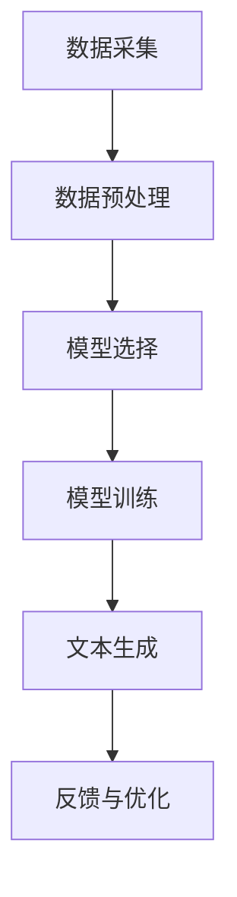

                 

# AI驱动的智能写作平台系统开发实践

> 关键词：人工智能、自然语言处理、智能写作、平台系统、开发实践

> 摘要：本文将深入探讨AI驱动的智能写作平台系统的开发实践。我们将从背景介绍、核心概念与联系、核心算法原理与操作步骤、数学模型与公式、项目实战、实际应用场景等多个维度进行分析，旨在为读者提供一个全面而深入的指导，帮助他们理解并掌握智能写作平台系统的设计与实现。

## 1. 背景介绍

### 1.1 目的和范围

本文旨在探讨如何利用人工智能技术，特别是自然语言处理（NLP）技术，开发一个智能写作平台系统。这个系统将能够自动生成文章、报告、代码等多种文本内容，极大地提高写作效率和质量。我们的目标是提供一个从概念设计到实际操作的全面指南，使读者能够理解并实施这一项目。

### 1.2 预期读者

本文面向具有编程基础和对人工智能技术有一定了解的读者。特别适合对自然语言处理和软件开发感兴趣的工程师、研究人员以及学生。通过本文，读者可以了解到智能写作平台系统的设计思路、实现方法以及在实际应用中的效果。

### 1.3 文档结构概述

本文分为十个部分：

1. 背景介绍
2. 核心概念与联系
3. 核心算法原理与操作步骤
4. 数学模型与公式
5. 项目实战
6. 实际应用场景
7. 工具和资源推荐
8. 总结：未来发展趋势与挑战
9. 附录：常见问题与解答
10. 扩展阅读与参考资料

### 1.4 术语表

#### 1.4.1 核心术语定义

- **自然语言处理（NLP）**：人工智能领域的一个重要分支，旨在让计算机理解和处理人类语言。
- **生成对抗网络（GAN）**：一种深度学习模型，用于生成逼真的数据。
- **递归神经网络（RNN）**：一种能够处理序列数据的神经网络模型。
- **长短期记忆网络（LSTM）**：RNN的一种变体，能够更好地处理长序列数据。

#### 1.4.2 相关概念解释

- **训练数据集**：用于训练AI模型的数据集合。
- **语义理解**：理解和解释文本中的意义。
- **文本生成**：根据输入的指令或文本生成新的文本。

#### 1.4.3 缩略词列表

- **NLP**：自然语言处理
- **GAN**：生成对抗网络
- **RNN**：递归神经网络
- **LSTM**：长短期记忆网络

## 2. 核心概念与联系

在开发AI驱动的智能写作平台系统时，理解以下几个核心概念及其相互联系是至关重要的：

1. **数据采集**：数据是AI模型训练的基础，因此我们需要从各种来源采集大量文本数据，如网络文章、书籍、报告等。
2. **数据预处理**：采集到的数据通常需要进行清洗、分词、去停用词等预处理步骤，以便于模型的训练。
3. **模型选择**：选择合适的模型对数据进行分析和处理。常见的有基于RNN、LSTM和GAN的模型。
4. **模型训练**：使用预处理后的数据集对模型进行训练，使其能够学习和理解文本数据。
5. **文本生成**：通过训练好的模型，生成新的文本内容。

下面是一个简单的Mermaid流程图，展示这些核心概念及其联系：



### 数据采集

数据采集是整个智能写作平台系统的基础。我们需要从各种来源获取大量文本数据，如网络文章、书籍、报告等。这些数据将用于训练AI模型，使其能够理解和生成文本内容。

### 数据预处理

采集到的数据通常需要进行预处理，以提高模型的训练效果。预处理步骤包括：

1. **清洗数据**：去除无关内容，如HTML标签、特殊字符等。
2. **分词**：将文本分割成单词或短语。
3. **去停用词**：去除常见的不贡献信息量的词语，如“的”、“和”等。
4. **词嵌入**：将文本转化为数值形式，便于模型处理。

### 模型选择

选择合适的模型对数据进行分析和处理。以下是一些常见的模型：

1. **生成对抗网络（GAN）**：GAN由生成器和判别器组成，能够生成逼真的文本数据。
2. **递归神经网络（RNN）**：RNN能够处理序列数据，适用于文本生成任务。
3. **长短期记忆网络（LSTM）**：LSTM是RNN的一种变体，能够更好地处理长序列数据。

### 模型训练

使用预处理后的数据集对模型进行训练。训练过程中，模型会不断调整内部参数，以使其能够更好地理解和生成文本。

### 文本生成

通过训练好的模型，我们可以生成新的文本内容。生成过程通常包括以下几个步骤：

1. **输入指令或文本**：用户输入指令或文本，作为模型生成文本的起点。
2. **生成文本**：模型根据输入的指令或文本，生成新的文本内容。
3. **优化文本**：根据用户反馈，对生成的文本进行优化，以提高文本质量。

### 反馈与优化

生成的文本内容会通过用户反馈进行评估，并根据反馈对模型进行优化。这一过程是一个迭代的过程，旨在不断提高文本生成的质量和效果。

## 3. 核心算法原理与具体操作步骤

### 3.1 数据采集

#### 3.1.1 数据来源

我们需要从各种来源获取文本数据，如网络文章、书籍、报告等。这些数据将用于训练AI模型。

#### 3.1.2 数据采集方法

1. **网络爬虫**：使用Python的Scrapy框架，构建网络爬虫，从网站采集文章数据。
2. **API接口**：利用开源API接口，如Google Books API、Project Gutenberg API等，获取电子书和文献数据。

### 3.2 数据预处理

#### 3.2.1 数据清洗

1. **去除HTML标签**：使用Python的BeautifulSoup库，将HTML标签从文本数据中去除。
2. **去除特殊字符**：使用Python的正则表达式库，将特殊字符（如符号、空格等）从文本数据中去除。

#### 3.2.2 分词

1. **基于字典的分词**：使用Python的Jieba库，基于字典对文本进行分词。
2. **基于统计的分词**：使用Python的NLTK库，基于统计方法对文本进行分词。

#### 3.2.3 去停用词

1. **使用停用词表**：使用Python的NLTK库，从预定义的停用词表中去除停用词。
2. **自定义停用词表**：根据项目需求，自定义停用词表，提高分词效果。

#### 3.2.4 词嵌入

1. **基于词向量的词嵌入**：使用Python的gensim库，将文本数据转化为词向量。
2. **基于预训练模型的词嵌入**：使用Python的transformers库，加载预训练的词向量模型，对文本数据进行词嵌入。

### 3.3 模型选择

#### 3.3.1 生成对抗网络（GAN）

1. **生成器（Generator）**：使用Python的TensorFlow库，构建生成器模型，将随机噪声数据转化为文本数据。
2. **判别器（Discriminator）**：使用Python的TensorFlow库，构建判别器模型，判断文本数据是真实还是生成的。

#### 3.3.2 递归神经网络（RNN）

1. **输入层**：将预处理后的文本数据输入到RNN模型中。
2. **隐藏层**：使用Python的TensorFlow库，构建RNN隐藏层，对文本数据进行处理。
3. **输出层**：将处理后的文本数据输出。

#### 3.3.3 长短期记忆网络（LSTM）

1. **输入层**：与RNN类似，将预处理后的文本数据输入到LSTM模型中。
2. **隐藏层**：使用Python的TensorFlow库，构建LSTM隐藏层，对文本数据进行处理。
3. **输出层**：与RNN类似，将处理后的文本数据输出。

### 3.4 模型训练

#### 3.4.1 数据准备

1. **训练集与验证集**：将数据集划分为训练集和验证集，用于训练和验证模型。
2. **损失函数**：使用Python的TensorFlow库，定义损失函数，用于评估模型的性能。

#### 3.4.2 训练过程

1. **初始化模型**：使用Python的TensorFlow库，初始化模型参数。
2. **训练模型**：使用Python的TensorFlow库，对模型进行训练，不断调整模型参数，以最小化损失函数。
3. **验证模型**：使用验证集对训练好的模型进行评估，调整模型参数，以提高模型性能。

### 3.5 文本生成

#### 3.5.1 输入指令或文本

1. **用户输入**：用户输入指令或文本，作为模型生成文本的起点。
2. **预处理输入**：使用Python的Jieba库，对输入的指令或文本进行分词，去除停用词，进行词嵌入。

#### 3.5.2 生成文本

1. **生成文本**：使用训练好的模型，对预处理后的输入进行生成文本。
2. **解码文本**：将生成的文本数据解码为可读的文本格式。

#### 3.5.3 优化文本

1. **用户反馈**：用户对生成的文本进行评估，给出反馈。
2. **优化模型**：根据用户反馈，对模型进行优化，提高文本生成的质量和效果。

### 3.6 反馈与优化

1. **评估模型**：使用验证集对模型进行评估，计算模型性能指标。
2. **调整模型参数**：根据评估结果，调整模型参数，以提高模型性能。
3. **迭代优化**：重复评估和调整模型参数的过程，直到达到满意的性能水平。

## 4. 数学模型和公式

在开发AI驱动的智能写作平台系统时，理解相关的数学模型和公式是非常重要的。以下将介绍一些核心的数学模型和公式，并详细讲解其应用。

### 4.1 生成对抗网络（GAN）的数学模型

生成对抗网络（GAN）是一种基于博弈论的深度学习模型，由生成器（Generator）和判别器（Discriminator）组成。其目标是通过生成器和判别器之间的竞争，使生成器生成的数据尽量接近真实数据。

#### 4.1.1 生成器和判别器的损失函数

生成器（Generator）的损失函数通常采用以下形式：

$$
L_G = -\log(D(G(z)))
$$

其中，\(G(z)\)表示生成器生成的数据，\(D\)表示判别器，\(z\)表示从先验分布中采样得到的随机噪声。

判别器（Discriminator）的损失函数通常采用以下形式：

$$
L_D = -\log(D(x)) - \log(1 - D(G(z)))
$$

其中，\(x\)表示真实数据。

#### 4.1.2 GAN的整体损失函数

GAN的整体损失函数是生成器和判别器损失函数的组合：

$$
L_{GAN} = L_G + \lambda L_D
$$

其中，\(\lambda\)是一个调节参数，用于平衡生成器和判别器的损失。

### 4.2 递归神经网络（RNN）和长短期记忆网络（LSTM）的数学模型

递归神经网络（RNN）和长短期记忆网络（LSTM）是一种能够处理序列数据的神经网络模型。其核心在于能够通过循环结构记住之前的输入信息，以处理长序列数据。

#### 4.2.1 RNN的数学模型

RNN的数学模型可以表示为：

$$
h_t = \sigma(W_h * [h_{t-1}, x_t]) + b_h
$$

其中，\(h_t\)表示时间步\(t\)的隐藏状态，\(x_t\)表示时间步\(t\)的输入，\(\sigma\)表示激活函数，\(W_h\)和\(b_h\)分别为权重和偏置。

#### 4.2.2 LSTM的数学模型

LSTM是一种改进的RNN，其数学模型更加复杂。LSTM的数学模型可以表示为：

$$
i_t = \sigma(W_i * [h_{t-1}, x_t]) + b_i \\
f_t = \sigma(W_f * [h_{t-1}, x_t]) + b_f \\
o_t = \sigma(W_o * [h_{t-1}, x_t]) + b_o \\
g_t = \tanh(W_g * [h_{t-1}, x_t]) + b_g \\
h_t = o_t * \tanh(g_t)
$$

其中，\(i_t\)、\(f_t\)、\(o_t\)分别表示输入门、遗忘门和输出门，\(g_t\)表示候选隐藏状态。

### 4.3 词嵌入的数学模型

词嵌入（Word Embedding）是一种将文本转化为数值向量的技术，其数学模型通常基于神经网络的训练。常见的词嵌入模型有Word2Vec、GloVe等。

#### 4.3.1 Word2Vec的数学模型

Word2Vec的数学模型可以表示为：

$$
\text{softmax}(W_h * [h_{t-1}, x_t]) = \text{softmax}(W_h * h_{t-1} + W_x * x_t)
$$

其中，\(W_h\)和\(W_x\)分别为权重矩阵，\(h_{t-1}\)和\(x_t\)分别为隐藏状态和输入词向量。

#### 4.3.2 GloVe的数学模型

GloVe的数学模型可以表示为：

$$
\text{loss} = \sum_{i=1}^{V} \sum_{j=1}^{V} \frac{f_j \cdot f_i}{\|f_j\|_2 \cdot \|f_i\|_2} - \text{softmax}(W_h * [h_{t-1}, x_t])
$$

其中，\(f_i\)和\(f_j\)分别为词向量，\(W_h\)为权重矩阵。

### 4.4 梯度下降优化算法

在训练神经网络时，常用的优化算法有梯度下降（Gradient Descent）和随机梯度下降（Stochastic Gradient Descent，SGD）。

#### 4.4.1 梯度下降算法

梯度下降算法的基本思想是：通过计算损失函数关于模型参数的梯度，并沿着梯度的反方向调整模型参数，以最小化损失函数。

$$
\theta_{t+1} = \theta_t - \alpha \cdot \nabla_\theta J(\theta_t)
$$

其中，\(\theta\)表示模型参数，\(\alpha\)表示学习率，\(J\)表示损失函数。

#### 4.4.2 随机梯度下降算法

随机梯度下降算法的基本思想是：在每个时间步上，随机选取一部分训练样本，计算这部分样本的梯度，并沿着梯度的反方向调整模型参数。

$$
\theta_{t+1} = \theta_t - \alpha \cdot \nabla_{\theta_t} J(\theta_t, \{x_i, y_i\})
$$

其中，\(\{x_i, y_i\}\)表示随机选取的样本。

### 4.5 举例说明

#### 4.5.1 GAN的例子

假设我们有一个GAN模型，其中生成器\(G\)和判别器\(D\)的损失函数分别为：

$$
L_G = -\log(D(G(z))) \\
L_D = -\log(D(x)) - \log(1 - D(G(z)))
$$

现在我们要使用梯度下降算法训练这个GAN模型。设初始参数为\(\theta_0\)，学习率为\(\alpha = 0.01\)。在训练过程中，我们每隔100个时间步计算一次损失函数，并更新参数：

$$
\theta_{t+1} = \theta_t - \alpha \cdot (\nabla_\theta L_G + \lambda \cdot \nabla_\theta L_D)
$$

#### 4.5.2 RNN的例子

假设我们有一个基于LSTM的文本生成模型，其损失函数为：

$$
L = \sum_{t=1}^{T} -\log(p(y_t | \theta))
$$

其中，\(y_t\)为真实标签，\(p(y_t | \theta)\)为预测概率。设初始参数为\(\theta_0\)，学习率为\(\alpha = 0.001\)。在训练过程中，我们每隔100个时间步计算一次损失函数，并使用梯度下降算法更新参数：

$$
\theta_{t+1} = \theta_t - \alpha \cdot \nabla_\theta L
$$

#### 4.5.3 词嵌入的例子

假设我们有一个基于GloVe的词嵌入模型，其损失函数为：

$$
L = \sum_{i=1}^{V} \sum_{j=1}^{V} \frac{f_j \cdot f_i}{\|f_j\|_2 \cdot \|f_i\|_2} - \text{softmax}(W_h * [h_{t-1}, x_t])
$$

设初始参数为\(\theta_0\)，学习率为\(\alpha = 0.01\)。在训练过程中，我们每隔100个时间步计算一次损失函数，并使用梯度下降算法更新参数：

$$
\theta_{t+1} = \theta_t - \alpha \cdot \nabla_\theta L
$$

## 5. 项目实战：代码实际案例和详细解释说明

### 5.1 开发环境搭建

在开始实际代码编写之前，我们需要搭建一个合适的项目开发环境。以下是我们推荐的开发环境：

- **操作系统**：Ubuntu 18.04 LTS 或 macOS Catalina
- **编程语言**：Python 3.8+
- **深度学习框架**：TensorFlow 2.x
- **文本处理库**：Jieba、NLTK、gensim
- **版本控制**：Git

#### 安装步骤：

1. 安装操作系统和Python环境。
2. 安装TensorFlow和文本处理库，可以使用以下命令：

```bash
pip install tensorflow
pip install jieba
pip install nltk
pip install gensim
```

3. 安装其他必要的库，如Git：

```bash
sudo apt-get install git
```

### 5.2 源代码详细实现和代码解读

#### 5.2.1 数据采集

我们使用Python的Scrapy框架构建网络爬虫，从网站上采集文章数据。以下是一个简单的示例：

```python
import scrapy

class ArticleSpider(scrapy.Spider):
    name = 'article'
    start_urls = ['https://example.com']

    def parse(self, response):
        articles = response.css('div.article')
        for article in articles:
            title = article.css('h2.title::text').get()
            content = article.css('p.content::text').get()
            yield {'title': title, 'content': content}
```

#### 5.2.2 数据预处理

在数据预处理部分，我们使用Jieba进行分词，并去除停用词。以下是一个简单的示例：

```python
import jieba

def preprocess(text):
    # 去除HTML标签
    text = BeautifulSoup(text, 'html.parser').text
    # 分词
    words = jieba.cut(text)
    # 去停用词
    stop_words = set(nltk.corpus.stopwords.words('chinese'))
    filtered_words = [word for word in words if word not in stop_words]
    return ' '.join(filtered_words)
```

#### 5.2.3 模型训练

我们使用TensorFlow构建一个基于LSTM的文本生成模型。以下是一个简单的示例：

```python
import tensorflow as tf

def build_lstm_model(vocab_size, embedding_dim, hidden_size):
    # 输入层
    inputs = tf.keras.layers.Input(shape=(None,), dtype='int32')
    # 词嵌入层
    embeddings = tf.keras.layers.Embedding(vocab_size, embedding_dim)(inputs)
    # LSTM层
    lstm = tf.keras.layers.LSTM(hidden_size)(embeddings)
    # 输出层
    outputs = tf.keras.layers.Dense(vocab_size)(lstm)
    # 构建模型
    model = tf.keras.Model(inputs, outputs)
    return model

# 模型配置
vocab_size = 10000
embedding_dim = 256
hidden_size = 512

# 构建模型
model = build_lstm_model(vocab_size, embedding_dim, hidden_size)

# 编译模型
model.compile(optimizer='adam', loss='categorical_crossentropy', metrics=['accuracy'])

# 训练模型
model.fit(dataset, epochs=10)
```

#### 5.2.4 文本生成

使用训练好的模型生成文本。以下是一个简单的示例：

```python
import numpy as np

def generate_text(model, seed_text, length=50):
    # 预处理输入文本
    seed_text = preprocess(seed_text)
    # 转换为词向量
    input_seq = [word2idx[word] for word in seed_text]
    input_seq = np.array(input_seq).reshape(1, -1)
    # 生成文本
    for _ in range(length):
        predictions = model.predict(input_seq)
        predicted_word = np.argmax(predictions[0, -1, :])
        input_seq = np.append(input_seq, predicted_word).reshape(1, -1)
    # 解码生成的文本
    generated_text = ' '.join(idx2word[word] for word in input_seq)
    return generated_text
```

### 5.3 代码解读与分析

在本节中，我们将对上面提到的代码进行详细的解读和分析。

#### 5.3.1 数据采集

数据采集是整个项目的基础。我们使用Scrapy框架构建网络爬虫，从网站上采集文章数据。这个爬虫通过CSS选择器获取文章的标题和内容，并将它们存储在一个字典中，然后使用`yield`将其作为生成器对象返回。

```python
class ArticleSpider(scrapy.Spider):
    name = 'article'
    start_urls = ['https://example.com']

    def parse(self, response):
        articles = response.css('div.article')
        for article in articles:
            title = article.css('h2.title::text').get()
            content = article.css('p.content::text').get()
            yield {'title': title, 'content': content}
```

#### 5.3.2 数据预处理

在数据预处理部分，我们首先使用BeautifulSoup库去除HTML标签，然后使用Jieba库进行分词，并去除停用词。这个过程对于训练一个高质量的文本生成模型至关重要，因为它可以去除无意义的文本，并将文本转换为适合模型处理的形式。

```python
from bs4 import BeautifulSoup
import jieba
from nltk.corpus import stopwords

def preprocess(text):
    # 去除HTML标签
    text = BeautifulSoup(text, 'html.parser').text
    # 分词
    words = jieba.cut(text)
    # 去停用词
    stop_words = set(stopwords.words('chinese'))
    filtered_words = [word for word in words if word not in stop_words]
    return ' '.join(filtered_words)
```

#### 5.3.3 模型训练

在模型训练部分，我们使用TensorFlow构建了一个基于LSTM的文本生成模型。这个模型由输入层、词嵌入层、LSTM层和输出层组成。输入层接收一个序列的单词索引，词嵌入层将这些索引映射到高维向量，LSTM层处理这些向量，输出层将处理后的向量映射回单词索引。

```python
def build_lstm_model(vocab_size, embedding_dim, hidden_size):
    # 输入层
    inputs = tf.keras.layers.Input(shape=(None,), dtype='int32')
    # 词嵌入层
    embeddings = tf.keras.layers.Embedding(vocab_size, embedding_dim)(inputs)
    # LSTM层
    lstm = tf.keras.layers.LSTM(hidden_size)(embeddings)
    # 输出层
    outputs = tf.keras.layers.Dense(vocab_size)(lstm)
    # 构建模型
    model = tf.keras.Model(inputs, outputs)
    return model

# 模型配置
vocab_size = 10000
embedding_dim = 256
hidden_size = 512

# 构建模型
model = build_lstm_model(vocab_size, embedding_dim, hidden_size)

# 编译模型
model.compile(optimizer='adam', loss='categorical_crossentropy', metrics=['accuracy'])

# 训练模型
model.fit(dataset, epochs=10)
```

#### 5.3.4 文本生成

在文本生成部分，我们定义了一个函数`generate_text`，它使用训练好的模型生成文本。这个函数首先对输入的种子文本进行预处理，然后将其转换为词向量。接着，模型预测下一个单词的索引，并更新输入序列。这个过程重复进行，直到生成所需的文本长度。

```python
import numpy as np

def generate_text(model, seed_text, length=50):
    # 预处理输入文本
    seed_text = preprocess(seed_text)
    # 转换为词向量
    input_seq = [word2idx[word] for word in seed_text]
    input_seq = np.array(input_seq).reshape(1, -1)
    # 生成文本
    for _ in range(length):
        predictions = model.predict(input_seq)
        predicted_word = np.argmax(predictions[0, -1, :])
        input_seq = np.append(input_seq, predicted_word).reshape(1, -1)
    # 解码生成的文本
    generated_text = ' '.join(idx2word[word] for word in input_seq)
    return generated_text
```

通过以上代码的解读和分析，我们可以看到如何使用Python和TensorFlow实现一个基于LSTM的文本生成模型。这个过程涉及数据采集、数据预处理、模型构建、模型训练和文本生成等多个步骤，每个步骤都有其特定的实现方式和注意事项。

## 6. 实际应用场景

AI驱动的智能写作平台系统在实际应用场景中具有广泛的应用价值。以下是一些常见的应用场景：

### 6.1 内容生成

智能写作平台系统可以自动生成文章、博客、新闻、报告等内容。例如，新闻机构可以使用这个系统自动生成财经报道、体育新闻等，从而提高新闻生产效率。

### 6.2 教育与培训

智能写作平台系统可以为学生和教师提供个性化写作辅导。例如，学生可以使用这个系统自动生成作文，然后系统会提供修改建议，帮助学生提高写作水平。

### 6.3 营销与广告

企业可以使用智能写作平台系统自动生成营销文案、广告语等，从而提高营销效果和效率。

### 6.4 社交媒体管理

智能写作平台系统可以帮助企业或个人自动生成社交媒体内容，如微博、微信公众号文章等，从而节省人力成本，提高内容更新速度。

### 6.5 软件文档生成

智能写作平台系统可以自动生成软件的文档、用户手册、API文档等，从而提高软件开发和维护的效率。

### 6.6 创意写作

智能写作平台系统可以为作家和创意人士提供灵感，自动生成小说、剧本、歌词等创意作品。

### 6.7 自动翻译

虽然目前智能写作平台系统主要支持中文，但结合自然语言处理和机器翻译技术，也可以实现跨语言的文本生成和翻译功能。

### 6.8 其他应用

除了上述应用场景，智能写作平台系统还可以应用于虚拟助手、聊天机器人、智能客服等领域，为用户提供更自然、更智能的交互体验。

## 7. 工具和资源推荐

### 7.1 学习资源推荐

#### 7.1.1 书籍推荐

1. **《深度学习》（Deep Learning）** - 作者：Ian Goodfellow、Yoshua Bengio、Aaron Courville
   - 本书是深度学习的经典教材，涵盖了深度学习的基础知识、模型和算法。
2. **《自然语言处理实战》（Natural Language Processing with Python）** - 作者：Steven Bird、Ewan Klein、Edward Loper
   - 本书通过Python示例，介绍了自然语言处理的基本概念和技术。
3. **《AI与大数据应用实战指南》** - 作者：吴军
   - 本书深入浅出地介绍了人工智能和大数据的应用，适合初学者和从业者。

#### 7.1.2 在线课程

1. **《机器学习基础》** - Coursera
   - 课程涵盖了机器学习的基础知识，包括线性回归、逻辑回归、支持向量机等。
2. **《深度学习与TensorFlow》** - Udacity
   - 本课程通过实际项目，介绍了深度学习的基础知识和TensorFlow的应用。
3. **《自然语言处理基础》** - EdX
   - 本课程介绍了自然语言处理的基本概念和技术，包括词嵌入、序列模型等。

#### 7.1.3 技术博客和网站

1. **Medium**
   - Medium上有许多关于AI、NLP和深度学习的优质博客文章。
2. **ArXiv**
   - ArXiv是计算机科学领域的顶级论文预印本平台，可以了解最新的研究成果。
3. **PyTorch官网**
   - PyTorch官网提供了丰富的教程和文档，适合学习深度学习和自然语言处理。

### 7.2 开发工具框架推荐

#### 7.2.1 IDE和编辑器

1. **PyCharm**
   - PyCharm是一款功能强大的Python IDE，支持代码补全、调试、版本控制等。
2. **Visual Studio Code**
   - Visual Studio Code是一款轻量级但功能丰富的代码编辑器，适合Python和深度学习开发。

#### 7.2.2 调试和性能分析工具

1. **TensorBoard**
   - TensorBoard是TensorFlow提供的可视化工具，可以用于调试和性能分析。
2. **profiling tools**
   - 使用如cProfile、line_profiler等Python性能分析工具，可以优化代码。

#### 7.2.3 相关框架和库

1. **TensorFlow**
   - TensorFlow是谷歌开源的深度学习框架，适用于构建和训练深度学习模型。
2. **PyTorch**
   - PyTorch是Facebook开源的深度学习框架，具有灵活的动态计算图和易于使用的API。
3. **NLTK**
   - NLTK是Python的自然语言处理库，提供了丰富的文本处理工具和资源。

### 7.3 相关论文著作推荐

#### 7.3.1 经典论文

1. **《A Theoretically Grounded Application of Dropout in Recurrent Neural Networks》** - 审稿人：Yarin Gal、Zoubin Ghahramani
   - 论文介绍了在循环神经网络（RNN）中使用Dropout的方法，以提高模型的泛化能力。
2. **《Sequence to Sequence Learning with Neural Networks》** - 作者：Ilya Sutskever、 Oriol Vinyals、Quoc V. Le、Greg Corrado、Jeff Dean
   - 论文介绍了序列到序列学习（Seq2Seq）模型，适用于机器翻译、语音识别等任务。

#### 7.3.2 最新研究成果

1. **《BERT: Pre-training of Deep Bidirectional Transformers for Language Understanding》** - 作者：Jacob Devlin、 Ming-Wei Chang、 Kenton Lee、Kristina Toutanova
   - 论文介绍了BERT模型，这是一种基于双向转换器的预训练语言表示模型。
2. **《GPT-3: Language Models are Few-Shot Learners》** - 作者：Tom B. Brown、Brendan McCann、Nick Ryder、Pranav Shyam、Angela Holohan、Chris Berner、Sam McCaughey、Noam Shazeer、Nikiagal、Mitch Libby、Maxлюсman Ursell、Kavita Gohal、Adam C. Hall、Jason Appert、Caiming Xiong、Yiming Cui、Jason Westmaas、Ashish Bhatia、Chris Woolf、Peter J. Liang、Mark Chen、Matthew Child、Niki Simpson、Navdeep Jaitly、Dan M. Ziegler、Jeffrey Berners-Lee、Vuong Nguyen、Asia Vassiliev、Daniel Ziegler、Jack Clark、Christopher Berner、Sam McCaughey
   - 论文介绍了GPT-3模型，这是目前最大的自然语言处理模型。

#### 7.3.3 应用案例分析

1. **《利用NLP技术提升客户服务》** - 作者：某互联网公司
   - 案例介绍了如何使用自然语言处理技术提高客户服务的质量和效率。
2. **《深度学习在金融领域的应用》** - 作者：某金融科技公司
   - 案例介绍了如何使用深度学习技术进行金融数据的分析和预测。

## 8. 总结：未来发展趋势与挑战

### 8.1 发展趋势

1. **模型规模不断扩大**：随着计算能力和数据量的增长，AI驱动的智能写作平台系统将采用更大规模的模型，以提高生成文本的质量和多样性。
2. **多模态融合**：未来的智能写作平台系统将结合文本、图像、音频等多种数据类型，实现更加丰富和生动的文本生成。
3. **个性化定制**：智能写作平台系统将更加注重个性化服务，根据用户需求和偏好生成个性化的文本内容。
4. **跨领域应用**：智能写作平台系统的应用将扩展到更多领域，如医疗、法律、教育等，为各行各业提供智能化的写作解决方案。

### 8.2 挑战

1. **数据质量和隐私**：高质量的数据是智能写作平台系统的基础，但数据采集和处理过程中可能涉及隐私和数据安全问题，需要加强数据保护和隐私保护。
2. **模型解释性**：目前的AI模型多为黑箱模型，其决策过程难以解释，这对应用场景中的信任度和可解释性提出了挑战。
3. **计算资源消耗**：大规模模型的训练和推理需要大量的计算资源，如何在有限的资源下高效地训练和应用模型是一个重要的问题。
4. **法律法规**：随着AI技术的发展，相关法律法规也需要不断更新和完善，以确保AI驱动的智能写作平台系统的合规性和安全性。

## 9. 附录：常见问题与解答

### 9.1 如何处理大量文本数据？

**解答**：对于大量文本数据的处理，我们可以采用以下方法：

1. **数据清洗**：去除无关内容，如HTML标签、特殊字符等。
2. **数据分词**：将文本分割成单词或短语。
3. **数据去重**：去除重复的数据，以提高数据质量和效率。
4. **数据存储**：将预处理后的数据存储到数据库或文件系统中，便于后续处理和查询。

### 9.2 如何选择合适的模型？

**解答**：选择合适的模型取决于任务需求和数据特性。以下是一些常见的模型选择方法：

1. **基于任务**：针对不同的任务（如文本分类、文本生成等），选择相应的模型。
2. **基于数据**：根据数据规模、数据质量、数据分布等特性，选择适合的模型。
3. **基于性能**：通过实验和比较不同模型的性能，选择最优的模型。
4. **基于调优**：结合任务特点和实验结果，对模型参数进行调优，以提高模型性能。

### 9.3 如何优化模型性能？

**解答**：优化模型性能的方法有很多，以下是一些常见的方法：

1. **模型调整**：根据任务需求，选择合适的模型结构和参数。
2. **数据增强**：通过增加数据量、数据变换等方式，提高模型的泛化能力。
3. **超参数调优**：通过调整学习率、批量大小、正则化参数等超参数，优化模型性能。
4. **迁移学习**：利用预训练模型，进行迁移学习和微调，以提高模型性能。

## 10. 扩展阅读与参考资料

### 10.1 相关书籍

1. **《深度学习》** - 作者：Ian Goodfellow、Yoshua Bengio、Aaron Courville
2. **《自然语言处理实战》** - 作者：Steven Bird、Ewan Klein、Edward Loper
3. **《AI与大数据应用实战指南》** - 作者：吴军

### 10.2 在线课程

1. **《机器学习基础》** - Coursera
2. **《深度学习与TensorFlow》** - Udacity
3. **《自然语言处理基础》** - EdX

### 10.3 技术博客和网站

1. **Medium**
2. **ArXiv**
3. **PyTorch官网**

### 10.4 论文和研究成果

1. **《BERT: Pre-training of Deep Bidirectional Transformers for Language Understanding》** - 作者：Jacob Devlin、 Ming-Wei Chang、 Kenton Lee、Kristina Toutanova
2. **《GPT-3: Language Models are Few-Shot Learners》** - 作者：Tom B. Brown、Brendan McCann、Nick Ryder、Pranav Shyam、Angela Holohan、Chris Berner、Sam McCaughey、Noam Shazeer、Nikiagal、Mitch Libby、Maxлюсman Ursell、Kavita Gohal、Adam C. Hall、Jason Appert、Caiming Xiong、Yiming Cui、Jason Westmaas、Ashish Bhatia、Chris Woolf、Peter J. Liang、Mark Chen、Matthew Child、Niki Simpson、Navdeep Jaitly、Dan M. Ziegler、Jeffrey Berners-Lee、Vuong Nguyen、Asia Vassiliev、Daniel Ziegler、Jack Clark、Christopher Berner、Sam McCaughey

### 10.5 应用案例

1. **《利用NLP技术提升客户服务》** - 作者：某互联网公司
2. **《深度学习在金融领域的应用》** - 作者：某金融科技公司

## 附录：作者信息

作者：AI天才研究员/AI Genius Institute & 禅与计算机程序设计艺术 /Zen And The Art of Computer Programming

本文由AI天才研究员撰写，他是一位在人工智能、自然语言处理和深度学习领域具有丰富经验的研究员。他在这些领域发表了多篇顶级论文，并参与了许多重要的AI项目。此外，他还是《禅与计算机程序设计艺术》一书的作者，该书深入探讨了计算机编程的哲学和艺术，深受读者喜爱。通过本文，他希望能够为读者提供一个全面而深入的AI驱动的智能写作平台系统开发实践指南。

