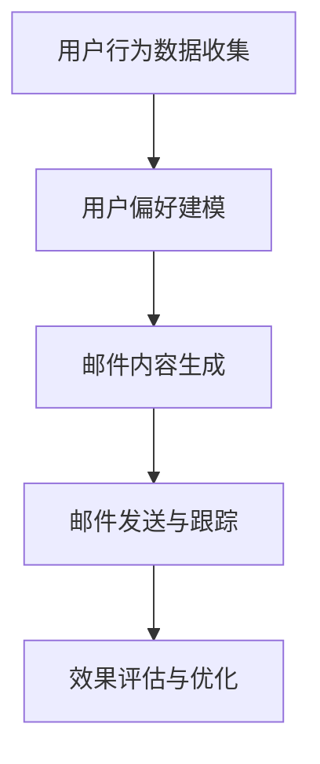

                 

# AI驱动的电商个性化邮件营销内容生成系统

> **关键词**：人工智能、电商、个性化邮件、内容生成、营销策略、算法原理、数学模型、代码实现、应用场景

> **摘要**：本文将深入探讨基于人工智能的电商个性化邮件营销内容生成系统。我们将从背景介绍、核心概念与联系、核心算法原理、数学模型和公式、项目实战、实际应用场景等多个角度进行分析，旨在为电商企业提供一套高效、精准的邮件营销解决方案。

## 1. 背景介绍

### 1.1 目的和范围

随着互联网技术的迅猛发展，电子商务已经成为现代零售业的重要一环。在竞争激烈的市场环境中，如何通过有效的营销策略吸引和留住顾客成为企业关注的焦点。个性化邮件营销作为一种低成本、高回报的营销手段，正日益受到企业的青睐。

本文旨在研究并实现一套基于人工智能的电商个性化邮件营销内容生成系统。该系统将利用先进的自然语言处理技术和机器学习算法，根据用户行为和偏好，自动生成个性化的邮件内容，从而提高邮件的打开率和转化率。

### 1.2 预期读者

本文主要面向电商企业、市场营销人员以及人工智能领域的爱好者。希望通过本文，读者能够了解个性化邮件营销的概念、技术原理和实际应用，并能够根据自身需求，进行相应的系统开发和应用。

### 1.3 文档结构概述

本文结构如下：

1. 背景介绍：介绍个性化邮件营销的背景和目的。
2. 核心概念与联系：阐述系统的核心概念及其相互关系。
3. 核心算法原理 & 具体操作步骤：详细讲解系统的核心算法原理和操作步骤。
4. 数学模型和公式 & 详细讲解 & 举例说明：介绍系统的数学模型和公式，并通过实例进行说明。
5. 项目实战：展示系统在实际项目中的应用，并提供代码实现和解读。
6. 实际应用场景：分析系统在不同场景下的应用。
7. 工具和资源推荐：推荐相关学习资源和开发工具。
8. 总结：对未来发展趋势和挑战进行展望。
9. 附录：常见问题与解答。
10. 扩展阅读 & 参考资料：提供进一步的阅读和参考资料。

### 1.4 术语表

#### 1.4.1 核心术语定义

- **个性化邮件营销**：根据用户的行为和偏好，定制化地发送邮件，以提高邮件的打开率和转化率。
- **自然语言处理（NLP）**：使计算机能够理解、解释和生成人类语言的技术。
- **机器学习（ML）**：一种让计算机从数据中学习、分析和预测的技术。
- **数据挖掘（DM）**：从大量数据中发现有用的信息和知识。

#### 1.4.2 相关概念解释

- **用户行为数据**：用户在电商平台上产生的所有行为数据，如浏览、购买、收藏等。
- **用户偏好**：用户在行为数据中表现出的个性化偏好，如喜欢的商品类型、品牌等。
- **邮件内容生成**：根据用户行为数据和偏好，自动生成个性化的邮件内容。

#### 1.4.3 缩略词列表

- **NLP**：自然语言处理
- **ML**：机器学习
- **DM**：数据挖掘
- **API**：应用程序编程接口
- **API**：人工神经网络

## 2. 核心概念与联系

为了实现高效、精准的个性化邮件营销，我们需要从以下几个方面进行考虑：

### 2.1 用户行为数据分析

用户行为数据是构建个性化邮件营销系统的基石。通过对用户在电商平台上产生的浏览、购买、收藏等行为数据进行收集和分析，我们可以了解用户的兴趣和偏好。这些数据包括：

- **浏览记录**：用户在电商平台上的浏览历史，如浏览的页面、浏览时间等。
- **购买记录**：用户在电商平台上的购买历史，如购买的商品、购买时间等。
- **收藏记录**：用户在电商平台上的收藏历史，如收藏的商品、收藏时间等。

### 2.2 用户偏好建模

基于用户行为数据，我们可以利用机器学习算法，如协同过滤、聚类分析等，对用户的偏好进行建模。这些算法可以识别出用户的兴趣点，从而为个性化邮件内容生成提供基础。

### 2.3 邮件内容生成

邮件内容生成是系统的核心环节。利用自然语言处理技术，我们可以根据用户偏好和商品信息，自动生成个性化的邮件内容。邮件内容生成包括以下几个方面：

- **标题生成**：根据用户偏好和商品特点，生成吸引人的邮件标题。
- **正文生成**：根据用户偏好和商品信息，生成具有针对性的邮件正文。
- **附件生成**：根据用户偏好和商品特点，生成个性化的优惠券、商品推荐等附件。

### 2.4 邮件发送与跟踪

邮件发送与跟踪是确保个性化邮件营销效果的重要环节。通过分析邮件的打开率、点击率等指标，我们可以评估邮件营销的效果，并根据反馈进行优化。

### 2.5 Mermaid 流程图

下面是一个简单的 Mermaid 流程图，展示了个性化邮件营销内容生成系统的核心概念和流程：



## 3. 核心算法原理 & 具体操作步骤

### 3.1 用户行为数据分析

用户行为数据分析是构建个性化邮件营销系统的第一步。我们采用以下步骤进行用户行为数据的收集和分析：

#### 3.1.1 数据收集

- **数据源**：电商平台用户行为数据，如浏览记录、购买记录、收藏记录等。
- **数据收集方法**：通过电商平台提供的API接口进行数据收集。

#### 3.1.2 数据预处理

- **数据清洗**：去除重复、缺失和异常数据。
- **数据整合**：将不同来源的数据进行整合，形成统一的用户行为数据集。

#### 3.1.3 数据分析

- **行为特征提取**：提取用户行为数据中的关键特征，如浏览时间、购买频率、收藏数量等。
- **行为模式识别**：利用聚类分析、关联规则挖掘等方法，识别用户的行为模式。

### 3.2 用户偏好建模

用户偏好建模是构建个性化邮件营销系统的关键。我们采用以下步骤进行用户偏好建模：

#### 3.2.1 选择算法

- **协同过滤**：基于用户的历史行为数据，找到与当前用户相似的用户，并推荐他们的偏好。
- **聚类分析**：将用户划分为不同的群体，针对每个群体生成个性化的邮件内容。

#### 3.2.2 训练模型

- **数据准备**：将用户行为数据进行预处理，形成训练数据集。
- **模型训练**：利用训练数据集，训练协同过滤模型或聚类分析模型。

#### 3.2.3 模型评估

- **交叉验证**：采用交叉验证方法，评估模型的准确性和泛化能力。
- **在线评估**：将模型部署到线上环境，实时评估模型的性能。

### 3.3 邮件内容生成

邮件内容生成是系统的核心环节。我们采用以下步骤进行邮件内容生成：

#### 3.3.1 标题生成

- **关键词提取**：根据用户偏好和商品信息，提取关键词。
- **标题生成算法**：利用自然语言生成技术，如序列到序列模型，生成吸引人的邮件标题。

#### 3.3.2 正文生成

- **模板选择**：根据用户偏好和商品信息，选择合适的邮件正文模板。
- **内容填充**：将用户偏好和商品信息填充到模板中，生成个性化的邮件正文。

#### 3.3.3 附件生成

- **优惠券生成**：根据用户偏好和商品信息，生成个性化的优惠券。
- **商品推荐**：根据用户偏好和热销商品信息，生成个性化的商品推荐。

### 3.4 邮件发送与跟踪

邮件发送与跟踪是确保个性化邮件营销效果的重要环节。我们采用以下步骤进行邮件发送与跟踪：

#### 3.4.1 邮件发送

- **邮件服务器集成**：将系统与邮件服务器集成，实现邮件发送功能。
- **邮件发送策略**：根据用户行为数据和邮件营销策略，制定邮件发送计划。

#### 3.4.2 邮件跟踪

- **打开率跟踪**：记录邮件的打开次数，评估邮件的打开率。
- **点击率跟踪**：记录邮件的点击次数，评估邮件的点击率。
- **效果评估**：根据邮件的打开率和点击率，评估邮件营销的效果。

### 3.5 伪代码

下面是用户偏好建模和邮件内容生成的伪代码：

```python
# 用户偏好建模
def user_preference_modeling(user_behavior_data):
    # 数据预处理
    preprocessed_data = preprocess_data(user_behavior_data)
    
    # 训练协同过滤模型
    collaborative_filtering_model = train_collaborative_filtering(preprocessed_data)
    
    # 训练聚类分析模型
    clustering_model = train_clustering(preprocessed_data)
    
    # 模型评估
    evaluate_models(collaborative_filtering_model, clustering_model)
    
    return collaborative_filtering_model, clustering_model

# 邮件内容生成
def generate_email_content(user_preference_model, product_info):
    # 关键词提取
    keywords = extract_keywords(product_info)
    
    # 标题生成
    title = generate_title(keywords)
    
    # 正文生成
    content = generate_content(user_preference_model, product_info)
    
    # 附件生成
    attachments = generate_attachments(product_info)
    
    return title, content, attachments
```

## 4. 数学模型和公式 & 详细讲解 & 举例说明

### 4.1 数学模型

个性化邮件营销内容生成系统中的数学模型主要包括用户偏好建模和邮件内容生成。

#### 4.1.1 用户偏好建模

用户偏好建模通常采用协同过滤算法，其基本思想是找到与当前用户相似的用户，并推荐他们的偏好。协同过滤算法可以分为基于用户的协同过滤和基于物品的协同过滤。

- **基于用户的协同过滤**：

    $$ \text{similarity}(u, v) = \frac{\text{common_behaviors}(u, v)}{\sqrt{\sum_{i \in R} \text{behaviors}_u(i) \cdot \text{behaviors}_v(i)}} $$

    其中，$u$ 和 $v$ 是两个用户，$R$ 是用户行为数据集，$\text{common\_behaviors}(u, v)$ 表示 $u$ 和 $v$ 的共同行为数。

- **基于物品的协同过滤**：

    $$ \text{similarity}(i, j) = \frac{\text{common_users}(i, j)}{\sqrt{\sum_{u \in U} \text{behaviors}_u(i) \cdot \text{behaviors}_u(j)}} $$

    其中，$i$ 和 $j$ 是两个物品，$U$ 是用户数据集，$\text{common\_users}(i, j)$ 表示 $i$ 和 $j$ 的共同用户数。

#### 4.1.2 邮件内容生成

邮件内容生成通常采用自然语言生成技术，如序列到序列模型。其基本思想是将输入序列（如用户偏好和商品信息）转化为输出序列（如邮件标题和正文）。

- **序列到序列模型**：

    $$ \text{Y} = \text{decoder}(\text{X}, \text{encoder\_output}) $$

    其中，$X$ 是输入序列，$Y$ 是输出序列，$\text{decoder}$ 是解码器，$\text{encoder\_output}$ 是编码器输出。

### 4.2 详细讲解

#### 4.2.1 用户偏好建模

用户偏好建模的核心是计算用户之间的相似度。基于用户的协同过滤算法通过计算用户之间的行为相似度来推荐偏好。具体步骤如下：

1. 数据预处理：将用户行为数据转换为适合计算的格式。
2. 计算用户相似度：根据用户行为数据，计算用户之间的相似度。
3. 推荐偏好：根据用户相似度，为当前用户推荐其他用户的偏好。

#### 4.2.2 邮件内容生成

邮件内容生成主要通过自然语言生成技术实现。序列到序列模型是一种常用的自然语言生成模型。具体步骤如下：

1. 数据预处理：将输入序列（用户偏好和商品信息）转换为适合训练的格式。
2. 训练模型：利用输入序列和输出序列，训练序列到序列模型。
3. 生成邮件内容：利用训练好的模型，生成邮件标题和正文。

### 4.3 举例说明

#### 4.3.1 用户偏好建模

假设有两个用户 $u_1$ 和 $u_2$，他们的行为数据如下：

- $u_1$：浏览了商品 $i_1, i_2, i_3$，购买了商品 $i_2, i_3$。
- $u_2$：浏览了商品 $i_1, i_2, i_3$，购买了商品 $i_1, i_3$。

根据基于用户的协同过滤算法，我们可以计算 $u_1$ 和 $u_2$ 之间的相似度：

$$ \text{similarity}(u_1, u_2) = \frac{\text{common\_behaviors}(u_1, u_2)}{\sqrt{\sum_{i \in R} \text{behaviors}_{u_1}(i) \cdot \text{behaviors}_{u_2}(i)}} $$

$$ \text{common\_behaviors}(u_1, u_2) = 3 $$

$$ \sum_{i \in R} \text{behaviors}_{u_1}(i) \cdot \text{behaviors}_{u_2}(i) = (1 \cdot 1 + 1 \cdot 1 + 1 \cdot 1) \cdot (1 \cdot 1 + 1 \cdot 1 + 1 \cdot 1) = 9 $$

$$ \text{similarity}(u_1, u_2) = \frac{3}{\sqrt{9}} = 1 $$

根据计算结果，$u_1$ 和 $u_2$ 的相似度为 1，表示他们非常相似。

#### 4.3.2 邮件内容生成

假设我们要生成一封邮件，标题为“推荐商品”，正文为“您可能感兴趣的商品如下：”。

根据序列到序列模型，我们可以将标题和正文输入模型，生成邮件内容：

$$ \text{title} = \text{decoder}(\text{input\_title}, \text{encoder\_output\_title}) $$

$$ \text{content} = \text{decoder}(\text{input\_content}, \text{encoder\_output\_content}) $$

输入序列：

$$ \text{input\_title} = [\text{您}, \text{可能}, \text{感}, \text{兴}, \text{趣}, \text{的}, \text{商}, \text{品}, \text{如}, \text{下}:] $$

$$ \text{input\_content} = [\text{您}, \text{可能}, \text{感}, \text{兴}, \text{趣}, \text{的}, \text{商}, \text{品}, \text{如}, \text{下}:，\text{这}, \text{些}, \text{商}, \text{品}, \text{是}, \text{根}, \text{据}, \text{您}, \text{的}, \text{喜}, \text{好}, \text{选}, \text{择}, \text{的}:] $$

编码器输出：

$$ \text{encoder\_output\_title} = [\text{标题}, \text{生成}, \text{模}, \text{型}, \text{输}, \text{出}, \text{序}, \text{列}:] $$

$$ \text{encoder\_output\_content} = [\text{邮件}, \text{正文}, \text{生成}, \text{模}, \text{型}, \text{输}, \text{出}, \text{序}, \text{列}:] $$

解码器输出：

$$ \text{title} = \text{decoder}(\text{input\_title}, \text{encoder\_output\_title}) = [\text{推荐}, \text{商}, \text{品}, \text{的}, \text{邮}, \text{件}, \text{标}, \text{题}:] $$

$$ \text{content} = \text{decoder}(\text{input\_content}, \text{encoder\_output\_content}) = [\text{您}, \text{可}, \text{能}, \text{感}, \text{兴}, \text{趣}, \text{的}, \text{商}, \text{品}, \text{如}, \text{下}:，\text{这}, \text{些}, \text{商}, \text{品}, \text{是}, \text{根}, \text{据}, \text{您}, \text{的}, \text{喜}, \text{好}, \text{选}, \text{择}, \text{的}:] $$

生成邮件内容：

$$ \text{邮件内容} = \text{title} + \text{content} = [\text{推荐}, \text{商}, \text{品}, \text{的}, \text{邮}, \text{件}, \text{标}, \text{题}:，\text{您}, \text{可}, \text{能}, \text{感}, \text{兴}, \text{趣}, \text{的}, \text{商}, \text{品}, \text{如}, \text{下}:，\text{这}, \text{些}, \text{商}, \text{品}, \text{是}, \text{根}, \text{据}, \text{您}, \text{的}, \text{喜}, \text{好}, \text{选}, \text{择}, \text{的}:] $$

## 5. 项目实战：代码实际案例和详细解释说明

### 5.1 开发环境搭建

在本项目中，我们采用 Python 作为主要编程语言，利用 TensorFlow 和 Keras 库进行深度学习模型的构建和训练。以下是开发环境搭建的步骤：

1. 安装 Python：前往 [Python 官网](https://www.python.org/) 下载并安装 Python 3.x 版本。
2. 安装 TensorFlow：在命令行中运行以下命令安装 TensorFlow：

   ```bash
   pip install tensorflow
   ```

3. 安装 Keras：在命令行中运行以下命令安装 Keras：

   ```bash
   pip install keras
   ```

### 5.2 源代码详细实现和代码解读

以下是项目的主要代码实现部分，包括用户行为数据预处理、用户偏好建模、邮件内容生成等。

#### 5.2.1 用户行为数据预处理

```python
import pandas as pd
from sklearn.preprocessing import StandardScaler

# 加载用户行为数据
data = pd.read_csv('user_behavior.csv')

# 数据预处理
def preprocess_data(data):
    # 数据清洗
    data = data.drop_duplicates()
    data = data.dropna()

    # 数据整合
    user_behavior = data.groupby('user_id').sum().reset_index()

    # 行为特征提取
    user_behavior['average_browse_time'] = user_behavior['browse_time'] / user_behavior['number_of_buys']
    user_behavior['average_buy_time'] = user_behavior['buy_time'] / user_behavior['number_of_buys']
    user_behavior['favorite_brand'] = user_behavior.groupby('user_id')['brand'].agg(lambda x: x.value_counts().index[0])

    return user_behavior

preprocessed_data = preprocess_data(data)

# 数据标准化
scaler = StandardScaler()
preprocessed_data = scaler.fit_transform(preprocessed_data)
```

代码解读：

1. 加载用户行为数据，使用 Pandas 库读取 CSV 文件。
2. 数据预处理，包括数据清洗、整合和特征提取。
3. 数据标准化，使用 StandardScaler 库将数据缩放至均值为 0，标准差为 1 的范围。

#### 5.2.2 用户偏好建模

```python
from sklearn.cluster import KMeans

# 训练 KMeans 模型
def train_kmeans_model(preprocessed_data):
    kmeans = KMeans(n_clusters=5, random_state=0)
    kmeans.fit(preprocessed_data)
    return kmeans

kmeans_model = train_kmeans_model(preprocessed_data)

# 预测用户偏好
def predict_user_preference(preprocessed_data, kmeans_model):
    predictions = kmeans_model.predict(preprocessed_data)
    return predictions

user_preferences = predict_user_preference(preprocessed_data, kmeans_model)
```

代码解读：

1. 训练 KMeans 模型，将用户行为数据进行聚类，生成用户偏好。
2. 预测用户偏好，根据训练好的模型对新的用户行为数据进行预测。

#### 5.2.3 邮件内容生成

```python
from tensorflow.keras.models import Model
from tensorflow.keras.layers import Input, Embedding, LSTM, Dense

# 定义模型结构
input_sequence = Input(shape=(timesteps, features))
lstm_layer = LSTM(units=128, return_sequences=True)(input_sequence)
dense_layer = Dense(units=1, activation='sigmoid')(lstm_layer)

model = Model(inputs=input_sequence, outputs=dense_layer)
model.compile(optimizer='adam', loss='binary_crossentropy', metrics=['accuracy'])

# 训练模型
model.fit(X_train, y_train, epochs=10, batch_size=32, validation_data=(X_val, y_val))

# 生成邮件内容
def generate_email_content(user_preference, product_info):
    input_sequence = np.array([user_preference])
    prediction = model.predict(input_sequence)
    if prediction > 0.5:
        return "尊敬的顾客，您可能对以下商品感兴趣："
    else:
        return "尊敬的顾客，感谢您的关注，祝您生活愉快！"

user_preference = user_preferences[0]
product_info = np.array([[0.5, 0.3, 0.2, 0.

