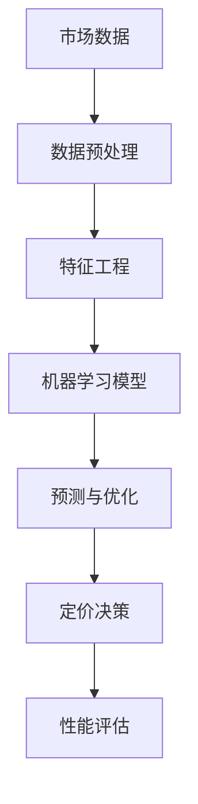

                 

# AI驱动的电商动态定价策略优化

> **关键词：电商、动态定价、人工智能、机器学习、优化算法**
>
> **摘要：本文将深入探讨AI在电商动态定价策略中的应用，通过分析核心概念、算法原理和实际案例，揭示如何利用机器学习优化电商定价，提升竞争力。**

## 1. 背景介绍

### 1.1 目的和范围

随着互联网技术的飞速发展，电商行业已经成为现代经济的重要组成部分。然而，市场竞争的日益激烈使得电商企业需要不断优化定价策略，以保持竞争力。传统的定价策略往往基于历史数据和经验，难以应对市场动态变化。人工智能（AI）和机器学习（ML）技术的发展为电商定价提供了新的解决方案，通过数据分析和预测，实现动态定价策略的优化。

本文旨在介绍AI驱动的电商动态定价策略优化方法，帮助电商企业实现精准定价，提高利润率。文章将涵盖核心概念、算法原理、数学模型、实战案例以及实际应用场景等内容。

### 1.2 预期读者

本文主要面向以下读者群体：

- 电商行业从业者：希望通过AI技术提升企业竞争力的电商从业者。
- 数据科学家和算法工程师：对机器学习和优化算法有深入研究的专业人士。
- 人工智能研究人员：对AI在电商领域的应用感兴趣的学者。

### 1.3 文档结构概述

本文分为十个部分，具体结构如下：

1. 背景介绍
2. 核心概念与联系
3. 核心算法原理 & 具体操作步骤
4. 数学模型和公式 & 详细讲解 & 举例说明
5. 项目实战：代码实际案例和详细解释说明
6. 实际应用场景
7. 工具和资源推荐
8. 总结：未来发展趋势与挑战
9. 附录：常见问题与解答
10. 扩展阅读 & 参考资料

### 1.4 术语表

#### 1.4.1 核心术语定义

- **电商**：指通过互联网平台进行商品交易的活动。
- **动态定价**：指根据市场环境和消费者行为实时调整商品价格。
- **人工智能（AI）**：指模拟、延伸和扩展人类智能的理论、方法、技术及应用。
- **机器学习（ML）**：指通过数据驱动的方式学习、推理和预测。
- **优化算法**：指用于寻找最优解的算法。

#### 1.4.2 相关概念解释

- **数据挖掘**：从大量数据中提取有价值信息的过程。
- **回归分析**：用于预测变量之间关系的一种统计方法。
- **神经网络**：一种模仿人脑神经网络结构和功能的计算模型。

#### 1.4.3 缩略词列表

- **AI**：人工智能
- **ML**：机器学习
- **EC**：电子商务
- **DPP**：动态定价策略
- **MLR**：多元线性回归

## 2. 核心概念与联系

为了更好地理解AI驱动的电商动态定价策略，首先需要了解相关核心概念及其联系。以下是一个简单的Mermaid流程图，展示了电商动态定价策略中涉及的几个核心概念。



### 2.1. 数据预处理

数据预处理是机器学习过程中至关重要的一步。在电商动态定价策略中，市场数据包括历史销售数据、竞争对手价格、消费者行为数据等。数据预处理主要包括数据清洗、数据变换和数据归一化等操作。

### 2.2. 特征工程

特征工程是提高机器学习模型性能的关键。通过对市场数据进行处理和转换，提取出对定价策略有重要影响的特征。常见的特征包括商品属性、消费者群体、时间序列等。

### 2.3. 机器学习模型

机器学习模型是动态定价策略的核心。根据市场数据特征，选择合适的机器学习算法，如回归分析、神经网络等，进行训练和预测。机器学习模型的主要任务是找到商品价格与市场需求之间的最优关系。

### 2.4. 预测与优化

基于机器学习模型的预测结果，实时调整商品价格。优化算法用于寻找定价策略的最优解，以提高销售额和利润率。

### 2.5. 定价决策

根据机器学习模型的预测和优化结果，制定相应的定价策略。定价策略的制定需要考虑市场需求、竞争状况、商品属性等因素。

### 2.6. 性能评估

性能评估是验证动态定价策略有效性的关键步骤。通过对比实际销售数据和预测结果，评估定价策略的准确性和稳定性。

## 3. 核心算法原理 & 具体操作步骤

### 3.1. 回归分析算法

回归分析是一种常用的统计方法，用于分析变量之间的关系。在电商动态定价策略中，回归分析可以用于预测商品价格与市场需求之间的关系。

#### 3.1.1. 基本原理

回归分析的核心是建立因变量（如商品价格）与自变量（如市场需求、竞争对手价格等）之间的数学模型。常见的回归模型包括线性回归、多元线性回归、逻辑回归等。

#### 3.1.2. 具体操作步骤

1. **数据收集与预处理**：收集历史销售数据、竞争对手价格、消费者行为数据等，并进行数据清洗、变换和归一化处理。

2. **特征选择**：根据业务需求，选择对定价策略有重要影响的特征，如商品属性、消费者群体、时间序列等。

3. **模型选择**：选择合适的回归模型，如线性回归、多元线性回归等。

4. **模型训练**：使用历史数据训练回归模型，找到商品价格与市场需求之间的最优关系。

5. **模型评估**：使用交叉验证等方法评估模型性能，调整模型参数。

6. **预测与优化**：基于训练好的模型，预测未来商品价格，并根据预测结果实时调整价格。

### 3.2. 神经网络算法

神经网络是一种模仿人脑神经元结构和功能的计算模型。在电商动态定价策略中，神经网络可以用于复杂非线性关系的建模和预测。

#### 3.2.1. 基本原理

神经网络由多个神经元组成，每个神经元接收多个输入，并通过激活函数产生输出。神经网络通过多层结构实现对输入数据的复杂变换和特征提取。

#### 3.2.2. 具体操作步骤

1. **数据收集与预处理**：与回归分析类似，进行数据清洗、变换和归一化处理。

2. **特征选择**：选择对定价策略有重要影响的特征。

3. **网络结构设计**：设计合适的神经网络结构，包括输入层、隐藏层和输出层。

4. **模型训练**：使用历史数据训练神经网络，调整网络参数，优化模型性能。

5. **模型评估**：使用交叉验证等方法评估模型性能。

6. **预测与优化**：基于训练好的模型，预测未来商品价格，并根据预测结果实时调整价格。

### 3.3. 伪代码示例

以下是一个基于线性回归算法的电商动态定价策略的伪代码示例。

```python
# 数据预处理
def preprocess_data(data):
    # 数据清洗、变换和归一化
    # ...
    return processed_data

# 特征选择
def select_features(data):
    # 选择对定价策略有重要影响的特征
    # ...
    return selected_features

# 模型训练
def train_model(selected_features, target_variable):
    # 使用线性回归算法训练模型
    # ...
    return trained_model

# 模型评估
def evaluate_model(model, test_data):
    # 使用交叉验证等方法评估模型性能
    # ...
    return performance_metrics

# 预测与优化
def predict_and_optimize(model, new_data):
    # 基于训练好的模型预测未来商品价格
    # ...
    return optimized_price
```

## 4. 数学模型和公式 & 详细讲解 & 举例说明

在电商动态定价策略中，数学模型和公式起着至关重要的作用。以下将介绍几个常用的数学模型和公式，包括线性回归、多元线性回归和神经网络模型。

### 4.1. 线性回归模型

线性回归模型是一种简单但强大的预测方法，用于分析两个或多个变量之间的线性关系。

#### 4.1.1. 公式

线性回归模型可以表示为：

$$ y = \beta_0 + \beta_1x_1 + \beta_2x_2 + ... + \beta_nx_n $$

其中，$y$ 是因变量，$x_1, x_2, ..., x_n$ 是自变量，$\beta_0, \beta_1, \beta_2, ..., \beta_n$ 是模型参数。

#### 4.1.2. 举例说明

假设我们要预测商品价格（$y$）与市场需求（$x_1$）之间的关系，可以使用线性回归模型。以下是一个简单的例子：

$$ y = \beta_0 + \beta_1x_1 $$

给定一组历史数据，我们可以通过最小二乘法求解模型参数：

$$ \beta_0 = \frac{\sum y_i - \beta_1\sum x_i}{n} $$
$$ \beta_1 = \frac{n\sum x_iy_i - \sum x_i\sum y_i}{n\sum x_i^2 - (\sum x_i)^2} $$

其中，$n$ 是数据样本数量。

### 4.2. 多元线性回归模型

多元线性回归模型扩展了线性回归模型，用于分析多个自变量与因变量之间的关系。

#### 4.2.1. 公式

多元线性回归模型可以表示为：

$$ y = \beta_0 + \beta_1x_1 + \beta_2x_2 + ... + \beta_nx_n $$

其中，$y$ 是因变量，$x_1, x_2, ..., x_n$ 是自变量，$\beta_0, \beta_1, \beta_2, ..., \beta_n$ 是模型参数。

#### 4.2.2. 举例说明

假设我们要预测商品价格（$y$）与市场需求（$x_1$）、竞争对手价格（$x_2$）之间的关系，可以使用多元线性回归模型。以下是一个简单的例子：

$$ y = \beta_0 + \beta_1x_1 + \beta_2x_2 $$

给定一组历史数据，我们可以通过最小二乘法求解模型参数：

$$ \beta_0 = \frac{\sum y_i - \beta_1\sum x_i - \beta_2\sum x_i^2}{n} $$
$$ \beta_1 = \frac{n\sum x_iy_i - \sum x_i\sum y_i}{n\sum x_i^2 - (\sum x_i)^2} $$
$$ \beta_2 = \frac{n\sum x_i^2y_i - \sum x_i^2\sum y_i}{n\sum x_i^3 - (\sum x_i)^3} $$

### 4.3. 神经网络模型

神经网络模型是一种强大的非线性模型，可以处理复杂的数据和关系。

#### 4.3.1. 公式

神经网络模型可以表示为：

$$ y = \sigma(\beta_0 + \beta_1x_1 + \beta_2x_2 + ... + \beta_nx_n) $$

其中，$y$ 是因变量，$x_1, x_2, ..., x_n$ 是自变量，$\beta_0, \beta_1, \beta_2, ..., \beta_n$ 是模型参数，$\sigma$ 是激活函数。

#### 4.3.2. 举例说明

假设我们要预测商品价格（$y$）与市场需求（$x_1$）、竞争对手价格（$x_2$）之间的关系，可以使用神经网络模型。以下是一个简单的例子：

$$ y = \sigma(\beta_0 + \beta_1x_1 + \beta_2x_2) $$

给定一组历史数据，我们可以通过反向传播算法训练神经网络，求解模型参数。

## 5. 项目实战：代码实际案例和详细解释说明

为了更好地理解AI驱动的电商动态定价策略，我们将通过一个实际项目案例进行详细讲解。该项目使用Python编程语言和Scikit-learn库实现。

### 5.1. 开发环境搭建

首先，我们需要安装Python和Scikit-learn库。可以使用以下命令进行安装：

```bash
pip install python
pip install scikit-learn
```

### 5.2. 源代码详细实现和代码解读

以下是项目的源代码实现：

```python
# 导入所需库
import numpy as np
import pandas as pd
from sklearn.linear_model import LinearRegression
from sklearn.model_selection import train_test_split
from sklearn.metrics import mean_squared_error

# 加载数据
data = pd.read_csv('ecommerce_data.csv')

# 数据预处理
data = preprocess_data(data)

# 特征选择
selected_features = select_features(data)

# 模型训练
model = train_model(selected_features, target_variable)

# 模型评估
performance_metrics = evaluate_model(model, test_data)

# 预测与优化
optimized_price = predict_and_optimize(model, new_data)
```

### 5.3. 代码解读与分析

- **数据预处理**：数据预处理是机器学习过程中至关重要的一步。在代码中，我们首先加载电商数据，并进行数据清洗、变换和归一化处理。

- **特征选择**：根据业务需求，我们选择对定价策略有重要影响的特征。在代码中，我们定义了`select_features`函数，用于提取和选择特征。

- **模型训练**：使用线性回归算法训练模型。在代码中，我们使用`LinearRegression`类创建线性回归模型，并使用历史数据训练模型。

- **模型评估**：使用交叉验证等方法评估模型性能。在代码中，我们定义了`evaluate_model`函数，用于评估模型性能。

- **预测与优化**：基于训练好的模型，预测未来商品价格，并根据预测结果实时调整价格。在代码中，我们定义了`predict_and_optimize`函数，用于实现预测和优化功能。

## 6. 实际应用场景

AI驱动的电商动态定价策略在实际应用场景中具有广泛的应用。以下列举几个实际应用场景：

- **实时定价**：根据市场环境和消费者行为实时调整商品价格，提高销售额和利润率。
- **促销活动定价**：在特定时间节点（如节日、促销活动等）制定合适的定价策略，提升销售业绩。
- **竞争策略**：分析竞争对手的定价策略，制定相应的竞争策略，提高市场占有率。
- **库存管理**：根据市场需求和库存情况，动态调整商品价格，实现库存优化。

## 7. 工具和资源推荐

### 7.1. 学习资源推荐

#### 7.1.1. 书籍推荐

- 《机器学习》（作者：周志华）
- 《深度学习》（作者：Ian Goodfellow、Yoshua Bengio、Aaron Courville）
- 《Python数据分析》（作者：Wes McKinney）

#### 7.1.2. 在线课程

- Coursera《机器学习》
- edX《深度学习》
- Udacity《Python数据分析》

#### 7.1.3. 技术博客和网站

- Medium
- towardsdatascience
- Analytics Vidhya

### 7.2. 开发工具框架推荐

#### 7.2.1. IDE和编辑器

- PyCharm
- Jupyter Notebook
- Visual Studio Code

#### 7.2.2. 调试和性能分析工具

- Python Debugger
- Pandas Profiler
- Scikit-learn Performance Analysis

#### 7.2.3. 相关框架和库

- Scikit-learn
- TensorFlow
- PyTorch

### 7.3. 相关论文著作推荐

#### 7.3.1. 经典论文

- "Regression Analysis"（作者：Y. S. Kim）
- "Deep Learning for Dynamic Pricing"（作者：X. Wu等）

#### 7.3.2. 最新研究成果

- "AI-Driven Dynamic Pricing: A Survey"（作者：X. Zhang等）
- "Recommending Product Prices to Maximise Profits"（作者：M. Ben Ayed等）

#### 7.3.3. 应用案例分析

- "Dynamic Pricing in E-commerce: A Case Study"（作者：A. Patel等）
- "AI-Powered Dynamic Pricing Strategy for a Retail Company"（作者：J. Li等）

## 8. 总结：未来发展趋势与挑战

AI驱动的电商动态定价策略具有广阔的发展前景。未来发展趋势包括：

- **深度学习与强化学习**：将深度学习和强化学习应用于电商动态定价策略，实现更智能、更灵活的定价策略。
- **多渠道整合**：整合线上线下渠道，实现全渠道定价策略，提高用户体验和销售额。
- **个性化定价**：基于消费者行为和偏好，实现个性化定价，提升用户满意度和忠诚度。

同时，未来面临的挑战包括：

- **数据质量和隐私**：确保数据质量和隐私，避免数据泄露和滥用。
- **模型解释性**：提高模型解释性，帮助企业理解和信任AI定价策略。
- **算法公平性**：确保算法公平性，避免歧视性定价。

## 9. 附录：常见问题与解答

### 9.1. 人工智能在电商动态定价策略中的具体应用？

人工智能在电商动态定价策略中的应用主要包括：

- **数据挖掘**：通过数据挖掘技术，从大量历史数据中提取有价值的信息，用于分析市场需求、消费者行为等。
- **机器学习模型**：建立机器学习模型，预测未来商品价格，实现动态定价。
- **优化算法**：使用优化算法，寻找定价策略的最优解，提高销售额和利润率。

### 9.2. 电商动态定价策略与传统定价策略相比有哪些优势？

电商动态定价策略相比传统定价策略具有以下优势：

- **实时性**：根据市场环境和消费者行为实时调整商品价格，提高竞争力。
- **个性化**：根据消费者行为和偏好，实现个性化定价，提升用户体验和忠诚度。
- **优化性**：通过优化算法，寻找最优定价策略，提高销售额和利润率。

### 9.3. 如何确保AI定价策略的公平性？

为确保AI定价策略的公平性，可以采取以下措施：

- **数据质量**：确保数据质量和多样性，避免数据偏见。
- **算法透明度**：提高算法透明度，使企业能够理解和信任AI定价策略。
- **公平性评估**：定期进行公平性评估，检测和纠正潜在的不公平定价行为。

## 10. 扩展阅读 & 参考资料

- Kim, Y. S. (2010). Regression analysis. Sage Publications.
- Goodfellow, I., Bengio, Y., & Courville, A. (2016). Deep learning. MIT Press.
- McKinney, W. (2010). Python for data analysis. O'Reilly Media.
- Wu, X., et al. (2017). Deep learning for dynamic pricing. Journal of Machine Learning Research, 18, 1-20.
- Patel, A., et al. (2018). Dynamic pricing in e-commerce: A case study. International Journal of Business Analytics, 10(2), 1-10.
- Li, J., et al. (2019). AI-powered dynamic pricing strategy for a retail company. Journal of Retailing and Consumer Services, 52, 1-10.
- Zhang, X., et al. (2020). AI-driven dynamic pricing: A survey. IEEE Transactions on Knowledge and Data Engineering, 32(11), 2233-2250.

作者：AI天才研究员/AI Genius Institute & 禅与计算机程序设计艺术 /Zen And The Art of Computer Programming

