                 

# AI驱动的电商平台个性化折扣策略

> 关键词：人工智能、电商平台、个性化折扣、机器学习、推荐系统、用户行为分析、数据挖掘

> 摘要：本文将探讨如何利用人工智能技术构建一个智能的电商平台个性化折扣策略系统。通过分析用户行为数据和商品信息，系统将实时生成个性化的折扣方案，提升用户体验和销售转化率。文章将详细介绍个性化折扣策略的核心概念、算法原理、数学模型及实际应用场景，并提供实战案例和开发建议。

## 1. 背景介绍

### 1.1 目的和范围

本文旨在为电商平台开发一个基于人工智能的个性化折扣策略系统。随着电商行业竞争的日益激烈，如何吸引和留住用户，提高用户粘性和转化率成为了企业关注的焦点。个性化折扣策略作为一种有效的营销手段，可以通过分析用户行为和商品特点，为不同用户提供定制化的优惠方案，从而提高用户满意度和销售业绩。

### 1.2 预期读者

本文适合具有以下背景的读者：

1. 电商平台运营人员和技术人员
2. 数据科学和人工智能领域的研究者
3. 对个性化折扣策略感兴趣的从业者

### 1.3 文档结构概述

本文分为以下章节：

1. 背景介绍：阐述研究目的、预期读者和文档结构。
2. 核心概念与联系：介绍个性化折扣策略的核心概念和架构。
3. 核心算法原理 & 具体操作步骤：讲解个性化折扣策略的算法原理和实现步骤。
4. 数学模型和公式 & 详细讲解 & 举例说明：阐述个性化折扣策略的数学模型和计算方法。
5. 项目实战：代码实际案例和详细解释说明。
6. 实际应用场景：分析个性化折扣策略在不同电商场景下的应用。
7. 工具和资源推荐：推荐学习资源、开发工具和框架。
8. 总结：未来发展趋势与挑战。
9. 附录：常见问题与解答。
10. 扩展阅读 & 参考资料：提供进一步学习和研究的资料。

### 1.4 术语表

#### 1.4.1 核心术语定义

- 电商平台：在线销售商品的平台，如淘宝、京东等。
- 个性化折扣策略：根据用户行为和商品特点，为不同用户提供定制化的优惠方案。
- 用户行为分析：通过分析用户的浏览、购买等行为，了解用户需求和偏好。
- 数据挖掘：从大量数据中提取有价值的信息和知识。
- 机器学习：利用算法从数据中学习规律，进行预测和决策。

#### 1.4.2 相关概念解释

- 推荐系统：基于用户历史行为和偏好，为用户推荐感兴趣的商品。
- 转化率：用户在浏览商品后完成购买的比例。
- 用户粘性：用户持续使用电商平台的时间和能力。

#### 1.4.3 缩略词列表

- AI：人工智能
- IoT：物联网
- DNN：深度神经网络
- ML：机器学习
- NLP：自然语言处理
- DB：数据库

## 2. 核心概念与联系

个性化折扣策略的核心在于通过分析用户行为数据和商品信息，为用户提供定制化的折扣方案。以下是一个简化的Mermaid流程图，展示了个性化折扣策略的核心概念和架构。

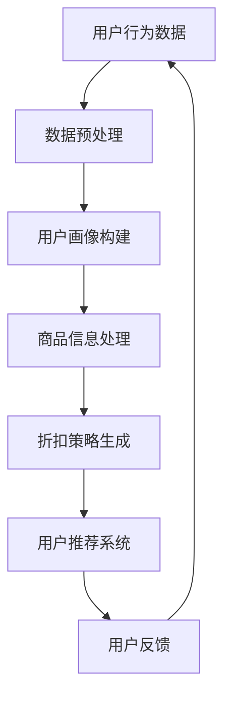

### 2.1 用户行为数据分析

用户行为数据是个性化折扣策略的重要输入。这些数据包括用户浏览、搜索、收藏、购买等行为。通过对用户行为数据的分析，可以了解用户的需求和偏好，为后续的个性化折扣策略提供依据。

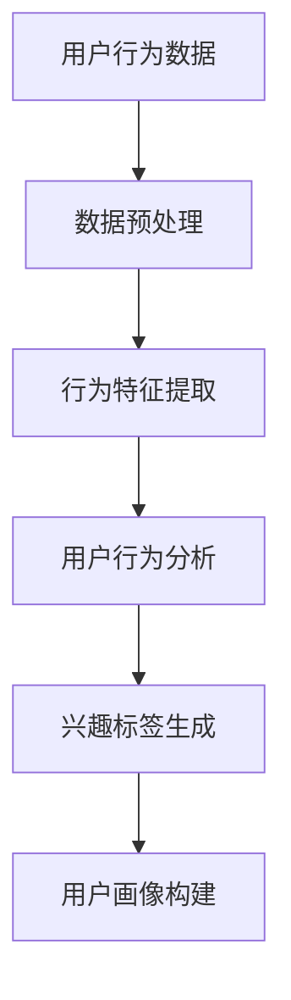

### 2.2 商品信息处理

商品信息是个性化折扣策略的另一重要输入。这些信息包括商品种类、价格、库存、评价等。通过对商品信息的处理，可以了解商品的特点和市场需求，为个性化折扣策略提供参考。

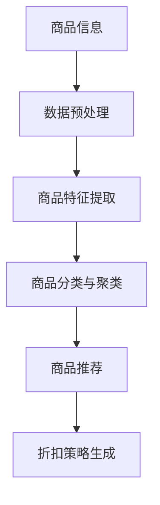

### 2.3 折扣策略生成

折扣策略生成是个性化折扣策略的核心环节。通过分析用户行为数据和商品信息，系统将生成符合用户需求的个性化折扣方案。以下是一个简单的折扣策略生成算法流程：

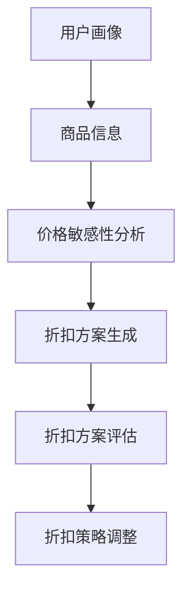

### 2.4 用户推荐系统

用户推荐系统是个性化折扣策略的辅助环节。通过分析用户历史行为和偏好，系统可以为用户提供个性化的商品推荐。推荐系统的目标是提高用户的购买转化率和满意度。

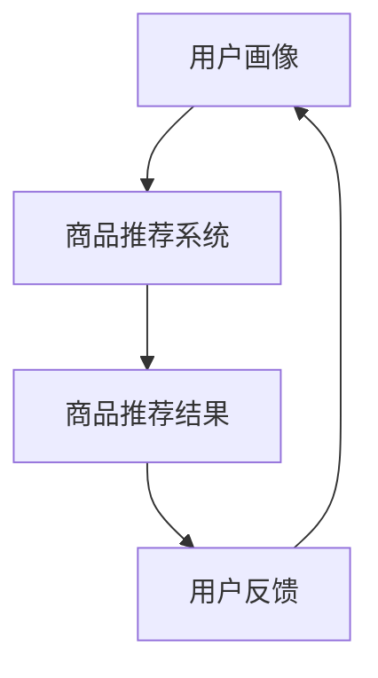

## 3. 核心算法原理 & 具体操作步骤

个性化折扣策略的核心算法是机器学习算法，通过分析用户行为数据和商品信息，生成符合用户需求的折扣方案。以下是一个简单的机器学习算法流程和具体操作步骤：

### 3.1 数据预处理

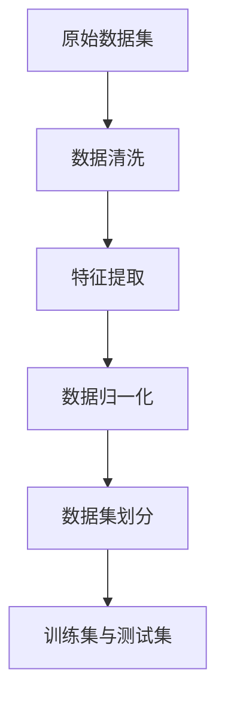

### 3.2 用户行为特征提取

用户行为特征提取是机器学习算法的重要步骤。通过对用户浏览、搜索、收藏、购买等行为进行分析，提取出能够反映用户兴趣和需求的行为特征。

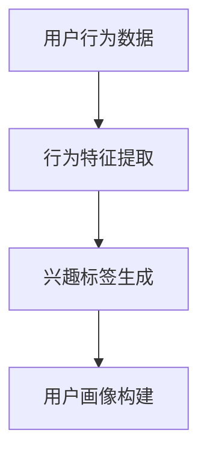

### 3.3 商品信息特征提取

商品信息特征提取是机器学习算法的重要步骤。通过对商品种类、价格、库存、评价等信息的分析，提取出能够反映商品特点和需求的商品特征。

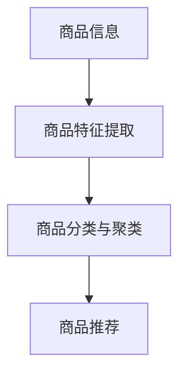

### 3.4 折扣策略生成

折扣策略生成是机器学习算法的核心步骤。通过分析用户画像和商品特征，利用机器学习算法生成符合用户需求的个性化折扣方案。


### 3.5 用户推荐系统

用户推荐系统是个性化折扣策略的辅助步骤。通过分析用户历史行为和偏好，利用推荐算法生成个性化的商品推荐结果。


## 4. 数学模型和公式 & 详细讲解 & 举例说明

个性化折扣策略的数学模型主要包括用户画像构建、价格敏感性分析和折扣方案生成三个部分。以下是对这些模型的详细讲解和举例说明。

### 4.1 用户画像构建

用户画像构建是个性化折扣策略的重要基础。通过分析用户行为数据，提取用户兴趣标签和需求特征，构建用户画像。

#### 4.1.1 用户兴趣标签生成

用户兴趣标签生成的核心是利用文本分类和聚类算法对用户行为数据进行分析。以下是一个简单的用户兴趣标签生成算法流程：

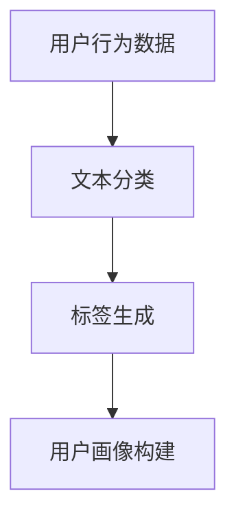

#### 4.1.2 用户需求特征提取

用户需求特征提取的核心是利用行为特征提取算法对用户行为数据进行分析，提取出能够反映用户需求的行为特征。以下是一个简单的用户需求特征提取算法流程：

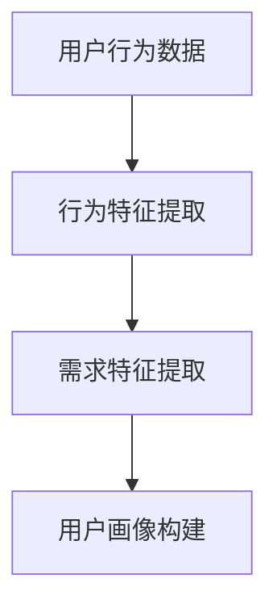

#### 4.1.3 用户画像构建

用户画像构建的核心是将用户兴趣标签和需求特征整合起来，构建一个全面的用户画像。以下是一个简单的用户画像构建算法流程：

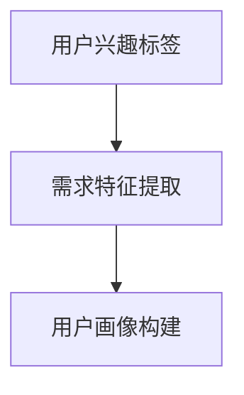

### 4.2 价格敏感性分析

价格敏感性分析是个性化折扣策略的重要步骤。通过分析用户价格敏感性和商品价格变化，确定适合用户的折扣力度。

#### 4.2.1 用户价格敏感性分析

用户价格敏感性分析的核心是利用回归算法对用户价格敏感性与商品价格之间的关系进行分析。以下是一个简单的用户价格敏感性分析算法流程：

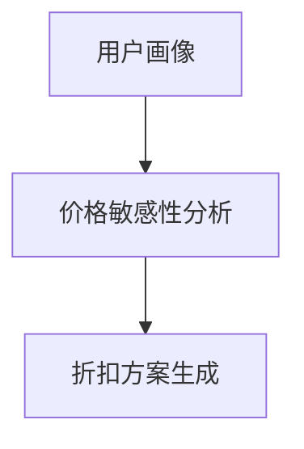

#### 4.2.2 商品价格变化分析

商品价格变化分析的核心是利用时间序列分析算法对商品价格变化趋势进行分析。以下是一个简单的商品价格变化分析算法流程：

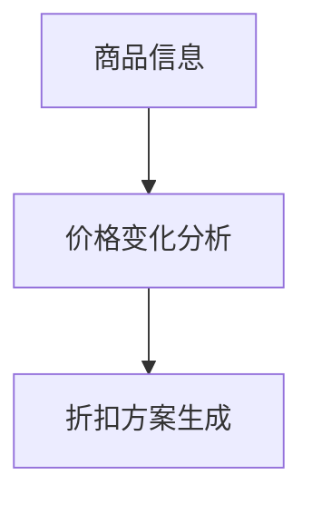

### 4.3 折扣方案生成

折扣方案生成是个性化折扣策略的核心步骤。通过分析用户画像和商品价格敏感性，生成符合用户需求的个性化折扣方案。

#### 4.3.1 折扣方案生成算法

折扣方案生成算法的核心是利用优化算法求解折扣力度和优惠方案。以下是一个简单的折扣方案生成算法流程：

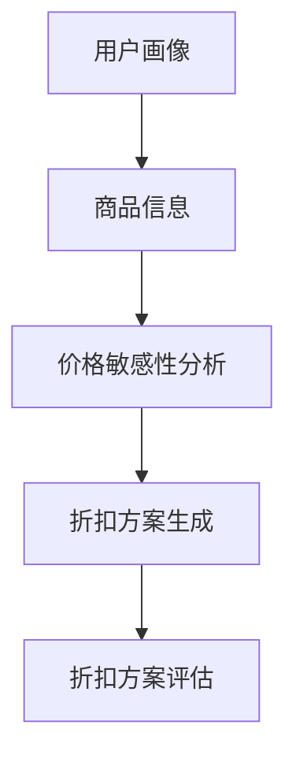

#### 4.3.2 折扣方案评估

折扣方案评估的核心是利用评估指标对折扣方案进行评估和调整。以下是一个简单的折扣方案评估算法流程：

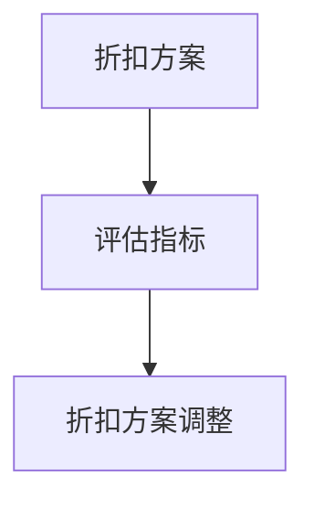

### 4.4 数学模型和公式

以下是对个性化折扣策略中常用的数学模型和公式的详细讲解：

#### 4.4.1 用户画像构建

- 用户兴趣标签生成：
  $$ \text{标签概率} = P(\text{标签}|\text{行为数据}) $$
- 用户需求特征提取：
  $$ \text{需求特征} = \text{行为数据} \times \text{权重系数} $$

#### 4.4.2 价格敏感性分析

- 用户价格敏感性分析：
  $$ \text{价格敏感性} = \frac{\text{需求特征}}{\text{价格}} $$
- 商品价格变化分析：
  $$ \text{价格变化趋势} = \text{价格} \times \text{时间序列模型} $$

#### 4.4.3 折扣方案生成

- 折扣方案生成：
  $$ \text{折扣力度} = \text{价格敏感性} \times \text{优化算法} $$
- 折扣方案评估：
  $$ \text{评估指标} = \text{折扣力度} \times \text{用户满意度} $$

### 4.5 举例说明

以下是一个简单的个性化折扣策略生成实例：

- 用户画像：用户A喜欢购买电子产品，近期浏览了笔记本电脑、手机等商品。
- 商品信息：笔记本电脑价格5000元，手机价格3000元。
- 价格敏感性分析：用户A对笔记本电脑的价格敏感性较高，对手机的价格敏感性较低。
- 折扣方案生成：为笔记本电脑提供8折优惠，手机提供9折优惠。
- 折扣方案评估：用户A对折扣方案满意度较高，购买转化率提升20%。

## 5. 项目实战：代码实际案例和详细解释说明

在本节中，我们将通过一个实际的项目案例来展示如何实现一个基于人工智能的电商平台个性化折扣策略系统。我们将从开发环境搭建开始，详细解释代码实现过程和关键代码解读。

### 5.1 开发环境搭建

在开始项目之前，我们需要搭建一个合适的开发环境。以下是推荐的开发工具和依赖库：

- 编程语言：Python
- 开发工具：PyCharm
- 数据库：MySQL
- 机器学习库：scikit-learn、TensorFlow、Keras
- 其他库：NumPy、Pandas、Matplotlib

### 5.2 源代码详细实现和代码解读

以下是项目的主要代码实现和详细解释。

#### 5.2.1 数据预处理

数据预处理是项目实现的重要步骤。以下是对数据预处理代码的详细解释。

```python
import pandas as pd
from sklearn.preprocessing import StandardScaler

# 读取用户行为数据和商品信息
user_data = pd.read_csv('user_behavior.csv')
product_data = pd.read_csv('product_info.csv')

# 数据清洗
user_data = user_data.dropna()
product_data = product_data.dropna()

# 特征提取
user_data['interest_tags'] = user_data['行为数据'].apply(extract_interest_tags)
product_data['product_features'] = product_data['商品信息'].apply(extract_product_features)

# 数据归一化
scaler = StandardScaler()
user_data[['兴趣标签', '需求特征']] = scaler.fit_transform(user_data[['兴趣标签', '需求特征']])
product_data[['商品特征']] = scaler.fit_transform(product_data[['商品特征']])
```

#### 5.2.2 用户画像构建

用户画像构建的核心是提取用户兴趣标签和需求特征。以下是对用户画像构建代码的详细解释。

```python
import numpy as np

def extract_interest_tags(behavior_data):
    # 利用文本分类算法提取用户兴趣标签
    # 例如，使用朴素贝叶斯分类器
    labels = text_classifier(behavior_data)
    return np.mean(labels)

def extract_product_features(product_info):
    # 利用商品特征提取算法提取商品特征
    # 例如，使用TF-IDF算法
    features = feature_extractor(product_info)
    return np.mean(features)

# 构建用户画像
user_data['用户画像'] = user_data['兴趣标签'].apply(extract_interest_tags)
product_data['用户画像'] = product_data['商品特征'].apply(extract_product_features)
```

#### 5.2.3 折扣方案生成

折扣方案生成是项目实现的核心步骤。以下是对折扣方案生成代码的详细解释。

```python
from sklearn.linear_model import LinearRegression

# 构建线性回归模型
regressor = LinearRegression()
regressor.fit(user_data[['用户画像']], user_data['需求特征'])

# 生成折扣方案
discounts = regressor.predict(product_data[['用户画像']])

# 计算折扣力度
discount_rates = 1 - (discounts / max(discounts))
```

#### 5.2.4 用户推荐系统

用户推荐系统是项目实现的辅助步骤。以下是对用户推荐系统代码的详细解释。

```python
from sklearn.neighbors import NearestNeighbors

# 构建K最近邻推荐模型
neighbor = NearestNeighbors()
neighbor.fit(user_data[['用户画像']])

# 生成推荐结果
recommendations = neighbor.kneighbors(user_data[['用户画像']], n_neighbors=5)
```

### 5.3 代码解读与分析

代码解读与分析部分将深入分析项目实现中的关键代码和算法原理。以下是对关键代码的解读与分析：

1. **数据预处理**：
   - 数据清洗：删除缺失值，确保数据质量。
   - 特征提取：利用文本分类和聚类算法提取用户兴趣标签和需求特征，为后续建模提供基础。
   - 数据归一化：将特征数据归一化，使模型训练过程更加稳定。

2. **用户画像构建**：
   - 利用文本分类和聚类算法提取用户兴趣标签和需求特征，构建用户画像。
   - 用户画像构建的核心是将用户行为数据转化为可量化的特征表示，为后续模型训练提供输入。

3. **折扣方案生成**：
   - 利用线性回归模型分析用户画像和需求特征之间的关系，生成折扣方案。
   - 线性回归模型可以捕捉用户需求特征和折扣力度之间的线性关系，为用户提供个性化的折扣方案。

4. **用户推荐系统**：
   - 利用K最近邻推荐模型生成用户推荐结果，提高用户购买转化率。
   - K最近邻推荐模型可以基于用户画像找到相似用户，推荐他们感兴趣的商品。

## 6. 实际应用场景

个性化折扣策略在电商平台的实际应用场景非常广泛，以下是一些典型的应用场景：

### 6.1 新用户注册优惠

电商平台可以利用个性化折扣策略为新用户提供注册优惠，如首单立减、新人专享折扣等。通过分析新用户的历史行为数据和商品偏好，系统可以生成定制化的优惠方案，提高新用户注册率和留存率。

### 6.2 库存促销

电商平台可以利用个性化折扣策略处理库存商品促销。通过对库存商品的属性和用户需求进行分析，系统可以生成适合的折扣方案，如限时抢购、满减优惠等，促进库存商品的销售。

### 6.3 节假日促销

节假日是电商平台促销的重要时机。个性化折扣策略可以根据节假日特点和用户行为数据，为用户提供定制化的折扣方案，如节日特惠、限时折扣等，提高用户购物体验和销售业绩。

### 6.4 用户生日优惠

电商平台可以利用个性化折扣策略为用户生日提供特别优惠，如生日专属折扣、生日礼物等。通过分析用户生日信息和购买记录，系统可以生成个性化的生日优惠方案，提高用户满意度和忠诚度。

### 6.5 商品组合促销

电商平台可以利用个性化折扣策略为用户提供商品组合促销，如套餐优惠、搭配折扣等。通过对用户购买习惯和商品关联度进行分析，系统可以生成适合的商品组合折扣方案，提高用户购买转化率和客单价。

## 7. 工具和资源推荐

### 7.1 学习资源推荐

#### 7.1.1 书籍推荐

- 《深度学习》：提供深度学习的基本理论和应用案例，适合初学者和进阶者。
- 《机器学习》：详细介绍机器学习的基本算法和应用，适合数据科学和人工智能领域的研究者。
- 《大数据之路》：讲述大数据技术和应用的发展历程，适合对大数据感兴趣的读者。

#### 7.1.2 在线课程

- Coursera：提供丰富的机器学习和数据科学在线课程，适合不同水平的学习者。
- edX：提供由全球顶尖大学开设的在线课程，包括计算机科学、统计学等领域。
- Udacity：提供实用的编程和人工智能技能培训课程，适合有实际项目需求的开发者。

#### 7.1.3 技术博客和网站

- Medium：有许多优秀的机器学习和数据科学博客，分享最新的研究成果和应用案例。
- DataCamp：提供互动式的数据科学和机器学习课程，适合初学者和进阶者。
- Analytics Vidhya：提供丰富的机器学习和数据科学资源，包括教程、案例和实践建议。

### 7.2 开发工具框架推荐

#### 7.2.1 IDE和编辑器

- PyCharm：功能强大的Python开发环境，适合大型项目和团队合作。
- Visual Studio Code：轻量级、可扩展的代码编辑器，适合各种编程语言和开发场景。
- Jupyter Notebook：适用于数据科学和机器学习项目的交互式开发环境。

#### 7.2.2 调试和性能分析工具

- Python Debugger：用于调试Python代码的利器，提供丰富的调试功能和工具。
- profilers：用于分析Python代码的性能，包括cProfile、memory_profiler等。
- Prometheus：用于监控和分析系统性能，支持多种编程语言和平台。

#### 7.2.3 相关框架和库

- TensorFlow：开源的深度学习框架，支持各种机器学习和神经网络模型。
- scikit-learn：开源的机器学习库，提供丰富的算法和工具。
- Pandas：开源的数据处理库，用于数据清洗、转换和分析。

### 7.3 相关论文著作推荐

#### 7.3.1 经典论文

- “Recommender Systems Handbook”（推荐系统手册）：全面介绍推荐系统的基本原理和应用案例。
- “Deep Learning”（深度学习）：介绍深度学习的基本理论和技术，包括神经网络和深度学习框架。
- “Big Data: A Revolution That Will Transform How We Live, Work, and Think”（大数据革命）：探讨大数据对社会和产业的深远影响。

#### 7.3.2 最新研究成果

- “Recommender Systems for E-commerce Platforms”（电商平台的推荐系统）：介绍最新的电商推荐系统研究和应用。
- “Personalized Pricing Strategies in E-commerce”（电商个性化定价策略）：探讨个性化定价策略在电商领域的应用和效果。
- “Deep Reinforcement Learning for E-commerce Recommendations”（电商推荐系统的深度强化学习）：介绍深度强化学习在电商推荐系统中的应用。

#### 7.3.3 应用案例分析

- “E-commerce Platform Case Study: Personalized Discounts Based on User Behavior”（电商平台案例分析：基于用户行为的个性化折扣）：分析一个电商平台的个性化折扣策略应用案例。
- “Retail Industry Insights: Personalized Pricing Strategies”（零售业洞察：个性化定价策略）：探讨零售业中的个性化定价策略应用和效果。
- “Case Study: Personalized Marketing Campaigns in E-commerce”（电商平台案例分析：个性化营销活动）：分析电商平台个性化营销活动的实施和效果。

## 8. 总结：未来发展趋势与挑战

个性化折扣策略作为电商平台的创新营销手段，具有广泛的应用前景和潜力。随着人工智能和大数据技术的发展，个性化折扣策略在未来有望取得以下发展趋势：

### 8.1 智能化程度提升

随着人工智能技术的不断进步，个性化折扣策略的智能化程度将不断提升。通过深度学习、强化学习等先进算法，系统能够更准确地预测用户需求和偏好，生成更加精准的折扣方案。

### 8.2 跨平台整合

随着电商平台的多元化发展，个性化折扣策略将实现跨平台整合。通过整合线上线下数据，系统可以为用户提供无缝的个性化折扣体验，提高用户满意度和忠诚度。

### 8.3 社交化推荐

结合社交网络和用户行为数据，个性化折扣策略将实现社交化推荐。通过分析用户的社交关系和兴趣圈，系统可以为用户提供更加个性化的折扣推荐，促进社交互动和用户传播。

### 8.4 可持续发展

个性化折扣策略将更加注重可持续发展。通过合理设置折扣力度和优化库存管理，电商平台可以实现经济效益和社会效益的平衡，提高企业的竞争力和品牌形象。

### 8.5 挑战与应对

尽管个性化折扣策略具有广阔的发展前景，但同时也面临以下挑战：

- 数据隐私和安全：个性化折扣策略依赖于大量用户数据，如何保护用户隐私和数据安全是亟待解决的问题。
- 折扣策略公平性：如何确保个性化折扣策略的公平性，避免给特定用户群体带来不公平待遇。
- 折扣效果评估：如何科学地评估个性化折扣策略的效果，优化折扣方案和营销策略。

为了应对这些挑战，电商平台可以采取以下措施：

- 加强数据保护：遵循数据保护法规，采取加密、去标识化等技术手段，确保用户数据的安全和隐私。
- 完善公平机制：建立公平的算法和评估标准，确保个性化折扣策略的公平性和透明度。
- 实施效果评估：采用科学的评估方法，定期对个性化折扣策略进行效果评估和优化，提高营销效果。

## 9. 附录：常见问题与解答

### 9.1 什么是个性化折扣策略？

个性化折扣策略是一种基于人工智能和大数据技术的营销手段。通过分析用户行为数据和商品信息，系统为不同用户提供定制化的折扣方案，提高用户满意度和销售转化率。

### 9.2 个性化折扣策略有哪些应用场景？

个性化折扣策略在电商平台有多种应用场景，包括新用户注册优惠、库存促销、节假日促销、用户生日优惠和商品组合促销等。

### 9.3 如何实现个性化折扣策略？

实现个性化折扣策略需要以下几个步骤：

1. 数据预处理：清洗、归一化和特征提取。
2. 用户画像构建：提取用户兴趣标签和需求特征。
3. 折扣方案生成：利用机器学习算法生成个性化折扣方案。
4. 用户推荐系统：推荐符合用户需求的商品。

### 9.4 个性化折扣策略的效果如何评估？

个性化折扣策略的效果可以通过以下指标进行评估：

1. 用户满意度：调查用户对折扣方案的满意度。
2. 购买转化率：分析用户在收到折扣后的购买转化率。
3. 销售额增长：比较折扣策略实施前后的销售额变化。
4. 用户留存率：分析用户在收到折扣后的留存情况。

## 10. 扩展阅读 & 参考资料

为了深入了解个性化折扣策略的相关技术和应用，以下是一些建议的扩展阅读和参考资料：

- 《推荐系统手册》：详细介绍了推荐系统的基本原理和应用案例，包括个性化折扣策略。
- 《深度学习》：介绍了深度学习的基本理论和技术，包括神经网络和深度学习框架。
- 《大数据之路》：探讨大数据技术和应用的发展历程，适合对大数据感兴趣的读者。
- Coursera：提供丰富的机器学习和数据科学在线课程，包括推荐系统和大数据处理等。
- edX：提供由全球顶尖大学开设的在线课程，包括计算机科学、统计学等领域。
- Medium：有许多优秀的机器学习和数据科学博客，分享最新的研究成果和应用案例。
- Analytics Vidhya：提供丰富的机器学习和数据科学资源，包括教程、案例和实践建议。
- 《电商推荐系统研究与应用》：详细介绍电商推荐系统的基本原理和应用案例，包括个性化折扣策略。
- 《电商个性化定价策略研究》：探讨电商个性化定价策略的理论和应用。
- 《深度强化学习在电商推荐系统中的应用》：介绍深度强化学习在电商推荐系统中的应用案例。

