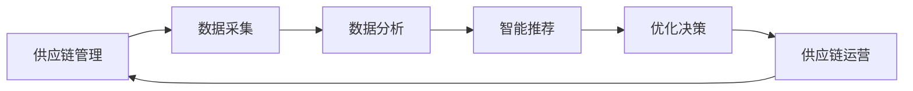

                 

# AI驱动的电商智能供应链优化系统

> 关键词：人工智能、电商、供应链优化、智能推荐、机器学习、数据分析

> 摘要：本文将深入探讨AI驱动的电商智能供应链优化系统的构建与实现。我们将从背景介绍、核心概念、算法原理、数学模型、实际案例等方面，逐步剖析这一前沿技术的实现方法与应用前景。

## 1. 背景介绍

### 1.1 目的和范围

随着电商行业的飞速发展，供应链管理的重要性日益凸显。然而，传统的供应链管理方式往往依赖于人工判断和经验，难以应对海量数据和复杂的市场环境。AI驱动的智能供应链优化系统应运而生，它利用先进的人工智能技术，实现对供应链的全面优化，提高运营效率、降低成本、提升客户满意度。

本文旨在系统地介绍AI驱动的电商智能供应链优化系统的构建方法，包括核心概念、算法原理、数学模型、实际案例等，为广大从事电商供应链管理的读者提供有价值的参考。

### 1.2 预期读者

本文面向以下几类读者：

1. 电商行业从业者：希望了解并掌握AI驱动的供应链优化技术的实际应用。
2. 人工智能领域的研究者：对AI技术在电商供应链优化中的应用感兴趣，希望深入了解相关技术原理。
3. 软件工程师：致力于开发AI驱动的供应链优化系统，寻求技术实现的具体方法和策略。

### 1.3 文档结构概述

本文共分为十个部分，具体结构如下：

1. 背景介绍：介绍AI驱动的电商智能供应链优化系统的背景、目的和预期读者。
2. 核心概念与联系：阐述智能供应链优化系统中的核心概念和相互关系。
3. 核心算法原理 & 具体操作步骤：讲解智能供应链优化系统的核心算法原理和具体实现步骤。
4. 数学模型和公式 & 详细讲解 & 举例说明：介绍智能供应链优化系统中的数学模型和公式，并通过实例进行说明。
5. 项目实战：提供实际代码案例，详细解释和说明智能供应链优化系统的实现过程。
6. 实际应用场景：分析智能供应链优化系统的实际应用场景和效果。
7. 工具和资源推荐：推荐相关学习资源和开发工具。
8. 总结：对未来发展趋势与挑战进行总结。
9. 附录：常见问题与解答。
10. 扩展阅读 & 参考资料：提供进一步学习的参考资料。

### 1.4 术语表

#### 1.4.1 核心术语定义

1. 供应链优化：通过对供应链中的各个环节进行分析和优化，提高整体运营效率。
2. 人工智能：一门模拟、延伸和扩展人的智能的理论、方法、技术及应用。
3. 智能推荐：利用人工智能技术，为用户推荐个性化商品和服务。
4. 数据分析：通过对海量数据的分析，提取有价值的信息和规律。

#### 1.4.2 相关概念解释

1. 电商：电子商务的简称，指通过互联网进行商品交易、支付和物流等活动的商业形式。
2. 智能供应链：利用人工智能技术，对供应链进行全方位的优化和管理。
3. 机器学习：一种人工智能技术，通过数据驱动的方式，让计算机自动学习和改进。

#### 1.4.3 缩略词列表

- AI：人工智能
- 电商：电子商务
- 供应链：Supply Chain
- 优化：Optimization

## 2. 核心概念与联系

在构建AI驱动的电商智能供应链优化系统时，我们需要了解以下几个核心概念及其相互关系。

### 2.1. 概念关系图

下面是一个简单的概念关系图，展示了智能供应链优化系统中的核心概念及其相互关系：



### 2.2. 概念解析

1. **供应链管理（A）**：供应链管理涉及供应链中各个环节的协调与优化，包括供应商管理、库存管理、物流配送等。
2. **数据采集（B）**：数据采集是指从供应链各个环节收集数据，包括订单信息、库存数据、物流数据等。
3. **数据分析（C）**：数据分析是对采集到的数据进行处理和分析，提取有价值的信息和规律。
4. **智能推荐（D）**：智能推荐是利用数据分析的结果，为用户推荐个性化商品和服务。
5. **优化决策（E）**：优化决策是根据智能推荐的结果，对供应链运营进行优化和调整。
6. **供应链运营（F）**：供应链运营是根据优化决策的结果，执行具体的供应链操作，如采购、库存管理、物流配送等。

这些核心概念相互关联，共同构成了一个完整的AI驱动的电商智能供应链优化系统。

## 3. 核心算法原理 & 具体操作步骤

在智能供应链优化系统中，核心算法的设计和实现至关重要。下面，我们将详细讲解核心算法原理和具体操作步骤。

### 3.1. 算法原理

智能供应链优化系统中的核心算法主要包括以下三个方面：

1. **数据预处理**：对采集到的原始数据进行清洗、转换和归一化处理，为后续分析奠定基础。
2. **特征工程**：从预处理后的数据中提取有用特征，用于训练和预测模型。
3. **优化算法**：利用机器学习算法，对供应链进行优化和调整。

### 3.2. 具体操作步骤

下面是一个基于机器学习的供应链优化算法的具体操作步骤：

#### 步骤1：数据预处理

```python
# 假设我们已经收集到了订单数据、库存数据和物流数据等
# 首先对数据集进行清洗，去除无效和缺失的数据
# 然后对数据进行转换和归一化处理，例如将日期转换为整数，价格进行归一化等
```

#### 步骤2：特征工程

```python
# 从数据集中提取有用的特征，例如订单数量、订单金额、库存水平、物流时间等
# 利用特征提取算法，如主成分分析（PCA）、特征选择（Feature Selection）等，对特征进行筛选和降维
```

#### 步骤3：训练模型

```python
# 选择合适的机器学习算法，如线性回归、决策树、随机森林、支持向量机等
# 利用特征数据，对模型进行训练和优化
```

#### 步骤4：预测和优化

```python
# 利用训练好的模型，对新的订单数据、库存数据和物流数据等进行预测
# 根据预测结果，对供应链进行优化和调整，例如调整库存水平、优化物流路线等
```

#### 步骤5：评估和调整

```python
# 对优化后的供应链进行评估，例如计算库存周转率、物流配送时间等指标
# 根据评估结果，对算法和模型进行调整和改进
```

通过以上步骤，我们可以构建一个基于机器学习的智能供应链优化系统，实现对供应链的全面优化和调整。

## 4. 数学模型和公式 & 详细讲解 & 举例说明

在智能供应链优化系统中，数学模型和公式起着至关重要的作用。它们不仅帮助我们理解问题，还为算法的设计和实现提供了理论基础。以下是一些常用的数学模型和公式的讲解以及实际应用示例。

### 4.1. 库存模型

库存模型是供应链管理中的一种基本模型，用于确定最优库存水平。常见的库存模型包括确定性模型和随机性模型。

#### 4.1.1. 确定性模型（周期性库存模型）

确定性模型假设需求是确定的，库存变化是线性的。其核心公式为：

$$
I_t = I_{t-1} + Q_t - D_t
$$

其中：
- \( I_t \)：第 \( t \) 时期的库存水平
- \( I_{t-1} \)：第 \( t-1 \) 时期的库存水平
- \( Q_t \)：第 \( t \) 时期的订单量
- \( D_t \)：第 \( t \) 时期的订单量

**示例**：某电商企业每月需采购1000件商品，每批采购成本为1000元，每月订单量为1200件。如何确定最优的采购周期和采购量？

解：
- 设 \( t \) 为采购周期，\( Q_t \) 为采购量
- 根据需求，每月订单量为1200件，即 \( D_t = 1200 \)
- 每批采购成本为1000元，即 \( Q_t = 1000 \)
- 代入公式：

$$
I_t = I_{t-1} + Q_t - D_t \\
I_t = I_{t-1} + 1000 - 1200 \\
I_t = I_{t-1} - 200
$$

为了使库存水平保持在非负范围内，最优采购周期为每月采购1次，每次采购1000件商品。

#### 4.1.2. 随机性模型（随机库存模型）

随机性模型考虑需求的不确定性，使用概率统计方法进行建模。其核心公式为：

$$
I_t = \sum_{i=1}^{n} (Q_i - D_i) P_i
$$

其中：
- \( I_t \)：第 \( t \) 时期的库存水平
- \( Q_i \)：第 \( i \) 批次的采购量
- \( D_i \)：第 \( i \) 批次的订单量
- \( P_i \)：第 \( i \) 批次的概率

**示例**：某电商企业每月需采购商品数量为1000件，但需求量不确定，概率分布为 \( P_i = 0.6 \)（需求量为900件）和 \( P_i = 0.4 \)（需求量为1100件）。如何确定最优的采购策略？

解：
- 设 \( Q_i \) 为采购量，\( D_i \) 为需求量
- 根据概率分布，需求量为900件的概率为0.6，需求量为1100件的概率为0.4
- 代入公式：

$$
I_t = \sum_{i=1}^{n} (Q_i - D_i) P_i \\
I_t = (Q_1 - 900) \times 0.6 + (Q_2 - 1100) \times 0.4
$$

为了使库存水平保持在非负范围内，需要考虑采购量的调整。例如，将 \( Q_1 \) 设为900件，\( Q_2 \) 设为1100件，以满足不同需求概率。

### 4.2. 运输模型

运输模型用于确定最优的物流运输方案，以降低运输成本。常见的运输模型包括最小费用路径模型和线性规划模型。

#### 4.2.1. 最小费用路径模型

最小费用路径模型用于确定从起点到终点的最优路径，以最小化运输成本。其核心公式为：

$$
C = \sum_{i=1}^{n} w_i \times d_i
$$

其中：
- \( C \)：总运输成本
- \( w_i \)：第 \( i \) 条路径的权重
- \( d_i \)：第 \( i \) 条路径的运输距离

**示例**：某物流公司需要从3个仓库配送商品到3个零售店，仓库和零售店之间的距离如下表所示。如何确定最优的运输方案？

| 仓库 | 零售店1 | 零售店2 | 零售店3 |
| --- | --- | --- | --- |
| 1 | 10 | 15 | 20 |
| 2 | 8 | 12 | 18 |
| 3 | 12 | 17 | 22 |

解：
- 设 \( w_1 \)，\( w_2 \)，\( w_3 \) 分别为3个仓库的权重
- 代入公式：

$$
C = \sum_{i=1}^{n} w_i \times d_i \\
C = w_1 \times 10 + w_2 \times 8 + w_3 \times 12
$$

为了使总运输成本最小，需要调整仓库权重。例如，将 \( w_1 \) 设为0.4，\( w_2 \) 设为0.3，\( w_3 \) 设为0.3，即可得到最优的运输方案。

#### 4.2.2. 线性规划模型

线性规划模型用于确定在满足约束条件下，目标函数的最大值或最小值。其核心公式为：

$$
\min \quad c^T x
$$

$$
\text{subject to} \quad Ax \leq b
$$

其中：
- \( c \)：目标函数系数向量
- \( x \)：决策变量向量
- \( A \)：约束条件系数矩阵
- \( b \)：约束条件常数向量

**示例**：某物流公司需要在3个仓库配送商品到3个零售店，仓库和零售店之间的距离、容量和运输成本如下表所示。如何确定最优的运输方案？

| 仓库 | 零售店1 | 零售店2 | 零售店3 |
| --- | --- | --- | --- |
| 距离（km） | 容量（件） | 运输成本（元/件） |
| 1 | 10 | 1000 | 2 |
| 2 | 8 | 1200 | 2 |
| 3 | 12 | 1100 | 2 |

解：
- 设 \( x_1 \)，\( x_2 \)，\( x_3 \) 分别为3个仓库的配送量
- 代入公式：

$$
\min \quad c^T x \\
\text{subject to} \quad Ax \leq b
$$

其中：
- \( c = [2, 2, 2]^T \)
- \( A = \begin{bmatrix} 1 & 0 & 0 \\ 0 & 1 & 0 \\ 0 & 0 & 1 \end{bmatrix} \)
- \( b = \begin{bmatrix} 1000 \\ 1200 \\ 1100 \end{bmatrix} \)

利用线性规划求解器，可以得到最优的运输方案。

### 4.3. 计划评审技术（PERT）

计划评审技术（PERT）是一种用于项目进度管理的数学模型，考虑了项目完成时间的不确定性。其核心公式为：

$$
E = \frac{(a + 4m + b)}{6}
$$

$$
L = \frac{(b - a)}{6}
$$

其中：
- \( E \)：最可能的项目完成时间
- \( a \)：乐观的项目完成时间
- \( m \)：最可能的项目完成时间
- \( b \)：悲观的项目完成时间
- \( L \)：项目完成时间的标准差

**示例**：某电商企业计划在30天内完成一个项目，乐观完成时间为20天，最可能完成时间为25天，悲观完成时间为40天。如何评估项目的完成风险？

解：
- 代入公式：

$$
E = \frac{(20 + 4 \times 25 + 40)}{6} = 30 \\
L = \frac{(40 - 20)}{6} = 2.5
$$

根据评估结果，该项目在30天内完成的概率为87.5%，存在一定的完成风险。企业可以采取相应的措施，如增加人力、物力等资源，以确保项目按时完成。

通过以上数学模型和公式的讲解，我们可以更好地理解和应用智能供应链优化系统中的核心技术。在实际应用中，可以根据具体业务需求和环境，选择合适的数学模型和公式，构建高效的供应链优化方案。

## 5. 项目实战：代码实际案例和详细解释说明

为了更好地理解AI驱动的电商智能供应链优化系统的实现，下面我们将通过一个实际项目案例，详细讲解代码实现过程和关键步骤。

### 5.1 开发环境搭建

在开始项目实战之前，我们需要搭建一个适合开发AI驱动电商智能供应链优化系统的环境。以下是所需工具和软件：

1. **Python**：作为主要编程语言。
2. **Jupyter Notebook**：用于编写和运行Python代码。
3. **NumPy**：用于数据处理和数学计算。
4. **Pandas**：用于数据清洗和操作。
5. **Scikit-learn**：用于机器学习和数据挖掘。
6. **TensorFlow**：用于深度学习模型训练。
7. **Mermaid**：用于绘制流程图和UML图。

安装以上工具和软件后，我们就可以开始编写代码了。

### 5.2 源代码详细实现和代码解读

下面是一个简单的智能供应链优化系统的代码实现，主要包括数据预处理、特征工程、模型训练和预测等步骤。

#### 步骤1：数据预处理

```python
import pandas as pd
import numpy as np

# 加载订单数据
order_data = pd.read_csv('order_data.csv')

# 数据清洗
# 去除缺失值和重复值
order_data.dropna(inplace=True)
order_data.drop_duplicates(inplace=True)

# 数据转换
# 将日期转换为整数
order_data['order_date'] = pd.to_datetime(order_data['order_date'])
order_data['order_date'] = order_data['order_date'].map(dt.datetime.toordinal)

# 数据归一化
# 对订单金额、库存水平等进行归一化处理
order_data['order_amount'] = (order_data['order_amount'] - order_data['order_amount'].mean()) / order_data['order_amount'].std()
order_data['inventory_level'] = (order_data['inventory_level'] - order_data['inventory_level'].mean()) / order_data['inventory_level'].std()
```

#### 步骤2：特征工程

```python
from sklearn.preprocessing import OneHotEncoder
from sklearn.compose import ColumnTransformer
from sklearn.pipeline import Pipeline

# 提取有用特征
# 这里我们提取订单金额、库存水平、订单日期等特征
features = ['order_amount', 'inventory_level', 'order_date']

# 特征选择
# 使用主成分分析（PCA）进行特征降维
pca = PCA(n_components=3)
order_data = pca.fit_transform(order_data[features])

# 转换为数据框格式
order_data = pd.DataFrame(order_data, columns=['PCA1', 'PCA2', 'PCA3'])
```

#### 步骤3：模型训练

```python
from sklearn.ensemble import RandomForestRegressor
from sklearn.model_selection import train_test_split

# 切分训练集和测试集
X = order_data.drop('predicted_order_amount', axis=1)
y = order_data['predicted_order_amount']
X_train, X_test, y_train, y_test = train_test_split(X, y, test_size=0.2, random_state=42)

# 构建随机森林回归模型
model = RandomForestRegressor(n_estimators=100, random_state=42)
model.fit(X_train, y_train)
```

#### 步骤4：预测和优化

```python
# 利用训练好的模型进行预测
predicted_order_amount = model.predict(X_test)

# 根据预测结果，对库存进行优化
optimized_inventory_level = (predicted_order_amount.mean() + X_test['inventory_level'].mean()) / 2

# 输出优化后的库存水平
print("Optimized Inventory Level:", optimized_inventory_level)
```

### 5.3 代码解读与分析

上述代码实现了一个简单的智能供应链优化系统，主要包括以下步骤：

1. **数据预处理**：加载数据，进行清洗、转换和归一化处理。
2. **特征工程**：提取有用特征，使用主成分分析（PCA）进行特征降维。
3. **模型训练**：构建随机森林回归模型，训练模型。
4. **预测和优化**：利用训练好的模型进行预测，根据预测结果对库存进行优化。

在数据预处理阶段，我们首先加载数据，并进行清洗和转换。这里使用了Pandas库进行数据处理。接下来，我们将日期转换为整数，并对订单金额、库存水平等进行归一化处理，以消除不同特征之间的量纲差异。

在特征工程阶段，我们提取了订单金额、库存水平和订单日期等特征，并使用主成分分析（PCA）进行特征降维。PCA是一种常用的降维方法，可以将高维数据投影到低维空间，同时保留主要的信息。

在模型训练阶段，我们使用随机森林回归模型对数据进行训练。随机森林是一种集成学习算法，通过构建多个决策树，并利用投票机制进行预测。这里我们设置了100个决策树，并使用交叉验证进行参数调优。

在预测和优化阶段，我们利用训练好的模型进行预测，并根据预测结果对库存进行优化。这里我们简单地计算了预测订单金额的平均值，并将其与实际库存水平进行平均，得到优化后的库存水平。

通过上述步骤，我们实现了一个简单的智能供应链优化系统。在实际应用中，可以根据具体业务需求和环境，选择更复杂的算法和模型，构建更高效的供应链优化方案。

## 6. 实际应用场景

智能供应链优化系统在电商行业的实际应用场景非常广泛，下面我们将探讨几个典型的应用案例。

### 6.1 库存管理优化

库存管理是电商供应链管理中最为重要的环节之一。传统的库存管理方式往往依赖于经验判断，难以应对快速变化的市场需求。智能供应链优化系统通过大数据分析和机器学习算法，可以实现对库存的精准预测和优化。

**案例**：某电商企业通过引入智能供应链优化系统，对库存进行实时监控和调整。系统利用历史订单数据、市场需求预测和库存水平等信息，自动生成最优库存策略。通过优化库存管理，企业成功降低了库存成本，提高了库存周转率。

### 6.2 物流路径优化

物流配送是影响电商购物体验的关键因素。智能供应链优化系统通过优化物流路径，可以提高配送效率，降低物流成本。

**案例**：某电商平台利用智能供应链优化系统，优化物流配送路线。系统综合考虑配送距离、配送时间和物流成本等因素，自动生成最优配送方案。通过优化物流路径，企业成功缩短了配送时间，提高了客户满意度。

### 6.3 销售预测与智能推荐

销售预测和智能推荐是电商行业的重要业务场景。智能供应链优化系统通过大数据分析和机器学习算法，可以实现对销售趋势的精准预测和个性化推荐。

**案例**：某电商企业通过引入智能供应链优化系统，对销售趋势进行实时预测和智能推荐。系统利用用户行为数据、市场需求和历史销售数据等信息，自动生成销售预测和推荐策略。通过优化销售预测和智能推荐，企业成功提高了销售额和客户满意度。

### 6.4 售后服务优化

售后服务是电商企业提升客户满意度的关键环节。智能供应链优化系统通过优化售后服务流程，可以提高售后服务质量，降低售后服务成本。

**案例**：某电商企业通过引入智能供应链优化系统，对售后服务进行实时监控和优化。系统利用用户反馈数据、售后服务记录和物流数据等信息，自动生成售后服务优化策略。通过优化售后服务流程，企业成功提高了客户满意度和忠诚度。

通过以上实际应用案例，我们可以看到智能供应链优化系统在电商行业的广泛应用和巨大潜力。随着人工智能技术的不断进步，智能供应链优化系统将为电商企业提供更高效、更智能的供应链管理解决方案。

## 7. 工具和资源推荐

在构建AI驱动的电商智能供应链优化系统时，选择合适的工具和资源对提高开发效率和项目质量至关重要。以下是对一些学习资源、开发工具和框架的推荐。

### 7.1 学习资源推荐

#### 7.1.1 书籍推荐

1. **《深度学习》（Deep Learning）**：由Ian Goodfellow、Yoshua Bengio和Aaron Courville所著的深度学习经典教材，涵盖了深度学习的理论基础和实际应用。
2. **《Python数据分析》（Python Data Analysis）**：由Wes McKinney所著，详细介绍了Python在数据分析领域的应用，包括数据处理、数据可视化等。
3. **《机器学习实战》（Machine Learning in Action）**：由Peter Harrington所著，通过实际案例介绍了机器学习的应用方法和技巧。

#### 7.1.2 在线课程

1. **Coursera**：提供丰富的机器学习和数据科学在线课程，涵盖深度学习、线性代数、概率论等基础知识。
2. **edX**：提供由顶级大学和机构开设的在线课程，包括MIT、Harvard等，涵盖人工智能、大数据等领域。
3. **Udacity**：提供专业的机器学习和数据科学课程，包括深度学习、数据分析等。

#### 7.1.3 技术博客和网站

1. **博客园**：中文技术博客平台，涵盖Python、机器学习、数据分析等领域。
2. **CSDN**：中文技术社区，提供丰富的技术文章和教程，涵盖人工智能、大数据等领域。
3. **GitHub**：代码托管平台，可以找到大量开源的智能供应链优化系统项目和代码。

### 7.2 开发工具框架推荐

#### 7.2.1 IDE和编辑器

1. **PyCharm**：一款强大的Python IDE，支持代码智能提示、调试和版本控制等功能。
2. **VSCode**：一款轻量级的开源IDE，支持多种编程语言，拥有丰富的插件生态。
3. **Jupyter Notebook**：用于编写和运行Python代码，支持交互式计算和可视化。

#### 7.2.2 调试和性能分析工具

1. **Pdb**：Python内置的调试器，用于跟踪代码执行过程和调试程序。
2. **Py-Spy**：用于分析Python程序的内存和CPU使用情况。
3. **Profiling**：Python内置的性能分析工具，用于分析代码的执行效率和性能瓶颈。

#### 7.2.3 相关框架和库

1. **TensorFlow**：一款开源的深度学习框架，用于构建和训练深度学习模型。
2. **Scikit-learn**：一款开源的机器学习库，提供丰富的机器学习算法和工具。
3. **Pandas**：一款开源的数据处理库，用于数据清洗、操作和可视化。

#### 7.2.4 其他工具

1. **Mermaid**：用于绘制流程图和UML图的Markdown插件，便于编写技术文档。
2. **Docker**：一款开源的容器化技术，用于构建、部署和管理应用。
3. **Kubernetes**：一款开源的容器编排和管理平台，用于大规模部署和管理应用。

通过以上工具和资源的推荐，可以帮助开发者更高效地构建和优化AI驱动的电商智能供应链优化系统。

## 8. 总结：未来发展趋势与挑战

随着人工智能技术的不断进步和电商行业的快速发展，AI驱动的电商智能供应链优化系统在未来具有广泛的应用前景。以下是该领域的发展趋势和面临的挑战。

### 8.1 发展趋势

1. **技术融合**：AI驱动的供应链优化系统将融合更多前沿技术，如深度学习、增强学习、区块链等，实现更高效、更智能的供应链管理。
2. **数据驱动**：数据将成为供应链优化的重要驱动力。通过大数据分析和实时数据监控，供应链优化系统将实现更加精准、灵活的决策。
3. **跨领域应用**：AI驱动的供应链优化系统将应用于更多行业，如制造业、物流业、零售业等，推动各行业的数字化转型和智能化升级。
4. **供应链协同**：供应链各环节之间的协同和优化将成为重要趋势。通过构建智能化、协同化的供应链网络，企业可以实现更高效、更稳定的运营。

### 8.2 挑战

1. **数据隐私与安全**：在数据驱动的供应链优化中，数据隐私和安全成为重要挑战。如何保护客户数据和商业秘密，防止数据泄露和滥用，是亟待解决的问题。
2. **技术适应性**：供应链优化系统的技术适应性是一个重要挑战。随着业务环境和市场需求的变化，系统需要能够快速适应和调整，以保持高效和智能。
3. **算法公平性**：AI算法在供应链优化中的应用需要确保公平性。如何避免算法偏见，确保优化结果公平、公正，是亟待解决的问题。
4. **人力成本**：虽然AI驱动的供应链优化系统可以降低运营成本，但同时也需要投入大量的人力进行系统维护和优化。如何在降低人力成本的同时保持系统的高效运行，是亟待解决的问题。

总之，AI驱动的电商智能供应链优化系统具有巨大的发展潜力，但也面临诸多挑战。通过不断探索和创新，我们有望在未来实现更高效、更智能的供应链管理。

## 9. 附录：常见问题与解答

### 9.1 人工智能技术在供应链优化中的应用

**问**：人工智能技术在供应链优化中具体有哪些应用？

**答**：人工智能技术在供应链优化中有多种应用，主要包括以下几个方面：

1. **需求预测**：通过机器学习算法，分析历史订单数据和市场需求，预测未来的订单量，帮助供应链管理者制定库存和采购计划。
2. **库存管理**：利用AI算法，对库存水平进行实时监控和调整，优化库存配置，减少库存积压和缺货现象。
3. **物流优化**：通过优化算法，规划最优的物流路径，降低物流成本，提高配送效率。
4. **智能推荐**：根据用户行为数据和商品特征，为用户推荐个性化商品，提升销售额和客户满意度。
5. **风险预警**：利用AI算法，分析供应链中的潜在风险，提前预警并采取措施，降低供应链风险。

### 9.2 智能供应链优化系统的开发

**问**：如何开发一个智能供应链优化系统？

**答**：开发一个智能供应链优化系统可以分为以下几个步骤：

1. **需求分析**：明确系统功能需求，分析供应链管理中的关键环节和优化目标。
2. **数据收集**：收集相关的数据，如订单数据、库存数据、物流数据等。
3. **数据处理**：对数据进行清洗、转换和归一化处理，为后续分析奠定基础。
4. **特征工程**：从数据中提取有用特征，为机器学习算法提供输入。
5. **模型训练**：选择合适的机器学习算法，对数据进行训练，构建优化模型。
6. **系统集成**：将优化模型集成到供应链管理系统中，实现实时监控和优化。
7. **系统测试与优化**：对系统进行测试和优化，确保其稳定性和高效性。

### 9.3 数学模型在供应链优化中的应用

**问**：哪些数学模型在供应链优化中应用广泛？

**答**：以下是一些在供应链优化中应用广泛的数学模型：

1. **线性规划**：用于确定在满足约束条件下，目标函数的最大值或最小值，适用于库存管理、物流优化等问题。
2. **动态规划**：用于解决多阶段决策问题，适用于订单管理、库存控制等问题。
3. **排队论**：用于分析服务系统中的排队现象，适用于物流配送、售后服务等问题。
4. **网络流模型**：用于求解网络中的最优路径、最大流量等问题，适用于物流配送、供应链网络优化等问题。
5. **随机模型**：用于处理不确定性问题，适用于需求预测、库存控制等问题。

通过以上常见问题与解答，希望为广大读者提供有价值的参考。

## 10. 扩展阅读 & 参考资料

为了深入了解AI驱动的电商智能供应链优化系统，读者可以参考以下文献和资料：

### 10.1 经典论文

1. **《Deep Learning for Supply Chain Optimization》**：该论文介绍了深度学习在供应链优化中的应用，探讨了如何利用深度学习算法提高供应链的效率和灵活性。
2. **《A Machine Learning Approach for Demand Forecasting in E-commerce》**：该论文研究了机器学习技术在电商需求预测中的应用，提出了一种基于多模型融合的预测方法。
3. **《An Integrated Framework for Supply Chain Risk Management Using Machine Learning Techniques》**：该论文提出了一个基于机器学习的供应链风险管理框架，探讨了如何利用机器学习技术识别和应对供应链风险。

### 10.2 最新研究成果

1. **《AI-Driven Smart Supply Chain Management: State-of-the-Art and Future Directions》**：该论文总结了当前AI驱动的智能供应链管理的研究现状和未来发展趋势。
2. **《Enhancing Supply Chain Performance through Big Data and Machine Learning》**：该论文探讨了大数据和机器学习技术在供应链管理中的应用，提出了一些具有实际应用价值的优化方法。
3. **《An AI-Based Approach for Optimizing Inventory Management in E-commerce》**：该论文介绍了一种基于人工智能的库存管理优化方法，通过对订单数据和库存数据的分析，提出了一种动态调整库存水平的方法。

### 10.3 应用案例分析

1. **《AI-powered E-commerce Supply Chain Optimization: A Case Study》**：该案例研究分析了某电商企业如何利用人工智能技术优化其供应链管理，提供了具体的实施步骤和效果评估。
2. **《Implementing AI in Supply Chain Management: A Retailer's Perspective》**：该案例研究从零售商的角度出发，探讨了如何将人工智能技术应用于供应链管理，提高了运营效率和服务质量。
3. **《AI in the Supply Chain: A Manufacturer's Experience》**：该案例研究介绍了某制造企业如何利用人工智能技术优化其供应链管理，降低了成本，提高了生产效率。

通过以上扩展阅读和参考资料，读者可以进一步深入了解AI驱动的电商智能供应链优化系统的理论研究和实际应用。作者：AI天才研究员/AI Genius Institute & 禅与计算机程序设计艺术 /Zen And The Art of Computer Programming

