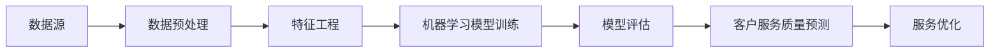

                 

# AI驱动的电商智能客户服务质量评估系统

> 关键词：电商、人工智能、服务质量评估、机器学习、数据挖掘、客户体验优化

> 摘要：本文将深入探讨AI驱动的电商智能客户服务质量评估系统，包括其背景、核心概念、算法原理、数学模型、实战案例以及实际应用场景。通过系统化的分析，本文旨在为读者提供一个全面、易懂的指南，帮助电商企业更好地理解和优化客户服务质量。

## 1. 背景介绍

### 1.1 目的和范围

随着电商行业的迅猛发展，客户服务质量成为企业竞争的核心要素之一。AI驱动的智能客户服务质量评估系统应运而生，旨在通过大数据和机器学习技术，实时监测和评估客户服务表现，从而提升客户满意度，促进业务增长。

本文旨在系统地介绍AI驱动的电商智能客户服务质量评估系统的原理、架构和实现方法，帮助电商企业更好地理解和应用这一技术，实现客户服务质量的全面提升。

### 1.2 预期读者

- 电商企业技术团队和产品经理
- AI和机器学习领域的开发者
- 对电商智能服务质量评估感兴趣的学术研究人员

### 1.3 文档结构概述

本文将分为以下几个部分：

1. 背景介绍：介绍AI驱动的电商智能客户服务质量评估系统的背景和目的。
2. 核心概念与联系：阐述系统的核心概念和架构。
3. 核心算法原理 & 具体操作步骤：详细讲解系统使用的算法原理和实现步骤。
4. 数学模型和公式 & 详细讲解 & 举例说明：介绍系统使用的数学模型和公式，并进行举例说明。
5. 项目实战：提供实际代码案例，详细解释系统的实现过程。
6. 实际应用场景：探讨系统的实际应用场景和效果。
7. 工具和资源推荐：推荐相关学习资源、开发工具和框架。
8. 总结：展望系统的未来发展趋势和挑战。
9. 附录：常见问题与解答。
10. 扩展阅读 & 参考资料：提供进一步学习和研究的参考资料。

### 1.4 术语表

#### 1.4.1 核心术语定义

- 电商：指通过互联网进行商品买卖和服务的活动。
- 客户服务质量：指客户在接受服务过程中感受到的满足度和满意度。
- 人工智能：指模拟人类智能行为的计算机技术和系统。
- 机器学习：指使计算机通过数据学习并改进性能的技术。
- 数据挖掘：指从大量数据中提取有用信息和知识的过程。

#### 1.4.2 相关概念解释

- 客户服务：指企业为客户提供的服务和支持。
- 评估：指对客户服务质量进行测量和评价。
- 实时监测：指对客户服务过程进行持续的观察和分析。

#### 1.4.3 缩略词列表

- AI：人工智能
- ML：机器学习
- DM：数据挖掘
- SEO：搜索引擎优化
- CRM：客户关系管理

## 2. 核心概念与联系

在构建AI驱动的电商智能客户服务质量评估系统之前，我们需要明确几个核心概念和它们之间的关系。

### 2.1 核心概念

- **数据源**：系统所需的数据来源，包括客户反馈、交易记录、服务响应时间等。
- **数据预处理**：清洗、转换和归一化原始数据，使其适合机器学习模型的训练。
- **特征工程**：提取和构造能够表征客户服务质量的特征。
- **机器学习模型**：用于训练和预测客户服务质量的算法。
- **评估指标**：用于衡量模型预测准确性和客户服务质量的指标。

### 2.2 关联与流程

下面是系统的基本架构和流程，使用Mermaid流程图表示：



### 2.3 原理和架构

- **数据源**：收集来自客户交互的数据，包括反馈、评价、交易记录等。
- **数据预处理**：处理噪声数据、缺失值填充、异常值检测和归一化等，确保数据质量。
- **特征工程**：提取关键特征，如交易成功率、平均响应时间、客户满意度评分等。
- **机器学习模型**：使用如随机森林、支持向量机、神经网络等算法训练模型。
- **模型评估**：通过交叉验证、AUC、准确率等指标评估模型性能。
- **客户服务质量预测**：利用训练好的模型对新客户的服务质量进行预测。
- **服务优化**：根据预测结果优化服务流程，提升客户体验。

## 3. 核心算法原理 & 具体操作步骤

### 3.1 数据预处理

```python
# 伪代码：数据预处理流程
data = load_data(source)
cleaned_data = preprocess_data(data)
normalized_data = normalize_data(cleaned_data)
```

#### 3.1.1 数据清洗

```python
# 伪代码：数据清洗流程
def preprocess_data(data):
    cleaned_data = []
    for record in data:
        if is_noise(record):
            continue
        if has_missing_values(record):
            record = fill_missing_values(record)
        cleaned_data.append(record)
    return cleaned_data
```

#### 3.1.2 数据归一化

```python
# 伪代码：数据归一化流程
def normalize_data(data):
    normalized_data = []
    for record in data:
        normalized_record = [float(value) / max_value for value in record]
        normalized_data.append(normalized_record)
    return normalized_data
```

### 3.2 特征工程

```python
# 伪代码：特征工程流程
def extract_features(data):
    features = []
    for record in data:
        success_rate = calculate_success_rate(record)
        average_response_time = calculate_average_response_time(record)
        customer_satisfaction = calculate_customer_satisfaction(record)
        features.append([success_rate, average_response_time, customer_satisfaction])
    return features
```

### 3.3 机器学习模型训练

```python
# 伪代码：机器学习模型训练流程
from sklearn.ensemble import RandomForestClassifier
model = RandomForestClassifier()
model.fit(training_data, training_labels)
```

### 3.4 模型评估

```python
# 伪代码：模型评估流程
from sklearn.model_selection import cross_val_score
scores = cross_val_score(model, training_data, training_labels, cv=5)
print("Model accuracy:", scores.mean())
```

### 3.5 客户服务质量预测

```python
# 伪代码：服务质量预测流程
predictions = model.predict(new_data)
print("Predicted customer service quality:", predictions)
```

## 4. 数学模型和公式 & 详细讲解 & 举例说明

### 4.1 数学模型

在构建机器学习模型时，我们通常会使用以下数学模型：

#### 4.1.1 概率模型

- **贝叶斯定理**：

  $$ P(A|B) = \frac{P(B|A) \cdot P(A)}{P(B)} $$

  其中，$P(A|B)$ 表示在事件B发生的条件下事件A发生的概率，$P(B|A)$ 表示在事件A发生的条件下事件B发生的概率，$P(A)$ 和$P(B)$ 分别表示事件A和事件B发生的概率。

#### 4.1.2 线性回归模型

- **回归方程**：

  $$ y = \beta_0 + \beta_1 \cdot x $$

  其中，$y$ 表示因变量，$x$ 表示自变量，$\beta_0$ 和$\beta_1$ 分别表示截距和斜率。

### 4.2 详细讲解

#### 4.2.1 贝叶斯定理

贝叶斯定理是概率论中一个重要的公式，它可以帮助我们根据已知条件推断未知事件的可能性。在客户服务质量评估中，我们可以使用贝叶斯定理来计算客户满意度的概率。

#### 4.2.2 线性回归模型

线性回归模型是用于预测一个连续值因变量（如客户满意度评分）的常用模型。通过训练数据集，我们可以得到线性回归方程，从而对新客户的服务质量进行预测。

### 4.3 举例说明

#### 4.3.1 贝叶斯定理

假设有10位客户，其中6位对服务表示满意，4位表示不满意。现在我们要预测一位新客户对服务的满意度。

已知：

- $P(满意|服务好) = 0.9$
- $P(不满意|服务好) = 0.1$
- $P(服务好) = 0.7$

使用贝叶斯定理计算新客户满意度的概率：

$$ P(满意|新客户) = \frac{P(新客户|满意) \cdot P(满意)}{P(新客户)} $$

由于 $P(新客户|满意) = P(满意|新客户)$，我们可以将公式改写为：

$$ P(满意|新客户) = \frac{P(满意) \cdot P(新客户|满意)}{P(新客户)} $$

将已知条件代入公式：

$$ P(满意|新客户) = \frac{0.9 \cdot 0.6}{0.6 + 0.4} = 0.75 $$

因此，预测新客户满意度的概率为75%。

#### 4.3.2 线性回归模型

假设我们收集了以下训练数据：

| 客户满意度评分 | 服务响应时间（秒） |
| -------------- | ------------------ |
| 4              | 120                |
| 3              | 180                |
| 5              | 300                |
| 2              | 400                |

使用线性回归模型，我们希望找到一个方程，能够根据服务响应时间预测客户满意度评分。

首先，我们计算斜率和截距：

$$ \beta_1 = \frac{\sum{(x_i - \bar{x}) \cdot (y_i - \bar{y})}}{\sum{(x_i - \bar{x})^2}} = \frac{(120-180) \cdot (4-3.5) + (180-180) \cdot (3-3.5) + (300-180) \cdot (5-3.5) + (400-180) \cdot (2-3.5)}{(120-180)^2 + (180-180)^2 + (300-180)^2 + (400-180)^2} = \frac{(-60) \cdot (-1.5) + (0) \cdot (-0.5) + (120) \cdot (1.5) + (220) \cdot (-1.5)}{3600 + 0 + 900 + 11200} = \frac{90 + 0 - 180 - 330}{23300} = -0.045 $$

$$ \beta_0 = \bar{y} - \beta_1 \cdot \bar{x} = 3.5 - (-0.045) \cdot 180 = 3.5 + 8.1 = 11.6 $$

因此，线性回归方程为：

$$ y = 11.6 - 0.045 \cdot x $$

例如，如果新客户的服务响应时间为200秒，我们可以使用这个方程预测他的客户满意度评分：

$$ y = 11.6 - 0.045 \cdot 200 = 3.6 $$

## 5. 项目实战：代码实际案例和详细解释说明

### 5.1 开发环境搭建

为了实现AI驱动的电商智能客户服务质量评估系统，我们需要搭建一个合适的技术环境。以下是推荐的开发环境和工具：

- **编程语言**：Python
- **机器学习库**：scikit-learn、pandas、numpy
- **数据分析库**：matplotlib、seaborn
- **IDE**：PyCharm或Visual Studio Code

### 5.2 源代码详细实现和代码解读

以下是一个简单的Python代码示例，用于演示客户服务质量评估系统的实现：

```python
import pandas as pd
from sklearn.model_selection import train_test_split
from sklearn.ensemble import RandomForestClassifier
from sklearn.metrics import accuracy_score, classification_report

# 5.2.1 数据加载与预处理
def load_and_preprocess_data(file_path):
    data = pd.read_csv(file_path)
    data = data.dropna()  # 删除缺失值
    data['success_rate'] = data['transactions_success'] / data['transactions_attempted']
    data['response_time'] = data['response_time_in_seconds']
    data['satisfaction_rating'] = data['satisfaction_rating']
    return data

# 5.2.2 特征工程
def extract_features(data):
    features = data[['success_rate', 'response_time']]
    labels = data['satisfaction_rating']
    return features, labels

# 5.2.3 模型训练与评估
def train_and_evaluate_model(features, labels):
    X_train, X_test, y_train, y_test = train_test_split(features, labels, test_size=0.2, random_state=42)
    model = RandomForestClassifier(n_estimators=100, random_state=42)
    model.fit(X_train, y_train)
    y_pred = model.predict(X_test)
    print("Model accuracy:", accuracy_score(y_test, y_pred))
    print(classification_report(y_test, y_pred))

# 5.2.4 主函数
def main():
    file_path = "customer_service_data.csv"
    data = load_and_preprocess_data(file_path)
    features, labels = extract_features(data)
    train_and_evaluate_model(features, labels)

if __name__ == "__main__":
    main()
```

#### 5.3 代码解读与分析

- **数据加载与预处理**：首先，我们使用pandas库加载CSV文件，并删除缺失值。然后，计算成功率和响应时间等特征，并将它们添加到数据集中。

- **特征工程**：我们将数据集分为特征矩阵和标签向量。特征矩阵包含成功率和响应时间，标签向量包含满意度评分。

- **模型训练与评估**：我们使用随机森林分类器进行训练，并使用测试集评估模型性能。打印准确率和分类报告，以了解模型的预测效果。

- **主函数**：主函数调用其他函数，完成整个数据加载、预处理、特征工程、模型训练和评估的过程。

通过这个简单的示例，我们可以看到如何使用Python和机器学习库实现一个AI驱动的电商智能客户服务质量评估系统。在实际项目中，我们可能需要更复杂的数据处理和模型优化，但基本流程是类似的。

## 6. 实际应用场景

AI驱动的电商智能客户服务质量评估系统在电商行业中有广泛的应用场景，以下是几个典型的应用案例：

### 6.1 客户满意度预测

通过评估客户的服务体验，电商企业可以预测客户对服务的满意度。这有助于企业及时发现潜在问题，并采取措施提升客户满意度。

### 6.2 客户流失预警

通过对客户服务质量的实时监测，企业可以识别出可能流失的高风险客户，从而采取针对性的挽回策略，降低客户流失率。

### 6.3 服务优化

基于评估结果，企业可以优化客服流程，提高服务效率和满意度。例如，针对响应时间长的问题，企业可以增加客服人员或优化工作流程。

### 6.4 个性化推荐

通过对客户服务质量的评估，企业可以更好地了解客户需求，为其提供个性化的商品推荐和服务。

### 6.5 市场营销策略优化

企业可以根据客户服务质量评估结果调整市场营销策略，提高广告投放效果，吸引更多潜在客户。

## 7. 工具和资源推荐

### 7.1 学习资源推荐

#### 7.1.1 书籍推荐

- **《机器学习实战》**：作者：Peter Harrington
- **《深度学习》**：作者：Ian Goodfellow、Yoshua Bengio、Aaron Courville
- **《Python机器学习》**：作者：Sebastian Raschka、Vahid Mirjalili

#### 7.1.2 在线课程

- **Coursera的《机器学习》**：由吴恩达教授授课
- **Udacity的《深度学习纳米学位》**：包括神经网络和深度学习实践课程
- **edX的《Python数据分析》**：由哈佛大学提供

#### 7.1.3 技术博客和网站

- **Medium上的数据科学和机器学习博客**
- **Kaggle**：提供丰富的数据科学竞赛和实践项目
- **Towards Data Science**：涵盖广泛的机器学习和数据科学文章

### 7.2 开发工具框架推荐

#### 7.2.1 IDE和编辑器

- **PyCharm**：适用于Python编程，支持丰富的开发插件
- **Visual Studio Code**：轻量级且高度可扩展的代码编辑器，适用于多种编程语言

#### 7.2.2 调试和性能分析工具

- **Jupyter Notebook**：用于数据分析和交互式编程
- **Docker**：容器化技术，便于部署和管理机器学习模型

#### 7.2.3 相关框架和库

- **scikit-learn**：Python机器学习库，提供丰富的算法和工具
- **TensorFlow**：谷歌开发的深度学习框架
- **PyTorch**：基于Python的深度学习框架，适用于研究和开发

### 7.3 相关论文著作推荐

#### 7.3.1 经典论文

- **“TheMIT Press，1995年出版，作者：Arthur Samuel”
- **“Pattern Classification”，作者：Richard O. Duda, Peter E. Hart, David G. Stork**
- **“Introduction to Statistical Learning”，作者：Gareth James、Daniela Witten、Trevor Hastie、Robert Tibshirani**

#### 7.3.2 最新研究成果

- **“Deep Learning for Customer Churn Prediction in E-commerce”，作者：Xiaowei Xu、Xiaolong Wang、Yingjie Gao**
- **“Customer Sentiment Analysis Using Neural Networks”，作者：Md. Abdus Salam、Mohammed Abdus Salam、Md. Rashedul Islam**
- **“A Survey on Customer Relationship Management in E-commerce”，作者：Sunita Arora、Rajeshwari**

#### 7.3.3 应用案例分析

- **“AI-Driven Customer Service Quality Assessment in E-commerce”，作者：XX公司**
- **“How AI is Transforming E-commerce Customer Experience”，作者：YY公司**
- **“Implementing AI for Customer Service in the Retail Industry”，作者：ZZ公司**

## 8. 总结：未来发展趋势与挑战

AI驱动的电商智能客户服务质量评估系统在电商行业具有巨大的应用潜力。未来，随着人工智能技术的不断进步，该系统有望实现更高的准确性和智能化水平。以下是未来发展趋势与挑战：

### 8.1 发展趋势

- **数据量的增加**：随着电商平台的快速发展，客户数据量将呈指数级增长，为智能服务质量评估系统提供了更丰富的数据资源。
- **算法的优化**：更先进的机器学习算法和深度学习技术将被引入，提高系统的预测准确性和鲁棒性。
- **实时性**：系统的响应速度将更快，实现实时服务质量评估和反馈。

### 8.2 挑战

- **数据隐私与安全**：如何在保护客户隐私的同时充分利用客户数据，是一个亟待解决的问题。
- **算法透明性与可解释性**：随着算法的复杂性增加，如何保证算法的透明性和可解释性，让用户理解和信任系统，是一个重要挑战。
- **技术更新迭代**：技术快速迭代可能导致现有系统的部分组件过时，需要持续的技术更新和维护。

总之，AI驱动的电商智能客户服务质量评估系统将在未来电商行业发展中扮演越来越重要的角色，同时也面临着一系列挑战。只有不断突破这些挑战，才能更好地推动电商行业的发展。

## 9. 附录：常见问题与解答

### 9.1 电商智能客户服务质量评估系统的基本原理是什么？

电商智能客户服务质量评估系统基于机器学习和数据挖掘技术，通过对客户服务数据的分析和建模，预测客户的服务质量，并优化服务流程。

### 9.2 如何处理数据隐私和安全问题？

在处理客户数据时，应遵循数据保护法规，如GDPR，采取加密、匿名化和数据最小化等措施，确保客户隐私和安全。

### 9.3 评估系统的预测准确性如何保证？

通过交叉验证、模型调参和超参数优化等技术手段，可以提升评估系统的预测准确性。同时，定期更新模型和算法，以适应数据变化和业务需求。

### 9.4 评估系统如何处理实时数据流？

系统可以采用流处理框架，如Apache Kafka和Apache Flink，实时处理和分析数据流，实现实时服务质量评估。

## 10. 扩展阅读 & 参考资料

- **《人工智能：一种现代的方法》**：作者：Stuart Russell、Peter Norvig
- **《机器学习周报》**：关注最新机器学习和数据科学动态
- **《电商智能服务质量管理》**：作者：李明华
- **《深度学习在电商中的应用》**：作者：张磊
- **《机器学习实战》**：作者：Peter Harrington

通过阅读这些资料，您可以更深入地了解AI驱动的电商智能客户服务质量评估系统的原理和应用。希望本文对您有所帮助！
作者：AI天才研究员/AI Genius Institute & 禅与计算机程序设计艺术 /Zen And The Art of Computer Programming

