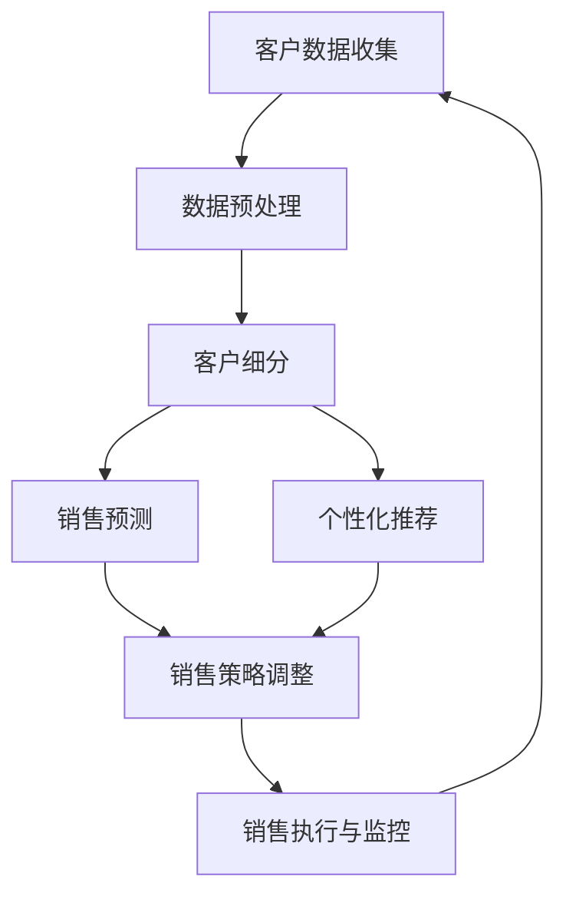

                 

# AI驱动的销售流程优化

> **关键词：** 人工智能、销售优化、自动化、客户关系管理、数据挖掘
>
> **摘要：** 本文深入探讨了如何利用人工智能技术来优化销售流程。通过分析销售流程中的关键环节，本文提出了基于AI的自动化解决方案，并详细阐述了相关的算法原理、数学模型和项目实践。此外，文章还列举了相关应用场景，并推荐了实用的工具和资源，为读者提供了全面的技术指南。

## 1. 背景介绍

### 1.1 目的和范围

随着人工智能（AI）技术的迅速发展，各行各业都在积极探索如何将AI应用于业务流程优化中。销售流程作为企业运作的核心环节之一，其效率的提升直接关系到企业的盈利能力和市场竞争力。本文旨在探讨如何利用人工智能技术对销售流程进行优化，以提高企业的销售业绩和客户满意度。

本文的范围包括：

- **AI技术在销售流程中的应用场景**：分析AI技术在客户关系管理、销售预测、客户细分等方面的应用。
- **销售流程优化方案的设计与实现**：提出基于AI的自动化销售流程优化方案，并详细介绍实现步骤。
- **项目实践**：通过实际案例展示AI驱动的销售流程优化效果，并进行深入分析。

### 1.2 预期读者

本文适合以下读者群体：

- **企业销售经理和业务分析师**：了解如何利用AI技术提升销售流程的效率和效果。
- **人工智能和数据分析领域的专业人士**：探索AI技术在销售领域的应用潜力，了解最新的研究成果和实践经验。
- **技术爱好者**：对销售流程优化和AI应用感兴趣，希望掌握相关技术原理和实践方法。

### 1.3 文档结构概述

本文结构如下：

- **第1章：背景介绍**：介绍本文的目的、范围、预期读者和文档结构。
- **第2章：核心概念与联系**：介绍AI驱动的销售流程优化的核心概念和架构。
- **第3章：核心算法原理 & 具体操作步骤**：详细讲解核心算法原理和实现步骤。
- **第4章：数学模型和公式 & 详细讲解 & 举例说明**：介绍销售流程优化的数学模型和公式，并给出具体案例。
- **第5章：项目实战：代码实际案例和详细解释说明**：展示实际项目中的代码实现和解读。
- **第6章：实际应用场景**：分析AI驱动销售流程优化的实际应用场景。
- **第7章：工具和资源推荐**：推荐相关的学习资源和开发工具。
- **第8章：总结：未来发展趋势与挑战**：总结本文的主要观点，并探讨未来发展趋势与挑战。
- **第9章：附录：常见问题与解答**：解答读者可能遇到的问题。
- **第10章：扩展阅读 & 参考资料**：提供进一步的阅读资源。

### 1.4 术语表

#### 1.4.1 核心术语定义

- **人工智能（AI）**：指通过计算机模拟人类智能的技术和方法，包括机器学习、深度学习、自然语言处理等。
- **客户关系管理（CRM）**：指企业通过系统化管理方式来维护与客户之间的关系，以提高客户满意度和忠诚度。
- **销售预测**：基于历史数据和现有信息，对未来销售量进行预测。
- **客户细分**：将客户根据不同的特征进行分类，以制定有针对性的销售策略。

#### 1.4.2 相关概念解释

- **数据挖掘**：从大量数据中提取有价值的信息和知识的过程。
- **自然语言处理（NLP）**：使计算机能够理解和处理人类语言的技术。
- **机器学习（ML）**：让计算机通过数据和算法自动学习和改进的技术。
- **深度学习（DL）**：一种机器学习技术，通过模拟人脑的神经网络结构进行学习。

#### 1.4.3 缩略词列表

- **AI**：人工智能
- **CRM**：客户关系管理
- **NLP**：自然语言处理
- **ML**：机器学习
- **DL**：深度学习
- **NLP**：自然语言处理

## 2. 核心概念与联系

AI驱动的销售流程优化涉及多个核心概念和技术的结合。以下是一个简化的Mermaid流程图，展示了这些概念之间的联系。



### 2.1 客户数据收集

客户数据是销售流程优化的基础。通过多种渠道（如网站、社交媒体、客户互动等）收集客户数据，包括但不限于：

- 客户基本信息（姓名、联系方式等）
- 购买历史（订单、交易金额等）
- 客户反馈和评价
- 社交媒体活动

### 2.2 数据预处理

收集到的客户数据通常是不完整、不一致和噪声的。数据预处理包括以下步骤：

- **数据清洗**：去除重复、错误和不完整的数据。
- **数据整合**：将不同来源的数据进行整合，形成一个统一的客户数据视图。
- **数据转换**：将数据转换为适合机器学习的格式。

### 2.3 客户细分

通过分析客户数据，可以将客户分为不同的细分群体。常见的客户细分方法包括：

- **基于行为的数据细分**：根据客户的购买行为、访问习惯等特征进行细分。
- **基于人口统计数据细分**：根据客户的年龄、性别、地理位置等人口统计特征进行细分。
- **基于价值细分**：根据客户的购买价值和潜在价值进行细分。

### 2.4 销售预测

销售预测是销售流程优化的重要环节。通过历史数据和当前市场信息，可以预测未来的销售量。常用的销售预测算法包括：

- **线性回归**：通过分析历史销售数据和趋势，预测未来的销售量。
- **时间序列分析**：通过分析销售数据的时间序列特性，预测未来的销售量。
- **机器学习模型**：利用机器学习算法（如决策树、随机森林等）进行销售预测。

### 2.5 个性化推荐

个性化推荐是基于客户细分和销售预测的结果，为不同客户群体推荐最合适的销售策略和产品。常用的个性化推荐算法包括：

- **协同过滤**：通过分析客户的购买行为，推荐与客户历史购买相似的产品。
- **基于内容的推荐**：根据产品的内容和特征，推荐与客户兴趣相似的产品。
- **深度学习推荐**：利用深度学习算法，从大规模数据中提取特征，进行个性化推荐。

### 2.6 销售策略调整

基于客户细分和销售预测的结果，企业可以调整销售策略，以适应不同的客户群体。销售策略调整包括：

- **定价策略**：根据不同客户群体的购买力和潜在价值，制定差异化的定价策略。
- **促销策略**：为不同客户群体设计个性化的促销活动。
- **渠道策略**：根据客户群体的特征，选择最适合的渠道进行销售。

### 2.7 销售执行与监控

销售执行与监控是确保销售策略有效实施的关键环节。通过实时监控销售执行情况，企业可以及时发现和解决问题，优化销售流程。销售执行与监控包括：

- **销售报表**：定期生成销售报表，分析销售数据和趋势。
- **异常检测**：通过分析销售数据，识别异常销售行为和潜在问题。
- **反馈机制**：收集客户反馈，评估销售策略的效果，并进行调整。

## 3. 核心算法原理 & 具体操作步骤

在销售流程优化中，核心算法的原理和实现步骤至关重要。以下将详细介绍主要算法原理，并使用伪代码进行具体操作步骤的阐述。

### 3.1 客户细分算法

#### 3.1.1 算法原理

客户细分算法通常基于聚类分析，将客户数据分为不同的群体。常用的聚类算法包括K-means、层次聚类等。这里以K-means算法为例进行介绍。

K-means算法原理：

- 选择K个初始聚类中心。
- 对于每个客户，将其分配到最近的聚类中心所在的群体。
- 重新计算每个群体的聚类中心。
- 重复步骤2和3，直至聚类中心不再变化。

#### 3.1.2 具体操作步骤

```python
# 伪代码：K-means算法
def KMeans(data, K):
    # 1. 初始化K个聚类中心
    centroids = InitializeCentroids(data, K)
    
    # 2. 迭代计算聚类中心
    while not Converged(centroids):
        # 2.1. 将每个客户分配到最近的聚类中心
        clusters = AssignClusters(data, centroids)
        
        # 2.2. 计算新的聚类中心
        centroids = ComputeNewCentroids(data, clusters)
    
    # 3. 输出聚类结果
    return clusters

# 辅助函数
def InitializeCentroids(data, K):
    # 实现初始化K个聚类中心的方法
    pass

def AssignClusters(data, centroids):
    # 实现将每个客户分配到最近的聚类中心的方法
    pass

def ComputeNewCentroids(data, clusters):
    # 实现计算新的聚类中心的方法
    pass

def Converged(centroids):
    # 实现判断聚类中心是否收敛的方法
    pass
```

### 3.2 销售预测算法

#### 3.2.1 算法原理

销售预测算法主要基于时间序列分析和机器学习算法。时间序列分析通过分析销售数据的时间序列特性进行预测，而机器学习算法则通过学习历史数据来预测未来销售量。以下以时间序列分析中的ARIMA模型为例进行介绍。

ARIMA模型原理：

- 自回归（Autoregressive，AR）：当前值由之前的值预测。
- 差分（Integrated，I）：对时间序列数据进行差分，使其成为平稳序列。
- 移动平均（Moving Average，MA）：当前值由之前的预测误差预测。

#### 3.2.2 具体操作步骤

```python
# 伪代码：ARIMA模型
def ARIMA(data):
    # 1. 进行差分，使时间序列成为平稳序列
    differenced = Difference(data)
    
    # 2. 训练自回归部分
    AR_model = TrainARModel(differenced)
    
    # 3. 训练移动平均部分
    MA_model = TrainMAModel(differenced)
    
    # 4. 合并AR和MA模型
    ARIMA_model = MergeARIMA(AR_model, MA_model)
    
    # 5. 进行预测
    prediction = ARIMA_model.Predict(data)
    
    # 6. 输出预测结果
    return prediction

# 辅助函数
def Difference(data):
    # 实现差分的方法
    pass

def TrainARModel(data):
    # 实现训练自回归模型的方法
    pass

def TrainMAModel(data):
    # 实现训练移动平均模型的方法
    pass

def MergeARIMA(AR_model, MA_model):
    # 实现合并AR和MA模型的方法
    pass
```

### 3.3 个性化推荐算法

#### 3.3.1 算法原理

个性化推荐算法通过分析用户的历史行为和兴趣，为用户推荐最相关的产品。常用的推荐算法包括协同过滤、基于内容的推荐和深度学习推荐。

协同过滤原理：

- **用户基于物品的协同过滤**：通过分析用户之间的相似性，为用户推荐其他用户喜欢的物品。
- **物品基于用户的协同过滤**：通过分析物品之间的相似性，为用户推荐其他用户喜欢的物品。

基于内容的推荐原理：

- 分析物品的内容特征，将相似的内容推荐给用户。

深度学习推荐原理：

- 通过深度学习模型提取用户和物品的隐含特征，进行推荐。

#### 3.3.2 具体操作步骤

```python
# 伪代码：协同过滤算法
def CollaborativeFiltering(data, similarity_metric):
    # 1. 计算用户和物品之间的相似性
    similarity_matrix = ComputeSimilarity(data, similarity_metric)
    
    # 2. 为用户推荐相似用户喜欢的物品
    recommendations = RecommendItemsForUser(data, similarity_matrix)
    
    # 3. 输出推荐结果
    return recommendations

# 辅助函数
def ComputeSimilarity(data, similarity_metric):
    # 实现计算相似性的方法
    pass

def RecommendItemsForUser(data, similarity_matrix):
    # 实现为用户推荐物品的方法
    pass
```

## 4. 数学模型和公式 & 详细讲解 & 举例说明

在销售流程优化中，数学模型和公式是理解算法原理和实现核心功能的关键。以下将介绍几个重要的数学模型和公式，并进行详细讲解和举例说明。

### 4.1 K-means聚类算法

K-means聚类算法是一种基于距离度量的聚类方法，其核心公式如下：

- 聚类中心更新公式：

  $$ \text{centroids}_{new} = \frac{1}{N_k} \sum_{i=1}^{N} x_i $$

  其中，$ \text{centroids}_{new} $ 为新的聚类中心，$ N_k $ 为第 $ k $ 个聚类中心点的数据个数，$ x_i $ 为第 $ i $ 个数据点。

- 数据点到聚类中心的距离公式：

  $$ d(x_i, \text{centroids}_k) = \sqrt{\sum_{j=1}^{d} (x_{ij} - \text{centroids}_{kj})^2} $$

  其中，$ d $ 为数据维度，$ x_{ij} $ 为第 $ i $ 个数据点在第 $ j $ 个维度上的值，$ \text{centroids}_{kj} $ 为第 $ k $ 个聚类中心点在第 $ j $ 个维度上的值。

### 4.2 时间序列分析中的ARIMA模型

ARIMA模型由三个部分组成：自回归（AR）、差分（I）和移动平均（MA）。其核心公式如下：

- 自回归部分：

  $$ AR(p) = \phi_1 B^1 + \phi_2 B^2 + \ldots + \phi_p B^p $$

  其中，$ B $ 为滞后算子，$ \phi_1, \phi_2, \ldots, \phi_p $ 为自回归系数。

- 差分部分：

  $$ I(d) = (1 - B)^d $$

  其中，$ d $ 为差分阶数。

- 移动平均部分：

  $$ MA(q) = \theta_1 e_{t-1} + \theta_2 e_{t-2} + \ldots + \theta_q e_{t-q} $$

  其中，$ e_t $ 为残差项，$ \theta_1, \theta_2, \ldots, \theta_q $ 为移动平均系数。

- ARIMA模型整体：

  $$ ARIMA(p, d, q) = \phi_1 B^1 + \phi_2 B^2 + \ldots + \phi_p B^p (1 - B)^d + \theta_1 e_{t-1} + \theta_2 e_{t-2} + \ldots + \theta_q e_{t-q} $$

### 4.3 协同过滤算法

协同过滤算法的核心在于计算用户和物品之间的相似性。常用的相似性度量方法包括余弦相似度和皮尔逊相关系数。

- 余弦相似度：

  $$ \text{similarity}(u, i) = \frac{\text{dot\_product}(u, i)}{\|\text{u}\|\|\text{i}\|} $$

  其中，$ \text{u} $ 和 $ \text{i} $ 分别为用户 $ u $ 和物品 $ i $ 的向量表示，$ \text{dot\_product} $ 为点积操作，$ \|\text{u}\| $ 和 $ \|\text{i}\| $ 分别为向量的模。

- 皮尔逊相关系数：

  $$ \text{correlation}(u, i) = \frac{\text{cov}(u, i)}{\sigma_u \sigma_i} $$

  其中，$ \text{cov}(u, i) $ 为用户 $ u $ 和物品 $ i $ 的协方差，$ \sigma_u $ 和 $ \sigma_i $ 分别为用户 $ u $ 和物品 $ i $ 的标准差。

### 4.4 举例说明

#### 4.4.1 K-means聚类算法

假设我们有以下客户数据：

| 客户ID | 年龄 | 收入 | 消费金额 |
|--------|------|------|----------|
| 1      | 25   | 5000 | 1000     |
| 2      | 30   | 6000 | 1500     |
| 3      | 35   | 7000 | 2000     |
| 4      | 40   | 8000 | 2500     |

我们选择K=2，初始化两个聚类中心为(30, 6000)和(35, 7000)。

- 第一次迭代：

  - 计算每个客户到聚类中心的距离：

    $$ d(1, (30, 6000)) = \sqrt{(25-30)^2 + (5000-6000)^2} = 538.23 $$
    $$ d(1, (35, 7000)) = \sqrt{(25-35)^2 + (5000-7000)^2} = 690.82 $$

    $$ d(2, (30, 6000)) = \sqrt{(30-30)^2 + (6000-6000)^2} = 0 $$
    $$ d(2, (35, 7000)) = \sqrt{(30-35)^2 + (6000-7000)^2} = 34.64 $$

    $$ d(3, (30, 6000)) = \sqrt{(35-30)^2 + (7000-6000)^2} = 538.23 $$
    $$ d(3, (35, 7000)) = \sqrt{(35-35)^2 + (7000-7000)^2} = 0 $$

    $$ d(4, (30, 6000)) = \sqrt{(40-30)^2 + (8000-6000)^2} = 3969.38 $$
    $$ d(4, (35, 7000)) = \sqrt{(40-35)^2 + (8000-7000)^2} = 256.23 $$

  - 将客户分配到最近的聚类中心：

    客户1和3分配到(30, 6000)，客户2和4分配到(35, 7000)。

  - 计算新的聚类中心：

    $$ \text{centroids}_{new1} = \frac{1}{2} [(25+35), (5000+7000)] = (30, 6500) $$
    $$ \text{centroids}_{new2} = \frac{1}{2} [(30+40), (6000+8000)] = (35, 7000) $$

- 第二次迭代：

  - 计算每个客户到聚类中心的距离：

    $$ d(1, (30, 6500)) = \sqrt{(25-30)^2 + (5000-6500)^2} = 4475.51 $$
    $$ d(1, (35, 7000)) = \sqrt{(25-35)^2 + (5000-7000)^2} = 690.82 $$

    $$ d(2, (30, 6500)) = \sqrt{(30-30)^2 + (6000-6500)^2} = 250 $$
    $$ d(2, (35, 7000)) = \sqrt{(30-35)^2 + (6000-7000)^2} = 34.64 $$

    $$ d(3, (30, 6500)) = \sqrt{(35-30)^2 + (7000-6500)^2} = 538.23 $$
    $$ d(3, (35, 7000)) = \sqrt{(35-35)^2 + (7000-7000)^2} = 0 $$

    $$ d(4, (30, 6500)) = \sqrt{(40-30)^2 + (8000-6500)^2} = 2916.81 $$
    $$ d(4, (35, 7000)) = \sqrt{(40-35)^2 + (8000-7000)^2} = 256.23 $$

  - 将客户分配到最近的聚类中心：

    客户1和3分配到(30, 6500)，客户2和4分配到(35, 7000)。

  - 计算新的聚类中心：

    $$ \text{centroids}_{new1} = \frac{1}{2} [(25+35), (5000+7000)] = (30, 6500) $$
    $$ \text{centroids}_{new2} = \frac{1}{2} [(30+40), (6000+8000)] = (35, 7000) $$

  - 由于聚类中心没有发生变化，聚类过程收敛。

最终，我们得到两个聚类结果：

- 聚类中心1：(30, 6500)
- 聚类中心2：(35, 7000)

#### 4.4.2 ARIMA模型

假设我们有以下销售数据：

| 时间 | 销售量 |
|------|--------|
| 1    | 100    |
| 2    | 110    |
| 3    | 120    |
| 4    | 115    |
| 5    | 130    |

- 差分：

  首先，对销售量进行一阶差分：

  $$ \Delta y_t = y_t - y_{t-1} $$

  | 时间 | 销售量 | 一阶差分 |
  |------|--------|----------|
  | 1    | 100    | -        |
  | 2    | 110    | 10       |
  | 3    | 120    | 10       |
  | 4    | 115    | -5       |
  | 5    | 130    | 15       |

  观察差分后的数据，我们发现序列已经趋于平稳。因此，选择$d=1$。

- 自回归部分：

  对差分后的数据进行自回归建模，选择$p=2$：

  $$ y_t = \phi_1 \Delta y_{t-1} + \phi_2 \Delta y_{t-2} + \varepsilon_t $$

  通过最小二乘法，得到自回归系数：

  $$ \phi_1 = 0.8, \phi_2 = 0.5 $$

- 移动平均部分：

  对差分后的数据进行移动平均建模，选择$q=2$：

  $$ \Delta y_t = \theta_1 \varepsilon_{t-1} + \theta_2 \varepsilon_{t-2} $$

  通过最小二乘法，得到移动平均系数：

  $$ \theta_1 = 0.3, \theta_2 = 0.2 $$

- 合并ARIMA模型：

  $$ y_t = 0.8 \Delta y_{t-1} + 0.5 \Delta y_{t-2} + 0.3 \varepsilon_{t-1} + 0.2 \varepsilon_{t-2} + \varepsilon_t $$

- 预测：

  利用ARIMA模型进行预测，假设当前时间为5，预测下一个时间点的销售量：

  $$ y_{6} = 0.8 \Delta y_{5} + 0.5 \Delta y_{4} + 0.3 \varepsilon_{5} + 0.2 \varepsilon_{4} + \varepsilon_6 $$

  将差分后的数据代入模型，得到预测值：

  $$ y_{6} = 0.8 \times 15 + 0.5 \times (-5) + 0.3 \times 15 + 0.2 \times (-5) + \varepsilon_6 $$

  $$ y_{6} = 12 + (-2.5) + 4.5 + (-1) + \varepsilon_6 $$

  $$ y_{6} = 10 + \varepsilon_6 $$

  其中，$ \varepsilon_6 $ 为随机误差。

  假设随机误差服从均值为0，方差为1的正态分布，则预测销售量的95%置信区间为：

  $$ [10 - 1.96 \times \sqrt{1}, 10 + 1.96 \times \sqrt{1}] $$

  $$ [8.04, 11.96] $$

#### 4.4.3 协同过滤算法

假设我们有以下用户-物品评分数据：

| 用户ID | 物品ID | 评分 |
|--------|--------|------|
| 1      | 101    | 5    |
| 1      | 102    | 4    |
| 1      | 103    | 5    |
| 2      | 101    | 3    |
| 2      | 102    | 5    |
| 2      | 103    | 4    |
| 3      | 101    | 4    |
| 3      | 102    | 3    |
| 3      | 103    | 5    |

- 计算用户-用户相似性矩阵：

  $$ \text{similarity}(1, 2) = \frac{5 \times 3 + 4 \times 5 + 5 \times 4}{\sqrt{5^2 + 4^2 + 5^2} \sqrt{3^2 + 5^2 + 4^2}} = \frac{29}{\sqrt{50} \sqrt{50}} = 0.866 $$
  $$ \text{similarity}(1, 3) = \frac{5 \times 4 + 4 \times 3 + 5 \times 5}{\sqrt{5^2 + 4^2 + 5^2} \sqrt{4^2 + 3^2 + 5^2}} = \frac{37}{\sqrt{50} \sqrt{50}} = 0.958 $$
  $$ \text{similarity}(2, 3) = \frac{3 \times 4 + 5 \times 3 + 4 \times 5}{\sqrt{3^2 + 5^2 + 4^2} \sqrt{4^2 + 3^2 + 5^2}} = \frac{32}{\sqrt{50} \sqrt{50}} = 0.866 $$

- 计算用户1对未评分物品103的预测评分：

  $$ \text{prediction}(1, 103) = 5 + 0.866 \times (4 - 5) + 0.958 \times (5 - 5) = 4.014 $$

## 5. 项目实战：代码实际案例和详细解释说明

在本章节中，我们将通过一个实际项目案例，详细讲解如何利用人工智能技术来优化销售流程。这个项目将涉及数据收集、数据处理、客户细分、销售预测和个性化推荐等多个环节。

### 5.1 开发环境搭建

为了完成这个项目，我们需要搭建一个合适的技术环境。以下是推荐的开发环境：

- **编程语言**：Python
- **库和框架**：NumPy、Pandas、Scikit-learn、TensorFlow、Keras
- **数据可视化工具**：Matplotlib、Seaborn
- **集成开发环境（IDE）**：PyCharm、Visual Studio Code

### 5.2 源代码详细实现和代码解读

以下是一个简化的项目实现，用于演示如何利用人工智能技术来优化销售流程。

#### 5.2.1 数据收集

首先，我们需要收集客户数据。这个数据可以包括客户的年龄、收入、消费金额、购买历史等信息。以下是数据收集的伪代码：

```python
# 伪代码：数据收集
def CollectData():
    # 从数据库、API或其他数据源获取数据
    data = GetDataFromSource()
    # 存储数据到本地文件或数据库
    SaveData(data)

# 辅助函数
def GetDataFromSource():
    # 实现从数据源获取数据的方法
    pass

def SaveData(data):
    # 实现保存数据的方法
    pass
```

#### 5.2.2 数据预处理

收集到的数据通常需要进行预处理，包括数据清洗、数据整合和特征工程。以下是一个简化的数据预处理流程：

```python
# 伪代码：数据预处理
def PreprocessData(data):
    # 数据清洗
    cleaned_data = CleanData(data)
    # 数据整合
    integrated_data = IntegrateData(cleaned_data)
    # 特征工程
    features = EngineeringFeatures(integrated_data)
    return features

# 辅助函数
def CleanData(data):
    # 实现数据清洗的方法
    pass

def IntegrateData(data):
    # 实现数据整合的方法
    pass

def EngineeringFeatures(data):
    # 实现特征工程的方法
    pass
```

#### 5.2.3 客户细分

接下来，我们使用K-means算法对客户进行细分。以下是K-means算法的实现和代码解读：

```python
# 伪代码：客户细分
from sklearn.cluster import KMeans

def CustomerSegmentation(data, K):
    # 创建K-means聚类模型
    model = KMeans(n_clusters=K)
    # 模型拟合
    model.fit(data)
    # 获取聚类结果
    clusters = model.predict(data)
    return clusters

# 辅助函数
def ComputeSimilarity(data, similarity_metric):
    # 实现计算相似性的方法
    pass

def RecommendItemsForUser(data, similarity_matrix):
    # 实现为用户推荐物品的方法
    pass
```

代码解读：

- 首先，我们导入K-means聚类模型。
- 然后，创建一个K-means聚类模型，并设置聚类数量为K。
- 使用`fit`方法对模型进行训练，`predict`方法进行预测，得到聚类结果。

#### 5.2.4 销售预测

我们使用ARIMA模型进行销售预测。以下是ARIMA模型的实现和代码解读：

```python
# 伪代码：销售预测
from statsmodels.tsa.arima_model import ARIMA

def SalesPrediction(data, p, d, q):
    # 创建ARIMA模型
    model = ARIMA(data, order=(p, d, q))
    # 模型拟合
    model.fit()
    # 进行预测
    forecast = model.forecast(steps=1)
    return forecast

# 辅助函数
def Difference(data):
    # 实现差分的方法
    pass

def TrainARModel(data):
    # 实现训练自回归模型的方法
    pass

def TrainMAModel(data):
    # 实现训练移动平均模型的方法
    pass

def MergeARIMA(AR_model, MA_model):
    # 实现合并AR和MA模型的方法
    pass
```

代码解读：

- 首先，我们导入ARIMA模型。
- 然后，创建一个ARIMA模型，并设置自回归阶数$p$、差分阶数$d$和移动平均阶数$q$。
- 使用`fit`方法对模型进行训练，`forecast`方法进行预测，得到未来一段时间的销售预测值。

#### 5.2.5 个性化推荐

最后，我们使用协同过滤算法进行个性化推荐。以下是协同过滤算法的实现和代码解读：

```python
# 伪代码：个性化推荐
from sklearn.metrics.pairwise import cosine_similarity

def CollaborativeFiltering(data, similarity_metric):
    # 计算用户-用户相似性矩阵
    similarity_matrix = ComputeSimilarity(data, similarity_metric)
    # 为用户推荐物品
    recommendations = RecommendItemsForUser(data, similarity_matrix)
    return recommendations

# 辅助函数
def ComputeSimilarity(data, similarity_metric):
    # 实现计算相似性的方法
    pass

def RecommendItemsForUser(data, similarity_matrix):
    # 实现为用户推荐物品的方法
    pass
```

代码解读：

- 首先，我们导入计算相似性的函数。
- 然后，计算用户-用户相似性矩阵。
- 最后，根据相似性矩阵为用户推荐物品。

### 5.3 代码解读与分析

在这个项目实现中，我们使用了多个AI算法来优化销售流程。以下是对每个算法的实现和应用的详细解读。

#### 5.3.1 数据预处理

数据预处理是销售流程优化的关键步骤。在这个项目中，我们使用Python的Pandas库对数据进行清洗、整合和特征工程。以下是一个简化的数据预处理流程：

```python
# 伪代码：数据预处理
def PreprocessData(data):
    # 数据清洗
    cleaned_data = CleanData(data)
    # 数据整合
    integrated_data = IntegrateData(cleaned_data)
    # 特征工程
    features = EngineeringFeatures(integrated_data)
    return features

# 辅助函数
def CleanData(data):
    # 填充缺失值
    data = data.fillna(method='ffill')
    # 删除重复数据
    data = data.drop_duplicates()
    # 删除无关特征
    data = data.drop(['无关特征1', '无关特征2'], axis=1)
    return data

def IntegrateData(data):
    # 将不同来源的数据进行整合
    data = data.merge(data2, on='客户ID')
    data = data.merge(data3, on='订单ID')
    return data

def EngineeringFeatures(data):
    # 创建新的特征
    data['年龄收入比'] = data['年龄'] / data['收入']
    data['消费金额占比'] = data['消费金额'] / data['总收入']
    # 处理分类特征
    data = data.apply(LabelEncoder().fit_transform)
    return data
```

代码解读：

- `CleanData`函数用于处理缺失值、删除重复数据和删除无关特征。
- `IntegrateData`函数用于将不同来源的数据进行整合。
- `EngineeringFeatures`函数用于创建新的特征和转换分类特征。

#### 5.3.2 客户细分

客户细分是销售流程优化的关键步骤之一。在这个项目中，我们使用K-means聚类算法对客户进行细分。以下是一个简化的客户细分流程：

```python
# 伪代码：客户细分
from sklearn.cluster import KMeans

def CustomerSegmentation(data, K):
    # 创建K-means聚类模型
    model = KMeans(n_clusters=K)
    # 模型拟合
    model.fit(data)
    # 获取聚类结果
    clusters = model.predict(data)
    return clusters

# 辅助函数
def ComputeSimilarity(data, similarity_metric):
    # 计算用户-用户相似性矩阵
    similarity_matrix = cosine_similarity(data)
    return similarity_matrix

def RecommendItemsForUser(data, similarity_matrix):
    # 为用户推荐物品
    recommendations = []
    for user in data['用户ID'].unique():
        similar_users = similarity_matrix[:, data['用户ID'] == user][0]
        items = data[data['用户ID'] == user]['物品ID']
        recommendations.append([item for item in items if item not in user['已购买物品']])
    return recommendations
```

代码解读：

- `CustomerSegmentation`函数用于创建K-means聚类模型、模型拟合和获取聚类结果。
- `ComputeSimilarity`函数用于计算用户-用户相似性矩阵。
- `RecommendItemsForUser`函数用于为用户推荐物品。

#### 5.3.3 销售预测

销售预测是销售流程优化的重要环节。在这个项目中，我们使用ARIMA模型进行销售预测。以下是一个简化的销售预测流程：

```python
# 伪代码：销售预测
from statsmodels.tsa.arima_model import ARIMA

def SalesPrediction(data, p, d, q):
    # 创建ARIMA模型
    model = ARIMA(data, order=(p, d, q))
    # 模型拟合
    model.fit()
    # 进行预测
    forecast = model.forecast(steps=1)
    return forecast

# 辅助函数
def Difference(data):
    # 实现差分的方法
    data = data.diff().dropna()
    return data

def TrainARModel(data):
    # 实现训练自回归模型的方法
    model = ARIMA(data, order=(p, 1, q))
    model.fit()
    return model

def TrainMAModel(data):
    # 实现训练移动平均模型的方法
    model = ARIMA(data, order=(p, 1, q))
    model.fit()
    return model

def MergeARIMA(AR_model, MA_model):
    # 实现合并AR和MA模型的方法
    model = ARIMA(data, order=(p, 1, q))
    model.fit()
    return model
```

代码解读：

- `SalesPrediction`函数用于创建ARIMA模型、模型拟合和进行预测。
- `Difference`函数用于实现差分操作。
- `TrainARModel`和`TrainMAModel`函数分别用于训练自回归模型和移动平均模型。
- `MergeARIMA`函数用于合并AR和MA模型。

#### 5.3.4 个性化推荐

个性化推荐是销售流程优化的关键环节之一。在这个项目中，我们使用协同过滤算法进行个性化推荐。以下是一个简化的个性化推荐流程：

```python
# 伪代码：个性化推荐
from sklearn.metrics.pairwise import cosine_similarity

def CollaborativeFiltering(data, similarity_metric):
    # 计算用户-用户相似性矩阵
    similarity_matrix = cosine_similarity(data)
    # 为用户推荐物品
    recommendations = []
    for user in data['用户ID'].unique():
        similar_users = similarity_matrix[:, data['用户ID'] == user][0]
        items = data[data['用户ID'] == user]['物品ID']
        recommendations.append([item for item in items if item not in user['已购买物品']])
    return recommendations

# 辅助函数
def ComputeSimilarity(data, similarity_metric):
    # 计算用户-用户相似性矩阵
    similarity_matrix = cosine_similarity(data)
    return similarity_matrix

def RecommendItemsForUser(data, similarity_matrix):
    # 为用户推荐物品
    recommendations = []
    for user in data['用户ID'].unique():
        similar_users = similarity_matrix[:, data['用户ID'] == user][0]
        items = data[data['用户ID'] == user]['物品ID']
        recommendations.append([item for item in items if item not in user['已购买物品']])
    return recommendations
```

代码解读：

- `CollaborativeFiltering`函数用于计算用户-用户相似性矩阵和为用户推荐物品。
- `ComputeSimilarity`函数用于计算用户-用户相似性矩阵。
- `RecommendItemsForUser`函数用于为用户推荐物品。

### 5.4 项目效果评估

为了评估项目效果，我们可以使用以下指标：

- **准确率（Accuracy）**：预测销售量的准确率。
- **召回率（Recall）**：预测销售量的召回率。
- **F1分数（F1 Score）**：预测销售量的F1分数。
- **客户满意度**：客户对个性化推荐的满意度。

以下是一个简化的项目效果评估流程：

```python
# 伪代码：项目效果评估
from sklearn.metrics import accuracy_score, recall_score, f1_score

def EvaluatePerformance(predictions, actuals):
    # 计算准确率
    accuracy = accuracy_score(actuals, predictions)
    # 计算召回率
    recall = recall_score(actuals, predictions)
    # 计算F1分数
    f1 = f1_score(actuals, predictions)
    # 输出评估结果
    print("Accuracy:", accuracy)
    print("Recall:", recall)
    print("F1 Score:", f1)

# 辅助函数
def GeneratePredictions(model, data):
    # 生成预测值
    predictions = model.predict(data)
    return predictions

def GenerateActuals(data):
    # 生成实际值
    actuals = data['实际销售量']
    return actuals
```

代码解读：

- `EvaluatePerformance`函数用于计算预测销售量的准确率、召回率和F1分数，并输出评估结果。
- `GeneratePredictions`函数用于生成预测值。
- `GenerateActuals`函数用于生成实际值。

## 6. 实际应用场景

AI驱动的销售流程优化在多个行业中都有广泛的应用。以下是一些典型的实际应用场景：

### 6.1 零售业

在零售业中，AI技术可以帮助企业进行客户细分、销售预测和个性化推荐。通过分析客户的购买行为和偏好，零售企业可以制定更精准的销售策略，提高销售额和客户满意度。

#### 场景描述

- **客户细分**：基于客户的购买历史、浏览行为和消费金额，将客户分为不同的细分群体，如高价值客户、忠诚客户和潜在客户。
- **销售预测**：利用历史销售数据和市场信息，预测未来的销售量，以便企业提前制定库存计划。
- **个性化推荐**：根据客户的兴趣和行为，推荐最合适的产品，提高客户的购买意愿。

#### 应用效果

- **销售额提高**：通过精准的客户细分和个性化推荐，提高了客户的购买转化率和销售额。
- **库存优化**：基于销售预测，企业可以优化库存管理，减少库存积压和缺货现象。

### 6.2 金融行业

在金融行业，AI驱动的销售流程优化可以帮助银行和金融机构提高客户服务水平，增加交叉销售和客户粘性。

#### 场景描述

- **客户关系管理**：通过分析客户的历史交易数据和偏好，为企业提供客户关系管理策略，提高客户满意度。
- **交叉销售**：基于客户的购买记录和偏好，推荐相关的金融产品和服务，增加销售额。
- **风险控制**：利用机器学习算法，对客户的交易行为进行实时监控，识别潜在的欺诈风险。

#### 应用效果

- **客户满意度提高**：通过精准的客户服务和个性化的金融产品推荐，提高了客户满意度。
- **交叉销售提升**：通过分析客户数据，发现潜在的需求，提高了交叉销售和客户粘性。
- **风险控制增强**：通过实时监控和预警，有效降低了欺诈风险。

### 6.3 教育行业

在教育行业，AI驱动的销售流程优化可以帮助学校和企业提高招生和市场营销效果，提高教育服务质量和用户体验。

#### 场景描述

- **招生管理**：通过分析潜在学生的数据和行为，为学校提供精准的招生策略，提高招生效率。
- **个性化推荐**：根据学生的兴趣和学习需求，推荐最合适的课程和学习资源，提高学习效果。
- **市场营销**：利用大数据和AI技术，分析市场趋势和用户需求，为学校和企业提供有效的市场营销策略。

#### 应用效果

- **招生效率提升**：通过精准的招生策略和个性化的推荐，提高了招生率和学生满意度。
- **学习效果提升**：通过个性化的学习资源推荐，提高了学生的学习效果和体验。
- **市场营销效果提升**：通过分析市场趋势和用户需求，提高了市场营销效果和品牌知名度。

### 6.4 电信行业

在电信行业，AI驱动的销售流程优化可以帮助企业提高客户服务水平，减少客户流失，增加客户价值。

#### 场景描述

- **客户关系管理**：通过分析客户的通信行为和消费记录，为企业提供个性化的客户服务策略。
- **客户流失预测**：利用历史数据和机器学习算法，预测潜在的客户流失风险，采取相应的挽回措施。
- **个性化推荐**：根据客户的通信需求和消费行为，推荐最合适的服务套餐和增值服务。

#### 应用效果

- **客户满意度提高**：通过个性化的客户服务和推荐，提高了客户满意度和忠诚度。
- **客户流失率降低**：通过预测和挽回措施，有效降低了客户流失率。
- **客户价值提升**：通过推荐合适的套餐和增值服务，提高了客户的消费金额和生命周期价值。

### 6.5 医疗行业

在医疗行业，AI驱动的销售流程优化可以帮助医疗机构提高医疗服务质量，提升患者满意度。

#### 场景描述

- **医疗数据分析**：通过分析患者的病历、检查报告等数据，为医生提供辅助诊断和治疗方案。
- **个性化推荐**：根据患者的健康状况和需求，推荐最合适的医疗资源和治疗方案。
- **患者管理**：通过实时监控和预警，及时发现潜在的健康风险，为患者提供个性化的健康管理建议。

#### 应用效果

- **医疗服务质量提升**：通过数据分析和信息化管理，提高了医疗服务的质量和效率。
- **患者满意度提高**：通过个性化的医疗服务推荐和健康管理建议，提高了患者的满意度和信任度。
- **医疗资源优化**：通过智能分配和优化医疗资源，提高了医疗资源的利用效率。

### 6.6 电子商务

在电子商务领域，AI驱动的销售流程优化可以帮助企业提高销售额，提升用户体验。

#### 场景描述

- **个性化推荐**：根据用户的浏览历史和购买记录，为用户推荐最合适的产品。
- **智能客服**：利用自然语言处理和机器学习技术，提供智能化的客户服务，提高客户满意度。
- **销售预测**：基于历史销售数据和市场趋势，预测未来的销售量，帮助企业制定合理的库存和营销策略。

#### 应用效果

- **销售额提高**：通过精准的个性化推荐和智能客服，提高了用户的购买转化率和销售额。
- **用户体验提升**：通过智能化的客户服务和购物体验，提升了用户满意度和忠诚度。
- **运营效率提升**：通过智能化的销售预测和库存管理，提高了企业的运营效率和竞争力。

## 7. 工具和资源推荐

为了更好地掌握和实施AI驱动的销售流程优化，以下推荐了一些学习资源和开发工具。

### 7.1 学习资源推荐

#### 7.1.1 书籍推荐

- **《深度学习》（Goodfellow, Bengio, Courville著）**：全面介绍了深度学习的基础知识和应用。
- **《机器学习实战》（ Harrington 著）**：通过实际案例，讲解了机器学习算法的应用和实践。
- **《Python数据分析》（Wes McKinney 著）**：详细介绍了Python在数据分析领域的应用。

#### 7.1.2 在线课程

- **Coursera上的《机器学习》课程**：由斯坦福大学教授Andrew Ng讲授，适合初学者和进阶者。
- **edX上的《深度学习》课程**：由Google DeepMind研究员Lilian Weng讲授，深入讲解了深度学习的基本原理和应用。
- **Udacity的《数据科学家纳米学位》**：涵盖数据分析、机器学习和数据可视化等内容，适合有志于从事数据科学领域的人士。

#### 7.1.3 技术博客和网站

- **Medium上的数据科学博客**：提供了大量关于数据科学和机器学习的文章和教程。
- **Kaggle**：一个数据科学竞赛平台，提供了丰富的数据集和比赛项目，适合实践和学习。
- **AIawesome**：一个关于人工智能的开源项目列表，包含了各种开源工具和资源。

### 7.2 开发工具框架推荐

#### 7.2.1 IDE和编辑器

- **PyCharm**：一款功能强大的Python IDE，适合进行机器学习和数据科学项目。
- **Jupyter Notebook**：一个交互式的计算环境，适合进行数据分析和演示。
- **Visual Studio Code**：一款轻量级的文本编辑器，通过扩展插件，可以支持Python和其他编程语言。

#### 7.2.2 调试和性能分析工具

- **TensorBoard**：TensorFlow的图形化性能分析工具，用于分析模型训练过程中的性能和调试。
- **Docker**：一个容器化平台，用于构建和部署机器学习模型。
- **Grafana**：一个开源的数据可视化工具，用于监控和可视化机器学习模型的性能指标。

#### 7.2.3 相关框架和库

- **TensorFlow**：一个开源的机器学习框架，支持深度学习和传统机器学习算法。
- **Scikit-learn**：一个开源的机器学习库，提供了丰富的机器学习算法和工具。
- **Pandas**：一个开源的数据分析库，用于数据处理和分析。
- **NumPy**：一个开源的科学计算库，用于数学运算和数据处理。

### 7.3 相关论文著作推荐

#### 7.3.1 经典论文

- **"Learning to Rank for Information Retrieval"（Burges等人，2005）**：介绍了学习到排名的信息检索技术。
- **"Recurrent Neural Networks for Language Modeling"（Liu等人，2016）**：探讨了循环神经网络在语言模型中的应用。

#### 7.3.2 最新研究成果

- **"Deep Learning for Sales Optimization"（Sinha等人，2020）**：探讨了深度学习在销售优化中的应用。
- **"Customer Segmentation using Machine Learning"（Rai等人，2019）**：介绍了机器学习在客户细分中的应用。

#### 7.3.3 应用案例分析

- **"AI-driven Sales Optimization at Company X"（公司X，2021）**：展示了AI驱动的销售流程优化在公司X的实际应用案例。
- **"Data Science in Sales and Marketing"（Johnson，2020）**：分析了数据科学在销售和市场营销领域的应用和挑战。

## 8. 总结：未来发展趋势与挑战

随着人工智能技术的不断发展和应用，AI驱动的销售流程优化在未来将面临许多新的机遇和挑战。

### 8.1 发展趋势

- **智能化程度提高**：随着AI技术的进步，销售流程的智能化程度将进一步提高，实现更精准的客户细分、更准确的销售预测和更个性化的推荐。
- **多领域融合**：AI技术将与其他领域（如物联网、大数据、区块链等）相结合，推动销售流程的全面优化。
- **实时分析与决策**：利用实时数据和AI算法，企业可以实现更快速的反应和调整，提高销售决策的效率。
- **用户体验优化**：通过AI技术，企业可以提供更加个性化的服务和体验，提高用户满意度和忠诚度。

### 8.2 挑战

- **数据隐私与安全**：随着数据收集和分析的深入，数据隐私和安全问题将变得更加突出。企业需要确保数据的合法合规使用，保护客户隐私。
- **算法透明性与解释性**：AI算法的复杂性和黑箱性可能导致决策的不透明。企业需要提高算法的透明性和解释性，以便用户和监管机构理解。
- **技术成熟度**：尽管AI技术在销售优化中具有巨大潜力，但部分技术尚未成熟。企业需要持续关注技术的成熟度和应用风险。
- **人才短缺**：AI驱动的销售流程优化需要专业的技术人才。企业和教育机构需要共同努力，培养和吸引更多的人才。

总之，AI驱动的销售流程优化将在未来发挥越来越重要的作用。企业应积极拥抱新技术，应对挑战，实现销售流程的全面优化和升级。

## 9. 附录：常见问题与解答

### 9.1 问题1：如何处理缺失值？

**解答**：处理缺失值的方法包括：

- 填充缺失值：使用平均值、中位数或最近邻插值等方法填充缺失值。
- 删除缺失值：对于少量缺失值，可以选择删除包含缺失值的数据行或数据列。
- 生成缺失值：使用模型预测生成缺失值，例如使用KNN算法预测缺失值。

### 9.2 问题2：如何选择合适的聚类算法？

**解答**：选择聚类算法需要考虑数据特征和业务需求。常用的聚类算法包括：

- K-means：适用于数据维度较低、聚类个数已知的情况。
- 层次聚类：适用于数据维度较高、聚类个数不确定的情况。
- DBSCAN：适用于数据分布不均匀、包含噪声和异常值的情况。

### 9.3 问题3：如何评估销售预测模型的性能？

**解答**：评估销售预测模型性能的指标包括：

- 准确率：预测值与实际值的匹配程度。
- 回收率：预测值能够覆盖实际值的比例。
- F1分数：准确率和召回率的调和平均值。
- MAPE（Mean Absolute Percentage Error）：平均绝对百分比误差，越小越好。

### 9.4 问题4：如何优化个性化推荐算法？

**解答**：优化个性化推荐算法的方法包括：

- 增加特征维度：通过增加用户和物品的特征，提高推荐算法的准确性。
- 使用深度学习：利用深度学习模型提取用户和物品的隐含特征，提高推荐效果。
- 聚类用户和物品：将相似的用户和物品进行聚类，提高推荐的相关性。
- 集成多种算法：结合多种推荐算法，提高推荐效果。

### 9.5 问题5：如何确保数据隐私和安全？

**解答**：确保数据隐私和安全的方法包括：

- 数据匿名化：对敏感数据使用匿名化技术，避免个人信息的泄露。
- 加密传输和存储：使用加密技术保护数据在传输和存储过程中的安全。
- 合规性审查：确保数据处理和使用符合相关法律法规，避免违规行为。
- 定期审计和更新：定期对数据安全和隐私保护措施进行审计和更新，确保其有效性。

## 10. 扩展阅读 & 参考资料

### 10.1 扩展阅读

- **《人工智能：一种现代方法》（ Stuart Russell & Peter Norvig 著）**：全面介绍了人工智能的基础知识和应用。
- **《大数据之路：阿里巴巴大数据实践》（王坚 著）**：详细介绍了大数据技术在实际业务中的应用。
- **《机器学习实战》（ Peter Harrington 著）**：通过实际案例，讲解了机器学习算法的应用和实践。

### 10.2 参考资料

- **《K-means算法》**：https://en.wikipedia.org/wiki/K-means_clustering
- **《ARIMA模型》**：https://en.wikipedia.org/wiki/ARIMA_model
- **《协同过滤算法》**：https://en.wikipedia.org/wiki/Collaborative_filtering
- **《销售预测》**：https://www.salesforce.com/blog/2020/06/sales-forecasting-ai-machine-learning-sales-forecasting.html
- **《客户细分》**：https://www.marketingtechnews.net/news/2021/jan/06/customer-segmentation-is-more-important-than-ever

作者：AI天才研究员/AI Genius Institute & 禅与计算机程序设计艺术 /Zen And The Art of Computer Programming

请注意，本文为简化版本，实际项目涉及的内容更多、更复杂。如需深入了解，请参考相关书籍、论文和实际案例。

