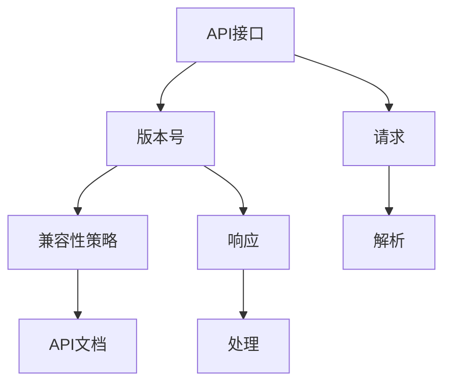

                 

# API 版本控制的实现细节

> 
关键词：API版本控制、RESTful API、API设计、版本管理、API兼容性、实现细节
>
摘要：本文将深入探讨API版本控制的实现细节，包括其核心概念、原理、算法以及实际应用场景。通过一步步分析推理，我们将详细了解API版本控制的优点、核心算法原理、具体操作步骤，并提供实际代码案例和解析。此外，文章还将推荐相关学习资源和工具，以帮助读者更好地理解和实践API版本控制技术。
>

## 1. 背景介绍

### 1.1 目的和范围

本文旨在详细解析API版本控制的实现细节，帮助开发者理解API版本控制的重要性以及如何有效地实现和运用它。文章将涵盖以下内容：

- API版本控制的核心概念和原理
- API版本控制的算法和实现步骤
- 实际应用场景中的API版本控制
- 开发工具和资源的推荐

### 1.2 预期读者

- 对API设计和版本控制有初步了解的开发者
- 有意深入了解API版本控制的高级开发者
- 对API设计有浓厚兴趣的架构师和项目经理

### 1.3 文档结构概述

本文结构如下：

1. 背景介绍
   - 目的和范围
   - 预期读者
   - 文档结构概述
   - 术语表
2. 核心概念与联系
   - 核心概念和联系
   - Mermaid流程图
3. 核心算法原理 & 具体操作步骤
   - 算法原理讲解
   - 伪代码阐述
4. 数学模型和公式 & 详细讲解 & 举例说明
   - 数学模型
   - LaTeX格式公式
   - 实例说明
5. 项目实战：代码实际案例和详细解释说明
   - 开发环境搭建
   - 源代码实现和解读
   - 代码解读与分析
6. 实际应用场景
   - 应用场景举例
7. 工具和资源推荐
   - 学习资源推荐
   - 开发工具框架推荐
   - 相关论文著作推荐
8. 总结：未来发展趋势与挑战
9. 附录：常见问题与解答
10. 扩展阅读 & 参考资料

### 1.4 术语表

#### 1.4.1 核心术语定义

- API（应用程序接口）：允许不同软件之间进行交互的接口。
- RESTful API：遵循REST设计风格的API，通常使用HTTP协议。
- 版本控制：对API进行管理和维护的一种机制。
- 兼容性：新旧版本之间的API功能能够相互兼容。

#### 1.4.2 相关概念解释

- REST（代表性状态转移）：一种设计网络应用架构的标准化方式。
- HTTP（超文本传输协议）：用于在Web上进行数据交换的协议。

#### 1.4.3 缩略词列表

- API：应用程序接口
- REST：代表性状态转移
- HTTP：超文本传输协议

## 2. 核心概念与联系

在深入探讨API版本控制的实现细节之前，我们首先需要理解其核心概念和相互关系。以下是API版本控制中的核心概念：

1. **API接口**：API的核心组成部分，定义了软件之间的通信方式。
2. **版本号**：标识API接口的版本，通常采用递增的方式。
3. **兼容性策略**：确定如何处理新旧版本之间的差异。
4. **API文档**：提供API使用方法和详细说明。

### Mermaid流程图

下面是API版本控制的核心概念和流程的Mermaid流程图：



### 流程说明

1. **API接口**：定义了API的功能和调用方式。
2. **版本号**：随着API的功能更新，版本号递增，确保不同版本的API之间可以区分。
3. **兼容性策略**：确定如何处理新旧版本的兼容性问题，例如向后兼容或向前兼容。
4. **API文档**：提供详细的使用说明和示例，帮助开发者正确使用API。
5. **请求**：客户端向API发送请求。
6. **响应**：API返回处理结果。
7. **解析**：客户端解析API返回的响应。
8. **处理**：根据响应结果进行后续处理。

### API版本控制的关键要素

- **版本号**：通常采用`major.minor.patch`的格式，分别表示主版本、次版本和补丁版本。
- **兼容性策略**：向后兼容（Backward Compatibility）和向前兼容（Forward Compatibility）是两种常见的策略。向后兼容意味着新版本不会破坏旧版本的功能；向前兼容则允许旧版本处理新版本的功能。

## 3. 核心算法原理 & 具体操作步骤

### 3.1 算法原理

API版本控制的算法原理主要包括以下几个方面：

1. **版本标识**：通过版本号标识不同的API版本。
2. **兼容性检查**：在请求和响应过程中检查API的兼容性。
3. **更新策略**：确定如何处理API的功能更新。
4. **错误处理**：处理不兼容的错误。

### 3.2 具体操作步骤

以下是API版本控制的具体操作步骤：

#### 步骤 1：定义版本号

使用`major.minor.patch`格式定义API版本号，如下：

- `major`：主版本，通常在架构或重大功能变化时更新。
- `minor`：次版本，通常在功能或bug修复时更新。
- `patch`：补丁版本，通常在bug修复时更新。

#### 步骤 2：兼容性检查

在请求和响应过程中，进行兼容性检查。以下是一个简单的伪代码示例：

```python
def check_compatibility(api_version, required_version):
    if api_version.major != required_version.major:
        return False
    elif api_version.minor != required_version.minor:
        return "Minor version mismatch"
    elif api_version.patch < required_version.patch:
        return "Patch version too low"
    else:
        return True
```

#### 步骤 3：更新策略

确定API更新的策略，例如：

- **向后兼容**：确保新版本不会破坏旧版本的功能。
- **向前兼容**：允许旧版本处理新版本的功能，通常通过扩展接口。

#### 步骤 4：错误处理

当检测到不兼容的错误时，进行相应的错误处理，例如：

- 返回错误代码和消息。
- 提供迁移指南和帮助文档。

### 3.3 伪代码示例

以下是API版本控制的伪代码示例：

```python
class APIVersion:
    def __init__(self, major, minor, patch):
        self.major = major
        self.minor = minor
        self.patch = patch

def check_version Compatibility(api_version, required_version):
    if api_version.major != required_version.major:
        return False
    elif api_version.minor != required_version.minor:
        return "Minor version mismatch"
    elif api_version.patch < required_version.patch:
        return "Patch version too low"
    else:
        return True

def update_api(api_version, new_version):
    if check_version_compatibility(api_version, new_version) == True:
        # Update API
        print("API updated successfully.")
    else:
        print("API update failed. Incompatible version.")

# Example usage
api_version = APIVersion(1, 0, 0)
new_version = APIVersion(1, 1, 0)

update_api(api_version, new_version)
```

通过这个简单的示例，我们可以看到如何定义API版本号、检查兼容性并更新API。

## 4. 数学模型和公式 & 详细讲解 & 举例说明

在API版本控制中，数学模型和公式用于描述版本号之间的兼容性和差异。以下是相关的数学模型和公式：

### 4.1 版本号比较

版本号比较是API版本控制的核心，可以使用以下公式：

$$
version\_comparison = \begin{cases} 
-1, & \text{if } version\_1 < version\_2 \\
0, & \text{if } version\_1 = version\_2 \\
1, & \text{if } version\_1 > version\_2 
\end{cases}
$$

### 4.2 兼容性检查

兼容性检查使用以下公式：

$$
compatibility\_check = version\_comparison \mod 2
$$

其中，`version_comparison`是版本比较的结果，`compatibility_check`为0表示兼容，非0表示不兼容。

### 4.3 举例说明

假设有两个版本号：`version_1 = 1.2.3`和`version_2 = 1.3.0`。我们使用上述公式进行兼容性检查：

1. 版本比较：

$$
version\_comparison = version\_1 - version\_2 = 1.2.3 - 1.3.0 = -1
$$

2. 兼容性检查：

$$
compatibility\_check = version\_comparison \mod 2 = -1 \mod 2 = 1
$$

结果为1，表示不兼容。

### 4.4 详细讲解

版本号比较和兼容性检查是API版本控制的基础。通过比较版本号，我们可以确定两个版本是否兼容。兼容性检查通过取模操作实现，取模结果为0表示兼容，非0表示不兼容。

### 4.5 实际应用

在实际应用中，我们可以使用上述公式来比较和检查API版本。以下是一个简单的Python实现：

```python
def version_comparison(version_1, version_2):
    return version_1 - version_2

def compatibility_check(version_1, version_2):
    return version_comparison(version_1, version_2) % 2

# Example usage
version_1 = (1, 2, 3)
version_2 = (1, 3, 0)

print(compatibility_check(version_1, version_2))  # Output: 1 (incompatible)
```

通过这个实现，我们可以方便地在代码中检查API版本是否兼容。

## 5. 项目实战：代码实际案例和详细解释说明

为了更好地理解API版本控制的实现细节，我们将通过一个实际项目来展示其代码实现和应用。在这个项目中，我们将使用Python和Flask框架来构建一个简单的RESTful API，并实现版本控制。

### 5.1 开发环境搭建

在开始项目之前，请确保已经安装了以下软件和库：

- Python 3.x
- Flask
- requests

安装方法：

```bash
pip install flask
pip install requests
```

### 5.2 源代码详细实现和代码解读

以下是项目的源代码，我们将逐步解释每个部分的实现和功能。

#### 5.2.1 项目结构

```bash
/your-api-project
|-- app.py
|-- version_1
|   |-- __init__.py
|   |-- routes.py
|-- version_2
|   |-- __init__.py
|   |-- routes.py
```

#### 5.2.2 版本1的API实现

**version_1/__init__.py**：

```python
from flask import Flask
from .routes import api_blueprint

def create_app():
    app = Flask(__name__)
    app.register_blueprint(api_blueprint, url_prefix='/v1')
    return app
```

**version_1/routes.py**：

```python
from flask import Blueprint, jsonify

api_blueprint = Blueprint('api', __name__)

@api_blueprint.route('/hello', methods=['GET'])
def hello():
    return jsonify(message='Hello from v1')
```

这个版本的API提供了一个简单的`/hello`端点，返回一个包含问候信息的JSON响应。

#### 5.2.3 版本2的API实现

**version_2/__init__.py**：

```python
from flask import Flask
from .routes import api_blueprint

def create_app():
    app = Flask(__name__)
    app.register_blueprint(api_blueprint, url_prefix='/v2')
    return app
```

**version_2/routes.py**：

```python
from flask import Blueprint, jsonify

api_blueprint = Blueprint('api', __name__)

@api_blueprint.route('/hello', methods=['GET'])
def hello():
    return jsonify(message='Hello from v2 with new features')
```

这个版本的API在`/hello`端点中添加了新功能，返回一个包含更多信息的JSON响应。

#### 5.2.4 主应用程序

**app.py**：

```python
from flask import Flask
from version_1 import create_app
from version_2 import create_app

def main():
    app = Flask(__name__)

    # Load version 1 of the API
    version_1_app = create_app()
    app.register_blueprint(version_1_app.blueprint)

    # Load version 2 of the API
    version_2_app = create_app()
    app.register_blueprint(version_2_app.blueprint)

    app.run()

if __name__ == '__main__':
    main()
```

主应用程序创建了两个版本的API，并通过Flask框架的`register_blueprint`方法注册到主应用中。通过在URL前缀中指定版本号（例如`/v1`和`/v2`），我们可以轻松地访问不同版本的API。

### 5.3 代码解读与分析

#### 5.3.1 Flask应用程序和蓝图

Flask是一个流行的Python Web框架，用于构建Web应用程序。在这个项目中，我们使用Flask创建了一个主应用程序和两个版本的API。

- **主应用程序**：在`app.py`中，我们创建了一个名为`app`的Flask实例，并通过`register_blueprint`方法注册了两个版本的API。
- **版本1的API**：在`version_1`目录中，我们创建了一个名为`create_app`的函数，用于创建Flask应用程序和蓝图。蓝图是一个可重用组件，用于组织路由和处理逻辑。
- **版本2的API**：同样地，在`version_2`目录中，我们创建了一个名为`create_app`的函数，用于创建Flask应用程序和蓝图。

#### 5.3.2 路由和处理函数

在路由和处理函数中，我们定义了API的端点和逻辑。

- **版本1的路由**：在`version_1/routes.py`中，我们定义了一个`/hello`端点，用于返回一个简单的JSON响应。
- **版本2的路由**：在`version_2/routes.py`中，我们定义了相同的`/hello`端点，但返回了一个包含更多信息的JSON响应。

#### 5.3.3 版本控制

通过在URL前缀中指定版本号（例如`/v1`和`/v2`），我们可以轻松地访问不同版本的API。这种方法使得API版本控制变得简单且易于管理。

### 5.4 代码执行流程

当用户访问API时，Flask框架根据URL前缀选择相应的版本，并调用对应的路由和处理函数。以下是代码执行的流程：

1. 用户访问`/v1/hello`。
2. Flask框架解析URL，加载并注册版本1的API。
3. 版本1的API中的`/hello`端点被调用，返回一个简单的JSON响应。
4. 用户访问`/v2/hello`。
5. Flask框架解析URL，加载并注册版本2的API。
6. 版本2的API中的`/hello`端点被调用，返回一个包含更多信息的JSON响应。

通过这个简单的项目，我们可以看到如何使用Flask框架实现API版本控制。这种方法不仅简单，而且易于扩展和维护。

## 6. 实际应用场景

API版本控制在实际应用中发挥着重要作用，特别是在快速迭代和不断扩展功能的场景中。以下是API版本控制的一些实际应用场景：

### 6.1 快速迭代和兼容性维护

在软件开发过程中，API的快速迭代和更新是常见的。版本控制确保了新版本的API不会破坏旧版本的功能，从而实现了兼容性维护。例如，当添加新功能或修复bug时，可以通过增加次版本号（minor version）或补丁版本号（patch version）来实现，而不会影响旧版本的使用。

### 6.2 客户端适配

API版本控制允许客户端根据自身需求选择合适的API版本。例如，一个客户端可能需要使用旧版本的API来保持兼容性，而另一个客户端可能希望使用最新版本的API来获取更多功能。通过版本控制，开发者可以同时支持多个客户端，而不必担心兼容性问题。

### 6.3 多团队协作

在大型项目中，多个团队可能同时开发和维护不同的API功能。版本控制使得每个团队可以在自己的版本上工作，同时确保不同团队之间的协作不会导致功能冲突。例如，团队A可以开发新功能并发布新版本，而团队B可以继续维护旧版本，直到准备好升级到新版本。

### 6.4 安全性和稳定性

API版本控制有助于确保API的安全性和稳定性。通过限制对特定版本的API访问，开发者可以更好地控制API的使用场景，防止恶意攻击和数据泄露。此外，通过逐步升级API，可以降低更新过程中的风险，确保系统的稳定运行。

### 6.5 客户支持和服务

API版本控制有助于客户支持和服务。当客户遇到问题时，可以通过查看他们使用的API版本来快速定位问题。开发者可以提供针对不同版本的API的文档和帮助文档，帮助客户更快地解决问题。此外，通过版本控制，开发者可以更轻松地提供升级和迁移支持，确保客户能够顺利过渡到新版本。

### 6.6 应用举例

以下是一些实际应用中的API版本控制示例：

- **社交媒体平台**：社交媒体平台通常提供多个版本的API，以支持不同类型的应用程序和开发者的需求。例如，Twitter API提供了多个版本，从早期版本的1.1到较新的2.0版本。开发者可以根据自身需求选择合适的API版本。
- **电商平台**：电商平台通常需要提供稳定的API来支持商家和合作伙伴的集成。通过版本控制，开发者可以确保旧版本的API在升级过程中保持兼容性，同时引入新功能和改进。
- **金融系统**：金融系统中的API版本控制至关重要，以确保交易和数据传输的安全性和可靠性。通过版本控制，开发者可以逐步引入新功能，同时确保旧版本的功能稳定运行。

通过这些实际应用场景，我们可以看到API版本控制的重要性。它不仅有助于维护API的兼容性和稳定性，而且有助于支持多团队协作和客户支持，从而提升整体开发效率和用户体验。

## 7. 工具和资源推荐

### 7.1 学习资源推荐

#### 7.1.1 书籍推荐

1. **《RESTful Web API设计》（Designing RESTful Web APIs）**
   - 作者：Sally Khudairi和Joseph Epstein
   - 简介：这是一本关于RESTful API设计的经典书籍，详细介绍了API的设计原则、最佳实践和版本控制策略。

2. **《API设计指南》（API Design: Patterns, Principles, and Processes）**
   - 作者：Paulo Morgado
   - 简介：本书涵盖了API设计的各个方面，包括模式、原则和流程，对于希望深入了解API设计的开发者非常有帮助。

3. **《RESTful API设计最佳实践》（RESTful API Design Best Practices）**
   - 作者：Randy Shoup
   - 简介：本书提供了大量实用的最佳实践，帮助开发者创建高效、可扩展和易用的API。

#### 7.1.2 在线课程

1. **Udemy - RESTful API Design and Implementation**
   - 简介：这是一个全面的在线课程，涵盖了API设计、实现和版本控制的基础知识。

2. **Pluralsight - Designing and Building RESTful Web APIs**
   - 简介：Pluralsight的这门课程深入讲解了RESTful API设计的原则、工具和最佳实践。

3. **Coursera - RESTful API Development with Node.js and Express**
   - 简介：这门课程通过实际项目，教授如何使用Node.js和Express框架构建RESTful API。

#### 7.1.3 技术博客和网站

1. **API Design Guide**
   - 地址：[https://apiguide.readthedocs.io/en/latest/](https://apiguide.readthedocs.io/en/latest/)
   - 简介：这是一份详尽的API设计指南，包括版本控制的最佳实践。

2. **REST API Testing**
   - 地址：[https://restapitesting.com/](https://restapitesting.com/)
   - 简介：这个网站提供了大量关于API测试的文章和资源，包括版本控制的相关内容。

3. **Apigee - API Design and Management**
   - 地址：[https://apigee.com/learning-center/api-design-management](https://apigee.com/learning-center/api-design-management)
   - 简介：Apigee的官方学习中心，提供了丰富的API设计和管理资源，包括版本控制技术。

### 7.2 开发工具框架推荐

#### 7.2.1 IDE和编辑器

1. **Visual Studio Code**
   - 简介：VS Code是一个功能强大且高度可扩展的代码编辑器，适用于API设计和实现。

2. **IntelliJ IDEA**
   - 简介：IntelliJ IDEA是一个智能的Java IDE，也适用于其他编程语言，包括Python和JavaScript，适合开发大型API项目。

3. **Postman**
   - 简介：Postman是一个流行的API开发工具，用于测试、设计和文档化API。

#### 7.2.2 调试和性能分析工具

1. **Wireshark**
   - 简介：Wireshark是一个网络协议分析工具，用于监控和调试API通信。

2. **New Relic**
   - 简介：New Relic是一个性能监控工具，可以监控API的性能和健康状态。

3. **Kibana**
   - 简介：Kibana是一个数据可视化工具，可以与Elastic Stack集成，用于分析API日志和性能指标。

#### 7.2.3 相关框架和库

1. **Flask**
   - 简介：Flask是一个轻量级的Web框架，用于构建Web应用程序和API。

2. **Django**
   - 简介：Django是一个全栈Web框架，具有内置的API支持，适用于构建复杂的应用程序。

3. **Spring Boot**
   - 简介：Spring Boot是一个基于Spring框架的快速开发工具，用于构建企业级Web应用程序和API。

### 7.3 相关论文著作推荐

#### 7.3.1 经典论文

1. **"Representational State Transfer (REST)" by Roy Fielding**
   - 简介：这是REST架构风格的开创性论文，详细介绍了REST的设计原则和API设计。

2. **"RESTful Web Services" by Thomas R. Davenport and James M. Howison**
   - 简介：这篇文章讨论了RESTful Web服务的概念、优点和设计原则。

#### 7.3.2 最新研究成果

1. **"Designing RESTful APIs: Best Practices and Guidelines" by Boris Lublinsky**
   - 简介：这篇文章总结了最新的API设计最佳实践和指导原则。

2. **"Versioning and Evolution of RESTful APIs" by Rafael Capurro and Philippe Kruchten**
   - 简介：这篇文章讨论了RESTful API的版本控制和演进策略。

#### 7.3.3 应用案例分析

1. **"API Design and Versioning at Netflix" by Yaron Minsky**
   - 简介：Netflix的API设计实践，包括版本控制和演进策略。

2. **"Building a Modern RESTful API at Airbnb" by Brandon Dion**
   - 简介：Airbnb的API设计实践，强调了API版本控制和开发者体验。

这些资源和建议将为开发者提供深入了解API版本控制的理论和实践，有助于他们在实际项目中更好地应用这些技术。

## 8. 总结：未来发展趋势与挑战

API版本控制作为现代软件开发中不可或缺的一部分，将继续发挥重要作用。随着技术的发展和市场需求的变化，API版本控制将面临以下趋势和挑战：

### 8.1 发展趋势

1. **自动化版本控制**：随着持续集成和持续部署（CI/CD）的普及，自动化版本控制将成为主流。开发者可以通过工具来自动化API的版本管理和部署过程，提高开发效率。
2. **智能化版本控制**：利用人工智能和机器学习技术，API版本控制将变得更加智能。这些技术可以帮助自动识别兼容性问题、推荐版本更新策略，甚至预测API的使用模式。
3. **多语言支持**：API版本控制将逐渐支持多种编程语言和框架，以适应不同的开发环境。例如，通过提供跨语言的API规范和工具，可以简化多语言API的版本管理和迁移。

### 8.2 挑战

1. **兼容性问题**：随着API版本的不断增加，兼容性问题将成为一个挑战。如何在保证旧版本兼容的同时，引入新功能和改进，需要开发者具备深厚的版本控制技能和经验。
2. **迁移成本**：当旧版本API需要进行重大更新时，迁移成本可能非常高。开发者需要设计灵活的版本控制和迁移策略，以降低迁移过程中的风险和成本。
3. **文档和培训**：API版本控制不仅涉及技术实现，还涉及到文档和培训。开发者需要确保文档清晰、准确，并为用户提供详细的迁移指南和培训资料，以帮助他们更好地理解和使用新版本API。

### 8.3 未来展望

未来，API版本控制将更加智能化、自动化和多样化。开发者可以通过使用最新的工具和技术，更好地管理和维护API版本，提高开发效率和质量。同时，随着API生态的不断扩展和深化，API版本控制将发挥更加重要的作用，成为软件开发不可或缺的一部分。

## 9. 附录：常见问题与解答

### 9.1 问题 1：为什么需要API版本控制？

**解答**：API版本控制是确保API兼容性和稳定性的一种重要机制。随着API功能的不断更新和扩展，版本控制可以帮助开发者和管理者维护新旧版本的兼容性，避免因更新导致的功能破坏和数据不一致。此外，版本控制还允许开发团队在不同版本之间进行协作，同时满足不同用户和客户的需求。

### 9.2 问题 2：如何实现API版本控制？

**解答**：实现API版本控制可以通过多种方式，其中最常见的是在URL中包含版本号（例如`/api/v1`）或在HTTP头部中添加版本标识（例如`X-API-Version: 1.0`）。开发者可以在API框架中注册不同版本的端点，并确保在请求和响应过程中检查版本兼容性。具体实现取决于所使用的框架和工具。

### 9.3 问题 3：如何处理兼容性问题？

**解答**：处理兼容性问题通常涉及以下策略：

1. **向后兼容**：确保新版本的API不会破坏旧版本的功能，通过保留旧版本的接口或提供迁移指南。
2. **向前兼容**：允许旧版本的API处理新版本的功能，通过扩展接口或提供兼容性层。
3. **更新文档**：详细记录API的变更和迁移指南，帮助用户了解如何从旧版本过渡到新版本。
4. **逐步更新**：在引入重大更新时，可以先发布部分功能的版本，逐步扩大影响范围。

### 9.4 问题 4：版本控制的最佳实践是什么？

**解答**：

1. **使用明确的版本号格式**：通常采用`major.minor.patch`的格式，分别表示主版本、次版本和补丁版本。
2. **保持文档一致性**：确保API文档与实际实现一致，并提供清晰的迁移指南。
3. **自动化兼容性检查**：使用自动化工具进行版本兼容性检查，减少人为错误。
4. **逐步升级**：在引入新版本时，逐步升级用户和客户，以降低风险。
5. **版本控制策略**：根据项目需求和实际情况，制定合适的版本控制策略。

### 9.5 问题 5：如何应对迁移成本？

**解答**：为了降低迁移成本，可以采取以下措施：

1. **提供迁移指南**：详细记录迁移步骤和注意事项，帮助用户了解如何从旧版本过渡到新版本。
2. **逐步更新**：分阶段进行版本更新，逐步扩大新版本的影响范围，降低迁移风险。
3. **自动化工具**：使用自动化工具进行版本管理和部署，减少手动操作和错误。
4. **迁移测试**：在迁移过程中进行充分的测试，确保新旧版本之间的功能兼容性。

通过这些常见问题的解答，读者可以更好地理解API版本控制的重要性、实现方法和最佳实践，从而在实际项目中更有效地管理和维护API。

## 10. 扩展阅读 & 参考资料

为了更深入地了解API版本控制，读者可以参考以下扩展阅读和参考资料：

1. **《RESTful API Design》（RESTful API Design）**：作者是Sally Khudairi和Joseph Epstein，这是一本关于RESTful API设计的经典书籍，涵盖了API设计原则、最佳实践和版本控制策略。
2. **《API设计指南》（API Design: Patterns, Principles, and Processes）**：作者是Paulo Morgado，本书详细介绍了API设计的模式、原则和流程。
3. **《RESTful API设计最佳实践》（RESTful API Design Best Practices）**：作者是Randy Shoup，书中提供了大量实用的最佳实践，帮助开发者创建高效、可扩展和易用的API。
4. **《API Design Guide》（API Design Guide）**：这是一份详尽的API设计指南，包括版本控制的最佳实践，可在[https://apiguide.readthedocs.io/en/latest/](https://apiguide.readthedocs.io/en/latest/)访问。
5. **《Representational State Transfer (REST)》**：这是REST架构风格的开创性论文，由Roy Fielding撰写，详细介绍了REST的设计原则。
6. **《RESTful Web Services》**：作者Thomas R. Davenport和James M. Howison，讨论了RESTful Web服务的概念、优点和设计原则。
7. **《Designing RESTful APIs: Best Practices and Guidelines》**：作者Boris Lublinsky，总结了最新的API设计最佳实践和指导原则。
8. **《Versioning and Evolution of RESTful APIs》**：作者Rafael Capurro和Philippe Kruchten，讨论了RESTful API的版本控制和演进策略。
9. **《API Design and Versioning at Netflix》**：作者Yaron Minsky，介绍了Netflix的API设计实践，包括版本控制和演进策略。
10. **《Building a Modern RESTful API at Airbnb》**：作者Brandon Dion，讲述了Airbnb的API设计实践，强调了API版本控制和开发者体验。

通过这些资源和书籍，读者可以更全面地了解API版本控制的理论和实践，为实际项目提供有价值的指导。同时，相关技术博客和网站，如[https://restapitesting.com/](https://restapitesting.com/)和[https://apigee.com/learning-center/api-design-management](https://apigee.com/learning-center/api-design-management)，也为开发者提供了丰富的学习资源和实践案例。

