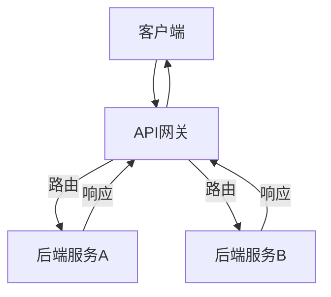

                 

# API 网关的详细功能

> 关键词：API网关、功能、架构、算法、应用场景、最佳实践

> 摘要：本文将深入探讨API网关的核心功能、架构设计和实际应用，通过一步步分析推理的方式，帮助读者全面理解API网关的技术原理和最佳实践，从而更好地应用于现代软件开发中。

## 1. 背景介绍

### 1.1 目的和范围

本文旨在详细介绍API网关的核心功能、设计原则和实际应用，帮助读者全面掌握API网关的技术要点，从而在软件开发中更好地应用这一关键组件。本文将涵盖以下主要内容：

- API网关的概念和定义
- API网关的架构设计
- API网关的核心功能
- API网关的实际应用场景
- API网关的最佳实践

### 1.2 预期读者

本文适合以下读者群体：

- 软件开发工程师
- 系统架构师
- API开发者
- 对API网关技术有兴趣的IT从业者

### 1.3 文档结构概述

本文结构如下：

- 1. 背景介绍
  - 1.1 目的和范围
  - 1.2 预期读者
  - 1.3 文档结构概述
  - 1.4 术语表
- 2. 核心概念与联系
  - 2.1 API网关的概念
  - 2.2 API网关与微服务架构的联系
  - 2.3 Mermaid流程图展示
- 3. 核心算法原理 & 具体操作步骤
  - 3.1 API请求处理流程
  - 3.2 路由和转发机制
  - 3.3 负载均衡算法
- 4. 数学模型和公式 & 详细讲解 & 举例说明
  - 4.1 服务响应时间模型
  - 4.2 负载均衡的数学公式
  - 4.3 举例说明
- 5. 项目实战：代码实际案例和详细解释说明
  - 5.1 开发环境搭建
  - 5.2 源代码详细实现和代码解读
  - 5.3 代码解读与分析
- 6. 实际应用场景
  - 6.1 API管理和聚合
  - 6.2 安全性和认证
  - 6.3 性能优化
- 7. 工具和资源推荐
  - 7.1 学习资源推荐
  - 7.2 开发工具框架推荐
  - 7.3 相关论文著作推荐
- 8. 总结：未来发展趋势与挑战
- 9. 附录：常见问题与解答
- 10. 扩展阅读 & 参考资料

### 1.4 术语表

#### 1.4.1 核心术语定义

- API网关（API Gateway）：一个网络服务，用于管理进入应用程序的所有API请求，提供路由、转换、聚合、安全和监控等功能。
- 微服务架构（Microservices Architecture）：一种软件开发方法，通过将应用程序拆分为一组独立的、可复用和服务化的组件，每个组件独立部署、独立维护和扩展。
- 路由（Routing）：根据请求的URL或其他条件，将请求转发到相应的后端服务。
- 负载均衡（Load Balancing）：将请求均匀地分配到多个服务器，以实现高可用性和性能优化。
- API聚合（API Aggregation）：将多个API的响应聚合为一个统一的响应。

#### 1.4.2 相关概念解释

- 服务网格（Service Mesh）：一种基础设施层，用于处理服务之间的通信、监控和流量管理。与API网关不同的是，服务网格专注于内部服务通信，而不是外部API请求。
- API文档（API Documentation）：描述API接口、功能和使用方法的文档。对于开发者而言，API文档是理解和使用API的关键。
- API版本管理（API Versioning）：对API接口进行版本管理，以支持新功能的引入和旧功能的兼容。

#### 1.4.3 缩略词列表

- API网关（API Gateway）
- REST（Representational State Transfer）
- HTTP（Hypertext Transfer Protocol）
- JSON（JavaScript Object Notation）
- YAML（YAML Ain't Markup Language）
- TLS（Transport Layer Security）
- SSL（Secure Sockets Layer）

## 2. 核心概念与联系

### 2.1 API网关的概念

API网关是一个集中管理API请求和响应的组件，它位于客户端和后端服务之间。API网关的主要功能包括：

- 路由：将请求路由到正确的后端服务。
- 请求转换：将请求的格式进行转换，以适应后端服务的需求。
- 响应聚合：将多个后端服务的响应聚合为一个统一的响应。
- 安全性：提供认证、授权和加密等功能，确保API的安全性。
- 性能监控：收集和分析API性能数据，以便进行性能优化。

### 2.2 API网关与微服务架构的联系

API网关是微服务架构中的重要组件，它有助于实现微服务架构中的以下目标：

- **解耦**：通过将API请求路由到后端服务，API网关实现了客户端与后端服务的解耦，使系统更加灵活。
- **聚合**：API网关可以将多个后端服务的响应聚合为一个统一的响应，简化了客户端的调用过程。
- **安全性**：API网关可以集中管理认证和授权，提高系统的安全性。
- **性能优化**：API网关可以通过负载均衡和缓存等技术，优化系统的性能。

### 2.3 Mermaid流程图展示

下面是一个简化的Mermaid流程图，展示了API网关与客户端、后端服务之间的交互过程：



## 3. 核心算法原理 & 具体操作步骤

### 3.1 API请求处理流程

API网关对API请求的处理可以分为以下几个步骤：

1. **请求接收**：API网关接收客户端发送的请求。
2. **请求解析**：解析请求中的URL、请求方法、请求头和请求体等信息。
3. **请求路由**：根据请求信息，将请求路由到相应的后端服务。
4. **请求转换**：如果需要，将请求的格式进行转换，以适应后端服务的需求。
5. **请求发送**：将处理后的请求发送到后端服务。
6. **响应接收**：接收后端服务的响应。
7. **响应转换**：如果需要，将响应的格式进行转换，以适应客户端的需求。
8. **响应发送**：将处理后的响应发送回客户端。

下面是伪代码描述的API请求处理流程：

```python
def process_request(request):
    # 请求接收
    url = request.url
    method = request.method
    headers = request.headers
    body = request.body

    # 请求解析
    service_name = parse_service_name(url)
    service_version = parse_service_version(url)

    # 请求路由
    backend_service = get_backend_service(service_name, service_version)

    # 请求转换
    transformed_request = transform_request(request)

    # 请求发送
    response = send_request_to_backend(transformed_request)

    # 响应接收
    response_body = response.body

    # 响应转换
    transformed_response = transform_response(response_body)

    # 响应发送
    send_response_to_client(transformed_response)
```

### 3.2 路由和转发机制

路由和转发机制是API网关的核心功能之一。API网关需要根据请求的URL或其他条件，将请求转发到正确的后端服务。以下是一种简单的路由和转发机制：

1. **定义路由规则**：根据服务名称和版本，定义路由规则。
2. **匹配请求**：将请求与路由规则进行匹配，确定目标后端服务。
3. **转发请求**：将请求转发到目标后端服务。

下面是伪代码描述的路由和转发机制：

```python
def route_request(request):
    url = request.url
    service_name, service_version = parse_url(url)

    # 匹配路由规则
    for rule in routing_rules:
        if rule['service_name'] == service_name and rule['service_version'] == service_version:
            target_service = rule['target_service']
            break

    # 转发请求
    return send_request_to_backend(target_service, request)
```

### 3.3 负载均衡算法

负载均衡是API网关的另一个重要功能，它有助于实现后端服务的高可用性和性能优化。以下是一种简单的负载均衡算法：

1. **初始化权重**：根据后端服务的性能指标，初始化每个服务的权重。
2. **选择服务**：根据当前服务的权重和负载情况，选择一个目标服务。
3. **更新权重**：根据服务性能的变化，更新每个服务的权重。

下面是伪代码描述的负载均衡算法：

```python
def load_balance(services):
    weights = initialize_weights(services)
    total_weight = sum(weights)

    # 选择服务
    random_factor = random() * total_weight
    current_weight = 0
    for service in services:
        current_weight += weights[service]
        if current_weight >= random_factor:
            return service

    # 更新权重
    update_weights(services)
```

## 4. 数学模型和公式 & 详细讲解 & 举例说明

### 4.1 服务响应时间模型

服务响应时间（Response Time）是衡量API网关性能的重要指标。服务响应时间可以由以下几个部分组成：

1. **网络延迟**：客户端与API网关之间的网络延迟。
2. **处理延迟**：API网关对请求的处理时间。
3. **转发延迟**：API网关将请求转发到后端服务的延迟。
4. **后端处理延迟**：后端服务对请求的处理时间。
5. **返回延迟**：API网关将后端服务响应返回到客户端的延迟。

下面是一个服务响应时间的数学模型：

$$
Response\ Time = Network\ Delay + Processing\ Delay + Forwarding\ Delay + Backend\ Processing\ Delay + Return\ Delay
$$

### 4.2 负载均衡的数学公式

负载均衡算法需要根据后端服务的负载情况，选择一个目标服务。以下是一种基于权重的负载均衡数学公式：

$$
Target\ Service = \arg\max(Services \cdot Weights)
$$

其中，`Services` 表示后端服务的集合，`Weights` 表示每个服务的权重。

### 4.3 举例说明

假设有一个包含两个后端服务的API网关，服务A和服务B的权重分别为2和1。现在，我们需要根据当前的负载情况，选择一个目标服务。

1. **初始化权重**：
   - 服务A：权重=2
   - 服务B：权重=1

2. **选择服务**：
   - 随机数：0.6
   - 服务A权重：2
   - 服务B权重：1
   - 计算当前权重：
     - 服务A：当前权重=0.6 * 2 = 1.2
     - 服务B：当前权重=0.6 * 1 = 0.6
   - 选择服务A，因为服务A的当前权重更高。

3. **更新权重**：
   - 根据服务A的处理时间较长，将服务A的权重降低，服务B的权重提高。
   - 服务A：权重=1
   - 服务B：权重=2

## 5. 项目实战：代码实际案例和详细解释说明

### 5.1 开发环境搭建

为了展示API网关的实现，我们将使用Python语言和Flask框架进行开发。以下是搭建开发环境所需的步骤：

1. 安装Python 3.8及以上版本。
2. 安装Flask框架：`pip install flask`
3. 创建一个名为`api_gateway`的Python虚拟环境：`python -m venv api_gateway`
4. 激活虚拟环境：`source api_gateway/bin/activate`（Windows下使用`api_gateway\Scripts\activate`）
5. 创建一个名为`app.py`的Python文件。

### 5.2 源代码详细实现和代码解读

下面是`app.py`的源代码实现和详细解释：

```python
from flask import Flask, request, jsonify
from flask_limiter import Limiter
from flask_limiter.util import get_remote_address

app = Flask(__name__)

# 配置请求频率限制
limiter = Limiter(
    app,
    key_func=get_remote_address,
    default_limits=["200 per day", "50 per hour"]
)

# 定义路由规则
routing_rules = [
    {"service_name": "service_a", "service_version": "v1", "target_service": "service_a_v1"},
    {"service_name": "service_a", "service_version": "v2", "target_service": "service_a_v2"},
    {"service_name": "service_b", "service_version": "v1", "target_service": "service_b_v1"}
]

# API请求处理函数
@app.route("/api", methods=["GET", "POST"])
@limiter.limit("10 per minute")
def api():
    request_url = request.url
    service_name, service_version = parse_url(request_url)

    # 路由请求
    target_service = route_request(service_name, service_version)

    # 转发请求到后端服务
    response = send_request_to_backend(target_service, request)

    # 返回响应
    return jsonify(response.json)

# 解析URL
def parse_url(url):
    # 实现URL解析逻辑
    pass

# 路由请求
def route_request(service_name, service_version):
    for rule in routing_rules:
        if rule['service_name'] == service_name and rule['service_version'] == service_version:
            return rule['target_service']
    return None

# 发送请求到后端服务
def send_request_to_backend(service_name, request):
    # 实现请求转发逻辑
    pass

if __name__ == "__main__":
    app.run(debug=True)
```

**代码解读与分析**：

- **Flask应用**：我们使用Flask框架创建了一个Web应用，并通过定义路由处理API请求。
- **请求频率限制**：使用`flask_limiter`插件实现了请求频率限制，以防止恶意攻击和保障系统稳定性。
- **路由规则**：通过定义路由规则，实现了根据请求URL路由请求到相应的后端服务。
- **API请求处理**：在`/api`路由下，根据请求URL中的服务名称和版本，调用`route_request`函数确定目标后端服务，并转发请求到后端服务。
- **请求转发**：`send_request_to_backend`函数负责将处理后的请求转发到后端服务，并返回响应。

### 5.3 代码解读与分析

在`app.py`中，我们使用了Flask框架来实现API网关的核心功能。下面是对代码的详细解读和分析：

- **Flask应用初始化**：使用`Flask(__name__)`创建了一个Flask应用实例。
- **请求频率限制**：使用`Limiter`插件实现了对API请求的频率限制。通过`key_func`参数，我们使用客户端的IP地址作为限制键，实现了基于IP地址的频率限制。
- **路由规则**：在`routing_rules`列表中，我们定义了API路由规则，包括服务名称、版本和目标服务。这些规则将用于根据请求URL路由请求到相应的后端服务。
- **API请求处理函数**：`api()`函数是Web应用的入口点，处理所有进入的API请求。在函数中，我们解析了请求URL，获取了服务名称和版本，然后调用`route_request()`函数确定目标后端服务。接下来，调用`send_request_to_backend()`函数将请求转发到后端服务，并返回响应。
- **URL解析**：`parse_url()`函数负责解析请求URL，提取服务名称和版本。在实际应用中，这个函数可能需要实现更复杂的逻辑，例如处理URL参数和路径。
- **请求转发**：`send_request_to_backend()`函数负责将请求转发到后端服务。这个函数可以使用`requests`库或其他HTTP客户端库实现。

通过这个简单的示例，我们可以看到API网关的基本实现原理。在实际项目中，API网关的功能会更为复杂，可能包括请求转换、响应聚合、安全认证和性能监控等。

## 6. 实际应用场景

### 6.1 API管理和聚合

API网关在API管理和聚合方面发挥着重要作用。通过API网关，开发人员可以将多个后端服务的API聚合为一个统一的API接口，简化客户端的调用过程。以下是一些实际应用场景：

- **服务整合**：在一个大型系统中，可能存在多个后端服务，客户端需要调用不同的服务以完成一项任务。通过API网关，可以将这些服务的API聚合为一个统一的接口，简化客户端的调用逻辑。
- **版本控制**：API网关可以方便地实现API版本控制，确保旧版本客户端可以继续使用，同时允许新版本客户端使用新功能。
- **性能优化**：通过API网关，可以集中实现API性能优化，例如缓存、限流和负载均衡等，从而提高系统的整体性能。

### 6.2 安全性和认证

API网关在安全性方面也扮演着关键角色。以下是一些实际应用场景：

- **认证和授权**：API网关可以集中实现认证和授权机制，确保只有经过认证的用户才能访问受保护的API接口。
- **单点登录（SSO）**：API网关可以实现单点登录功能，允许用户通过一次登录，访问多个应用程序和API接口。
- **API签名**：API网关可以要求客户端在发送请求时包含API签名，以确保请求的真实性和完整性。

### 6.3 性能优化

API网关在性能优化方面具有显著优势。以下是一些实际应用场景：

- **负载均衡**：API网关可以实现负载均衡，将请求均匀地分配到多个后端服务，提高系统的处理能力和响应速度。
- **缓存**：API网关可以缓存常用数据的响应，减少后端服务的调用次数，提高系统的性能。
- **限流**：API网关可以限制客户端的请求频率，防止恶意攻击和保障系统的稳定性。

### 6.4 服务监控和日志

API网关可以实现对API接口的监控和日志记录，提供以下功能：

- **请求统计**：记录每个API接口的请求次数、响应时间和错误率等指标，帮助开发人员分析API的使用情况。
- **日志记录**：记录API接口的请求和响应日志，便于后续的分析和调试。
- **告警通知**：当API接口出现异常或性能问题时，及时发送告警通知，保障系统的正常运行。

### 6.5 服务解耦和扩展性

API网关有助于实现服务解耦和系统扩展。以下是一些实际应用场景：

- **服务独立部署**：通过API网关，后端服务可以独立部署和扩展，无需担心客户端的调用逻辑。
- **服务拆分和合并**：API网关可以方便地在系统中新增或删除后端服务，提高系统的灵活性和可维护性。
- **服务组合**：通过API网关，可以方便地组合多个后端服务，实现更复杂的业务逻辑。

## 7. 工具和资源推荐

### 7.1 学习资源推荐

#### 7.1.1 书籍推荐

- 《API设计最佳实践》
- 《微服务架构设计》
- 《Flask Web开发：Web开发实战从入门到精通》

#### 7.1.2 在线课程

- Udacity的《API设计与开发》
- Coursera的《微服务架构与设计》
- Pluralsight的《API网关设计与实现》

#### 7.1.3 技术博客和网站

- Martin Fowler的《微服务架构》
- InfoQ的《API网关技术实践》
- Netflix的《API网关实践》

### 7.2 开发工具框架推荐

#### 7.2.1 IDE和编辑器

- Visual Studio Code
- PyCharm
- IntelliJ IDEA

#### 7.2.2 调试和性能分析工具

- Postman
- Wireshark
- New Relic

#### 7.2.3 相关框架和库

- Flask
- Express.js
- Spring Boot
- Kong

### 7.3 相关论文著作推荐

#### 7.3.1 经典论文

- Martin Fowler的《API设计最佳实践》
- Rick Houlihan的《Microservices: Designing Fine-Grained Systems》

#### 7.3.2 最新研究成果

- O'Reilly的《API Design for Microservices》
- Amazon的《Designing and Implementing API Gateways》

#### 7.3.3 应用案例分析

- Netflix的《API网关实践》
- PayPal的《API网关架构设计》

## 8. 总结：未来发展趋势与挑战

### 8.1 未来发展趋势

1. **AI集成**：随着人工智能技术的发展，API网关有望集成更多AI功能，如智能路由、自动监控和异常检测等。
2. **服务网格融合**：API网关与服务网格的结合将成为趋势，提供更全面的API管理和通信能力。
3. **云原生支持**：API网关将更加紧密地与云原生技术相结合，支持容器化和无服务器架构。
4. **性能优化**：随着网络带宽和计算能力的提升，API网关的性能优化将成为关键挑战，包括缓存、限流和负载均衡等。

### 8.2 挑战

1. **安全性**：API网关需要应对日益复杂的网络安全威胁，包括DDoS攻击、数据泄露和恶意代码等。
2. **兼容性**：随着API网关功能不断增加，如何保证与现有系统和第三方服务的兼容性将成为挑战。
3. **监控与运维**：如何有效地监控API网关的性能和健康状态，以及如何快速响应和处理异常情况，是运维人员面临的挑战。

## 9. 附录：常见问题与解答

### 9.1 什么是API网关？

API网关是一个网络服务，用于管理进入应用程序的所有API请求，提供路由、转换、聚合、安全和监控等功能。

### 9.2 API网关与微服务架构有什么关系？

API网关是微服务架构中的重要组件，它有助于实现微服务架构中的解耦、聚合、安全性和性能优化等目标。

### 9.3 如何实现负载均衡？

负载均衡是通过将请求均匀地分配到多个服务器，以实现高可用性和性能优化。实现负载均衡的常见方法包括基于权重的轮询算法、最小连接数算法和随机算法等。

### 9.4 API网关如何保证安全性？

API网关可以通过以下方式保证安全性：

- **认证和授权**：要求客户端在发送请求时提供认证凭证，并根据权限进行授权。
- **API签名**：要求客户端在发送请求时包含API签名，以确保请求的真实性和完整性。
- **加密**：使用TLS/SSL等加密协议，确保数据在传输过程中的安全。

## 10. 扩展阅读 & 参考资料

- [《API设计最佳实践》](https://www.martinfowler.com/articles/richardsonMaturityModel/)
- [《微服务架构设计》](https://www.amazon.com/Microservices-Design-Fine-Grained-Systems/dp/032194715X)
- [《Flask Web开发：Web开发实战从入门到精通》](https://www.amazon.com/Web-Development-Flask-Cookbook-Everett/dp/1788998174)
- [《API网关技术实践》](https://www.infoq.cn/article/uuokjxehk4ud96dts6uo)
- [《Netflix的API网关实践》](https://netflixtechblog.com/Building-a-Modern-Service-Grid-architecture-c0586e4c5408)
- [《Spring Cloud Gateway 官方文档》](https://spring-cloud.github.io/spring-cloud-gateway/)
- [《Kong API网关官方文档》](https://getkong.org/docs/latest/)

