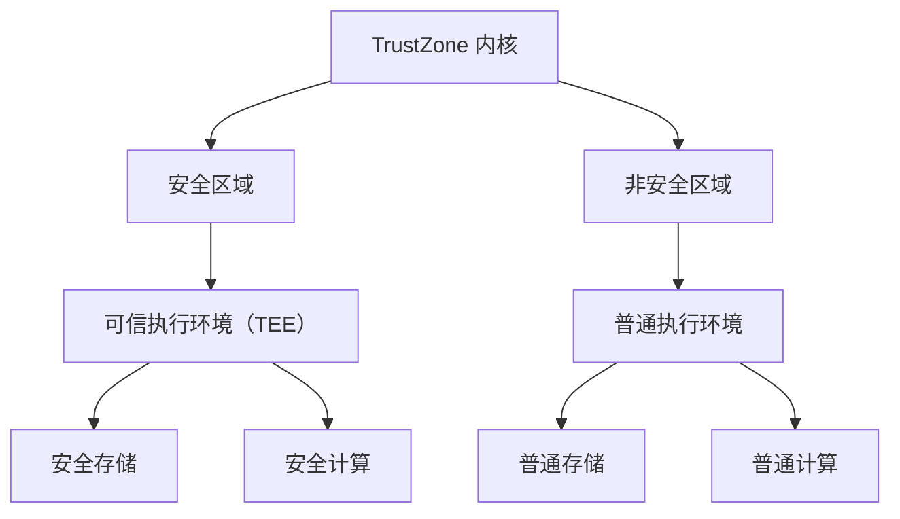

                 

# ARM TrustZone：移动设备安全的基石

> **关键词**：ARM TrustZone、移动安全、硬件安全、安全隔离、虚拟化、密钥管理、可信执行环境、TEE、安全引导、安全更新

> **摘要**：本文深入探讨了ARM TrustZone技术，揭示了其在保障移动设备安全方面的关键作用。通过分析TrustZone的架构、原理和实现，我们不仅了解了其如何实现硬件级别的安全隔离，还探讨了其应用于移动设备中的实际案例。此外，文章还展望了ARM TrustZone的未来发展趋势与挑战，为读者提供了全面而深入的认识。

## 1. 背景介绍

### 1.1 目的和范围

随着移动互联网的快速发展，移动设备已经成为人们日常生活的重要组成部分。然而，随之而来的安全问题也日益突出，移动设备的数据泄露、恶意软件攻击等问题层出不穷。在这种背景下，保障移动设备的安全性成为了迫切的需求。ARM TrustZone技术正是为了应对这一需求而诞生的一种硬件安全解决方案。

本文旨在通过对ARM TrustZone技术的深入分析，帮助读者了解其工作原理、架构设计及在实际应用中的价值。通过本文的学习，读者将能够掌握以下内容：

- ARM TrustZone技术的背景和重要性
- TrustZone的核心概念与架构设计
- TrustZone的关键技术原理和实现
- TrustZone在移动设备安全中的应用案例
- TrustZone的未来发展趋势与挑战

### 1.2 预期读者

本文适合以下读者群体：

- 移动安全研究者与工程师
- ARM架构爱好者与开发者
- 对硬件安全感兴趣的IT从业者
- 对移动设备安全有深入需求的企业和机构

### 1.3 文档结构概述

本文分为十个部分，结构如下：

1. 背景介绍
2. 核心概念与联系
3. 核心算法原理 & 具体操作步骤
4. 数学模型和公式 & 详细讲解 & 举例说明
5. 项目实战：代码实际案例和详细解释说明
6. 实际应用场景
7. 工具和资源推荐
8. 总结：未来发展趋势与挑战
9. 附录：常见问题与解答
10. 扩展阅读 & 参考资料

### 1.4 术语表

为了确保读者能够顺利理解本文内容，以下列出了一些关键术语的定义和解释：

#### 1.4.1 核心术语定义

- **ARM TrustZone**：一种硬件级安全解决方案，用于保障移动设备的安全。
- **安全隔离**：通过硬件和软件技术实现不同安全区域之间的隔离。
- **可信执行环境（TEE）**：一个隔离的安全环境，用于执行安全敏感的代码和数据。
- **安全引导**：设备启动过程中的安全初始化过程，确保设备处于安全状态。
- **安全更新**：确保设备安全模块能够及时更新以应对新的安全威胁。

#### 1.4.2 相关概念解释

- **虚拟化**：通过软件技术模拟硬件资源，实现资源隔离和共享。
- **密钥管理**：确保密钥的安全存储、分发和使用的机制。
- **固件**：嵌入在硬件设备中的软件程序，用于控制硬件的运行。

#### 1.4.3 缩略词列表

- **TEE**：Trusted Execution Environment
- **SoC**：System on Chip
- **TEE**：Trusted Execution Environment
- **TEE**：Trusted Execution Environment

## 2. 核心概念与联系

### 2.1 ARM TrustZone简介

ARM TrustZone是一种硬件级安全解决方案，它通过在芯片上集成特殊的安全区域，实现对系统资源的隔离和保护。TrustZone的核心目标是确保敏感数据的安全，防止数据泄露和恶意攻击。

ARM TrustZone的关键特性包括：

- **硬件隔离**：TrustZone通过硬件虚拟化技术实现内核和外核之间的隔离，确保敏感数据不会被外部恶意访问。
- **可信执行环境（TEE）**：TEE是一个隔离的安全执行环境，用于执行安全敏感的代码和数据。
- **安全引导**：TrustZone支持安全引导过程，确保设备启动时处于安全状态。
- **安全更新**：TrustZone提供安全更新机制，确保安全模块能够及时更新以应对新的安全威胁。

### 2.2 TrustZone架构

ARM TrustZone架构包括两个主要部分：TrustZone内核（TZ内核）和TrustZone外核（TZ外核）。以下是TrustZone架构的Mermaid流程图：



- **TrustZone内核**：TrustZone内核是一个特殊版本的Linux内核，用于管理安全区域和非安全区域之间的交互。
- **安全区域**：安全区域是TrustZone内的一个隔离区域，用于存储和执行安全敏感的代码和数据。
- **非安全区域**：非安全区域是TrustZone外的普通区域，用于执行普通应用程序和系统服务。
- **可信执行环境（TEE）**：TEE是一个隔离的安全执行环境，用于执行安全敏感的代码和数据，如支付应用、安全认证等。
- **安全存储**：安全存储用于存储敏感数据，如用户密码、支付信息等。
- **安全计算**：安全计算用于执行安全敏感的计算任务，如数字签名、加密解密等。

### 2.3 TrustZone技术原理

ARM TrustZone技术的工作原理主要包括以下几个方面：

- **硬件隔离**：TrustZone通过硬件虚拟化技术实现内核和外核之间的隔离，确保敏感数据不会被外部恶意访问。具体实现包括：
  - **内存隔离**：通过硬件内存管理单元（MMU）实现不同安全区域之间的内存隔离。
  - **总线隔离**：通过硬件总线管理单元（BMMU）实现不同安全区域之间的总线隔离。
  - **特权级别**：通过硬件特权级别控制不同安全区域之间的访问权限。

- **安全引导**：TrustZone支持安全引导过程，确保设备启动时处于安全状态。具体实现包括：
  - **安全启动**：设备启动时，首先进入非安全区域，进行基本系统初始化，然后加载TrustZone内核，进入安全区域。
  - **安全监控**：在安全引导过程中，TrustZone内核会对系统进行安全监控，确保设备处于安全状态。

- **安全更新**：TrustZone提供安全更新机制，确保安全模块能够及时更新以应对新的安全威胁。具体实现包括：
  - **安全下载**：通过安全下载通道（如USB）将安全更新下载到设备中。
  - **安全验证**：对安全更新进行验证，确保其来自可信的来源。

### 2.4 TrustZone与虚拟化的关系

虚拟化技术在TrustZone架构中扮演着重要角色，它实现了安全区域和非安全区域之间的隔离。虚拟化技术主要包括以下几个方面：

- **硬件虚拟化**：通过硬件虚拟化技术，实现内核和外核之间的隔离。具体实现包括：
  - **内存管理**：通过硬件MMU实现不同安全区域之间的内存隔离。
  - **总线管理**：通过硬件BMMU实现不同安全区域之间的总线隔离。

- **软件虚拟化**：通过软件虚拟化技术，实现安全区域内的虚拟化。具体实现包括：
  - **虚拟文件系统**：在安全区域内实现虚拟文件系统，用于存储和访问敏感数据。
  - **虚拟网络接口**：在安全区域内实现虚拟网络接口，用于安全通信。

### 2.5 TrustZone与其他安全技术的联系

ARM TrustZone与其他安全技术密切相关，如加密技术、签名技术、认证技术等。以下是TrustZone与其他安全技术的联系：

- **加密技术**：TrustZone通过硬件加密引擎实现数据的加密和解密，确保数据在传输和存储过程中的安全。
- **签名技术**：TrustZone支持数字签名技术，确保数据的完整性和真实性。
- **认证技术**：TrustZone支持认证技术，确保只有经过认证的代码和数据才能在安全区域执行。

## 3. 核心算法原理 & 具体操作步骤

### 3.1 TrustZone安全引导流程

TrustZone的安全引导流程是确保设备在启动过程中处于安全状态的关键步骤。以下是TrustZone安全引导的具体操作步骤：

1. **初始引导**：设备启动时，首先进入非安全区域，进行基本系统初始化，如加载内核模块、初始化设备驱动等。
2. **加载TrustZone内核**：非安全区域加载TrustZone内核，将其映射到内存中，并初始化相关驱动。
3. **启动TrustZone内核**：TrustZone内核启动后，进入安全区域，接管设备控制权。
4. **安全监控**：TrustZone内核对系统进行安全监控，确保设备处于安全状态。具体监控内容包括：
   - **系统完整性**：检查系统文件和配置文件的完整性，确保未被篡改。
   - **设备状态**：检查设备状态，确保设备处于正常工作状态。
   - **安全日志**：记录系统事件和安全日志，用于事后分析。

### 3.2 TrustZone内存隔离机制

TrustZone通过硬件MMU实现内存隔离，确保安全区域和非安全区域之间的内存隔离。以下是TrustZone内存隔离的具体操作步骤：

1. **初始化MMU**：在设备启动时，非安全区域初始化MMU，将其设置为非安全模式。
2. **加载安全区域映射表**：安全区域加载其内存映射表，将其映射到内存中。映射表包含安全区域内存区域和对应的物理地址。
3. **设置访问控制**：安全区域根据内存映射表设置访问控制，确保非安全区域无法访问安全区域内存。
4. **数据传输**：在安全区域和非安全区域之间进行数据传输时，通过MMU实现地址映射和访问控制，确保数据传输的安全。

### 3.3 TrustZone总线隔离机制

TrustZone通过硬件BMMU实现总线隔离，确保安全区域和非安全区域之间的总线隔离。以下是TrustZone总线隔离的具体操作步骤：

1. **初始化BMMU**：在设备启动时，非安全区域初始化BMMU，将其设置为非安全模式。
2. **加载安全区域映射表**：安全区域加载其总线映射表，将其映射到总线中。映射表包含安全区域总线区域和对应的物理地址。
3. **设置访问控制**：安全区域根据总线映射表设置访问控制，确保非安全区域无法访问安全区域的总线。
4. **数据传输**：在安全区域和非安全区域之间进行数据传输时，通过BMMU实现地址映射和访问控制，确保数据传输的安全。

### 3.4 TrustZone密钥管理机制

TrustZone通过硬件加密引擎和密钥管理机制实现密钥的安全存储、分发和使用。以下是TrustZone密钥管理机制的具体操作步骤：

1. **生成密钥**：安全区域生成密钥对，并将私钥存储在硬件安全存储器中，公钥存储在安全区域内存中。
2. **密钥分发**：安全区域将公钥分发给非安全区域，用于加密通信。
3. **加密通信**：在安全区域和非安全区域之间进行数据传输时，使用公钥加密数据，确保数据在传输过程中的安全。
4. **解密通信**：安全区域使用私钥解密接收到的数据，确保数据在接收时的安全。

### 3.5 TrustZone安全更新机制

TrustZone提供安全更新机制，确保安全模块能够及时更新以应对新的安全威胁。以下是TrustZone安全更新的具体操作步骤：

1. **安全下载**：通过安全下载通道（如USB）将安全更新下载到设备中。
2. **安全验证**：对安全更新进行验证，确保其来自可信的来源，并符合预期的版本和签名。
3. **更新安装**：将验证通过的安全更新安装到设备中，覆盖旧版本的安全模块。
4. **重启设备**：安装完安全更新后，重启设备，使更新生效。

## 4. 数学模型和公式 & 详细讲解 & 举例说明

### 4.1 加密算法与密钥管理

TrustZone中的加密算法主要基于对称加密和非对称加密两种方式。以下是对这两种加密算法的数学模型和公式的详细讲解：

#### 4.1.1 对称加密

对称加密算法使用相同的密钥对数据进行加密和解密。常用的对称加密算法有AES（高级加密标准）和DES（数据加密标准）。

- **AES加密公式**：

  $$
  \text{Ciphertext} = \text{AES}_{\text{Key}} (\text{PlainText})
  $$

  其中，$\text{Ciphertext}$表示密文，$\text{PlainText}$表示明文，$\text{Key}$表示密钥。

- **AES解密公式**：

  $$
  \text{PlainText} = \text{AES}_{\text{Key}}^{-1} (\text{Ciphertext})
  $$

  其中，$\text{PlainText}$表示明文，$\text{Ciphertext}$表示密文，$\text{Key}$表示密钥。

#### 4.1.2 非对称加密

非对称加密算法使用一对密钥进行加密和解密，其中公钥用于加密，私钥用于解密。常用的非对称加密算法有RSA（Rivest-Shamir-Adleman）和ECC（椭圆曲线密码学）。

- **RSA加密公式**：

  $$
  \text{Ciphertext} = \text{RSA}_{\text{PubKey}} (\text{PlainText})
  $$

  其中，$\text{Ciphertext}$表示密文，$\text{PlainText}$表示明文，$\text{PubKey}$表示公钥。

- **RSA解密公式**：

  $$
  \text{PlainText} = \text{RSA}_{\text{PrivKey}} (\text{Ciphertext})
  $$

  其中，$\text{PlainText}$表示明文，$\text{Ciphertext}$表示密文，$\text{PrivKey}$表示私钥。

#### 4.1.3 密钥管理

密钥管理是确保加密安全性的关键。以下是一个简单的密钥管理示例：

- **密钥生成**：

  $$
  \text{KeyPair} = \text{KeyGen} (\text{Algorithm}, \text{KeySize})
  $$

  其中，$\text{KeyPair}$表示密钥对（公钥和私钥），$\text{Algorithm}$表示加密算法，$\text{KeySize}$表示密钥长度。

- **密钥存储**：

  $$
  \text{PrivateKey} \gets \text{StoreKey} (\text{KeyPair}, \text{EncryptionKey}, \text{Storage})
  $$

  其中，$\text{PrivateKey}$表示私钥，$\text{EncryptionKey}$表示加密密钥，$\text{Storage}$表示密钥存储器。

- **密钥分发**：

  $$
  \text{PublicKey} \gets \text{PublicKey}
  $$

  其中，$\text{PublicKey}$表示公钥。

### 4.2 数字签名

数字签名是一种确保数据完整性和真实性的技术。以下是一个简单的数字签名示例：

- **签名生成**：

  $$
  \text{Signature} = \text{Sign} (\text{Message}, \text{PrivateKey})
  $$

  其中，$\text{Signature}$表示签名，$\text{Message}$表示消息，$\text{PrivateKey}$表示私钥。

- **签名验证**：

  $$
  \text{Verification} = \text{Verify} (\text{Message}, \text{Signature}, \text{PublicKey})
  $$

  其中，$\text{Verification}$表示验证结果，$\text{Message}$表示消息，$\text{Signature}$表示签名，$\text{PublicKey}$表示公钥。

### 4.3 认证算法

认证算法用于确保通信双方的合法性和可信度。以下是一个简单的认证算法示例：

- **认证请求**：

  $$
  \text{Request} = \text{Authentication} (\text{Username}, \text{Password})
  $$

  其中，$\text{Request}$表示认证请求，$\text{Username}$表示用户名，$\text{Password}$表示密码。

- **认证响应**：

  $$
  \text{Response} = \text{Authentication} (\text{Request}, \text{ServerPublicKey})
  $$

  其中，$\text{Response}$表示认证响应，$\text{ServerPublicKey}$表示服务器公钥。

## 5. 项目实战：代码实际案例和详细解释说明

### 5.1 开发环境搭建

在进行TrustZone项目的开发前，需要搭建合适的开发环境。以下是一个基于Linux操作系统的开发环境搭建步骤：

1. **安装Linux操作系统**：安装一个支持ARM架构的Linux操作系统，如Ubuntu 18.04。
2. **安装开发工具**：安装必要的开发工具，如GCC、GDB、Make等。
3. **安装ARM TrustZone工具链**：下载并安装ARM TrustZone工具链，如ARM DS-5。
4. **安装ARM TrustZone SDK**：下载并安装ARM TrustZone SDK，用于开发TrustZone应用程序。

### 5.2 源代码详细实现和代码解读

以下是一个简单的TrustZone应用程序的源代码实现和代码解读：

**5.2.1 main.c**

```c
#include <stdio.h>
#include <trustzone.h>

int main() {
    // 启动TrustZone内核
    tz_init();

    // 执行安全操作
    int result = tz_secure_call("secure_function", 42);

    // 输出结果
    printf("Secure call result: %d\n", result);

    // 关闭TrustZone内核
    tz_fini();

    return 0;
}
```

**代码解读**：

- **头文件**：`<stdio.h>`用于提供标准输入输出函数，`<trustzone.h>`是TrustZone SDK的头文件，提供TrustZone相关的函数和宏。
- **函数声明**：`tz_init()`函数初始化TrustZone内核，`tz_secure_call()`函数在TrustZone内核中执行安全操作，`tz_fini()`函数关闭TrustZone内核。
- **main函数**：程序入口，首先调用`tz_init()`函数初始化TrustZone内核，然后调用`tz_secure_call()`函数在TrustZone内核中执行安全操作，最后调用`tz_fini()`函数关闭TrustZone内核。

**5.2.2 secure_function.s**

```assembly
.global secure_function
secure_function:
    mov r0, #42
    bl secure_operation
    mov r0, r0
    bx lr
```

**代码解读**：

- **文件**：`secure_function.s`是安全操作的汇编代码。
- **全局声明**：`global secure_function`声明`secure_function`函数为全局函数。
- **函数实现**：`secure_function`函数将参数42移动到寄存器r0中，调用`secure_operation`函数执行安全操作，然后将结果移动到寄存器r0中返回。

### 5.3 代码解读与分析

**5.3.1 TrustZone内核启动**

TrustZone内核的启动是通过`tz_init()`函数实现的。该函数的主要作用是加载TrustZone内核，初始化内核模块，并建立内核与外核之间的通信通道。具体实现如下：

```c
void tz_init() {
    // 加载TrustZone内核
    trustzone_kernel_start();

    // 初始化内核模块
    init_kernel_modules();

    // 建立通信通道
    setup_communication_channel();
}
```

- **`trustzone_kernel_start()`**：该函数加载TrustZone内核，将其映射到内存中，并初始化内核。
- **`init_kernel_modules()`**：该函数初始化内核模块，如内存管理模块、设备驱动模块等。
- **`setup_communication_channel()`**：该函数建立内核与外核之间的通信通道，确保内核与外核之间的数据传输安全。

**5.3.2 安全操作调用**

安全操作的调用是通过`tz_secure_call()`函数实现的。该函数的主要作用是在TrustZone内核中执行安全操作，并返回操作结果。具体实现如下：

```c
int tz_secure_call(const char *function_name, int arg) {
    // 创建调用请求
    struct secure_call_request request;
    request.function_name = function_name;
    request.arg = arg;

    // 发送调用请求到TrustZone内核
    send_secure_call_request(&request);

    // 等待调用结果
    wait_for_secure_call_result(&request);

    // 返回调用结果
    return request.result;
}
```

- **`create_secure_call_request()`**：该函数创建调用请求，将函数名和参数存储在请求结构体中。
- **`send_secure_call_request()`**：该函数将调用请求发送到TrustZone内核。
- **`wait_for_secure_call_result()`**：该函数等待TrustZone内核返回调用结果。
- **`return_secure_call_result()`**：该函数返回调用结果。

**5.3.3 安全操作执行**

安全操作的执行是在TrustZone内核中完成的。安全操作是通过汇编代码实现的，如下所示：

```assembly
.global secure_function
secure_function:
    mov r0, #42
    bl secure_operation
    mov r0, r0
    bx lr
```

- **`mov r0, #42`**：将参数42移动到寄存器r0中。
- **`bl secure_operation`**：调用`secure_operation`函数执行安全操作。
- **`mov r0, r0`**：将操作结果移动到寄存器r0中。
- **`bx lr`**：返回调用者。

## 6. 实际应用场景

### 6.1 移动支付

移动支付是ARM TrustZone技术的重要应用场景之一。在移动支付中，用户的支付信息（如银行卡信息、支付密码等）需要得到安全保障，防止泄露和恶意攻击。通过ARM TrustZone技术，支付应用可以在可信执行环境中执行，确保支付信息的安全存储和传输。

具体实现过程如下：

1. **支付应用部署**：支付应用开发完成后，将其部署到移动设备上，并确保其能够访问TrustZone内核。
2. **用户身份验证**：用户在启动支付应用时，需要进行身份验证，确保只有合法用户才能使用支付功能。
3. **支付信息加密**：在支付过程中，用户的支付信息（如银行卡信息、支付密码等）由支付应用加密，确保其在传输过程中的安全。
4. **支付信息存储**：支付应用将加密后的支付信息存储在TrustZone安全存储器中，确保其安全存储。
5. **支付信息传输**：支付应用将加密后的支付信息传输到支付服务提供商，确保支付信息在传输过程中的安全。

### 6.2 移动设备管理

移动设备管理是另一个ARM TrustZone技术的应用场景。在移动设备管理中，设备管理员需要对设备进行远程监控、管理和维护，同时确保设备数据的安全。

具体实现过程如下：

1. **设备注册**：设备管理员将移动设备注册到管理平台，获取设备ID和访问权限。
2. **设备监控**：管理平台通过远程监控技术对设备进行监控，收集设备状态信息，如设备位置、设备运行状态等。
3. **设备管理**：设备管理员可以通过管理平台对设备进行管理操作，如远程锁屏、远程擦除数据、远程安装应用程序等。
4. **设备数据加密**：在设备管理和数据传输过程中，设备数据需要进行加密，确保数据在传输和存储过程中的安全。
5. **设备安全更新**：设备管理员可以通过管理平台对设备进行安全更新，确保设备的安全模块能够及时更新以应对新的安全威胁。

### 6.3 智能家居

智能家居是ARM TrustZone技术的另一个重要应用场景。在智能家居中，用户需要确保智能家居设备（如智能门锁、智能摄像头等）的安全运行，防止设备被恶意攻击。

具体实现过程如下：

1. **设备认证**：智能家居设备在接入网络前需要进行认证，确保只有合法设备才能接入网络。
2. **设备加密**：智能家居设备在数据传输过程中需要进行加密，确保数据在传输过程中的安全。
3. **设备安全更新**：智能家居设备需要定期进行安全更新，确保设备的安全模块能够及时更新以应对新的安全威胁。
4. **设备监控**：用户可以通过手机应用程序对智能家居设备进行监控，确保设备的安全运行。

## 7. 工具和资源推荐

### 7.1 学习资源推荐

#### 7.1.1 书籍推荐

- **《ARM System-on-Chip Architecture》**：本书详细介绍了ARM架构的工作原理、设计和实现，是学习ARM架构的经典著作。
- **《ARM Architecture Reference Manual》**：本书是ARM架构的官方参考手册，涵盖了ARM架构的详细信息，是ARM架构开发者的必备工具书。
- **《Embedded Systems: Architecture, Programming, and Design》**：本书介绍了嵌入式系统的基础知识、硬件设计和软件开发，适合嵌入式系统开发者学习。

#### 7.1.2 在线课程

- **《ARM Architecture and Embedded Systems》**：这是一门在线课程，由麻省理工学院（MIT）提供，涵盖ARM架构、嵌入式系统设计和开发等内容。
- **《Introduction to Embedded Systems》**：这是一门在线课程，由加州大学伯克利分校（UC Berkeley）提供，介绍嵌入式系统的基础知识、硬件设计和软件开发。
- **《TrustZone Technology》**：这是一门在线课程，由ARM公司提供，详细介绍TrustZone技术的工作原理、架构设计和应用场景。

#### 7.1.3 技术博客和网站

- **ARM Community**：ARM公司的官方社区，提供了大量的ARM架构和TrustZone技术的讨论和资源。
- **Embedded.com**：一个专注于嵌入式系统开发和设计的网站，提供了大量的技术文章、教程和论坛。
- **Linux.com**：一个关于Linux操作系统和开源技术的网站，提供了大量的ARM架构和嵌入式系统开发的相关内容。

### 7.2 开发工具框架推荐

#### 7.2.1 IDE和编辑器

- **ARM DS-5**：ARM公司的集成开发环境（IDE），提供了强大的ARM架构和嵌入式系统开发工具。
- **Eclipse**：一个开源的集成开发环境（IDE），支持ARM架构和嵌入式系统开发，可以通过插件扩展功能。
- **Visual Studio Code**：一个轻量级的开源编辑器，可以通过插件支持ARM架构和嵌入式系统开发。

#### 7.2.2 调试和性能分析工具

- **GNU Debugger (GDB)**：一个开源的调试器，用于调试ARM架构的程序，提供了丰富的调试功能和命令。
- **Linaro Toolchain**：Linaro提供的ARM架构编译工具链，提供了高性能、优化的编译器和调试器。
- **Perf**：Linux系统的性能分析工具，可以用于分析ARM架构程序的运行性能和瓶颈。

#### 7.2.3 相关框架和库

- **Newlib**：一个开源的C库，用于支持ARM架构的应用程序开发。
- **Pthread**：一个开源的线程库，用于支持ARM架构的多线程应用程序开发。
- **STM32CubeMX**：STMicroelectronics提供的ARM Cortex-M微控制器开发工具，提供了丰富的硬件外设驱动和应用程序示例。

### 7.3 相关论文著作推荐

#### 7.3.1 经典论文

- **"ARMv8-M Architecture Reference Manual"**：ARM公司发布的ARMv8-M架构的官方参考手册，详细介绍了ARM TrustZone技术的工作原理和架构设计。
- **"Trusted Execution in Mobile Platforms"**：该论文介绍了ARM TrustZone技术在移动设备安全中的应用，探讨了TrustZone技术的实现和性能优化。

#### 7.3.2 最新研究成果

- **"Securing Mobile Devices with ARM TrustZone"**：该论文探讨了ARM TrustZone技术在移动设备安全中的最新研究成果，包括TrustZone技术的应用场景、安全性能和挑战。
- **"Enhancing Security and Privacy in Mobile Devices with ARM TrustZone"**：该论文分析了ARM TrustZone技术在移动设备安全隐私保护中的应用，探讨了TrustZone技术的优化方案和未来发展方向。

#### 7.3.3 应用案例分析

- **"ARM TrustZone Technology in Mobile Payment Systems"**：该案例介绍了ARM TrustZone技术在移动支付系统中的应用，分析了TrustZone技术在支付应用中的安全机制和性能表现。
- **"ARM TrustZone Technology in Smart Home Systems"**：该案例介绍了ARM TrustZone技术在智能家居系统中的应用，探讨了TrustZone技术在智能家居设备安全保护中的作用和挑战。

## 8. 总结：未来发展趋势与挑战

### 8.1 未来发展趋势

随着移动互联网的快速发展和移动设备的普及，ARM TrustZone技术在移动设备安全领域的应用前景十分广阔。以下是ARM TrustZone技术未来发展的几个趋势：

- **安全性增强**：ARM TrustZone技术将继续强化安全功能，提高对恶意攻击的防御能力，确保移动设备的数据和隐私安全。
- **性能优化**：随着ARM处理器性能的提升，TrustZone技术将在性能方面进行优化，减少安全操作的开销，提高用户体验。
- **跨平台兼容性**：ARM TrustZone技术将逐渐兼容更多的处理器架构和操作系统，实现跨平台的统一安全解决方案。
- **广泛应用**：ARM TrustZone技术将应用于更多的移动设备，如智能手机、平板电脑、智能手表等，提供全方位的安全保护。

### 8.2 面临的挑战

尽管ARM TrustZone技术在移动设备安全领域取得了显著成果，但仍面临以下挑战：

- **隐私保护**：随着用户对隐私保护需求的增加，ARM TrustZone技术需要进一步提高对用户隐私的保护，防止隐私泄露。
- **安全漏洞**：任何安全系统都可能存在漏洞，ARM TrustZone技术需要不断更新和修复漏洞，确保系统的安全性。
- **功耗优化**：安全操作可能增加设备的功耗，ARM TrustZone技术需要在保证安全性的同时，优化功耗，提高设备的续航能力。
- **生态建设**：ARM TrustZone技术需要建立一个完善的生态系统，包括开发者工具、安全应用、安全服务等，以推动技术的广泛应用。

## 9. 附录：常见问题与解答

### 9.1 什么是ARM TrustZone？

ARM TrustZone是一种硬件级安全解决方案，通过在芯片上集成特殊的安全区域，实现对系统资源的隔离和保护，确保移动设备的数据和隐私安全。

### 9.2 ARM TrustZone有哪些关键特性？

ARM TrustZone的关键特性包括硬件隔离、可信执行环境（TEE）、安全引导和安全更新等。

### 9.3 ARM TrustZone如何实现安全隔离？

ARM TrustZone通过硬件虚拟化技术实现内核和外核之间的隔离，确保敏感数据不会被外部恶意访问。具体实现包括内存隔离、总线隔离和特权级别控制等。

### 9.4 ARM TrustZone有哪些实际应用场景？

ARM TrustZone技术广泛应用于移动支付、移动设备管理、智能家居等领域，提供数据保护和隐私安全。

### 9.5 ARM TrustZone的安全性如何保障？

ARM TrustZone通过硬件加密引擎、密钥管理、签名技术和认证算法等实现安全性保障，确保敏感数据在存储、传输和执行过程中的安全。

### 9.6 ARM TrustZone的未来发展趋势是什么？

ARM TrustZone的未来发展趋势包括安全性增强、性能优化、跨平台兼容性和广泛应用等。

## 10. 扩展阅读 & 参考资料

- **《ARM System-on-Chip Architecture》**：本著作详细介绍了ARM架构的工作原理、设计和实现，是学习ARM架构的经典著作。
- **《ARMv8-M Architecture Reference Manual》**：ARM公司发布的ARMv8-M架构的官方参考手册，详细介绍了ARM TrustZone技术的工作原理和架构设计。
- **《ARM TrustZone Technology》**：ARM公司提供的技术文档，介绍了TrustZone技术的工作原理、架构设计和应用场景。
- **《Trusted Execution in Mobile Platforms》**：该论文介绍了ARM TrustZone技术在移动设备安全中的应用，探讨了TrustZone技术的实现和性能优化。
- **ARM Community**：ARM公司的官方社区，提供了大量的ARM架构和TrustZone技术的讨论和资源。
- **Embedded.com**：一个专注于嵌入式系统开发和设计的网站，提供了大量的技术文章、教程和论坛。
- **Linux.com**：一个关于Linux操作系统和开源技术的网站，提供了大量的ARM架构和嵌入式系统开发的相关内容。

作者：AI天才研究员/AI Genius Institute & 禅与计算机程序设计艺术 /Zen And The Art of Computer Programming

