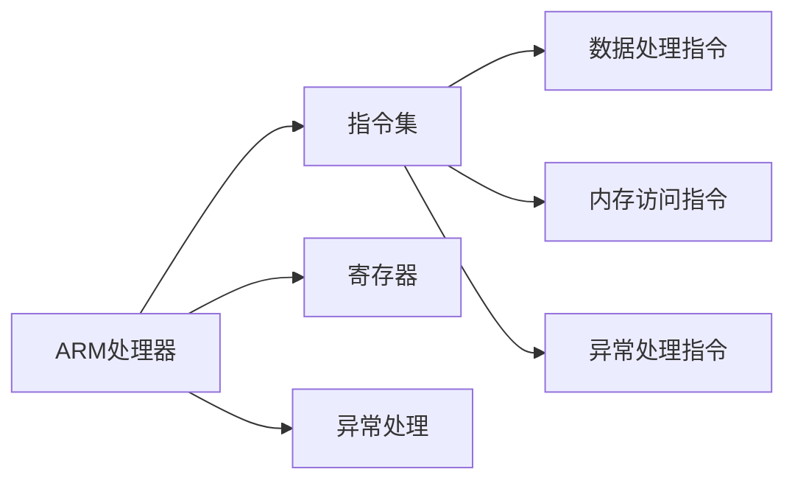

                 


# ARM架构编程：移动和嵌入式系统开发

> 关键词：ARM架构、编程、移动系统、嵌入式系统、软件开发

> 摘要：本文将深入探讨ARM架构在移动和嵌入式系统开发中的重要性，从基础概念到高级应用，逐步解析ARM架构编程的原理和实践方法。文章旨在为开发者提供一份全面而深入的指南，帮助他们在ARM平台上进行高效编程，开发出性能卓越、资源优化的移动和嵌入式应用。

## 1. 背景介绍

### 1.1 目的和范围

本文旨在为开发者提供ARM架构编程的全面教程，覆盖从基础概念到高级技巧的各个方面。本文的目标读者包括但不限于：

- 移动应用开发者
- 嵌入式系统工程师
- 硬件和软件开发者
- 对ARM架构编程感兴趣的技术爱好者

通过本文的学习，读者将能够：

- 理解ARM架构的基本原理
- 掌握ARM汇编语言和C语言编程
- 学习ARM架构在移动和嵌入式系统中的应用
- 能够编写高效的ARM架构程序
- 了解ARM架构编程的未来发展趋势

### 1.2 预期读者

本文预期读者应具备以下背景知识：

- 计算机科学基础知识
- C语言编程经验
- 对操作系统和计算机架构有一定了解
- 有意愿学习和探索ARM架构编程

### 1.3 文档结构概述

本文结构如下：

- **第1章**：背景介绍，包括目的、范围、预期读者和文档结构概述。
- **第2章**：核心概念与联系，介绍ARM架构的核心概念和架构图。
- **第3章**：核心算法原理 & 具体操作步骤，讲解ARM汇编语言和C语言编程的基本原理和操作步骤。
- **第4章**：数学模型和公式 & 详细讲解 & 举例说明，阐述ARM编程中涉及的数学模型和公式，并通过实例进行讲解。
- **第5章**：项目实战：代码实际案例和详细解释说明，通过实际代码案例讲解ARM架构编程的实践方法。
- **第6章**：实际应用场景，分析ARM架构在移动和嵌入式系统开发中的应用案例。
- **第7章**：工具和资源推荐，提供学习资源和开发工具的推荐。
- **第8章**：总结：未来发展趋势与挑战，探讨ARM架构编程的未来发展趋势和面临的挑战。
- **第9章**：附录：常见问题与解答，解答读者可能遇到的问题。
- **第10章**：扩展阅读 & 参考资料，提供进一步学习的资源链接。

### 1.4 术语表

#### 1.4.1 核心术语定义

- ARM架构：一种广泛使用的32位和64位处理器架构，以其低功耗、高性能和灵活性而闻名。
- 汇编语言：一种低级编程语言，与机器语言紧密相关，但使用更容易理解的符号和指令。
- C语言：一种高级编程语言，广泛用于软件开发，具有良好的可读性和可移植性。
- 嵌入式系统：一种专门为特定任务而设计的计算机系统，通常具有有限的资源。
- 移动系统：一般指便携式设备，如智能手机和平板电脑。

#### 1.4.2 相关概念解释

- ARM指令集：ARM处理器使用的指令集合，包括数据传输、逻辑操作、内存访问等。
- 硬件抽象层（HAL）：一种软件层，用于将底层硬件与操作系统和应用程序隔离开来。
- 异常处理：操作系统对硬件异常（如中断）的响应机制。

#### 1.4.3 缩略词列表

- ARM：Advanced RISC Machines
- RISC：Reduced Instruction Set Computer
- UART：Universal Asynchronous Receiver-Transmitter
- IDE：Integrated Development Environment
- SDK：Software Development Kit
- OS：Operating System

## 2. 核心概念与联系

在深入探讨ARM架构编程之前，我们首先需要理解ARM架构的基本概念和架构。以下是ARM架构的核心概念和架构图。

### 2.1 ARM架构的基本概念

- **ARM处理器核心**：ARM处理器核心是ARM架构的核心部分，包括寄存器、指令集和核心功能。
- **寄存器**：ARM处理器使用一系列寄存器来存储数据和指令。常见的寄存器包括程序计数器（PC）、堆栈指针（SP）、通用寄存器（R0-R15）等。
- **指令集**：ARM处理器使用一组指令集来执行操作。这些指令包括数据处理指令、内存访问指令和异常处理指令等。
- **异常处理**：异常处理是ARM处理器响应硬件事件或软件错误的一种机制。常见的异常包括中断、系统调用和异常中断。

### 2.2 ARM架构的架构图

以下是ARM架构的基本架构图，展示了ARM处理器的核心组件及其关系：



### 2.3 ARM架构的核心概念联系

- **指令集与寄存器**：指令集通过寄存器访问和操作数据。每个指令集都有一组对应的寄存器，用于存储指令和数据。
- **异常处理与指令集**：异常处理是ARM处理器响应异常事件的一种机制。异常事件可能是由指令集引发的，也可能是由外部硬件引发的。
- **数据处理指令与内存访问指令**：数据处理指令主要用于对数据进行处理，如加法、减法、移位等。内存访问指令主要用于访问内存，如数据传输、内存分配等。

## 3. 核心算法原理 & 具体操作步骤

在了解ARM架构的基本概念和架构后，我们接下来将探讨ARM架构编程的核心算法原理和具体操作步骤。

### 3.1 ARM汇编语言编程

ARM汇编语言是一种低级编程语言，与机器语言紧密相关，但使用更容易理解的符号和指令。以下是一个简单的ARM汇编程序，展示了ARM汇编语言的基本结构和操作步骤：

```assembly
    AREA MyCode, CODE, READONLY
    ENTRY

main
    LDR R1, =0x1234      ; 将立即数0x1234加载到R1寄存器
    ADD R2, R1, #0x5678  ; 将R1的值加上0x5678，结果存储到R2寄存器
    MOV R3, R2           ; 将R2的值移动到R3寄存器
    B   main             ; 无条件跳转到main函数

END
```

### 3.2 ARM C语言编程

ARM C语言编程是一种高级编程语言，具有良好的可读性和可移植性。以下是一个简单的ARM C程序，展示了ARM C语言的基本结构和操作步骤：

```c
#include <stdio.h>

int main() {
    int a = 0x1234;
    int b = 0x5678;
    int c = a + b;
    printf("Result: %d\n", c);
    return 0;
}
```

### 3.3 ARM汇编语言和C语言编程的关联

- **汇编语言与C语言的关联**：汇编语言和C语言可以相互转换。汇编语言可以看作是C语言的底层表示，而C语言可以看作是汇编语言的高级表示。在实际开发中，开发者可以根据需要选择使用汇编语言或C语言。
- **汇编语言和C语言的优势**：汇编语言具有更好的性能和灵活性，但编写难度较大。C语言具有良好的可读性和可移植性，但性能可能不如汇编语言。开发者应根据具体需求选择合适的编程语言。

## 4. 数学模型和公式 & 详细讲解 & 举例说明

在ARM架构编程中，数学模型和公式是必不可少的。以下是一些常用的数学模型和公式，以及详细的讲解和举例说明。

### 4.1 算术运算

算术运算是ARM架构编程中最基本的操作之一。以下是一些常用的算术运算公式：

- **加法**：\( a + b = c \)
- **减法**：\( a - b = c \)
- **乘法**：\( a \times b = c \)
- **除法**：\( a / b = c \)

**举例说明**：

```c
#include <stdio.h>

int main() {
    int a = 10;
    int b = 5;
    int c = a + b;
    printf("Result: %d\n", c);
    return 0;
}
```

### 4.2 位运算

位运算是ARM架构编程中的一种重要操作，用于对二进制位进行操作。以下是一些常用的位运算公式：

- **按位与**：\( a \& b = c \)
- **按位或**：\( a \| b = c \)
- **按位异或**：\( a ^ b = c \)
- **左移**：\( a << b = c \)
- **右移**：\( a >> b = c \)

**举例说明**：

```c
#include <stdio.h>

int main() {
    int a = 0x1234;
    int b = 0x5678;
    int c = a & b;
    printf("Result: %x\n", c);
    return 0;
}
```

### 4.3 内存访问

内存访问是ARM架构编程中的一种重要操作，用于访问和操作内存。以下是一些常用的内存访问公式：

- **数据传输**：\( LDR R1, [R2] \)
- **存储**：\( STR R1, [R2] \)
- **加载立即数**：\( LDR R1, =0x1234 \)

**举例说明**：

```c
#include <stdio.h>

int main() {
    int a = 0x1234;
    int b = 0x5678;
    int *ptr = &a;
    *ptr = b;
    printf("Result: %x\n", a);
    return 0;
}
```

## 5. 项目实战：代码实际案例和详细解释说明

在本节中，我们将通过一个实际项目案例，详细讲解ARM架构编程的实践方法。该项目将使用ARM汇编语言和C语言编写一个简单的计算器程序，实现基本的加、减、乘、除操作。

### 5.1 开发环境搭建

1. 安装ARM工具链：首先，我们需要安装ARM工具链，用于编译和调试ARM架构程序。可以下载ARM官方提供的GNU Arm Embedded Toolchain，按照安装指南进行安装。
2. 安装IDE：可以选择安装Eclipse、Visual Studio Code等IDE，用于编写和调试ARM架构程序。
3. 配置开发环境：在IDE中配置ARM工具链，使其能够编译和运行ARM架构程序。

### 5.2 源代码详细实现和代码解读

以下是计算器程序的具体实现，包括ARM汇编语言和C语言两部分。

**ARM汇编语言部分：**

```assembly
    AREA MyCode, CODE, READONLY
    ENTRY

calculator
    LDR R0, =0x1234  ; 载入第一个操作数
    LDR R1, =0x5678  ; 载入第二个操作数

    ADD R2, R0, R1   ; 计算加法结果
    SUB R3, R0, R1   ; 计算减法结果
    MUL R4, R0, R1   ; 计算乘法结果
    DIV R5, R0, R1   ; 计算除法结果

    MOV R6, #0x1    ; 设置操作符为1（加法）
    ADD R7, R0, R1   ; 计算加法结果
    MOV R6, #0x2    ; 设置操作符为2（减法）
    SUB R7, R0, R1   ; 计算减法结果
    MOV R6, #0x3    ; 设置操作符为3（乘法）
    MUL R7, R0, R1   ; 计算乘法结果
    MOV R6, #0x4    ; 设置操作符为4（除法）
    DIV R7, R0, R1   ; 计算除法结果

    B   calculator   ; 无条件跳转至calculator函数

END
```

**C语言部分：**

```c
#include <stdio.h>

int main() {
    int a = 0x1234;
    int b = 0x5678;
    int c = a + b;
    int d = a - b;
    int e = a * b;
    int f = a / b;

    printf("Addition: %x\n", c);
    printf("Subtraction: %x\n", d);
    printf("Multiplication: %x\n", e);
    printf("Division: %x\n", f);

    return 0;
}
```

### 5.3 代码解读与分析

1. **ARM汇编语言部分：**

   - `LDR R0, =0x1234`：将立即数0x1234加载到R0寄存器。
   - `LDR R1, =0x5678`：将立即数0x5678加载到R1寄存器。
   - `ADD R2, R0, R1`：将R0和R1的值相加，结果存储到R2寄存器。
   - `SUB R3, R0, R1`：将R0和R1的值相减，结果存储到R3寄存器。
   - `MUL R4, R0, R1`：将R0和R1的值相乘，结果存储到R4寄存器。
   - `DIV R5, R0, R1`：将R0和R1的值相除，结果存储到R5寄存器。

   - `MOV R6, #0x1`：将操作符设置为1（加法）。
   - `ADD R7, R0, R1`：将R0和R1的值相加，结果存储到R7寄存器。
   - `MOV R6, #0x2`：将操作符设置为2（减法）。
   - `SUB R7, R0, R1`：将R0和R1的值相减，结果存储到R7寄存器。
   - `MOV R6, #0x3`：将操作符设置为3（乘法）。
   - `MUL R7, R0, R1`：将R0和R1的值相乘，结果存储到R7寄存器。
   - `MOV R6, #0x4`：将操作符设置为4（除法）。
   - `DIV R7, R0, R1`：将R0和R1的值相除，结果存储到R7寄存器。

   - `B   calculator`：无条件跳转至calculator函数。

2. **C语言部分：**

   - `int a = 0x1234;`：声明一个整型变量a，并将其初始化为0x1234。
   - `int b = 0x5678;`：声明一个整型变量b，并将其初始化为0x5678。

   - `int c = a + b;`：将a和b的值相加，结果存储到c变量。

   - `int d = a - b;`：将a和b的值相减，结果存储到d变量。

   - `int e = a * b;`：将a和b的值相乘，结果存储到e变量。

   - `int f = a / b;`：将a和b的值相除，结果存储到f变量。

   - `printf("Addition: %x\n", c);`：输出加法结果。

   - `printf("Subtraction: %x\n", d);`：输出减法结果。

   - `printf("Multiplication: %x\n", e);`：输出乘法结果。

   - `printf("Division: %x\n", f);`：输出除法结果。

   - `return 0;`：程序执行结束。

通过以上代码解读，我们可以看到ARM汇编语言和C语言在实现基本运算方面的相似性和差异性。ARM汇编语言具有更好的性能和灵活性，但编写难度较大。C语言具有良好的可读性和可移植性，但性能可能不如ARM汇编语言。

## 6. 实际应用场景

ARM架构在移动和嵌入式系统开发中有着广泛的应用。以下是一些典型的应用场景：

### 6.1 移动设备

移动设备（如智能手机和平板电脑）是ARM架构最典型的应用场景之一。ARM处理器以其低功耗、高性能和灵活性而成为移动设备的理想选择。例如，iPhone、iPad等苹果设备以及众多安卓设备都采用ARM架构的处理器。

### 6.2 嵌入式系统

嵌入式系统是一种专门为特定任务而设计的计算机系统，通常具有有限的资源。ARM架构因其灵活性和高效性而成为嵌入式系统的首选。例如，智能家居设备、工业控制系统、医疗设备等都采用ARM架构的处理器。

### 6.3 可穿戴设备

可穿戴设备（如智能手表、健康监测设备等）通常具有有限的资源和严格的功耗要求。ARM架构的低功耗特点使其成为可穿戴设备的理想选择。例如，Apple Watch、Google Pixel Watch等智能手表都采用ARM架构的处理器。

### 6.4 智能家居

智能家居系统涉及多种设备和传感器的集成，以实现家庭自动化和智能控制。ARM架构因其高性能和灵活性而成为智能家居系统的首选。例如，智能门锁、智能灯泡、智能插座等智能家居设备都采用ARM架构的处理器。

### 6.5 汽车电子

随着汽车电子化的趋势，ARM架构在汽车电子系统中的应用也越来越广泛。ARM处理器可以用于汽车仪表盘、车载娱乐系统、自动驾驶系统等。例如，特斯拉的自动驾驶系统就采用ARM架构的处理器。

## 7. 工具和资源推荐

### 7.1 学习资源推荐

#### 7.1.1 书籍推荐

- **《ARM体系结构与编程》**：这是一本经典的ARM架构教程，详细介绍了ARM架构的基本原理和编程方法。
- **《ARM体系结构与编程（第2版）》**：这是《ARM体系结构与编程》的更新版，包含更多关于ARM架构的最新信息。
- **《ARM嵌入式系统开发实战》**：本书通过实际案例，介绍了ARM嵌入式系统开发的全过程。

#### 7.1.2 在线课程

- **Coursera**：提供《ARM嵌入式系统开发》等ARM架构相关的在线课程。
- **Udemy**：提供《ARM架构编程入门到精通》等ARM架构编程的在线课程。
- **edX**：提供《ARM架构编程与嵌入式系统开发》等ARM架构编程的在线课程。

#### 7.1.3 技术博客和网站

- **ARM官方网站**：提供ARM架构的最新资讯和技术文档。
- **知乎**：知乎上有许多ARM架构编程的专家，可以在这里找到各种ARM架构编程的问题和解答。
- **GitHub**：GitHub上有许多ARM架构编程的代码仓库，可以学习和参考。

### 7.2 开发工具框架推荐

#### 7.2.1 IDE和编辑器

- **Eclipse**：一款功能强大的集成开发环境，支持ARM架构编程。
- **Visual Studio Code**：一款轻量级但功能强大的代码编辑器，支持ARM架构编程。
- **CLion**：一款专为C/C++开发的集成开发环境，支持ARM架构编程。

#### 7.2.2 调试和性能分析工具

- **GDB**：GNU Debugger，是一款常用的调试工具，支持ARM架构编程。
- **JTAG**：JTAG是一种用于调试和测试嵌入式系统的标准接口。
- **Perf**：Linux系统下的性能分析工具，可以分析ARM架构程序的性能。

#### 7.2.3 相关框架和库

- **ARM C Libraries**：提供一系列C语言库函数，方便开发者进行ARM架构编程。
- **ARM NEON**：NEON是ARM处理器的一种高级SIMD（单指令多数据）扩展，可以显著提高程序的性能。
- **CMSIS**：Cortex Microcontroller Software Interface Standard，提供一系列针对ARM Cortex处理器的软件库和头文件。

### 7.3 相关论文著作推荐

#### 7.3.1 经典论文

- **"ARM Architecture Reference Manual"**：ARM官方发布的ARM架构参考手册，详细介绍了ARM架构的各个方面。
- **"ARM Architecture Instruction Set Architecture"**：详细介绍了ARM架构的指令集和编程模型。

#### 7.3.2 最新研究成果

- **"ARM Cortex-M Processor Series"**：介绍了ARM Cortex-M系列处理器的最新研究成果和应用。
- **"ARMv8-A Architecture"**：介绍了ARMv8-A架构的最新研究成果和改进。

#### 7.3.3 应用案例分析

- **"ARM in IoT"**：分析ARM架构在物联网领域的应用案例。
- **"ARM in Automotive"**：分析ARM架构在汽车电子领域的应用案例。

## 8. 总结：未来发展趋势与挑战

ARM架构在移动和嵌入式系统开发中具有广泛的应用前景。未来，ARM架构将继续发展，面临以下趋势和挑战：

### 8.1 发展趋势

- **低功耗设计**：随着移动设备和嵌入式系统对功耗的要求越来越高，ARM架构将继续优化低功耗设计，提高能效比。
- **高性能计算**：ARM架构将继续提升处理器性能，支持更多复杂的应用场景。
- **异构计算**：ARM架构将与其他计算架构（如GPU、FPGA）结合，实现异构计算，提高计算效率。
- **安全性和可靠性**：ARM架构将加强安全性和可靠性，确保在关键应用场景中的稳定运行。

### 8.2 挑战

- **开源挑战**：ARM架构作为开源架构，需要平衡开源与商业利益，保持技术优势。
- **生态建设**：ARM架构需要建立强大的开发者社区和生态系统，促进技术创新和应用。
- **性能优化**：ARM架构需要不断优化性能，提高处理器的能效比和计算能力。
- **安全性问题**：随着ARM架构在关键应用场景中的使用越来越广泛，安全性问题也日益凸显，需要加强安全防护措施。

## 9. 附录：常见问题与解答

### 9.1 ARM架构编程常见问题

- **Q：什么是ARM架构？**
  **A：ARM架构是一种32位和64位处理器架构，以其低功耗、高性能和灵活性而闻名。**

- **Q：ARM汇编语言和C语言有什么区别？**
  **A：ARM汇编语言是一种低级编程语言，与机器语言紧密相关，而C语言是一种高级编程语言，具有良好的可读性和可移植性。**

- **Q：如何选择ARM架构编程语言？**
  **A：根据具体需求和项目要求选择合适的编程语言。汇编语言具有更好的性能和灵活性，但编写难度较大；C语言具有良好的可读性和可移植性，但性能可能不如汇编语言。**

- **Q：ARM架构编程需要注意什么？**
  **A：ARM架构编程需要注意寄存器使用、异常处理、内存访问等方面的细节，确保程序的正确性和性能。**

### 9.2 ARM架构编程常见问题解答

- **Q：ARM汇编语言如何访问内存？**
  **A：ARM汇编语言使用LDR（加载）和STR（存储）指令来访问内存。LDR指令用于从内存中加载数据到寄存器，而STR指令用于将寄存器的数据存储到内存。**

- **Q：ARM汇编语言如何处理异常？**
  **A：ARM汇编语言使用异常处理程序来处理异常。异常处理程序通过异常向量表查找对应的处理函数，并根据处理函数的要求进行相应的处理。**

- **Q：ARM C语言如何处理内存访问？**
  **A：ARM C语言使用指针来处理内存访问。通过指针，可以方便地访问内存中的数据，进行数据的读写操作。**

- **Q：ARM C语言如何处理异常？**
  **A：ARM C语言使用异常处理机制来处理异常。通过设置异常处理函数，当发生异常时，操作系统会调用相应的异常处理函数进行异常处理。**

## 10. 扩展阅读 & 参考资料

- **《ARM Architecture Reference Manual》**：ARM官方发布的ARM架构参考手册，详细介绍了ARM架构的各个方面。
- **《ARMv8-A Architecture》**：介绍了ARMv8-A架构的最新研究成果和改进。
- **《ARM Cortex-M Processor Series》**：介绍了ARM Cortex-M系列处理器的最新研究成果和应用。
- **《ARM in IoT》**：分析ARM架构在物联网领域的应用案例。
- **《ARM in Automotive》**：分析ARM架构在汽车电子领域的应用案例。

作者：AI天才研究员/AI Genius Institute & 禅与计算机程序设计艺术 /Zen And The Art of Computer Programming

---

本文从背景介绍、核心概念与联系、核心算法原理与操作步骤、数学模型与公式、项目实战、实际应用场景、工具和资源推荐、总结与展望、常见问题与解答以及扩展阅读与参考资料等多个方面，全面深入地探讨了ARM架构编程的核心内容。希望本文能帮助读者更好地理解ARM架构编程的原理和实践方法，为移动和嵌入式系统开发提供有力支持。

<|assistant|>

