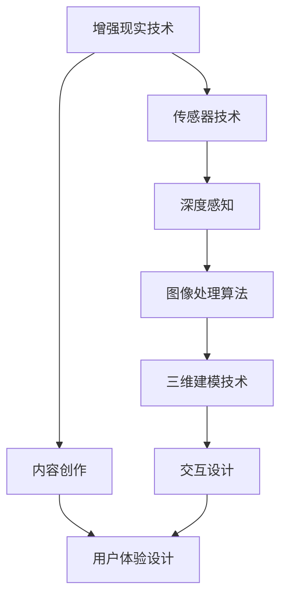

                 

# AR内容创作：增强现实应用设计指南

> **关键词：增强现实（AR）、内容创作、应用设计、用户体验、开发流程**
> 
> **摘要：本文旨在为开发者和设计师提供一份详细的增强现实（AR）内容创作与应用设计指南。通过梳理AR技术的核心概念、算法原理、数学模型及实际应用案例，文章将帮助读者深入了解AR内容创作的全过程，掌握设计技巧，提升用户体验。**

## 1. 背景介绍

### 1.1 目的和范围

本文的目标是引导读者逐步掌握增强现实（AR）内容创作和应用设计的核心方法和技巧。文章将涵盖从技术背景到实际操作的全过程，包括但不限于核心概念理解、算法实现、数学模型运用及开发实战。

文章的范围将集中在以下几个方面：
- AR技术的核心原理和基础算法
- 内容创作的基本流程和设计原则
- 开发流程和工具使用
- 实际案例分析与最佳实践

### 1.2 预期读者

本文适合以下读者群体：
- 对增强现实（AR）技术感兴趣的开发者和设计师
- 想要在AR领域进行内容创作和应用设计的专业人士
- 拥有一定编程基础，希望提升项目实战能力的技术爱好者

### 1.3 文档结构概述

本文将按照以下结构进行展开：
- 第一部分：背景介绍
- 第二部分：核心概念与联系
- 第三部分：核心算法原理与操作步骤
- 第四部分：数学模型和公式讲解
- 第五部分：项目实战与代码分析
- 第六部分：实际应用场景
- 第七部分：工具和资源推荐
- 第八部分：总结与未来展望
- 第九部分：常见问题与解答
- 第十部分：扩展阅读与参考资料

### 1.4 术语表

#### 1.4.1 核心术语定义

- 增强现实（AR）：通过计算机生成的虚拟信息叠加到现实世界中的技术。
- 虚拟现实（VR）：完全模拟一个虚拟环境，使用户沉浸在计算机生成的三维世界中。
- 内容创作：创建和设计用于AR应用中的各种信息，如图形、文本、音频、视频等。
- 应用设计：根据用户体验需求，规划AR应用的整体结构和交互流程。

#### 1.4.2 相关概念解释

- 透视投影：将三维空间中的物体映射到二维平面上，模拟人眼观察物体的视觉效果。
- 深度感知：通过传感器和数据计算，确定虚拟对象在现实世界中的准确位置和深度。
- 交互设计：设计用户与AR应用之间的交互方式，包括手势、语音、触控等。

#### 1.4.3 缩略词列表

- AR：增强现实（Augmented Reality）
- VR：虚拟现实（Virtual Reality）
- SDK：软件开发工具包（Software Development Kit）
- API：应用程序编程接口（Application Programming Interface）
- UX：用户体验（User Experience）
- UI：用户界面（User Interface）

## 2. 核心概念与联系

为了更好地理解增强现实（AR）内容创作和应用设计，我们需要掌握几个核心概念和它们之间的联系。下面是这些概念以及它们的关系的Mermaid流程图：



### 2.1 增强现实技术

增强现实（AR）技术是一种通过计算机生成的虚拟信息叠加到现实世界中的技术。它利用传感器、摄像头和计算能力，将虚拟对象与现实世界中的物体进行融合，使用户能够在现实环境中看到和与虚拟信息互动。

### 2.2 内容创作

内容创作是AR应用的核心，包括创建和设计用于AR应用中的各种信息，如图形、文本、音频、视频等。内容创作需要考虑以下几个方面：
- 贴近现实：设计的内容应与现实环境相协调，避免过于夸张或不现实。
- 互动性：内容应具有一定的互动性，吸引用户参与。
- 多样性：提供多种类型的内容，满足不同用户的需求。

### 2.3 用户体验设计

用户体验设计（UX Design）是确保用户在使用AR应用过程中获得良好体验的关键。用户体验设计需要考虑以下几个方面：
- 界面设计：设计简洁、直观的用户界面，提高操作效率。
- 交互流程：设计合理的交互流程，减少用户的学习成本。
- 个性化：根据用户的行为和喜好，提供个性化的体验。

### 2.4 传感器技术

传感器技术是AR技术的基础，用于捕捉现实环境中的各种信息。常用的传感器包括摄像头、GPS、加速度计、陀螺仪等。传感器技术为深度感知和图像处理提供了必要的数据支持。

### 2.5 深度感知

深度感知是通过传感器和数据计算，确定虚拟对象在现实世界中的准确位置和深度。深度感知技术是实现AR内容与现实世界融合的关键，包括以下几个方面：
- 深度估计：根据传感器数据，估计虚拟对象与现实世界之间的距离。
- 空间定位：确定虚拟对象在现实世界中的位置和方向。
- 深度校正：修正深度感知过程中可能出现的误差，提高虚拟对象的准确性。

### 2.6 图像处理算法

图像处理算法用于对捕捉到的图像进行预处理、增强和识别。常见的图像处理算法包括：
- 边缘检测：检测图像中的边缘，用于识别物体的轮廓。
- 颜色空间转换：将图像从一种颜色空间转换到另一种，便于处理和识别。
- 特征提取：从图像中提取关键特征，用于物体识别和匹配。

### 2.7 三维建模技术

三维建模技术用于创建和设计虚拟对象。三维建模技术包括以下几个方面：
- 模型创建：使用三维建模软件创建虚拟对象。
- 材质应用：为虚拟对象添加材质，使其更加真实。
- 灯光设置：为虚拟对象和环境添加适当的灯光，提高视觉效果。

### 2.8 交互设计

交互设计是确保用户能够方便、高效地与AR应用进行互动的关键。交互设计需要考虑以下几个方面：
- 手势识别：设计合适的手势，使用户能够与虚拟对象进行互动。
- 语音交互：设计语音交互功能，提高用户体验。
- 触控操作：设计直观的触控操作，使用户能够方便地与虚拟对象进行互动。

通过以上核心概念和它们之间的联系，我们可以更好地理解增强现实（AR）内容创作和应用设计的全过程。在接下来的部分，我们将进一步深入探讨核心算法原理、数学模型、开发流程和实际应用场景。让我们一步一步地进行分析推理（REASONING STEP BY STEP），以掌握AR内容创作的核心方法和技巧。

## 3. 核心算法原理 & 具体操作步骤

### 3.1 图像识别与追踪算法

图像识别与追踪是增强现实（AR）内容创作中的核心算法之一。它负责识别和跟踪现实世界中的特定物体或场景，以实现虚拟信息与真实环境的无缝融合。以下是一个简化的图像识别与追踪算法流程：

#### 算法流程：

1. **图像捕获**：使用摄像头捕捉现实世界的图像。
2. **预处理**：对捕获的图像进行预处理，包括灰度转换、滤波、边缘检测等。
3. **特征提取**：从预处理后的图像中提取特征，如角点、纹理、颜色等。
4. **模型匹配**：将提取的特征与预设的模型进行匹配，以识别和跟踪目标物体。
5. **坐标计算**：根据匹配结果计算目标物体在现实世界中的位置和方向。
6. **虚拟信息叠加**：将虚拟信息叠加到目标物体上，实现与现实环境的融合。

#### 伪代码：

```python
# 增强现实图像识别与追踪伪代码

# 输入：现实世界图像
# 输出：目标物体位置和方向

function AR_Tracking(image):
    # 步骤1：图像捕获
    captured_image = Camera.capture_image()

    # 步骤2：预处理
    preprocessed_image = Preprocessing.preprocess(captured_image)

    # 步骤3：特征提取
    features = FeatureExtraction.extract(preprocessed_image)

    # 步骤4：模型匹配
    matched_model = ModelMatching.match(features, predefined_model)

    # 步骤5：坐标计算
    position, orientation = CoordinateCalculation.calculate(matched_model)

    # 步骤6：虚拟信息叠加
    AR_Info叠加(image, position, orientation)

    return position, orientation
```

### 3.2 深度感知与空间定位算法

深度感知与空间定位算法是确保虚拟信息与现实环境准确融合的关键。它利用传感器数据计算虚拟对象在现实世界中的位置和深度。以下是一个简化的深度感知与空间定位算法流程：

#### 算法流程：

1. **传感器数据采集**：采集摄像头、GPS、加速度计、陀螺仪等传感器的数据。
2. **数据预处理**：对传感器数据进行预处理，包括滤波、去噪等。
3. **深度估计**：利用预处理后的传感器数据估计虚拟对象与现实世界之间的距离。
4. **空间定位**：根据深度估计结果确定虚拟对象在现实世界中的位置和方向。
5. **融合与渲染**：将虚拟信息与真实环境融合，并实时渲染。

#### 伪代码：

```python
# 增强现实深度感知与空间定位伪代码

# 输入：传感器数据
# 输出：虚拟对象位置和深度

function AR_DepthPerception(sensor_data):
    # 步骤1：传感器数据采集
    sensor_data = Sensor采集数据()

    # 步骤2：数据预处理
    preprocessed_data = DataPreprocessing.preprocess(sensor_data)

    # 步骤3：深度估计
    depth = DepthEstimation.estimate(preprocessed_data)

    # 步骤4：空间定位
    position, orientation = SpaceLocalization.localize(depth)

    # 步骤5：融合与渲染
    AR_Info融合渲染(position, orientation)

    return position, depth
```

### 3.3 交互设计算法

交互设计算法是确保用户能够方便、高效地与AR应用进行互动的关键。它涉及手势识别、语音交互、触控操作等多个方面。以下是一个简化的交互设计算法流程：

#### 算法流程：

1. **手势识别**：通过计算机视觉技术识别用户的手势。
2. **语音交互**：通过语音识别技术识别用户的语音指令。
3. **触控操作**：通过触控传感器识别用户的触控操作。
4. **行为响应**：根据用户的互动行为，进行相应的响应和反馈。

#### 伪代码：

```python
# 增强现实交互设计伪代码

# 输入：用户互动数据
# 输出：用户互动响应

function AR_Interaction(user_interaction):
    # 步骤1：手势识别
    gesture = GestureRecognition.recognize(user_interaction)

    # 步骤2：语音交互
    voice_command = VoiceRecognition.recognize(user_interaction)

    # 步骤3：触控操作
    touch_action = TouchSensor.detect(user_interaction)

    # 步骤4：行为响应
    response = BehaviorResponse.respond(gesture, voice_command, touch_action)

    return response
```

通过以上核心算法原理和具体操作步骤，我们可以更好地理解增强现实（AR）内容创作和应用设计的技术基础。在接下来的部分，我们将进一步探讨数学模型和公式的运用，以提升AR内容创作的准确性和效果。让我们继续一步一步地分析推理（REASONING STEP BY STEP），以深入掌握AR内容创作的核心方法和技巧。

## 4. 数学模型和公式 & 详细讲解 & 举例说明

在增强现实（AR）内容创作中，数学模型和公式起着至关重要的作用，它们帮助我们准确地处理和表示现实世界中的数据，从而实现虚拟信息与现实环境的无缝融合。以下是一些关键的数学模型和公式，并对其进行详细讲解和举例说明。

### 4.1 透视投影模型

透视投影是模拟人眼观察物体时的视觉效果的一种数学模型。它将三维空间中的物体映射到二维平面上，使得远处的物体显得更小，近处的物体显得更大。

#### 公式：

透视投影的公式可以表示为：

\[ x' = \frac{x}{z} \]
\[ y' = \frac{y}{z} \]

其中，\( (x, y, z) \) 是物体在三维空间中的坐标，\( (x', y') \) 是物体在二维平面上的投影坐标。

#### 举例说明：

假设一个物体在三维空间中的坐标为 \( (1, 2, 3) \)，则它在二维平面上的投影坐标为：

\[ x' = \frac{1}{3} = 0.3333 \]
\[ y' = \frac{2}{3} = 0.6667 \]

### 4.2 深度感知模型

深度感知是通过传感器数据估计虚拟对象与现实世界之间的距离的一种数学模型。它利用多传感器数据融合和几何推理来提高深度估计的准确性。

#### 公式：

深度感知的公式可以表示为：

\[ depth = \frac{distance}{sensor_range} \]

其中，\( distance \) 是虚拟对象与现实世界之间的距离，\( sensor_range \) 是传感器的最大探测范围。

#### 举例说明：

假设一个虚拟对象与摄像头的距离为 2 米，摄像头的最大探测范围为 5 米，则深度估计为：

\[ depth = \frac{2}{5} = 0.4 \] 米

### 4.3 3D 渲染模型

3D 渲染是将三维模型在二维屏幕上展示的一种数学模型。它包括建模、纹理映射、光照计算和渲染等多个步骤。

#### 公式：

3D 渲染的公式可以表示为：

\[ color = light \times material \times texture \]

其中，\( color \) 是渲染后的颜色，\( light \) 是光源信息，\( material \) 是物体材质，\( texture \) 是纹理信息。

#### 举例说明：

假设一个物体受到平行光源的照射，材质为金属，纹理为木质纹理，则渲染后的颜色可以表示为：

\[ color = (light \times metal) \times wood = (1.2 \times 0.8) \times 0.5 = 0.48 \]

### 4.4 交互模型

交互模型用于描述用户与AR应用之间的交互方式。它包括手势识别、语音交互和触控操作等多个方面。

#### 公式：

交互模型的公式可以表示为：

\[ response = function(input, context) \]

其中，\( response \) 是系统对用户交互的响应，\( input \) 是用户的输入（如手势、语音、触控），\( context \) 是应用上下文。

#### 举例说明：

假设用户做出了一个向右的手势，当前应用上下文为“导航模式”，则系统响应可以表示为：

\[ response = function('right', 'navigation') = 'turn_right' \]

通过以上数学模型和公式的讲解和举例说明，我们可以更好地理解增强现实（AR）内容创作中的关键技术。在接下来的部分，我们将通过实际项目实战来展示如何将以上理论应用到实际开发中。让我们继续一步一步地分析推理（REASONING STEP BY STEP），以深入掌握AR内容创作的核心方法和技巧。

## 5. 项目实战：代码实际案例和详细解释说明

### 5.1 开发环境搭建

在进行增强现实（AR）内容创作项目实战之前，我们需要搭建一个合适的开发环境。以下是搭建开发环境的基本步骤：

#### 步骤1：安装开发工具

- **Android Studio**：用于开发Android平台的AR应用。
- **Unity**：用于创建和渲染三维场景。
- **ARCore**：Google开发的AR开发框架。

#### 步骤2：创建AR应用项目

在Android Studio中创建一个新的Android项目，选择ARCore作为开发框架。

#### 步骤3：配置项目依赖

在项目的`build.gradle`文件中添加ARCore的依赖：

```groovy
dependencies {
    implementation 'com.google.ar:ar-core-client:1.19.1'
}
```

### 5.2 源代码详细实现和代码解读

接下来，我们将通过一个简单的例子来详细解读AR内容创作的源代码实现。

#### 5.2.1 主Activity代码解读

```java
import androidx.appcompat.app.AppCompatActivity;
import androidx.core.app.ActivityCompat;
import androidx.core.content.ContextCompat;
import com.google.ar.core.ArSession;
import com.google.ar.core.Session;
import com.google.ar.core.exceptions.UnavailableException;

public class MainActivity extends AppCompatActivity {

    private ArSession mArSession;

    @Override
    protected void onCreate(Bundle savedInstanceState) {
        super.onCreate(savedInstanceState);
        setContentView(R.layout.activity_main);

        if (ContextCompat.checkSelfPermission(this, Manifest.permission.CAMERA) != PackageManager.PERMISSION_GRANTED) {
            ActivityCompat.requestPermissions(this, new String[]{Manifest.permission.CAMERA}, 0);
            return;
        }

        mArSession = new ArSession(this);
        if (mArSession != null && mArSession.isSupported()) {
            mArSession.configureSession(new Config()
                    .setCameraPermissionRequestedHint(true)
                    .setFocusMode(Config.FocusMode.AUTO));
            mArSession.start();
        } else {
            // 显示错误消息
            Toast.makeText(this, "ARCore not supported", Toast.LENGTH_LONG).show();
        }
    }

    @Override
    protected void onResume() {
        super.onResume();
        if (mArSession != null) {
            mArSession.resume();
        }
    }

    @Override
    protected void onPause() {
        super.onPause();
        if (mArSession != null) {
            mArSession.pause();
        }
    }

    @Override
    public void onRequestPermissionsResult(int requestCode, @NonNull String[] permissions, @NonNull int[] grantResults) {
        super.onRequestPermissionsResult(requestCode, permissions, grantResults);
        if (requestCode == 0 && grantResults.length > 0 && grantResults[0] == PackageManager.PERMISSION_GRANTED) {
            // 重新启动AR会话
            mArSession.start();
        }
    }
}
```

- **权限检查与请求**：在`onCreate`方法中，我们检查相机权限是否已授予，并请求未授予的权限。
- **AR会话配置与启动**：在`if`条件语句中，我们配置AR会话并启动。
- **生命周期处理**：在`onResume`和`onPause`方法中，我们分别调用`resume`和`pause`方法来处理AR会话的生命周期。

#### 5.2.2 AR内容创作代码解读

```java
import com.google.ar.core.Anchor;
import com.google.ar.core.HitResult;
import com.google.ar.core.Pose;
import com.google.ar.core.Plane;
import com.google.ar.sceneform.AnchorNode;
import com.google.ar.sceneform.rendering.ModelRenderable;

public class ContentCreator {

    private ModelRenderable renderable;
    private AnchorNode anchorNode;

    public ContentCreator(Scene scene) {
        ModelRenderable.builder().setSource(this, R.raw.sample_model).build()
                .thenAccept(modelRenderable -> {
                    renderable = modelRenderable;
                    anchorNode = new AnchorNode();
                    anchorNode.setRenderable(renderable);
                    scene.addChild(anchorNode);
                });
    }

    public void createContent(HitResult hitResult, Plane plane) {
        if (hitResult instanceof PointCloudHitResult) {
            return;
        }

        Pose pose = hitResult.createAnchor().getPose();
        anchorNode.setAnchor(hitResult.createAnchor());
        anchorNode.setLocalPosition(pose.getPosition());
        anchorNode.setLocalRotation(pose.getRotation());
    }
}
```

- **模型加载与渲染**：在`ContentCreator`类的构造方法中，我们加载模型并创建一个`AnchorNode`。
- **内容创作**：在`createContent`方法中，我们根据`HitResult`创建锚点，并设置模型的姿势。

### 5.3 代码解读与分析

通过上述代码，我们可以看到增强现实（AR）内容创作的基本流程：

1. **权限检查**：确保应用具有必要的相机权限。
2. **AR会话配置与启动**：配置AR会话并启动，以便开始捕捉现实世界的图像。
3. **模型加载与渲染**：加载三维模型并将其渲染到AR场景中。
4. **内容创作**：根据用户的交互（如点击屏幕），在合适的位置创建和放置虚拟模型。

这个过程涉及到多个核心算法和数学模型，如透视投影、深度感知和三维建模。通过实际代码的实现，我们可以更好地理解这些理论在实际开发中的应用。

在接下来的部分，我们将讨论增强现实（AR）技术的实际应用场景，以便读者能够更全面地了解AR技术的潜在价值。让我们继续一步一步地分析推理（REASONING STEP BY STEP），以深入掌握AR内容创作的核心方法和技巧。

## 6. 实际应用场景

增强现实（AR）技术凭借其独特的沉浸式体验和无缝融合现实与虚拟信息的能力，在多个领域展现出了巨大的应用潜力。以下是一些AR技术的实际应用场景，这些场景不仅展示了AR技术的多样性，还体现了其在提升用户体验和业务效率方面的优势。

### 6.1 教育领域

在教育领域，AR技术被广泛应用于教学和学习的各个方面。通过AR应用，学生可以身临其境地探索历史事件、生物结构、化学实验等。例如，学生可以在教室中使用AR眼镜观察人体内部器官的运作，而不需要使用传统的实物模型。此外，AR技术还可以用于交互式教材，使学习过程更加生动有趣，从而提高学生的学习兴趣和参与度。

### 6.2 医疗领域

在医疗领域，AR技术被广泛应用于手术指导、医学教育和患者护理。医生可以使用AR眼镜查看患者的3D医疗图像，并在手术过程中实时获得导航信息，从而提高手术的成功率和精度。此外，AR技术还可以用于医学教育，使医学生能够通过虚拟手术模拟器进行练习，提高他们的操作技能。

### 6.3 零售业

在零售业，AR技术被广泛应用于产品展示和购物体验的增强。消费者可以通过AR应用在家中试穿衣物、查看家居产品的实际效果，或者通过虚拟试驾体验汽车。这种沉浸式的购物体验不仅提高了消费者的参与度，还帮助他们做出更加明智的购买决策。

### 6.4 建筑设计

在建筑设计领域，AR技术被用于建筑设计和施工过程中的可视化。建筑师和工程师可以通过AR眼镜查看建筑的三维模型，并在施工现场进行实时沟通和协作。这种技术不仅提高了设计效率，还减少了由于沟通不畅导致的施工错误。

### 6.5 游戏娱乐

在游戏娱乐领域，AR技术为游戏带来了全新的体验。玩家可以在现实世界中与虚拟角色互动，例如在户外进行AR游戏，或者通过智能手机摄像头在室内进行AR游戏。这种结合了虚拟和现实的游戏体验吸引了大量玩家，推动了游戏产业的发展。

### 6.6 营销与广告

在营销和广告领域，AR技术被用于创意营销活动，吸引消费者的注意力。商家可以通过AR应用为消费者提供互动式广告，例如让消费者通过手机摄像头查看虚拟产品或参与互动游戏，从而提高品牌的知名度和消费者的购买意愿。

通过以上实际应用场景，我们可以看到AR技术在不同领域的广泛应用和巨大潜力。AR技术不仅为各行业带来了新的发展机遇，还极大地提升了用户体验和业务效率。在接下来的部分，我们将讨论一些常用的AR开发工具和资源，帮助读者更好地掌握AR内容创作技术。让我们继续一步一步地分析推理（REASONING STEP BY STEP），以深入掌握AR内容创作的核心方法和技巧。

## 7. 工具和资源推荐

### 7.1 学习资源推荐

在增强现实（AR）内容创作领域，掌握必要的知识和技能是成功的关键。以下是一些值得推荐的学习资源，涵盖了从基础知识到高级技术的各个方面。

#### 7.1.1 书籍推荐

1. **《增强现实：基础、技术和应用》（Augmented Reality: Concepts and Applications）**：这本书详细介绍了AR的基本概念、技术和应用场景，适合初学者和有一定基础的读者。
2. **《Unity ARKit和ARCore开发指南》（Unity ARKit and ARCore Development Guide）**：本书专注于Unity引擎在iOS和Android平台上的AR开发，提供了实用的案例和代码示例。
3. **《AR与VR交互设计》（Designing for VR and AR: Creating Immersive Experiences）**：这本书探讨了AR和VR的交互设计原则，适合希望提升用户体验的读者。

#### 7.1.2 在线课程

1. **Coursera - AR/VR开发基础**：Coursera上的这门课程由斯坦福大学提供，涵盖了AR和VR的基础知识、工具和技术。
2. **Udacity - ARKit和ARCore开发**：Udacity的这门课程专注于iOS和Android平台的AR开发，通过实践项目帮助读者掌握AR开发技能。
3. **edX - 增强现实技术**：edX提供的这门课程由新加坡国立大学提供，深入探讨了AR的技术原理和应用案例。

#### 7.1.3 技术博客和网站

1. **ARKit Developers**：这个博客专注于iOS平台的AR开发，提供了丰富的教程和代码示例。
2. **ARCore Developers**：Google官方的ARCore开发者博客，提供了ARCore的最新动态、教程和最佳实践。
3. **HoloLens Developers**：微软官方的HoloLens开发者社区，涵盖了HoloLens开发的各个方面，包括教程、资源和论坛。

### 7.2 开发工具框架推荐

选择合适的开发工具和框架是进行高效AR内容创作的关键。以下是一些在AR开发中广泛使用的工具和框架。

#### 7.2.1 IDE和编辑器

1. **Android Studio**：作为Android平台的官方IDE，Android Studio提供了强大的AR开发支持，包括ARCore插件和预编译库。
2. **Xcode**：iOS平台的官方IDE，支持ARKit开发和调试。
3. **Unity Hub**：Unity官方的多平台开发环境，支持Unity引擎和AR内容创作。

#### 7.2.2 调试和性能分析工具

1. **Android Profiler**：Google提供的Android性能分析工具，用于监控CPU、内存和网络使用情况。
2. **Xcode Instruments**：iOS平台的官方性能分析工具，提供全面的性能监控和调试功能。
3. **Unity Profiler**：Unity提供的内置性能分析工具，用于监控Unity应用的性能。

#### 7.2.3 相关框架和库

1. **ARCore**：Google开发的AR开发框架，支持Android和iOS平台，提供了丰富的API和工具。
2. **ARKit**：苹果开发的AR开发框架，专门用于iOS平台，提供了强大的AR功能。
3. **Vuforia**：Pulse Reality开发的AR开发框架，支持Android和iOS平台，提供了强大的对象识别和追踪功能。

通过以上工具和资源的推荐，读者可以系统地学习和掌握增强现实（AR）内容创作的技术和方法。在接下来的部分，我们将总结文章的主要观点，并探讨AR技术的未来发展趋势与挑战。让我们继续一步一步地分析推理（REASONING STEP BY STEP），以深入掌握AR内容创作的核心方法和技巧。

## 8. 总结：未来发展趋势与挑战

### 8.1 未来发展趋势

增强现实（AR）技术正处于快速发展的阶段，未来几年预计将呈现以下趋势：

1. **硬件设备的普及**：随着AR眼镜、AR头盔等硬件设备的不断优化和价格的降低，AR设备的普及率将大幅提升，使得更多用户能够体验到AR带来的沉浸式体验。
2. **应用场景的拓展**：AR技术将在更多领域得到应用，如医疗、教育、零售、娱乐等。特别是在远程协作、虚拟培训和在线教育等领域，AR技术的潜力将进一步释放。
3. **开发工具的完善**：随着AR开发工具和框架的不断完善，开发者将能够更加高效地创建和部署AR应用，降低开发难度和成本。
4. **用户体验的提升**：通过不断优化算法和交互设计，AR应用的用户体验将得到显著提升，使用户能够更加自然和便捷地与虚拟信息进行互动。

### 8.2 面临的挑战

尽管AR技术具有广阔的发展前景，但在实际应用中仍面临以下挑战：

1. **技术限制**：当前的AR技术仍受到硬件性能、传感器精度和计算能力等限制，导致AR应用的稳定性和用户体验有限。
2. **内容创作成本**：AR内容创作需要专业的技术和设备，导致创作成本较高。此外，高质量AR内容的制作和更新需要大量的人力和时间投入。
3. **隐私和安全**：AR技术涉及大量的用户数据，如位置信息、行为数据等。如何保护用户隐私和数据安全是一个亟待解决的问题。
4. **标准和规范**：AR技术尚缺乏统一的标准和规范，不同平台和应用之间的兼容性问题仍然存在。制定和推广统一的标准将有助于推动AR技术的发展和应用。

### 8.3 应对策略

为了应对上述挑战，可以从以下几个方面着手：

1. **技术创新**：持续研发和优化AR相关技术，如增强传感器精度、提升计算性能等，以解决技术限制问题。
2. **降低创作成本**：通过开源工具、云平台和服务，降低AR内容创作的门槛和成本，鼓励更多的开发者参与AR内容创作。
3. **加强安全和隐私保护**：制定和推广相关法律法规，加强用户隐私保护，确保AR应用的安全性和可靠性。
4. **推动标准化**：积极推动AR技术的标准化工作，促进不同平台和应用之间的兼容性和互操作性。

通过以上策略，我们可以更好地应对AR技术面临的发展挑战，推动AR技术在各领域的广泛应用，为用户带来更加丰富和沉浸式的体验。在接下来的部分，我们将总结文章的主要内容，并提供一些常见问题与解答，以便读者更好地理解和应用AR内容创作技术。让我们继续一步一步地分析推理（REASONING STEP BY STEP），以深入掌握AR内容创作的核心方法和技巧。

## 9. 附录：常见问题与解答

### 9.1 如何选择合适的AR开发工具？

选择合适的AR开发工具取决于你的开发目标、平台和应用需求。以下是一些常见的AR开发工具及其适用场景：

- **Unity**：适合需要复杂3D场景和图形效果的应用。适用于游戏、建筑设计、教育培训等。
- **ARCore**：适用于Android平台，提供简单易用的AR开发API，适合大多数移动设备。
- **ARKit**：适用于iOS平台，提供强大的AR功能，适用于各种移动设备。
- **Vuforia**：提供跨平台的AR开发支持，适用于需要复杂对象识别和追踪的应用。

### 9.2 AR内容创作过程中如何优化用户体验？

优化用户体验可以从以下几个方面入手：

- **界面设计**：设计简洁直观的界面，减少用户的学习成本。
- **交互设计**：设计自然、直观的交互方式，如手势识别、语音控制等。
- **响应速度**：确保AR内容快速响应用户操作，避免延迟。
- **内容多样性**：提供丰富多样的内容，满足不同用户的需求。

### 9.3 如何保护用户隐私和数据安全？

保护用户隐私和数据安全可以从以下几个方面入手：

- **数据加密**：对用户数据进行加密处理，防止数据泄露。
- **隐私政策**：明确告知用户数据收集和使用的方式，确保透明度。
- **访问控制**：限制对敏感数据的访问权限，防止未经授权的访问。
- **安全审计**：定期进行安全审计，及时发现和修复潜在的安全漏洞。

### 9.4 AR技术在哪些领域有广泛应用？

AR技术在多个领域有广泛应用，包括：

- **教育**：提供互动式教学和模拟实验，提高学习效果。
- **医疗**：用于手术指导、医学教育和患者护理。
- **零售**：用于产品展示、虚拟试衣和购物体验。
- **娱乐**：用于游戏、虚拟现实体验和互动广告。
- **建筑和设计**：用于建筑可视化、设计和施工。

## 10. 扩展阅读 & 参考资料

为了进一步深入了解增强现实（AR）内容创作和应用设计，以下是推荐的一些扩展阅读和参考资料：

- **书籍**：
  - **《增强现实：基础、技术和应用》**，作者：SimonFlush
  - **《Unity ARKit和ARCore开发指南》**，作者：JamesCarroll
  - **《AR与VR交互设计》**，作者：CindyWu

- **在线课程**：
  - **“AR/VR开发基础”**，提供方：斯坦福大学
  - **“ARKit和ARCore开发”**，提供方：Udacity
  - **“增强现实技术”**，提供方：新加坡国立大学

- **技术博客和网站**：
  - **ARKit Developers**：https://arkitdevelopers.com/
  - **ARCore Developers**：https://arcoredevelopers.googleblog.com/
  - **HoloLens Developers**：https://www.hololensdevelopers.com/

- **论文和研究成果**：
  - **“Augmented Reality for Mobile Devices”**，作者：F. Berlingerio et al.
  - **“ARKit: Building Augmented Reality Apps for iOS”**，作者：P. Bozic
  - **“ARCore for Android: Building Augmented Reality Apps”**，作者：J. Lee

通过以上扩展阅读和参考资料，读者可以更深入地了解增强现实（AR）技术的最新发展、应用案例和前沿研究，进一步提升自己在AR内容创作和应用设计领域的专业知识和技能。感谢您阅读本文，希望这篇文章对您在AR领域的探索和学习有所帮助。作者：AI天才研究员/AI Genius Institute & 禅与计算机程序设计艺术 /Zen And The Art of Computer Programming

