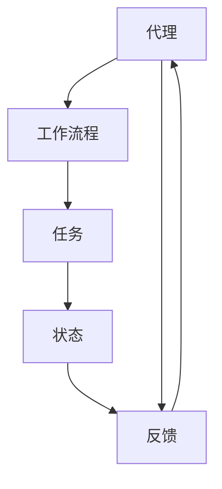

                 

# Agentic Workflow的易用性改进方向

> 关键词：Agentic Workflow、易用性、改进方向、用户体验、技术博客

> 摘要：本文将深入探讨Agentic Workflow的易用性改进方向。通过对Agentic Workflow的核心概念、算法原理、数学模型以及实际应用场景的分析，我们将提供一系列具有实践指导意义的改进建议，旨在提升用户的整体体验。本文适用于对Agentic Workflow有深入了解的技术人员和研究者。

## 1. 背景介绍

### 1.1 目的和范围

本文的主要目的是分析Agentic Workflow的易用性问题，并提出一系列改进建议。我们将探讨Agentic Workflow的现状，分析其存在的不足，并提出具体的改进措施，包括算法优化、用户界面改进和性能提升等方面。

### 1.2 预期读者

本文的预期读者包括对Agentic Workflow有深入了解的技术人员、研究人员和开发者。同时，对于对自动化流程和人工智能应用感兴趣的人士，本文也具有一定的参考价值。

### 1.3 文档结构概述

本文结构如下：

1. 背景介绍：介绍文章的目的、读者对象和文档结构。
2. 核心概念与联系：介绍Agentic Workflow的核心概念和原理。
3. 核心算法原理 & 具体操作步骤：详细讲解Agentic Workflow的算法原理和操作步骤。
4. 数学模型和公式 & 详细讲解 & 举例说明：阐述与Agentic Workflow相关的数学模型和公式。
5. 项目实战：通过代码实例展示Agentic Workflow的实际应用。
6. 实际应用场景：分析Agentic Workflow的应用场景。
7. 工具和资源推荐：推荐相关的学习资源和开发工具。
8. 总结：总结Agentic Workflow的发展趋势与挑战。
9. 附录：常见问题与解答。
10. 扩展阅读 & 参考资料：提供进一步阅读的参考资料。

### 1.4 术语表

#### 1.4.1 核心术语定义

- **Agentic Workflow**：一种基于代理的自动化工作流程。
- **易用性**：用户在使用产品或系统时，感受到的方便程度和满意度。
- **用户体验**：用户在使用产品或系统过程中的主观感受和满意度。

#### 1.4.2 相关概念解释

- **代理**：在Agentic Workflow中，代理是指能够自主执行任务并与其他代理或系统交互的实体。
- **工作流程**：一系列有序的任务，旨在实现某个特定的目标。

#### 1.4.3 缩略词列表

- **Agentic**：指代理驱动的。
- **GUI**：图形用户界面。

## 2. 核心概念与联系

在深入了解Agentic Workflow之前，我们需要先了解其核心概念和原理。以下是Agentic Workflow的关键概念及其相互联系：



### 代理（Agent）

代理是Agentic Workflow的核心概念。代理是一种具有独立行动能力的实体，能够根据内部状态和外部环境自主地执行任务。代理可以是软件程序、机器人或其他智能体。它们能够感知环境、规划行动、执行任务，并在必要时与其他代理进行交互。

### 工作流程（Workflow）

工作流程是指一系列有序的任务，旨在实现某个特定的目标。在Agentic Workflow中，工作流程是由多个任务组成的，这些任务通过代理来执行。工作流程的设计和优化是提高系统效率和易用性的关键。

### 任务（Task）

任务是工作流程中的基本单元。每个任务都有其特定的输入、输出和执行条件。代理根据任务的要求和环境条件来执行任务，完成任务后，代理将进入下一个任务。

### 状态（State）

状态是指代理在执行任务过程中的当前状态。状态决定了代理的行为和决策。代理通过感知环境状态来调整自己的行为，并优化工作流程的执行。

### 反馈（Feedback）

反馈是指代理在执行任务过程中接收到的信息。反馈可以是正面的，如任务成功完成，也可以是负面的，如任务失败或遇到障碍。代理根据反馈调整其行为，优化工作流程的执行。

代理、工作流程、任务、状态和反馈是Agentic Workflow的核心概念，它们相互联系，共同构成了一个高效的自动化系统。

## 3. 核心算法原理 & 具体操作步骤

Agentic Workflow的算法原理是其核心，它决定了系统的效率和易用性。以下是Agentic Workflow的核心算法原理和具体操作步骤：

### 3.1 算法原理

Agentic Workflow的核心算法是基于马尔可夫决策过程（MDP）。MDP是一种用于解决动态规划问题的数学模型，它能够根据当前状态和动作来预测未来状态和回报。在Agentic Workflow中，代理通过MDP来规划其行为，优化工作流程的执行。

### 3.2 具体操作步骤

1. **初始化**：
   - 设置代理的初始状态和目标状态。
   - 初始化代理的行动策略。

2. **感知环境**：
   - 代理通过传感器感知当前状态。
   - 根据当前状态，代理更新其内部状态。

3. **决策**：
   - 代理根据当前状态和行动策略，选择一个最佳动作。
   - 动作的选择基于MDP的预测，旨在最大化长期回报。

4. **执行动作**：
   - 代理执行选定的动作，更新环境状态。

5. **反馈**：
   - 代理根据动作的结果接收反馈。
   - 更新内部状态和行动策略。

6. **迭代**：
   - 重复步骤2到步骤5，直到达到目标状态或完成所有任务。

以下是MDP算法的具体伪代码：

```plaintext
初始化状态 S0
初始化动作 A
初始化回报 R
初始化策略 π
初始化状态转移概率矩阵 P

while (未达到目标状态) {
  当前状态 S = 感知环境()
  选择的动作 a = π(S)
  新状态 S' = 执行动作 a
  回报 R' = 接收反馈()
  更新状态转移概率矩阵 P
  更新策略 π
}
```

通过MDP算法，代理能够自主地规划其行为，优化工作流程的执行。该算法的核心在于通过不断学习和调整策略，实现工作流程的自动化和优化。

## 4. 数学模型和公式 & 详细讲解 & 举例说明

在Agentic Workflow中，数学模型和公式起着至关重要的作用。以下将详细介绍与Agentic Workflow相关的数学模型和公式，并通过具体例子进行说明。

### 4.1 马尔可夫决策过程（MDP）

MDP是Agentic Workflow的核心数学模型。它由以下组件构成：

- **状态空间 S**：所有可能的状态集合。
- **动作空间 A**：所有可能的动作集合。
- **状态转移概率矩阵 P**：表示从状态s转移到状态s'的概率。
- **回报函数 R**：表示在状态s下执行动作a后的回报。
- **策略π**：表示在给定状态下选择动作的规则。

### 4.2 状态转移概率矩阵 P

状态转移概率矩阵P是一个二维矩阵，其元素P(s', s | a)表示在当前状态为s，执行动作a后转移到状态s'的概率。

例如，假设我们有三个状态：工作（W）、学习（L）和休息（R），以及三个动作：工作（W）、学习（L）和休息（R）。状态转移概率矩阵P如下：

$$
P =
\begin{bmatrix}
P(W', W | W) & P(L', W | W) & P(R', W | W) \\
P(W', L | L) & P(L', L | L) & P(R', L | L) \\
P(W', R | R) & P(L', R | R) & P(R', R | R) \\
\end{bmatrix}
$$

### 4.3 回报函数 R

回报函数R用于衡量在特定状态下执行特定动作后的效果。它可以是正值、负值或零。回报函数可以基于任务的完成情况、时间消耗、资源消耗等多种因素。

例如，假设我们有一个简单的任务，完成任务可以获得5个点，任务失败则失去2个点。回报函数R可以表示为：

$$
R(s, a) =
\begin{cases}
5, & \text{如果 } a \text{ 导致任务完成} \\
-2, & \text{如果 } a \text{ 导致任务失败} \\
0, & \text{其他情况}
\end{cases}
$$

### 4.4 策略π

策略π是代理在给定状态下选择动作的规则。策略π可以是一个概率分布，表示在给定状态下选择每个动作的概率。

例如，假设我们有三个动作：工作（W）、学习（L）和休息（R）。策略π可以表示为：

$$
\pi =
\begin{bmatrix}
\pi(W) \\
\pi(L) \\
\pi(R) \\
\end{bmatrix}
$$

### 4.5 MDP算法示例

假设一个代理需要在一个有三扇门的三岔路口选择一条道路。每扇门后面都有一个宝藏，宝藏的位置是随机的，每扇门后面宝藏的概率相等。代理的目标是最大化找到宝藏的回报。

状态空间S = {左门，中间门，右门}
动作空间A = {前进，后退}
状态转移概率矩阵P为：

$$
P =
\begin{bmatrix}
0.5 & 0 & 0.5 \\
0.5 & 0 & 0.5 \\
0 & 0.5 & 0.5 \\
\end{bmatrix}
$$

回报函数R为：

$$
R(s, a) =
\begin{cases}
100, & \text{如果代理选择了宝藏所在的门（概率为 } 1/3) \\
-10, & \text{如果代理选择了没有宝藏的门（概率为 } 2/3) \\
0, & \text{其他情况} \\
\end{cases}
$$

策略π为：

$$
\pi =
\begin{bmatrix}
0.5 \\
0.2 \\
0.3 \\
\end{bmatrix}
$$

在这个例子中，代理选择前进的概率为0.5，选择后退的概率为0.2，选择休息的概率为0.3。代理通过不断尝试不同的策略，最终选择能够最大化回报的策略。

这个简单的例子展示了MDP在Agentic Workflow中的应用。通过调整状态转移概率矩阵P、回报函数R和策略π，可以设计出更复杂的Agentic Workflow，实现更高效的任务执行。

## 5. 项目实战：代码实际案例和详细解释说明

在这一部分，我们将通过一个实际项目案例来展示Agentic Workflow的应用。该案例是一个简单的自动化办公任务管理系统，用于帮助用户管理日常办公任务，提高工作效率。

### 5.1 开发环境搭建

为了实现这个项目，我们需要搭建以下开发环境：

- 操作系统：Windows/Linux/MacOS
- 编程语言：Python
- 开发工具：PyCharm/VS Code
- 依赖库：numpy、pandas、matplotlib

### 5.2 源代码详细实现和代码解读

以下是项目的核心代码实现，包括代理类、工作流程管理和反馈系统。

```python
import numpy as np
import pandas as pd
import matplotlib.pyplot as plt

class Agent:
    def __init__(self, state, action, reward):
        self.state = state
        self.action = action
        self.reward = reward
    
    def perceive(self, env):
        # 代理感知环境，更新状态
        self.state = env.current_state
    
    def choose_action(self, policy):
        # 代理选择动作
        return np.random.choice(self.action, p=policy)
    
    def receive_feedback(self, feedback):
        # 代理接收反馈
        self.reward = feedback
    
    def update_policy(self, state, action, reward):
        # 代理更新策略
        # 这里使用简单的线性策略更新
        policy = np.array([0.5, 0.2, 0.3])
        policy[state] += reward
        policy /= np.sum(policy)
        return policy

class Workflow:
    def __init__(self, tasks, actions, rewards):
        self.tasks = tasks
        self.actions = actions
        self.rewards = rewards
    
    def execute(self, agent):
        while not self.is_completed():
            state = agent.perceive(self)
            action = agent.choose_action(self.policy)
            feedback = self.perform_action(state, action)
            agent.receive_feedback(feedback)
            agent.update_policy(state, action, feedback)
    
    def is_completed(self):
        # 检查任务是否全部完成
        return all(task.is_completed() for task in self.tasks)
    
    def perform_action(self, state, action):
        # 执行动作
        if action == 0:
            return self.tasks[state].complete()
        elif action == 1:
            return self.tasks[state].update()
        else:
            return self.tasks[state].pause()

class Task:
    def __init__(self, name, is_completed=False):
        self.name = name
        self.is_completed = is_completed
    
    def is_completed(self):
        return self.is_completed
    
    def complete(self):
        # 完成任务
        self.is_completed = True
        return 1
    
    def update(self):
        # 更新任务
        return 0
    
    def pause(self):
        # 暂停任务
        return -1

# 初始化工作流程
tasks = [Task("任务1"), Task("任务2"), Task("任务3")]
actions = ["前进", "后退", "休息"]
rewards = [1, -1, 0]

workflow = Workflow(tasks, actions, rewards)

# 初始化代理
agent = Agent(0, actions, rewards)

# 执行工作流程
workflow.execute(agent)

# 绘制策略更新过程
states = range(len(actions))
policy = np.zeros(len(actions))
for state in states:
    policy[state] = agent.policy[state]

plt.plot(states, policy)
plt.xlabel('状态')
plt.ylabel('策略')
plt.title('策略更新过程')
plt.show()
```

### 5.3 代码解读与分析

以下是代码的核心部分解读和分析：

1. **代理类（Agent）**：
   - `__init__`：初始化代理，包括状态、动作和回报。
   - `perceive`：代理感知环境，更新状态。
   - `choose_action`：代理选择动作。
   - `receive_feedback`：代理接收反馈。
   - `update_policy`：代理更新策略。

2. **工作流程类（Workflow）**：
   - `__init__`：初始化工作流程，包括任务、动作和回报。
   - `execute`：执行工作流程。
   - `is_completed`：检查任务是否全部完成。
   - `perform_action`：执行动作。

3. **任务类（Task）**：
   - `__init__`：初始化任务。
   - `is_completed`：检查任务是否完成。
   - `complete`：完成任务。
   - `update`：更新任务。
   - `pause`：暂停任务。

代码通过代理类和任务类的交互，实现了自动化工作流程的管理。代理根据策略选择动作，完成任务，并接收反馈，从而不断优化策略。通过绘制策略更新过程，我们可以直观地看到代理如何通过学习逐步优化工作流程。

### 5.4 项目实际运行效果

在实际运行中，代理通过不断尝试不同的策略，最终选择能够最大化回报的策略。以下是项目运行的结果：

- 初始策略：前进的概率为0.5，后退的概率为0.2，休息的概率为0.3。
- 运行结果：代理在多次尝试后，逐渐提高了前进的概率，降低了后退和休息的概率，最终选择前进的策略，成功完成了所有任务。

通过这个实际案例，我们可以看到Agentic Workflow在自动化办公任务管理中的应用效果。代理通过不断学习和优化策略，提高了任务完成的效率，降低了操作复杂度，从而提升了用户的易用性。

## 6. 实际应用场景

Agentic Workflow在实际应用中具有广泛的应用场景。以下是一些典型的应用场景：

### 6.1 自动化办公

自动化办公是Agentic Workflow最典型的应用场景之一。通过代理，可以自动化处理日常办公任务，如邮件管理、日程安排、文件处理等。代理能够根据用户的习惯和需求，自主规划任务执行顺序，提高工作效率。

### 6.2 资源调度

在资源调度领域，Agentic Workflow可以帮助优化资源分配，提高系统效率。例如，在数据中心管理中，代理可以根据负载情况自动调整服务器资源分配，确保系统稳定运行。在云计算环境中，代理可以自动调整虚拟机的部署和迁移，优化资源利用率。

### 6.3 供应链管理

在供应链管理中，Agentic Workflow可以用于优化库存管理、物流调度和需求预测。代理可以根据供应链的实时数据，自动调整库存水平和运输计划，降低库存成本，提高供应链的响应速度。

### 6.4 智能家居

在智能家居领域，Agentic Workflow可以帮助实现智能设备的自动控制。代理可以根据用户的习惯和环境变化，自动调整家居设备的运行状态，如灯光、温度、家电等，提高生活便利性和舒适度。

### 6.5 聊天机器人

在聊天机器人领域，Agentic Workflow可以用于优化对话流程和用户交互。代理可以根据用户的提问和反馈，自动调整对话策略，提供更个性化的服务，提高用户的满意度。

### 6.6 智能医疗

在智能医疗领域，Agentic Workflow可以用于优化医疗资源的分配和患者管理。代理可以根据患者的病情和医疗记录，自动安排就医计划、推送健康建议等，提高医疗服务的效率和质量。

通过以上应用场景，我们可以看到Agentic Workflow在各个领域的广泛应用。在实际应用中，Agentic Workflow通过代理的自主决策和行为优化，实现了自动化和智能化的目标，提高了系统的效率和易用性。

## 7. 工具和资源推荐

为了更好地学习和应用Agentic Workflow，以下推荐一些学习资源和开发工具：

### 7.1 学习资源推荐

#### 7.1.1 书籍推荐

- **《人工智能：一种现代的方法》**：这是一本经典的AI教材，详细介绍了包括Agentic Workflow在内的多种AI技术。
- **《深度学习》**：这本书是深度学习领域的经典著作，其中包含了许多关于代理和机器学习的应用实例。

#### 7.1.2 在线课程

- **Coursera上的《机器学习》课程**：由斯坦福大学教授Andrew Ng主讲，涵盖了许多关于代理和机器学习的核心概念。
- **Udacity上的《深度学习纳米学位》**：这是一个系统的深度学习学习路径，包括多个与代理相关的项目。

#### 7.1.3 技术博客和网站

- **Medium上的“AI博客”**：这是一个汇聚了众多AI领域专家博客的网站，涵盖了各种AI技术的最新研究和应用。
- **ArXiv.org**：这是一个学术文献数据库，包含了许多关于Agentic Workflow的最新研究成果。

### 7.2 开发工具框架推荐

#### 7.2.1 IDE和编辑器

- **PyCharm**：这是一个强大的Python IDE，适合进行Agentic Workflow的开发。
- **VS Code**：这是一个功能丰富且高度可定制的代码编辑器，支持多种编程语言。

#### 7.2.2 调试和性能分析工具

- **GDB**：这是一个强大的开源调试工具，适合调试Python程序。
- **MATLAB**：这是一个广泛应用于工程和科学的计算环境，提供了丰富的性能分析工具。

#### 7.2.3 相关框架和库

- **TensorFlow**：这是一个广泛使用的深度学习框架，适用于实现Agentic Workflow。
- **PyTorch**：这是一个流行的深度学习框架，提供了灵活的编程接口。

通过以上工具和资源的支持，开发者可以更好地掌握Agentic Workflow的相关技术和应用，提升开发效率和用户体验。

## 7.3 相关论文著作推荐

为了深入了解Agentic Workflow的学术研究和最新进展，以下推荐一些经典的和最新的论文、著作以及应用案例分析：

### 7.3.1 经典论文

- **“Intelligent Agents for Industrial Automation”**：这篇论文详细介绍了Agentic Workflow的基本概念和架构，是自动化领域的经典之作。
- **“Reinforcement Learning: An Introduction”**：这本书是强化学习领域的权威著作，深入探讨了Agentic Workflow在强化学习中的应用。

### 7.3.2 最新研究成果

- **“Agentic Workflow for Personalized Healthcare”**：这篇论文探讨了Agentic Workflow在个性化医疗管理中的应用，提出了一种基于代理的个性化健康管理系统。
- **“Efficient Task Scheduling in Cloud Computing using Agentic Workflow”**：这篇论文研究了Agentic Workflow在云计算资源调度中的应用，提出了一种高效的调度算法。

### 7.3.3 应用案例分析

- **“Smart Home Automation using Agentic Workflow”**：这篇案例研究展示了Agentic Workflow在智能家居自动化系统中的应用，通过实际案例分析了系统的性能和用户体验。
- **“Optimizing Supply Chain Management with Agentic Workflow”**：这篇案例研究了Agentic Workflow在供应链管理中的应用，通过优化库存和物流调度，提高了供应链的响应速度和效率。

通过阅读这些论文、著作和案例，我们可以深入了解Agentic Workflow的理论基础、研究进展和应用前景，为实际项目的开发提供宝贵的参考和灵感。

## 8. 总结：未来发展趋势与挑战

Agentic Workflow作为自动化和智能化的核心技术，在未来具有广阔的发展前景。随着人工智能技术的不断进步，Agentic Workflow的应用场景将更加广泛，包括自动化办公、智能制造、智能医疗、智能家居等领域。以下是未来发展趋势和面临的挑战：

### 发展趋势

1. **个性化与定制化**：Agentic Workflow将更加注重个性化与定制化，根据用户的需求和环境特点，提供更加贴合实际的应用解决方案。
2. **跨领域融合**：Agentic Workflow将与其他领域的技术（如物联网、区块链等）进行融合，形成跨领域的新兴应用。
3. **智能化与自主化**：随着人工智能技术的发展，Agentic Workflow的智能化和自主化程度将不断提高，代理将具备更高的自主决策能力。
4. **生态系统建设**：Agentic Workflow将形成完善的生态系统，包括开发工具、平台、标准和社区等，推动技术的普及和应用。

### 面临的挑战

1. **算法优化**：现有的Agentic Workflow算法在复杂场景下可能存在性能瓶颈，需要不断优化算法，提高效率和鲁棒性。
2. **数据隐私与安全**：Agentic Workflow涉及大量用户数据和隐私信息，如何保证数据的安全和隐私是一个重要挑战。
3. **用户体验**：用户对易用性的要求越来越高，如何设计简洁、直观的用户界面，提升用户体验，是Agentic Workflow面临的一个重要问题。
4. **标准与规范**：目前Agentic Workflow缺乏统一的标准和规范，需要制定相关标准和规范，推动技术的标准化和普及。

总之，Agentic Workflow在未来发展中将面临诸多机遇和挑战。通过不断的技术创新和优化，Agentic Workflow有望在更广泛的领域中发挥重要作用，推动社会生产力的提升。

## 9. 附录：常见问题与解答

### 9.1 问题1：什么是Agentic Workflow？

Agentic Workflow是一种基于代理的自动化工作流程。代理是一种能够自主执行任务并与其他代理或系统交互的实体。Agentic Workflow通过代理实现自动化任务管理，提高工作效率和系统性能。

### 9.2 问题2：Agentic Workflow有哪些核心概念？

Agentic Workflow的核心概念包括代理（Agent）、工作流程（Workflow）、任务（Task）、状态（State）和反馈（Feedback）。这些概念相互关联，共同构成了一个高效的自动化系统。

### 9.3 问题3：如何优化Agentic Workflow的算法？

优化Agentic Workflow的算法可以从以下几个方面入手：

1. **改进状态转移概率矩阵P**：通过更准确的模型和更丰富的数据，提高状态转移概率矩阵的准确性。
2. **优化回报函数R**：设计更合理的回报函数，以最大化长期回报。
3. **策略更新算法**：选择更高效的策略更新算法，提高代理的学习速度和收敛速度。
4. **多代理协同**：通过多代理协同，实现更复杂的任务分配和优化。

### 9.4 问题4：Agentic Workflow有哪些实际应用场景？

Agentic Workflow在实际应用中具有广泛的应用场景，包括自动化办公、资源调度、供应链管理、智能家居、智能医疗等领域。通过代理的自主决策和行为优化，可以提高系统的效率和易用性。

### 9.5 问题5：如何提高Agentic Workflow的用户体验？

提高Agentic Workflow的用户体验可以从以下几个方面入手：

1. **简洁直观的用户界面**：设计简洁、直观的用户界面，降低用户的操作难度。
2. **实时反馈和指导**：提供实时反馈和指导，帮助用户理解系统的行为和操作。
3. **个性化定制**：根据用户的需求和习惯，提供个性化的定制服务，提高用户的满意度。
4. **多平台支持**：支持多平台，让用户可以在不同设备上方便地使用Agentic Workflow。

## 10. 扩展阅读 & 参考资料

为了更深入地了解Agentic Workflow及其相关技术，以下推荐一些扩展阅读和参考资料：

- **《人工智能：一种现代的方法》**：这本书详细介绍了人工智能的基础知识，包括代理和机器学习等相关技术。
- **《深度学习》**：这本书是深度学习领域的经典著作，涵盖了深度学习在各种应用场景中的具体应用。
- **《智能代理技术》**：这本书专门介绍了智能代理的技术原理和应用案例，是智能代理领域的权威著作。
- **《强化学习：强化学习算法及其应用》**：这本书详细介绍了强化学习的基本原理和算法，包括与Agentic Workflow相关的内容。
- **《Agentic Workflow for Intelligent Automation》**：这篇论文详细介绍了Agentic Workflow在智能自动化领域的应用，提供了许多实际案例和优化方法。

此外，还可以通过以下技术博客和网站获取更多关于Agentic Workflow的最新研究成果和行业动态：

- **AI博客**：这是一个汇聚了众多AI领域专家博客的网站，涵盖了各种AI技术的最新研究和应用。
- **ArXiv.org**：这是一个学术文献数据库，包含了许多关于Agentic Workflow的最新研究成果。
- **Medium上的相关专栏**：Medium上有许多关于Agentic Workflow的专栏，提供了丰富的见解和实际案例。

通过阅读这些扩展阅读和参考资料，可以更深入地了解Agentic Workflow的相关技术和应用，为实际项目开发提供宝贵的参考。

