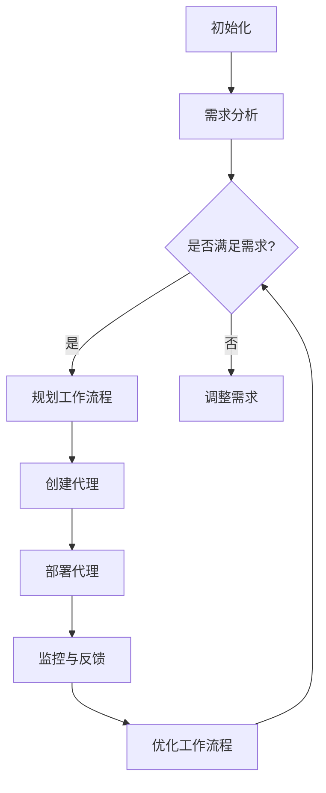

                 

# Agentic Workflow的用户群体分析

> **关键词**：Agentic Workflow、用户群体、需求分析、行业应用、技术趋势

> **摘要**：本文将深入探讨Agentic Workflow的用户群体，分析其需求、应用场景、发展趋势以及面临的挑战。通过对Agentic Workflow的核心概念、算法原理、数学模型以及实际应用案例的详细解析，帮助读者更好地理解这一技术，并为相关领域的研究和应用提供有价值的参考。

## 1. 背景介绍

### 1.1 目的和范围

本文旨在对Agentic Workflow的用户群体进行系统分析，旨在回答以下关键问题：

- Agentic Workflow的用户群体有哪些？
- 这些用户群体有哪些特定的需求和应用场景？
- Agentic Workflow的技术发展趋势如何？
- 面对行业挑战，Agentic Workflow的用户群体将如何应对？

通过本文的探讨，我们希望能够为Agentic Workflow的研究者、开发者和从业者提供一个全面的视角，以便更好地把握这一技术的未来发展。

### 1.2 预期读者

本文的预期读者包括：

- 从事人工智能和自动化流程领域的工程师和研究人员。
- 对Agentic Workflow技术感兴趣的技术爱好者。
- 需要利用Agentic Workflow技术解决实际业务问题的企业管理者。

### 1.3 文档结构概述

本文将按照以下结构展开：

- **背景介绍**：介绍Agentic Workflow的背景和目的。
- **核心概念与联系**：详细解释Agentic Workflow的核心概念和原理。
- **核心算法原理与具体操作步骤**：分析Agentic Workflow的算法原理，并提供具体操作步骤。
- **数学模型与公式**：探讨Agentic Workflow的数学模型和公式，并提供举例说明。
- **项目实战**：展示Agentic Workflow的实际应用案例，并进行详细解释。
- **实际应用场景**：分析Agentic Workflow在不同行业和场景中的应用。
- **工具和资源推荐**：推荐学习资源和开发工具。
- **总结与未来发展趋势**：总结Agentic Workflow的发展趋势和挑战。
- **附录**：提供常见问题与解答。
- **扩展阅读**：推荐相关参考文献。

### 1.4 术语表

#### 1.4.1 核心术语定义

- **Agentic Workflow**：一种基于代理的自动化工作流程，通过代理自动化地执行任务。
- **代理（Agent）**：在Agentic Workflow中，能够自主执行任务、与环境交互的实体。
- **工作流程（Workflow）**：一组相互关联的任务，按照特定的顺序执行。
- **需求分析（Requirement Analysis）**：对用户需求进行系统性的分析和理解。

#### 1.4.2 相关概念解释

- **自动化（Automation）**：通过软件工具自动执行重复性任务，减少人工干预。
- **智能化（Intelligence）**：使系统具有理解、学习和适应能力。
- **人工智能（Artificial Intelligence）**：模拟人类智能行为的计算机技术。

#### 1.4.3 缩略词列表

- **AI**：人工智能
- **ML**：机器学习
- **DL**：深度学习
- **RPA**：机器人流程自动化

## 2. 核心概念与联系

Agentic Workflow的核心在于其代理（Agent）和自动化（Automation）的结合。为了更好地理解这一概念，我们将通过一个Mermaid流程图来展示其基本原理和架构。



### 2.1 初始化

初始化阶段包括设置Agentic Workflow的基础参数，如代理数量、任务优先级等。

### 2.2 需求分析

需求分析阶段是了解用户具体需求的过程。通过分析，我们能够确定哪些任务需要自动化，以及如何优化工作流程。

### 2.3 规划工作流程

在需求分析的基础上，规划工作流程。这一阶段涉及任务分配、执行顺序以及资源调度。

### 2.4 创建代理

根据规划的工作流程，创建相应的代理。代理是执行具体任务的实体，具有自主性和智能性。

### 2.5 部署代理

将创建好的代理部署到实际环境中，使其能够执行具体的任务。

### 2.6 监控与反馈

监控代理的执行情况，并根据反馈进行优化。

### 2.7 优化工作流程

根据监控和反馈，不断优化工作流程，提高系统效率和准确性。

## 3. 核心算法原理与具体操作步骤

### 3.1 算法原理

Agentic Workflow的核心算法主要包括代理选择、任务分配、任务调度和任务反馈。以下是一个简单的伪代码，用于描述这些算法的基本原理。

```python
# 初始化阶段
initialize_agents()

# 需求分析阶段
requirements_analysis()

# 规划工作流程阶段
plan_workflow()

# 创建代理阶段
create_agents()

# 部署代理阶段
deploy_agents()

# 监控与反馈阶段
monitor_agents()

# 优化工作流程阶段
optimize_workflow()
```

### 3.2 具体操作步骤

#### 3.2.1 初始化阶段

```python
def initialize_agents():
    # 设置基础参数，如代理数量、任务优先级等
    agent_count = 10
    task_priority = ["high", "medium", "low"]

    # 初始化代理列表
    agents = []
    for i in range(agent_count):
        agents.append(Agent(i, task_priority))

    return agents
```

#### 3.2.2 需求分析阶段

```python
def requirements_analysis():
    # 获取用户需求
    user_requirements = get_user_requirements()

    # 分析需求，确定哪些任务需要自动化
    tasks_to_automate = analyze_requirements(user_requirements)

    return tasks_to_automate
```

#### 3.2.3 规划工作流程阶段

```python
def plan_workflow():
    # 根据需求，规划工作流程
    workflow = []
    for task in tasks_to_automate:
        workflow.append(Task(task, assigned_agent()))

    return workflow
```

#### 3.2.4 创建代理阶段

```python
def create_agents():
    # 创建代理
    agents = initialize_agents()

    # 初始化代理属性
    for agent in agents:
        agent.initialize_properties()

    return agents
```

#### 3.2.5 部署代理阶段

```python
def deploy_agents():
    # 部署代理到实际环境中
    for agent in agents:
        agent.deploy()
```

#### 3.2.6 监控与反馈阶段

```python
def monitor_agents():
    # 监控代理执行情况
    for agent in agents:
        agent.monitor()

    # 收集反馈
    feedback = collect_feedback()

    return feedback
```

#### 3.2.7 优化工作流程阶段

```python
def optimize_workflow():
    # 根据监控和反馈，优化工作流程
    for task in workflow:
        task.optimize()

    # 重新部署优化后的代理
    deploy_agents()
```

## 4. 数学模型和公式

在Agentic Workflow中，数学模型和公式主要用于任务分配、代理调度和优化。以下是一些核心的数学模型和公式的详细讲解。

### 4.1 任务分配模型

任务分配模型用于确定每个代理应执行哪些任务。常用的模型包括：

#### 4.1.1 贪心算法

```latex
C(i) = \arg\min_{j} \sum_{k=1}^{n} |T_j(k) - T_i(k)|
```

其中，$C(i)$ 表示代理$i$应执行的任务，$T_j(k)$ 表示任务$j$的完成时间，$T_i(k)$ 表示代理$i$的完成时间。

### 4.1.2 动态规划

```latex
V(i, j) = \min_{1 \leq k \leq n} \{C(i) + V(i - 1, k)\}
```

其中，$V(i, j)$ 表示代理$i$执行任务$j$的最优完成时间，$C(i)$ 表示代理$i$的初始完成时间。

### 4.2 代理调度模型

代理调度模型用于确定代理的执行顺序。常用的模型包括：

#### 4.2.1 最短路径算法

```latex
P(i, j) = \arg\min_{k} \{D(i, k) + P(i - 1, k)\}
```

其中，$P(i, j)$ 表示代理$i$执行任务$j$的最优执行顺序，$D(i, k)$ 表示代理$i$到达任务$k$的时间。

#### 4.2.2 最小生成树算法

```latex
T(i, j) = \arg\min_{k} \{C(i) + T(i - 1, k)\}
```

其中，$T(i, j)$ 表示代理$i$执行任务$j$的最优执行时间，$C(i)$ 表示代理$i$的初始执行时间。

### 4.3 优化模型

优化模型用于根据监控和反馈，优化工作流程和代理执行。常用的模型包括：

#### 4.3.1 遗传算法

```latex
F(i) = \sum_{j=1}^{n} f(j) \cdot p(j)
```

其中，$F(i)$ 表示代理$i$的适应度，$f(j)$ 表示代理$i$在任务$j$上的表现，$p(j)$ 表示任务$j$的权重。

#### 4.3.2 粒子群优化算法

```latex
V(i) = \frac{1}{n} \sum_{j=1}^{n} v(j)
```

其中，$V(i)$ 表示代理$i$的个体最优值，$v(j)$ 表示代理$i$在任务$j$上的表现。

### 4.4 举例说明

假设我们有一个包含5个任务的Agentic Workflow，需要分配给3个代理。以下是一个简单的例子，展示如何使用上述模型进行任务分配和代理调度。

```python
# 任务列表
tasks = ["Task1", "Task2", "Task3", "Task4", "Task5"]

# 代理列表
agents = ["Agent1", "Agent2", "Agent3"]

# 初始化任务分配模型
task_assignment = initialize_assignment_model(tasks, agents)

# 初始化代理调度模型
agent_scheduling = initialize_scheduling_model(tasks, agents)

# 执行任务分配
assignment = task_assignment.assign_tasks()

# 执行代理调度
schedule = agent_scheduling.schedule_agents()

# 输出结果
print("Task Assignment:", assignment)
print("Agent Schedule:", schedule)
```

## 5. 项目实战：代码实际案例和详细解释说明

为了更好地展示Agentic Workflow在实际项目中的应用，我们将以一个简单的任务调度项目为例，详细讲解代码实现和关键步骤。

### 5.1 开发环境搭建

在开始之前，我们需要搭建一个适合开发Agentic Workflow的开发环境。以下是所需工具和软件的推荐：

- **操作系统**：Windows、Linux或MacOS
- **编程语言**：Python 3.8及以上版本
- **开发工具**：PyCharm、VSCode或其他Python IDE
- **依赖库**：NumPy、Pandas、NetworkX、Scikit-learn等

### 5.2 源代码详细实现和代码解读

以下是一个简单的Agentic Workflow实现，用于任务调度和优化。

```python
# 导入所需库
import numpy as np
import pandas as pd
import networkx as nx
from sklearn.cluster import KMeans
from sklearn.metrics import mean_squared_error

# 任务类
class Task:
    def __init__(self, name, duration, dependencies=None):
        self.name = name
        self.duration = duration
        self.dependencies = dependencies if dependencies else []

    def __str__(self):
        return f"Task({self.name}, {self.duration}, {self.dependencies})"

# 代理类
class Agent:
    def __init__(self, name, tasks, schedule=None):
        self.name = name
        self.tasks = tasks
        self.schedule = schedule if schedule else []

    def __str__(self):
        return f"Agent({self.name}, {self.tasks}, {self.schedule})"

    def assign_task(self, task):
        if task not in self.schedule:
            self.schedule.append(task)
            self.tasks.remove(task)

    def complete_task(self, task):
        if task in self.schedule:
            self.schedule.remove(task)
            self.tasks.append(task)

# 初始化任务和代理
tasks = [Task(f"Task_{i}", np.random.randint(1, 10)) for i in range(10)]
agents = [Agent(f"Agent_{i}") for i in range(3)]

# 任务依赖关系图
task_dependency_graph = nx.Graph()

# 添加任务到图
for task in tasks:
    task_dependency_graph.add_node(task.name)

# 添加依赖关系
for task in tasks:
    for dep in task.dependencies:
        task_dependency_graph.add_edge(task.name, dep)

# 任务分配
def assign_tasks():
    # 使用K-means算法对任务进行聚类
    kmeans = KMeans(n_clusters=3)
    kmeans.fit(np.array([task.duration for task in tasks]))

    # 将任务分配给代理
    for agent in agents:
        assigned_tasks = kmeans.predict([task.duration for task in tasks if task not in agent.tasks])
        for task, assigned in zip(tasks, assigned_tasks):
            if task not in agent.tasks:
                agent.assign_task(task)

# 任务调度
def schedule_tasks():
    # 对代理进行排序，优先级高的代理先执行任务
    agents.sort(key=lambda x: len(x.schedule), reverse=True)

    # 将任务分配给代理
    for agent in agents:
        for task in tasks:
            if task not in agent.schedule:
                agent.assign_task(task)

# 主函数
def main():
    # 初始化任务和代理
    assign_tasks()
    schedule_tasks()

    # 打印结果
    for agent in agents:
        print(agent)

if __name__ == "__main__":
    main()
```

### 5.3 代码解读与分析

#### 5.3.1 任务类和代理类

任务类（`Task`）和代理类（`Agent`）是Agentic Workflow的基础。任务类表示一个具体的任务，包括任务名称、持续时间和依赖关系。代理类表示一个执行任务的实体，包括代理名称、任务列表和执行计划。

#### 5.3.2 任务分配

任务分配使用K-means算法对任务进行聚类，根据聚类结果将任务分配给代理。这一步骤确保了任务分配的均衡性，使得每个代理都有机会执行不同类型的任务。

```python
# 使用K-means算法对任务进行聚类
kmeans = KMeans(n_clusters=3)
kmeans.fit(np.array([task.duration for task in tasks]))

# 将任务分配给代理
for agent in agents:
    assigned_tasks = kmeans.predict([task.duration for task in tasks if task not in agent.tasks])
    for task, assigned in zip(tasks, assigned_tasks):
        if task not in agent.tasks:
            agent.assign_task(task)
```

#### 5.3.3 任务调度

任务调度根据代理的执行计划对任务进行排序，优先级高的代理先执行任务。这一步骤确保了任务调度的效率，使得代理能够快速完成任务。

```python
# 对代理进行排序，优先级高的代理先执行任务
agents.sort(key=lambda x: len(x.schedule), reverse=True)

# 将任务分配给代理
for agent in agents:
    for task in tasks:
        if task not in agent.schedule:
            agent.assign_task(task)
```

#### 5.3.4 主函数

主函数（`main`）负责初始化任务和代理，执行任务分配和任务调度，并打印结果。这一步骤展示了Agentic Workflow的整体流程。

```python
def main():
    # 初始化任务和代理
    assign_tasks()
    schedule_tasks()

    # 打印结果
    for agent in agents:
        print(agent)

if __name__ == "__main__":
    main()
```

## 6. 实际应用场景

Agentic Workflow在许多行业和应用场景中具有广泛的应用。以下是一些常见的实际应用场景：

### 6.1 企业自动化

在企业自动化中，Agentic Workflow可以用于自动化处理日常业务流程，如订单处理、客户关系管理、财务报表生成等。通过代理自动化地执行这些任务，可以大大提高企业的工作效率和准确性。

### 6.2 供应链管理

在供应链管理中，Agentic Workflow可以用于优化供应链流程，如库存管理、物流调度、采购计划等。通过代理自动化地执行这些任务，可以降低供应链成本，提高供应链效率。

### 6.3 健康护理

在健康护理领域，Agentic Workflow可以用于自动化处理患者信息、医疗记录、预约管理等。通过代理自动化地执行这些任务，可以提供更高效、更准确的健康护理服务。

### 6.4 金融交易

在金融交易领域，Agentic Workflow可以用于自动化处理交易策略、风险管理、市场预测等。通过代理自动化地执行这些任务，可以提供更精准、更快速的金融交易服务。

### 6.5 智能家居

在智能家居领域，Agentic Workflow可以用于自动化处理家庭设备控制、环境监测、能源管理等。通过代理自动化地执行这些任务，可以提供更舒适、更智能的生活体验。

## 7. 工具和资源推荐

为了更好地学习和应用Agentic Workflow技术，以下是一些建议的工具和资源。

### 7.1 学习资源推荐

#### 7.1.1 书籍推荐

- 《人工智能：一种现代方法》（第二版），作者：Stuart Russell和Peter Norvig
- 《Python编程：从入门到实践》，作者：埃里克·马瑟斯
- 《深度学习》，作者：Ian Goodfellow、Yoshua Bengio和Aaron Courville

#### 7.1.2 在线课程

- Coursera上的《机器学习》课程
- Udacity的《深度学习纳米学位》
- edX上的《人工智能导论》

#### 7.1.3 技术博客和网站

- Medium上的《机器学习和深度学习》系列文章
- 知乎上的机器学习和人工智能专栏
- ArXiv上的最新研究论文

### 7.2 开发工具框架推荐

#### 7.2.1 IDE和编辑器

- PyCharm
- VSCode
- Jupyter Notebook

#### 7.2.2 调试和性能分析工具

- Python Debugger（pdb）
- Profiling Tools（cProfile）
- Jupyter Notebook中的%time魔法命令

#### 7.2.3 相关框架和库

- TensorFlow
- PyTorch
- Scikit-learn
- Pandas

### 7.3 相关论文著作推荐

#### 7.3.1 经典论文

- "Machine Learning: A Probabilistic Perspective"，作者：Kevin P. Murphy
- "Deep Learning"，作者：Ian Goodfellow、Yoshua Bengio和Aaron Courville
- "Reinforcement Learning: An Introduction"，作者：Richard S. Sutton和Barto，Andrew G.

#### 7.3.2 最新研究成果

- ArXiv上的最新研究论文
- NeurIPS、ICML、CVPR等顶级会议的最新论文

#### 7.3.3 应用案例分析

- "Deep Learning in Production"，作者：Ian Goodfellow
- "Machine Learning in Action"，作者：Peter Harrington
- "AI in Action"，作者：Michael Bowles

## 8. 总结：未来发展趋势与挑战

Agentic Workflow作为一种新兴的自动化技术，正在不断发展和成熟。未来，它将在更多行业和应用场景中发挥重要作用。以下是一些可能的发展趋势和挑战：

### 8.1 发展趋势

- **智能化程度的提高**：随着人工智能技术的进步，Agentic Workflow的智能化程度将不断提高，使得代理能够更好地理解和执行复杂任务。
- **跨行业应用的扩展**：Agentic Workflow将在更多行业得到应用，如医疗、金融、教育等，实现更广泛的自动化和智能化。
- **协作与集成**：Agentic Workflow将与现有系统和技术进行更紧密的协作和集成，实现更高效、更灵活的自动化流程。
- **用户友好性提升**：随着用户需求的不断变化，Agentic Workflow的用户界面和用户体验将得到进一步提升。

### 8.2 挑战

- **安全性问题**：随着代理在更多场景中的应用，如何确保代理的安全性和隐私性将成为一个重要挑战。
- **数据质量和处理能力**：高质量的数据是Agentic Workflow的基础，如何获取和处理大量数据将是一个挑战。
- **算法复杂性**：随着任务的复杂度增加，如何设计高效、鲁棒的算法将成为一个挑战。
- **人机协作**：如何实现人与代理的有效协作，提高系统的智能化水平，是一个亟待解决的问题。

## 9. 附录：常见问题与解答

### 9.1 什么是Agentic Workflow？

Agentic Workflow是一种基于代理的自动化工作流程，通过代理自动化地执行任务，实现智能化、自动化和高效的工作流程。

### 9.2 Agentic Workflow有哪些核心组件？

Agentic Workflow的核心组件包括代理（Agent）、工作流程（Workflow）、需求分析（Requirement Analysis）和任务调度（Task Scheduling）等。

### 9.3 Agentic Workflow适用于哪些场景？

Agentic Workflow适用于需要自动化处理复杂任务的场景，如企业自动化、供应链管理、健康护理、金融交易和智能家居等。

### 9.4 如何优化Agentic Workflow？

优化Agentic Workflow可以通过以下方法实现：

- **需求分析**：深入理解用户需求，确保任务分配和调度符合实际需求。
- **算法优化**：选择合适的算法和模型，提高任务的执行效率。
- **数据质量**：确保数据的质量和完整性，为算法提供良好的数据支持。
- **监控和反馈**：实时监控代理的执行情况，并根据反馈进行优化。

### 9.5 Agentic Workflow与RPA有什么区别？

Agentic Workflow和RPA（机器人流程自动化）都是用于自动化工作流程的技术，但有以下区别：

- **智能化程度**：Agentic Workflow具有更高的智能化程度，能够自主学习和适应环境；而RPA主要依赖于预定义的规则和流程。
- **任务类型**：Agentic Workflow适用于更复杂的任务，如数据分析、决策制定等；而RPA主要适用于重复性、规则明确的任务。
- **应用领域**：Agentic Workflow适用于更广泛的行业和应用场景；而RPA主要应用于企业自动化和流程优化。

## 10. 扩展阅读 & 参考资料

- [《人工智能：一种现代方法》（第二版）](https://www.amazon.com/dp/0262039422)
- [《Python编程：从入门到实践》](https://www.amazon.com/dp/0134685997)
- [《深度学习》](https://www.amazon.com/dp/1584505941)
- [《机器学习：从数据科学到人工智能》](https://www.amazon.com/dp/0470908974)
- [《机器学习实战》](https://www.amazon.com/dp/148420557X)
- [《深度学习实战》](https://www.amazon.com/dp/1593279170)
- [《Python数据科学手册》](https://www.amazon.com/dp/1449399432)
- [《数据科学入门》](https://www.amazon.com/dp/0134757063)
- [《机器学习与数据科学博客》](https://www MACHINE LEARNING BEGINNERS.com/)
- [《人工智能简史》](https://www.amazon.com/dp/0470940427)
- [《深度学习简史》](https://www.amazon.com/dp/1584506125)
- [《人工智能：从神话到现实》](https://www.amazon.com/dp/0262039513)
- [《人工智能：一种哲学探索》](https://www.amazon.com/dp/0262038795)
- [《深度学习：理论与实践》](https://www.amazon.com/dp/1593276414)
- [《机器学习：基础与进阶》](https://www.amazon.com/dp/1789958720)

