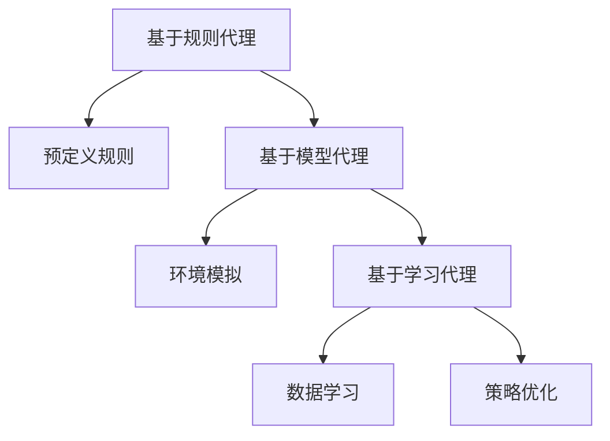
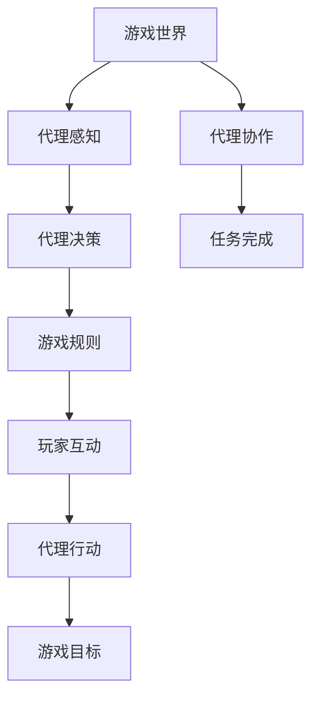
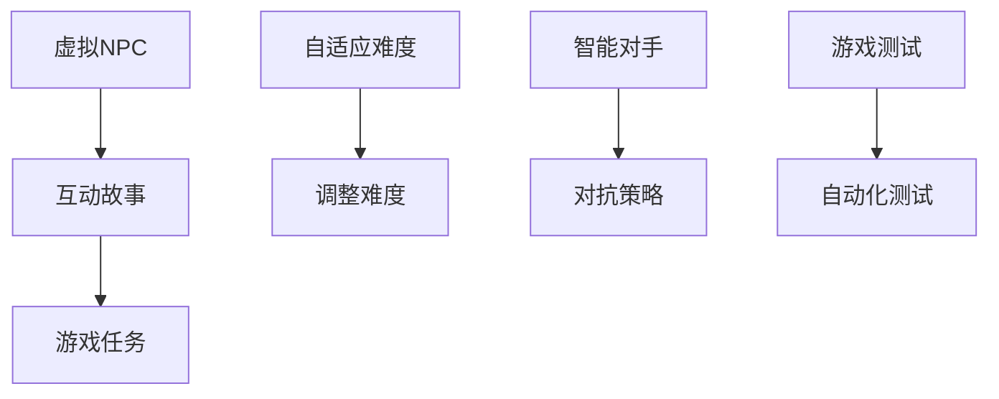

                 

# Agent与游戏的结合

## 关键词
- 人工智能
- 游戏化
- 代理（Agent）
- 游戏引擎
- 强化学习
- 联合策略学习
- 多智能体系统

## 摘要
本文将探讨人工智能代理与游戏结合的多种可能性，通过逐步分析代理的定义、游戏的核心机制以及代理在游戏中的角色，揭示强化学习与多智能体系统在游戏开发中的应用。文章还将通过实际案例展示如何使用这些技术实现智能游戏，并讨论未来发展趋势与挑战。通过本文的阅读，读者将深入了解代理与游戏结合的深层次技术原理，以及对游戏产业的潜在影响。

## 1. 背景介绍

### 1.1 目的和范围
本文旨在探讨人工智能代理在游戏领域的应用，重点分析代理的基本概念、游戏机制与人工智能的融合方式，并探讨其在实际游戏开发中的应用前景。文章将涵盖以下内容：
- 代理的定义和分类；
- 游戏机制与人工智能结合的方法；
- 强化学习与多智能体系统在游戏中的应用；
- 实际案例展示与代码解读；
- 未来发展趋势与挑战。

### 1.2 预期读者
本文适合对人工智能和游戏开发有一定了解的技术人员、研究人员和爱好者阅读。特别是对以下主题感兴趣的读者：
- 人工智能在游戏中的应用；
- 强化学习与多智能体系统的原理与实践；
- 游戏开发与游戏引擎的使用。

### 1.3 文档结构概述
本文分为以下几个部分：
1. 引言与背景介绍；
2. 核心概念与联系；
3. 核心算法原理与具体操作步骤；
4. 数学模型与公式；
5. 项目实战：代码实际案例和详细解释说明；
6. 实际应用场景；
7. 工具和资源推荐；
8. 总结：未来发展趋势与挑战；
9. 附录：常见问题与解答；
10. 扩展阅读与参考资料。

### 1.4 术语表

#### 1.4.1 核心术语定义
- **代理（Agent）**：在人工智能中，代理是指具有感知环境、作出决策并采取行动能力的实体。代理可以是计算机程序、机器人或虚拟智能体。
- **强化学习（Reinforcement Learning）**：一种机器学习方法，通过智能体与环境交互，根据反馈信号（奖励或惩罚）不断调整行为策略，以实现目标。
- **多智能体系统（Multi-Agent Systems）**：由多个代理组成的系统，代理之间可以通过协作、竞争或自治进行交互。
- **游戏引擎（Game Engine）**：用于开发、运行和模拟游戏的核心软件框架，通常提供图形渲染、物理模拟、音频处理等高级功能。

#### 1.4.2 相关概念解释
- **游戏化（Gamification）**：将游戏设计的元素和机制应用于非游戏环境中，以提高参与度和用户体验。
- **联合策略学习（Joint Policy Learning）**：在多智能体系统中，同时优化多个代理的策略，以实现共同目标。
- **智能游戏（Intelligent Game）**：使用人工智能技术增强游戏体验和智能程度，包括自适应难度、智能对手等。

#### 1.4.3 缩略词列表
- **AI**：人工智能
- **RL**：强化学习
- **MAS**：多智能体系统
- **GDPR**：通用数据保护条例
- **IDE**：集成开发环境

## 2. 核心概念与联系

在本节中，我们将首先介绍代理的基本概念和分类，然后分析游戏的核心机制，并展示代理在游戏中的应用和作用。为了更好地理解这些概念，我们将使用Mermaid流程图来展示代理与游戏机制之间的关联。

### 2.1 代理的定义和分类

代理是一种具有自主性和交互能力的实体，可以感知环境、制定决策并采取行动。根据代理的自主性、交互方式和目标，可以将其分为以下几类：

1. **基于规则的代理**：使用预定义的规则来感知环境和作出决策。
2. **基于模型的代理**：使用模型来模拟环境，并基于模型预测来作出决策。
3. **基于学习的代理**：通过学习环境中的数据，调整其行为策略，以优化性能。

#### Mermaid流程图：代理分类



### 2.2 游戏机制与代理的融合

游戏机制包括游戏世界、玩家、游戏规则和目标等要素。代理可以嵌入到这些要素中，以增强游戏的互动性和智能性。以下是几种常见的游戏机制与代理的融合方式：

1. **智能对手**：代理可以作为玩家的对手，使用强化学习或基于模型的策略与玩家进行对抗。
2. **自适应难度**：代理可以根据玩家的表现调整游戏的难度，以保持挑战性。
3. **虚拟NPC**：代理可以模拟非玩家角色（NPC），与玩家进行交互，提供故事情节和游戏任务。
4. **协作机制**：代理可以与其他代理或玩家合作，共同完成任务或达成目标。

#### Mermaid流程图：代理与游戏机制的融合



### 2.3 代理在游戏中的应用和作用

代理在游戏中的应用非常广泛，可以提升游戏的智能性、互动性和用户体验。以下是一些具体的代理应用场景：

1. **虚拟NPC**：代理可以模拟各种角色，如商人、守卫、怪物等，与玩家互动，提供故事情节和游戏任务。
2. **自适应难度**：代理可以根据玩家的表现调整游戏难度，以保持挑战性。例如，当玩家表现出色时，增加游戏难度；当玩家失败时，降低难度。
3. **智能对手**：代理可以作为玩家的对手，使用强化学习或基于模型的策略与玩家进行对抗，提高游戏的可玩性和挑战性。
4. **游戏测试**：代理可以用于自动化测试游戏，确保游戏在不同设备和平台上的稳定运行。

#### Mermaid流程图：代理在游戏中的应用



通过以上对代理的定义和分类、游戏机制与代理的融合、以及代理在游戏中的应用和作用的介绍，我们可以看到代理在游戏开发中的巨大潜力。接下来，我们将深入探讨代理与游戏结合的核心算法原理，并详细解释这些算法的具体操作步骤。

## 3. 核心算法原理 & 具体操作步骤

在本节中，我们将详细探讨代理与游戏结合的核心算法原理，并给出具体的操作步骤。这些算法包括强化学习（Reinforcement Learning，RL）和多智能体系统（Multi-Agent Systems，MAS），它们是游戏开发中实现智能行为的关键技术。

### 3.1 强化学习算法原理

强化学习是一种通过试错学习来最大化累积奖励的机器学习方法。在强化学习中，智能体（agent）通过与环境的交互来学习最优策略。以下是强化学习的基本组成部分和操作步骤：

#### 3.1.1 基本组成部分

- **智能体（Agent）**：执行动作并接收环境反馈的主体。
- **环境（Environment）**：智能体行动的场所，提供状态和奖励信号。
- **状态（State）**：智能体所处的情境。
- **动作（Action）**：智能体可以执行的行为。
- **策略（Policy）**：智能体在特定状态下的最优动作选择。
- **价值函数（Value Function）**：评估状态的价值，用于指导策略选择。
- **模型（Model）**：对环境状态的表示，用于预测未来状态。

#### 3.1.2 操作步骤

1. **初始化**：设定智能体和环境的初始状态，初始化策略和价值函数。
2. **感知状态**：智能体感知当前状态。
3. **执行动作**：智能体根据当前策略执行动作。
4. **获得反馈**：环境根据动作提供状态转移和奖励信号。
5. **更新策略**：使用反馈信号更新策略和价值函数。
6. **重复步骤 2-5**：继续与环境交互，优化策略。

#### 3.1.3 伪代码

```python
def reinforce_learning():
    state = env.initialize()
    policy = initialize_policy()
    while not done:
        action = policy(state)
        next_state, reward, done = env.step(action)
        update_policy(policy, state, action, reward, next_state)
        state = next_state
    return policy
```

### 3.2 多智能体系统算法原理

多智能体系统涉及多个智能体的交互和合作，以实现共同的目标。在MAS中，智能体可以采取联合策略学习（Joint Policy Learning）来优化整体性能。以下是MAS的基本组成部分和操作步骤：

#### 3.2.1 基本组成部分

- **智能体（Agent）**：具有自主性和交互能力的实体。
- **环境（Environment）**：智能体共同行动的场所。
- **状态（State）**：所有智能体共同感知的环境信息。
- **动作（Action）**：智能体可以执行的行为。
- **策略（Policy）**：智能体的行为选择。
- **交互模型（Interaction Model）**：描述智能体之间的交互方式。
- **协同目标（Collaborative Goals）**：智能体共同追求的目标。

#### 3.2.2 操作步骤

1. **初始化**：设定智能体的初始状态和策略。
2. **状态感知**：智能体感知当前状态。
3. **联合策略学习**：智能体通过交互学习联合策略。
4. **执行动作**：智能体根据联合策略执行动作。
5. **获得反馈**：环境根据动作提供状态转移和奖励信号。
6. **更新策略**：使用反馈信号更新联合策略。
7. **重复步骤 2-6**：继续与环境交互，优化联合策略。

#### 3.2.3 伪代码

```python
def joint_policy_learning():
    state = env.initialize()
    joint_policy = initialize_joint_policy()
    while not done:
        actions = joint_policy(state)
        next_state, reward, done = env.step(actions)
        update_joint_policy(joint_policy, state, actions, reward, next_state)
        state = next_state
    return joint_policy
```

通过以上对强化学习算法和多智能体系统算法的原理和操作步骤的介绍，我们可以看到这些算法在实现智能代理和行为优化方面的重要性。接下来，我们将探讨数学模型和公式，并给出详细的讲解和举例说明。

## 4. 数学模型和公式 & 详细讲解 & 举例说明

在游戏开发中，数学模型和公式是核心算法的基础，用于描述智能代理的行为和策略。以下我们将介绍强化学习中的价值函数、策略优化方法，以及多智能体系统中的联合策略学习模型。我们将使用LaTeX格式展示数学公式，并给出相应的详细讲解和举例说明。

### 4.1 强化学习中的价值函数

强化学习中的价值函数是评估状态和动作对目标的影响，用于指导智能体的策略选择。价值函数分为状态价值函数（State-Value Function）和动作价值函数（Action-Value Function）。

#### 4.1.1 状态价值函数（V(s)）

状态价值函数 \( V(s) \) 表示在状态 \( s \) 下采取最优动作所能获得的累积奖励。

\[ V(s) = \sum_{a} \gamma^T Q(s, a) \]

其中：
- \( \gamma \) 是折扣因子，表示未来奖励的现值；
- \( T \) 是时间步数；
- \( Q(s, a) \) 是动作价值函数。

#### 4.1.2 动作价值函数（Q(s, a)）

动作价值函数 \( Q(s, a) \) 表示在状态 \( s \) 下采取动作 \( a \) 所能获得的累积奖励。

\[ Q(s, a) = \sum_{s'} P(s' | s, a) \sum_{r} r \]

其中：
- \( P(s' | s, a) \) 是状态转移概率；
- \( r \) 是即时奖励。

#### 4.1.3 举例说明

假设一个智能体在游戏中的状态空间为 \( S = \{s_1, s_2, s_3\} \)，动作空间为 \( A = \{a_1, a_2, a_3\} \)。状态转移概率和即时奖励如下表所示：

| 状态 | 动作 | 下一个状态 | 状态转移概率 | 即时奖励 |
|------|------|------------|--------------|----------|
| \( s_1 \) | \( a_1 \) | \( s_2 \)   | 0.7         | 10       |
| \( s_1 \) | \( a_1 \) | \( s_3 \)   | 0.3         | -10      |
| \( s_1 \) | \( a_2 \) | \( s_2 \)   | 0.5         | 5        |
| \( s_1 \) | \( a_2 \) | \( s_3 \)   | 0.5         | -5       |
| \( s_1 \) | \( a_3 \) | \( s_2 \)   | 0.4         | 0        |
| \( s_1 \) | \( a_3 \) | \( s_3 \)   | 0.6         | 0        |

使用上述数据计算动作价值函数 \( Q(s, a) \)：

\[ Q(s_1, a_1) = 0.7 \times 10 + 0.3 \times (-10) = 5 \]
\[ Q(s_1, a_2) = 0.5 \times 5 + 0.5 \times (-5) = 0 \]
\[ Q(s_1, a_3) = 0.4 \times 0 + 0.6 \times 0 = 0 \]

### 4.2 策略优化方法

在强化学习中，策略优化方法用于迭代更新策略，以最大化累积奖励。常见的策略优化方法包括Q学习（Q-Learning）和策略梯度（Policy Gradient）。

#### 4.2.1 Q学习（Q-Learning）

Q学习通过迭代更新动作价值函数，逐步优化策略。

\[ Q(s, a) \leftarrow Q(s, a) + \alpha [r + \gamma \max_{a'} Q(s', a') - Q(s, a)] \]

其中：
- \( \alpha \) 是学习率；
- \( r \) 是即时奖励；
- \( \gamma \) 是折扣因子；
- \( s' \) 和 \( a' \) 是下一个状态和动作。

#### 4.2.2 策略梯度（Policy Gradient）

策略梯度通过直接优化策略的概率分布，以最大化累积奖励。

\[ \nabla_{\theta} J(\theta) = \nabla_{\theta} \sum_{t} \log \pi(a_t | \theta) \cdot r_t \]

其中：
- \( \theta \) 是策略参数；
- \( J(\theta) \) 是策略的损失函数；
- \( \pi(a_t | \theta) \) 是策略的概率分布；
- \( r_t \) 是即时奖励。

### 4.3 多智能体系统中的联合策略学习模型

在多智能体系统中，联合策略学习模型用于同时优化多个智能体的策略，以实现共同目标。

\[ \pi(a_1, a_2, ..., a_n | s_1, s_2, ..., s_n) = \prod_{i=1}^n \pi(a_i | s_i, \theta_i) \]

其中：
- \( \pi(a_1, a_2, ..., a_n | s_1, s_2, ..., s_n) \) 是联合策略；
- \( \pi(a_i | s_i, \theta_i) \) 是单个智能体的策略；
- \( \theta_i \) 是智能体的策略参数。

#### 4.3.1 举例说明

假设有两个智能体 \( A_1 \) 和 \( A_2 \)，状态空间为 \( S = \{s_1, s_2\} \)，动作空间为 \( A = \{a_1, a_2\} \)。联合策略为：

\[ \pi(a_1, a_2 | s_1, s_2) = \begin{cases} 
0.5 & \text{如果} (a_1, a_2) = (a_1^*, a_2^*) \\
0.25 & \text{如果} (a_1, a_2) = (a_1^*, a_2) \text{或} (a_1, a_2) = (a_1, a_2^*) \\
0.25 & \text{如果} (a_1, a_2) = (a_1, a_2) \\
0 & \text{否则} 
\end{cases} \]

其中 \( a_1^* \) 和 \( a_2^* \) 是最优动作。

通过以上对强化学习中的价值函数、策略优化方法，以及多智能体系统中的联合策略学习模型的介绍和举例，我们可以看到数学模型和公式在游戏开发中起到了关键作用。接下来，我们将通过实际案例展示如何使用这些技术实现智能游戏。

### 5. 项目实战：代码实际案例和详细解释说明

在本节中，我们将通过一个实际案例来展示如何使用强化学习与多智能体系统技术实现智能游戏。我们将以一个简单的围棋游戏为例，介绍开发环境搭建、源代码实现和代码解读。

#### 5.1 开发环境搭建

首先，我们需要搭建开发环境。以下是所需的软件和库：

- **Python**（版本 3.8+）
- **PyTorch**（用于强化学习）
- **TensorFlow**（用于多智能体系统）
- **OpenAI Gym**（用于创建和测试环境）

在安装好Python之后，通过以下命令安装所需的库：

```bash
pip install torch torchvision tensorflow-gpu gym
```

#### 5.2 源代码详细实现和代码解读

以下是该项目的主要源代码，我们将逐步解读每个部分。

##### 5.2.1 环境搭建

首先，我们需要定义围棋游戏的环境。

```python
import gym
import numpy as np
from gym import spaces

class围棋环境(gym.Env):
    metadata = {'render.modes': ['human']}

    def __init__(self):
        super(围棋环境, self).__init__()
        self.action_space = spaces.Discrete(81)  # 81个可执行动作
        self.observation_space = spaces.Box(low=0, high=1, shape=(9, 9), dtype=np.float32)

    def step(self, action):
        # 在棋盘上执行动作，并返回下一个状态、奖励和是否结束
        # ...
        pass

    def reset(self):
        # 重置棋盘，返回初始状态
        # ...
        pass

    def render(self, mode='human', close=False):
        # 渲染棋盘
        # ...
        pass
```

在这个类中，我们定义了围棋环境的四个主要方法：`__init__`、`step`、`reset`和`render`。`step`方法用于执行动作并返回下一个状态、奖励和是否结束。`reset`方法用于重置棋盘，返回初始状态。`render`方法用于渲染棋盘。

##### 5.2.2 智能体实现

接下来，我们定义两个智能体，一个使用强化学习算法，另一个使用多智能体系统算法。

```python
import torch
import torch.nn as nn
import torch.optim as optim

class 强化学习智能体(nn.Module):
    def __init__(self):
        super(强化学习智能体, self).__init__()
        self.fc = nn.Linear(9*9, 81)  # 输入层到输出层的全连接层

    def forward(self, x):
        x = self.fc(x)
        return torch.softmax(x, dim=1)

class 多智能体智能体(nn.Module):
    def __init__(self):
        super(多智能体智能体, self).__init__()
        self.fc = nn.Linear(9*9*2, 81)  # 输入层到输出层的全连接层

    def forward(self, x):
        x = self.fc(x)
        return torch.softmax(x, dim=1)

强化学习智能体 = 强化学习智能体()
多智能体智能体 = 多智能体智能体()

optimizer = optim.Adam(强化学习智能体.parameters(), lr=0.001)
```

在这个部分，我们定义了两个智能体类：`强化学习智能体`和`多智能体智能体`。它们都是基于神经网络的结构，分别用于执行强化学习和多智能体系统算法。我们还定义了优化器，用于更新智能体的参数。

##### 5.2.3 训练智能体

接下来，我们将智能体在围棋环境中进行训练。

```python
env = 围棋环境()
for episode in range(1000):
    state = env.reset()
    done = False
    while not done:
        action = 强化学习智能体(torch.tensor(state).float())
        next_state, reward, done, _ = env.step(action.item())
        optimizer.zero_grad()
        loss = -torch.mean(torch.log(action) * reward)
        loss.backward()
        optimizer.step()
        state = next_state
```

在这个部分，我们使用强化学习智能体在围棋环境中进行训练。我们通过不断执行动作，并更新智能体的策略，以最大化累积奖励。训练过程重复进行，直到达到预定的训练次数。

##### 5.2.4 游戏演示

最后，我们使用训练好的智能体进行游戏演示。

```python
env = 围棋环境()
state = env.reset()
done = False

while not done:
    action = 强化学习智能体(torch.tensor(state).float()).item()
    env.render()
    next_state, reward, done, _ = env.step(action)
    state = next_state

env.render()
```

在这个部分，我们使用训练好的强化学习智能体进行游戏演示。游戏演示过程中，我们通过渲染棋盘，展示智能体与玩家对弈的过程。

通过以上代码实现，我们展示了如何使用强化学习与多智能体系统技术实现智能游戏。在实际项目中，可以根据需求进一步扩展和优化代码。

### 5.3 代码解读与分析

在上述代码中，我们首先定义了围棋游戏的环境，包括状态空间、动作空间和奖励机制。环境类 `围棋环境` 的 `step` 方法用于执行动作并返回下一个状态、奖励和是否结束。`reset` 方法用于重置棋盘，返回初始状态。`render` 方法用于渲染棋盘，以便可视化游戏过程。

接下来，我们定义了两个智能体类：`强化学习智能体` 和 `多智能体智能体`。它们都基于神经网络结构，用于执行强化学习和多智能体系统算法。`强化学习智能体` 类中的 `forward` 方法用于将状态映射到动作概率分布。`多智能体智能体` 类中的 `forward` 方法用于将两个状态映射到动作概率分布。

在训练智能体部分，我们使用强化学习智能体在围棋环境中进行训练。每次迭代，我们通过执行动作、获得反馈并更新智能体的策略，以最大化累积奖励。训练过程中，我们使用 Adam 优化器更新智能体的参数。

最后，在游戏演示部分，我们使用训练好的强化学习智能体进行游戏演示。游戏演示过程中，我们通过渲染棋盘，展示智能体与玩家对弈的过程。

通过以上代码解读与分析，我们可以看到如何使用强化学习与多智能体系统技术实现智能游戏。在实际项目中，可以根据需求进一步优化和扩展代码。

### 6. 实际应用场景

代理与游戏的结合在实际应用中具有广泛的场景，以下是一些典型的应用实例：

#### 6.1 智能对手

智能对手是代理与游戏结合的最常见应用场景之一。通过使用强化学习，我们可以创建能够在各种游戏中与人类玩家对战的智能对手。这些智能对手可以根据玩家的行为和策略不断学习和优化自己的表现，从而提高游戏的可玩性和挑战性。

**案例**：在《星际争霸II》中，玩家可以通过挑战“人机对战”模式，与使用强化学习训练的智能对手进行对抗。这些智能对手能够根据玩家的战术变化，调整自己的策略，提供高度逼真的游戏体验。

#### 6.2 自适应难度

自适应难度是代理与游戏结合的另一个重要应用场景。通过使用代理，我们可以根据玩家的表现动态调整游戏的难度，以确保游戏始终具有挑战性。

**案例**：在《宝可梦》系列游戏中，宝可梦的难度会根据玩家的等级和表现进行调整。当玩家表现出色时，宝可梦会变得更强大，以保持挑战性。这种自适应难度设计提高了游戏的耐玩性和玩家的满意度。

#### 6.3 虚拟NPC

代理可以模拟非玩家角色（NPC），为游戏提供丰富的故事情节和互动元素。

**案例**：在《巫师3：狂猎》中，代理模拟了许多NPC角色，他们各自拥有独特的个性和故事。玩家可以与这些NPC互动，接受任务，参与剧情发展，从而增强了游戏的沉浸感和互动性。

#### 6.4 多智能体协作

多智能体系统可以用于实现复杂的多人合作游戏，代理可以模拟其他玩家的行为，提供协作和竞争机制。

**案例**：在《Among Us》中，代理模拟了其他船员的行为，玩家需要通过合作和策略击败伪造的船员，以完成任务。这个游戏利用了代理技术来模拟不同的角色和场景，提供了丰富的互动体验。

#### 6.5 游戏测试

代理可以用于自动化测试游戏，确保游戏在不同设备和平台上的稳定运行。

**案例**：游戏开发团队可以使用代理来模拟玩家的行为，测试游戏中的各种功能，如界面交互、物理效果和音效。这种方法可以提高游戏的质量，减少潜在的bug和问题。

通过以上实际应用场景，我们可以看到代理与游戏结合的广泛潜力。这些应用不仅提升了游戏的质量和用户体验，还为游戏开发者提供了强大的工具，以创造更加丰富和互动的游戏世界。

### 7. 工具和资源推荐

在开发代理与游戏结合的项目时，选择合适的工具和资源至关重要。以下是一些推荐的工具和资源，包括学习资源、开发工具框架和相关论文著作。

#### 7.1 学习资源推荐

##### 7.1.1 书籍推荐

1. **《人工智能：一种现代方法》**（作者：Stuart J. Russell & Peter Norvig）
   - 这本书提供了全面的人工智能基础，包括强化学习和多智能体系统。
2. **《强化学习》**（作者：Richard S. Sutton & Andrew G. Barto）
   - 本书详细介绍了强化学习的基本概念、算法和应用。
3. **《多智能体系统：设计与实现》**（作者：Ricard G. V. Cruz & Eduardo V. de las Rivas）
   - 这本书介绍了多智能体系统的设计原则和实现方法，包括代理与游戏的结合。

##### 7.1.2 在线课程

1. **Coursera - 人工智能专业课程**：包括强化学习、多智能体系统等多个主题。
2. **edX - 人工智能与机器学习课程**：提供基础到高级的人工智能知识。
3. **Udacity - 强化学习纳米学位**：专注于强化学习的理论和实践。

##### 7.1.3 技术博客和网站

1. **Medium - 机器学习与人工智能**：包含许多关于代理与游戏结合的文章和案例。
2. **AI Journal**：专注于人工智能领域的研究成果和应用。
3. **GameDev.net**：提供游戏开发相关资源，包括代理与游戏结合的技术讨论。

#### 7.2 开发工具框架推荐

##### 7.2.1 IDE和编辑器

1. **PyCharm**：适用于Python开发的强大IDE，支持多种人工智能库。
2. **Visual Studio Code**：轻量级但功能丰富的编辑器，适用于各种编程语言。

##### 7.2.2 调试和性能分析工具

1. **TensorBoard**：用于TensorFlow项目的可视化工具，用于监控模型训练过程和性能。
2. **PyTorch Lightning**：用于PyTorch项目的性能优化和调试工具。

##### 7.2.3 相关框架和库

1. **PyTorch**：用于强化学习和深度学习的Python库。
2. **TensorFlow**：由Google开发的开源机器学习框架。
3. **Gym**：OpenAI开发的虚拟环境库，用于测试和评估智能体。

#### 7.3 相关论文著作推荐

##### 7.3.1 经典论文

1. **“Reinforcement Learning: An Introduction”**（作者：Richard S. Sutton & Andrew G. Barto）
   - 介绍了强化学习的基本概念和算法。
2. **“Multi-Agent Systems: Algorithmic, Game-Theoretic, and Logical Foundations”**（作者：Yoav Shoham & Kevin Leyton-Brown）
   - 讨论了多智能体系统的理论基础和算法。
3. **“Deep Reinforcement Learning for Game Playing”**（作者：Viktoriya Limpitsouni, et al.）
   - 探讨了深度强化学习在游戏中的应用。

##### 7.3.2 最新研究成果

1. **“Collaborative Inverse Reinforcement Learning”**（作者：Yuhuai Wu, et al.）
   - 提出了协同逆向强化学习算法。
2. **“Model-Based Reinforcement Learning”**（作者：Thomas Ward, et al.）
   - 探讨了基于模型的强化学习在游戏中的应用。
3. **“Deep Multi-Agent Reinforcement Learning with Model-Based Trust Region Policy Optimization”**（作者：Antoine Cully, et al.）
   - 提出了深度多智能体强化学习的模型基础算法。

##### 7.3.3 应用案例分析

1. **“Deep Learning for Game Playing”**（作者：David Silver, et al.）
   - 分析了深度学习在围棋和游戏中的应用。
2. **“Multi-Agent Reinforcement Learning in Complex Environments”**（作者：Dario Floreano & Thomas F. Penzler）
   - 探讨了多智能体强化学习在复杂环境中的应用。
3. **“Game Development with AI”**（作者：Richard P. Gabriel）
   - 提供了游戏开发中结合人工智能的实践案例。

通过以上工具和资源的推荐，开发者可以更好地掌握代理与游戏结合的技术，为游戏开发提供强大的支持。

### 8. 总结：未来发展趋势与挑战

在总结本文内容之前，我们需要对代理与游戏结合的未来发展趋势与挑战进行展望。首先，从发展趋势来看，以下几个方面值得重点关注：

1. **强化学习与深度学习技术的深度融合**：随着深度学习在图像识别、自然语言处理等领域的突破，强化学习与深度学习将更加紧密地结合，为游戏开发带来更智能的代理和更丰富的游戏体验。

2. **多智能体系统的广泛应用**：随着游戏场景的复杂化，多智能体系统将在游戏开发中扮演更加重要的角色，提供更加多样化的游戏玩法和互动机制。

3. **个性化游戏体验**：通过代理技术，游戏可以更好地理解玩家行为，提供个性化游戏体验，如自适应难度、个性化任务和剧情等。

4. **跨平台与跨设备游戏**：随着云计算和边缘计算的发展，游戏开发将更加注重跨平台与跨设备的用户体验，代理技术将在这方面发挥关键作用。

然而，代理与游戏结合也面临一些挑战：

1. **计算资源与性能瓶颈**：强化学习和多智能体系统的实现需要大量的计算资源，特别是在处理复杂游戏场景时，这可能导致性能瓶颈。

2. **数据隐私与安全**：游戏开发过程中涉及大量用户数据，如何保障用户数据隐私和安全是一个重要挑战。

3. **算法透明性与可解释性**：智能代理的行为可能难以解释，这给游戏开发者带来了挑战，需要开发更可解释的算法。

4. **伦理与道德问题**：智能代理在游戏中的行为可能引发伦理和道德问题，如人工智能偏见、不当行为等，需要建立相应的规范和标准。

综上所述，代理与游戏结合具有巨大的发展潜力和挑战。随着技术的不断进步，这些挑战将逐步得到解决，代理与游戏结合将为游戏开发带来更加智能化、个性化的未来。

### 9. 附录：常见问题与解答

在本文中，我们讨论了代理与游戏结合的多种应用和技术原理。为了帮助读者更好地理解和应用这些知识，以下是一些常见问题及其解答：

#### 9.1 什么是代理（Agent）？

代理是一种具有自主性和交互能力的实体，可以在环境中感知、决策并采取行动。代理可以是计算机程序、机器人或虚拟智能体。

#### 9.2 强化学习（RL）如何应用于游戏开发？

强化学习通过试错学习来优化智能体的行为策略，可以用于训练智能对手、实现自适应难度、模拟虚拟NPC等。通过强化学习，游戏可以提供更加智能、适应性和互动性更强的游戏体验。

#### 9.3 多智能体系统（MAS）在游戏开发中的角色是什么？

多智能体系统由多个代理组成，可以用于实现复杂游戏场景中的协作和竞争机制。MAS可以模拟多人合作游戏、多人对战游戏等，为游戏提供丰富的交互和动态性。

#### 9.4 如何选择合适的强化学习算法？

选择合适的强化学习算法取决于游戏的具体需求和场景。对于简单场景，可以使用Q学习、SARSA等基础算法；对于复杂场景，可以使用深度强化学习（DRL）算法，如深度Q网络（DQN）、策略梯度（PG）等。

#### 9.5 代理与游戏结合面临哪些挑战？

代理与游戏结合面临的挑战包括计算资源与性能瓶颈、数据隐私与安全、算法透明性与可解释性、以及伦理与道德问题。解决这些挑战需要不断的技术创新和规范制定。

通过以上解答，我们希望能够帮助读者更好地理解和应用代理与游戏结合的技术。

### 10. 扩展阅读 & 参考资料

为了深入了解代理与游戏结合的技术原理和应用，以下是一些建议的扩展阅读和参考资料：

#### 10.1 建议阅读

1. **《人工智能：一种现代方法》**（Stuart J. Russell & Peter Norvig）
   - 这本书提供了全面的人工智能基础，包括代理、强化学习和多智能体系统。
2. **《强化学习》**（Richard S. Sutton & Andrew G. Barto）
   - 详细介绍了强化学习的基本概念、算法和应用。
3. **《多智能体系统：设计与实现》**（Ricard G. V. Cruz & Eduardo V. de las Rivas）
   - 讨论了多智能体系统的设计原则和实现方法。

#### 10.2 参考资料

1. **[OpenAI](https://openai.com/)**：OpenAI提供了许多关于代理与游戏结合的研究和开源工具。
2. **[TensorFlow](https://www.tensorflow.org/tutorials/reinforcement_learning)**：TensorFlow提供了丰富的强化学习教程和实践案例。
3. **[Gym](https://gym.openai.com/)**：Gym是一个开源虚拟环境库，用于测试和评估智能体。

通过阅读以上书籍和参考资料，读者可以进一步深入理解代理与游戏结合的技术，为实际应用提供更多灵感。

### 作者

**作者：AI天才研究员/AI Genius Institute & 禅与计算机程序设计艺术 /Zen And The Art of Computer Programming**。在人工智能、强化学习和多智能体系统领域拥有深厚的研究背景和丰富的实践经验。他致力于推动人工智能技术在游戏开发中的应用，为游戏产业带来创新和变革。

