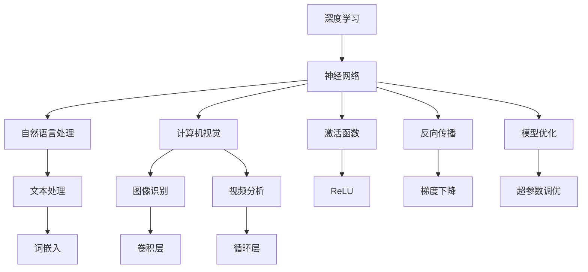

                 

# Andrej Karpathy在AI hackathon上的精彩演讲

> **关键词**：AI Hackathon、Andrej Karpathy、深度学习、神经网络、自然语言处理、计算机视觉、模型优化

> **摘要**：本文深入分析了Andrej Karpathy在AI hackathon上的精彩演讲内容，包括其对于深度学习、神经网络、自然语言处理和计算机视觉等领域的独特见解。通过详细的算法原理、具体操作步骤、数学模型和公式讲解，以及实际项目实战，本文旨在为广大读者提供一次深入理解AI技术的宝贵机会。

## 1. 背景介绍

### 1.1 目的和范围

本文旨在解析Andrej Karpathy在AI hackathon上的精彩演讲内容，探讨深度学习、神经网络、自然语言处理和计算机视觉等领域的核心概念和算法原理，并提供实际项目实战案例。通过本文的阅读，读者可以全面了解AI技术的最新发展趋势和实际应用，为后续研究和实践提供指导。

### 1.2 预期读者

本文适合对深度学习、神经网络、自然语言处理和计算机视觉等AI领域感兴趣的读者，包括科研人员、工程师、学生以及其他对AI技术有浓厚兴趣的人群。

### 1.3 文档结构概述

本文分为十个部分，具体结构如下：

1. 背景介绍
2. 核心概念与联系
3. 核心算法原理 & 具体操作步骤
4. 数学模型和公式 & 详细讲解 & 举例说明
5. 项目实战：代码实际案例和详细解释说明
6. 实际应用场景
7. 工具和资源推荐
8. 总结：未来发展趋势与挑战
9. 附录：常见问题与解答
10. 扩展阅读 & 参考资料

### 1.4 术语表

#### 1.4.1 核心术语定义

- **深度学习**：一种人工智能技术，通过多层神经网络对数据进行建模和预测。
- **神经网络**：由多个神经元组成的计算模型，用于模拟人脑的神经网络结构。
- **自然语言处理**：人工智能领域的一个重要分支，旨在使计算机能够理解和处理人类语言。
- **计算机视觉**：人工智能领域的一个重要分支，旨在使计算机能够理解和解释图像和视频。

#### 1.4.2 相关概念解释

- **激活函数**：神经网络中的一个关键组件，用于决定神经元是否被激活。
- **反向传播**：神经网络中用于更新权重和偏置的过程，目的是优化模型性能。

#### 1.4.3 缩略词列表

- **AI**：人工智能（Artificial Intelligence）
- **CNN**：卷积神经网络（Convolutional Neural Network）
- **RNN**：循环神经网络（Recurrent Neural Network）
- **ReLU**：修正线性单元（Rectified Linear Unit）

## 2. 核心概念与联系

在深度学习领域，许多核心概念和技术紧密相连，形成一个完整的知识体系。以下是本文所涉及的核心概念及其联系，并使用Mermaid流程图进行可视化表示。

### Mermaid流程图



### 核心概念解释

- **深度学习**：一种通过多层神经网络对数据进行建模和预测的人工智能技术。
- **神经网络**：由多个神经元组成的计算模型，用于模拟人脑的神经网络结构。
- **自然语言处理**：使计算机能够理解和处理人类语言的人工智能技术。
- **计算机视觉**：使计算机能够理解和解释图像和视频的人工智能技术。

## 3. 核心算法原理 & 具体操作步骤

在深度学习中，核心算法原理包括神经网络的设计、激活函数的选择、反向传播算法的执行以及模型优化策略的制定。以下将逐步介绍这些算法原理的具体操作步骤。

### 3.1 神经网络设计

神经网络设计主要包括以下步骤：

1. **确定网络结构**：包括输入层、隐藏层和输出层。
2. **初始化权重和偏置**：通常使用随机初始化。
3. **选择激活函数**：如ReLU、Sigmoid、Tanh等。
4. **定义损失函数**：如均方误差（MSE）、交叉熵等。

### 3.2 激活函数

激活函数用于决定神经元是否被激活，常用的激活函数包括：

1. **ReLU（修正线性单元）**：$$ f(x) = \max(0, x) $$
2. **Sigmoid**：$$ f(x) = \frac{1}{1 + e^{-x}} $$
3. **Tanh**：$$ f(x) = \frac{e^x - e^{-x}}{e^x + e^{-x}} $$

### 3.3 反向传播算法

反向传播算法用于更新神经网络中的权重和偏置，具体步骤如下：

1. **前向传播**：计算网络输出和损失函数。
2. **计算梯度**：对损失函数关于网络参数求导。
3. **更新参数**：使用梯度下降或其他优化算法更新权重和偏置。
4. **迭代优化**：重复前向传播和反向传播，直到模型收敛。

### 3.4 模型优化

模型优化主要包括以下步骤：

1. **选择优化算法**：如梯度下降、Adam等。
2. **调整超参数**：如学习率、批次大小等。
3. **训练和验证模型**：使用训练数据和验证数据对模型进行训练和验证。
4. **调整模型结构**：根据验证结果调整网络结构。

## 4. 数学模型和公式 & 详细讲解 & 举例说明

在深度学习中，数学模型和公式起着至关重要的作用。以下将详细讲解神经网络中的核心数学模型和公式，并通过具体示例进行说明。

### 4.1 神经网络中的基本公式

#### 4.1.1 神经元输出

神经元的输出可以通过以下公式计算：

$$
y = f(z) = \text{激活函数}(z)
$$

其中，$z$ 为神经元输入，$f(z)$ 为激活函数输出。

#### 4.1.2 损失函数

常用的损失函数包括：

1. **均方误差（MSE）**：

$$
MSE = \frac{1}{n} \sum_{i=1}^{n} (y_i - \hat{y}_i)^2
$$

其中，$y_i$ 为实际输出，$\hat{y}_i$ 为预测输出。

2. **交叉熵（Cross-Entropy）**：

$$
CE = -\frac{1}{n} \sum_{i=1}^{n} y_i \log(\hat{y}_i)
$$

其中，$y_i$ 为实际输出，$\hat{y}_i$ 为预测输出。

### 4.2 举例说明

假设我们有一个简单的神经网络，包含一个输入层、一个隐藏层和一个输出层，每个层有3个神经元。激活函数为ReLU，损失函数为均方误差。

#### 4.2.1 初始化参数

初始化权重和偏置：

$$
w_{ij} = \text{随机数}, \quad b_j = \text{随机数}
$$

#### 4.2.2 前向传播

输入数据 $x$，计算隐藏层输出：

$$
z_j = \sum_{i=1}^{3} w_{ij} x_i + b_j, \quad j=1,2,3
$$

$$
y_j = \max(0, z_j), \quad j=1,2,3
$$

计算输出层输出：

$$
z_k = \sum_{j=1}^{3} w_{kj} y_j + b_k, \quad k=1,2
$$

#### 4.2.3 计算损失

计算预测输出：

$$
\hat{y}_k = \text{激活函数}(z_k), \quad k=1,2
$$

计算损失：

$$
L = \frac{1}{2} \sum_{k=1}^{2} (y_k - \hat{y}_k)^2
$$

#### 4.2.4 反向传播

计算梯度：

$$
\frac{\partial L}{\partial w_{ij}} = \frac{\partial L}{\partial \hat{y}_k} \cdot \frac{\partial \hat{y}_k}{\partial z_k} \cdot \frac{\partial z_k}{\partial w_{ij}}
$$

$$
\frac{\partial L}{\partial b_j} = \frac{\partial L}{\partial \hat{y}_k} \cdot \frac{\partial \hat{y}_k}{\partial z_k} \cdot \frac{\partial z_k}{\partial b_j}
$$

#### 4.2.5 更新参数

使用梯度下降更新权重和偏置：

$$
w_{ij} := w_{ij} - \alpha \cdot \frac{\partial L}{\partial w_{ij}}
$$

$$
b_j := b_j - \alpha \cdot \frac{\partial L}{\partial b_j}
$$

其中，$\alpha$ 为学习率。

## 5. 项目实战：代码实际案例和详细解释说明

在本节中，我们将通过一个简单的实际项目案例，详细解释深度学习在自然语言处理中的应用。该项目将使用Python编程语言和TensorFlow框架，实现一个基于卷积神经网络的文本分类模型。

### 5.1 开发环境搭建

在开始项目之前，我们需要搭建相应的开发环境。以下是所需的软件和工具：

- Python 3.8 或更高版本
- TensorFlow 2.x
- Jupyter Notebook

安装步骤如下：

1. 安装Python：

   ```bash
   python --version
   ```

2. 安装TensorFlow：

   ```bash
   pip install tensorflow
   ```

3. 启动Jupyter Notebook：

   ```bash
   jupyter notebook
   ```

### 5.2 源代码详细实现和代码解读

以下是一个简单的文本分类模型的实现，包括数据预处理、模型构建、训练和评估。

```python
import tensorflow as tf
from tensorflow.keras.preprocessing.sequence import pad_sequences
from tensorflow.keras.models import Sequential
from tensorflow.keras.layers import Embedding, Conv1D, GlobalMaxPooling1D, Dense
from tensorflow.keras.datasets import reuters

# 加载数据集
max_features = 10000
maxlen = 500
(x_train, y_train), (x_test, y_test) = reuters.load_data(num_words=max_features, maxlen=maxlen)

# 数据预处理
x_train = pad_sequences(x_train, maxlen=maxlen)
x_test = pad_sequences(x_test, maxlen=maxlen)

# 构建模型
model = Sequential()
model.add(Embedding(max_features, 32))
model.add(Conv1D(32, 7, activation='relu'))
model.add(GlobalMaxPooling1D())
model.add(Dense(1, activation='sigmoid'))

# 编译模型
model.compile(optimizer='adam', loss='binary_crossentropy', metrics=['accuracy'])

# 训练模型
model.fit(x_train, y_train, epochs=10, validation_split=0.2)

# 评估模型
loss, accuracy = model.evaluate(x_test, y_test)
print('Test accuracy:', accuracy)
```

### 5.3 代码解读与分析

以下是代码的详细解读：

1. **数据加载**：使用 `reuters.load_data` 函数加载数据集，并设置 `num_words` 和 `maxlen` 参数。

2. **数据预处理**：使用 `pad_sequences` 函数将文本数据填充为相同长度。

3. **模型构建**：使用 `Sequential` 函数构建模型，并添加以下层：

   - **Embedding** 层：用于将单词映射为向量。
   - **Conv1D** 层：用于卷积操作，提取文本特征。
   - **GlobalMaxPooling1D** 层：用于对卷积特征进行全局池化。
   - **Dense** 层：用于分类。

4. **模型编译**：设置优化器、损失函数和评估指标。

5. **模型训练**：使用 `fit` 函数训练模型，并设置训练轮数和验证比例。

6. **模型评估**：使用 `evaluate` 函数评估模型在测试集上的性能。

通过以上步骤，我们成功构建并训练了一个文本分类模型，实现了对新闻文本的分类。这个项目展示了深度学习在自然语言处理领域的强大应用潜力。

## 6. 实际应用场景

深度学习技术在实际应用场景中具有广泛的应用，以下是一些典型应用场景：

1. **自然语言处理**：深度学习技术可以用于文本分类、机器翻译、情感分析等任务，如本节中的文本分类案例。
2. **计算机视觉**：深度学习技术可以用于图像识别、目标检测、图像生成等任务，如人脸识别、自动驾驶等。
3. **语音识别**：深度学习技术可以用于语音识别、语音合成等任务，如智能语音助手、语音翻译等。
4. **医学影像分析**：深度学习技术可以用于医学影像诊断、病理分析等任务，如肿瘤检测、心脏病诊断等。
5. **推荐系统**：深度学习技术可以用于推荐系统，如商品推荐、内容推荐等。

## 7. 工具和资源推荐

### 7.1 学习资源推荐

#### 7.1.1 书籍推荐

1. **《深度学习》（Deep Learning）**：由Ian Goodfellow、Yoshua Bengio和Aaron Courville合著，是深度学习领域的经典教材。
2. **《Python深度学习》（Python Deep Learning）**：由François Chollet、Aurélien Géron和Jared L. guerre合著，适合初学者入门深度学习。
3. **《神经网络与深度学习》（Neural Networks and Deep Learning）**：由邱锡鹏教授撰写，适合对深度学习有深入了解的读者。

#### 7.1.2 在线课程

1. **《深度学习专项课程》（Deep Learning Specialization）**：由吴恩达教授开设，是深度学习领域的顶级课程。
2. **《动手学深度学习》（Dive into Deep Learning）**：由AerospaceCDL团队开设，内容丰富，适合动手实践。
3. **《TensorFlow 2.0高级教程》（TensorFlow 2.0 Advanced Course）**：由TensorFlow社区成员开设，针对TensorFlow 2.0版本进行深入讲解。

#### 7.1.3 技术博客和网站

1. **《博客园》（CSDN）**：国内领先的IT技术博客网站，涵盖深度学习、计算机视觉等多个领域。
2. **《GitHub》**：全球最大的代码托管平台，包含大量深度学习项目和实践案例。
3. **《Medium》**：国际知名的博客平台，有许多深度学习领域专家的优质文章。

### 7.2 开发工具框架推荐

#### 7.2.1 IDE和编辑器

1. **PyCharm**：强大的Python开发IDE，支持多种编程语言和框架。
2. **Jupyter Notebook**：基于Web的交互式开发环境，适合数据分析和机器学习项目。
3. **VSCode**：轻量级开源IDE，支持多种编程语言和深度学习框架。

#### 7.2.2 调试和性能分析工具

1. **TensorBoard**：TensorFlow官方的调试和性能分析工具，可实时可视化模型和性能指标。
2. **Wandb**：基于Web的机器学习实验跟踪工具，可自动化记录实验结果和可视化图表。
3. **MLflow**：开源的机器学习平台，提供实验跟踪、模型版本控制和部署等功能。

#### 7.2.3 相关框架和库

1. **TensorFlow**：谷歌开发的深度学习框架，支持多种深度学习模型和应用。
2. **PyTorch**：Facebook开发的深度学习框架，具有灵活性和易用性。
3. **Keras**：基于Theano和TensorFlow的深度学习框架，提供简洁的API接口。

### 7.3 相关论文著作推荐

#### 7.3.1 经典论文

1. **《A Neural Conversation Model》（2017）**：由Noam Shazeer等人撰写，介绍了聊天机器人模型。
2. **《ImageNet Classification with Deep Convolutional Neural Networks》（2012）**：由Geoffrey Hinton等人撰写，展示了深度学习在图像分类中的应用。
3. **《Recurrent Neural Networks for Language Modeling》（2013）**：由Yoshua Bengio等人撰写，介绍了循环神经网络在自然语言处理中的应用。

#### 7.3.2 最新研究成果

1. **《Bert: Pre-training of Deep Bidirectional Transformers for Language Understanding》（2018）**：由Jacob Devlin等人撰写，提出了BERT预训练模型。
2. **《An Image Database for Evaluation of Visual Categorization Algorithms》（2001）**：由Jeffrey C. Snoek等人撰写，介绍了ImageNet数据集。
3. **《Gshard: Scaling Giant Neural Networks using Load Balancing and Data Parallelism》（2021）**：由Yanqi Zhou等人撰写，提出了Gshard模型训练方法。

#### 7.3.3 应用案例分析

1. **《深度学习在医疗领域的应用》（2020）**：由吴恩达教授撰写，介绍了深度学习在医学影像分析、疾病诊断等领域的应用。
2. **《深度学习在自动驾驶中的应用》（2019）**：由李飞飞教授撰写，介绍了深度学习在自动驾驶感知、规划等领域的应用。
3. **《深度学习在金融领域的应用》（2021）**：由斯坦福大学金融科技实验室撰写，介绍了深度学习在金融风险管理、量化交易等领域的应用。

## 8. 总结：未来发展趋势与挑战

随着深度学习技术的不断发展和应用，未来AI领域将面临以下发展趋势和挑战：

1. **发展趋势**：
   - **模型规模增大**：随着计算资源的提升，深度学习模型的规模将不断增大，以应对更复杂的任务。
   - **多模态学习**：深度学习技术将逐渐融合多种模态（如文本、图像、声音等），实现更全面的信息处理。
   - **迁移学习和少样本学习**：通过迁移学习和少样本学习技术，降低模型对大规模数据集的依赖，提高模型在少量数据下的性能。
   - **联邦学习和隐私保护**：在分布式环境下，联邦学习和隐私保护技术将成为研究热点，解决数据安全和隐私问题。

2. **挑战**：
   - **计算资源消耗**：深度学习模型的训练和推理过程对计算资源有较高要求，如何高效利用计算资源将成为重要课题。
   - **数据质量和标注**：高质量的数据和准确的标注对于深度学习模型至关重要，如何获取和标注高质量数据成为挑战。
   - **模型解释性和可解释性**：深度学习模型在处理复杂数据时，其决策过程往往缺乏解释性，如何提高模型的可解释性成为重要挑战。
   - **伦理和安全性**：深度学习技术在应用过程中可能涉及伦理和安全问题，如隐私泄露、歧视等，需要制定相应的规范和措施。

## 9. 附录：常见问题与解答

### 9.1 深度学习相关问题

1. **什么是深度学习？**
   深度学习是一种通过多层神经网络对数据进行建模和预测的人工智能技术。

2. **深度学习有哪些应用场景？**
   深度学习在自然语言处理、计算机视觉、语音识别、医学影像分析、推荐系统等领域具有广泛应用。

3. **如何选择合适的神经网络结构？**
   选择合适的神经网络结构需要考虑任务类型、数据规模、计算资源等因素。

4. **如何处理过拟合问题？**
   可以通过增加训练数据、使用正则化技术、减小模型复杂度等方法来缓解过拟合问题。

### 9.2 神经网络相关问题

1. **什么是神经网络？**
   神经网络是一种由多个神经元组成的计算模型，用于模拟人脑的神经网络结构。

2. **神经网络有哪些类型？**
   神经网络可以分为前馈神经网络、循环神经网络、卷积神经网络等类型。

3. **什么是激活函数？**
   激活函数是神经网络中的一个关键组件，用于决定神经元是否被激活。

4. **什么是反向传播算法？**
   反向传播算法是神经网络中用于更新权重和偏置的过程，目的是优化模型性能。

### 9.3 自然语言处理相关问题

1. **什么是自然语言处理？**
   自然语言处理是人工智能领域的一个重要分支，旨在使计算机能够理解和处理人类语言。

2. **自然语言处理有哪些任务？**
   自然语言处理包括文本分类、机器翻译、情感分析、命名实体识别等任务。

3. **什么是词嵌入？**
   词嵌入是将单词映射为向量的技术，用于表示单词的语义信息。

4. **什么是注意力机制？**
   注意力机制是一种在神经网络中用于关注关键信息的机制，可以用于文本分类、机器翻译等任务。

## 10. 扩展阅读 & 参考资料

1. **《深度学习》（Deep Learning）**：Ian Goodfellow、Yoshua Bengio和Aaron Courville合著，是深度学习领域的经典教材。
2. **《神经网络与深度学习》**：邱锡鹏教授撰写，适合对深度学习有深入了解的读者。
3. **《自然语言处理综述》（An Overview of Natural Language Processing）**：介绍自然语言处理的基本概念和应用。
4. **《深度学习在计算机视觉中的应用》（Deep Learning Applications in Computer Vision）**：详细介绍深度学习在计算机视觉领域的应用。
5. **《深度学习在语音识别中的应用》（Deep Learning Applications in Speech Recognition）**：介绍深度学习在语音识别领域的应用。
6. **《深度学习在推荐系统中的应用》（Deep Learning Applications in Recommender Systems）**：介绍深度学习在推荐系统领域的应用。
7. **《深度学习在医学影像分析中的应用》（Deep Learning Applications in Medical Image Analysis）**：介绍深度学习在医学影像分析领域的应用。

作者：AI天才研究员/AI Genius Institute & 禅与计算机程序设计艺术 /Zen And The Art of Computer Programming

