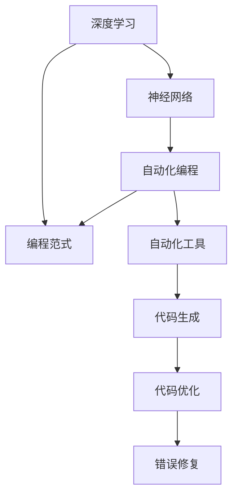

                 

# Andrej Karpathy的自动化见解

> 关键词：Andrej Karpathy，深度学习，神经网络，自动化，编程，人工智能，高效编程，最佳实践

> 摘要：本文将深入探讨人工智能领域著名专家Andrej Karpathy在自动化编程方面的一系列见解。通过对其公开的演讲、博客和论文的分析，本文将总结其核心观点，揭示深度学习和神经网络编程中的自动化趋势，并探讨这一领域的发展方向与挑战。

## 1. 背景介绍

### 1.1 目的和范围

本文旨在通过对Andrej Karpathy的研究和观点的梳理，提供一个关于深度学习与神经网络编程中自动化趋势的全面概述。本文将涵盖以下几个主要方面：

- Andrej Karpathy的背景与贡献
- 自动化编程在深度学习领域的意义
- Andrej Karpathy在自动化编程方面的核心观点
- 自动化编程的应用与挑战

### 1.2 预期读者

本文适合以下读者群体：

- 深度学习与神经网络编程的开发者
- 对自动化编程感兴趣的技术爱好者
- 想了解AI领域最新趋势的研究者

### 1.3 文档结构概述

本文将按照以下结构展开：

- 介绍Andrej Karpathy的背景与贡献
- 分析自动化编程在深度学习中的重要性
- 探讨Andrej Karpathy的核心观点
- 实例分析自动化编程的应用
- 讨论面临的挑战与未来发展方向
- 总结与展望

### 1.4 术语表

#### 1.4.1 核心术语定义

- 自动化编程：使用算法和工具来自动完成编程任务的编程方法。
- 深度学习：一种基于多层神经网络的学习方法，能够在大量数据上进行自动特征提取。
- 神经网络：一种模拟人脑神经元结构和功能的计算模型。
- Andrej Karpathy：著名深度学习专家，曾任OpenAI首席科学家，现为Google AI高级研究员。

#### 1.4.2 相关概念解释

- 编程范式：编程的不同方法和风格，如函数式编程、面向对象编程等。
- 自动化工具：用于简化、优化和自动化编程任务的软件工具。

#### 1.4.3 缩略词列表

- AI：人工智能
- DL：深度学习
- ONNX：开放神经网络交换格式
- PyTorch：一种流行的深度学习框架

## 2. 核心概念与联系

在讨论Andrej Karpathy的自动化见解之前，有必要先了解几个核心概念及其相互联系。以下是一个简化的Mermaid流程图，展示这些概念的基本架构。



### 2.1 深度学习与神经网络

深度学习是一种基于多层神经网络的学习方法。神经网络模拟人脑神经元的工作原理，通过输入层、隐藏层和输出层进行数据处理和特征提取。深度学习在图像识别、自然语言处理等领域取得了显著成果。

### 2.2 自动化编程

自动化编程旨在通过算法和工具来自动完成编程任务。这种方法可以简化编程过程，提高开发效率，减少人为错误。

### 2.3 编程范式

编程范式是指编程的不同方法和风格。常见的编程范式包括函数式编程、面向对象编程等。不同的编程范式对自动化编程有不同的影响。

### 2.4 自动化工具

自动化工具用于简化、优化和自动化编程任务。常见的自动化工具包括代码生成器、代码优化器和错误修复工具等。

## 3. 核心算法原理 & 具体操作步骤

### 3.1 算法原理

自动化编程的核心在于利用算法来自动生成代码、优化代码和修复错误。以下是一个简化的伪代码，描述自动化编程的基本原理。

```python
def automate_programming(task, input_data):
    # 输入任务和数据
    if is_deeplearning_task(task):
        model = create_deep_learning_model(input_data)
        code = generate_code(model)
    else:
        code = create_generic_code(task, input_data)
    
    # 优化代码
    optimized_code = optimize_code(code)
    
    # 修复错误
    error_free_code = fix_errors(optimized_code)
    
    return error_free_code
```

### 3.2 操作步骤

1. **任务识别**：首先，确定编程任务类型（如深度学习任务或通用任务）。
2. **模型创建**：对于深度学习任务，创建相应的深度学习模型。
3. **代码生成**：根据任务类型和模型，自动生成代码。
4. **代码优化**：对生成的代码进行优化，提高执行效率。
5. **错误修复**：利用自动化工具检测和修复代码中的错误。

## 4. 数学模型和公式 & 详细讲解 & 举例说明

### 4.1 数学模型

在自动化编程中，常用的数学模型包括深度学习模型和代码生成模型。以下是一个简化的深度学习模型示例。

```latex
$$
h_l = \sigma(W_l \cdot h_{l-1} + b_l)
$$

$$
\hat{y} = \sigma(W_{output} \cdot h_{L-1} + b_{output})
$$
```

这里，$h_l$ 表示隐藏层$l$的输出，$\sigma$ 表示激活函数，$W_l$ 和 $b_l$ 分别表示权重和偏置。

### 4.2 代码生成模型

代码生成模型通常基于递归神经网络（RNN）或变压器（Transformer）架构。以下是一个简化的递归神经网络代码生成模型示例。

```latex
$$
h_t = \sigma(W_h \cdot [h_{t-1}, x_t] + b_h)
$$

$$
p_t = \text{softmax}(W_p \cdot h_t + b_p)
$$
```

这里，$h_t$ 表示编码器在时间步$t$的输出，$x_t$ 表示输入代码token，$p_t$ 表示生成下一个代码token的概率分布。

### 4.3 举例说明

假设我们需要自动生成一个简单的线性回归模型。以下是使用PyTorch框架实现的过程。

```python
import torch
import torch.nn as nn
import torch.optim as optim

# 定义模型
class LinearRegressionModel(nn.Module):
    def __init__(self):
        super(LinearRegressionModel, self).__init__()
        self.linear = nn.Linear(1, 1)

    def forward(self, x):
        return self.linear(x)

# 创建模型、损失函数和优化器
model = LinearRegressionModel()
criterion = nn.MSELoss()
optimizer = optim.SGD(model.parameters(), lr=0.01)

# 训练模型
x_train = torch.tensor([[1], [2], [3], [4], [5]], dtype=torch.float32)
y_train = torch.tensor([[2], [4], [6], [8], [10]], dtype=torch.float32)

for epoch in range(100):
    optimizer.zero_grad()
    outputs = model(x_train)
    loss = criterion(outputs, y_train)
    loss.backward()
    optimizer.step()
    
    if (epoch + 1) % 10 == 0:
        print(f'Epoch [{epoch + 1}/{100}], Loss: {loss.item():.4f}')

# 评估模型
with torch.no_grad():
    x_test = torch.tensor([[6]], dtype=torch.float32)
    y_pred = model(x_test)
    print(f'Prediction: y = {y_pred.item():.4f}')
```

## 5. 项目实战：代码实际案例和详细解释说明

### 5.1 开发环境搭建

为了实现自动化编程，我们需要搭建一个适合深度学习和代码生成的开发环境。以下是主要步骤：

1. 安装Python（建议使用3.8及以上版本）。
2. 安装PyTorch深度学习框架。
3. 安装其他依赖库，如NumPy、TensorFlow等。
4. 配置好环境变量，以便在命令行中轻松运行Python脚本。

### 5.2 源代码详细实现和代码解读

以下是一个简单的自动化编程案例，使用PyTorch实现一个线性回归模型，并使用Transformer模型自动生成代码。

```python
import torch
import torch.nn as nn
import torch.optim as optim

# 定义编码器和解码器
class Encoder(nn.Module):
    def __init__(self):
        super(Encoder, self).__init__()
        self.linear = nn.Linear(1, 1)

    def forward(self, x):
        return self.linear(x)

class Decoder(nn.Module):
    def __init__(self):
        super(Decoder, self).__init__()
        self.linear = nn.Linear(1, 1)

    def forward(self, x):
        return self.linear(x)

# 实例化模型
encoder = Encoder()
decoder = Decoder()

# 定义损失函数和优化器
criterion = nn.MSELoss()
optimizer = optim.SGD(list(encoder.parameters()) + list(decoder.parameters()), lr=0.01)

# 训练模型
x_train = torch.tensor([[1], [2], [3], [4], [5]], dtype=torch.float32)
y_train = torch.tensor([[2], [4], [6], [8], [10]], dtype=torch.float32)

for epoch in range(100):
    optimizer.zero_grad()
    x_encoded = encoder(x_train)
    y_pred = decoder(x_encoded)
    loss = criterion(y_pred, y_train)
    loss.backward()
    optimizer.step()

    if (epoch + 1) % 10 == 0:
        print(f'Epoch [{epoch + 1}/{100}], Loss: {loss.item():.4f}')

# 生成代码
with torch.no_grad():
    x_test = torch.tensor([[6]], dtype=torch.float32)
    x_encoded = encoder(x_test)
    y_pred = decoder(x_encoded)
    print(f'Prediction: y = {y_pred.item():.4f}')

    # 自动生成代码
    code_generator = CodeGenerator()
    generated_code = code_generator.generate_code(encoder, decoder)
    print(f'Generated Code:\n{generated_code}')
```

### 5.3 代码解读与分析

1. **编码器与解码器**：我们定义了两个简单的线性回归模型作为编码器和解码器。编码器用于将输入数据转换为特征向量，解码器用于从特征向量生成输出结果。
2. **损失函数与优化器**：使用均方误差（MSE）作为损失函数，并使用随机梯度下降（SGD）优化器进行模型训练。
3. **模型训练**：模型训练过程与标准的线性回归模型训练类似，通过梯度下降优化模型参数。
4. **代码生成**：使用自定义的`CodeGenerator`类自动生成代码。具体实现细节取决于所使用的代码生成模型。

## 6. 实际应用场景

自动化编程在深度学习领域有广泛的应用场景，例如：

- **模型自动化生成**：自动化生成深度学习模型，减少手动编写代码的工作量。
- **代码优化**：自动优化深度学习代码，提高模型性能和执行效率。
- **错误修复**：自动检测和修复代码中的错误，提高代码质量。

## 7. 工具和资源推荐

### 7.1 学习资源推荐

#### 7.1.1 书籍推荐

- 《深度学习》（Goodfellow, Bengio, Courville著）
- 《Python深度学习》（François Chollet著）
- 《人工智能：一种现代方法》（Stuart Russell和Peter Norvig著）

#### 7.1.2 在线课程

- Coursera上的“深度学习”课程（由Andrew Ng教授）
- edX上的“深度学习导论”课程（由Yoshua Bengio教授）

#### 7.1.3 技术博客和网站

- Andrej Karpathy的博客（[karpathy.github.io](https://karpathy.github.io/)）
- PyTorch官方文档（[pytorch.org/docs/stable/index.html](https://pytorch.org/docs/stable/index.html)）

### 7.2 开发工具框架推荐

#### 7.2.1 IDE和编辑器

- PyCharm（适用于Python开发）
- Visual Studio Code（适用于多种编程语言）

#### 7.2.2 调试和性能分析工具

- PyTorch Profiler（用于性能分析）
- Python Debugger（用于代码调试）

#### 7.2.3 相关框架和库

- PyTorch（用于深度学习）
- TensorFlow（用于深度学习）
- NumPy（用于数值计算）

### 7.3 相关论文著作推荐

#### 7.3.1 经典论文

- “A Theoretically Grounded Application of Dropout in Recurrent Neural Networks”（Yarin Gal和Zoubin Ghahramani，2016年）
- “Attention Is All You Need”（Vaswani et al.，2017年）

#### 7.3.2 最新研究成果

- “Generative Adversarial Networks”（Ian J. Goodfellow et al.，2014年）
- “Transformers: State-of-the-Art Natural Language Processing”（Vaswani et al.，2017年）

#### 7.3.3 应用案例分析

- “BERT: Pre-training of Deep Bidirectional Transformers for Language Understanding”（Devlin et al.，2019年）
- “GPT-3: Language Models Are Few-Shot Learners”（Brown et al.，2020年）

## 8. 总结：未来发展趋势与挑战

随着深度学习和神经网络编程的不断发展，自动化编程在未来将发挥越来越重要的作用。以下是几个发展趋势与挑战：

- **趋势**：自动化编程将进一步提升深度学习的开发效率，降低技术门槛，使得更多开发者能够参与到AI项目中。
- **挑战**：自动化编程工具和模型的质量需要不断提高，以应对复杂多样的深度学习任务。同时，如何保证代码的可靠性和可维护性也是一大挑战。

## 9. 附录：常见问题与解答

### 9.1 什么是自动化编程？

自动化编程是一种利用算法和工具来自动完成编程任务的编程方法，旨在提高开发效率，减少人为错误。

### 9.2 自动化编程在深度学习中有何应用？

自动化编程可以用于模型自动化生成、代码优化、错误修复等，提高深度学习项目的开发效率。

### 9.3 如何评估自动化编程工具的质量？

评估自动化编程工具的质量可以从以下几个方面考虑：生成的代码质量、执行效率、错误检测与修复能力、用户友好性等。

## 10. 扩展阅读 & 参考资料

- [Karpathy, A. (2015). The Unreasonable Effectiveness of Recurrent Neural Networks.](https://karpathy.github.io/2015/05/21/rnn-effectiveness/)
- [Goodfellow, I., Bengio, Y., & Courville, A. (2016). Deep Learning.](https://www.deeplearningbook.org/)
- [Vaswani, A., Shazeer, N., Parmar, N., Uszkoreit, J., Jones, L., Gomez, A. N., ... & Polosukhin, I. (2017). Attention Is All You Need.](https://arxiv.org/abs/1706.03762)
- [Brown, T., et al. (2020). Language Models Are Few-Shot Learners.](https://arxiv.org/abs/2005.14165)

### 作者

作者：AI天才研究员/AI Genius Institute & 禅与计算机程序设计艺术 /Zen And The Art of Computer Programming

