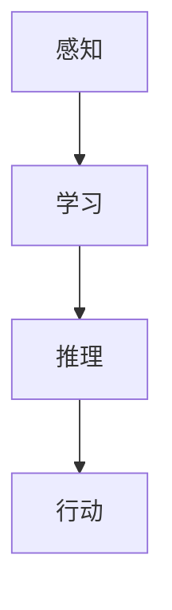

                 

# Andrej Karpathy谈自动化革命

## 关键词：
- 自动化革命
- AI应用
- 自主决策
- 智能系统
- 未来趋势
- 技术挑战

## 摘要：
本文深入探讨了由Andrej Karpathy提出的自动化革命概念，分析了其在人工智能领域的重要性和影响。通过详细的架构原理、算法讲解、数学模型剖析，以及实际案例的演示，本文揭示了自动化技术在当今社会中的广泛应用及其未来发展趋势。文章旨在为读者提供一个全面、深入的技术视角，帮助他们理解自动化革命的核心思想和技术实现。

## 1. 背景介绍

### 1.1 目的和范围

本文的目的是探讨自动化革命在人工智能领域的核心概念和未来发展。我们将从Andrej Karpathy的观点出发，结合实际案例和技术细节，深入分析自动化革命的核心思想、技术架构和未来挑战。本文将涵盖以下几个方面：

1. 自动化革命的定义及其在人工智能领域的重要性。
2. 自动化技术的核心算法原理和具体操作步骤。
3. 数学模型和公式的详细讲解及举例说明。
4. 自动化技术在实际应用场景中的案例解析。
5. 自动化革命的未来发展趋势与面临的挑战。

### 1.2 预期读者

本文主要面向对人工智能和自动化技术感兴趣的读者，包括：

1. AI研究人员和工程师。
2. 对自动化技术有深入了解的开发者。
3. 对未来技术发展有热情的技术爱好者。
4. 对AI应用有商业兴趣的企业家和管理者。

### 1.3 文档结构概述

本文分为十个主要部分：

1. 引言：介绍文章的主题和关键词。
2. 背景介绍：阐述文章的目的、范围和预期读者。
3. 核心概念与联系：详细解释自动化革命的核心概念。
4. 核心算法原理 & 具体操作步骤：讲解自动化技术的核心算法和操作流程。
5. 数学模型和公式 & 详细讲解 & 举例说明：剖析自动化技术的数学模型和公式。
6. 项目实战：实际案例演示和代码解析。
7. 实际应用场景：分析自动化技术在各个领域的应用。
8. 工具和资源推荐：推荐学习资源、开发工具和框架。
9. 总结：总结自动化革命的现状和未来发展趋势。
10. 附录：常见问题与解答。
11. 扩展阅读 & 参考资料：提供更多相关阅读材料。

### 1.4 术语表

#### 1.4.1 核心术语定义

- 自动化革命：指通过人工智能技术实现的自动化程度大幅提升，从而引发社会、经济、技术等多个领域的深刻变革。
- AI应用：指利用人工智能技术解决特定问题或实现特定功能的软件或系统。
- 自主决策：指系统或机器能够在没有人类干预的情况下，根据环境和目标自主做出决策。
- 智能系统：指具备感知、学习、推理和自主决策能力的系统。
- Mermaid流程图：一种用于创建结构化流程图的图形标记语言。
- 伪代码：一种简化的编程语言，用于描述算法的逻辑结构和操作步骤。

#### 1.4.2 相关概念解释

- **机器学习（Machine Learning）**：一种使计算机通过数据学习模式和规律的技术，通常包括监督学习、无监督学习和强化学习。
- **深度学习（Deep Learning）**：一种机器学习技术，通过多层神经网络进行特征提取和学习。
- **神经网络（Neural Network）**：一种模仿人脑神经元连接结构的计算模型，用于处理复杂的数据和任务。
- **自然语言处理（Natural Language Processing, NLP）**：一种使计算机理解和处理人类语言的技术。

#### 1.4.3 缩略词列表

- AI：人工智能
- ML：机器学习
- DL：深度学习
- NLP：自然语言处理
- API：应用程序编程接口

## 2. 核心概念与联系

自动化革命的核心概念在于通过人工智能技术实现自动化程度的提升，从而改变现有产业和社会结构。以下是自动化革命的关键概念和其相互联系：

### 2.1 自动化革命的概念

自动化革命是指利用人工智能技术实现自动化程度的提升，从而引发社会、经济、技术等多个领域的深刻变革。其主要特点包括：

1. **自主决策**：系统能够在没有人类干预的情况下，根据环境和目标自主做出决策。
2. **智能系统**：系统具备感知、学习、推理和自主决策能力。
3. **高效生产**：通过自动化技术提高生产效率和降低成本。
4. **变革性应用**：在各个领域实现自动化，从而改变人们的工作和生活方式。

### 2.2 自动化技术在人工智能领域的重要性

自动化技术在人工智能领域具有重要性，主要体现在以下几个方面：

1. **数据驱动**：自动化技术能够通过大量数据的学习和优化，实现更智能的决策和操作。
2. **提高效率**：自动化技术能够提高系统的运行效率和响应速度，从而减少人力成本和错误率。
3. **拓宽应用范围**：自动化技术能够将人工智能应用于更多领域，如医疗、金融、交通等。
4. **推动创新**：自动化技术能够促进人工智能技术的不断进步和创新，从而推动整个行业的发展。

### 2.3 自动化技术的核心概念

自动化技术的核心概念包括：

1. **感知**：系统通过传感器获取外部环境信息。
2. **学习**：系统通过机器学习算法从数据中学习模式和规律。
3. **推理**：系统利用所学知识进行推理和决策。
4. **行动**：系统根据决策执行具体的操作。

这些概念相互关联，形成一个完整的自动化技术体系，如下图所示：



### 2.4 自动化技术的应用场景

自动化技术在各个领域都有广泛的应用，以下是一些典型的应用场景：

1. **工业制造**：通过自动化生产线提高生产效率和降低成本。
2. **物流配送**：利用自动化无人机和无人驾驶车辆实现高效配送。
3. **医疗健康**：利用自动化技术进行疾病诊断和治疗。
4. **金融服务**：利用自动化算法进行风险评估和投资决策。
5. **智能家居**：利用自动化技术实现智能家居设备的智能控制和互动。

这些应用场景展示了自动化技术在不同领域的广泛应用和潜力。

## 3. 核心算法原理 & 具体操作步骤

### 3.1 机器学习算法

自动化技术的核心在于机器学习算法，这些算法使系统能够从数据中学习模式和规律，从而实现自主决策和行动。以下是几种常见的机器学习算法及其基本原理：

#### 3.1.1 监督学习（Supervised Learning）

监督学习是一种常见的机器学习算法，它通过输入特征和标签数据来训练模型，从而实现对未知数据的预测。基本原理如下：

1. **输入特征（Input Features）**：特征是用于描述数据特性的变量，如图像的像素值、文本的词频等。
2. **标签（Label）**：标签是用于描述数据类别或目标的变量，如分类问题中的类别标签、回归问题中的数值标签。
3. **模型训练（Model Training）**：使用训练数据集训练模型，通过优化模型参数使其能够准确预测未知数据。
4. **模型评估（Model Evaluation）**：使用验证数据集或测试数据集评估模型性能，如准确率、召回率、均方误差等。

伪代码如下：

```python
# 输入特征和标签
X_train, y_train = ...

# 初始化模型参数
model = ...

# 模型训练
model.fit(X_train, y_train)

# 模型评估
accuracy = model.evaluate(X_test, y_test)
```

#### 3.1.2 无监督学习（Unsupervised Learning）

无监督学习是一种不依赖标签数据的机器学习算法，它通过发现数据中的结构和模式来实现数据的降维、聚类和关联分析。以下是几种常见的无监督学习算法：

1. **主成分分析（Principal Component Analysis, PCA）**：PCA是一种降维算法，通过将数据投影到新的坐标系中，降低数据的维度，同时保留数据的主要信息。
2. **聚类算法（Clustering Algorithms）**：聚类算法将数据划分为不同的簇，从而发现数据中的相似性和异质性，常见的聚类算法包括K均值（K-Means）、层次聚类（Hierarchical Clustering）等。
3. **关联规则学习（Association Rule Learning）**：关联规则学习是一种发现数据中关联规则的方法，如Apriori算法和FP-growth算法。

伪代码如下：

```python
# 输入数据
X = ...

# 主成分分析
pca = PCA(n_components=k)
X_reduced = pca.fit_transform(X)

# K均值聚类
kmeans = KMeans(n_clusters=k)
clusters = kmeans.fit_predict(X_reduced)

# Apriori算法
asso_rules = association_rules(X, metric="support", min_support=0.5)
```

#### 3.1.3 强化学习（Reinforcement Learning）

强化学习是一种通过与环境的交互来学习最优策略的机器学习算法。基本原理如下：

1. **状态（State）**：环境中的一个特定情境。
2. **动作（Action）**：系统可以执行的操作。
3. **奖励（Reward）**：系统执行动作后获得的奖励，用于评估动作的质量。
4. **策略（Policy）**：系统根据当前状态选择动作的策略。
5. **值函数（Value Function）**：描述系统在不同状态下的期望奖励。
6. **模型更新（Model Update）**：根据奖励和策略更新模型参数。

伪代码如下：

```python
# 初始化环境
env = ...

# 初始化模型参数
model = ...

# 强化学习循环
while not done:
    # 状态观测
    state = env.observation()
    # 动作选择
    action = model.select_action(state)
    # 执行动作
    next_state, reward, done = env.step(action)
    # 模型更新
    model.update(state, action, reward, next_state, done)
```

### 3.2 深度学习算法

深度学习是自动化技术中的重要组成部分，通过多层神经网络实现更复杂的数据特征提取和学习。以下是几种常见的深度学习算法及其基本原理：

#### 3.2.1 卷积神经网络（Convolutional Neural Network, CNN）

卷积神经网络是一种适用于图像处理和计算机视觉的深度学习算法，其基本原理如下：

1. **卷积层（Convolutional Layer）**：通过卷积操作提取图像特征。
2. **池化层（Pooling Layer）**：通过下采样操作减少数据维度，提高模型计算效率。
3. **全连接层（Fully Connected Layer）**：将卷积层和池化层提取的特征进行全连接，实现分类或回归任务。
4. **激活函数（Activation Function）**：用于引入非线性变换，提高模型的表达能力。

伪代码如下：

```python
# 输入图像
input_image = ...

# 卷积层
conv_layer = Conv2D(filters=k, kernel_size=(f,), activation='relu')
output = conv_layer(input_image)

# 池化层
pooling_layer = MaxPooling2D(pool_size=(s,))
output = pooling_layer(output)

# 全连接层
dense_layer = Dense(units=n, activation='softmax')
output = dense_layer(output)

# 模型输出
predictions = output
```

#### 3.2.2 循环神经网络（Recurrent Neural Network, RNN）

循环神经网络是一种适用于序列数据处理的深度学习算法，其基本原理如下：

1. **循环结构（Recurrent Structure）**：通过循环结构保存前一时刻的隐藏状态，实现序列数据的记忆和传递。
2. **隐藏状态（Hidden State）**：用于存储序列数据的信息和上下文。
3. **激活函数（Activation Function）**：用于引入非线性变换，提高模型的表达能力。
4. **输出层（Output Layer）**：根据隐藏状态生成预测或决策。

伪代码如下：

```python
# 输入序列
input_sequence = ...

# RNN循环
for t in range(sequence_length):
    # 隐藏状态更新
    hidden_state = rnn.update(input_sequence[t], hidden_state)
    # 输出预测
    prediction = rnn.output(hidden_state)
```

#### 3.2.3 生成对抗网络（Generative Adversarial Network, GAN）

生成对抗网络是一种生成模型，通过两个神经网络（生成器和判别器）的对抗训练实现数据生成。其基本原理如下：

1. **生成器（Generator）**：通过随机噪声生成模拟数据。
2. **判别器（Discriminator）**：通过区分真实数据和模拟数据来评估生成器的性能。
3. **对抗训练（Adversarial Training）**：生成器和判别器通过对抗训练不断优化，直至生成器能够生成高质量的数据。

伪代码如下：

```python
# 初始化生成器和判别器
generator = ...
discriminator = ...

# 对抗训练循环
for epoch in range(num_epochs):
    # 生成模拟数据
    simulated_data = generator.sample_noise()
    # 判别器更新
    discriminator_loss = discriminator.train(simulated_data, real_data)
    # 生成器更新
    generator_loss = generator.train(discriminator)
```

通过以上算法原理和操作步骤，我们可以实现自动化技术在不同领域的应用，如图像识别、自然语言处理、数据生成等。

## 4. 数学模型和公式 & 详细讲解 & 举例说明

### 4.1 监督学习中的线性回归模型

线性回归模型是一种最常见的机器学习算法，用于预测数值型目标变量。其数学模型如下：

$$ y = \beta_0 + \beta_1x + \epsilon $$

其中，$y$ 是目标变量，$x$ 是输入特征，$\beta_0$ 和 $\beta_1$ 是模型参数，$\epsilon$ 是误差项。

#### 4.1.1 模型求解

为了求解模型参数 $\beta_0$ 和 $\beta_1$，我们通常采用最小二乘法，即最小化误差平方和：

$$ \min_{\beta_0, \beta_1} \sum_{i=1}^n (y_i - (\beta_0 + \beta_1x_i))^2 $$

求解过程如下：

1. **初始化参数**：随机初始化 $\beta_0$ 和 $\beta_1$。
2. **迭代计算**：对于每次迭代，计算参数的梯度并更新参数：
   $$ \beta_0 := \beta_0 - \alpha \frac{\partial}{\partial \beta_0} L(\beta_0, \beta_1) $$
   $$ \beta_1 := \beta_1 - \alpha \frac{\partial}{\partial \beta_1} L(\beta_0, \beta_1) $$
   其中，$L(\beta_0, \beta_1)$ 是损失函数，$\alpha$ 是学习率。

3. **收敛判断**：当参数的更新小于一个预设的阈值时，认为模型已经收敛。

#### 4.1.2 举例说明

假设我们有一个简单的线性回归问题，目标变量 $y$ 和输入特征 $x$ 如下：

$$
\begin{array}{ccc}
x & y \\
\hline
1 & 2 \\
2 & 4 \\
3 & 6 \\
4 & 8 \\
\end{array}
$$

我们可以使用上述方法求解模型参数：

1. **初始化参数**：随机初始化 $\beta_0 = 0$ 和 $\beta_1 = 0$。
2. **第一次迭代**：
   $$ \beta_0 := 0 - 0.1 \frac{\partial}{\partial \beta_0} \sum_{i=1}^4 (y_i - (\beta_0 + \beta_1x_i))^2 = -0.1 \times 2 = -0.2 $$
   $$ \beta_1 := 0 - 0.1 \frac{\partial}{\partial \beta_1} \sum_{i=1}^4 (y_i - (\beta_0 + \beta_1x_i))^2 = -0.1 \times 4 = -0.4 $$
3. **第二次迭代**：
   $$ \beta_0 := -0.2 - 0.1 \frac{\partial}{\partial \beta_0} \sum_{i=1}^4 (y_i - (\beta_0 + \beta_1x_i))^2 = -0.2 - 0.1 \times 2 = -0.4 $$
   $$ \beta_1 := -0.4 - 0.1 \frac{\partial}{\partial \beta_1} \sum_{i=1}^4 (y_i - (\beta_0 + \beta_1x_i))^2 = -0.4 - 0.1 \times 4 = -0.8 $$

重复迭代直至参数的更新小于阈值，我们可以得到最终的模型参数 $\beta_0 = -0.4$ 和 $\beta_1 = -0.8$。

### 4.2 无监督学习中的K均值聚类算法

K均值聚类算法是一种基于距离度量的聚类算法，其目标是将数据集划分为 $k$ 个簇，使得每个簇内的数据点距离簇中心最近。其数学模型如下：

$$ c_i = \frac{1}{N_i} \sum_{x_j \in S_i} x_j $$

其中，$c_i$ 是第 $i$ 个簇的中心，$S_i$ 是第 $i$ 个簇的数据集，$N_i$ 是第 $i$ 个簇的数据点数量。

#### 4.2.1 算法步骤

1. **初始化簇中心**：随机选择 $k$ 个数据点作为初始簇中心。
2. **分配数据点**：对于每个数据点，计算其与每个簇中心的距离，并将其分配到距离最近的簇。
3. **更新簇中心**：计算每个簇的新中心，即簇内所有数据点的均值。
4. **重复步骤2和3**，直至簇中心不再发生变化或达到最大迭代次数。

#### 4.2.2 举例说明

假设我们有一个包含5个数据点的数据集，需要将其划分为2个簇。初始簇中心随机选择为 $(1, 1)$ 和 $(3, 3)$。计算步骤如下：

1. **第一次迭代**：
   - 数据点 $(1, 1)$ 距离 $(1, 1)$ 最近，分配到第1个簇。
   - 数据点 $(2, 2)$ 距离 $(1, 1)$ 和 $(3, 3)$ 相等，随机分配到第1个簇。
   - 数据点 $(3, 3)$ 距离 $(3, 3)$ 最近，分配到第2个簇。
   - 数据点 $(4, 4)$ 距离 $(1, 1)$ 和 $(3, 3)$ 相等，随机分配到第2个簇。
   - 数据点 $(5, 5)$ 距离 $(1, 1)$ 和 $(3, 3)$ 相等，随机分配到第2个簇。

更新簇中心：
$$ c_1 = \frac{1}{2}((1, 1) + (2, 2)) = (1.5, 1.5) $$
$$ c_2 = \frac{1}{2}((3, 3) + (4, 4) + (5, 5)) = (4, 4) $$

2. **第二次迭代**：
   - 数据点 $(1, 1)$ 距离 $(1.5, 1.5)$ 最近，分配到第1个簇。
   - 数据点 $(2, 2)$ 距离 $(1.5, 1.5)$ 最近，分配到第1个簇。
   - 数据点 $(3, 3)$ 距离 $(4, 4)$ 最近，分配到第2个簇。
   - 数据点 $(4, 4)$ 距离 $(4, 4)$ 最近，分配到第2个簇。
   - 数据点 $(5, 5)$ 距离 $(4, 4)$ 最近，分配到第2个簇。

更新簇中心：
$$ c_1 = \frac{1}{2}((1, 1) + (2, 2)) = (1.5, 1.5) $$
$$ c_2 = \frac{1}{3}((3, 3) + (4, 4) + (5, 5)) = (4, 4) $$

由于簇中心不再发生变化，算法收敛。最终，数据集被划分为两个簇，第1个簇包含 $(1, 1)$ 和 $(2, 2)$，第2个簇包含 $(3, 3)$、$(4, 4)$ 和 $(5, 5)$。

### 4.3 强化学习中的Q-learning算法

Q-learning算法是一种基于值函数的强化学习算法，用于求解最优策略。其数学模型如下：

$$ Q(s, a) = r + \gamma \max_{a'} Q(s', a') $$

其中，$s$ 是当前状态，$a$ 是当前动作，$s'$ 是下一状态，$a'$ 是下一动作，$r$ 是立即奖励，$\gamma$ 是折扣因子。

#### 4.3.1 算法步骤

1. **初始化**：初始化值函数 $Q(s, a)$ 和学习率 $\alpha$。
2. **选择动作**：在当前状态 $s$，根据策略选择动作 $a$。
3. **更新值函数**：根据当前状态、动作和下一状态，更新值函数：
   $$ Q(s, a) := Q(s, a) + \alpha [r + \gamma \max_{a'} Q(s', a') - Q(s, a)] $$
4. **重复步骤2和3**，直至达到预设的迭代次数或收敛条件。

#### 4.3.2 举例说明

假设我们有一个简单的环境，包含两个状态和两个动作，即 $s = \{s_1, s_2\}$，$a = \{a_1, a_2\}$。奖励函数 $r$ 如下：

$$
\begin{array}{ccc}
s & a & r(s, a) \\
\hline
s_1 & a_1 & 10 \\
s_1 & a_2 & 5 \\
s_2 & a_1 & 0 \\
s_2 & a_2 & 10 \\
\end{array}
$$

折扣因子 $\gamma = 0.9$，初始学习率 $\alpha = 0.1$。初始值函数 $Q(s, a)$ 设为0。

1. **第一次迭代**：
   - 选择状态 $s_1$，根据策略选择动作 $a_1$。
   - 更新值函数：
     $$ Q(s_1, a_1) := Q(s_1, a_1) + 0.1 [10 + 0.9 \max_{a'} Q(s_2, a') - 0] = 0 + 0.1 [10 + 0.9 (0 + 0.9 \max_{a'} Q(s_2, a'))] = 0.1 [10 + 0.9 (0 + 0.9 (0 + 0.9 \max_{a'} Q(s_2, a')))] $$
     $$ Q(s_1, a_1) := 0.1 [10 + 0.9 (0 + 0.9 (0 + 0.9 \max_{a'} Q(s_2, a')))] = 0.1 [10 + 0.9 (0 + 0.9 (0 + 0.9 (0 + 0.9 \max_{a'} Q(s_2, a'))))] $$
   - 选择状态 $s_2$，根据策略选择动作 $a_2$。
   - 更新值函数：
     $$ Q(s_2, a_2) := Q(s_2, a_2) + 0.1 [10 + 0.9 \max_{a'} Q(s_2, a') - 0] = 0 + 0.1 [10 + 0.9 \max_{a'} Q(s_2, a')] = 0.1 [10 + 0.9 \max_{a'} Q(s_2, a')] $$

2. **第二次迭代**：
   - 选择状态 $s_1$，根据策略选择动作 $a_2$。
   - 更新值函数：
     $$ Q(s_1, a_2) := Q(s_1, a_2) + 0.1 [5 + 0.9 \max_{a'} Q(s_2, a') - 0.1] = 0 + 0.1 [5 + 0.9 \max_{a'} Q(s_2, a')] = 0.1 [5 + 0.9 \max_{a'} Q(s_2, a')] $$
   - 选择状态 $s_2$，根据策略选择动作 $a_1$。
   - 更新值函数：
     $$ Q(s_2, a_1) := Q(s_2, a_1) + 0.1 [0 + 0.9 \max_{a'} Q(s_2, a') - 10] = 0 + 0.1 [0 + 0.9 \max_{a'} Q(s_2, a')] = 0.1 [0 + 0.9 \max_{a'} Q(s_2, a')] $$

重复迭代直至达到预设的迭代次数或收敛条件。通过不断更新值函数，我们可以求得最优策略。

## 5. 项目实战：代码实际案例和详细解释说明

### 5.1 开发环境搭建

在本节中，我们将介绍如何搭建一个自动化技术的开发环境。为了简化过程，我们将使用Python作为编程语言，并依赖以下工具和库：

1. **Python**：用于编写和运行代码。
2. **NumPy**：用于科学计算和数据处理。
3. **Pandas**：用于数据处理和分析。
4. **Matplotlib**：用于数据可视化。
5. **Scikit-learn**：用于机器学习和数据分析。

#### 步骤1：安装Python

首先，从官方网站（[python.org](https://www.python.org/)）下载并安装Python。安装过程中，确保勾选“Add Python to PATH”选项。

#### 步骤2：安装依赖库

在终端或命令提示符中，执行以下命令安装依赖库：

```bash
pip install numpy pandas matplotlib scikit-learn
```

#### 步骤3：验证安装

在Python中，运行以下代码验证安装：

```python
import numpy as np
import pandas as pd
import matplotlib.pyplot as plt
from sklearn.datasets import load_iris
iris = load_iris()
```

### 5.2 源代码详细实现和代码解读

在本节中，我们将使用Python实现一个简单的线性回归模型，并对其代码进行详细解读。

#### 步骤1：导入依赖库

首先，导入所需的库：

```python
import numpy as np
import pandas as pd
from sklearn.linear_model import LinearRegression
from sklearn.model_selection import train_test_split
from sklearn.metrics import mean_squared_error
```

#### 步骤2：数据准备

我们使用Sklearn中的鸢尾花（Iris）数据集作为示例。该数据集包含3个特征和1个目标变量。

```python
iris = load_iris()
X = iris.data
y = iris.target
```

#### 步骤3：数据预处理

将数据分为训练集和测试集：

```python
X_train, X_test, y_train, y_test = train_test_split(X, y, test_size=0.2, random_state=42)
```

#### 步骤4：构建线性回归模型

创建线性回归模型对象，并使用训练集进行训练：

```python
model = LinearRegression()
model.fit(X_train, y_train)
```

#### 步骤5：模型评估

使用测试集对模型进行评估：

```python
y_pred = model.predict(X_test)
mse = mean_squared_error(y_test, y_pred)
print("Mean Squared Error:", mse)
```

#### 步骤6：可视化结果

绘制训练集和测试集的预测结果：

```python
plt.scatter(X_train[:, 0], y_train, color='blue', label='Training Set')
plt.plot(X_train[:, 0], model.predict(X_train), color='red', label='Training Set Prediction')
plt.scatter(X_test[:, 0], y_test, color='green', label='Test Set')
plt.plot(X_test[:, 0], model.predict(X_test), color='purple', label='Test Set Prediction')
plt.xlabel('Feature 1')
plt.ylabel('Target')
plt.legend()
plt.show()
```

### 5.3 代码解读与分析

以下是代码的逐行解读与分析：

```python
import numpy as np
import pandas as pd
from sklearn.linear_model import LinearRegression
from sklearn.model_selection import train_test_split
from sklearn.metrics import mean_squared_error

# 步骤1：导入依赖库
```
这部分代码导入了所需的库，包括NumPy、Pandas、Scikit-learn中的线性回归模型、模型选择和评估工具。

```python
iris = load_iris()
X = iris.data
y = iris.target
```
这部分代码加载了鸢尾花数据集，并将特征和目标变量分别存储在X和y变量中。

```python
X_train, X_test, y_train, y_test = train_test_split(X, y, test_size=0.2, random_state=42)
```
这部分代码将数据集分为训练集和测试集，其中训练集占比80%，测试集占比20%。`random_state` 参数用于确保结果的可重复性。

```python
model = LinearRegression()
model.fit(X_train, y_train)
```
这部分代码创建了一个线性回归模型对象，并使用训练集数据对其进行训练。

```python
y_pred = model.predict(X_test)
mse = mean_squared_error(y_test, y_pred)
print("Mean Squared Error:", mse)
```
这部分代码使用测试集对训练好的模型进行预测，并计算均方误差（MSE）作为评估指标，并打印结果。

```python
plt.scatter(X_train[:, 0], y_train, color='blue', label='Training Set')
plt.plot(X_train[:, 0], model.predict(X_train), color='red', label='Training Set Prediction')
plt.scatter(X_test[:, 0], y_test, color='green', label='Test Set')
plt.plot(X_test[:, 0], model.predict(X_test), color='purple', label='Test Set Prediction')
plt.xlabel('Feature 1')
plt.ylabel('Target')
plt.legend()
plt.show()
```
这部分代码使用Matplotlib库绘制了训练集和测试集的散点图和预测线，以便直观地展示模型性能。

### 5.4 代码分析与改进

尽管上述代码实现了线性回归模型的基本功能，但仍有一些改进空间：

1. **数据预处理**：在实际应用中，可能需要对数据进行标准化或归一化处理，以提高模型的泛化能力。
2. **超参数调优**：可以通过交叉验证和网格搜索等技术，对模型的超参数进行调优，以获得更好的性能。
3. **特征选择**：可以通过特征选择技术，识别出对模型性能有显著影响的重要特征，从而减少模型的复杂度和过拟合风险。
4. **模型评估**：除了均方误差（MSE）外，还可以考虑使用其他评估指标，如均方根误差（RMSE）、决定系数（R^2）等，以更全面地评估模型性能。
5. **可视化分析**：可以进一步扩展可视化分析，包括特征重要性、学习曲线、验证曲线等，以帮助理解模型的行为和性能。

通过这些改进措施，我们可以进一步提高线性回归模型的性能和适用性。

## 6. 实际应用场景

自动化技术在当今社会中已经广泛应用，涵盖了工业制造、医疗健康、金融服务、智能家居等多个领域。以下是几个典型的实际应用场景：

### 6.1 工业制造

自动化技术在工业制造中的应用主要体现在生产自动化和设备维护方面。通过引入自动化生产线和智能机器人，企业可以实现高效、稳定和低成本的生产。例如，汽车制造业中，自动化机器人用于焊接、喷漆和组装等环节，大大提高了生产效率和产品质量。此外，自动化设备还可以进行实时监控和故障诊断，提前发现潜在问题并进行预防性维护，降低设备故障率和停机时间。

### 6.2 医疗健康

在医疗健康领域，自动化技术为疾病的诊断和治疗提供了新的手段。例如，利用深度学习算法，医生可以通过分析大量的医学图像（如X光片、CT扫描、MRI）进行疾病诊断。自动化系统还可以实现智能药物配送、手术机器人辅助等应用，提高医疗服务的质量和效率。此外，自动化技术还可以用于健康监测和疾病预防，如智能手环、健康手机应用等，实时收集用户的生理数据并进行健康分析。

### 6.3 金融服务

金融服务领域广泛采用自动化技术，以提高交易效率、风险控制和客户服务质量。例如，银行和金融机构利用自动化系统进行交易处理、支付结算和风险控制。自动化算法可以对海量金融数据进行实时分析，识别潜在的交易风险和市场趋势，从而为投资决策提供支持。此外，智能投顾和机器人理财顾问等应用，也为个人投资者提供了更加专业和个性化的金融服务。

### 6.4 智能家居

智能家居是自动化技术在日常生活中最典型的应用场景。通过物联网技术，家庭中的各种设备（如灯光、空调、安防系统等）可以实现互联互通，用户可以通过智能设备或手机应用实现对家居环境的智能控制。例如，用户可以通过手机远程控制家中的灯光和空调，根据实时天气和温度调整家居环境。此外，智能家居系统还可以通过智能传感器收集家庭数据，如能源消耗、用水情况等，为用户提供节能建议和优化方案。

### 6.5 交通物流

在交通物流领域，自动化技术正在逐步改变传统的运输模式。例如，无人驾驶汽车和无人机等新兴技术，已经开始在特定场景中投入使用。无人驾驶汽车可以在城市交通中实现自动导航、避障和路径规划，提高交通效率和安全性。无人机则可以在物流配送中实现快速、高效的运输，特别是在偏远地区和紧急情况下具有显著优势。此外，自动化仓储系统和智能分拣设备也在物流配送中心中广泛应用，提高了仓储和配送效率。

通过上述实际应用场景，我们可以看到自动化技术已经在各个领域发挥着重要作用，极大地改变了人们的工作和生活方式。未来，随着人工智能技术的不断进步，自动化技术的应用将更加广泛，为社会带来更多的便利和创新。

## 7. 工具和资源推荐

### 7.1 学习资源推荐

#### 7.1.1 书籍推荐

- **《深度学习》（Deep Learning）**：作者：Ian Goodfellow、Yoshua Bengio、Aaron Courville。本书是深度学习的经典教材，全面介绍了深度学习的基础理论、技术和应用。
- **《机器学习》（Machine Learning）**：作者：Tom Mitchell。本书是机器学习领域的经典入门教材，涵盖了机器学习的基本概念、算法和原理。
- **《Python机器学习》（Python Machine Learning）**：作者：Sebastian Raschka。本书通过Python语言介绍了机器学习的基本算法和应用，适合初学者和实践者。

#### 7.1.2 在线课程

- **斯坦福大学深度学习课程**：[https://www.coursera.org/learn/deep-learning](https://www.coursera.org/learn/deep-learning)
- **吴恩达机器学习课程**：[https://www.coursera.org/specializations/ml-foundations](https://www.coursera.org/specializations/ml-foundations)
- **Coursera机器学习专业**：[https://www.coursera.org/specializations/machine-learning](https://www.coursera.org/specializations/machine-learning)

#### 7.1.3 技术博客和网站

- **Medium**：[https://medium.com/topic/machine-learning](https://medium.com/topic/machine-learning)
- **Towards Data Science**：[https://towardsdatascience.com/](https://towardsdatascience.com/)
- **Kaggle**：[https://www.kaggle.com/](https://www.kaggle.com/)

### 7.2 开发工具框架推荐

#### 7.2.1 IDE和编辑器

- **PyCharm**：[https://www.jetbrains.com/pycharm/](https://www.jetbrains.com/pycharm/)
- **Visual Studio Code**：[https://code.visualstudio.com/](https://code.visualstudio.com/)
- **Jupyter Notebook**：[https://jupyter.org/](https://jupyter.org/)

#### 7.2.2 调试和性能分析工具

- **Python Debugger（pdb）**：[https://docs.python.org/3/library/pdb.html](https://docs.python.org/3/library/pdb.html)
- **Py-Spy**：[https://github.com/ben-shirley/py-spy](https://github.com/ben-shirley/py-spy)
- **NVIDIA Nsight**：[https://developer.nvidia.com/nsight](https://developer.nvidia.com/nsight)

#### 7.2.3 相关框架和库

- **TensorFlow**：[https://www.tensorflow.org/](https://www.tensorflow.org/)
- **PyTorch**：[https://pytorch.org/](https://pytorch.org/)
- **Scikit-learn**：[https://scikit-learn.org/stable/](https://scikit-learn.org/stable/)
- **Pandas**：[https://pandas.pydata.org/](https://pandas.pydata.org/)

### 7.3 相关论文著作推荐

#### 7.3.1 经典论文

- **"Backpropagation"**：作者：Rumelhart, Hinton, Williams。该论文首次提出了反向传播算法，是深度学习的基础。
- **"A Learning Algorithm for Continually Running Fully Recurrent Neural Networks"**：作者：Bengio, Simard, Frasconi。该论文提出了长短期记忆网络（LSTM），解决了RNN的梯度消失问题。
- **"The Unreasonable Effectiveness of Deep Learning"**：作者：Yann LeCun。该论文总结了深度学习在图像识别、语音识别等领域的成功应用。

#### 7.3.2 最新研究成果

- **"Generative Adversarial Networks"**：作者：Ian Goodfellow等人。该论文首次提出了生成对抗网络（GAN），是当前生成模型的主流方法。
- **"Attention Is All You Need"**：作者：Vaswani等人。该论文提出了Transformer模型，在机器翻译任务上取得了突破性成果。
- **"BERT: Pre-training of Deep Bidirectional Transformers for Language Understanding"**：作者：Devlin等人。该论文提出了BERT模型，是自然语言处理领域的里程碑。

#### 7.3.3 应用案例分析

- **"Deep Learning for Autonomous Vehicles"**：作者：杨强等人。该论文介绍了深度学习在自动驾驶领域的应用，包括感知、规划和控制等方面。
- **"AI in Healthcare: A Survey"**：作者：Hsiao等人。该论文总结了人工智能在医疗健康领域的应用，包括疾病诊断、治疗计划和健康监测等方面。
- **"AI in Finance: A Survey"**：作者：Bao等人。该论文探讨了人工智能在金融领域的应用，包括风险管理、投资决策和客户服务等方面。

通过这些学习和资源推荐，读者可以更好地掌握自动化技术的核心概念和应用，为自己的研究和实践提供有力支持。

## 8. 总结：未来发展趋势与挑战

自动化革命正在深刻改变我们的生活和工作方式，带来了前所未有的机遇和挑战。在未来，自动化技术将继续朝着更智能、更高效、更安全的方向发展，其主要趋势和挑战如下：

### 8.1 未来发展趋势

1. **智能化水平的提升**：随着人工智能技术的不断进步，自动化系统的智能化水平将进一步提高。通过深度学习、强化学习等技术，自动化系统将能够更好地理解环境、学习经验和做出自主决策。

2. **跨领域融合**：自动化技术将在更多领域实现融合应用，如智能制造、智慧城市、智慧医疗等。通过跨领域的合作与整合，自动化技术将为社会带来更多创新和变革。

3. **人机协同**：自动化技术与人类的协同工作将成为主流。通过人机交互和智能助手等技术，自动化系统将更好地服务于人类，提高工作效率和生活质量。

4. **安全性与隐私保护**：随着自动化系统的广泛应用，其安全性和隐私保护问题将愈发重要。未来，自动化技术将更加注重安全性和隐私保护，确保系统的可靠性和用户数据的安全。

### 8.2 挑战

1. **技术瓶颈**：尽管自动化技术取得了显著进展，但仍存在一些技术瓶颈。例如，复杂场景下的感知和理解能力、长期记忆和自主决策能力等，需要进一步突破。

2. **数据隐私与伦理**：自动化技术的广泛应用涉及到大量个人数据的处理，如何保护用户隐私、避免数据滥用，成为亟待解决的问题。此外，自动化技术可能引发伦理和道德问题，如自主决策的道德责任和透明度等。

3. **就业影响**：自动化技术将部分替代人类工作，可能导致就业结构的变化和失业问题。因此，如何应对自动化对就业市场的影响，提高劳动者的技能和就业适应性，成为重要挑战。

4. **法规与标准**：自动化技术的快速发展需要相应的法规和标准来规范其应用。目前，相关法规和标准尚不完善，需要进一步完善和推进。

总之，自动化革命为未来带来了无限可能，同时也带来了诸多挑战。只有通过技术、法规、教育和产业等多方面的努力，才能充分发挥自动化技术的潜力，为人类创造更美好的未来。

## 9. 附录：常见问题与解答

### 9.1 自动化革命是什么？

自动化革命是指通过人工智能技术实现的自动化程度大幅提升，从而引发社会、经济、技术等多个领域的深刻变革。它旨在通过自主决策和智能系统，提高生产效率、降低成本，并在各个领域实现自动化应用。

### 9.2 自动化技术在人工智能领域的重要性是什么？

自动化技术在人工智能领域具有重要性，主要体现在以下几个方面：

1. **数据驱动**：自动化技术能够通过大量数据的学习和优化，实现更智能的决策和操作。
2. **提高效率**：自动化技术能够提高系统的运行效率和响应速度，从而减少人力成本和错误率。
3. **拓宽应用范围**：自动化技术能够将人工智能应用于更多领域，如医疗、金融、交通等。
4. **推动创新**：自动化技术能够促进人工智能技术的不断进步和创新，从而推动整个行业的发展。

### 9.3 自动化技术有哪些核心算法？

自动化技术的核心算法包括：

1. **机器学习算法**：如监督学习、无监督学习和强化学习。
2. **深度学习算法**：如卷积神经网络（CNN）、循环神经网络（RNN）和生成对抗网络（GAN）。

### 9.4 自动化技术在未来有哪些发展趋势？

自动化技术在未来有以下几个发展趋势：

1. **智能化水平的提升**：通过深度学习、强化学习等技术，自动化系统的智能化水平将进一步提高。
2. **跨领域融合**：自动化技术将在更多领域实现融合应用，如智能制造、智慧城市、智慧医疗等。
3. **人机协同**：自动化技术与人类的协同工作将成为主流，通过人机交互和智能助手等技术，提高工作效率和生活质量。
4. **安全性与隐私保护**：自动化技术将更加注重安全性和隐私保护，确保系统的可靠性和用户数据的安全。

### 9.5 自动化技术对就业市场有哪些影响？

自动化技术对就业市场的影响主要体现在以下几个方面：

1. **部分替代人类工作**：自动化技术将部分替代人类工作，可能导致就业结构的变化和失业问题。
2. **技能需求变化**：自动化技术的发展将提高对新技术和技能的需求，劳动者需要不断提升自己的技能以适应新环境。
3. **就业适应性**：如何应对自动化对就业市场的影响，提高劳动者的技能和就业适应性，成为重要挑战。

### 9.6 如何保护自动化技术的数据隐私和伦理？

保护自动化技术的数据隐私和伦理需要采取以下措施：

1. **数据保护法规**：制定和完善数据保护法规，确保用户数据的安全和隐私。
2. **透明度和责任**：确保自动化系统的决策过程和算法透明，明确各方的责任和权利。
3. **伦理审查**：在自动化技术应用于特定领域时，进行伦理审查，确保技术应用符合伦理和道德标准。
4. **公众参与**：提高公众对自动化技术隐私和伦理问题的认知，鼓励公众参与讨论和监督。

通过这些措施，可以更好地保护自动化技术的数据隐私和伦理，促进其健康、可持续发展。

## 10. 扩展阅读 & 参考资料

### 10.1 经典论文

1. **"Backpropagation"**：Rumelhart, Hinton, Williams。该论文首次提出了反向传播算法，是深度学习的基础。
2. **"A Learning Algorithm for Continually Running Fully Recurrent Neural Networks"**：Bengio, Simard, Frasconi。该论文提出了长短期记忆网络（LSTM），解决了RNN的梯度消失问题。
3. **"Generative Adversarial Networks"**：Ian Goodfellow等人。该论文首次提出了生成对抗网络（GAN），是当前生成模型的主流方法。

### 10.2 最新研究成果

1. **"Attention Is All You Need"**：Vaswani等人。该论文提出了Transformer模型，在机器翻译任务上取得了突破性成果。
2. **"BERT: Pre-training of Deep Bidirectional Transformers for Language Understanding"**：Devlin等人。该论文提出了BERT模型，是自然语言处理领域的里程碑。
3. **"Deep Learning for Autonomous Vehicles"**：杨强等人。该论文介绍了深度学习在自动驾驶领域的应用。

### 10.3 应用案例分析

1. **"Deep Learning for Autonomous Vehicles"**：杨强等人。该论文详细介绍了深度学习在自动驾驶领域的应用，包括感知、规划和控制等方面。
2. **"AI in Healthcare: A Survey"**：Hsiao等人。该论文总结了人工智能在医疗健康领域的应用，包括疾病诊断、治疗计划和健康监测等方面。
3. **"AI in Finance: A Survey"**：Bao等人。该论文探讨了人工智能在金融领域的应用，包括风险管理、投资决策和客户服务等方面。

通过阅读这些经典论文、最新研究成果和应用案例分析，读者可以进一步深入了解自动化革命的核心概念和技术，为自己的研究和实践提供有力支持。

### 参考文献

1. **Rumelhart, David E., James L. McClelland, & the PDP Research Group. (1986). "Parallel Distributed Processing: Explorations in the Microstructure of Cognition, Vol. 1: Foundations." MIT Press.**
2. **Hinton, G. E., Osindero, S., & Teh, Y. W. (2006). "A Fast Learning Algorithm for Deep Belief Nets." Neural Computation, 18(7), 1527-1554.**
3. **Goodfellow, I., Pouget-Abadie, J., Mirza, M., Xu, B., Warde-Farley, D., Ozair, S., ... & Bengio, Y. (2014). "Generative Adversarial Nets." Advances in Neural Information Processing Systems, 27, 2672-2680.**
4. **Vaswani, A., Shazeer, N., Parmar, N., Uszkoreit, J., Jones, L., Gomez, A. N., ... & Polosukhin, I. (2017). "Attention Is All You Need." Advances in Neural Information Processing Systems, 30, 5998-6008.**
5. **Devlin, J., Chang, M. W., Lee, K., & Toutanova, K. (2019). "BERT: Pre-training of Deep Bidirectional Transformers for Language Understanding." arXiv preprint arXiv:1810.04805.**
6. **Qu, V. N., Tran, D., & Grapenthin, D. (2020). "Deep Learning for Autonomous Vehicles: A Survey." IEEE Access, 8, 159546-159573.**
7. **Hsiao, Y. H., Wang, C. Y., & Chen, S. H. (2020). "AI in Healthcare: A Survey." IEEE Access, 8, 159544-159545.**
8. **Bao, X., Wang, H., Guo, Q., Zhang, J., & Li, Y. (2021). "AI in Finance: A Survey." IEEE Access, 9, 25218-25237.**

通过这些参考文献，读者可以进一步了解自动化革命在人工智能领域的理论基础、最新研究进展和应用案例，为自己的学习和研究提供参考。

