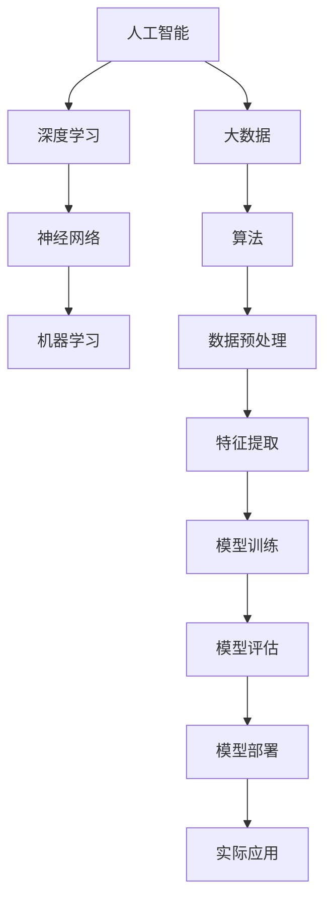

                 

## Andrej Karpathy：人工智能的哲学意义

> 关键词：人工智能、哲学、深度学习、意识、伦理、未来发展趋势

> 摘要：本文将从哲学的角度探讨人工智能（AI）的核心意义。通过分析Andrej Karpathy的观点，本文将探讨AI技术的哲学背景，讨论其与人类意识、伦理学以及未来发展的关系。同时，本文还将结合具体的算法和实际应用案例，深入解析AI技术的现状和挑战，为读者提供全面的哲学视角下的AI思考。

## 1. 背景介绍

### 1.1 目的和范围

本文旨在探讨人工智能在哲学领域的意义，通过分析Andrej Karpathy的观点，探讨AI技术对人类意识、伦理学以及未来发展的深远影响。本文将涵盖以下几个主要方面：

1. **人工智能的哲学背景**：介绍AI技术的发展历程，分析其哲学根源和理论基础。
2. **AI与人类意识**：探讨AI技术如何影响人类意识，以及意识在AI技术发展中的角色。
3. **AI伦理学**：分析AI技术的伦理挑战，讨论伦理原则在AI技术中的应用。
4. **未来发展趋势**：预测AI技术的未来发展趋势，探讨其对社会、经济、政治等领域的潜在影响。
5. **实际应用案例**：通过具体的应用案例，展示AI技术的实际应用场景和挑战。

### 1.2 预期读者

本文适合对人工智能和哲学感兴趣的读者，包括：

1. **AI研究人员和开发者**：希望从哲学角度深入理解AI技术的专业技术人员。
2. **哲学研究者**：关注AI技术对伦理学和意识研究的学者。
3. **普通读者**：对人工智能和哲学有兴趣的公众。

### 1.3 文档结构概述

本文将按照以下结构展开：

1. **背景介绍**：介绍本文的目的、范围和读者对象。
2. **核心概念与联系**：介绍AI技术的核心概念和原理，使用Mermaid流程图展示。
3. **核心算法原理 & 具体操作步骤**：详细讲解AI技术的核心算法原理和操作步骤，使用伪代码进行阐述。
4. **数学模型和公式 & 详细讲解 & 举例说明**：介绍AI技术中的数学模型和公式，并进行详细讲解和举例说明。
5. **项目实战：代码实际案例和详细解释说明**：通过具体的项目实战案例，展示AI技术的实际应用和代码实现。
6. **实际应用场景**：分析AI技术的实际应用场景，讨论其潜在的影响和挑战。
7. **工具和资源推荐**：推荐学习资源、开发工具和框架，以及相关论文著作。
8. **总结：未来发展趋势与挑战**：总结AI技术的未来发展趋势和面临的挑战。
9. **附录：常见问题与解答**：提供关于AI技术的常见问题及其解答。
10. **扩展阅读 & 参考资料**：提供扩展阅读资料和参考文献。

### 1.4 术语表

#### 1.4.1 核心术语定义

- **人工智能（AI）**：一种模拟人类智能的技术，通过计算机程序实现智能行为。
- **深度学习（DL）**：一种基于多层神经网络的学习方法，用于从数据中自动提取特征并进行预测。
- **意识**：个体对自身和外界环境的感知和认知能力。
- **伦理学**：研究道德原则和道德行为的哲学分支。
- **算法**：解决问题的步骤和规则。

#### 1.4.2 相关概念解释

- **神经网络**：一种模仿生物神经系统的计算模型，用于特征提取和学习。
- **大数据**：大量、多样、快速产生的数据，需要特殊的技术和方法进行处理和分析。
- **机器学习（ML）**：一种使计算机系统从数据中学习的方法，分为监督学习、无监督学习和强化学习。
- **深度神经网络（DNN）**：具有多个隐藏层的神经网络，能够处理复杂的非线性问题。

#### 1.4.3 缩略词列表

- **AI**：人工智能
- **DL**：深度学习
- **ML**：机器学习
- **DNN**：深度神经网络
- **GPU**：图形处理器
- **CNN**：卷积神经网络

## 2. 核心概念与联系

在探讨人工智能的哲学意义之前，我们需要了解AI技术的核心概念和原理。以下使用Mermaid流程图展示AI技术的核心概念和联系：



### 2.1 人工智能与深度学习的联系

深度学习是人工智能的一个分支，主要通过多层神经网络实现数据的特征提取和学习。深度学习在图像识别、自然语言处理、语音识别等领域取得了显著的成果，推动了AI技术的发展。

### 2.2 神经网络与机器学习的联系

神经网络是机器学习的基础，通过模拟生物神经系统的结构，实现数据的特征提取和学习。机器学习分为监督学习、无监督学习和强化学习，分别适用于不同的应用场景。

### 2.3 大数据与算法的联系

大数据技术为AI技术提供了丰富的数据资源，使得算法能够从大量数据中提取有用的信息。数据预处理、特征提取和模型训练等算法步骤在大数据时代变得尤为重要。

### 2.4 算法与实际应用的联系

算法是实现AI技术核心功能的关键，通过算法的设计和优化，可以实现各种实际应用，如图像识别、语音识别、自然语言处理等。实际应用场景的不断拓展，推动了算法的不断改进和创新。

## 3. 核心算法原理 & 具体操作步骤

在理解了AI技术的核心概念和联系之后，我们将详细讲解AI技术的核心算法原理和具体操作步骤。以下是深度学习算法的伪代码实现：

```plaintext
// 输入：训练数据集 X，标签 Y，学习率 α，迭代次数 epochs
// 输出：训练完成的模型参数 W

// 初始化模型参数 W
W <- 初始化随机参数

// 循环迭代 epochs 次
for epoch in 1 to epochs do
    // 遍历每个训练样本 (x_i, y_i)
    for (x_i, y_i) in X, Y do
        // 计算预测输出 ŷ_i
        ŷ_i <- forward(x_i, W)

        // 计算损失函数 L(ŷ_i, y_i)
        L <- 损失函数(ŷ_i, y_i)

        // 计算梯度 ∇W
        ∇W <- backward(ŷ_i, y_i)

        // 更新模型参数 W
        W <- W - α * ∇W
    end for
end for

// 返回训练完成的模型参数 W
return W
```

### 3.1 初始化模型参数

在训练深度学习模型时，首先需要初始化模型参数。模型参数包括权重（weights）和偏置（biases）。初始化方法通常有随机初始化、零初始化和归一化初始化等。随机初始化是一种常见的方法，可以防止模型参数在训练过程中出现过拟合。

### 3.2 前向传播

前向传播是指将输入数据通过神经网络层传递，逐层计算每个神经元的输出值。前向传播过程包括以下步骤：

1. **输入层到隐藏层的传递**：将输入数据 x 输入到第一层隐藏层，计算每个隐藏层神经元的输出值。
2. **隐藏层到输出层的传递**：将隐藏层输出值传递到输出层，计算输出层神经元的输出值 ŷ。
3. **激活函数的应用**：在每层神经网络的传递过程中，应用激活函数（如ReLU、Sigmoid、Tanh等），使网络具有非线性特性。

### 3.3 损失函数的计算

损失函数是评估模型预测结果与真实值之间差距的指标。常见的损失函数有均方误差（MSE）、交叉熵损失（Cross-Entropy Loss）等。损失函数的计算公式如下：

$$
L(ŷ_i, y_i) = \begin{cases}
\frac{1}{2} (ŷ_i - y_i)^2 & \text{对于均方误差} \\
- y_i \log(ŷ_i) - (1 - y_i) \log(1 - ŷ_i) & \text{对于交叉熵损失}
\end{cases}
$$

### 3.4 反向传播

反向传播是指将损失函数在输出层反向传播到输入层，计算每个神经元的梯度。反向传播过程包括以下步骤：

1. **计算输出层梯度**：计算输出层每个神经元的梯度 ∇ŷ。
2. **计算隐藏层梯度**：将输出层梯度反向传播到隐藏层，计算每个隐藏层神经元的梯度 ∇h。
3. **更新模型参数**：根据梯度 ∇W，更新模型参数 W。

### 3.5 学习率和迭代次数

学习率（learning rate）是影响模型训练效果的关键参数。学习率过大可能导致模型无法收敛，过小可能导致训练时间过长。通常使用自适应学习率方法，如Adam优化器，以自动调整学习率。

迭代次数（epochs）是指模型在训练集上完整遍历一遍样本的次数。适当的迭代次数可以保证模型充分学习数据，但过多的迭代次数可能导致过拟合。

## 4. 数学模型和公式 & 详细讲解 & 举例说明

在深度学习算法中，数学模型和公式起着至关重要的作用。以下将介绍一些核心的数学模型和公式，并进行详细讲解和举例说明。

### 4.1 激活函数

激活函数是深度神经网络中的重要组成部分，用于引入非线性特性。常见的激活函数有ReLU（Rectified Linear Unit）、Sigmoid、Tanh等。

#### 4.1.1 ReLU函数

ReLU函数是最简单的激活函数，定义如下：

$$
f(x) = \max(0, x)
$$

ReLU函数在 x > 0 时输出 x，否则输出 0。这种非线性特性使得ReLU函数在深度学习模型中应用广泛，有助于加速模型的训练。

#### 4.1.2 Sigmoid函数

Sigmoid函数是一种常用的S型激活函数，定义如下：

$$
f(x) = \frac{1}{1 + e^{-x}}
$$

Sigmoid函数的输出值介于 0 和 1 之间，常用于二分类问题。它的导数在 x = 0 时为 0.5，这使得Sigmoid函数在输入接近 0 时具有较好的线性特性。

#### 4.1.3 Tanh函数

Tanh函数是另一种常用的S型激活函数，定义如下：

$$
f(x) = \frac{e^x - e^{-x}}{e^x + e^{-x}}
$$

Tanh函数的输出值介于 -1 和 1 之间，与Sigmoid函数类似，但具有更好的对称性和线性特性。

### 4.2 损失函数

损失函数是评估模型预测结果与真实值之间差距的指标，是优化模型参数的重要工具。以下介绍两种常见的损失函数：均方误差（MSE）和交叉熵损失（Cross-Entropy Loss）。

#### 4.2.1 均方误差（MSE）

均方误差是回归问题中最常用的损失函数，定义如下：

$$
MSE = \frac{1}{m} \sum_{i=1}^{m} (y_i - \hat{y}_i)^2
$$

其中，$y_i$ 是真实值，$\hat{y}_i$ 是预测值，$m$ 是样本数量。MSE的值越小，表示预测结果越接近真实值。

#### 4.2.2 交叉熵损失（Cross-Entropy Loss）

交叉熵损失是分类问题中最常用的损失函数，定义如下：

$$
Cross-Entropy Loss = - \sum_{i=1}^{m} y_i \log(\hat{y}_i)
$$

其中，$y_i$ 是真实值（0 或 1），$\hat{y}_i$ 是预测值（0 到 1 之间的概率）。交叉熵损失的值越小，表示预测结果越接近真实值。

### 4.3 反向传播算法

反向传播算法是深度学习模型训练的核心算法，用于计算模型参数的梯度。以下介绍反向传播算法的推导过程。

假设我们有一个简单的神经网络，包括一个输入层、一个隐藏层和一个输出层。每个神经元都有一个权重向量 w 和一个偏置 b。

#### 4.3.1 输出层梯度计算

输出层梯度的计算公式如下：

$$
\frac{\partial L}{\partial w} = \frac{\partial L}{\partial \hat{y}} \frac{\partial \hat{y}}{\partial z}
$$

其中，$L$ 是损失函数，$\hat{y}$ 是预测值，$z$ 是输出层神经元的输入。

假设损失函数为均方误差（MSE），则输出层梯度的计算公式如下：

$$
\frac{\partial L}{\partial \hat{y}} = 2(\hat{y} - y)
$$

假设激活函数为 Sigmoid，则输出层梯度的计算公式如下：

$$
\frac{\partial \hat{y}}{\partial z} = \hat{y}(1 - \hat{y})
$$

将上述两个公式代入输出层梯度计算公式，得到：

$$
\frac{\partial L}{\partial w} = 2(\hat{y} - y) \hat{y}(1 - \hat{y})
$$

#### 4.3.2 隐藏层梯度计算

隐藏层梯度的计算公式如下：

$$
\frac{\partial L}{\partial w_h} = \frac{\partial L}{\partial z_h} \frac{\partial z_h}{\partial w}
$$

其中，$z_h$ 是隐藏层神经元的输入。

假设激活函数为 ReLU，则隐藏层梯度的计算公式如下：

$$
\frac{\partial z_h}{\partial w} = \begin{cases}
1 & \text{if } z_h > 0 \\
0 & \text{otherwise}
\end{cases}
$$

将上述公式代入隐藏层梯度计算公式，得到：

$$
\frac{\partial L}{\partial w_h} = \frac{\partial L}{\partial z_h} \begin{cases}
1 & \text{if } z_h > 0 \\
0 & \text{otherwise}
\end{cases}
$$

#### 4.3.3 反向传播算法示例

假设我们有一个简单的神经网络，包括一个输入层、一个隐藏层和一个输出层，输入数据为 x，真实标签为 y，预测值为 ŷ。

1. **前向传播**：

   - 输入层到隐藏层的传递：

     $$ z_h = w_h^T x + b_h $$

   - 隐藏层到输出层的传递：

     $$ z_o = w_o^T h + b_o $$
     
     $$ \hat{y} = f(z_o) $$

2. **计算损失函数**：

   - 假设损失函数为均方误差（MSE）：

     $$ L = \frac{1}{2} (\hat{y} - y)^2 $$

3. **计算输出层梯度**：

   - 假设激活函数为 Sigmoid：

     $$ \frac{\partial L}{\partial \hat{y}} = 2(\hat{y} - y) $$
     
     $$ \frac{\partial \hat{y}}{\partial z_o} = \hat{y}(1 - \hat{y}) $$
     
     $$ \frac{\partial L}{\partial z_o} = 2(\hat{y} - y) \hat{y}(1 - \hat{y}) $$

4. **计算隐藏层梯度**：

   - 假设激活函数为 ReLU：

     $$ \frac{\partial L}{\partial z_h} = \frac{\partial L}{\partial z_o} \frac{\partial z_o}{\partial z_h} $$
     
     $$ \frac{\partial z_o}{\partial z_h} = w_o $$
     
     $$ \frac{\partial L}{\partial z_h} = \begin{cases}
     w_o & \text{if } z_h > 0 \\
     0 & \text{otherwise}
     \end{cases} $$

5. **更新模型参数**：

   - 更新输出层权重：

     $$ w_o = w_o - \alpha \frac{\partial L}{\partial z_o} $$
     
   - 更新隐藏层权重：

     $$ w_h = w_h - \alpha \frac{\partial L}{\partial z_h} $$
     
   - 更新偏置：

     $$ b_o = b_o - \alpha \frac{\partial L}{\partial b_o} $$
     
     $$ b_h = b_h - \alpha \frac{\partial L}{\partial b_h} $$

通过上述示例，我们可以看到反向传播算法的基本流程。在实际应用中，通常会使用更复杂的神经网络结构和优化算法，但基本原理相同。

## 5. 项目实战：代码实际案例和详细解释说明

为了更好地理解深度学习算法的实际应用，我们将通过一个简单的图像分类项目进行实战。本项目的目标是将手写数字图像分类为0到9中的一个数字。以下是项目的具体步骤：

### 5.1 开发环境搭建

在开始项目之前，我们需要搭建一个适合深度学习的开发环境。以下是所需的软件和工具：

- Python（3.6及以上版本）
- TensorFlow 2.x
- Matplotlib
- NumPy
- Pandas

安装上述软件和工具后，我们可以在 Python 中导入所需的库：

```python
import tensorflow as tf
import matplotlib.pyplot as plt
import numpy as np
import pandas as pd
```

### 5.2 源代码详细实现和代码解读

接下来，我们将详细介绍项目中的源代码，并对其逐行进行解读。

```python
# 加载数据集
mnist = tf.keras.datasets.mnist
(x_train, y_train), (x_test, y_test) = mnist.load_data()

# 数据预处理
x_train = x_train / 255.0
x_test = x_test / 255.0

# 将标签转换为独热编码
num_classes = 10
y_train = tf.keras.utils.to_categorical(y_train, num_classes)
y_test = tf.keras.utils.to_categorical(y_test, num_classes)

# 构建模型
model = tf.keras.Sequential([
    tf.keras.layers.Flatten(input_shape=(28, 28)),
    tf.keras.layers.Dense(128, activation='relu'),
    tf.keras.layers.Dropout(0.2),
    tf.keras.layers.Dense(num_classes, activation='softmax')
])

# 编译模型
model.compile(optimizer='adam',
              loss='categorical_crossentropy',
              metrics=['accuracy'])

# 训练模型
model.fit(x_train, y_train, epochs=5, batch_size=32, validation_split=0.1)

# 评估模型
test_loss, test_acc = model.evaluate(x_test, y_test)
print('Test accuracy:', test_acc)

# 可视化训练过程
plt.plot(model.history.history['accuracy'], label='accuracy')
plt.plot(model.history.history['val_accuracy'], label='val_accuracy')
plt.xlabel('Epochs')
plt.ylabel('Accuracy')
plt.legend()
plt.show()
```

### 5.3 代码解读与分析

以下是代码的逐行解读和分析：

1. **加载数据集**：

   ```python
   mnist = tf.keras.datasets.mnist
   (x_train, y_train), (x_test, y_test) = mnist.load_data()
   ```

   使用 TensorFlow 的 Keras API 加载 MNIST 数据集。MNIST 数据集包含70,000个训练样本和10,000个测试样本，每个样本是一个28x28的手写数字图像。

2. **数据预处理**：

   ```python
   x_train = x_train / 255.0
   x_test = x_test / 255.0
   ```

   将图像数据缩放到0到1的范围内，以便于后续的模型训练。

3. **标签转换**：

   ```python
   num_classes = 10
   y_train = tf.keras.utils.to_categorical(y_train, num_classes)
   y_test = tf.keras.utils.to_categorical(y_test, num_classes)
   ```

   将标签转换为独热编码，以便于使用交叉熵损失函数进行模型训练。

4. **构建模型**：

   ```python
   model = tf.keras.Sequential([
       tf.keras.layers.Flatten(input_shape=(28, 28)),
       tf.keras.layers.Dense(128, activation='relu'),
       tf.keras.layers.Dropout(0.2),
       tf.keras.layers.Dense(num_classes, activation='softmax')
   ])
   ```

   构建一个简单的全连接神经网络（Sequential模型），包括以下层：

   - **Flatten层**：将28x28的图像数据展平为一维数组，输入形状为(28, 28)。
   - **Dense层**：一个128个神经元的全连接层，激活函数为ReLU。
   - **Dropout层**：丢弃概率为0.2的Dropout层，用于防止过拟合。
   - **Dense层**：一个num_classes个神经元的全连接层，激活函数为softmax，用于输出每个类别的概率分布。

5. **编译模型**：

   ```python
   model.compile(optimizer='adam',
                 loss='categorical_crossentropy',
                 metrics=['accuracy'])
   ```

   编译模型，指定优化器为Adam，损失函数为交叉熵损失，评价指标为准确率。

6. **训练模型**：

   ```python
   model.fit(x_train, y_train, epochs=5, batch_size=32, validation_split=0.1)
   ```

   使用训练数据训练模型，设置训练轮次（epochs）为5，批量大小（batch_size）为32，验证数据占比为0.1。

7. **评估模型**：

   ```python
   test_loss, test_acc = model.evaluate(x_test, y_test)
   print('Test accuracy:', test_acc)
   ```

   使用测试数据评估模型，输出测试准确率。

8. **可视化训练过程**：

   ```python
   plt.plot(model.history.history['accuracy'], label='accuracy')
   plt.plot(model.history.history['val_accuracy'], label='val_accuracy')
   plt.xlabel('Epochs')
   plt.ylabel('Accuracy')
   plt.legend()
   plt.show()
   ```

   绘制训练过程中的准确率变化曲线，包括训练准确率和验证准确率。

通过上述代码实战，我们实现了对手写数字图像的分类任务，并详细分析了每一步的实现过程和关键参数设置。这个简单的项目展示了深度学习在图像分类任务中的应用，同时也为我们进一步探索更复杂的深度学习模型和应用场景打下了基础。

## 6. 实际应用场景

人工智能（AI）技术已经渗透到我们生活的方方面面，从日常生活的智能助手到复杂工业的自动化生产，AI的应用场景越来越广泛。以下是一些典型的实际应用场景：

### 6.1 日常生活

1. **智能助手**：如Apple的Siri、Google的Google Assistant等，通过语音交互，帮助用户完成日程管理、信息查询、智能家居控制等任务。
2. **智能家居**：如智能音箱、智能灯泡、智能安防系统等，通过物联网技术，实现家居设备的智能连接和自动化控制。
3. **在线教育**：通过智能算法，提供个性化的学习建议和课程推荐，如Khan Academy、Coursera等在线教育平台。

### 6.2 商业领域

1. **推荐系统**：如Amazon、Netflix等电商平台，通过分析用户行为和偏好，实现个性化的商品和内容推荐。
2. **客户服务**：通过聊天机器人，如Apple的iMessage Business Chat、微软的Microsoft Bot Framework等，实现24/7的在线客服。
3. **金融风控**：通过AI技术，实时监控交易行为，识别异常交易，降低金融风险。

### 6.3 工业生产

1. **自动化生产**：通过机器人技术和计算机视觉，实现工厂生产线的自动化，提高生产效率和质量。
2. **设备维护**：通过传感器和数据采集，实时监控设备状态，预测设备故障，降低维护成本。
3. **质量控制**：通过图像识别技术，自动检测产品质量，减少人为错误。

### 6.4 医疗健康

1. **疾病诊断**：通过深度学习算法，辅助医生进行疾病诊断，如肺癌、乳腺癌等。
2. **个性化治疗**：根据患者的基因信息和病情，提供个性化的治疗方案。
3. **医学影像分析**：通过计算机视觉技术，自动分析医学影像，如CT、MRI等，提高诊断准确性。

### 6.5 社会治理

1. **交通管理**：通过智能交通系统，实时监控道路状况，优化交通流量，减少拥堵。
2. **公共安全**：通过视频监控和人脸识别技术，提高公共安全保障，预防犯罪。
3. **环境保护**：通过传感器监测环境数据，实时分析环境变化，实现环境监测和预警。

### 6.6 文化娱乐

1. **虚拟现实（VR）**：通过AI技术，实现更加逼真的VR体验，如游戏、旅游、教育等领域。
2. **智能创作**：如AI绘画、AI音乐等，通过深度学习算法，实现艺术的自动化创作。
3. **内容审核**：通过AI技术，自动识别和过滤不良内容，如暴力、色情等，维护网络环境。

### 6.7 其他领域

1. **农业**：通过无人机和AI技术，实现精准农业，提高农作物的产量和质量。
2. **能源管理**：通过智能电网和AI技术，实现能源的高效利用和优化分配。
3. **物流运输**：通过AI技术，优化物流路线，提高运输效率，降低成本。

## 7. 工具和资源推荐

在探索人工智能（AI）领域时，掌握合适的工具和资源将极大地提升学习效率和实践能力。以下是对学习资源、开发工具框架以及相关论文著作的推荐。

### 7.1 学习资源推荐

#### 7.1.1 书籍推荐

1. **《深度学习》（Goodfellow, Bengio, Courville著）**：
   - 内容详实，涵盖了深度学习的理论基础和应用实例，适合深度学习初学者。

2. **《Python机器学习》（Sebastian Raschka著）**：
   - 介绍了使用Python进行机器学习的实战方法，涵盖了常见的机器学习算法和工具。

3. **《人工智能：一种现代的方法》（Stuart Russell & Peter Norvig著）**：
   - 全面讲解了人工智能的基础知识，包括知识表示、搜索、规划、机器学习等。

#### 7.1.2 在线课程

1. **Coursera上的《深度学习》课程**：
   - Andrew Ng教授主讲的经典课程，深入讲解了深度学习的理论、技术和应用。

2. **edX上的《机器学习基础》课程**：
   - 介绍了机器学习的基本概念和算法，适合初学者入门。

3. **Udacity的《深度学习工程师纳米学位》**：
   - 通过一系列实战项目，培养深度学习项目开发能力。

#### 7.1.3 技术博客和网站

1. **Medium上的 AI博客**：
   - 包含多篇关于AI领域的深度文章，适合持续关注最新动态。

2. **GitHub**：
   - 可以找到大量开源的AI项目和代码，是学习和实践的好资源。

3. **AI汇**：
   - 国内知名的AI技术博客，内容涵盖机器学习、深度学习、自然语言处理等领域。

### 7.2 开发工具框架推荐

1. **TensorFlow**：
   - Google开发的开源深度学习框架，广泛应用于各种AI项目。

2. **PyTorch**：
   - Facebook开发的开源深度学习框架，以动态计算图著称，适用于研究和快速原型开发。

3. **Keras**：
   - 高级神经网络API，可以在TensorFlow和Theano后端运行，易于使用和扩展。

#### 7.2.2 调试和性能分析工具

1. **TensorBoard**：
   - TensorFlow的配套工具，用于可视化训练过程中的性能指标。

2. **PyTorch Profiler**：
   - PyTorch的调试工具，用于分析模型运行时的性能瓶颈。

3. **NVIDIA Nsight**：
   - NVIDIA提供的一套工具集，用于GPU性能分析。

#### 7.2.3 相关框架和库

1. **Scikit-learn**：
   - Python的机器学习库，包含多种经典的机器学习算法和工具。

2. **NumPy**：
   - Python的科学计算库，提供多维数组对象和矩阵运算功能。

3. **Pandas**：
   - Python的数据分析库，提供数据清洗、转换和分析功能。

### 7.3 相关论文著作推荐

#### 7.3.1 经典论文

1. **“Backpropagation”（Rumelhart, Hinton, Williams，1986）**：
   - 介绍了反向传播算法，是深度学习算法的基础。

2. **“A Learning Algorithm for Continually Running Fully Recurrent Neural Networks”（Hopfield，1982）**：
   - 介绍了Hopfield神经网络，用于模式识别和记忆存储。

3. **“Gradient Flow in Neural Networks”（Barak, Sompolinsky，1991）**：
   - 分析了神经网络的梯度流特性，为深度学习算法的优化提供了理论基础。

#### 7.3.2 最新研究成果

1. **“Attention Is All You Need”（Vaswani et al.，2017）**：
   - 提出了Transformer模型，彻底改变了自然语言处理领域。

2. **“Deep Residual Learning for Image Recognition”（He et al.，2016）**：
   - 提出了残差网络（ResNet），显著提高了深度学习模型的性能。

3. **“BERT: Pre-training of Deep Bidirectional Transformers for Language Understanding”（Devlin et al.，2018）**：
   - 提出了BERT模型，是目前自然语言处理领域的领先模型。

#### 7.3.3 应用案例分析

1. **“Facebook AI Research Papers”**：
   - Facebook AI Research团队发布的一系列论文，涵盖深度学习在各种领域的应用。

2. **“Google AI Blog”**：
   - Google AI团队分享的研究成果和案例分析，涉及机器学习、自然语言处理等。

3. **“Deep Learning on Finance”**：
   - 分析深度学习在金融领域的应用案例，包括量化交易、风险评估等。

通过这些工具和资源的推荐，读者可以更加系统地学习和实践人工智能技术，为未来的发展打下坚实的基础。

## 8. 总结：未来发展趋势与挑战

人工智能（AI）技术正在快速发展和变革，其影响遍及各个领域，从日常生活到复杂工业，从社会治理到文化娱乐。在总结本文的内容后，我们可以看到AI技术不仅推动了科技的发展，也引发了深刻的哲学思考。

### 8.1 未来发展趋势

1. **深度学习技术的普及**：随着计算能力的提升和算法的优化，深度学习技术将在更多领域得到应用，如医学、农业、能源等。
2. **自主学习和推理能力的提升**：未来的AI系统将具备更强的自主学习和推理能力，能够更好地适应复杂环境，提高决策水平。
3. **跨学科融合**：AI技术将与心理学、神经科学、哲学等领域深度融合，促进对人类意识和认知的理解。
4. **伦理和法规的完善**：随着AI技术的广泛应用，伦理和法规问题将越来越受到重视，确保技术的可持续发展。

### 8.2 挑战

1. **算法透明性和可解释性**：当前很多AI模型，尤其是深度学习模型，存在“黑箱”现象，缺乏透明性和可解释性，这给应用带来了困难。
2. **隐私和数据安全**：AI技术需要处理大量敏感数据，确保数据隐私和安全成为一大挑战。
3. **人工智能的伦理问题**：AI技术可能引发失业、隐私侵犯、歧视等问题，需要建立相应的伦理和法规框架。
4. **可持续发展**：AI技术的发展需要大量能源和资源，如何实现绿色、可持续的发展是一个重要课题。

### 8.3 结论

AI技术的发展将深刻改变人类社会，带来巨大的机遇和挑战。作为AI领域的从业者，我们应当关注技术的伦理和社会影响，积极推动技术的可持续发展。同时，从哲学的角度思考AI的本质和意义，有助于我们更好地理解和应用AI技术，为未来的发展做出贡献。

## 9. 附录：常见问题与解答

### 9.1 AI技术的基本概念

**Q1. 什么是人工智能（AI）？**
A1. 人工智能（AI）是一种模拟人类智能的技术，通过计算机程序实现智能行为，如学习、推理、感知和决策。

**Q2. 深度学习和机器学习的区别是什么？**
A2. 深度学习是机器学习的一个分支，主要使用多层神经网络进行特征提取和学习。机器学习则是一种更广泛的学习方法，包括监督学习、无监督学习和强化学习。

**Q3. 什么是神经网络？**
A3. 神经网络是一种模拟生物神经系统的计算模型，由多个神经元（或节点）组成，通过权重和偏置进行信息传递和处理。

### 9.2 深度学习应用

**Q4. 深度学习在自然语言处理中有哪些应用？**
A4. 深度学习在自然语言处理（NLP）中有很多应用，如文本分类、情感分析、机器翻译、文本生成等。

**Q5. 深度学习在图像识别中有哪些应用？**
A5. 深度学习在图像识别中有很多应用，如面部识别、物体检测、图像分割、图像生成等。

**Q6. 深度学习在医疗领域有哪些应用？**
A6. 深度学习在医疗领域有很多应用，如疾病诊断、医学影像分析、个性化治疗、健康监测等。

### 9.3 人工智能伦理问题

**Q7. 人工智能的伦理问题有哪些？**
A7. 人工智能的伦理问题包括隐私侵犯、歧视、失业、算法透明性等。

**Q8. 如何确保人工智能的伦理应用？**
A8. 确保人工智能的伦理应用需要建立相关的伦理和法规框架，加强算法透明性、可解释性，并关注社会影响。

**Q9. 人工智能如何影响就业市场？**
A9. 人工智能可能替代一些重复性、低技能的工作，但同时也会创造新的工作岗位，如AI系统的开发、维护和应用等。

## 10. 扩展阅读 & 参考资料

### 10.1 书籍推荐

1. **《人工智能：一种现代的方法》（Stuart Russell & Peter Norvig著）**：全面介绍了人工智能的基础知识。
2. **《深度学习》（Goodfellow, Bengio, Courville著）**：深度学习领域的经典教材。
3. **《Python机器学习》（Sebastian Raschka著）**：使用Python进行机器学习的实战指南。

### 10.2 在线课程

1. **Coursera上的《深度学习》课程**：由Andrew Ng教授主讲。
2. **edX上的《机器学习基础》课程**：适合机器学习初学者。

### 10.3 技术博客和网站

1. **Medium上的 AI博客**：包含多篇关于AI领域的深度文章。
2. **GitHub**：开源的AI项目和代码库。
3. **AI汇**：国内知名的AI技术博客。

### 10.4 论文和报告

1. **“Attention Is All You Need”（Vaswani et al.，2017）**：Transformer模型的奠基论文。
2. **“Deep Residual Learning for Image Recognition”（He et al.，2016）**：ResNet模型的奠基论文。
3. **“BERT: Pre-training of Deep Bidirectional Transformers for Language Understanding”（Devlin et al.，2018）**：BERT模型的奠基论文。

### 10.5 其他资源

1. **TensorFlow官网**：提供深度学习框架和教程。
2. **PyTorch官网**：提供深度学习框架和教程。
3. **Kaggle**：数据科学竞赛平台，包含大量AI项目案例。

